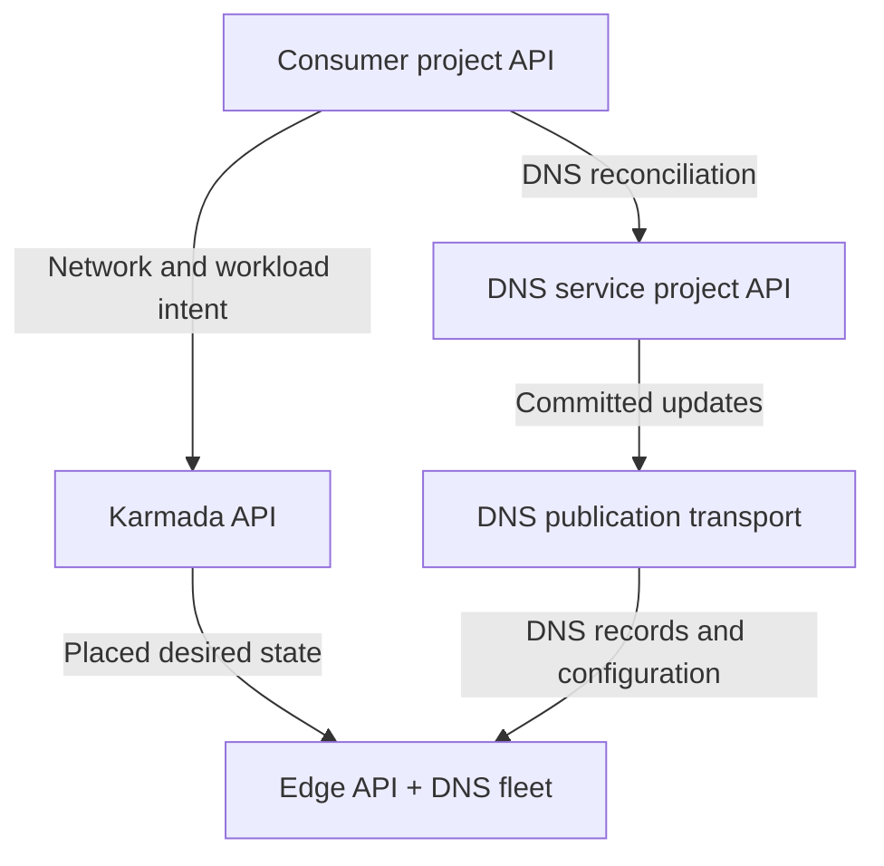
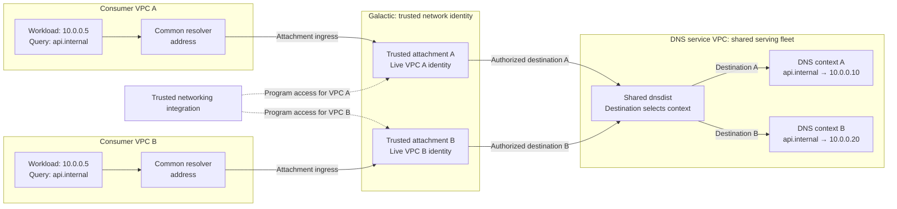

# Internal DNS architecture

Status: Proposed.

The [enhancement](../../../../enhancements/deliver/dns/internal-dns/README.md)
defines the consumer experience. This overview describes how DNS, networking,
and product services integrate. Component designs cover the
[DNS control plane and serving fleet](https://github.com/datum-cloud/dns-operator/blob/docs/internal-dns-architecture/docs/architecture/internal-dns/README.md) and
[Private Service Connect](https://github.com/datum-cloud/galactic/blob/docs/private-service-connect-architecture/docs/enhancements/networking/private-service-connect/README.md).

## Responsibilities and control planes

The DNS service runs in its own VPC and serves many consumer networks through a
shared fleet. Product services such as Compute and Connect publish records and
endpoint eligibility. DNS validates publication rights and owns zones, discovery,
and isolated query serving. Trusted networking integration owns private endpoint
access and workload resolver settings. Galactic enforces the network path.

| Control plane | Responsibility |
| --- | --- |
| Consumer project | Private DNS intent, product record publication, and trusted network-to-DNS context and access declarations. |
| DNS service project | DNS publication coordination, serving assignments, and the service's own network intent. |
| Federation (Karmada) | Network and workload placement and projected desired state. |
| Edge | Local network identities, private endpoint programming, and the shared DNS serving fleet. |

DNS serving acknowledgments return to the DNS service project. Network and
workload observations return through federation. Owning controllers report
consumer status in the project API. DNS publication delivery is separate from
Karmada's network projections.

## Contexts and regional access

One logical network has one DNS context across its locations. The context selects
its managed namespace and associated private zones. Separate contexts can use
overlapping names and addresses. Zone sharing requires explicit associations.

Each serving location has independent access, readiness, and expiration. Losing
access in one region does not remove the context or access elsewhere. Networking
maps logical networks to regional VPCs; DNS treats the consumer identity as
opaque. Regional resolver placement does not select application endpoints.

## Two VPCs and trusted network identity

Both VPCs can use the same client address, resolver address, and query name.
Galactic identifies traffic through the trusted attachment and live VPC identity,
then maps it to an authorized service-side destination. dnsdist selects the DNS
context from that destination. Client source IP and DNS metadata cannot grant
access to a context. Contexts are logical scopes within the shared fleet.
The names and answer addresses above are illustrative.

Networking advertises resolver settings after DNS authorization and private
endpoint programming are ready. The workload runtime applies those settings.
The final well-known resolver addresses and supported client address families
remain release decisions.

## Publication and failure boundaries

Product services publish addresses and eligibility through project DNS APIs.
DNS does not inspect product APIs to infer health. Instance identity follows the
instance lifecycle; service discovery withdraws unhealthy or expired endpoints.
Cached answers can persist until their TTL expires.

Queries use applied serving state without contacting a control plane. Lifetime
and freshness checks prevent stale updates from restoring deleted access or
records. Unknown or unavailable private contexts fail closed. Answers and caches
remain isolated; private names do not fall through to another context or public
DNS. Resolving a name does not grant network access to its destination.
