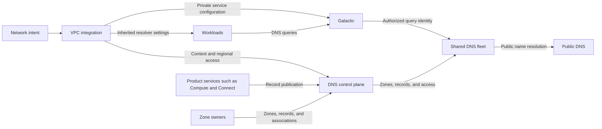

# Internal DNS architecture

Status: Proposed. The core foundation is implemented and validated locally;
edge deployment and production qualification remain.

The [internal DNS enhancement](../../../../enhancements/deliver/dns/internal-dns/README.md)
defines consumer capabilities and release scope. This document defines the
system concepts and integration boundaries. API schemas, configuration examples,
and implementation details belong in the DNS and Galactic repositories.

## Overview

Internal DNS provides private name resolution through a shared, multi-tenant
serving fleet. The DNS service runs in its own VPC. Consumer VPCs reach it through
Galactic private service endpoints at a well-known resolver address. Creating a
VPC adds configuration and authorization data to the fleet.

Record publication and workload resolver configuration are separate paths. The
DNS control plane accepts DNS context, access, and publication contracts. The VPC
integration translates network intent into those contracts.

## System concepts

### DNS context

A DNS context is the isolation boundary that selects the private zones available
to a query. It represents a logical network's DNS scope across its locations.
Each context has a distinct lifetime identity; recreating a network or context
must not inherit authorization from its previous lifetime.

A context can include an automatically managed namespace and several custom
private zones. Zone owners explicitly associate zones with contexts. Separate
contexts can use the same zone apex and record names with independent answers.
Shared zones require explicit associations; network connectivity alone does not
share DNS scope.

The context's consumer identity is opaque to DNS. DNS does not look up VPCs or
network attachments to interpret it. The VPC integration maintains the mapping
between the logical network, its location-specific VPCs, and the DNS context.

### Regional resolver access

Regional resolver access authorizes a network path to a DNS context in a serving
region. A context can have access in several regions without creating separate
DNS deployments.

The VPC integration requests and renews access. DNS confirms that the serving
fleet has applied the current authorization. Access has a bounded validity
period so an abandoned network path cannot retain permission indefinitely.
Removing access in one region does not delete the context or access elsewhere.
The logical network owner controls context deletion.

### Galactic private service access

A VPC groups network attachments under an isolated network identity. An
attachment connects a workload or DNS service replica to that VPC. Galactic uses
trusted attachment state to identify the originating VPC.

A private service endpoint identifies a service-side DNS destination. A service
route policy authorizes selected consumer attachments and maps their well-known
resolver address to that destination. Replies restore the consumer-facing
address. Different VPCs can use the same resolver address while reaching separate
DNS contexts in the shared fleet.

Galactic must enforce the current VPC and attachment lifetimes before forwarding
a query. The DNS service accepts query identity only through the authorized
private path. Tenant-supplied source addresses or DNS metadata cannot select a
different context. Consumers with overlapping addresses remain isolated.

The platform reserves resolver addresses and prevents conflicts with workload
address allocation. Final addresses and supported client address families remain
release decisions.

### Publication ownership

Product services, such as Compute and Connect, publish and maintain records for
their resources and services. Publication authorization limits each publisher to
its assigned context and names. Record publication does not grant network access
to the resolver or to the record's destination.

Zone owners manage custom records. DNS owns the managed namespace, validates
publications, and distributes accepted records to the serving fleet. DNS does
not discover resources independently across product control planes.

## Component responsibilities

- The VPC integration observes network intent, manages context and regional
  access, requests private service configuration, and publishes resolver settings.
- Galactic identifies attachments, enforces private service access, and delivers
  queries and replies to the correct network.
- The DNS control plane manages zones, associations, publisher authorization,
  record distribution, and expiration.
- The shared DNS fleet applies context isolation and serves private and public
  queries.
- Product services publish addresses and endpoint eligibility according to their
  resource and health policies.
- The workload runtime applies inherited resolver settings inside the guest.

These boundaries keep the DNS control plane independent of networking resource
discovery. Products publish records through DNS contracts and obtain workload
resolver configuration through the networking path.

## Network and query lifecycle

1. The VPC integration maps a logical network to a DNS context and requests
   regional resolver access.
2. DNS applies the access authorization to the shared serving fleet. The
   integration requests the corresponding Galactic endpoints and route policies.
3. The integration confirms that authorization and the required consumer and
   producer paths are ready before advertising resolver settings.
4. The networking path supplies those settings to a workload's network
   configuration. The runtime applies them inside the guest.
5. A workload queries its configured resolver. Galactic maps the trusted
   attachment to the authorized service destination. DNS selects the context and
   resolves names from its associated zones.
6. Galactic delivers the response to the originating attachment using the
   consumer-facing resolver address.

Public names resolve through the same service. DNS does not search another
context's zones or send a missing private name to public DNS. If a private zone
cannot be served safely, its queries fail. Answers and cached data remain
isolated between contexts.

Network deletion revokes its regional access and removes its private service
configuration. A recreated network or access binding receives a new lifetime
identity. Delayed operations from the previous lifetime cannot restore access.

## Record lifecycle and discovery

When a supported resource becomes available, its product service publishes its
DNS records. DNS makes accepted records available in the associated contexts.
The publisher updates or removes them when addresses change or resources are
deleted.

Instance names follow instance and address lifecycle. Service discovery names
also follow endpoint eligibility reported by the owning service. Application
health does not automatically remove a running instance's identity record. For
a service with a stable address, the service handles backend health behind that
address.

Connector exports publish services reachable from the consumer VPC. Connecting
a Connector does not automatically publish every service behind it.

DNS withdraws discovery endpoints when the publisher reports them unavailable
or their freshness information expires. Recovered endpoints become eligible
again after a fresh update. If no usable endpoints remain, the name returns no
endpoint addresses. Custom records do not receive automatic health checks.

Record readiness and resolver access readiness are separate. Product services
report DNS readiness so consumers can distinguish an assigned name from a name
that is usable through their network.

## Distributed updates and failure behavior

Multiple product control planes use the same publication contracts. DNS
distributes accepted changes to the serving locations and preserves ownership
during failures and recovery. Updates carry enough lifetime and ordering
information to prevent delayed work from restoring deleted records, replacing
newer state, or changing another context's records.

Serving uses applied configuration without consulting a product control plane
for every query. A control plane outage can delay updates. Existing answers
remain available only while the required record data and access authorization
remain valid. Expiration can reduce availability during a prolonged outage;
DNS must not compensate by serving another context's data.

Cached answers can outlast a withdrawal until their DNS time to live (TTL)
expires. Publication, withdrawal, freshness, and access lifetimes need documented
targets. Applications still need connection retries.

## Validation and remaining work

The local prototype passed 53 checks covering isolated answers for overlapping
tenants, multiple private zones, real Galactic packet translation, distributed
controller takeover, endpoint withdrawal, expiration, and access recreation.
It used a shared serving fleet and a Compute-style publisher.

The fixture supplies some networking statuses and programs service addresses.
It does not qualify the normal router and workload network lifecycle, real
Compute guest configuration, or the actual Compute service publisher.

Before edge deployment, the implementation must provide:

- Normal Galactic address and route lifecycle, including readiness that proves
  the required network paths are programmed. Policy acceptance alone confirms
  valid configuration.
- Typed resolver settings through the networking control plane and their
  application inside a real Compute guest.
- Released component API dependencies and staging-lab deployment configuration.
- Bounded, durable address allocation and safe reclamation.
- Qualified fleet reloads, broker resilience, capacity, and regional failures.

The prototype defaults its new integration paths to disabled. Release scope,
adoption, rollback, and consumer availability targets remain in the enhancement.
