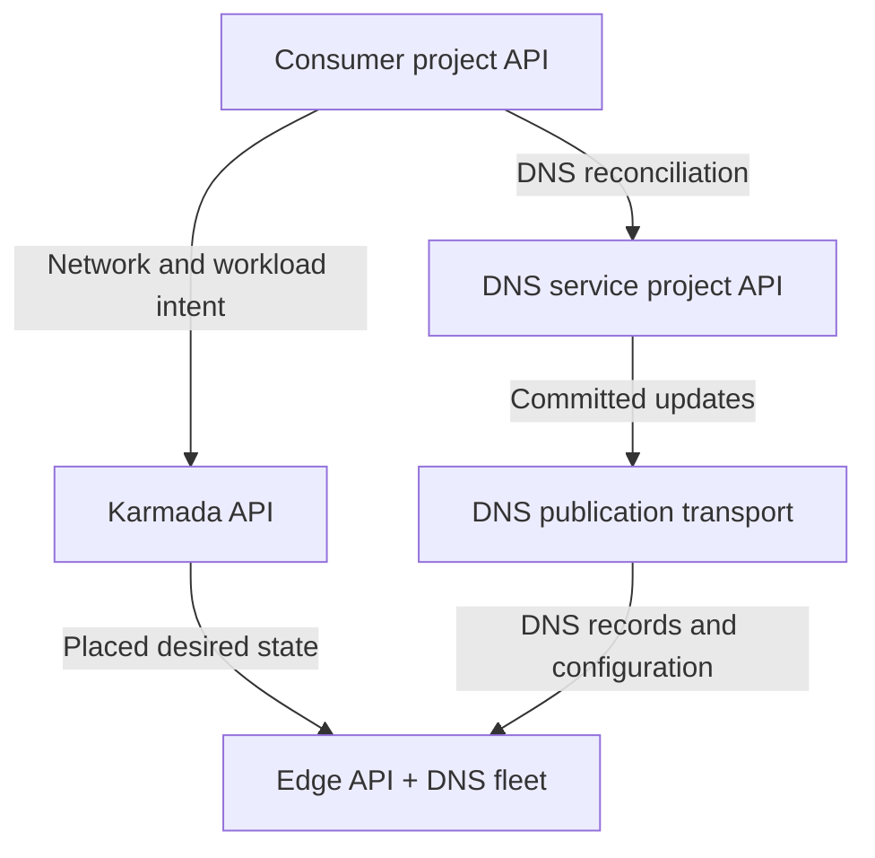
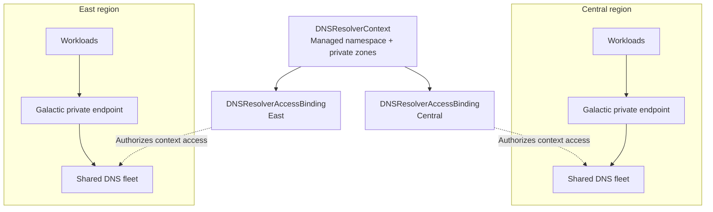
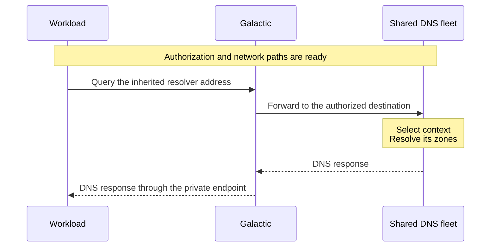
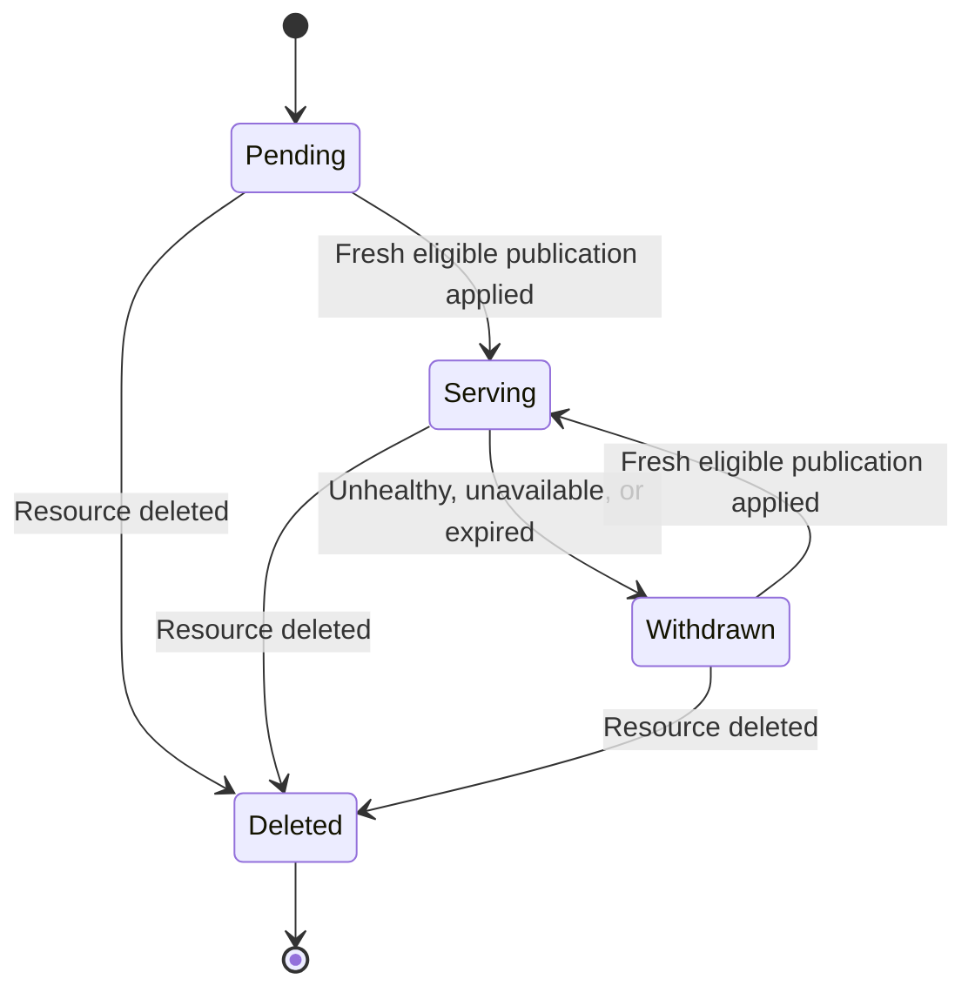

# Internal DNS architecture

Status: Proposed. The foundation is validated locally; edge deployment and
production qualification remain.

The [enhancement](../../../../enhancements/deliver/dns/internal-dns/README.md)
defines consumer capabilities and rollout. This document defines system
boundaries. API schemas and implementation details belong in component repos.

## Control planes

The DNS service runs in its own VPC and serves many consumer networks through a
shared fleet. The following diagram shows API boundaries and update paths.
Controllers can run in a management cluster while writing to these APIs.

DNS acknowledgments return to the service project. Network and workload
observations return through Karmada. Owning controllers project status into the
consumer project.

| Control plane | Resources and ownership |
| --- | --- |
| Consumer project | Private zones, records, associations, managed naming, registrations, grants, and contributions. Trusted networking integration manages `DNSResolverContext` and `DNSResolverAccessBinding`; DNS writes their status. Product services publish records. |
| DNS service project | DNS-owned publication ownership, manifests, chunks, outboxes, internal `DNSResolverBinding` assignments, and allocation claims. Also holds the service's own network intent. |
| Karmada | Network and workload projections, location placement, propagation policies, and selected edge observations. Networking and product controllers own these projections. |
| Edge | Local network contexts, interfaces, VPCs, attachments, `ServiceEndpoint` and `ServiceRoutePolicy` resources, shared serving workloads, and checkpoints. Edge controllers and serving agents own local state. |

DNS coordination retains each consumer's trusted project and source identities.
Controller replicas share authoritative storage for each publication and
serving-plan ownership domain. Product publishers cannot write that storage or
grant resolver access.

Networking `NetworkContext` describes a network at a location;
`DNSResolverContext` defines its DNS scope. Resolver settings needed at the edge
must travel as desired state in the networking projection. The existing
propagation contract does not carry source status. DNS publications follow their
own delivery path.

The networking integration preserves canonical project DNS references when
establishing edge access. The [Private Service Connect design](../../network/private-service-connect/README.md)
defines endpoint authorization, local VPC identities, and network programming.

## Contexts and regional access

One logical network has one DNS context across its locations. That context
selects its managed namespace and associated private zones. Separate contexts
can use overlapping names and addresses. Zone sharing requires explicit
associations.

Access bindings live in the consumer project API. Each has its own serving
target, destination, renewal, deadline, and readiness. Expiring East access
leaves Central access and the context intact. Network or context recreation
receives a new lifetime identity; stale updates cannot restore old access.

The current `region` field identifies the serving target because the project
API can hold access for several regions. Trusted networking integration supplies
it. A future location reference could determine placement instead. Regional
access does not change zone contents or choose nearby application endpoints.
Region-to-cell mapping, resolver failover, and discovery locality remain open.

DNS treats the context's consumer identity as opaque. Networking owns its mapping
to logical networks and regional VPCs. DNS does not discover VPCs or attachments.
Adding a VPC adds data and authorization to the shared fleet.

## Private Service Connect integration

The integration advertises resolver settings only after DNS authorization and
the Private Service Connect path is ready. The workload runtime applies those
settings inside the guest. DNS serving and network readiness are separate gates.

The service-side destination selects the DNS context. Consumer DNS metadata
cannot select another context. The final well-known resolver addresses and
supported client address families remain release decisions.

Public names resolve through the same service. Missing or unavailable private
names do not fall through to another context or public DNS. Answers and caches
remain isolated. Resolving a name does not grant access to its destination.

## Publication and service discovery

Product services such as Compute and Connect publish addresses and endpoint
eligibility through their project DNS APIs. DNS validates ownership, compiles
records, and distributes them to serving locations. Zone owners manage custom
records. Record publication and workload resolver setup are separate paths.

Service discovery follows this lifecycle:

Instance identity names follow instance and address lifecycle; application
health does not automatically remove them. Services with stable addresses manage
backend health themselves. Connector exports publish selected reachable
services. Custom records do not receive automatic health checks.

Serving uses applied state without consulting a product control plane per query.
Lifetime and ordering checks prevent delayed updates from restoring deleted
records or replacing newer state. During an outage, records and access remain
usable only until their validity deadlines. Discovery names with no eligible
endpoints return no endpoint addresses. Unsafe private resolution fails.

Cached answers can persist until their DNS time to live (TTL) expires.
Publication, withdrawal, freshness, and access targets remain release decisions.
Product status distinguishes record readiness from resolver access readiness.

## Deployment status

The local prototype passed 53 checks for tenant isolation, overlapping names,
private zones, Galactic packet translation, controller takeover, withdrawal,
expiration, and recreation. It used two consumer APIs and one platform API,
with location networking scoped inside that platform API. Karmada and an
independent edge API were not part of the test. The fixture supplies some network
statuses and addresses and uses a Compute-style publisher.

Existing infra provides
[Milo project discovery](https://github.com/datum-cloud/infra/blob/5cc5caba5b7f886ca00e7c3ed90726834dac7fac/apps/dns-operator/control-plane/staging/config.yaml),
[NSO's Karmada connection](https://github.com/datum-cloud/infra/blob/5cc5caba5b7f886ca00e7c3ed90726834dac7fac/apps/network-services-operator/control-plane/staging/config.yaml),
and [NetworkContext propagation](https://github.com/datum-cloud/infra/blob/5cc5caba5b7f886ca00e7c3ed90726834dac7fac/apps/network-services-operator/downstream/federated/clusterpropagationpolicy.yaml).
The [DNS platform-project installation](https://github.com/datum-cloud/infra/blob/5cc5caba5b7f886ca00e7c3ed90726834dac7fac/apps/dns-operator/control-plane/staging/platform-project-dns.yaml)
currently targets `datum-cloud`; the separate DNS service project is proposed.

Remaining deployment work:

- Map DNS coordination to the service project and validate Karmada projections
  with an independent edge API. Replace the local resolver annotation with typed
  networking settings.
- Complete normal address and route lifecycle, readiness, real Compute guest
  configuration, and actual product publication.
- Release API dependencies and staging-lab configuration; qualify durable
  allocation, safe reclamation, reload availability, broker resilience, capacity,
  and regional failures.

The new integration paths default to disabled. The enhancement owns release
scope, adoption, rollback, and availability targets.
