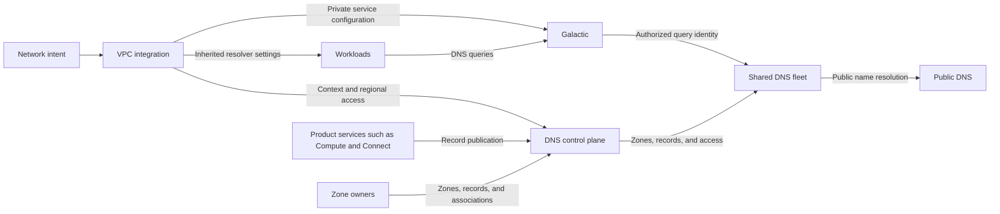
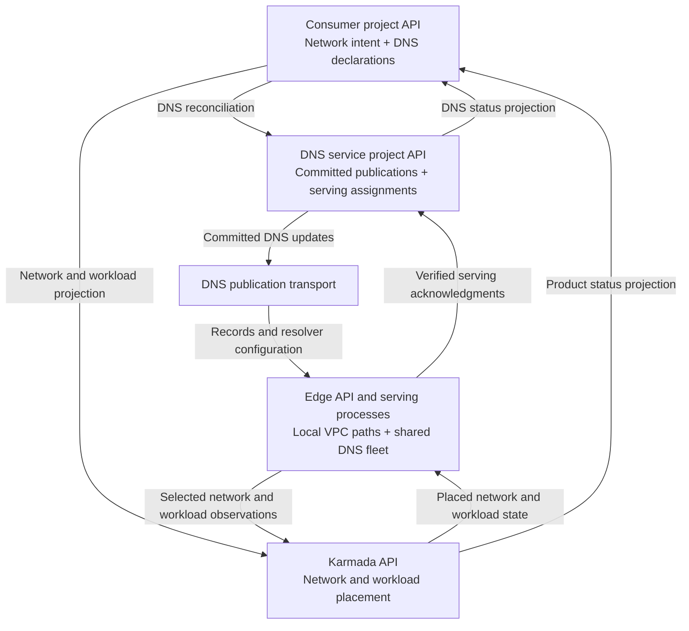

# Internal DNS architecture

Status: Proposed. The core foundation is implemented and validated locally;
edge deployment and production qualification remain.

The [internal DNS enhancement](../../../../enhancements/deliver/dns/internal-dns/README.md)
defines consumer capabilities and release scope. This document defines the
system concepts and integration boundaries. API schemas, configuration examples,
and implementation details belong in the DNS and Galactic repositories.

## Overview

Internal DNS provides private name resolution through a shared, multi-tenant
serving fleet. The DNS service runs in its own VPC. Consumer VPCs reach it through
Galactic private service endpoints at a well-known resolver address. Creating a
VPC adds configuration and authorization data to the fleet.

Record publication and workload resolver configuration are separate paths. The
DNS control plane accepts DNS context, access, and publication contracts. The VPC
integration translates network intent into those contracts.

## Control-plane architecture

The proposal separates four API boundaries. A resource's authoritative API is
the place where its owner records intent or accepted state. Controllers can run
in a management cluster while using credentials for those APIs; the location of
a controller Pod does not determine where its resources live.

| Control plane | Resources and state | Writers |
| --- | --- | --- |
| Consumer project's control plane | Network intent; private zones, records, and associations; DNS contexts and access bindings; registrations, grants, and contributions | Consumers manage permitted intent. Product publishers write their declarations. Trusted networking and DNS controllers manage protected integration resources and status. |
| DNS-service-owned project's control plane | Compiled publications, publication ownership, delivery progress, internal resolver assignments, and DNS allocation state; the DNS service's own network intent | DNS controllers and trusted service infrastructure controllers |
| Federation control plane (Karmada) | Network and workload projections, location placement, propagation policies, and selected edge observations | Networking and product federation controllers; authorized edge write-back controllers |
| Edge control plane | Local network contexts and interfaces; consumer and producer VPCs and attachments; private service endpoints and policies; shared serving workloads and local checkpoints | Edge networking controllers, Galactic, DNS serving agents, and platform deployment automation |

The DNS service's project is a provider-owned project. It can hold state for
many consumer projects. A consumer's zones and publications retain their trusted
project and source identities when DNS compiles them into that shared state.

### Consumer project

`DNSResolverContext` and `DNSResolverAccessBinding` live beside the private
`DNSZone`, `DNSRecordSet`, and `DNSZoneAssociation` resources in the consumer's
project API. `DNSManagedNamespace` exposes automatic naming, and
`DNSNamingPolicy` controls additional names. Product services publish through
`DNSRegistration`, `DNSContributionGrant`, and `DNSRecordContribution`.

The trusted networking integration creates the context and manages access
binding specifications and renewals. DNS writes their status. Keeping these
objects in a consumer project preserves local references and project-scoped
authorization. It does not give product publishers or consumers permission to
grant resolver access.

Consumers choose a network. The integration creates access for that network's
locations; consumers do not specify a region on an access binding themselves.
DNS controllers discover project APIs through the platform's project discovery
and credential lifecycle. One shared controller fleet can reconcile many
projects.

### DNS service project

The proposed home for DNS-owned coordination state is a project managed by the
DNS service. `DNSPublicationOwnership` records the current publication owner.
`DNSPublicationManifest` and `DNSPublicationChunk` hold committed zone content.
`DNSTransportOutbox` records delivery work. Internal `DNSResolverBinding` objects
hold regional serving assignments compiled from consumer access bindings.
Address claims and serving-plan ownership also belong to DNS-owned storage.
Networking-side service destination allocation remains state owned by the VPC
integration; DNS retains separate claims to reject conflicting destinations.

The service's own network intent belongs here and follows the normal networking
path to its regional VPCs. This project owns the shared service; it does not own
consumer network lifetimes or replace their project APIs.

DNS controllers read authorized consumer declarations and commit derived state
here. Regional delivery workers distribute that state and persist serving
acknowledgments independently of customer status projection. Product services
do not write compiled publications, serving assignments, or delivery state.
DNS controller replicas share an authoritative store for each publication and
serving-plan ownership domain. Regional transport and serving replicas can act
independently once they have received valid committed state. Assigning the same
ownership domain to independent API stores would require an additional design.

### Federation control plane

Karmada carries the networking and workload projections needed at the selected
locations. A networking `NetworkContext` describes a network's presence in a
location. It is distinct from `DNSResolverContext`, which defines DNS scope.

The networking integration should include desired resolver settings and the
canonical DNS context and access references in the location's networking
projection. Fields required at the edge must be propagated as desired state;
placing them only in a source object's status would not fit the existing
`NetworkContext` propagation contract.

Karmada places the projection and carries selected edge observations back to the
owning product controllers. Those controllers project customer status. Karmada
does not become the authoritative store for DNS grants, records, publication
ownership, or serving acknowledgments. DNS publications use the DNS delivery
path shown above. Fleet infrastructure may be installed through the existing
edge deployment automation; it does not require duplicating DNS publication
state in Karmada.

### Edge control plane

Edge networking controllers consume the location's desired network state and
allocate interfaces, VPCs, and attachments. The VPC integration resolves the
actual local consumer VPC and creates its `ServiceEndpoint` and
`ServiceRoutePolicy`. The endpoint can select DNS producer attachments in the
service project's edge namespace. The consumer policy and endpoint descriptor
live together in the consumer VPC's namespace.

Local objects have their own API-assigned identities. The integration must pin
the live edge VPC identity when creating a policy and preserve explicit
references to the canonical project DNS context and access binding. Copying a
source UID into a propagated object's metadata does not preserve its lifetime.

Galactic programs the private path from these local objects. DNS agents receive
compiled publications through the DNS transport, apply them to the shared
fleet, and persist local checkpoints and expiration deadlines. They report
verified DNS revisions through the DNS acknowledgment path. Networking readiness
and DNS serving readiness remain separate signals that the integration combines
before advertising a usable resolver.

### Existing infrastructure and prototype placement

The checked infra configuration already provides
[Milo project discovery for DNS](https://github.com/datum-cloud/infra/blob/5cc5caba5b7f886ca00e7c3ed90726834dac7fac/apps/dns-operator/control-plane/staging/config.yaml),
[NSO access to Karmada](https://github.com/datum-cloud/infra/blob/5cc5caba5b7f886ca00e7c3ed90726834dac7fac/apps/network-services-operator/control-plane/staging/config.yaml),
and [location-scoped NetworkContext propagation](https://github.com/datum-cloud/infra/blob/5cc5caba5b7f886ca00e7c3ed90726834dac7fac/apps/network-services-operator/downstream/federated/clusterpropagationpolicy.yaml).
These are integration patterns to reuse, not evidence that internal DNS is
deployed. The existing
[DNS platform-project installation](https://github.com/datum-cloud/infra/blob/5cc5caba5b7f886ca00e7c3ed90726834dac7fac/apps/dns-operator/control-plane/staging/platform-project-dns.yaml)
targets the `datum-cloud` project; a separate DNS-service-owned project is a
proposed deployment boundary.

The local prototype keeps consumer declarations in two independent source APIs
and DNS coordination state in a third platform API. It uses a separate namespace
and credential in that third API for location networking objects. It does not
have a fourth independent edge API or a Karmada deployment.

Mapping the prototype's platform client to the DNS service project, implementing
networking projections through Karmada, and validating an independent edge API
remain deployment work. The current provider-VPC resolver annotation is a local
bridge; it is not the proposed typed federation contract.

## System concepts

### DNS context

A DNS context is the isolation boundary that selects the private zones available
to a query. It represents a logical network's DNS scope across its locations.
Each context has a distinct lifetime identity; recreating a network or context
must not inherit authorization from its previous lifetime.

A context can include an automatically managed namespace and several custom
private zones. Zone owners explicitly associate zones with contexts. Separate
contexts can use the same zone apex and record names with independent answers.
Shared zones require explicit associations; network connectivity alone does not
share DNS scope.

The context's consumer identity is opaque to DNS. DNS does not look up VPCs or
network attachments to interpret it. The VPC integration maintains the mapping
between the logical network, its location-specific VPCs, and the DNS context.

### Regional resolver access

Regional resolver access authorizes a network path to a DNS context in a serving
region. A context can have access in several regions without creating separate
DNS deployments.

The VPC integration requests and renews access. DNS confirms that the serving
fleet has applied the current authorization. Access has a bounded validity
period so an abandoned network path cannot retain permission indefinitely.
Removing access in one region does not delete the context or access elsewhere.
The logical network owner controls context deletion.

#### Why an access binding has a region

The current `DNSResolverAccessBinding.spec.region` identifies the DNS serving
target to which the grant applies. The binding lives in a project API that can
describe access in several regions, so its storage location does not identify
that target. DNS uses the target for serving placement, destination allocation
scope, delivery, and acknowledgment tracking.

For example, one context can have a Central access binding and an East access
binding. Each carries its own service-side destination, renewal sequence,
deadline, and readiness. Expiring East access does not revoke Central access or
change the context's zones. The region does not define tenant identity or choose
regional application endpoints.

The integration obtains placement from trusted network location state. The
current prototype represents that placement as a configured region string. If
the released API uses a serving-location reference or a deployment target that
already determines placement, it can derive the region instead of requiring
duplicate input. The architecture requires an unambiguous serving target; the
current field shape remains subject to API review. Mapping regions to multiple
edge cells and defining cross-region fallback also remain release decisions.

### Galactic private service access

A VPC groups network attachments under an isolated network identity. An
attachment connects a workload or DNS service replica to that VPC. Galactic uses
trusted attachment state to identify the originating VPC.

A private service endpoint identifies a service-side DNS destination. A service
route policy authorizes selected consumer attachments and maps their well-known
resolver address to that destination. Replies restore the consumer-facing
address. Different VPCs can use the same resolver address while reaching separate
DNS contexts in the shared fleet.

Galactic must enforce the current VPC and attachment lifetimes before forwarding
a query. The DNS service accepts query identity only through the authorized
private path. Tenant-supplied source addresses or DNS metadata cannot select a
different context. Consumers with overlapping addresses remain isolated.

The platform reserves resolver addresses and prevents conflicts with workload
address allocation. Final addresses and supported client address families remain
release decisions.

### Publication ownership

Product services, such as Compute and Connect, publish and maintain records for
their resources and services. Publication authorization limits each publisher to
its assigned context and names. Record publication does not grant network access
to the resolver or to the record's destination.

Zone owners manage custom records. DNS owns the managed namespace, validates
publications, and distributes accepted records to the serving fleet. DNS does
not discover resources independently across product control planes.

## Component responsibilities

- The VPC integration observes network intent, manages context and regional
  access, requests private service configuration, and publishes resolver settings.
- Galactic identifies attachments, enforces private service access, and delivers
  queries and replies to the correct network.
- The DNS control plane manages zones, associations, publisher authorization,
  record distribution, and expiration.
- The shared DNS fleet applies context isolation and serves private and public
  queries.
- Product services publish addresses and endpoint eligibility according to their
  resource and health policies.
- The workload runtime applies inherited resolver settings inside the guest.

These boundaries keep the DNS control plane independent of networking resource
discovery. Products publish records through DNS contracts and obtain workload
resolver configuration through the networking path.

## Network and query lifecycle

1. The VPC integration maps a logical network to a DNS context and requests
   regional resolver access.
2. DNS applies the access authorization to the shared serving fleet. The
   integration requests the corresponding Galactic endpoints and route policies.
3. The integration confirms that authorization and the required consumer and
   producer paths are ready before advertising resolver settings.
4. The networking path supplies those settings to a workload's network
   configuration. The runtime applies them inside the guest.
5. A workload queries its configured resolver. Galactic maps the trusted
   attachment to the authorized service destination. DNS selects the context and
   resolves names from its associated zones.
6. Galactic delivers the response to the originating attachment using the
   consumer-facing resolver address.

Public names resolve through the same service. DNS does not search another
context's zones or send a missing private name to public DNS. If a private zone
cannot be served safely, its queries fail. Answers and cached data remain
isolated between contexts.

Network deletion revokes its regional access and removes its private service
configuration. A recreated network or access binding receives a new lifetime
identity. Delayed operations from the previous lifetime cannot restore access.

## Record lifecycle and discovery

When a supported resource becomes available, its product service publishes its
DNS records. DNS makes accepted records available in the associated contexts.
The publisher updates or removes them when addresses change or resources are
deleted.

Instance names follow instance and address lifecycle. Service discovery names
also follow endpoint eligibility reported by the owning service. Application
health does not automatically remove a running instance's identity record. For
a service with a stable address, the service handles backend health behind that
address.

Connector exports publish services reachable from the consumer VPC. Connecting
a Connector does not automatically publish every service behind it.

DNS withdraws discovery endpoints when the publisher reports them unavailable
or their freshness information expires. Recovered endpoints become eligible
again after a fresh update. If no usable endpoints remain, the name returns no
endpoint addresses. Custom records do not receive automatic health checks.

Record readiness and resolver access readiness are separate. Product services
report DNS readiness so consumers can distinguish an assigned name from a name
that is usable through their network.

## Distributed updates and failure behavior

Multiple product control planes use the same publication contracts. DNS
distributes accepted changes to the serving locations and preserves ownership
during failures and recovery. Updates carry enough lifetime and ordering
information to prevent delayed work from restoring deleted records, replacing
newer state, or changing another context's records.

Serving uses applied configuration without consulting a product control plane
for every query. A control plane outage can delay updates. Existing answers
remain available only while the required record data and access authorization
remain valid. Expiration can reduce availability during a prolonged outage;
DNS must not compensate by serving another context's data.

Cached answers can outlast a withdrawal until their DNS time to live (TTL)
expires. Publication, withdrawal, freshness, and access lifetimes need documented
targets. Applications still need connection retries.

## Validation and remaining work

The local prototype passed 53 checks covering isolated answers for overlapping
tenants, multiple private zones, real Galactic packet translation, distributed
controller takeover, endpoint withdrawal, expiration, and access recreation.
It used a shared serving fleet and a Compute-style publisher.

The fixture supplies some networking statuses and programs service addresses.
It does not qualify the normal router and workload network lifecycle, real
Compute guest configuration, or the actual Compute service publisher.

Before edge deployment, the implementation must provide:

- Normal Galactic address and route lifecycle, including readiness that proves
  the required network paths are programmed. Policy acceptance alone confirms
  valid configuration.
- Typed resolver settings through the networking control plane and their
  application inside a real Compute guest.
- Released component API dependencies and staging-lab deployment configuration.
- Bounded, durable address allocation and safe reclamation.
- Qualified fleet reloads, broker resilience, capacity, and regional failures.

The prototype defaults its new integration paths to disabled. Release scope,
adoption, rollback, and consumer availability targets remain in the enhancement.
