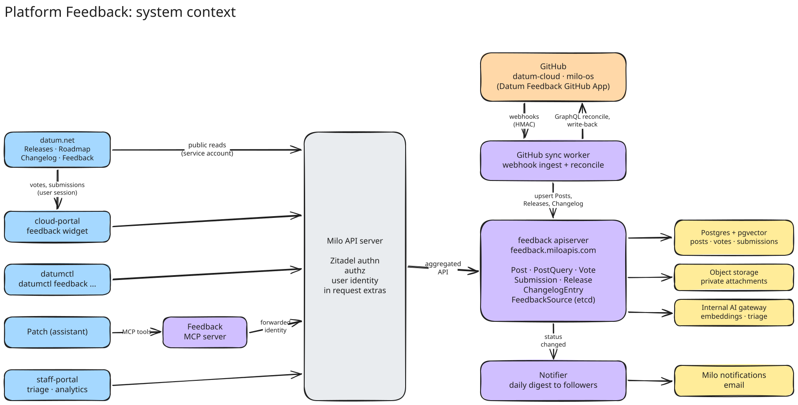
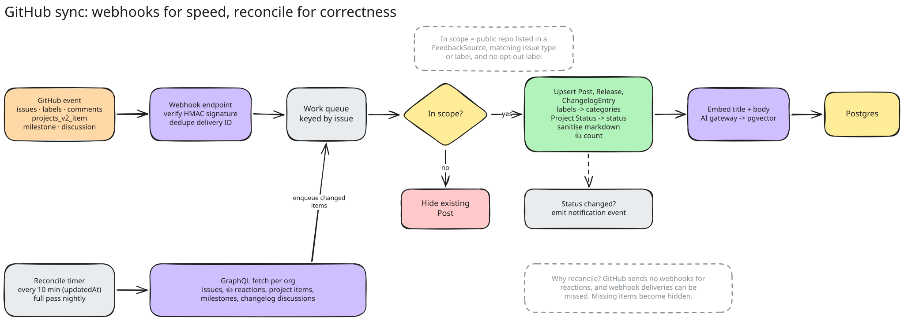
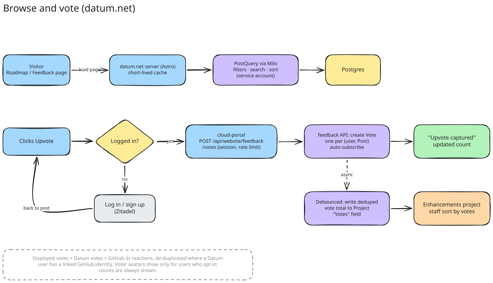
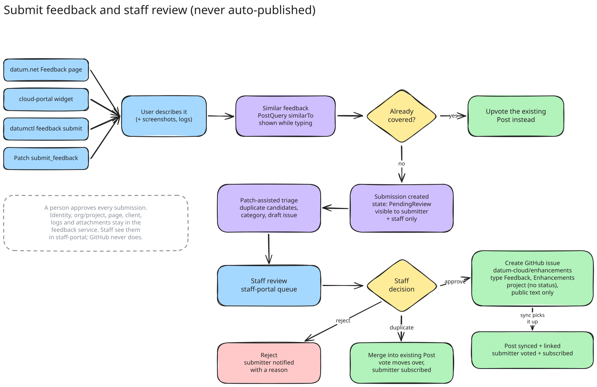
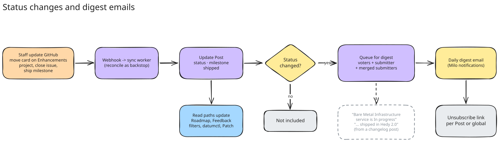

<!-- omit from toc -->
# Platform Feedback: Architecture

- [Summary](#summary)
- [Constraints](#constraints)
- [Architecture](#architecture)
- [API Resources](#api-resources)
  - [FeedbackSource](#feedbacksource)
  - [Post](#post)
  - [PostQuery](#postquery)
  - [Vote](#vote)
  - [Submission](#submission)
  - [Subscription](#subscription)
  - [Release](#release)
  - [ChangelogEntry](#changelogentry)
- [GitHub Sync](#github-sync)
- [Status and Category Mapping](#status-and-category-mapping)
- [Votes](#votes)
- [Submissions and Staff Review](#submissions-and-staff-review)
- [Notifications](#notifications)
- [Clients](#clients)
- [Staff Analytics](#staff-analytics)
- [Security and Privacy](#security-and-privacy)
- [Rollout](#rollout)
- [Production Readiness](#production-readiness)
- [Alternatives](#alternatives)
- [Infrastructure Needed](#infrastructure-needed)
- [Implementation History](#implementation-history)

## Summary

This is the technical design for [Platform Feedback][product], which covers
the product behaviour. It describes how the service is built: an
aggregated API server under Milo (`feedback.miloapis.com`) that syncs
public roadmap issues, milestones and changelog discussions from GitHub,
stores votes and submissions tied to Milo users, and serves the website,
cloud portal, datumctl, Patch and staff portal through one API.

Tracking issue: [datum-cloud/enhancements#889][issue].

[product]: ../../../enhancements/platform/feedback/README.md
[issue]: https://github.com/datum-cloud/enhancements/issues/889

## Constraints

These shape most of the design:

- **GitHub stays the source of truth** for public item content and status.
  The service only writes to GitHub when staff approve a submission and
  when it mirrors vote totals.
- **GitHub sends no webhooks for reactions.** 👍 counts can only be polled,
  so they lag other fields by up to one sweep interval.
- **Webhook delivery is best effort.** Periodic reconciliation is required
  for correctness, not just as a fallback.
- **Only public repositories are synced.** A repository going private
  removes its items on the next reconcile.
- **Submissions are never auto-published.** Only a staff decision can create
  a GitHub issue.
- **Private context never leaves the service.** Submitter identity,
  organization, project, logs and attachments are never written to GitHub.
- **Anonymous website visitors never call Milo.** The datum.net server reads
  on their behalf with a service account.

## Architecture



*System context. The editable sources for every diagram in this document
are the `.excalidraw` files in [`diagrams/`](./diagrams).*

The service follows the `activity` and `search` pattern: an aggregated API
server registered with Milo through an `APIService`, with custom storage.

| Component | Responsibility |
| --- | --- |
| **feedback-apiserver** | Serves `feedback.miloapis.com/v1alpha1`. `FeedbackSource` uses the standard etcd registry; everything else uses custom `rest.Storage` backed by Postgres. |
| **feedback-webhook** | Public HTTPS endpoint for GitHub App webhooks. Verifies `X-Hub-Signature-256`, drops events for private repos, publishes to NATS JetStream. No other processing. |
| **feedback-sync** | Consumes webhook events and runs periodic GraphQL reconciliation. Upserts posts, releases and changelog entries. The only component with GitHub write access: creates approved issues and mirrors vote totals. |
| **feedback-controller** | Runs submission triage, computes embeddings, applies review outcomes, and builds digest emails. |
| **feedback-mcp** | MCP server exposing feedback tools to Patch. |

Backing services:

- **Postgres + pgvector** for posts, votes, submissions, subscriptions,
  releases and changelog entries. Full-text search uses `tsvector`;
  similarity uses pgvector embeddings.
- **NATS JetStream** to buffer webhook events.
- **Internal AI gateway** for embeddings and triage drafts.
- **Object storage** for private attachments.
- **Milo `Email` resources** for digest emails.

**Identity.** User identity reaches the apiserver the same way it reaches
`activity`: Milo authenticates the request and passes the scope in user
extras (`iam.miloapis.com/parent-type`, `parent-name`). User-owned resources
are keyed by the Milo user UID.

**API contexts.**

| Resource | Platform context (staff) | User context | Storage |
| --- | --- | --- | --- |
| `FeedbackSource` | read/write | none | etcd |
| `Post` | read, hide/unhide | read | Postgres |
| `PostQuery` | create | create | not stored |
| `Release`, `ChangelogEntry` | read | read | Postgres |
| `Vote` | list all | CRUD own | Postgres |
| `Submission` | list all, review | create, read own | Postgres |
| `Subscription` | list all | CRUD own | Postgres |

`Post`, `Release` and `ChangelogEntry` are readable by any authenticated
principal, including the datum.net service account.

## API Resources

> [!NOTE]
> Field names and shapes are illustrative and will change during
> implementation.

### FeedbackSource

One per GitHub org. Defines what to sync and how to map it.

```yaml
apiVersion: feedback.miloapis.com/v1alpha1
kind: FeedbackSource
metadata:
  name: datum-cloud
spec:
  github:
    org: datum-cloud
    installationID: 12345678
    repositories:              # private repos are always skipped
      include: ["*"]
      exclude: ["infra", "staff-portal"]
    issues:                    # any match includes
      issueTypes: ["Enhancement", "Feedback", "Bug"]
      labels: ["Build", "Deliver", "Connect", "Platform Features"]
      excludeLabels: ["feedback:hide"]
    project:                   # the Enhancements project
      owner: datum-cloud
      number: 22
      statusField: Status
      votesField: Votes        # number field the service writes to
    milestones:
      repository: enhancements # source for Release resources
    changelog:
      repository: datum
      discussionCategory: changelog
  statusMapping:
    "": none
    "Backlog": backlog
    "Planning": planning
    "On Deck": on-deck
    "In Progress": in-progress
    "Done": shipped
  categoryMapping:
    "Build": build
    "Deliver": deliver
    "Connect": connect
    "Platform Features": platform
    "Infrastructure": infrastructure
    "AX/DX/UX": experience     # used on changelog discussions
status:
  conditions:
    - type: Ready
      status: "True"
  lastWebhookAt: "2026-10-08T12:03:11Z"
  lastReconcile:
    completedAt: "2026-10-08T12:00:00Z"
    postsSynced: 412
  rateLimit:
    remaining: 4710
    resetAt: "2026-10-08T13:00:00Z"
```

The `milo-os` source has its own repositories but points `project` at the
same Enhancements project (`owner: datum-cloud`, `number: 22`), so both
orgs share one set of statuses and one Votes field. It has no `milestones`
or `changelog` block.

### Post

A public item synced from a GitHub issue. Every `Post` is backed by a GitHub
issue; unreviewed feedback is a `Submission`, never a `Post`. Posts are
read-only through the API except for staff hiding.

```yaml
apiVersion: feedback.miloapis.com/v1alpha1
kind: Post
metadata:
  name: datum-cloud.enhancements.912
spec:
  hidden: false              # staff-only toggle
status:
  title: Bare Metal Infrastructure service
  summary: Expands Datum's platform to support full lifecycle management ...
  bodyHTML: "<h3>High-Level Summary</h3><p>This enhancement ...</p>"
  status: in-progress
  categories: [build]
  labels: [Build]
  issueType: Enhancement
  github:
    org: datum-cloud
    repository: enhancements
    number: 912
    url: https://github.com/datum-cloud/enhancements/issues/912
    state: open
    createdAt: "2026-09-30T14:12:00Z"
    updatedAt: "2026-10-07T09:40:00Z"
  release: hedy-2-0          # set when the issue is on a milestone
  votes:
    total: 9                 # datum + github, deduped where linked
    datum: 6
    github: 4
    trendingScore: 3.42
  publicVoters:              # only users who opted in, max 10
    - displayName: Ada L.
      avatarURL: https://...
  lastSyncedAt: "2026-10-08T12:00:00Z"
```

### PostQuery

A create-to-query resource like `ActivityQuery` and `ResourceSearchQuery`.
It is not persisted; `status` carries results and facets.

```yaml
apiVersion: feedback.miloapis.com/v1alpha1
kind: PostQuery
spec:
  text: wildcard hostnames         # full-text search, optional
  similarTo: |                     # draft feedback text, optional
    I want to route *.example.com to one ALB
  filter:
    status: [planning, on-deck, in-progress]
    categories: [deliver]
    orgs: [datum-cloud, milo-os]
    votedByMe: false               # user context only
  sort: top                        # top | newest | trending | relevance
  limit: 20
  continue: ""
  facets: [status, categories]
status:
  results:
    - name: datum-cloud.enhancements.913
      title: Wildcard hostnames on ALBs
      status: on-deck
      categories: [deliver]
      votes: {total: 12}
      votedByMe: true
      score: 0.91                  # relevance or similarity, when used
  facets:
    status: {none: 40, backlog: 85, planning: 12, on-deck: 6, in-progress: 9}
    categories: {build: 30, deliver: 41, connect: 22, platform: 18}
  continue: "eyJvZmZzZXQiOjIwfQ"
```

Sorts:

- `top`: `votes.total` descending.
- `newest`: GitHub `createdAt` descending.
- `trending`: vote weights with a 7-day half-life, `Σ 0.5^(age_days / 7)`,
  over Datum votes and GitHub reactions. Updated on vote write and
  refreshed hourly.
- `relevance`: default when `text` or `similarTo` is set.

`similarTo` embeds the text through the AI gateway and runs a pgvector
nearest-neighbour search, blended with full-text rank. It drives the
"similar feedback" list and the duplicate checks in datumctl and Patch.

### Vote

User context. The name is the post name, so a user can only vote once per
post. Deleting it removes the vote.

```yaml
apiVersion: feedback.miloapis.com/v1alpha1
kind: Vote
metadata:
  name: datum-cloud.enhancements.912
spec:
  postRef:
    name: datum-cloud.enhancements.912
  source: website            # website | portal | datumctl | patch
status:
  createdAt: "2026-10-08T12:05:00Z"
  organizations: [acme-corp] # recorded for staff analytics, never public
```

Creating a `Vote` also creates a `Subscription` to the post.

### Submission

User context for the submitter, Platform context for staff.

```yaml
apiVersion: feedback.miloapis.com/v1alpha1
kind: Submission
metadata:
  name: sub-7f3k2
spec:
  kind: idea                  # idea | bug | other
  title: Let me pick the region for Galactic VPC attachments
  body: |
    When I attach a VPC I can't choose which region ...
  attachments:
    - name: screenshot.png
      contentType: image/png
      uploadRef: att-91ac      # uploaded through the attachments subresource
  context:                     # private, never sent to GitHub
    client: portal             # website | portal | datumctl | patch
    pageURL: https://cloud.datum.net/org/acme/projects/web/vpc
    organization: acme-corp
    project: web
    requestIDs: [req-01HZX...]
    clientVersion: cloud-portal@2026.10.1
status:
  phase: PendingReview        # PendingReview | Approved | Merged | Rejected
  triage:                     # advisory, written by the controller
    suggestedCategories: [connect]
    suggestedKind: idea
    similarPosts:
      - name: datum-cloud.enhancements.840
        score: 0.88
    draftIssue:
      title: Region selection for Galactic VPC attachments
      body: "### Summary\n..."
    fraudScore: 0.02
  review:                     # written through the review subresource
    reviewer: staff:jdoe@datum.net
    decision: Approved        # Approved | Merged | Rejected
    reviewedAt: "2026-10-09T10:00:00Z"
    publicTitle: Region selection for Galactic VPC attachments
    publicBody: "..."         # staff-edited, what goes to GitHub
    mergedInto: ""            # post name when decision is Merged
    reason: ""                # shown to submitter when Rejected
  postRef:
    name: datum-cloud.enhancements.931
```

Submitters can read their own `phase`, `postRef` and rejection `reason`.
They cannot read `triage`, `fraudScore` or the reviewer.

### Subscription

Links a user to a post they follow. Created when a user votes or when their
submission is approved or merged; users can delete it.

```yaml
apiVersion: feedback.miloapis.com/v1alpha1
kind: Subscription
metadata:
  name: datum-cloud.enhancements.912
spec:
  postRef:
    name: datum-cloud.enhancements.912
  reason: voted               # voted | submitted | merged | manual
```

### Release

Maps to a milestone in `datum-cloud/enhancements`, which is what datum.net's
`githubRoadmap.ts` reads today.

```yaml
apiVersion: feedback.miloapis.com/v1alpha1
kind: Release
metadata:
  name: hedy-2-0
status:
  title: "Hedy: 2.0"
  codename: Hedy
  version: "2.0"
  dueOn: "2026-10-31"
  shipped: false              # milestone closed
  descriptionHTML: "<p>...</p>"
  coverImage: hedy-2-0        # key into website assets
  posts:
    - datum-cloud.enhancements.912
    - datum-cloud.enhancements.913
  github:
    url: https://github.com/datum-cloud/enhancements/milestone/14
    number: 14
```

Cover images stay as static website assets keyed by release name.

### ChangelogEntry

Maps to a discussion in the `changelog` category of `datum-cloud/datum`,
which is where changelog posts are written today and what datum.net's
`changelogs()` in `src/libs/datum.ts` reads.

```yaml
apiVersion: feedback.miloapis.com/v1alpha1
kind: ChangelogEntry
metadata:
  name: datum-cloud.datum.303
status:
  title: "Application Load Balancer: wildcard hostnames"
  publishedAt: "2026-10-07T13:23:39Z"
  categories: [deliver]       # from discussion labels via categoryMapping
  bodyHTML: "<p>...</p>"      # sanitised, like Post bodies
  posts:                      # issues referenced in the body
    - datum-cloud.enhancements.913
  reactions: {thumbsUp: 4}
  github:
    url: https://github.com/datum-cloud/datum/discussions/303
    number: 303
```

- Bodies are free-form markdown; Changed/New/Fixed groups are headings in
  the post, not parsed fields.
- Linked posts come from issue references in the body (`#913`,
  `datum-cloud/enhancements#913`, or full issue URLs). A new link queues a
  "shipped" update for that post's followers.
- Moving a discussion out of the `changelog` category hides the entry.

## GitHub Sync



*Webhook and reconcile paths share the same upsert logic.*

**GitHub App.** One app, "Datum Feedback", installed on `datum-cloud` and
`milo-os`. Permissions:

- Issues: read/write (write to create approved issues)
- Metadata: read
- Organization projects: read/write on `datum-cloud` (write for the Votes
  field)
- Discussions: read (changelog)

It replaces the app datum.net uses today once datum.net is migrated.

**Webhooks.** `issues`, `label`, `issue_comment` (comment counts only),
`projects_v2_item`, `milestone`, `discussion`, and `repository` (visibility
changes). Events are published to a JetStream subject keyed by
`org/repo/number` so events for one item are processed in order. Project
item events arrive through the `datum-cloud` installation for issues in
either org.

**Upsert.** The sync worker re-fetches the item through GraphQL rather than
trusting the webhook payload. That keeps one code path for webhooks and
reconciliation and picks up fields payloads lack (project Status, issue
type, `bodyHTML`). It then applies the source's include/exclude rules, maps
status and categories, sanitises HTML, re-embeds if title or body changed,
and upserts. If an item no longer matches (label removed, repo private,
issue deleted) the `Post` is removed and its votes are kept for 30 days in
case it returns.

**Reconciliation.**

- Every 10 minutes per source: GraphQL search `updated:>{last}` across
  included repos.
- Every 30 minutes: 👍 sweep over tracked open posts, 100 issues per query
  (`reactions(content: THUMBS_UP) { totalCount }`). Reactor logins are only
  fetched when a count changed.
- Nightly: full sweep of every included repo, removing posts that no longer
  match.
- On demand: the `feedback.miloapis.com/resync-requested-at` annotation on a
  `FeedbackSource` triggers a full sweep.

**Write-back.** Two cases only: creating an issue for an approved
submission, and setting the Enhancements project's `Votes` field to
`votes.total` when it changes (debounced to once per minute per issue).

## Status and Category Mapping

Status comes from the Enhancements project's Status field, with issue state
as a fallback when an issue isn't on the project:

| Project Status | Issue state | Post status |
| --- | --- | --- |
| (not set) | open | `none` |
| Backlog | open | `backlog` |
| Planning | open | `planning` |
| On Deck | open | `on-deck` |
| In Progress | open | `in-progress` |
| Done | any | `shipped` |
| any | closed as completed | `shipped` |
| any | closed as not planned | `closed` |

Categories come from labels via `categoryMapping`. `datum-cloud` has
`Build`, `Deliver`, `Connect` and `Platform Features` today. `Infrastructure`
needs creating in both orgs. `milo-os` repos use generic labels (`bug`,
`enhancement`), so `milo-os` posts will have no category until they're
labelled with the shared set.

## Votes



*Anonymous browse, login gate, vote, and the total mirrored to GitHub.*

```
total = datum_votes + github_thumbs_up - linked_overlap
```

`linked_overlap` counts people who did both. Milo records linked external
identities as `UserIdentity` resources (`providerName: GitHub`, with the
GitHub `username`). When the 👍 sweep fetches reactor logins, the service
matches them against the linked GitHub usernames of users who voted on that
post.

Matching is by login, so it misses people without a linked account and
people who renamed their GitHub account. Both are counted twice; the
product decision accepts this.

- Votes require a signed-in user with a verified email.
- Votes on a post merged into another move to the target post.
- **Public voter avatars** are opt-in per user (`showPublicVotes`), stored on
  Milo's `UserPreference` if it can carry service settings, otherwise on a
  `FeedbackProfile` in the User context. Changing it applies to past votes.

## Submissions and Staff Review



*Every submission waits for a staff decision.*

1. **Draft.** The client calls `PostQuery` with `similarTo` as the user types
   (debounced) and shows similar items.
2. **Submit.** The client uploads attachments to the
   `submissions/attachments` subresource (size and type limits enforced,
   stored in private object storage), then creates the `Submission`
   referencing them. Clients fill `context` where they can. Rate limit:
   start with the website route's 5 per 10 minutes per user.
3. **Triage.** The controller fills `status.triage`: similar posts, suggested
   kind and categories, a draft public title and body with private details
   stripped (via the AI gateway), and a fraud score from the fraud service.
   Advisory only.
4. **Review.** Staff work the queue in the staff portal and write a decision
   through the `submissions/review` subresource, which is only authorised in
   the Platform context. Patch, the controller and users can't approve.
   - **Approve**: staff edit `publicTitle`/`publicBody` (defaulting to the
     triage draft). The sync worker creates an issue in
     `datum-cloud/enhancements` with issue type `Feedback`, adds it to the
     Enhancements project with no Status, and sets `status.postRef` once the
     `Post` syncs. The submitter gets a `Vote` and `Subscription`.
   - **Merge**: staff pick an existing post. The submitter gets a `Vote` (if
     they don't have one) and a `Subscription`. The submission keeps its
     private context so staff can see everyone who asked.
   - **Reject**: staff give a reason, which the submitter sees.
5. **Notify.** The outcome is queued for the submitter's next digest.

The GitHub issue body never contains the submitter's identity, org, project,
logs or attachments. A footer links to the submission in the staff portal,
which only staff can open.

## Notifications



*Changes are queued per follower and sent as a daily digest.*

Followers get a **daily digest**, not one email per change.

- When a followed post changes `status`, is added to a release, or is linked
  from a new changelog entry, the controller appends an event to each
  follower's pending queue in Postgres. Submission outcomes are queued the
  same way for the submitter.
- Once a day the controller collapses each user's queue (one line per post,
  latest status wins) and creates a single Milo `Email` from a feedback
  `EmailTemplate` (see [email
  integration](../../../enhancements/platform/email-integration/simple-email-sending/README.md)).
  Users with an empty queue get nothing.
- Edits, label changes and comments are never queued.
- Every digest links to unfollow each post and to turn off feedback emails
  globally.

The send time is fixed at first (one UTC hour, configured on the
controller). Per-user send times can come later.

## Clients

**datum.net.** The website server reads `Post`, `PostQuery`, `Release` and
`ChangelogEntry` with a Milo service account and a 60-second in-process
cache. User actions go through the cloud portal's existing website routes,
which already handle session, CORS and rate limiting:

- `POST /api/website/feedback` creates a `Submission` (replacing today's log
  sink, `log-feedback-sink.ts`).
- `POST` / `DELETE /api/website/feedback/votes/{post}` create and delete a
  `Vote`.
- `GET /api/website/feedback/me` returns the user's votes and submissions so
  pages render the voted state.

Once migrated, `src/libs/githubRoadmap.ts`, the GitHub parts of
`src/libs/datum.ts`, the backlog pages' GitHub calls, the Redis roadmap
cache and the GitHub App credentials are removed from datum.net.

**Cloud portal.** A feedback panel on every page, plus browse and vote
views. It calls Milo with the user's token in the User context
(`/apis/iam.miloapis.com/v1alpha1/users/{id}/control-plane`) through a
generated SDK under `app/modules/control-plane/feedback`, and fills
`Submission.spec.context` with org, project, route, recent request IDs and
portal version.

**datumctl.**

```
datumctl feedback search "wildcard hostnames"
datumctl feedback list --status in-progress --category deliver --sort top
datumctl feedback show datum-cloud.enhancements.913
datumctl feedback vote datum-cloud.enhancements.913
datumctl feedback unvote datum-cloud.enhancements.913
datumctl feedback submit --title "..." --body-file notes.md --attach err.log
datumctl feedback submissions
```

`submit` runs a `similarTo` query first and asks whether a match covers it.
Context includes the datumctl version and active org and project.

**Patch.** `feedback-mcp` exposes `feedback__search` (including
`similarTo`), `feedback__get`, `feedback__vote`, `feedback__unvote`,
`feedback__submit` (always confirmed by the user in chat) and
`feedback__my_submissions`.

`CapabilityBinding`s are per project, but feedback belongs to the user. We
register feedback as a platform service entitled for every project so a
binding always exists, and add the `feedback-mcp` host to
`IdentityForwardHosts` so calls run as the user. The tools ignore project
scope.

Patch's existing capability-gap reports (`internal/gapreport`) stay
separate and are not turned into submissions.

## Staff Analytics

The staff portal reads `Vote`, `Submission` and `Post` in the Platform
context for:

- the review queue;
- per-post voters, their organizations and submission context;
- top posts by number of distinct organizations;
- per-organization view of everything voted on or submitted.

## Security and Privacy

| Risk | Mitigation |
| --- | --- |
| Spam, abuse or PII reaching public GitHub | No auto-publish. Staff edit the public title and body before approval. Private context is never copied. Per-user rate limits; fraud score in the queue. |
| Vote stuffing | One vote per Milo user per post; verified email required; analytics show voter distribution by org. |
| Stored XSS from issue or discussion bodies | Server-side allow-list sanitisation; clients render only the sanitised HTML. |
| Exposing something sensitive from a public repo | `feedback:hide` label, per-source repo allow and deny lists, staff `spec.hidden`. |
| Leaking private attachments | Private bucket, served only through the apiserver to the submitter and staff. |
| Approval bypass | Review subresource authorised only for staff in the Platform context. |
| GitHub rate limits | Installation tokens per org, GraphQL batching, incremental reconcile, 👍 sweep limited to open tracked posts. |

## Rollout

Matches the [product rollout][product]:

1. **Read.** `FeedbackSource` for both orgs, GitHub App, webhook endpoint,
   sync worker, `Post`, `PostQuery`, `Release`, `ChangelogEntry`. datum.net
   pages move to the service behind a flag, side by side with the old
   code, then its GitHub integration is removed.
2. **Vote.** `Vote`, `Subscription`, 👍 sweep and dedupe, Votes field
   mirroring, website login gate, daily digest, avatar opt-in.
3. **Submit.** `Submission`, attachments, `similarTo`, triage, staff review
   queue, issue creation on approval, website submit form.
4. **Everywhere.** Portal panel, `datumctl feedback`, Patch MCP tools, staff
   analytics.

## Production Readiness

**Enablement and rollback.** Each client gates its UI behind a feature flag.
GitHub write-back (issue creation and Votes field) has its own flag on the
sync worker. Votes and submissions are retained while clients are
disabled. datum.net keeps its old GitHub credentials until phase 1 has been
stable for two weeks, so rollback is a redeploy. Database migrations are
forward-only and applied before the apiserver rolls out, as `activity`
does.

**Monitoring.**

- Sync lag from GitHub `updatedAt` to `Post` update (p50, p99).
- Webhook deliveries received, rejected (bad signature) and failed.
- Reconcile duration, items changed and errors per source.
- GitHub rate limit remaining per installation.
- Review queue size and age of the oldest pending submission.
- Digest emails created and failed.
- API latency and errors per resource, especially `PostQuery`.

Alerts: reconcile failing three runs in a row, rate limit under 10%, oldest
pending submission older than five business days, digest run failing.

**Dependencies and degradation.**

| Dependency | If unavailable |
| --- | --- |
| GitHub API / webhooks | Data goes stale; reads keep working. |
| Postgres + pgvector | Service unavailable. |
| NATS JetStream | Webhooks are lost; reconcile catches up. |
| AI gateway | `similarTo` falls back to full-text; triage is empty. |
| Milo email | Digests retry next run. |
| Object storage | Submissions without attachments still work. |
| Fraud service | Triage has no fraud score. |

**Scalability.** About 1,700 open issues across both orgs today, not all of
which become posts; votes and submissions are bounded by user count. One
Postgres instance is enough for the foreseeable future. `similarTo` is the
most expensive call (an embedding plus a vector search), so clients debounce
it and the apiserver rate limits it per user. The GitHub GraphQL budget
(at least 5,000 points per hour per installation) comfortably covers the
reconcile and sweep schedule.

**Troubleshooting.**

- `FeedbackSource` status shows last webhook, last reconcile, items synced
  and rate limit.
- Force a full resync with the `resync-requested-at` annotation.
- GitHub's App settings show webhook delivery history and allow redelivery.
- A missing post: check the source's include/exclude rules, the
  `feedback:hide` label, repo visibility and `spec.hidden`.

<<[UNRESOLVED embedding model]>>
Which embedding model and dimension the AI gateway will serve for this.
Changing it later means re-embedding all posts, which is cheap at this size.
<<[/UNRESOLVED]>>

## Alternatives

**CRDs in etcd instead of an aggregated apiserver.** Fine for
`FeedbackSource`, but full-text and similarity search, vote aggregation and
trending sorts don't fit etcd and label selectors. Same reason `activity`
and `search` use custom storage.

**Index posts in the existing search service (Meilisearch).** It would give
full-text search for free, but votes, submissions and subscriptions need a
transactional store anyway. One Postgres database with `tsvector` and
pgvector keeps a single source of truth. Revisit if search quality needs
more than Postgres offers.

**Each client calls GitHub directly.** What datum.net does today. Separate
credentials, caches and status logic per client, no shared votes, no
private context, and nothing for datumctl or Patch.

**Use GitHub reactions as the only votes.** Requires a GitHub account and
can't tie demand to Datum users or organizations.

## Infrastructure Needed

- GitHub App installed on `datum-cloud` and `milo-os`, credentials in the
  secrets store.
- Postgres with the pgvector extension.
- Public HTTPS route for the webhook endpoint.
- NATS JetStream stream for webhook events.
- Private object storage bucket for attachments.
- `Votes` number field on the Enhancements project, and an `Infrastructure`
  label in both orgs.
- Feedback digest `EmailTemplate`.

## Implementation History

- 2026-09-17: [datum-cloud/enhancements#889][issue] opened.
- 2026-10-09: Product enhancement merged
  ([#923](https://github.com/datum-cloud/enhancements/pull/923)).
- 2026-10-09: Architecture proposal.
