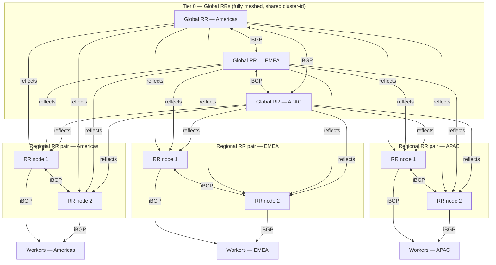
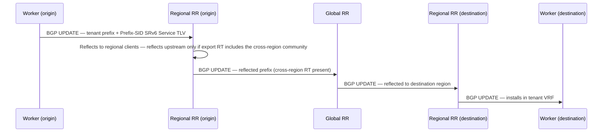

# BGP control plane design — Galactic VPC

## Overview

This document describes the BGP control plane architecture for Datum's Galactic VPC fabric. The fabric spans points of presence (PoPs) across three geographic regions.

The underlay provides IPv6 transport and reachability between PoPs. This document covers only the overlay control plane built on top of it.

---

## Design goals

- Full control plane reachability across all PoPs via BGP
- Regional forwarding survives total loss of the global RR tier
- No worker node carries more than 2 RR client sessions
- No single point of failure at any tier
- Clean separation of intra-region and inter-region route reflection (see [Route Target policy](#route-target-policy))

---

## Architecture

The control plane uses a two-tier route reflector hierarchy. This eliminates the O(n²) iBGP full-mesh problem while keeping regional forwarding fully independent of the global tier.

**Tier 0 — Global RRs (3 nodes)**

Three global RRs, one anchored per region (Americas, EMEA, APAC), form a fully-meshed iBGP set and share a single cluster-id (see [Tier 0 — Route-reflector cluster IDs](#route-reflector-cluster-ids)). They reflect inter-regional reachability between the three regional clusters. They do not carry intra-region-only routes — see [Route Target policy](#route-target-policy) for the mechanism that enforces this. Global RR placement uses existing PoPs; no new sites are required.

**Tier 1 — Regional RR clusters (3 pairs)**

| Cluster      | Scope             |
|--------------|-------------------|
| Americas     | All Americas PoPs |
| EMEA         | All EMEA PoPs     |
| Asia-Pacific | All APAC PoPs     |

Each regional cluster is a pair of RRs operating active/active, sharing a single cluster-id (RFC 4456 §7). Each worker node peers with both RRs in its regional cluster — two sessions per worker, no more. Loss of one RR in a pair causes no service impact.

**Anchor selection criteria**

The anchor PoP for a regional RR pair, and the anchor PoP for a global RR, is chosen to minimise average RTT across the PoPs it serves. BGP session management itself is not latency-sensitive, so this is the sole architectural (as opposed to operational/site-selection) criterion this document specifies.

---

## Session topology

| Node type        | Session count | Peers                                                                                         |
|------------------|---------------|-----------------------------------------------------------------------------------------------|
| Worker node      | 2             | Both RRs in regional pair                                                                     |
| Regional RR node | 4 + N         | Other node in the regional pair + all 3 global RRs + all worker nodes in the regional cluster |
| Global RR node   | 2 + 6 = 8     | Other 2 global RRs + both nodes of each regional pair (3 regions × 2)                         |

The design scales linearly: adding a worker node adds exactly 2 RR sessions. There is no fan-out at the global tier as worker count grows.

---

## Route propagation

Routes flow up from worker → regional RR → global RR, then back down to peer regional RRs → workers in the destination region, gated by the [Route Target policy](#route-target-policy). Intra-region-only propagation terminates at the regional RR; the global tier is not involved.

This diagram shows one representative path through the fully redundant topology: in practice a worker advertises to both regional RR nodes, either receiving RR reflects to all three global RRs (any of which may be the first to propagate, since they share a cluster-id), and the destination regional RR pair distributes to its workers via both nodes.

---

## Address families (AFI/SAFI)

All RR sessions negotiate the following address families:

| Address family                                                                      | AFI/SAFI         | Purpose                                                                   |
|-------------------------------------------------------------------------------------|------------------|---------------------------------------------------------------------------|
| EVPN (RFC 7432) + Prefix-SID attribute SRv6 L2/L3 Service TLV (RFC 8669 / RFC 9252) | AFI 25 / SAFI 70 | Tenant L2/L3 overlay — the only tenant address family this design carries |

BGP-LS is intentionally not in this table — see [BGP-LS distribution](#bgp-ls-distribution), which uses separate, dedicated RR infrastructure and does not share sessions, cluster-ids, or RIBs with the address family above.

This design carries tenant traffic exclusively over EVPN — no VPN-IPv4/VPN-IPv6 (RFC 4364/4659). EVPN's own Type-5 (IP Prefix) route natively covers pure-L3 tenant reachability, so a separate IP-VPN address family is not needed alongside it; running two overlapping tenant address families for the same purpose would only add operational surface without a corresponding requirement.

RFC 9252 does not define a standalone "SRv6 Services TLV" mechanism or a dedicated address family for SRv6. It extends the BGP Prefix-SID path attribute (RFC 8669, attribute type 40) with two new TLV types — the SRv6 L3 Service TLV and the SRv6 L2 Service TLV — attached to the EVPN NLRI above (L3 Service TLV for Type-5 IP Prefix routes, L2 Service TLV for MAC/IP and Ethernet A-D routes). Each TLV carries an SRv6 SID Information Sub-TLV (RFC 9252 §3.1) with the SID value and an explicit 2-octet SRv6 Endpoint Behavior field.

This design's SIDs use the platform's compressed uSID structure (RFC 9800, the REPLACE-CSID flavor applied to RFC 8986's terminal `End.DT`-family behaviors) rather than an independent, uncompressed SID per address family — see the [SRv6 uSID Plan](../addressing/srv6.md#sid-structure-usid-carrier) for the full carrier layout. Under that structure the platform defines exactly one L3 endpoint behavior, `uEnd.DT46` (Function code `0xE`), used for every tenant VRF regardless of whether the tenant is IPv4-only, IPv6-only, or dual-stack — there is no separate `uEnd.DT4`/`uEnd.DT6` codepoint, even though RFC 9800 §4.2.7 defines distinct REPLACE-CSID variants for each and would permit them. Running single-stack traffic over the unified `uEnd.DT46` behavior costs nothing extra in either the data plane (the inner packet's IP version is inspected directly) or the control plane (BGP EVPN only advertises routes for the address families actually configured on a VRF), so standardizing on one codepoint avoids per-address-family SID variation for no operational benefit. The L2 case uses the analogous `uEnd.DT2` (Function code `0xF`). The originating PE signals the codepoint explicitly via the Endpoint Behavior field — the receiving PE uses the signaled value as-is rather than deriving it independently.

---

## Tenant VRF identity: AS number, Route Distinguisher, Route Target

Every peering relationship described in this document is iBGP (global-RR full mesh, global-to-regional uplinks, regional-to-worker sessions), and iBGP requires every speaker to share one AS number. EVPN additionally requires a Route Distinguisher (RD) scheme to make tenant prefixes distinguishable when tenants use overlapping address space, and a Route Target (RT) policy to control which VRFs — and, per this design's goals, which regions — a route is distributed to. None of this was previously specified; without it EVPN, the only tenant address family in [Address families (AFI/SAFI)](#address-families-afisafi), has no defined operational semantics.

### AS number

A single AS number is used fabric-wide, drawn from the IANA-reserved private-use range (RFC 6996 §5: 64512–65534 for 2-byte ASNs, or 4200000000–4294967294 for 4-byte ASNs), since this AS never speaks eBGP outside the fabric. A 2-byte private ASN is sufficient here — only one AS is needed for the whole fabric. Do not use 65535 or 4294967295: RFC 7300 reserves these only as "Last ASNs" for potential well-known-community use and explicitly states they are not private-use ASNs. The specific number is an assignment decision outside the scope of this document.

The Route Distinguisher scheme below (Type 1) does not embed this AS number at all — it is IP-address-based, not AS-number-based. The AS number's role here is limited to the iBGP session model itself and, if used, an AS-number-keyed Route Target encoding (RFC 4360 Type 0x00); a 2-byte ASN keeps that encoding compact where it applies, but nothing about the RD scheme depends on the ASN's byte width.

### Route Distinguisher scheme

EVPN (AFI 25/SAFI 70) requires a **Type 1 RD unique per originating worker** (per MAC-VRF per PE), not a single RD shared across all workers in a tenant VRF. RFC 7432 §7.9 states an RD MUST be assigned per MAC-VRF per PE and MUST be unique across all MAC-VRFs on a PE, recommending Type 1 (RFC 4364 §4.2 encoding: IP-address administrator, here the worker's own loopback, plus a locally-assigned number).

This is not incidental: RFC 7432 §8.4's aliasing and backup-path mechanism — EVPN's native multi-homing redundancy, built from Ethernet A-D per-ES and per-EVI route advertisements — depends on every originating worker's advertisement being retained as a distinct route, which per-worker RD uniqueness guarantees (two different workers advertising the same MAC/IP or prefix are never the same NLRI, so neither is ever a competing "best path" that suppresses the other). Worker redundancy in this design is therefore provided natively by EVPN itself (per-PE RD, aliasing, DF election, split-horizon) — the fabric does not need BGP ADD-PATH (RFC 7911) to see multiple workers' paths, because per-PE-unique RD means there is never a single contested NLRI with hidden alternate paths in the first place. This is also why this design does not enable ADD-PATH anywhere: given this RD scheme, there is no "select one best path, hide the rest" scenario for it to compensate for.

**Deliberate choice, not the only valid option.** RFC 7432 §7.9's MUST only requires RD uniqueness per MAC-VRF *on a given PE* — it does not forbid a single RD shared across every PE for the same instance, which is also RFC-compliant and is a common EVPN/VXLAN convention (route disambiguation across nodes then falls to Route Targets and the other NLRI key fields instead of RD uniqueness). This design confirms Type 1 (per-worker-unique) specifically because it wants ADD-PATH-free multipath via native aliasing, per the paragraph above. A sibling document describing the same platform's SRv6 SID/Instance-ID encoding may reference a shared, per-instance RD (Type 2) — that is a different, also-valid choice serving a different goal (a constant RD per tenant instance, independent of which node originates), and the two are not reconcilable within one address family; this document's RD scheme for EVPN is Type 1, confirmed.

### Route Target policy

Every tenant VRF exports one of two Route Target (extended community, RFC 4360 §4) scopes:

- **Region-scoped RT** — imported only by the RR nodes of the originating region. A regional RR does not forward a route carrying only this RT to the global tier.
- **Cross-region RT** — an additional RT exported by any VRF that needs reachability from workers in other regions. Regional RRs forward routes carrying this RT upstream to the global tier; global RRs import it and reflect it to the other regional RR pairs, whose RRs import it in turn.

This is the enforcement mechanism for the "clean separation of intra-region and inter-region route reflection" design goal, and for the Tier 0 claim that global RRs do not carry intra-region-only routes: separation is enforced by RT import/export policy — the same Route Target extended-community mechanism (RFC 4360 §4), applied to EVPN NLRI here and canonically described for VPN-IP NLRI in RFC 4364 §4.3.1's Export Targets/Import Targets model — not by RR topology alone. Topology by itself does not stop a regional RR from reflecting every route it holds upstream by default.

This document's specific application of the RT mechanism — a two-tier region-scoped/cross-region RT split gating a geographic RR hierarchy — is this design's own construction, not a documented industry-common pattern with known prior art. Treat it as a novel application of a standard tool, not as something externally validated at this exact shape. A related alternative considered was RD-rewrite-and-re-origination at region boundaries (the pattern used by, e.g., multi-site EVPN border-gateway designs): a dedicated boundary-gateway node terminates and re-originates routes crossing a region boundary under a new RD. This was not adopted because it introduces a device role this design otherwise avoids entirely — every tier here is a plain route reflector applying RT import/export policy, with no route re-origination or gateway function anywhere in the path.

This design uses static, per-VRF RT import/export policy rather than RFC 4684 Route Target Constrain (dynamic RT-membership signaling between RRs). RFC 4684's stated benefit is proportional to how *sparse* VPN membership is, not to raw RT/VRF count — the trigger for adopting it should be a measured import sparsity ratio (the fraction of fabric-wide RTs that a given RR's clients actually need), not an unmeasured "too many RTs" impression. No industry-standard numeric threshold for that ratio was found; this design does not commit to one and should set it from observed fabric data once available. Note also that RFC 4684's Route Target Membership NLRI (AFI 1 / SAFI 132) is only defined for constraining VPN-IP (SAFI 128) distribution — extending equivalent constrained distribution to EVPN would need a separate mechanism, since no IETF-standardized extension of RFC 4684 to EVPN NLRI was found.

Every iBGP session in the fabric requires the Route Refresh capability (RFC 2918). This design's RT/RD policy is static configuration, not signaled protocol state, so any change to it (e.g., moving a tenant VRF between region-scoped and cross-region RT) is a routing-policy change that needs to be applied fabric-wide without a session reset — which is exactly what Route Refresh exists for, avoiding the memory and CPU cost of soft-reconfiguration (retaining an unmodified copy of every received route on every session, indefinitely, just in case policy changes later).

---

## Tier 0 — Global RRs

### Role and scope

The global RRs exist for one purpose: carrying inter-regional reachability. Whether a given route reaches them is governed by the [Route Target policy](#route-target-policy), not by the global tier declining to hold intra-region-only routes on its own. The global RRs reflect EVPN routes carrying the cross-region RT between the three regional clusters.

### Topology

Three nodes, one anchored per region. All three are configured as ordinary Non-Client, fully-meshed iBGP peers of each other (RFC 4456 §6, §11) — not as each other's route-reflector clients. Because they serve an identical client set (all six regional RR nodes), they additionally form a Redundant-RR set (RFC 4456 §7) sharing one cluster-id, so any one of them can independently reflect the full inter-region table to all regional clients without another discarding the reflection as a loop.

### What the global RRs carry

| AFI/SAFI          | Address family | Scope                              |
|--------------------|-----------------|-------------------------------------|
| AFI 25 / SAFI 70   | EVPN            | Cross-region tenant L2/L3          |

### Session model

Each global RR maintains:
- 2 iBGP sessions to the other two global RRs (Non-Client peers, RFC 4456 §6/§11)
- 2 sessions per regional pair × 3 regions = 6 client sessions

Total: 8 sessions per global RR. This is deliberately small. If sessions are being added to the global tier for anything other than a new regional pair, the design should be questioned.

### Next-hop handling

The same NEXT_HOP-unchanged requirement specified in [Tier 1 — Next-hop handling](#next-hop-handling-1) applies to the Regional-RR↔Global-RR uplink sessions and the Global-RR↔Global-RR sessions: none of them may modify NEXT_HOP on a reflected route (RFC 4271 §5.1.3; RFC 4364 §4.3.2, §4.3.3). The architecture's correctness — a worker reaching another region's originating worker via a next-hop that survives every reflection hop — depends on this holding at every tier, not only the final regional-RR-to-worker hop.

### Route-reflector cluster IDs

All three global RR nodes share a single cluster-id (RFC 4456 §7, Redundant RRs) — the same pattern used at the regional tier ([Tier 1 — Route-reflector cluster IDs](#route-reflector-cluster-ids-regional-tier)), just with three nodes instead of two. Do not reuse a regional tier's cluster-id for the global tier: the fabric has four distinct cluster-ids in total — one per regional pair (three) plus one shared cluster-id for the global tier.

Sharing one cluster-id across all three is safe, not merely convenient: every regional RR node is a client of *all three* global RRs (see [Session model](#session-model)), so the client set is genuinely identical across all three, not just similar. The "Americas/EMEA/APAC" naming reflects physical anchor placement only — it is not a scoping boundary, and no global RR serves only its own anchored region. Splitting the three into per-node distinct cluster-ids would not be a safety improvement; it would just discard the Redundant-RR simplification for no benefit, since RFC 4456 §7 requires exactly this identical-client-set condition for a shared cluster-id to be valid, and it holds here.

Loop prevention across cluster boundaries uses CLUSTER_LIST and ORIGINATOR_ID (RFC 4456 §8), not a peer-specific check: when an RR reflects a route, it prepends its own cluster-id to the route's CLUSTER_LIST; a receiving RR discards the route if its own cluster-id is already present in that list. ORIGINATOR_ID is the complementary attribute — it records the BGP Identifier of the route's original advertiser, and a router discards a route received with its own BGP Identifier as the ORIGINATOR_ID.

### Failure behaviour

**One global RR down (2 of 3 remain):** No impact. The two surviving nodes continue reflecting between all regional clusters at full redundancy minus one node.

**Two global RRs down (1 of 3 remains):** No routes are lost and inter-region convergence for new prefixes continues. The fabric is now one more failure away from total loss of the global tier.

**All three global RRs down:** Existing inter-region routes remain installed in regional RIBs — intra-region forwarding is entirely unaffected, per the design goal that regional forwarding survives total loss of the global RR tier. New prefixes originating in one region do not reach other regions until at least one global RR recovers.

---

## Tier 1 — Regional RR clusters

### Role and scope

Each regional cluster is an active/active RR pair responsible for full intra-region route distribution. Every worker in the region peers with both RRs. The regional RRs also upstream-peer with all three global RRs, carrying inter-region routes (gated by the [Route Target policy](#route-target-policy)) back down to regional workers.

The regional RR is the only BGP peer a worker node ever talks to. Workers do not peer with global RRs, with workers in other regions, or with anything outside their regional pair. This is a hard constraint — it's what keeps the session count on workers bounded at 2.

### Cluster assignment

PoPs are assigned to regional clusters based on geography. Each PoP belongs to exactly one regional cluster. The cluster boundaries are architecturally significant: they define RR peering scope, failure domain, and the extent of intra-region route distribution.

### Anchor PoP selection

The anchor PoP hosts both nodes of a regional RR pair. Among PoPs in the region, the anchor is the one that minimises average RTT to all other PoPs in the region — this is the only architectural criterion this document specifies for anchor selection.

The two nodes of a regional RR pair must reside in independent failure domains, so that a single infrastructure failure cannot take down both nodes of an active/active pair simultaneously.

### Session model per regional RR node

Each regional RR node maintains:
- 1 iBGP session to the other node in the regional pair (Non-Client peer, RFC 4456 §6/§11) — the same fully-meshed Non-Client-peer convention already used at the global tier
- 3 sessions to global RRs (one to each of the three)
- N sessions to worker nodes in the region (N = number of workers in the regional cluster)

Each worker node in the region peers with both RR nodes — so each RR node carries the full worker session load for the region.

### Route-reflector cluster IDs — regional tier

Each regional pair operates as a single RR cluster (RFC 4456 §7, Redundant RRs). Both nodes in a pair share the same cluster-id: this is intentional, and is what allows either node to reflect routes without the other treating the reflection as a loop.

Both nodes in a regional pair are authoritative reflectors for the same cluster. Workers that receive the same route reflected by both node A and node B run ordinary BGP best-path selection between the two paths (RFC 4271 §9.1.2.2) — router-ID (or ORIGINATOR_ID, for a reflected route) is one of the tiebreakers this reduces to when the two paths are otherwise identical, not simply "whichever arrives first."

Each regional cluster must have a distinct cluster-id from every other cluster, including the global tier. Four cluster-ids total: one per regional pair (three) plus one shared cluster-id for the global tier (see [Tier 0 — Route-reflector cluster IDs](#route-reflector-cluster-ids)).

Sharing a cluster-id is safe here specifically because every worker in the region is a client of *both* nodes — there is no worker that is a client of only one node in the pair. RFC 4456 §8's loop-prevention rule (an RR discards a reflected route if its own cluster-id is already in the CLUSTER_LIST) can only black-hole client-to-client reachability when some client is asymmetrically single-homed to just one RR of a shared-cluster-id set, so a route learned only by that RR never reaches the other RR's other clients. Since no worker in this design is ever a client of only one regional RR node, that failure mode does not arise: every worker's routes are learned directly and independently by both nodes, regardless of whether the two nodes also reflect to each other. The direct RR-to-RR session above therefore exists for convention-consistency with the global tier and faster failure detection between the pair, not to rescue route visibility that direct dual-homing already guarantees.

### Route reflection flow — intra-region

A worker in region X originates a tenant EVPN route:

1. Worker advertises the route (EVPN + Prefix-SID SRv6 Service TLV) to both regional RR nodes.
2. Each regional RR reflects the prefix to all other workers in the region. Whether it also reflects the prefix upstream to the global RRs is governed by the [Route Target policy](#route-target-policy): only if the prefix's export RT includes the cross-region community.
3. Other regional workers install the prefix. The originating worker's SRv6 SID (from the Prefix-SID TLV) tells them how to encapsulate.
4. If forwarded upstream, the global RRs reflect the prefix to the other regional RR pairs, which apply the same RT-based import policy before distributing it to their workers.

A worker receiving a prefix that only carries the region-scoped RT never touches the global tier, regardless of the tier's own availability.

### Route reflection flow — inter-region

A worker in region X originates a tenant EVPN route carrying the cross-region RT:

1. Worker → both regional RR nodes in region X.
2. Regional RRs reflect to all workers in region X (intra-region done) and, because the prefix carries the cross-region RT, upstream to all three global RRs.
3. Global RRs reflect to the other regional RR pairs.
4. Remote regional RRs import the route (cross-region RT present) and distribute it to their respective workers.

The SRv6 SID in the Prefix-SID TLV is set by the originating worker. Remote workers install the prefix and use that SID for encapsulation — they steer traffic toward the origin's locator, which the underlay resolves via the SRv6 locator advertisement.

### Next-hop handling

Regional RRs must not modify the NEXT_HOP attribute on reflected routes (RFC 4271 §5.1.3). The next-hop for a VPN route is the originating PE's loopback (or SRv6 locator address) — the RR is a reflector, not a transit node (RFC 4364 §4.3.2, §4.3.3). If next-hop rewrite occurred, workers would try to reach the RR as next-hop and the data plane would break. The same requirement applies at the global tier — see [Tier 0 — Next-hop handling](#next-hop-handling).

### Graceful restart

**RR-initiated (planned RR restart):** Regional RR nodes support BGP Graceful Restart (RFC 4724). During a planned restart, the RR is the restarting speaker; workers are GR helpers (RFC 4724 §4.2) that retain the RR's routes as stale and continue forwarding on them until the RR re-establishes and reflects, rather than withdrawing routes immediately.

**Worker-initiated (planned worker restart):** Workers also support Graceful Restart, symmetrically: the worker is the restarting speaker (RFC 4724 §4.1) and the regional RR nodes are GR helpers, retaining the worker's previously-advertised routes as stale during the restart window rather than immediately withdrawing them fabric-wide. This avoids turning every planned worker-agent restart into a guaranteed traffic blackhole — see [Failure modes — worker restart](#worker-node-bgp-session-loss).

Making worker-initiated GR symmetric means a regional RR node now holds GR helper state per worker session, not only per RR peer — RFC 4724 §4.2's helper procedures (stale-route retention, End-of-RIB, Restart-Time-bounded deletion) apply per-neighbor, so this state scales with N (worker count in the region), not with a small fixed peer count.

**Non-clean session loss:** Both directions above additionally adopt RFC 8538, which extends Graceful Restart procedures to a BGP NOTIFICATION or a Hold-Timer expiry, not only a clean session close. Plain RFC 4724 GR only helps when the restarting speaker gets to signal its intent before going down; RFC 8538 covers the more common non-clean cases (crash, hold-timer expiry) that a worker-agent or RR restart can actually hit.

### Scaling limits

At the regional tier, the binding constraint is the number of active BGP sessions and the combined size of the regional table plus the inter-region table reflected from the global tier that each RR node must hold.

The design is linear: adding a worker node to a region adds 2 sessions to that region's RR pair (one per node). There is no fan-out, no O(n²) growth. This holds as long as workers peer only with their regional pair.

---

## BGP-LS distribution

BGP-LS (RFC 9552, AFI 16388 / SAFI 71 for the non-VPN scope used here — SAFI 72 is the distinct BGP-LS-VPN variant, not used by this design) is distributed via **separate, dedicated RR infrastructure**, not the tenant EVPN global or regional RR tiers described above. It does not share sessions, cluster-ids, or RIBs with those tiers.

This follows RFC 7752 §6.1.5's operational guidance that Link-State NLRI distribution should be limited to a single administrative domain and that a dedicated Route-Reflector infrastructure may be used for it — RFC 7752 is obsoleted by RFC 9552, and whether RFC 9552 restates this specific guidance verbatim could not be confirmed from available sources, so treat RFC 7752 §6.1.5 as historical rationale rather than a citation of current normative text.

The internal topology of the dedicated BGP-LS RR plane (node count, regional vs. global scoping, which nodes originate local topology into it) is a separate design decision from the tenant control plane described in this document and is not specified here. Any cluster-id(s) it uses follow the same RFC 4456 Redundant-RR convention already adopted for the tenant tiers above — there is no BGP-LS-specific numbering scheme.

The dedicated plane's consumer is a PCE or SDN path-computation controller (see [Address families (AFI/SAFI)](#address-families-afisafi)) — it needs the converged, RR-reflected topology view a route-reflector-capable device produces, which is why this is a full RR plane and not a lighter-weight collector. If a passive topology-monitoring or analytics consumer is ever also needed, add BMP (RFC 7854) as a separate ingestion path run alongside the dedicated BGP-LS RR plane, not as a substitute for it: BMP is a fundamentally different, non-route-propagating mechanism ("BMP provides access to the Adj-RIB-In of a peer on an ongoing basis," RFC 7854 §1) suited to passive collection, not to serving a live PCE.

---

## Failure modes

### Global RR loss

See [Tier 0 — Failure behaviour](#failure-behaviour).

### Regional RR node loss (one of pair)

No service impact. Workers continue peering with the surviving RR. A degraded pair (one node down) is a single point of failure until the failed node is restored.

### Worker node BGP session loss

**Planned (Graceful Restart):** Per [Tier 1 — Graceful restart](#graceful-restart), the regional RR nodes hold the restarting worker's routes as stale and continue forwarding on them during the restart window, rather than withdrawing immediately.

**Unplanned:** Loss of a worker's BGP session withdraws only that worker's own advertisements. Routes originated by *other* workers are unaffected and remain installed, since the per-worker-unique RD scheme (see [Route Distinguisher scheme](#route-distinguisher-scheme)) already makes every worker's advertisement a distinct, independently-retained route rather than a suppressed alternate — this is pre-existing multipath state, not something that needs to be specially provisioned. For a multi-homed tenant workload specifically, EVPN's own aliasing/backup-path procedure (RFC 7432 §8.4) is what fails over onto a surviving worker, not a separate fast-reroute mechanism.

Whether a dedicated convergence-acceleration mechanism should be adopted on top of this to shrink the failover window further is an open question this document does not resolve. Two candidates exist but neither has a confirmed fit here: draft-ietf-rtgwg-bgp-pic ("BGP PIC Edge") is written around VPN-IPv4/VPN-IPv6 semantics and its applicability to EVPN Type-2/Type-5 forwarding was not independently verified; draft-ietf-bess-evpn-fast-reroute is BESS-WG-adopted and EVPN-specific, but as of this writing is an expired revision 00 with unconfirmed route-type scope. Routes with no surviving worker at all are withdrawn and reconverge normally; in-flight traffic to those specific routes black-holes until sessions are restored.

---

## Failure detection

BGP hold-timer expiry is the overlay's failure-detection mechanism. Sub-second failure detection is an underlay concern: the underlay is expected to withdraw reachability fast enough that BGP sessions drop and reconverge without the control plane waiting for hold-timer expiry. The control plane relies on that signal; it does not attempt to replicate it. Specific timer values are a configuration concern, not covered by this design document.
