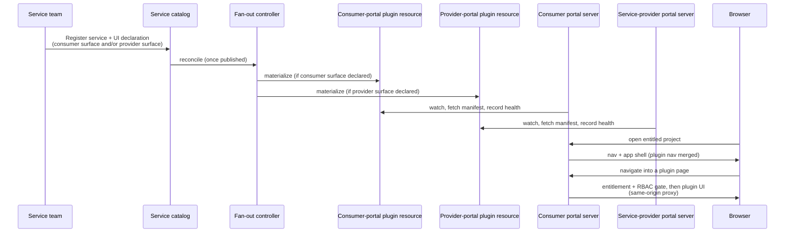

# Service-Contributed UI for the Cloud and Service-Provider Portals

## Summary

Today, every service that wants a presence in a Datum portal needs that portal's team to build it by hand: new routes, new nav items, new resource modules, and a portal release. This enhancement makes Datum's portals **extensible by the platform itself**. A service team registers their service in the Milo service catalog and declares that it ships a UI plugin — for the consumer-facing cloud portal, the service-provider portal, or both. The platform materializes that declaration into a portal-owned resource, and each portal discovers its own plugins, learns what they contribute, and loads their UI at runtime. No portal code change, no coordinated deploy, in either portal.

The design follows the same idiom the service catalog already uses for billing and quota: teams **declare** their capability once, and a controller **fans it out** to the consuming system(s). The runtime borrows the proven shape of [OpenShift Console's dynamic plugins](https://github.com/openshift/console/tree/master/dynamic-demo-plugin): a resource pointing at the plugin's assets, a manifest describing typed extension points, and UI loaded through the portal's own origin via [Module Federation](https://module-federation.io/).

We frame the two audiences as **consumer** and **service provider** rather than "customer" and "staff": today the only service provider is Datum itself (realized by `datum-cloud/staff-portal`), but the naming is chosen to generalize if the platform ever supports more than one.

## Motivation

As the platform adds services, more teams make small, tightly-scoped changes to the *same shared portal codebase* at once — competing PRs, merge conflicts unrelated to either service's logic, release trains that couple unrelated services together. The fix isn't more portal-team bandwidth; it's removing the shared codebase as the integration point, so each service ships its portal presence **at its own rate**.

This shows up identically in both portals today: the consumer portal carries a hardcoded mirror of the service registry as a stopgap, and the service-provider portal's per-resource admin pages are hand-built the same way, in a sibling codebase with its own release cadence. The service catalog already gives services self-service registration for identity, billing, quota, and metering — UI is the one capability a service can't yet bring with it.

### User stories

- **As a service team**, I ship and iterate on my portal experience on my own release cadence, from my own repository — no PRs against a portal repo, no waiting on a portal deploy.
- **As a platform operator**, I control which plugins are live through the same governed catalog lifecycle as billing and quota, and can suspend a misbehaving plugin platform-wide instantly.
- **As a consumer**, my enabled services' UI appears in my project automatically, indistinguishable from built-in pages. Services I haven't enabled are invisible.
- **As a service-provider ops engineer**, a service's contribution to my investigation of a consumer's project — a resource tab, an ops page — shows up automatically for any consumer with that service enabled, without the provider-portal team hand-building it.

## Goals

- A service team ships a portal UI without touching either portal's repository or coordinating a deploy.
- A service declares a consumer-facing surface, a provider-facing surface, or both, from the **same** catalog declaration — one declaration, fanned out to whichever portal(s) it targets.
- Plugin registration reuses the same catalog resource and lifecycle already used for billing and quota.
- Consumer portal: plugins are visible only in entitled projects, and render only when the user passes RBAC — fail-closed.
- Service-provider portal: plugins render only for a provider user with the right role, **and** only for a consumer/project that's itself entitled — a dual, fail-closed gate on two different identities.
- The browser never contacts a plugin origin directly; every plugin API call is mediated through the platform's own control plane — no plugin-declared backend.
- A service team can run its plugin inside a real portal locally within minutes, including the actual registration path.

## Non-goals (v1)

- Third-party or untrusted plugin authors (see [Security & trust model](#security--trust-model)).
- Server-side rendering of plugin components — they hydrate client-side.
- Plugins overriding host-owned pages, navigation, or chrome.
- A plugin marketplace, per-user enablement, or per-org version pinning. (Distinct from the consumer/service-provider *naming* choice above, which is framing, not a v1 capability.)
- **Simultaneous shipment in both portals.** v1 targets the consumer portal, which already has a working prototype. Service-provider portal support is a defined follow-on — the contract is designed for both now so it doesn't need to change later, but that portal's plugin-loading host doesn't exist yet.

## Architecture overview

> [!IMPORTANT]
> Everything from here down — resource kinds, API groups, field names, the manifest shape, extension-point types — is illustrative of the design's *shape*, not a final contract. Expect the exact schema to change as the design is reviewed and implementation starts.



1. **Declare in the catalog, materialize per portal.** Services never author portal-facing resources directly; the fan-out controller does, from one declaration — exactly how billing and quota already work. The write path *is* the trust boundary.
2. **Each portal watches, then discovers, its own plugins**, independently versioned. Detection is two-layered: a Kubernetes watch on the resource itself catches create/update/delete instantly, and a periodic re-fetch of each plugin's manifest catches a service redeploying new assets behind the same URL without touching the resource (see [Detecting plugin changes](#detecting-plugin-changes)).
3. **Typed extension points, not arbitrary DOM.** Each portal's vocabulary is closed, versioned, and distinct (self-service project app vs. cross-tenant ops console).
4. **Static mount, dynamic content.** One permanent catch-all route per portal; plugin routes resolve inside it at runtime — no rebuild per plugin.
5. **Same-origin mediation, and a real gap in one portal.** The consumer portal has this working today as a prototype; the service-provider portal has no equivalent plugin-loading infrastructure yet, which is why it's sequenced as a follow-on (see [Non-goals](#non-goals-v1)).

## Registering a plugin: the service side

A service team adds one optional block to the catalog configuration they already maintain, alongside billing/quota/metrics. It carries two optional, independent sub-declarations:

- **A consumer surface** — a slug, the HTTPS location serving the built plugin, and a visibility rule (entitlement-gated or always visible).
- **A provider surface** — the same shape, plus a rule requiring the viewing provider user's own elevated role (see [Security & trust model](#security--trust-model)). May point at the same build as the consumer surface or a separate one.

```yaml
apiVersion: services.miloapis.com/v1alpha1
kind: ServiceConfiguration
metadata:
  name: compute-v1-4
spec:
  serviceRef:
    name: compute
  version: "1.4.0"
  phase: Published
  # ... existing billing / quota / metrics / locations blocks ...

  userInterface:
    consumerSurface:
      slug: compute
      assets:
        baseURL: https://portal-plugin.compute.miloapis.com
        manifestPath: /plugin-manifest.json   # optional; this is the default
      visibility:
        entitlement: Required       # Required (default) | None
        featureFlag: ""             # optional

    providerSurface:
      slug: compute
      assets:
        baseURL: https://provider-plugin.compute.miloapis.com
        manifestPath: /plugin-manifest.json
      visibility:
        providerRole: Required      # gates on the viewing provider user's own role
        entitlement: Required       # gates on whether the target consumer is entitled
```

Both sub-declarations inherit the catalog's lifecycle for free: `Draft` produces nothing; `Published` materializes; `Deprecated` flags without unloading; `Retired`, or removing one sub-block, unloads just that surface. Highest `spec.version` wins per surface; one live version per service per surface in v1.

This is the same idiom as a billing or quota declaration — a per-version statement materialized by a controller, never authored by the service directly, which is what keeps the fan-out the trust boundary. Alternatives (a field on the service's identity resource; a provider-authored CRD) are covered in [Alternatives considered](#alternatives-considered).

## What each portal materializes

Each portal watches its **own** resource kind, under its **own** API group — `ConsumerPortalPlugin` on `consumer.portal.miloapis.com`, owned by the cloud-portal repo; `ProviderPortalPlugin` on `provider.portal.miloapis.com`, owned by the staff-portal repo. A single shared group across both Kinds was considered ([Kubernetes API groups](https://kubernetes.io/docs/concepts/overview/kubernetes-api/) happily host multiple Kinds, so it wasn't a technical blocker) but left no clear owner for the CRD schema itself between two independent repos — splitting the groups makes each repo the sole owner of its own CRD.

```yaml
apiVersion: consumer.portal.miloapis.com/v1alpha1
kind: ConsumerPortalPlugin
metadata:
  name: compute.miloapis.com
  labels:
    services.miloapis.com/service: compute.miloapis.com
spec:
  slug: compute
  displayName: Compute
  suspend: false                      # platform-operator kill switch
  assets:
    baseURL: https://portal-plugin.compute.miloapis.com
    manifestPath: /plugin-manifest.json
  visibility:
    entitlement: Required             # Required | None
    featureFlag: ""
status:
  conditions:
    - type: Discovered                # manifest fetched and schema-valid
      status: "True"
    - type: Compatible                # manifest's SDK range satisfied by the host
      status: "True"
    - type: Ready                     # aggregate: discovered + compatible + not suspended
      status: "True"
  manifest:
    version: "1.4.0"
    extensions:
      portal.nav/project: 1
      portal.page/project: 3
```

`ProviderPortalPlugin` is a sibling resource — same shape, same controller, same observable status — but its own visibility model, because the viewer (provider staff) and the entitled party (the consumer) are different people:

```yaml
apiVersion: provider.portal.miloapis.com/v1alpha1
kind: ProviderPortalPlugin
metadata:
  name: compute.miloapis.com
spec:
  slug: compute
  assets:
    baseURL: https://provider-plugin.compute.miloapis.com
    manifestPath: /plugin-manifest.json
  visibility:
    providerRole: Required            # gates on the viewing provider user's OWN role
    entitlement: Required             # gates on the TARGET consumer's entitlement
status:
  conditions:
    - type: Ready
      status: "True"
  manifest:
    version: "1.4.0"
    extensions:
      provider.nav/project: 1
      provider.tab/resource: 1
```

**What's actually shared isn't the API — it's the plugin-loading logic behind it.** Both portals do the same work to turn a materialized resource into a rendered plugin: fetch/validate a manifest, resolve `$codeRef`s, wire up Module Federation with matching host-pinned singletons. Recommendation: house that shared layer in **`datum-ui`**, already the one dependency both portals take on, rather than building it twice or standing up a new backend service just to own it (see [Alternatives considered](#alternatives-considered)).

## Plugin discovery: the manifest

Each portal fetches its plugins' manifests server-side, validates them, and caches by digest. A service ships one manifest per surface; a build serving both surfaces can expose one manifest covering both vocabularies, or two.

```json
{
  "name": "compute.miloapis.com",
  "version": "1.4.0",
  "sdk": { "name": "@datum-cloud/portal-plugin-sdk", "range": "^1.0.0" },
  "remoteEntry": "remote-entry.js",
  "exposedModules": {
    "InstanceList": "./src/pages/instance-list.tsx",
    "HomeCard": "./src/cards/compute-summary.tsx",
    "ProviderDnsTab": "./src/provider/dns-tab.tsx"
  },
  "extensions": [
    {
      "type": "portal.nav/project",
      "properties": { "title": "Instances", "icon": "cpu", "path": "instances" },
      "requirements": {
        "permissions": [{ "group": "compute.miloapis.com", "resource": "instances", "verb": "list" }]
      }
    },
    {
      "type": "portal.page/project",
      "properties": { "path": "instances", "component": { "$codeRef": "InstanceList" } },
      "requirements": {
        "permissions": [{ "group": "compute.miloapis.com", "resource": "instances", "verb": "list" }]
      }
    },
    {
      "type": "provider.tab/resource",
      "properties": {
        "targetResource": { "group": "networking.miloapis.com", "kind": "DNSRecord" },
        "title": "Compute Bindings",
        "component": { "$codeRef": "ProviderDnsTab" }
      },
      "requirements": {
        "providerPermissions": [{ "group": "compute.miloapis.com", "resource": "instances", "verb": "list" }]
      }
    }
  ]
}
```

`$codeRef` is a lazy reference — nothing loads until the extension renders, and an unrecognized extension is a status note, never an error (the same additive-growth contract OpenShift Console's dynamic plugins use). `requirements.permissions` runs against the consumer's own identity; `requirements.providerPermissions` runs against the provider user's own identity and role — the split that underlies the dual gate in [Security & trust model](#security--trust-model).

### Extension points — consumer portal

| Type | Renders |
|------|---------|
| Project navigation item | Entry in the project sidebar |
| Project page | Routed page under the plugin's own path |
| Project-home card | Card on the project's home page |
| *(v1.x)* Org nav & pages | Same shapes, org-scoped |
| *(v1.x)* Resource tab / action | Extra tab or action-menu item on a host resource |

v1 ships the first three; growth is additive.

### Extension points — service-provider portal

Land with the provider-portal host as a follow-on; scoped to the project, matching that portal's real navigation shape.

| Type | Renders |
|------|---------|
| Resource tab | Extra tab on an existing per-resource admin page — highest-value: replaces hand-building a new admin module per service |
| Project page | Routed page in a project's ops console |
| Project navigation | Entry in a project's own sub-navigation (not the global sidebar) |
| *(optional)* Project-summary card | Card on a project's overview page |

## Loading plugins in each portal

Neither portal injects plugin routes into its compiled route tree — that would need a rebuild per plugin. Instead, each gets one permanent catch-all route, and plugin paths resolve inside it at runtime.

**Consumer portal:** the mount lives under each project's URL space. The server loader checks session, entitlement, and RBAC before any plugin byte reaches the browser (404/403 fail-closed, same as a built-in page); the client then loads the plugin via Module Federation, sharing React, router, query client, and design-system singletons.

**Service-provider portal:** would get an analogous mount in its per-project admin area, evaluating the dual gate from [Security & trust model](#security--trust-model) instead of the consumer portal's single gate. Honest gap: it has no Module Federation or plugin-loading infrastructure today — everything here is net-new client work, not reuse, which is why it's sequenced as a follow-on.

### Key interfaces for plugin authors

- **A plugin SDK** — typed definitions per extension point, plus hooks for project/consumer context, mediated data fetching (the only data path a plugin has), and live resource updates. The provider vocabulary gets its own context hook. Incompatible SDK versions are never loaded.
- **A build toolkit** — wraps the Module Federation config and generates/validates the manifest from a typed config, for either vocabulary or both.

Both are recommended to sit on the shared `datum-ui` plugin layer (see [What each portal materializes](#what-each-portal-materializes)) rather than reimplementing manifest validation and Module Federation wiring per portal.

## Security & trust model

**Same-origin mediation.** Plugin assets are always fetched by the portal server, never by the browser directly; no credentials are forwarded to the plugin's origin.

**Backend calls stay inside the platform.** Every plugin API call goes through the portal's existing authenticated proxy to the platform's control plane — no plugin-declared backend, in either portal.

**Consumer portal — single-identity gate:** invisible unless the project is entitled; every extension's permissions checked against the viewing user's own identity; a platform operator can suspend instantly.

**Service-provider portal — dual gate, because the viewer and the entitled party differ:**

1. **The provider user's own elevated role permits the extension** — stops a provider user without the right access from seeing the tooling at all.
2. **The consumer being viewed is entitled to the service** — stops provider staff from seeing tooling for a consumer who never enabled it.

Both are evaluated server-side, fail-closed, before any plugin code reaches the browser.

**Activation is a governed write path, not a ceremony.** Only the fan-out controller creates these resources, only from a vetted catalog declaration — a separate manual approval would be ceremony without an added boundary.

**Residual risk.** Plugin code runs in the portal's own browser realm with the viewing user's session ambient; a compromised plugin could act as that user. In the provider portal, that's cross-tenant consumer data — a materially higher stake. First-party, platform-vetted teams only, in both portals; untrusted third-party plugins would need a stronger isolation tier (e.g. iframe sandboxing, as OpenShift Console's own roadmap also considers), out of scope for v1.

## Plugin lifecycle flows

**Ship:** build, deploy behind an owned endpoint, add the UI declaration to the catalog release. The fan-out materializes the resource(s); each portal discovers and registers independently.

**Update:** new version behind the same endpoint, same catalog release path. Each portal refetches on its own schedule — no portal deploy, and updating one surface never touches the other.

**Deprecate / remove:** `Deprecated` flags without unloading; `Retired` (or removing one surface) unloads just that surface. A platform operator can suspend either surface instantly in an emergency.

### Detecting plugin changes

Two independent mechanisms, because a plugin can change in two different places:

- **Resource-level changes are event-driven.** Create, update, suspend, and delete on `ConsumerPortalPlugin`/`ProviderPortalPlugin` are Kubernetes watch events — each portal reacts within one event, no polling. This is how a new plugin appears, an entitlement rule changes, or a retirement removes a plugin's nav and 404s its routes.
- **Asset-level changes need a re-fetch, because they don't touch the resource.** A service team can redeploy new plugin assets behind the same `assets.baseURL` — a new manifest `version`, new chunks — without any catalog release, so nothing fires a watch event. Each portal therefore also periodically re-fetches every registered plugin's manifest and compares it by content digest; a changed digest re-validates the manifest (schema, SDK range) and updates the live registry and status the same way a watch event would.

Together these mean the *contract* (is this plugin registered, entitled, suspended) is always event-driven and near-instant, while the *content* (which exact build is currently live) is eventually consistent on a polling interval — the same split OpenShift Console's dynamic plugins make between plugin registration and asset delivery.

## Local development environment

Service teams need to see their plugin in a real portal before shipping, without platform-team help. The consumer portal supports two tiers today: a fast override that points the portal directly at a plugin on the developer's machine, and a full-fidelity loop against a lightweight local Kubernetes API that exercises the actual registration path end to end. Both keep the rest of the platform (auth, orgs, entitlements) pointed at the real remote environment.

The service-provider portal has no equivalent yet — building a harness for plugin infrastructure that doesn't exist would be a fixture, not a tool. The same two-tier pattern is the obvious next step once its host lands.

## Alternatives considered

| Alternative | Why rejected |
|---|---|
| Services author the portal-facing resource directly | Breaks the declare/materialize pattern; opens an authorization surface the fan-out already governs |
| UI declaration on the service's identity resource | No version dimension; pollutes a resource meant to stay minimal |
| One shared resource/manifest for both portals | Conflates two different security models (single-identity vs. dual-gate) into one ambiguous `visibility` block — a cross-tenant exposure risk, not a cosmetic one |
| One shared API group for both Kinds | Not a technical conflict, but no clear owner for the CRD schema between two independent repos |
| A new backend service as shared foundation for both portals | Solves the same duplication as a shared `datum-ui` layer, but adds a new deployed service and failure mode; a library gets most of the benefit without the new operational surface |
| Boot-time route injection / portal rebuild per plugin | Requires a restart or rebuild per plugin — reintroduces the coupling this design removes |
| Sandboxed (iframe) plugins | Strongest isolation, heaviest UX cost; reserved for a future untrusted-author tier |
| Manual portal-side activation step | Duplicates governance the catalog write path already provides |
| Naming the surfaces "customer"/"staff" | Ties the vocabulary to Datum being the only service provider; "consumer"/"service provider" describes the same v1 reality without baking that assumption in |

## Open questions

1. **Portal platform identity** — each portal needs its own credential to watch its own resources and write status.
2. **Scope and ownership of the shared `datum-ui` plugin layer** — direction is set, not detail: what exactly moves in, who owns changes, how its versioning relates to each portal's independent CRD versioning.
3. **Multi-version coexistence** — is per-org version pinning a near-term need, on the same timeline for both surfaces?
4. **Design-system singleton scope** — ratify the shared singleton list with the design-system team; confirm the provider-portal host shares it once built.
5. **Gated services** — nothing, or a "request access" affordance, on a failed entitlement/role check?
6. **Dev-mode gating posture** — confirm relaxed entitlement/RBAC gating is the right default for plugins under active development.
7. **Provider role model** — what is the service-provider portal's actual elevated-role model, and is it granular enough for per-extension checks?
8. **One plugin build or two** — should the toolkit have an opinion, or leave it to the service team?
9. **Service-provider portal sequencing** — owner and timeline for the provider-portal host; parallel to or gated on the consumer-portal work stabilizing?
10. **Provider navigation placement** — confirm the project-sub-nav assumption once real UI mocks exist.
11. **Pre-release staging path** — process for validating against a staging catalog before production, in both portals.
12. **Interim catalog mirror** — sequence collapsing the consumer portal's hardcoded service-registry mirror onto this system.
13. **How far the multi-provider framing should go now** — this pass is a naming choice, not multi-tenancy among providers; worth designing further only once a second provider is real.
14. **Manifest re-fetch interval** — how often each portal re-polls a registered plugin's manifest for asset-level changes (see [Detecting plugin changes](#detecting-plugin-changes)) is an operational tuning question: too slow delays picking up a service's redeploy, too frequent adds needless load against every plugin origin.

## References

- [milo-os/service-catalog](https://github.com/milo-os/service-catalog): `docs/enhancements/service-registry.md`, `docs/enhancements/service-enablement-architecture.md`
- Prior art: [OpenShift Console dynamic plugins](https://github.com/openshift/console/tree/master/dynamic-demo-plugin)
- [Module Federation](https://module-federation.io/)
- [Kubernetes API groups](https://kubernetes.io/docs/concepts/overview/kubernetes-api/)
