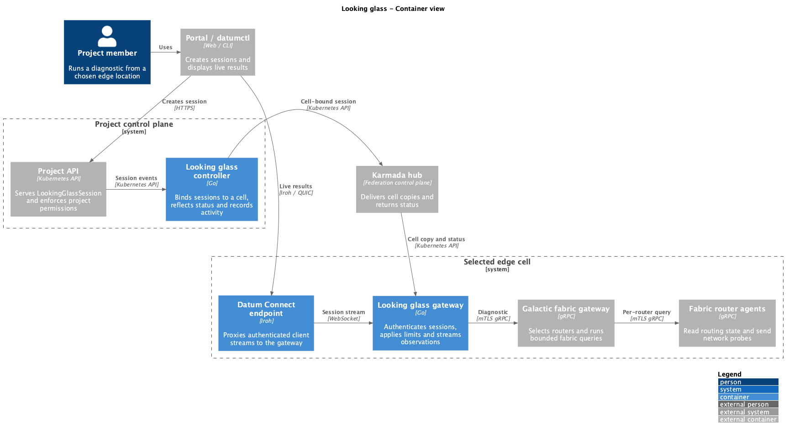

# Looking glass system architecture

## Summary

Looking glass lets a project member run a live diagnostic from a named Datum
edge location. The project control plane authorizes and records the session;
the selected cell runs it and streams results to the client. The proposed
`milo-os/looking-glass` service owns this customer-facing path. Galactic
supplies fabric router observations through its existing gRPC service. The
[product proposal](../../enhancements/networking/looking-glass/README.md)
defines the experience and initial scope.

## Motivation

The project control plane knows who a customer is and what they may access.
The edge cell has the network vantage point and router state. The service
needs both without granting customers node access or routing every result
through the control plane.

### Goals

- Authorize and audit each diagnostic in its project.
- Stream results from the chosen cell to the portal and CLI.
- Reuse Galactic's bounded fabric diagnostics and permit other vantage points
  behind the same user workflow later.

### Non-goals

- An arbitrary shell on Datum infrastructure.
- Treating a fabric router probe as a test from a customer VPC or workload.
- Persisting complete session output in the project API.

## Proposal

The customer creates one short-lived session for one location and diagnostic.
The client generates an ephemeral key pair and submits its public key with
the session. The project control plane admits the session and binds it to a
cell. The client then connects through Datum Connect. The cell starts the
diagnostic only after the client authenticates. This follows the
[Compute instance shell pattern](https://github.com/datum-cloud/compute/blob/main/docs/enhancements/instance-shell-sessions/README.md):
project authority, a direct client-to-cell stream, and an agent that reads
only its cell's session copy.

### Container view



[PlantUML source](./looking-glass-containers.puml)

The cell gateway needs no project or hub credentials, and the Datum Connect
endpoint has no Kubernetes credentials. Galactic's internal calls use mTLS
gRPC.

### Risks and mitigations

- Active probes could scan or load other networks. Admission and the cell
  both enforce destination, traffic, time, concurrency, and output limits.
- Route results can reveal platform topology. Customer access to BGP details
  needs an explicit visibility policy before launch.
- Endpoint reachability is not authorization. The gateway checks the session
  key, bound cell, current state, and single-use claim before execution.

## Design details

### Consumer-facing API

The proposed `LookingGlassSession` is a project-scoped resource. This example
is illustrative; the API version and field names remain provisional:

```yaml
apiVersion: network.datumapis.com/v1alpha1
kind: LookingGlassSession
metadata:
  generateName: edge-trace-
spec:
  location: us-central-1
  vantagePoint: FabricEdge
  diagnostic:
    type: Traceroute
    target: 1.1.1.1
  clientPublicKey: "<ephemeral-public-key>"
```

Creating a session requires a dedicated project permission. The spec is
immutable, and deletion revokes the session. Portal and CLI clients use the
same API to create it and watch status, and keep the private key in memory.
The project activity log records the requester, location, diagnostic, start,
and outcome.

One session targets one location; clients may create several to compare
locations. Admission checks project access to the chosen location and vantage
point. The control plane fixes the selected cell before it exposes connection
details. It rejects status from another cell.

### Session status and client behavior

The project API exposes output-only `status` for discovery and lifecycle. It
does not store the diagnostic stream. A connectable status has this shape:

```yaml
status:
  # Clients ignore status from older spec generations.
  observedGeneration: 1
  cell: us-central-1-a
  # Connection details identify the endpoint; they do not grant access.
  connection:
    endpointID: "<iroh-endpoint-id>"
    relayURLs: ["<relay-url>"]
    target: "<cell-gateway-host:port>"
  connectBefore: "<RFC3339 timestamp>"
  conditions:
    - type: Ready
      status: "True"
      reason: SessionReady
      message: "Connect before the deadline."
      observedGeneration: 1
      lastTransitionTime: "<RFC3339 timestamp>"
```

A terminal status includes execution times and router coverage:

```yaml
status:
  observedGeneration: 1
  cell: us-central-1-a
  startedAt: "<RFC3339 timestamp>"
  finishedAt: "<RFC3339 timestamp>"
  coverage:
    expected: 3
    successful: 2
    failed: 1
    omitted: 0
  conditions:
    - type: Ready
      status: "False"
      reason: PartialResults
      message: "Two of three routers answered."
      observedGeneration: 1
      lastTransitionTime: "<RFC3339 timestamp>"
```

`Ready` follows Compute's session condition shape. Clients handle its states
as follows:

- `Unknown` with reason `Pending`: Show that placement is in progress and keep
  watching status.
- `True` with reason `SessionReady`: Connect before `connectBefore`.
- `True` with reason `Connected`: Show live observations from the stream.
- `False` with reason `Succeeded`: Show the completed result and coverage.
- `False` with reason `PartialResults`: Show the observations and incomplete
  coverage. At least one router answered, but others failed, timed out, or
  were omitted.
- `False` with a failure reason: Show its message and any observations already
  received. Stop connection attempts.

Failure reasons identify where the session stopped:

- `Rejected`: The project API denied the request.
- `Unavailable`: The selected cell could not serve the request.
- `NoNodesAvailable`: The cell had no eligible routers.
- `ExecutionFailed`: No router answered the diagnostic.
- `DeadlineExceeded`: The session or diagnostic exceeded its deadline.
- `NotConnected`: No client connected before `connectBefore`.
- `Revoked`: The project control plane revoked the session.
- `Disconnected`: The client connection closed during execution.
- `AgentLost`: The cell lost the agent running the diagnostic.

A terminal `Ready=False` reason does not change. Clients retain observations
already received and show coverage when available. Packet loss and an
unanswered traceroute hop are observations, not session failures.

Clients may use connection details only while the condition is
`SessionReady`. If a live stream drops, the client watches status for the
final reason; the single-use session does not reconnect. Status may lag the
stream because it returns through Karmada. Stream frames drive live output,
and the terminal condition gives the final API outcome.

### Execution and result stream

The cell gateway checks the live session when the client connects, consumes
its single use, then calls a typed diagnostic backend. For `FabricEdge`, it
calls Galactic's cell fabric gateway, which fans out to router agents. The
looking glass stream identifies each router and sample time, reports each
completed observation, and ends with coverage and typed errors. Galactic's
current gRPC calls return completed operations; live per-hop traceroute
output would require a streaming backend contract.

Galactic's debug gRPC endpoint uses operator-oriented credentials today. The
looking glass service needs a dedicated service identity and scoped policy at
that gateway, rather than inheriting broad operator access. A future VPC
vantage point needs a worker in that VPC's network context behind the same
session API.

### Lifecycle and failure handling

The cell advertises a session only when its endpoint is ready. No probe
starts until the client connects. An unclaimed session ends after a deadline;
disconnect, expiry, and revocation cancel in-flight work. Cell status returns
through Karmada, and the project API records the outcome and audit event. A
detached diagnostic that runs without a client would be a separate mode with
stored results.

## Alternatives

An asynchronous query resource suits saved results but does not offer a live
session. An HTTPS proxy through the control plane could stream results without
a native Iroh client, but would put every diagnostic response on that path.
The portal and CLI should share the session contract even if their transport
implementations differ.

Galactic's [fabric API](https://github.com/datum-cloud/galactic/pull/792) and
Compute's [cell session implementation](https://github.com/datum-cloud/compute/pull/390)
are the backend and transport precedents.
