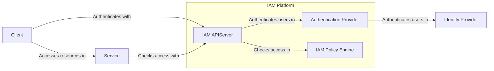

# Identity and Access Management

The Identity and Access Management (IAM) system is responsible for managing
authentication, authorization, and identity governance across all resources
within the cloud platform. This document provides a high-level architecture
overview of the IAM system and serves as a reference for understanding its core
components and how they interact.

This document is intended to serve as a parent overview, with links to detailed
documentation for individual components and enhancements made to the IAM system
over time.

## Architecture

The following components make up the architecture of the IAM system.

### Authentication Platform

The authentication platform is responsible for identifying all users and
machines that are accessing the Datum Cloud platform. Users are expected to
authenticate with a trusted Identity Provider (e.g. Google, GitHub) or an
Identity Provider configured for their Organization.

Read over the [Authorization Platform enhancement](./authentication-platform/)
for more information.

### Authorization Platform

The authorization platform is responsible for determining whether a client,
authenticated by the authentication platform, is allowed to perform a request
against services deployed on the platform. Services are expected to register
their resources and the permissions they want available with the IAM system. The
IAM system will configure the policy engine to enable checking whether a client
has a permission on a resource. Permissions are assigned to Roles which are
bound to IAM subjects through IAM policies.

Roles are also inherited when IAM policies are bound to parent resources like
Organizations and Projects. Read through the [service provider
platform enhancement](../service-provider-platform/) for more information.

> [!NOTE]
>
> An enhancement will be written in the future on the full functionality of the
> current policy engine built into the Datum Cloud IAM system. The IAM system is
> currently using [OpenFGA], but it can easily be updated to support additional
> Zanzibar type policy engines in the future.

[OpenFGA]: https://openfga.dev
