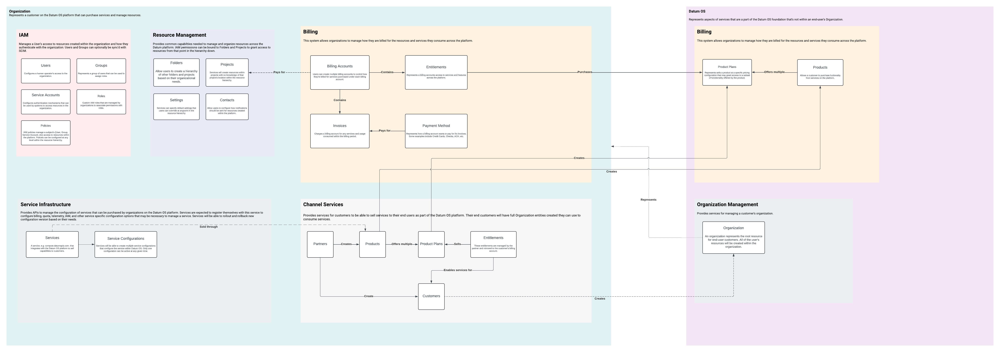
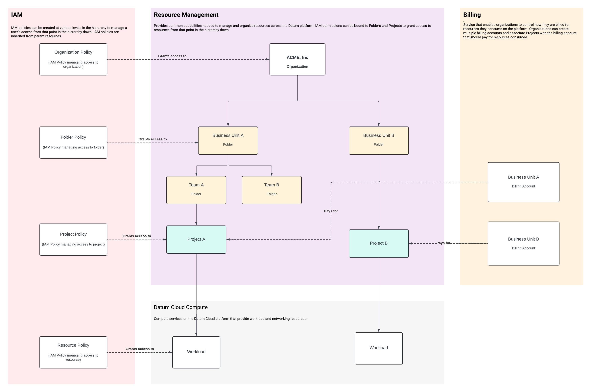
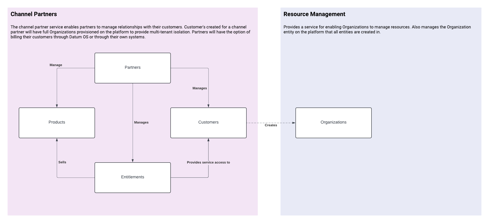

<!--
Inspired by https://github.com/kubernetes/enhancements/tree/master/keps/NNNN-kep-template

Goals are aligned in principle with those described at https://github.com/kubernetes/enhancements/blob/master/keps/sig-architecture/0000-kep-process/README.md

Recommended reading:
  - https://developers.google.com/tech-writing
-->

<!--
**Note:** When your RFC is complete, all of these comment blocks should be removed.

To get started with this template:

- [ ] **Make a copy of this template directory.**
  Copy this template into the desired path and name it `short-descriptive-title`.
- [ ] **Fill out this file as best you can.**
  At minimum, you should fill in the "Summary" and "Motivation" sections.
  These should be easy if you've preflighted the idea of the RFC with the
  appropriate stakeholders.
- [ ] **Create a PR for this RFC.**
  Assign it to stakeholders who are sponsoring this process.
- [ ] **Merge early and iterate.**
  Avoid getting hung up on specific details and instead aim to get the goals of
  the RFC clarified and merged quickly. The best way to do this is to just
  start with the high-level sections and fill out details incrementally in
  subsequent PRs.

Just because a RFC is merged does not mean it is complete or approved. Any RFC
marked as `provisional` is a working document and subject to change. You can
denote sections that are under active debate as follows:

```
<<[UNRESOLVED optional short context or usernames ]>>
Stuff that is being argued.
<<[/UNRESOLVED]>>
```

When editing RFCs, aim for tightly-scoped, single-topic PRs to keep discussions
focused. If you disagree with what is already in a document, open a new PR
with suggested changes.

One RFC corresponds to one "feature" or "enhancement" for its whole lifecycle.
You do not need a new RFC to move from beta to GA, for example. If
new details emerge that belong in the RFC, edit the RFC. Once a feature has
become "implemented", major changes should get new RFCs.

The canonical place for the latest set of instructions (and the likely source
of this file) is [here](/docs/rfcs/template/README.md).

**Note:** Any PRs to move a RFC to `implementable`, or significant changes once
it is marked `implementable`, must be approved by each of the RFC approvers.
If none of those approvers are still appropriate, then changes to that list
should be approved by the remaining approvers and/or the owning SIG (or
SIG Architecture for cross-cutting RFCs).
-->

<!-- omit from toc -->
# Integration with Datum OS

<!--
This is the title of your RFC. Keep it short, simple, and descriptive. A good
title can help communicate what the RFC is and should be considered as part of
any review.
-->

<!--
A table of contents is helpful for quickly jumping to sections of a RFC and for
highlighting any additional information provided beyond the standard RFC
template.
-->

- [Summary](#summary)
- [Motivation](#motivation)
  - [Goals](#goals)
  - [Non-Goals](#non-goals)
- [Proposal](#proposal)
  - [Flexible Resource Hierarchy](#flexible-resource-hierarchy)
    - [Managing resource access](#managing-resource-access)
    - [Preventing resource deletion](#preventing-resource-deletion)
  - [Integrated Service Billing](#integrated-service-billing)
  - [Channel Partners](#channel-partners)
  - [Integrated Service Catalog](#integrated-service-catalog)
  - [User Stories](#user-stories)
    - [Customer w/ no commitment](#customer-w-no-commitment)
    - [Customer with 1 year revenue commitment](#customer-with-1-year-revenue-commitment)
    - [Customer w/ guaranteed capacity](#customer-w-guaranteed-capacity)
    - [Customer w/ guaranteed capacity and no overage](#customer-w-guaranteed-capacity-and-no-overage)
  - [Risks and Mitigations](#risks-and-mitigations)
- [Design Details](#design-details)
  - [Defining a Service Catalog](#defining-a-service-catalog)
  - [Billing Accounts](#billing-accounts)
    - [Commitments](#commitments)
- [Implementation History](#implementation-history)

## Summary

<!--
This section is incredibly important for producing high-quality, user-focused
documentation such as release notes or a development roadmap. It should be
possible to collect this information before implementation begins, in order to
avoid requiring implementors to split their attention between writing release
notes and implementing the feature itself. RFC editors should help to ensure
that the tone and content of the `Summary` section is useful for a wide audience.

A good summary is probably at least a paragraph in length.

Both in this section and below, follow the guidelines of the [documentation
style guide]. In particular, wrap lines to a reasonable length, to make it
easier for reviewers to cite specific portions, and to minimize diff churn on
updates.

[documentation style guide]: https://github.com/kubernetes/community/blob/master/contributors/guide/style-guide.md
-->

Datum Cloud will integrate with Datum OS to support the standard functions
needed to operate a Cloud based Service Provider. This document will outline the
functionality that needs to be available in Datum OS to support Datum Cloud.

## Motivation

<!--
This section is for explicitly listing the motivation, goals, and non-goals of
this RFC.  Describe why the change is important and the benefits to users.
-->

Datum Cloud will be the first consumer of the Datum OS platform. We want to
ensure we're investing in the open-source development of Datum OS to expose
standard capabilities needed to support a cloud based service provider.

### Goals

<!--
List the specific goals of the RFC. What is it trying to achieve? How will we
know that this has succeeded?
-->

- Define the functionality that needs to be developed on Datum OS to support an
  integration by Datum Cloud
- Provide a simple way for organizations to be able to manage they consume from
  services
- Outline the functionality necessary to complete a POC

### Non-Goals

<!--
What is out of scope for this RFC? Listing non-goals helps to focus discussion
and make progress.
-->

- Define any capabilities provided by Datum Cloud
- Define implementation details around how Datum OS features are implemented

## Proposal

<!--
This is where we get down to the specifics of what the proposal actually is.
This should have enough detail that reviewers can understand exactly what
you're proposing, but should not include things like API designs or
implementation. What is the desired outcome and how do we measure success?.
The "Design Details" section below is for the real
nitty-gritty.
-->

Datum Cloud will be created as a series of services integrated together to
provide the cloud capabilities needed by organizations. These services need a
standardized way of organizing resources, managing access to resources,
supporting resources, and bill organizations for any usage accumulated from the
consumption of resources. Service providers will register their services with a
service catalog with configuration details needed to influence how that service
is consumed by other organizations.

Service providers will be able to use channel partner capabilities to sell their
services to their end-users. The channel partner capability will also enable
service providers to sell their services through a network of resellers or in a
service marketplace.

Consumers will be able to leverage a flexible resource hierarchy to manage the
resources they consume. This resource hierarchy will support simple use-cases
for individuals evaluating the platform and complex organizations with multiple
business units and teams.



The diagram above represents the relationship between organizational resources
and channel partners that can manage their customers as Organizations.

### Flexible Resource Hierarchy

Datum Cloud must provide customers with an intuitive way to manage the resources
they consume from service providers. Datum Cloud must support customers as
simple as an individual utilizing Datum Cloud for their home-lab or as complex as
a global infrastructure provider with multiple business units that must be
billed in different currencies and maintain tight access control over a user's
access to resources across the organization.

Datum OS will take inspiration from [Google Cloud Platform's resource
hierarchy][gcp-resource-hierarchy] to support managing resources. All customers
will be represented as an **Organization** resource to act as the root of the
customer's resource hierarchy. Organizations will be able to organize resources
they create into a nested hierarchy using **Folders** and **Projects**.
A **Folder** is a generic organizational resource that can contain other
**Folders** or **Projects**.

[gcp-resource-hierarchy]: https://cloud.google.com/resource-manager/docs/cloud-platform-resource-hierarchy



Services will typically integrate with the resource hierarchy by creating
resources with a **Project** acting as the parent.

Organizations will be able to re-organize their **Projects** and **Folders** to
meet their organizational needs. Organizations with simple organization needs
may decide to use a single project for all of their resources. Organizations
with more complex structures (e.g multiple business units) would typically
create multiple nested folders to represent business units and teams within
those business units to Services will not be impacted by these re-organizations
since they are only aware of the **Project** resource.

> Organizations **must** be cognizant of any IAM impacts that could be caused by
> re-organizing **Projects** and **Folders**.

**Users** and **Groups** may lose access to a **Project** if they were granted
access through a parent resource and the **Project** is moved to a new parent.

#### Managing resource access

**Users** and **Groups** will be created at the **Organization** level.
**Users** and **Groups** can have **Roles** bound using IAM policies at various
levels of the resource hierarchy.

IAM permissions are inherited from parent resources in the hierarchy. Roles
bound via IAM policies at the **Organization** level will grant that role to any
resources in the **Organization**'s resource hierarchy. Roles bound to a
**Folder** will bind a user to that role for any **Folder**, **Project**, or
Resource within the folder. Roles bound to a **Project** will bind a user to
that role for any resources within the **Project**.

> Organizations will typically want to avoid assigning roles at the
> **Organization** level to follow the principle of least privilege.

#### Preventing resource deletion

Customers and service providers may need the ability to prevent specific
actions from being taken on resources created across the platform. Service
providers may want to prevent their customers from deleting resources they've
contractually committed to keeping. Customers may want to prevent critical
production infrastructure from being deleted.

To support this use-case, the resource manager service will provide a Liens
resource that can prevent actions from being taken on a resource. Liens will
provide enough information for users to understand why a Lien exists against a
resource and who/what created the resource.

Here's an example of a Lien created by a billing commitment as a result of a
resource being tied to a commitment.

```yaml
# An example Lien created by the existence of a billing commitment to prevent
# the deletion of an infrastructure rack.
#
# NOTE: This makes an assumption a "Router" resource exists on a network
#       service. This resource has NOT been defined.
name: liens/000-000-000
# The timestamp of when the lien was created on the resource.
create_time: 2024-09-10T00:00:00Z
# A reference to the resource the lien will prevent actions against.
resource:
  name: projects/my-project/routers/dfw-01
  type: network.datumapis.com/Router
# A list of IAM permissions that should be prevented from being allowed on
# the resource. The following will prevent the resource referenced above from
# being deleted.
restrictions:
- network.datumapis.com/routers.delete
# A human consumable description of why the Lien exists on the resource.
reason: Resource cannot be deleted due to an active billing commitment
# A reference to the resource that resulted in the origin being created. This
# could point to any resource on the platform, including a user or service
# account in the IAM system.
origin:
  name: accounts/1ABE-46DF-79GI/commitments/2BC3-57FG-09DI
  type: billing.datumapis.com/Commitment
```

See the [billing commitments](#commitments) section for an example of a billing
commitment that would result in the above resource lien being created.

Below would be an example of a lien created by a user in an organization
preventing the deletion of the resource because it's critical production
infrastucture.

```yaml
name: liens/000-000-000
# The timestamp of when the lien was created on the resource.
create_time: 2024-09-10T00:00:00Z
# A reference to the resource the lien will prevent actions against.
resource:
  name: projects/my-project/workloads/api-gateway
  type: compute.datumapis.com/Workload
# A list of IAM permissions that should be prevented from being allowed on
# the resource. The following will prevent the resource referenced above from
# being deleted.
restrictions:
- compute.datumapis.com/workloads.delete
# A human consumable description of why the Lien exists on the resource.
reason: Workload is a critical production service
# A reference to the resource that resulted in the origin being created. This
# could point to any resource on the platform, including a user or service
# account in the IAM system.
origin:
  name: users/swells@datum.net
  type: iam.datumapis.com/User
```

### Integrated Service Billing

**Organizations** will be able to manage **Billing Accounts** to configure how
resources they consume from services should be billed to the **Organization**.

**Organizations** can associate a **Billing Account** with a **Payment Profile**
that will be used to pay invoices each month. **Organizations** will always be
invoiced on the 1st of the month. **Billing Accounts** may have flexible payment
terms (e.g. Net30, Net60).

**Organizations** with high resource consumption may want to commit to a minimum
spend commitment to reduce their contracted rate. **Billing Accounts** with a
minimum spend commitment will be reconciled each month to ensure the minimum
spend commitment is being met.

Minimum spend commitments will support Monthly, Quarterly, and Yearly
reconciliation periods. Minimum spend commitments may apply to all SKUs or a
subset of SKUs on the billing account. Service providers can define what course
of action to take with billing accounts that aren't meeting their spend
commitments.

**Entitlements** will be created to manage the pricing that an Organization pays
for services and grants the **Organization** access to consume the service. As
an example, Customers of Datum Cloud would have an entitlement created for the
Datum Cloud Compute service.

An **Organization** will be able to configure multiple **Billing Accounts** to
support separating billing between business units, currencies, or other
potential use-cases.

An **Organization** acting as a reseller on the platform will also be able to
configure **Billing Sub-Accounts** for each of their customers. A **Billing
Sub-Account** will be paid for by the parent **Billing Account**.

Each **Project** created under an **Organization**'s resource hierarchy will be
linked to the **Billing Account** that will be charged for any resources
consumed by the **Project**.

### Channel Partners

Datum OS must be able to support an Organization's channel partner strategy for
selling services to consumers. Organizations are going to have different channel
partner needs based on their go to market strategy.

Datum OS must support the following scenarios:

- **Direct to Consumer**: A service provider wants to sell services they product
  to their consumers
- **Reseller Partner**: An organization wanting to support partners reselling
  the organization's services.
- **Marketplace Partner**: An organization wanting to support partners selling
  services through their platform as part of a Marketplace (e.g. Google Cloud
  Platform Market).
- **Distribution Partner**: An organization wanting to support a distributor
  bringing additional resellers to the platform to sell the services offered.

Datum OS will create a service dedicated to managing channel partners. This
service will introduce a **Partner** resource with the **Organization** as it's
parent.



<!--

TODO: Should we consider **Partner** resources using a **Project** as a parent?
      It may be useful for an Organization to be able to organize Partner's in
      projects and folders.

-->

A **Partner** resource will allow an **Organization** to create **Customer**
resources under the **Partner**. A new **Organization** is created for each
**Customer** to manage any resources that are provisioned for the customer.

The **Partner** will be able to configure **Products** to sell any service they
product through the platform. The **Partner** will create entitlements for each
**Customer** to sell access to it's services.

A **Partner** may also be granted access to sell products offered by another
**Partner** on the platform. Access must be granted by the **Organization** that
manages the **Partner**.

A **Partner** can configure a **Customer** to be billed directly by **Datum OS**
or may choose to be invoiced for any of it's **Customer**'s usage so it can
invoice them directly.

### Integrated Service Catalog

Datum OS must allow organizations that are selling services to register services
with Datum OS to configure the features, resources, IAM roles and permissions,
telemetry, and pricing configurations offered by the service. Organizations will
create a producer project on the Datum OS platform that the service can be
registered. For example, Datum Cloud may create a new project called
`projects/datum-cloud` that it'll use for registering services.

Services **should** integrate with the resource hierarchy provided by Datum OS
by using a consumer's project as the parent resource for any root resources
provided  by the service. See the [design details](#design-details) section for
a full breakdown of the service registration. Registration of the service will
result in other services on the Datum OS platform to be configured to support
the service. For example, the IAM system will be updated with the roles and
permissions provided by the service.

Registering a service will also enable Datum OS to manage an automatically
generated service catalog for organizations that allow consumers to browse
services that are available, how to consume and integrate with those services,
and the pricing details of the service.

### User Stories

<!--
Detail the things that people will be able to do if this RFC is implemented.
Include as much detail as possible so that people can understand the "how" of
the system. The goal here is to make this feel real for users without getting
bogged down.
-->

#### Customer w/ no commitment

Customer's without a commitment would simply have an entitlement created for the
services the customer has purchased. The billing account would be billed for any
usage consumed by resources provisioned by the service at list pricing.

#### Customer with 1 year revenue commitment

Customer wishes to make a revenue commit ($1,000,000/year) and thus receive a
15% discount off of list pricing for on-demand services.

This customer would have a commitment created for their billing account that
provides them with a 15% discount accross all SKUs with a minimum spend
commitment of $1,000,000 USD over a 1 year period.

```yaml
name: accounts/1ABE-46DF-79GI/commitments/2BC3-57FG-09DI
minimumSpend:
  amount: 1000000
  currencyCode: USD
  # The commitment is valid for 12 months.
  termLengthMonths: 12
  # Defines how the billing account's spend should be aggregated to determine
  # if the commitment isn't being met.
  aggregationInfo:
    # Billing account must spend the amount over a 1 year period.
    interval: Yearly
    # Commitment applies to all SKUs on the billing account.
    skuSelectors: []
# Apply a 15% discount across all SKUs on the billing account
skuDiscounts:
- discount:
    percentage: 15
  skuSelectors: []
```

#### Customer w/ guaranteed capacity

Customer wishes to guarantee capacity of instances in specific markets. In
order to do so, customer works with Sales or via self-contracting to subscribe
to the instances she desires as is offered m2m, annual or 3 year commit pricing
options. Customer contracts for those services and then also leverages usage/on
demand services for additional capacity, dev test and other scenarios.

```yaml
name: accounts/1ABE-46DF-79GI/commitments/2BC3-57FG-09DI
# Customer is locked into 12 month commitment.
termLengthMonths: 12

# Optionally configure minimum spend / SKU discounts configurations to provide
# the customer with discounts over the commitment term.
minimumSpend:
  ...
skuDiscounts:
  ...

resources:
# Create a lien against a resource reservation to prevent deleting the CPU /
# Memory resources reserved.
#
# NOTE: The ResourceReservation resource is just a representation of the billing
#       system being able to create a lien against a resource in the compute
#       service to prevent reserved resources being deleted. This example may
#       change once a resource reservation system has been designed.
- type: compute.datumapis.com/ResourceReservation
  name: projects/my-project/resourceReservations/instance-reservations-dfw-01
```

#### Customer w/ guaranteed capacity and no overage

Customer wishes to commit to baseline capacity of instances and network services
in multiple markets. The customer never wants to receive overages or other usage
charges, and instead wants to have specific guaranteed capacity billed at a
fixed cost from a negotiated contract.

The billing account's commitment would look very similar to the example above. A
custom pricing plan would need to be created to bill the customer based on the
negotiated contract and assigned to the customer's billing account through an
entitlement.

```yaml
name: accounts/1ABE-46DF-79GI/commitments/2BC3-57FG-09DI
# Customer is locked into 12 month commitment.
termLengthMonths: 12

# Optionally configure minimum spend / SKU discounts configurations to provide
# the customer with discounts over the commitment term.
minimumSpend:
  ...
skuDiscounts:
  ...

resources:
# Create a lien against a resource reservation to prevent deleting the CPU /
# Memory resources reserved.
#
# NOTE: The ResourceReservation resource is just a representation of the billing
#       system being able to create a lien against a resource in the compute
#       service to prevent reserved resources being deleted. This example may
#       change once a resource reservation system has been designed.
- type: compute.datumapis.com/ResourceReservation
  name: projects/my-project/resourceReservations/instance-reservations-dfw-01
# Note: This is just an example of placing a lien against a network resource to
#       prevent deletion.
- type: network.datumapis.com/Router
  name: projects/my-project/routers/my-router
```

<!-- #### Story 2 -->

<!-- ### Notes/Constraints/Caveats (Optional) -->

<!--
What are the caveats to the proposal?
What are some important details that didn't come across above?
Go in to as much detail as necessary here.
This might be a good place to talk about core concepts and how they relate.
-->

### Risks and Mitigations

<!--
What are the risks of this proposal, and how do we mitigate? Think broadly.
For example, consider both security and how this will impact the larger
software ecosystem.

How will security be reviewed, and by whom?

How will UX be reviewed, and by whom?

Consider including folks who also work outside of your immediate team.
-->

## Design Details

<!--
This section should contain enough information that the specifics of your
change are understandable. This may include API specs (though not always
required) or even code snippets. If there's any ambiguity about HOW your
proposal will be implemented, this is the place to discuss them.
-->

### Defining a Service Catalog

Organizations would be able to register services within the Datum OS platform to
represent services they offer to their customers. Below is an example of a
service being registered with Datum OS that provides compute services (workloads
and networks) to Datum Cloud customers.

> NOTE: This example is meant to be fully featured and will depict the long-term
> vision of functionality that may need to be built. This is not meant to
> illustrate the bare-bones functionality we need to meet a POC.

```yaml
name: services/compute.datumapis.com
# Configures which project in Datum OS is producing the service. May be used to
# send telemetry data for the service.
producerProject: projects/datum-cloud
serviceName: compute.datumapis.com
displayName: Dataum Cloud Compute
# Configuration option for the service infrastructure platform to use. Provides
# billing, quota, and IAM services based on the environment.
control:
  environment: services.datumapis.com

# Configures how the service will authenticate and authorize requests made by
# API consumers.
authentication:
  # Configure which authentication providers to use to retrieve certificates
  # for validating authentication tokens.
  providers:
  - id: iam.datumapis.com
    jwks_uri: https://iam.datumapis.com/oauth2/v1/certs
    issuer: https://auth.datum.com
    audiences:
    - console.cloud.datum.net
    authorizationUrl: https://auth.datum.com
  # Configures how the service should retrieve authentication tokens from
  # API requests that are made.
  authTokenLocations:
  - header: Authorization
    prefix: "Bearer "
    # Can add support for additional token types?
    type: JWT

# Configure how authorization will work for the service.
#
# TODO: Determine how to represent that a role defined by a service should be
#       added to a global system role like `systemOwner`. Do we even want to do
#       that or should we expect the user to assign themselves the correct role
#       for the service?
authorization:
  permissions:
  # TODO: Define IAM permission standards.
  #
  # The "get" permission and the "list" permission can be redundant since
  # listing all resources would show you all of the data available via the
  # "get" permission. There's likely no use-case where a user would need
  # "list" and not "get" but there's valid scenarios for a user to only have
  # "get" and not "list".
  #
  # On resource list endpoints, Google will do a permission check on the "list"
  # permission using the parent as the resource URN (e.g. projects/my-project).
  - name: compute.workload.list
  - name: compute.workload.get
    description: Create a workload
  - name: compute.workload.create
  ...

  # Defines the roles the service will provide by default
  roles:
  - name: compute.datumapis.com/admin
    inherits:
    - compute.datumapis.com/workloadEditor
    - compute.datumapis.com/networkEditor
  - name: compute.datumapis.com/workloadEditor
    inheritFrom:
    - compute.datumapis.com/workloadViewer
    permissions:
    - compute.workload.create
  - name: compute.datumapis.com/workloadViewer
    permissions:
    - compute.workload.get
    - compute.workload.list
  ...

# Registers metadata about the resources provided by the service.
#
# Eventually we'll develop tooling that can automatically generate this based on
# the service's protobuf definition so we can manage resource configuration in a
# single place.
resources:
- type: compute.datumapis.com/Workload
  plural: workloads
  singular: workload
  # Display name that may be shown to users in the UI
  displayName: Datum Compute Workload
  # Human readable description of the resource.
  description: |
    Workloads enable users to deploy a set of instances across different compute
    locations.
  resourceNameFormats:
  - projects/{project}/workloads/{workload}
  ...
- name: compute.datumapis.com/Instance
  ...
- name: compute.datumapis.com/Network
  ...

# Configures the quota system for this service to manage the number of
# resources that can be consumed from a service.
quota:
  # Configures how the resources provided by the service are tracked in the
  # quota system. Resources must be registered above.
  buckets:
  - name: compute.datumapis.com/instances/cpu
    type: Allocation
    dimensionLabels:
    - key: resources.datumapis.com/organization
    - key: resources.datumapis.com/project
    - key: compute.datumapis.com/location
  - name: compute.datumapis.com/instances/gpu
    type: Allocation
    ...
  - name: compute.datumapis.com/features/anycastIPs
    type: Feature

# Configure the metrics that will be used for billing. These metrics would be
# pushed to the consumer project for billing purposes.
billing:
  consumerDestinations:
  - type: compute.datumapis.com/Instance
    metrics:
    - compute.datumapis.com/instances/cpu_allocated_seconds
  - type: compute.datumapis.com/NetworkInterface
    metrics:
    - compute.datumapis.com/networkInterfaces/egressTraffic

# Configures telemetry information that will be available to consumers of the
# service.
telemetry:
  # Telemetry data reported by a service will almost always be associated with
  # a resource provided by the service. This section will configure the labels
  # and any other metadata that will be available for any telemetry data
  # associated with a resource. The resource must be registered in the
  # `resources` section above.
  monitoredResources:
  - type: compute.datumapis.com/Instance
    labels:
    - key: compute.datumapis.com/instanceName
      description: |
        The human-readable auto-generated name assigned to an instance during
        creation.
    - key: compute.datumapis.com/cityCode
      description: |
        The IATA code where the instance was created.

  # Metrics that are expected to be reported by the service. These metrics may be
  # used for operational purposes or to bill consumers for service usage.
  #
  # TODO: How do we want to represent that these metrics may be pushed to a
  #       different telemetry backend than Datum OS? Thinking of a use-case
  #       where a user wants billing metrics sent to a separate telemetry
  #       backend but Datum OS will still need to support retrieving the
  #       billing metrics for metering.
  metrics:
  - name: compute.datumapis.com/instances/cpuAllocated
    # Indicates the stability level of the telemetry data to consumers. Must be
    # one of: Early Access, Alpha, Beta, Stable, or Deprecated
    launchStage: Alpha
    displayName: Instance CPU Allocated
    description: |
      The amount of CPUs allocated to a workload instance
    metricKind: Gauge
    # Unit-less metric
    unit: 1
    labels:
    - key: compute.datumapis.com/cpuClass
      description: The class of CPU that was allocated to the instance
    ...
  - name: compute.datumapis.com/instances/memoryAllocated
    launchStage: Beta
    ...
  - name: compute.datumapis.com/networkInterfaces/ingressTraffic
    displayName: Network Interface Ingress Traffic
    launchStage: Stable
    # A metric value of 1 would indicate a single Byte of traffic
    unit: By
    metricKind: Delta
    labels:
    - key: compute.datumapis.com/location
      description: |
        The location identifier where the usage was sourced from
    - key: compute.datumapis.com/cityCode
      description: |
        The IATA airport code where the usage was sourced from
  - name: compute.datumapis.com/billing/instances/allocatedCPUHours
    displayName: Instance Allocated CPU Hours
    description: |
      Metric used to track the number of hours a CPU was allocated to instances
      on the platform.
  ...

  # Registers metadata about events that are expected to be emitted from the
  # service.
  #
  # Events will be emitted in the CloudEvents format: https://cloudevents.io
  #
  # TODO: Determine whether we should document audit log configurations. We may
  #       be able to automatically register audit event configurations since it
  #       will be based on API calls.
  events:
  - name: compute.datumapis.com/workloads/deployment_scaled
    launchStage: Alpha
    displayName: Workload Deployment Scaled
    labels:
    - key: compute.datumapis.com/location
      description: |
        The location identifier where the scaling event happened.
  ...
```

When an Organization wants to sell a service to consumers, they will need to
configure a new billable service, SKUs, and all of the pricing information
necessary to charge a billing account appropriately.

```yaml
# TODO: Maybe this should mimic the service name used on the service
#       infrastructure side? e.g. `services/compute.datumapis.com`. The only
#       concern here would be the number of SKUs within a single service like
#       the compute service could be massive. May want to use multiple billing
#       services to help split that up.
name: services/003A-F138-D619
displayName: Datum Cloud Compute
description: |
  Some description for the billable service that can be displayed in the UI
skus:
# This represents a SKU that charges a customer a per unit rate for the number
# of seconds a CPU was allocated to a customer's organization.
- name: skus/003A-F138-D619
  labels:
    services.datumapis.com/service: compute.datumapis.com
  displayName: Instance CPU Allocated
  # NOTE: While pricing is shown here as an embedded array within a SKU
  #       object, separate API endpoints will be used to interact with
  #       pricing to have more control over pricing changes.
  prices:
  - currencyCode: USD
    rate:
      tiers:
      - startAmount:
          value: '0'
        listPrice:
          nanos: 101436
      unitInfo:
        unit: h
        unitDescription: hour
        unitQuantity:
          value: '1'
      metricInfo:
        name: compute.datumapis.com/billing/instances/allocatedCPUHours
      aggregationInfo:
        # Aggregate to the billing account level
        level: Account
        # Aggregate usage every month
        interval: Monthly
# This represents a SKU that charges a customer a tiered rate for the network
# egress they consume. The customer will be billed cheaper rates as they consume
# more usage over the billing period.
- name: skus/003A-G193-D032
  labels:
    services.datumapis.com/service: compute.datumapis.com
  displayName: Network Internet Egress
  # NOTE: While pricing is shown here as an embedded array within a SKU
  #       object, separate API endpoints will be used to interact with
  #       pricing to have more control over pricing changes.
  prices:
  - currencyCode: USD
    rate:
      tiers:
      # Charge the user at $0.000101436 per GiBy up to 100GiBy.
      - startAmount:
          value: '0'
        listPrice:
          # This means the billing account would be billed
          # at $0.000101436 per unit (101,436 / 1,000,000,000).
          nanos: 101436
      # Charge the user at $0.000091030 per GiBy for any
      # usage beyond 100GiBy.
      - startAmount:
          value: '100'
        listPrice:
          nanos: 91030
      unitInfo:
        unit: By
        unitDescription: byte
        unitQuantity:
          value: '1'
      # In the future we can support multiple metric sources based on the needs
      # of customers. We'll support MetricsQL to start because its a popular
      # easy to use open source metric query language.
      metricSource:
        metricsql:
          query: sum(compute.datumapis.com/billing/networkInterfaces/egressTraffic{destination="internet"})
      aggregationInfo:
        # Aggregate to the billing account level
        level: Account
        # Aggregate usage every month
        interval: Month
```

### Billing Accounts

```yaml
name: accounts/1ABE-46DF-79GI
displayName: ACME, Inc - US
# The currency the billing account will
# be billed in.
currencyCode: USD
# Configure payment options for the account.
paymentProfile:
  creditCard:
    cardReference: paymentMethods/1A42-458F-91GI

  # Could support a customer configuring ACH as a payment method
  ach: {}
  # Could support a customer being invoiced as a payment method?
  invoice:
    paymentTerms: Net30
```

#### Commitments

Customers may want to make contractual commitments for reduced pricing. Datum OS
will support managing **Commitment** resources on **Billing Accounts** to ensure
**Organizations** are not violating their contractual billing commitments.

A common commitment model seen with Software as a Service companies is a minimum
spend commitment to require a customer to spend a certain dollar amount over an
agreed upon time period in order to get special pricing.

Below is an example commitment that configures a billing account to have a
minimum spend commitment of $1,000,000 USD every Quarter and prevents a customer
from deleting resources they're contractually committed to keeping for the
lifetime of the commitment.

```yaml
name: accounts/1ABE-46DF-79GI/commitments/2BC3-57FG-09DI
# Configure a minimum spend commitment that requires the billing account spend
# $1,000,000 each quarter.
#
# TODO: Need to define the start / stop of a commitment agreement. Should likely
#       have a "start time" and then a # of billing cycles option.
minimumSpend:
  amount: 1000000
  # Must align with the currency code set on the billing account.
  currencyCode: USD
  # Defines how the billing account's spend should be aggregated to determine
  # if the commitment isn't being met.
  aggregationInfo:
    # The frequency over which the commitment will be evaluated to determine
    # whether the billing account is meeting its commit.
    interval: Quarter
    # Configures which SKUs under the billing account will be applicable
    # to the commitment amount. Not specifying a SKU selector would result in
    # all SKUs on the account being applicable.
    skuSelectors:
    # Allow the user to use a MatchLabels configuration to select which
    # SKUs would apply for the commitment amount.
    - matchLabels:
      - key: services.datumapis.com
        op: In
        values:
        - compute.datumapis.com
    # Could also allow for more control over how SKUs are selected by using a
    # CEL Expression. This could be used to negate SKUs from applying to a
    # commitment.
    - cel: labels['services.datumapis.com'] in ('compute.datumapis.com')

# A commitment can also ensure resources on the platform cannot be deleted until
# the commitment period expires. Any resources referenced below will have a lien
# created to prevent deletion.
resources:
- name: projects/my-project/router/dfw-01
  type: network.datumapis.com/Router

# TODO: Could also support prepayment style commitments? e.g. customer wants to
# pre-pay $750,000 USD that should be credited towards usage on their billing
# account.
prepayment:
  amount: 750000
  currencyCode: USD

# Configures a set of discounts that should be applied to applicable SKUs. This
# can be used to set a discounts on a specific SKU or all SKUs added by the
# entitlement.
skuDiscounts:
- discount:
    percentage: 15
  # An empty set of SKU selectors results in all SKUs matching this discount. A
  # SKU can only apply to one discount selector. This will only match SKUs that
  # do not match a discount with a more specific selector.
  skuSelectors: []

# Configure what the billing system should do when the account isn't adhering
# to its agreed upon commitments.
violationPolicy: {}
  # TODO: Define what options are available. Should likely consider supporting
  # options like:
  #
  # - True up, to charge billing account for the difference between their
  #   spend and the commitment amount. Do we need to support a grace period?
  # - Notification policy only? Only send emails to the customer notifying
  #   them of the violation but don't actually charge them?
  #
  # Do we need to support some sort of grace period for the customer to bring
  # their account back into good standing with the commitment agreement? Maybe
  # this could configure whether services should be suspended if the
  # commitment is in violation?

# Configure what happens at the end of the commitment period. This may support
# terminating the commitment or renew the commitment with the same
# configuration.
#
# TODO: Would we ever want to support transitioning to a new commitment at the
#       end of this one?
renewalPolicy:
  # Indicates the existing commitment should be restarted from the beginning
  # upon renewal.
  #
  # TODO: What potential options may be necessary here?
  restartCommitment: {}

# The status information will be updated as the billing system evaluates the
# billing account's spend to determine if it's adhering to this commitment
# agreement.
status:
  # Information captured from the customer accepting the commitment.
  customerAcceptance:
    acceptanceTime: 2024-09-02T00:00:00Z
    acceptedBy: john.doe@acme.com
  conditions:
  - type: billing.datumapis.com/CommitmentViolation
    status: True
    lastTransitionTime: 2024-09-01T00:00:00Z
    reason: MinimumSpendNotMet
    message: |
      The billing account has not spent the required amount over the
      commitment duration.
  - type: billing.datumapis.com/CommitmentActive
    status: True
    lastTransitionTime: 2024-09-01T00:00:00Z
    reason: CommitmentActive
    message: ""
```

<!-- ## Production Readiness Review Questionnaire -->

<!--

Production readiness reviews are intended to ensure that features are observable,
scalable and supportable; can be safely operated in production environments, and
can be disabled or rolled back in the event they cause increased failures in
production.

See more in the PRR RFC at https://git.k8s.io/enhancements/keps/sig-architecture/1194-prod-readiness.

The production readiness review questionnaire must be completed and approved
for the RFC to move to `implementable` status and be included in the release.
-->

<!-- ### Feature Enablement and Rollback -->

<!--
This section must be completed when targeting alpha to a release.
-->

<!-- #### How can this feature be enabled / disabled in a live cluster? -->

<!--
Pick one of these and delete the rest.
-->

<!--
- [ ] Feature gate
  - Feature gate name:
  - Components depending on the feature gate:
- [ ] Other
  - Describe the mechanism:
  - Will enabling / disabling the feature require downtime of the control plane?
  - Will enabling / disabling the feature require downtime or reprovisioning of
    a node?
-->

<!-- #### Does enabling the feature change any default behavior? -->

<!--
Any change of default behavior may be surprising to users or break existing
automations, so be extremely careful here.
-->

<!-- #### Can the feature be disabled once it has been enabled (i.e. can we roll back the enablement)? -->

<!--
Describe the consequences on existing workloads (e.g., if this is a runtime
feature, can it break the existing applications?).

Feature gates are typically disabled by setting the flag to `false` and
restarting the component. No other changes should be necessary to disable the
feature.
-->

<!-- #### What happens if we reenable the feature if it was previously rolled back? -->

<!-- #### Are there any tests for feature enablement/disablement? -->

<!-- ### Rollout, Upgrade and Rollback Planning -->

<!--
This section must be completed when targeting beta to a release.
-->

<!-- #### How can a rollout or rollback fail? Can it impact already running workloads? -->

<!--
Try to be as paranoid as possible - e.g., what if some components will restart
mid-rollout?

Be sure to consider highly-available clusters, where, for example,
feature flags will be enabled on some servers and not others during the
rollout. Similarly, consider large clusters and how enablement/disablement
will rollout across nodes.
-->

<!-- #### What specific metrics should inform a rollback? -->

<!--
What signals should users be paying attention to when the feature is young
that might indicate a serious problem?
-->

<!-- #### Were upgrade and rollback tested? Was the upgrade->downgrade->upgrade path tested? -->

<!--
Describe manual testing that was done and the outcomes.
Longer term, we may want to require automated upgrade/rollback tests, but we
are missing a bunch of machinery and tooling and can't do that now.
-->

<!-- #### Is the rollout accompanied by any deprecations and/or removals of features, APIs, fields of API types, flags, etc.? -->

<!--
Even if applying deprecation policies, they may still surprise some users.
-->

<!-- ### Monitoring Requirements -->

<!--
This section must be completed when targeting beta to a release.

For GA, this section is required: approvers should be able to confirm the
previous answers based on experience in the field.
-->

<!-- #### How can an operator determine if the feature is in use by workloads? -->

<!--
Ideally, this should be a metric. Operations against the API (e.g., checking if
there are objects with field X set) may be a last resort. Avoid logs or events
for this purpose.
-->

<!-- #### How can someone using this feature know that it is working for their instance? -->

<!--
For instance, if this is an instance-related feature, it should be possible to
determine if the feature is functioning properly for each individual instance.
Pick one more of these and delete the rest.
Please describe all items visible to end users below with sufficient detail so
that they can verify correct enablement and operation of this feature.
Recall that end users cannot usually observe component logs or access metrics.
-->

<!--
- [ ] Events
  - Event Reason:
- [ ] API .status
  - Condition name:
  - Other field:
- [ ] Other (treat as last resort)
  - Details:
-->

<!-- #### What are the reasonable SLOs (Service Level Objectives) for the enhancement? -->

<!--
This is your opportunity to define what "normal" quality of service looks like
for a feature.

It's impossible to provide comprehensive guidance, but at the very
high level (needs more precise definitions) those may be things like:
  - per-day percentage of API calls finishing with 5XX errors <= 1%
  - 99% percentile over day of absolute value from (job creation time minus expected
    job creation time) for cron job <= 10%
  - 99.9% of /health requests per day finish with 200 code

These goals will help you determine what you need to measure (SLIs) in the next
question.
-->

<!-- #### What are the SLIs (Service Level Indicators) an operator can use to determine the health of the service? -->

<!--
Pick one more of these and delete the rest.
-->

<!--
- [ ] Metrics
  - Metric name:
  - [Optional] Aggregation method:
  - Components exposing the metric:
- [ ] Other (treat as last resort)
  - Details:
-->

<!-- #### Are there any missing metrics that would be useful to have to improve observability of this feature? -->

<!--
Describe the metrics themselves and the reasons why they weren't added (e.g., cost,
implementation difficulties, etc.).
-->

<!-- ### Dependencies -->

<!--
This section must be completed when targeting beta to a release.
-->

<!-- #### Does this feature depend on any specific services running in the cluster? -->

<!--
Think about both cluster-level services (e.g. metrics-server) as well
as node-level agents (e.g. specific version of CRI). Focus on external or
optional services that are needed. For example, if this feature depends on
a cloud provider API, or upon an external software-defined storage or network
control plane.

For each of these, fill in the following—thinking about running existing user workloads
and creating new ones, as well as about cluster-level services (e.g. DNS):
  - [Dependency name]
    - Usage description:
      - Impact of its outage on the feature:
      - Impact of its degraded performance or high-error rates on the feature:
-->

<!-- ### Scalability -->

<!--
For alpha, this section is encouraged: reviewers should consider these questions
and attempt to answer them.

For beta, this section is required: reviewers must answer these questions.

For GA, this section is required: approvers should be able to confirm the
previous answers based on experience in the field.
-->

<!-- #### Will enabling / using this feature result in any new API calls? -->

<!--
Describe them, providing:
  - API call type (e.g. PATCH workloads)
  - estimated throughput
  - originating component(s) (e.g. Workload, Network, Controllers)
Focusing mostly on:
  - components listing and/or watching resources they didn't before
  - API calls that may be triggered by changes of some resources
    (e.g. update of object X triggers new updates of object Y)
  - periodic API calls to reconcile state (e.g. periodic fetching state,
    heartbeats, leader election, etc.)
-->

<!-- #### Will enabling / using this feature result in introducing new API types? -->

<!--
Describe them, providing:
  - API type
  - Supported number of objects per cluster
  - Supported number of objects per namespace (for namespace-scoped objects)
-->

<!-- #### Will enabling / using this feature result in any new calls to the cloud provider? -->

<!--
Describe them, providing:
  - Which API(s):
  - Estimated increase:
-->

<!-- #### Will enabling / using this feature result in increasing size or count of the existing API objects? -->

<!--
Describe them, providing:
  - API type(s):
  - Estimated increase in size: (e.g., new annotation of size 32B)
  - Estimated amount of new objects: (e.g., new Object X for every existing Pod)
-->

<!-- #### Will enabling / using this feature result in increasing time taken by any operations covered by existing SLIs/SLOs? -->

<!--
Look at the [existing SLIs/SLOs].

Think about adding additional work or introducing new steps in between
(e.g. need to do X to start a container), etc. Please describe the details.

[existing SLIs/SLOs]: https://git.k8s.io/community/sig-scalability/slos/slos.md#kubernetes-slisslos
-->

<!-- #### Will enabling / using this feature result in non-negligible increase of resource usage in any components? -->

<!--
Things to keep in mind include: additional in-memory state, additional
non-trivial computations, excessive access to disks (including increased log
volume), significant amount of data sent and/or received over network, etc.
This through this both in small and large cases, again with respect to the
[supported limits].

[supported limits]: https://git.k8s.io/community//sig-scalability/configs-and-limits/thresholds.md
-->

<!-- #### Can enabling / using this feature result in resource exhaustion of some node resources (PIDs, sockets, inodes, etc.)? -->

<!--
Focus not just on happy cases, but primarily on more pathological cases.

Are there any tests that were run/should be run to understand performance
characteristics better and validate the declared limits?
-->

<!-- ### Troubleshooting -->

<!--
This section must be completed when targeting beta to a release.

For GA, this section is required: approvers should be able to confirm the
previous answers based on experience in the field.

The Troubleshooting section currently serves the `Playbook` role. We may consider
splitting it into a dedicated `Playbook` document (potentially with some monitoring
details). For now, we leave it here.
-->

<!-- #### How does this feature react if the API server is unavailable? -->

<!-- #### What are other known failure modes? -->

<!--
For each of them, fill in the following information by copying the below template:
  - [Failure mode brief description]
    - Detection: How can it be detected via metrics? Stated another way:
      how can an operator troubleshoot without logging into a master or worker node?
    - Mitigations: What can be done to stop the bleeding, especially for already
      running user workloads?
    - Diagnostics: What are the useful log messages and their required logging
      levels that could help debug the issue?
      Not required until feature graduated to beta.
    - Testing: Are there any tests for failure mode? If not, describe why.
-->

<!-- #### What steps should be taken if SLOs are not being met to determine the problem? -->

## Implementation History

<!--
Major milestones in the lifecycle of a RFC should be tracked in this section.
Major milestones might include:
- the `Summary` and `Motivation` sections being merged, signaling acceptance
- the `Proposal` section being merged, signaling agreement on a proposed design
- the date implementation started
- the first release where an initial version of the RFC was available
- the version where the RFC graduated to general availability
- when the RFC was retired or superseded
-->

<!-- ## Drawbacks -->

<!--
Why should this RFC _not_ be implemented?
-->

<!-- ## Alternatives -->

<!--
What other approaches did you consider, and why did you rule them out? These do
not need to be as detailed as the proposal, but should include enough
information to express the idea and why it was not acceptable.
-->

<!-- ## Infrastructure Needed (Optional) -->

<!--
Use this section if you need things from another party. Examples include a
new repos, external services, compute infrastructure.
-->
