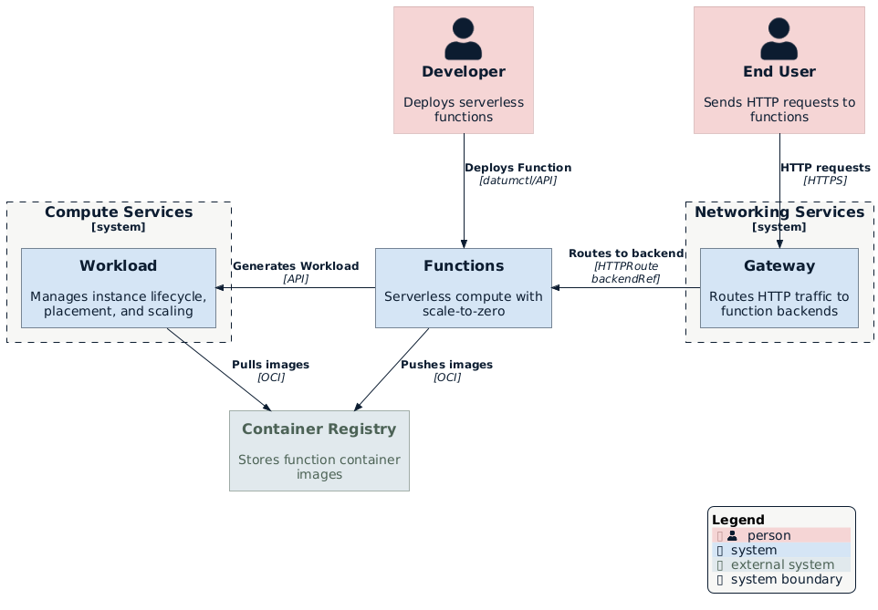
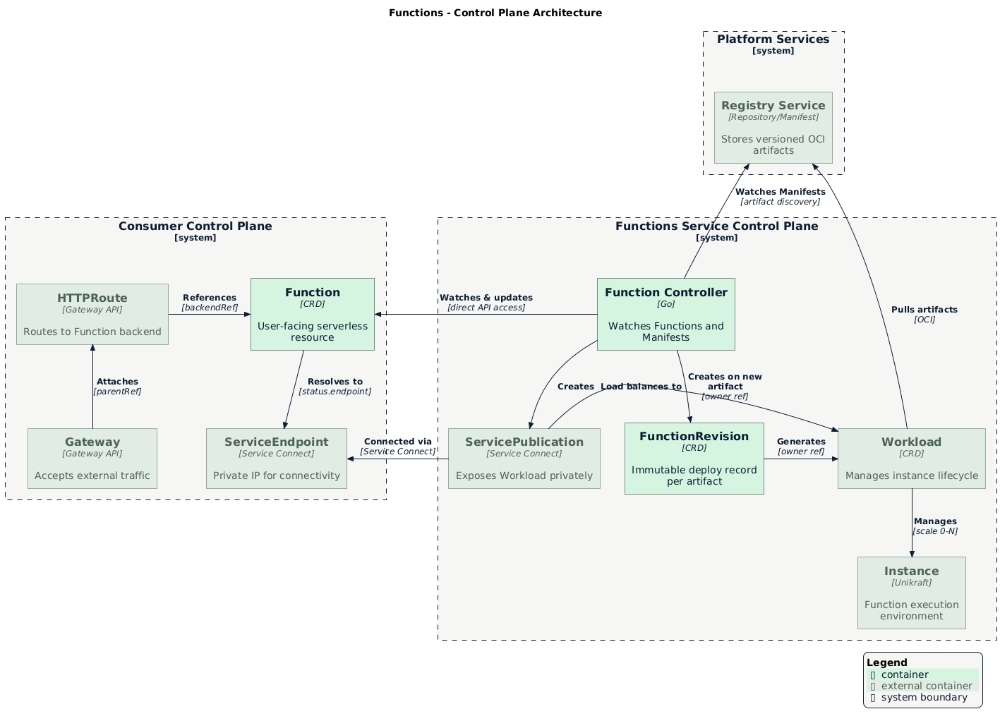
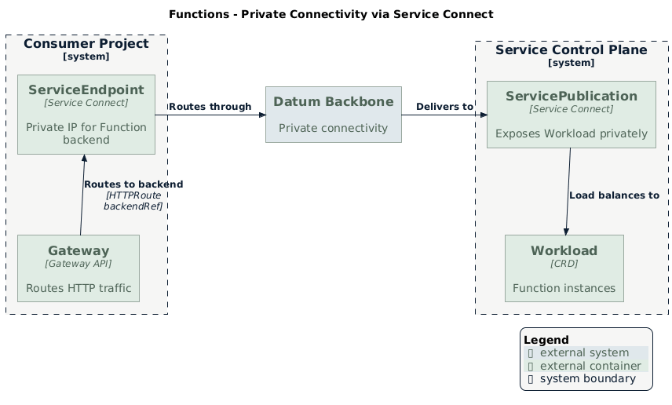

<!-- omit from toc -->
# Functions - Serverless Edge Compute

- [Summary](#summary)
- [Motivation](#motivation)
  - [Goals](#goals)
  - [Non-Goals](#non-goals)
- [Proposal](#proposal)
  - [Developer Experience](#developer-experience)
  - [User Stories](#user-stories)
  - [Security](#security)
  - [Building on Workload](#building-on-workload)
  - [Unikraft Runtime](#unikraft-runtime)
  - [Control Plane Architecture](#control-plane-architecture)
  - [Artifact Discovery and Revisions](#artifact-discovery-and-revisions)
  - [Private Connectivity via Service Connect](#private-connectivity-via-service-connect)
  - [Notes/Constraints/Caveats](#notesconstraintscaveats)
  - [Risks and Mitigations](#risks-and-mitigations)
- [Future Work](#future-work)
- [Dependencies](#dependencies)
- [Alternatives](#alternatives)
  - [Extend Workload Resource](#extend-workload-resource)
  - [Direct Runtime Integration](#direct-runtime-integration)

## Summary

Functions is a serverless compute capability that enables developers to run
scripts at the edge for common use cases like request interception, simple APIs,
and webhooks. It provides a simplified interface with automatic scaling
(including scale-to-zero) and sub-50ms cold starts via Unikraft unikernels.

## Motivation

Many developers have simple use cases that don't require the full control that
Workload provides. Common scenarios include:

- **Request interception**: Modify headers, rewrite URLs, add authentication
- **API endpoints**: Simple CRUD operations, webhooks, form handlers
- **Server-side rendering**: Generate HTML at the edge for low-latency responses

These use cases benefit from a streamlined interface where the platform handles
infrastructure decisions automatically.

### Goals

- Enable developers to deploy functions with minimal configuration
- Support true scale-to-zero with automatic scaling on traffic
- Provide multi-language support (Go, Node.js, Python, Rust)
- Integrate with Gateway API for HTTP routing

### Non-Goals

- Replacing Workload for advanced infrastructure use cases
- Supporting stateful workloads
- GPU workloads or specialized hardware
- Region selection in MVP (automatic placement only)

## Proposal

Functions introduces a `Function` resource that abstracts infrastructure
complexity. Developers reference a Repository in the Registry Service; the
platform handles everything else.

The Function controller watches the Repository for new artifacts and deploys
them automatically. Functions is artifact-source agnostic—CI pipelines, GitHub
Actions, or manual `oras push` all work identically. This decoupling keeps
Functions focused on deployment while allowing flexibility in how artifacts are
created.

<p align="center">
  
</p>

### Developer Experience

> [!NOTE]
> The detailed UX for Functions is still being worked through. This section
> outlines the high-level vision for how developers will deploy and manage
> functions.

**Deployment workflows:**

- **Git-driven (recommended)**: Developers connect a GitHub repository to their
  project. When they push code, the platform automatically builds and deploys
  the function. This is the primary workflow for teams with existing CI/CD
  practices.

- **Direct upload**: For quick iterations or simpler use cases, developers can
  upload code directly through the Portal or CLI without setting up a Git
  connection.

**Management capabilities:**

- **Revision history**: View all deployed versions with timestamps and artifact
  digests. One-click rollback to any previous version.

- **Logs and invocations**: See recent invocations, response times, and errors.
  Access logs for debugging without leaving the Portal.

- **Scaling visibility**: Monitor current instance count, see when scale-to-zero
  activates, and understand cold start frequency.

- **Health status**: At-a-glance view of whether the function is healthy,
  deploying, or experiencing errors.

**CLI experience:**

```bash
# Deploy from current directory
datum functions deploy my-function

# View recent logs
datum functions logs my-function

# List revisions and rollback
datum functions revisions my-function
datum functions rollback my-function --revision=rev-2

# Invoke for testing
datum functions invoke my-function --data '{"test": true}'
```

The goal is for developers to go from code to running function in under a
minute, with clear feedback at each step and easy access to logs when things go
wrong.

### User Stories

#### Deploy a Function

As a developer, I want to deploy an API endpoint without configuring
infrastructure. I create a Function pointing to a Repository, and when artifacts
appear in that Repository, they're deployed automatically. No network
configuration, instance sizing, or placement decisions required.

#### Automatic Redeploy on New Artifacts

As a developer, I want my function to automatically redeploy when new artifacts
are pushed to the Repository. Whether I push directly, use Build Service, or
have CI push artifacts, the function picks up changes automatically.

#### Rollback to Previous Version

As a developer, I want to roll back my function to a previous version when a
deployment causes issues. I select a previous FunctionRevision, and the platform
immediately routes traffic to that version. The rollback is deterministic
because artifacts are immutable.

#### Scale to Zero When Idle

As a developer, I want my function to scale to zero when not receiving traffic
to minimize costs. The function automatically scales down after an idle period
and scales back up when traffic arrives.

#### Route Traffic via Gateway

As a developer, I want to expose my function via an HTTPRoute so it's accessible
through my project's Gateway.

### Security

Functions are not directly accessible from the internet. To expose a function
publicly, developers create a route through their project's Gateway. This
provides a single point of control for access policies:

- **Authentication**: Gateway supports OIDC, Basic Auth, and API keys
- **IP restrictions**: Allow or deny traffic based on IP address ranges
- **Rate limiting**: Protect functions from traffic spikes

For private access between a consumer's applications and their functions,
Service Connect provides secure connectivity without exposing traffic to the
public internet.

### Building on Workload

Rather than building compute capabilities from scratch, Functions generates
[Workload][workload-enhancement] resources with serverless-optimized defaults.
Workload is the platform's foundational compute primitive, providing instance
lifecycle management, placement, scaling, and runtime configuration.

This approach:

- **Reduces duplication**: Functions inherits Workload's battle-tested
  infrastructure
- **Ensures consistency**: All compute services use the same underlying
  primitives
- **Simplifies operations**: One set of compute infrastructure to monitor and
  maintain

As Workload gains new capabilities, Functions automatically benefits. For
example, when Workload adds direct VPC connectivity, Functions will inherit that
capability without requiring changes to the Functions service itself.

Workload also enables deployment across multiple infrastructure providers. The
long-term vision is for the platform's networking layer to stitch together
connectivity across providers, allowing Functions to run closer to users
regardless of where the underlying compute is provisioned. By building on
Workload, Functions will inherit this multi-provider capability as it matures.

Functions deploys these Workloads in the Functions service control plane, not in
the consumer's project. This design choice enables:

- **Simplified user experience**: Consumers interact only with their Function
  resource; they never see or manage the underlying Workloads
- **Platform-managed infrastructure**: The platform controls placement, scaling,
  and runtime configuration without consumer involvement
- **Operational efficiency**: The Functions team can upgrade, patch, and
  optimize infrastructure across all consumers without requiring consumer action
- **Resource optimization**: The platform can make scheduling decisions across
  all consumers rather than within isolated consumer projects

Functions establishes the pattern for managed services on Datum Cloud. Future
services (Databases, Caches, ML Inference) will follow the same
approach—building on Workload rather than implementing compute from scratch.

### Unikraft Runtime

Functions achieves sub-50ms cold starts through Unikraft unikernels. Unikraft
provides:

- **Minimal images**: 1-10MB unikernels vs 100MB+ containers
- **Fast boot**: 10-50ms cold starts via snapshot/restore
- **VM isolation**: MicroVMs provide hardware-level security and full isolation
- **Multi-language**: Go, Node.js, Python, Rust support

The Workload controller handles Unikraft runtime execution via Firecracker
MicroVMs. Functions consumes Workload—it doesn't own Unikraft directly. This
separation allows other services to use the Unikraft runtime independently.

### Control Plane Architecture

The Function controller runs in the Functions service control plane and directly
accesses consumer project APIs:

<p align="center">
  
</p>

1. **Watches** Function resources across consumer projects
2. **Creates** corresponding Workloads in per-consumer namespaces
3. **Updates** Function status directly in consumer projects

This direct access pattern (rather than federation-based sync) provides:

- **Simpler architecture**: Single component handles watch and status updates
- **Lower latency**: No intermediate sync layer
- **Full context**: Controller has complete information for reconciliation
- **Easier debugging**: Single point of control

Authentication uses service identity with PolicyBindings created automatically
when consumers enable the Functions service.

### Artifact Discovery and Revisions

Functions automatically detects new code in Registry and deploys it. Developers
push code (directly or via CI), and Functions handles the rest—no manual
deployment steps required.

Each deployment creates a **revision**—an immutable record of that version.
Revisions enable:

- **Immutable history**: Every deployed version is recorded
- **Instant rollback**: Revert to any previous version with one click
- **Audit trail**: Track what was deployed and when
- **Canary deploys** (future): Route traffic across multiple versions

### Private Connectivity via Service Connect

Because Workloads run in the service control plane, [Service
Connect][service-connect-enhancement] provides private connectivity between the
consumer's applications and their Functions:

<p align="center">
  
</p>

When a consumer creates a Function:

1. The Function controller creates a Workload in the service control plane
2. A ServicePublication exposes the Workload for private access
3. A ServiceEndpoint appears in the consumer's project with a private IP
4. The consumer's applications connect via the private IP or DNS name

This model provides:

- **Private networking**: Traffic never traverses the public internet
- **No VPC peering**: Consumers don't need to peer networks with the platform
- **Overlapping IP support**: NAT handles address conflicts between consumers
- **Consistent pattern**: All managed services use the same connectivity model

#### Future: Accessing Consumer Resources

Many serverless workloads need to access backend resources—databases, internal
APIs, caches, or message queues—running in the consumer's own environment. The
initial Service Connect design enables consumers to reach their Functions, but
not the reverse direction.

A future phase of Service Connect will enable Functions to securely access
consumer resources. Consumers will explicitly publish services they want
Functions to reach, maintaining full control over what is exposed. This provides
a secure, managed alternative to public endpoints or complex network peering.

This capability is being designed as part of the [Service Connect
enhancement][service-connect-enhancement]. See the Future Work section for
details on Consumer Service Publications.

### Notes/Constraints/Caveats

- **Automatic Placement**: MVP supports only automatic placement. Region
  selection is planned for a future phase.
- **Stateless Only**: Functions are designed for stateless workloads. Functions
  can integrate with external services via public endpoints initially. A future
  Service Connect enhancement will enable secure, private access to consumer
  resources (databases, caches, internal APIs) without requiring public exposure.
- **HTTP-Only Triggers**: MVP supports HTTP triggers only. Cron and event
  triggers are planned for future phases.

### Risks and Mitigations

| Risk | Mitigation |
|------|------------|
| Cold start latency | Unikraft snapshot/restore targets sub-50ms P95 |
| Scale-from-zero delays | Queue requests during cold start; target <100ms scale decision |
| Artifact discovery latency | Poll interval tunable; webhook acceleration in future phase |
| Registry Service unavailable | Functions caches last-known-good revision; graceful degradation |

## Future Work

The MVP focuses on HTTP-triggered functions with automatic placement. Future
phases will expand Functions based on customer feedback:

**Triggers:**

- **Cron triggers**: Schedule functions to run on a schedule (e.g., nightly
  reports, cleanup jobs)
- **Event triggers**: Invoke functions in response to platform events (e.g., new
  file in storage, message in queue)

**Deployment:**

- **Region selection**: Allow developers to deploy functions to specific regions
  for compliance or latency requirements
- **Canary deploys**: Gradually shift traffic between revisions to reduce
  deployment risk

**Connectivity:**

- **Access consumer resources**: Enable functions to securely connect to
  databases, APIs, and other resources running in the consumer's environment via
  Service Connect (reverse direction)

**Identity:**

- **Function identity**: Assign identities to functions for authenticating with
  external services and APIs without embedding credentials in code

**Performance:**

- **Webhook-based deployment**: Replace polling with webhooks for faster
  artifact detection and deployment

## Dependencies

Functions builds on other platform services:

- **Registry**: Stores function code and container images. Functions
  automatically detects and deploys new versions when they appear in Registry.

- **Workload**: Runs function instances. Functions uses Workload under the hood
  for fast cold starts and automatic scaling.

- **Gateway**: Routes HTTP traffic to functions. Developers expose functions to
  the internet by creating routes through their project's Gateway.

- **Service Connect**: Provides private connectivity between a consumer's
  applications and their functions without exposing traffic to the internet.

## Alternatives

### Extend Workload Resource

Add "serverless mode" to existing Workload.

**Rejected because:** Workload is designed for advanced use cases. Adding
serverless semantics would complicate Workload's mental model.

### Direct Runtime Integration

Have Function controller manage instances directly without Workload.

**Rejected because:** Duplicates infrastructure already built in Workload. Loses
benefits of Workload's placement, scaling, and runtime management.

<!-- References -->
[workload-enhancement]: ../workloads/README.md
[service-connect-enhancement]: ../../platform/service-connect/README.md
[registry-enhancement]: ../../platform/registry/README.md
