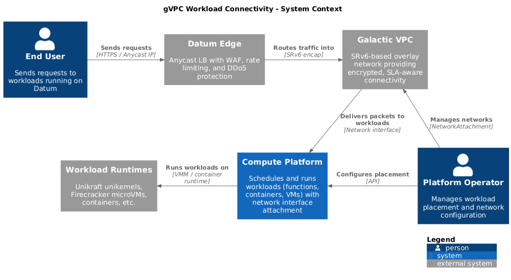
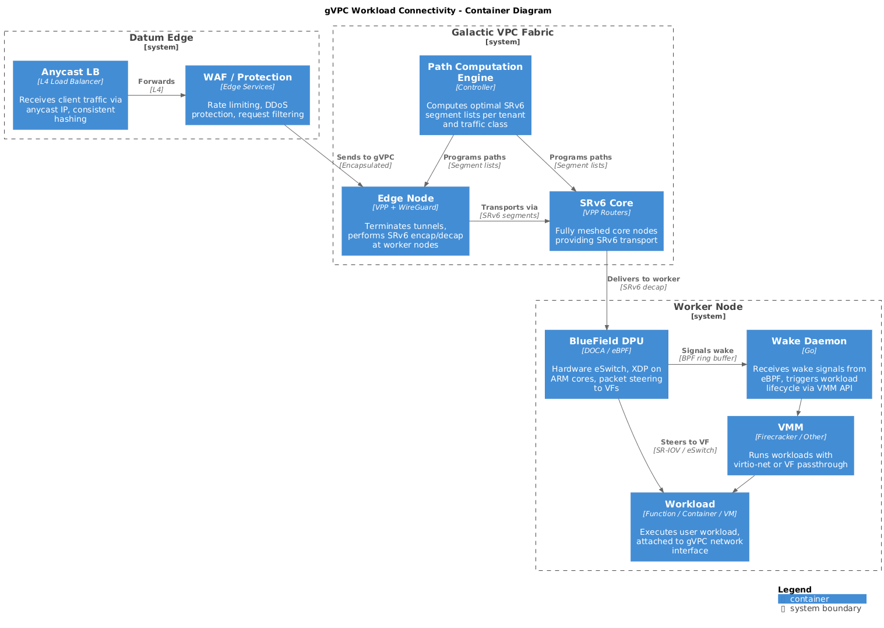
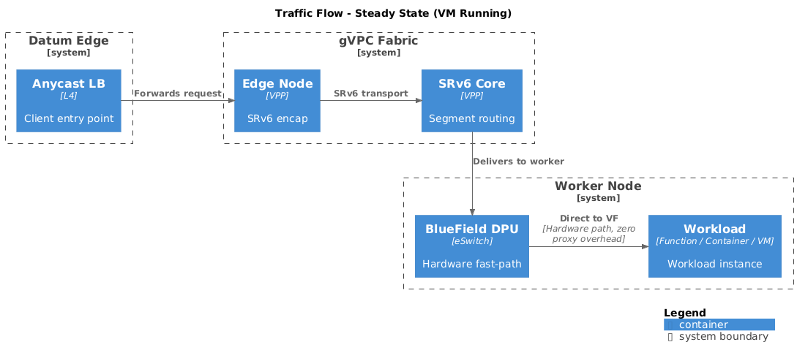
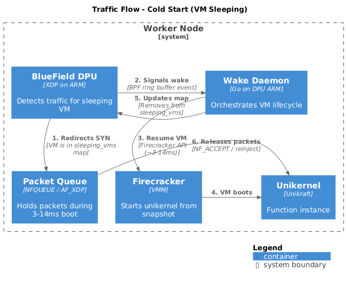
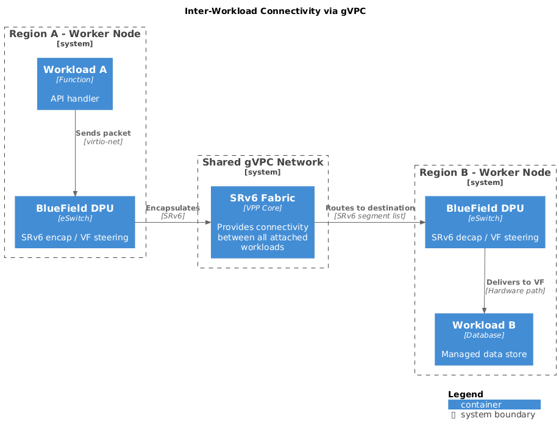

<!-- omit from toc -->
# gVPC Workload Connectivity

- [Summary](#summary)
- [Motivation](#motivation)
  - [Problem Statement](#problem-statement)
  - [Goals](#goals)
  - [Non-Goals](#non-goals)
- [Proposal](#proposal)
  - [User Stories](#user-stories)
  - [Notes/Constraints/Caveats](#notesconstraintscaveats)
  - [Risks and Mitigations](#risks-and-mitigations)
- [Design Details](#design-details)
  - [Architecture Overview](#architecture-overview)
  - [Traffic Flow: Steady State](#traffic-flow-steady-state)
  - [Traffic Flow: Cold Start (Scale from Zero)](#traffic-flow-cold-start-scale-from-zero)
  - [Proxyless Wake-on-Traffic](#proxyless-wake-on-traffic)
  - [Inter-Workload Connectivity](#inter-workload-connectivity)
  - [Demand-Driven Regional Placement](#demand-driven-regional-placement)
  - [BlueField DPU Integration](#bluefield-dpu-integration)
  - [Workload Runtime Integration](#workload-runtime-integration)
- [Alternatives](#alternatives)
  - [Direct Envoy-to-Runtime Proxy](#direct-envoy-to-runtime-proxy)
  - [Drop SYN and Rely on TCP Retransmit](#drop-syn-and-rely-on-tcp-retransmit)
  - [Retain Runtime-Specific Proxies](#retain-runtime-specific-proxies)
- [Open Questions](#open-questions)
- [Implementation History](#implementation-history)
- [References](#references)

## Summary

This enhancement defines a single integration point in the compute layer for
connecting workloads to the [Galactic VPC (gVPC)][gvpc-enhancement] network
fabric. Rather than each product offering building its own network connectivity,
all workload types attach to gVPC at the network interface layer through a
shared platform capability.

This connectivity layer is a building block that product offerings build on top
of. A serverless functions product, a managed database, or a container platform
each consume the same network attachment model -- they do not implement their
own edge integration, proxy layer, or inter-workload networking. The compute
platform handles traffic steering, lifecycle concerns (like scale-from-zero),
and inter-workload communication so product teams can focus on their offering's
value rather than networking plumbing.

  

## Motivation

### Problem Statement

The platform does not yet have a connectivity model for attaching workloads to
the Galactic VPC. As we introduce product offerings that run workloads --
serverless functions, managed databases, container platforms -- each offering
will need network connectivity: receiving traffic from external clients and
communicating with other workloads in the same project.

Without a shared capability, each product team would solve connectivity
independently, building its own edge integration, proxy layer, and
inter-workload networking. This is the wrong approach for three reasons:

1. **Platform capability, not product concern.** Network connectivity is
   infrastructure that all compute workloads need. Building it once in the
   compute layer means every product offering gets it for free. Product teams
   should focus on what makes their offering valuable, not on networking
   plumbing.

2. **Inter-workload connectivity requires a shared fabric.** Workloads in the
   same project need to communicate with each other -- a function calling a
   database, a container calling a cache. This only works if all workload types
   participate in the same network.

3. **Investment compounds instead of being repeated.** Work put into the
   connectivity layer benefits every current and future product offering.
   Per-product shortcuts do not compound and must be replaced when the proper
   fabric is in place.

### Goals

- Provide a single network attachment capability in the compute layer that
  product offerings consume rather than build themselves
- Define a workload-agnostic connectivity model where any workload type attaches
  to gVPC at the network interface layer
- Enable inter-workload connectivity so workloads in the same gVPC can
  communicate directly, regardless of type
- Support lifecycle-aware traffic handling (scale-from-zero, idle detection)
  as a platform concern rather than a per-product implementation
- Support demand-driven regional placement where the platform schedules
  instances closer to traffic sources based on observed patterns
- Define clear integration boundaries between workload runtimes and the
  platform's network fabric

### Non-Goals

- Building a general-purpose L7 proxy or service mesh -- edge WAF/rate limiting
  remains at the Datum Edge layer
- Replacing workload runtimes -- Datum consumes Unikraft, Firecracker, etc. as
  runtime dependencies
- Designing the full gVPC control plane -- this enhancement focuses on the
  workload attachment and traffic delivery aspects; the
  [gVPC enhancement][gvpc-enhancement] covers the broader network architecture
- Hardware-offloading [Segment Routing over IPv6 (SRv6)][srv6] endpoint
  functions in P4/[DOCA Pipeline Language (DPL)][dpl] on BlueField -- the
  initial implementation uses [eXpress Data Path (XDP)][xdp] on
  [Data Processing Unit (DPU)][dpu] ARM cores with hardware offload as a future
  optimization

## Proposal

Workloads connect to gVPC through a network interface attached to their VM's
[TAP device][tap], which the DPU's eSwitch steers traffic to via
[Single Root I/O Virtualization (SR-IOV)][sriov] virtual functions (VFs). The
Datum Edge forwards client traffic into the gVPC fabric after applying WAF and
rate limiting. The gVPC SRv6 core routes packets to the correct worker node. On
the worker node, the [BlueField DPU][bluefield] delivers packets directly to the
workload's VF -- no proxy in the path.

For workloads that support scale-from-zero (such as [Unikraft][unikraft]
functions), an XDP program on the DPU ARM cores detects traffic for idle
instances and signals a wake daemon, which triggers the
[Virtual Machine Monitor (VMM)][firecracker] to resume the workload. Packets are
held in a kernel queue ([Netfilter Queue / NFQUEUE][nfqueue]) or
[Address Family XDP (AF_XDP)][af-xdp] buffer during the boot window, then
released directly to the workload. The client never experiences a TCP
retransmit.

  

### User Stories

#### Story 1: Workload receives traffic via gVPC

As a consumer, I deploy a workload to the Datum platform. The platform attaches
my workload's VM to a gVPC network. When clients send requests to my workload's
endpoint, traffic flows through the Datum Edge into gVPC, arrives at the worker
node's DPU, and is delivered directly to my workload's network interface. I do
not configure networking -- the platform handles attachment automatically.

#### Story 2: Function scales from zero without proxy latency

As a consumer, my function has been idle and scaled to zero. When a new request
arrives, the platform boots my function in under 20ms and delivers the buffered
request without dropping the TCP connection. The cold start latency is
indistinguishable from normal network jitter.

#### Story 3: Cross-workload communication

As a consumer, I have a function and a managed database in the same project.
My function connects to the database over the gVPC network using a private DNS
name. Traffic routes through the SRv6 fabric without public internet exposure,
even if the workloads run on different worker nodes in different regions.

#### Story 4: Demand-driven placement reduces latency

As a platform operator, I observe that a workload is receiving significant
traffic from a new region. The platform automatically schedules instances in
that region to reduce latency, using gVPC to route traffic to the nearest
available instance.

### Notes/Constraints/Caveats

- **Unikraft currently uses [virtio-net][virtio] via Firecracker TAP devices.**
  There is no SR-IOV or [Virtual Function I/O (VFIO)][vfio] support in Unikraft
  today. The DPU's eSwitch must bridge to the TAP device through the host
  kernel, or Unikraft must add VF passthrough support. This is the most
  significant integration constraint for functions specifically.

- **BlueField XDP runs in native mode on ARM cores, not hardware-offloaded.**
  XDP programs execute on the DPU's ARM subsystem, not in the eSwitch silicon.
  This is sufficient for control-plane operations (wake signaling, map lookups)
  but not for line-rate data-plane processing. Steady-state traffic should use
  eSwitch flow rules ([DOCA][doca-sdk] Flow or OVS offload) for hardware-path
  delivery.

- **SRv6 on BlueField requires custom P4/DPL development.** SRv6 is not a
  native DOCA Flow tunnel type like
  [Virtual Extensible LAN (VXLAN)][vxlan]. The flex parser supports SRv6 header
  recognition, and encapsulation/decapsulation can be built in DPL, but this is
  custom work. [Arrcus][arrcus-srv6] has demonstrated production SRv6 on
  BlueField-3 (with SoftBank for 5G edge breakout), confirming feasibility.

- **No production platform does proxyless scale-from-zero at the NIC level
  today.** [Koyeb][koyeb-scale-to-zero] comes closest with
  [Extended Berkeley Packet Filter (eBPF)][ebpf]-based idle detection but uses
  drop-and-retransmit (not packet buffering). This architecture combines proven
  primitives (XDP, NFQUEUE, AF_XDP, Firecracker snapshots) in a novel way.

- **Scale-from-zero is opt-in per workload type.** Long-running workloads
  (databases, always-on services) do not use the wake-on-traffic path. The DPU
  steers their traffic through the hardware fast-path at all times.

### Risks and Mitigations

| Risk | Impact | Mitigation |
|------|--------|------------|
| Unikraft virtio-net cannot attach to DPU VFs directly | Adds a kernel hop via TAP+bridge instead of direct VF passthrough | Acceptable for v1; work with Unikraft on VF support as optimization |
| NFQUEUE packet hold introduces kernel dependency | Tight coupling to Linux netfilter subsystem | AF_XDP on DPU ARM cores is a pure-userspace fallback that avoids netfilter entirely |
| SRv6 DPL development takes longer than expected | Delays hardware-path optimization | Start with SRv6 on VPP (software) at edge nodes; BlueField hardware offload is an optimization, not a blocker |
| gVPC is not ready when functions need to ship | Functions launch is blocked | Define a minimal gVPC milestone that functions require; the full gVPC feature set is not needed for day-one workloads |

## Design Details

### Architecture Overview

The system has four layers, each with clear responsibilities:

| Layer | Component | Responsibility |
|-------|-----------|----------------|
| **Edge** | Anycast LB + WAF | Client-facing traffic reception, DDoS protection, rate limiting |
| **Fabric** | gVPC SRv6 Core | Encrypted, SLA-aware transport between edge and worker nodes |
| **Node** | BlueField DPU | Hardware traffic steering, wake-on-traffic signaling, SR-IOV |
| **Workload** | VMM + Runtime | Workload execution (Firecracker + Unikraft for functions, other VMMs for other types) |

The edge and fabric layers are fully workload-agnostic. The node layer provides
workload-type-specific behaviors (scale-from-zero for functions, always-on
steering for databases) through configurable eBPF programs. The workload layer
is pluggable -- any runtime that exposes a network interface can attach to gVPC.

### Traffic Flow: Steady State

When a workload instance is running, traffic flows through hardware-accelerated
paths with no software proxy:

1. Client sends a request to the workload's anycast IP.
2. Datum Edge LB applies WAF/rate limiting, forwards to gVPC edge node.
3. gVPC edge node performs SRv6 encapsulation. The Path Computation Engine has
   pre-programmed the segment list based on the destination worker node and
   traffic class.
4. SRv6 core routes the packet through the optimal path.
5. The destination worker's BlueField DPU decapsulates and steers the packet
   directly to the workload's virtual function via the eSwitch hardware
   fast-path.
6. The workload processes the request and responds. The response follows the
   reverse path.

  

**Key property:** Zero proxy overhead in the data path. The DPU's eSwitch
handles forwarding at line rate using pre-programmed flow rules. This path is
identical for all workload types.

### Traffic Flow: Cold Start (Scale from Zero)

When a workload that supports scale-from-zero has been idle and a request
arrives:

  

The cold start sequence:

1. **Packet arrives at DPU.** The XDP program (running on DPU ARM cores) checks
   the `sleeping_vms` BPF hash map. The destination IP matches a sleeping
   instance.

2. **Packet is queued.** The XDP program redirects the packet to either:
   - **NFQUEUE**: Packet stays in kernel memory. A userspace daemon issues
     `NF_ACCEPT` to release it once the VM is ready. The packet never leaves
     the kernel data path.
   - **AF_XDP socket**: Packet is redirected to a userspace buffer on the DPU
     ARM cores. The daemon reinjects it after boot.

3. **Wake signal fires.** The XDP program writes an event to a BPF ring buffer
   (`BPF_RB_FORCE_WAKEUP` for immediate notification). The wake daemon receives
   the event in microseconds.

4. **VM resumes.** The wake daemon calls the VMM API (e.g., Firecracker) to
   restore the workload from a memory snapshot. For Unikraft functions, boot
   completes in 3-14ms.

5. **Map updated, packets released.** The daemon removes the instance from
   `sleeping_vms`. Queued packets are released to the now-running workload. The
   NFQUEUE rule is removed or the eSwitch flow rule is updated to direct
   future traffic through the hardware fast-path.

**Why not drop the SYN and rely on TCP retransmit?** TCP's initial retransmit
timer is 1 second (RFC 6298). Unikraft boots in 3-14ms. Dropping the SYN adds
1000ms of latency for a 4ms boot -- a 250x penalty that wastes the entire value
of fast boot times. Packet queuing preserves the sub-20ms cold start experience.

### Proxyless Wake-on-Traffic

The wake-on-traffic system replaces per-runtime proxy responsibilities with
platform-level DPU capabilities:

| Proxy responsibility | Proxyless replacement | Where it runs |
|---------------------|----------------------|---------------|
| Traffic detection | XDP program checks `sleeping_vms` BPF map | DPU ARM cores |
| Request buffering | NFQUEUE (kernel memory) or AF_XDP (DPU userspace) | DPU ARM cores |
| Wake signal | BPF ring buffer event to wake daemon | DPU ARM cores |
| Idle detection | eBPF packet counters per instance, cooldown logic in daemon | DPU ARM cores |
| TCP connection hold | NFQUEUE holds packet in kernel; VM resumes with TCP state intact via snapshot | DPU + VMM |
| Load balancing | gVPC fabric + eSwitch flow rules | Hardware path |

All wake-on-traffic logic runs on the DPU's ARM cores, consuming zero host CPU.
The host CPU is reserved entirely for running workloads. This model is
runtime-agnostic -- any workload that supports snapshot/restore can use the same
wake-on-traffic path, regardless of whether it's a Unikraft unikernel, a
Firecracker microVM, or a future runtime.

### Inter-Workload Connectivity

Workloads attached to the same gVPC network communicate directly through the
SRv6 fabric, regardless of workload type:

  

- Workload A sends a packet to workload B's private IP via its network
  interface.
- The local DPU encapsulates the packet with SRv6 headers.
- The gVPC fabric routes the packet to workload B's worker node, potentially
  in a different region.
- The destination DPU decapsulates and delivers to workload B's VF.

This enables composition patterns across workload types: a function calls a
database, a function calls another function, a container calls a cache. All
connectivity is private, encrypted via the SRv6 fabric, and requires no
per-workload networking configuration.

### Demand-Driven Regional Placement

The DPU's traffic monitoring capabilities feed the placement system:

1. **eBPF counters per source region** track where traffic originates.
2. The platform's scheduler observes traffic patterns and identifies regions
   where local instances would reduce latency.
3. New instances are scheduled in high-traffic regions. gVPC provides
   connectivity immediately -- no additional network configuration required.
4. When traffic subsides, instances in low-traffic regions scale to zero. The
   DPU continues monitoring for future demand.

gVPC handles the "long-haul" case: when a request arrives at a region without a
local instance, the fabric routes it to the nearest region that has one. The
user experiences higher latency but the request still succeeds.

### BlueField DPU Integration

The DPU serves three roles in this architecture:

**1. Hardware traffic steering (steady state)**

DOCA Flow or OVS offload programs eSwitch rules that forward packets directly
from the network port to the workload's VF. No ARM core or host CPU involvement
for established flows. This is the same mechanism for all workload types.

**2. Wake-on-traffic signaling (cold start)**

XDP programs on the ARM cores detect packets for sleeping workloads and signal
the wake daemon. This is a control-plane operation -- low throughput, latency
sensitive. Native XDP on ARM cores is sufficient; hardware offload is not
needed. The wake daemon is configured per workload type to call the appropriate
VMM API.

**3. SRv6 edge processing**

The DPU performs SRv6 encapsulation/decapsulation at the worker node boundary.
Initially this runs on [Vector Packet Processing (VPP)][vpp] software colocated
with the DPU. Future optimization moves this into the DPU's programmable
pipeline via DPL (P4-based), as Arrcus
has demonstrated with their SRv6 MUP implementation on BlueField-3.

<<[UNRESOLVED @zachary @shelby @peter]>>
The DPU integration model depends on whether workload runtimes can support VF
passthrough (SR-IOV) or must use virtio-net via TAP devices. If TAP-only, the
DPU steers traffic to the host kernel bridge, adding a kernel hop. If VF
passthrough is available, traffic goes directly from eSwitch to VM -- true
hardware path. This needs to be evaluated per runtime (Unikraft/Firecracker
first, others to follow).
<<[/UNRESOLVED]>>

### Workload Runtime Integration

The platform defines a clear contract between the network fabric and workload
runtimes:

**What the platform provides:**
- Network fabric (gVPC) and automatic workload attachment
- Traffic steering and wake-on-traffic (DPU + eBPF)
- Idle detection and scale-to-zero decisions
- Workload scheduling and regional placement
- Edge services (WAF, rate limiting, DDoS protection)

**What the runtime provides:**
- A binary/pod that runs the workload VMM
- A network interface (virtio-net at minimum, VF passthrough preferred)
- Snapshot/restore capability (for runtimes that support scale-from-zero)

**What the runtime does NOT need to provide:**
- Traffic proxy or edge integration -- the platform handles connectivity
- Idle detection logic -- the platform's eBPF counters track traffic
- Custom networking between workloads -- gVPC handles inter-workload
  communication

This contract means new workload types (containers, managed databases, ML
inference) get gVPC connectivity by implementing the network interface contract.
They do not need to build their own proxy, edge integration, or inter-workload
networking.

<<[UNRESOLVED @julia]>>
For the Unikraft integration specifically: evaluate whether VF passthrough
(SR-IOV) can be supported in the Firecracker fork. This would eliminate the
TAP+bridge kernel hop and enable true hardware-path delivery from DPU eSwitch
to unikernel.
<<[/UNRESOLVED]>>

## Alternatives

### Direct Envoy-to-Runtime Proxy

Connect Envoy at the edge directly to each workload's proxy component (e.g.,
the Unikraft proxy for functions), similar to how tunnels operate today.

**Why we rejected this:**
- All integration work is throwaway when gVPC arrives.
- The proxy remains in the steady-state data path, adding latency and
  consuming host CPU for every request.
- Does not validate gVPC, pushing the harder integration problem further out.
- Does not enable inter-workload connectivity.
- Must be repeated for every new workload type.

This approach is lower effort in the short term but does not compound. The team
concluded that prioritizing gVPC readiness is the better investment, even if it
pushes timelines.

### Drop SYN and Rely on TCP Retransmit

The approach used by [Koyeb][koyeb-scale-to-zero]: eBPF drops the first SYN
packet, signals a wake daemon, and relies on TCP's retransmit mechanism to
deliver the next attempt after the VM has booted.

**Why we rejected this:**
- TCP's initial retransmit timer is 1 second (RFC 6298). Unikraft boots in
  3-14ms. This adds 1000ms of latency for a sub-10ms operation.
- The platform cannot control client TCP stacks to reduce the initial RTO.
- This approach only works for TCP; UDP traffic is permanently lost.
- It wastes the value of fast-booting runtimes like Unikraft.

Koyeb's approach makes sense for their 200ms snapshot-restore times, where the
1-second retransmit is only a 5x penalty. For Unikraft's 3-14ms boots, the
penalty is 70-330x.

### Retain Runtime-Specific Proxies

Keep each runtime's proxy in the data path but connect it to gVPC instead of
Envoy. For example, the Unikraft proxy handles cold start buffering and idle
detection; gVPC handles transport.

**Why we rejected this:**
- The proxy adds latency and host CPU overhead for every request, even in steady
  state.
- Datum cannot evolve wake-on-traffic behavior independently -- it depends on
  each runtime's proxy release cycle.
- Each new workload type requires a new proxy integration.
- The proxy duplicates capabilities that the DPU provides more efficiently
  (traffic counting, packet steering).
- Moving wake-on-traffic to the DPU is architecturally aligned with where
  Datum is heading for all workload types.

## Open Questions

1. **Minimal gVPC milestone for first workload.** What is the smallest slice of
   gVPC that functions need on day one? Single-region attachment with SRv6
   transport to one worker node may be sufficient to unblock functions while the
   full gVPC feature set matures.

2. **VF passthrough per runtime.** Can Unikraft's Firecracker fork support
   SR-IOV virtual functions, or must we use TAP+bridge? This determines whether
   steady-state traffic hits the hardware fast-path or takes a kernel hop. The
   answer may differ per runtime.

3. **NFQUEUE vs AF_XDP for packet hold.** NFQUEUE is simpler (packet stays in
   kernel memory) but couples to Linux netfilter. AF_XDP is more portable and
   runs entirely on DPU ARM cores but requires packet reinjection logic. Which
   is the right default?

4. **SRv6 on DPU timeline.** Should v1 run SRv6 encap/decap in VPP software on
   the host, with DPU hardware offload as a v2 optimization? Or should we invest
   in DPL/P4 development from the start?

5. **Scheduling signals.** How does the placement system consume eBPF traffic
   counters from the DPU? Direct API from DPU ARM cores to the scheduler, or
   metrics pipeline via OpenTelemetry?

## Implementation History

- 2026-03-19: Initial discussion captured from team sync (Scot, Drew, Zach SF,
  Zachary Smith). Decision to pursue gVPC-first approach for functions.
- 2026-03-19: Enhancement proposal created from discussion synthesis.

## References

- [Galactic VPC Enhancement][gvpc-enhancement]
- [Global Multi-Cluster Network Platform Enhancement][network-platform]
- [Service Connect Enhancement][service-connect]
- [Koyeb: Scale to Zero with eBPF and Snapshots][koyeb-scale-to-zero]
- [Unikraft Cloud: Scale to Zero][unikraft-scale-to-zero]
- [NVIDIA DOCA Platform][doca-platform]
- [NVIDIA DOCA SDK][doca-sdk]
- [Arrcus SRv6 on BlueField-3][arrcus-srv6]
- [RFC 6298: Computing TCP's Retransmission Timer][rfc-6298]

[gvpc-enhancement]: ../../networking/research/galactic-vpc/README.md
[network-platform]: ../../platform/global-network-platform/README.md
[service-connect]: ../../platform/service-connect/README.md
[koyeb-scale-to-zero]: https://www.koyeb.com/blog/scale-to-zero-wake-vms-in-200-ms-with-light-sleep-ebpf-and-snapshots
[unikraft-scale-to-zero]: https://unikraft.com/blog/scale-to-zero
[doca-platform]: https://github.com/NVIDIA/doca-platform
[doca-sdk]: https://developer.nvidia.com/networking/doca
[arrcus-srv6]: https://arrcus.com/solutions/mup
[rfc-6298]: https://datatracker.ietf.org/doc/html/rfc6298
[af-xdp]: https://docs.kernel.org/networking/af_xdp.html
[ebpf]: https://ebpf.io/what-is-ebpf/
[dpl]: https://docs.nvidia.com/doca/sdk/doca-pipeline-language-services-guide/index.html
[dpu]: https://blogs.nvidia.com/blog/whats-a-dpu-data-processing-unit/
[bluefield]: https://www.nvidia.com/en-us/networking/products/data-processing-unit/
[nfqueue]: https://netfilter.org/projects/libnetfilter_queue/
[sriov]: https://docs.kernel.org/PCI/pci-iov-howto.html
[srv6]: https://www.segment-routing.net/
[unikraft]: https://unikraft.org/
[firecracker]: https://firecracker-microvm.github.io/
[vpp]: https://fd.io/
[xdp]: https://www.iovisor.org/technology/xdp
[tap]: https://docs.kernel.org/networking/tuntap.html
[virtio]: https://docs.oasis-open.org/virtio/virtio/v1.2/virtio-v1.2.html
[vfio]: https://docs.kernel.org/driver-api/vfio.html
[vxlan]: https://datatracker.ietf.org/doc/html/rfc7348
