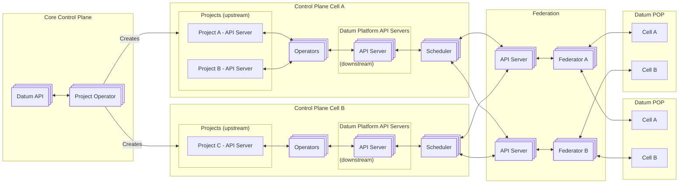
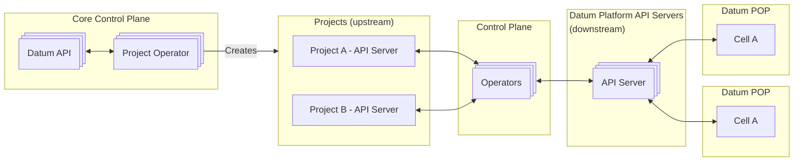

# Resource Federation

> [!IMPORTANT] This document is in in DRAFT

- Need to be able to connect to multiple "source" control planes and propagate
  resources to a "cell" control plane.
- Must prevent collision of resource names across projects, as namespaces are
  not globally unique.
- Federator will interact with Edge clusters to manage resources.
- Make sure that controllers are built such that they are blind to federation
  being in place.
- Take care to ensure resource names and structure make sense, particularly for
  resources created by operators that drive platform changes.

## Design Details

- **Milo Core API Server**: Organization level stuff - projects / etc.
- **Milo Project API Server**: Project specific API server, for project scoped things.
- **Datum Platform API Server**:  API server that operators create resources in to satisfy
  the intent of resources defined in the Project APIs.
- **Federation API Server**: API servers that a “scheduler” will place resources in for
  tools like Karmada to sync out to edge clusters
- **Edge Control API Server**:  API servers that live in edge clusters. These are
  specifically disconnected from the underlying k8s control plane. Operators in
  the clusters will read from these API servers, and program the Edge Cluster
  API server if necessary (I say if necessary, because it might make sense to
  have a vcluster kinda thing - sorta getting into the weeds)
- **Edge Cluster API Server**: Actual API server for Kubernetes that kubelets & such will
  connect to. The “bottom layer”.

### Resource Propagation

- Plan for multiple federator deployments for fault isolation purposes
- Operator integrates with multiple upstream project control planes, creates
  resources in federation control plane which are required to fulfill
  expectations of upstream resources.
- Scheduler processes resources in federation API and schedules onto a target
  downstream cluster.
- Federation API server, possibly based on [KCP](https://www.kcp.io/),
  leveraging workspaces for each upstream project, and each downstream edge
  cluster.
- Federators are either off the shelf tools like Karmada, or custom tools.

Datum is targeting a [Cell-Based Architecture][aws-cell] for both the control
plane and data plane.

From AWS:

> Today, modern organizations face an increasing number of challenges related to
> resiliency, be they scalability or availability, especially when customer
> expectations shift to an always on, always available mentality. More and more,
> we have remote teams and complex distributed systems, along with the growing
> need for frequent launches and an acceleration of teams, processes, and
> systems moving from a centralized model to a distributed model. All of this
> means that an organization and its systems need to be more resilient than
> ever.

- **Control Plane**: API Servers, Operators, Resource definitions.
- **Data Plane**: Services such as network connectivity, workload instances,
  DNS, L4 and L7 proxies.

[aws-cell]: https://docs.aws.amazon.com/wellarchitected/latest/reducing-scope-of-impact-with-cell-based-architecture/reducing-scope-of-impact-with-cell-based-architecture.html

#### Target Architecture

#### MVP Architecture

