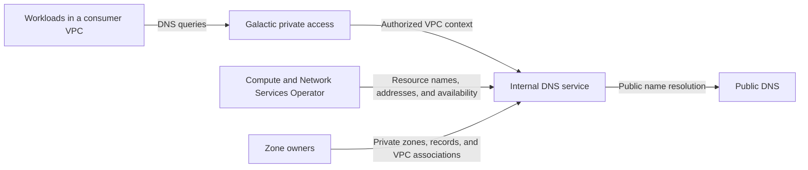

# Internal DNS for Galactic VPC

Tracking issue: [Internal DNS for Galactic VPC (#921)](https://github.com/datum-cloud/enhancements/issues/921)

- [Summary](#summary)
- [Motivation](#motivation)
  - [Goals](#goals)
  - [Non-goals](#non-goals)
- [Proposal](#proposal)
  - [User stories](#user-stories)
  - [Notes, constraints, and caveats](#notes-constraints-and-caveats)
  - [Risks and mitigations](#risks-and-mitigations)
- [Design details](#design-details)
- [Production readiness review questionnaire](#production-readiness-review-questionnaire)
- [Implementation history](#implementation-history)
- [Drawbacks](#drawbacks)
- [Alternatives](#alternatives)
- [Infrastructure needed](#infrastructure-needed)

## Summary

Internal DNS lets you reach resources and services by name within a Galactic
virtual private cloud (VPC). Datum provides automatic private names, custom
private zones, and service discovery without requiring you to operate DNS
infrastructure.

## Motivation

Tracking IP addresses adds configuration work and breaks when resources move or
change. Private DNS gives applications a consistent way to find Compute
instances, Connector-backed services, and network services across a VPC's
locations.

### Goals

- A workload reaches another supported resource by its automatic private name.
- A VPC resolves names from multiple private zones without exposing those names
  to an unassociated VPC.
- Resource changes and service health changes update DNS results within
  documented time limits.

### Non-goals

- Public authoritative DNS hosting.
- Automatic discovery of arbitrary services on connected networks.
- Application load balancing and connection retry behavior.

## Proposal

Datum provides automatic resource names and optional custom private zones. The
following user stories describe the consumer experience.

### User stories

#### Automatic private names

When you create a supported resource in a VPC, Datum assigns it a private DNS
name. Workloads receive DNS configuration automatically. You can use the assigned
name without creating a zone or choosing a zone for each resource. Public names
continue to resolve through the same DNS service.

From a workload in the VPC, query an instance's IPv6 address with `dig`:

```console
$ dig +short AAAA web-01.instances.vpc-123.internal.example.net
2001:db8:123::10
```

Datum updates managed records when addresses change and removes them when you
delete the resource. You can view assigned names on the resource and use custom
aliases for names that your applications depend on.

#### Custom private zones

You can create private zones and records for your applications. A zone groups
names under a domain, such as `prod.internal`. You can make multiple zones
available in one VPC and explicitly share a zone with other VPCs you control.

For example, an application can use `api.prod.internal` for a Compute service
and `database.corp.internal` for a database reached through a Connector. You
manage custom records; Datum maintains automatically assigned resource records.

From the same workload, query names in both associated zones:

```console
$ dig +short AAAA api.prod.internal
2001:db8:123::20

$ dig +short AAAA database.corp.internal
2001:db8:123::30
```

#### VPC isolation

Private names resolve only in VPCs associated with their zone. Separate VPCs can
use the same domain and record names with independent answers. For example,
production and development VPCs can each resolve `database.corp.internal` to
their own database.

From a workload in the production VPC:

```console
$ dig +short AAAA database.corp.internal
2001:db8:123::30
```

From a workload in the development VPC:

```console
$ dig +short AAAA database.corp.internal
2001:db8:456::30
```

Connecting two VPCs does not automatically share their private zones. Publishing
a private record does not publish it to public DNS or grant access to its
destination.

#### Health-aware service discovery

For supported services, DNS returns usable endpoints and removes endpoints that
the service reports as unhealthy or unavailable. Recovered endpoints become
eligible again. If no usable endpoints remain, the service name returns no
endpoint addresses.

Query a service with two healthy endpoints:

```console
$ dig +short AAAA api.services.vpc-123.internal.example.net
2001:db8:123::21
2001:db8:123::22
```

After the service reports the second endpoint as unhealthy and DNS updates
propagate, the same query returns only the healthy endpoint:

```console
$ dig +short AAAA api.services.vpc-123.internal.example.net
2001:db8:123::21
```

#### Status and management

You can manage zones and records through the portal, datumctl, and Datum APIs.
You can inspect a zone's associated VPCs, distinguish managed records from custom
records, and see whether a name is ready to resolve. When a name is pending or
unavailable, status explains why.

### Notes, constraints, and caveats

The examples use the workload's configured resolver. Hostnames and addresses are
illustrative. The final automatic DNS suffix remains undecided.

Cached answers can persist until their DNS cache lifetime expires. Applications
still need connection retries. Custom records do not receive automatic health
checks.

### Risks and mitigations

- Accidental name exposure: require explicit zone associations and preserve VPC
  isolation, including when VPCs are connected.
- Stale endpoint answers: expire outdated health reports and document update and
  cache lifetimes.
- Unclear availability: show assigned names, DNS readiness, and reasons for
  pending or unavailable names.

## Design details

### System boundaries

The DNS service runs in its own VPC. Consumer VPCs reach it through Galactic
private endpoints. Shared DNS capacity serves multiple VPCs; creating a VPC does
not require a separate DNS deployment.



DNS owns private zones, naming, record publication, and resolution. It uses
resource information from product services rather than discovering resources
independently across the platform.

Galactic owns access to the DNS service, VPC identification, and network delivery.
DNS uses that VPC context to select the permitted zones and keep answers and
cached data isolated.

Compute owns instance addresses and lifecycle, service endpoint eligibility, and
workload DNS configuration. The Network Services Operator (NSO) owns the
corresponding information for Connectors and network services. Zone owners manage
custom records and decide which VPCs can resolve a zone.

### Query flow

A workload sends queries to its configured resolver. Galactic delivers each query
with its authorized VPC context. DNS resolves private names from the zones
associated with that VPC and resolves public names through the same service.

DNS does not search another VPC's zones when a private name is missing or a
private zone is unavailable. Resolving a name does not grant network access to
its destination.

### Record lifecycle

When a supported resource becomes available, its product service supplies DNS
with its identity, reachable addresses, and relevant availability information.
DNS assigns the automatic name and maintains its records. Products update this
information when addresses change or resources are deleted.

Instance names follow instance and address lifecycle. Service discovery names
also follow endpoint health reported by the owning service. For a service with
a stable address, the service handles backend health behind that address.
Connector exports publish services reachable from the consumer VPC; connecting
a Connector does not automatically publish every service behind it.

Resource creation can finish before DNS publication completes. Compute and NSO
show DNS readiness separately from resource readiness, so consumers can tell
when a name is usable.

### Distributed updates and availability

Multiple product control planes use the same DNS integration boundaries. DNS
distributes accepted changes to the serving locations for associated VPCs and
preserves record ownership during failures and recovery. Delayed updates cannot
restore deleted records or replace another VPC's records.

A control plane outage can delay changes. Serving continues only while the
required data and authorization remain valid. DNS removes service discovery
endpoints when their reported health information expires. If no usable endpoints
remain, the name returns no endpoint addresses. If DNS cannot safely resolve a
private zone, queries fail rather than return another VPC's answers.

Cached answers can outlast record updates until their cache lifetime expires.
Publication and endpoint withdrawal have documented time limits; applications
still need connection retries.

### Adoption and release scope

The proposed default enables automatic DNS for new VPCs. Existing VPC adoption
requires a rollout plan that preserves workload DNS configuration and public
resolution. Disabling internal DNS can interrupt applications that use private
names; consumers need a clear description of that effect.

The initial release must identify which Compute, Connector, and network service
types support automatic names and which support health-aware discovery. Those
capabilities appear in product status and documentation.

## Production readiness review questionnaire

Pending implementation design. Complete the questionnaire before changing the
enhancement status to implementable.

### Feature enablement and rollback

Define adoption for existing VPCs and the effect of disabling internal DNS on
workloads that depend on private names.

### Rollout, upgrade, and rollback planning

Define rollout and rollback validation for private names and public resolution.

### Monitoring requirements

Define availability, query latency, and record update targets. Consumers need
DNS readiness and failure reasons on their resources.

### Dependencies

Confirm DNS, Galactic, Compute, Connector, and network service dependencies and
how their outages affect consumers.

### Scalability

Define supported zone, record, and query limits before release.

### Troubleshooting

Define how consumers diagnose unavailable names, missing endpoints, and stale
answers.

## Implementation history

Initial product proposal: [PR #922](https://github.com/datum-cloud/enhancements/pull/922).

## Drawbacks

Custom zones introduce additional names and VPC associations to manage.
Automatic names cover supported resources without requiring custom zones.

## Alternatives

Manual IP configuration requires updates when addresses change. Operating your
own DNS infrastructure adds setup and maintenance work.

## Infrastructure needed

To be determined during implementation design.
