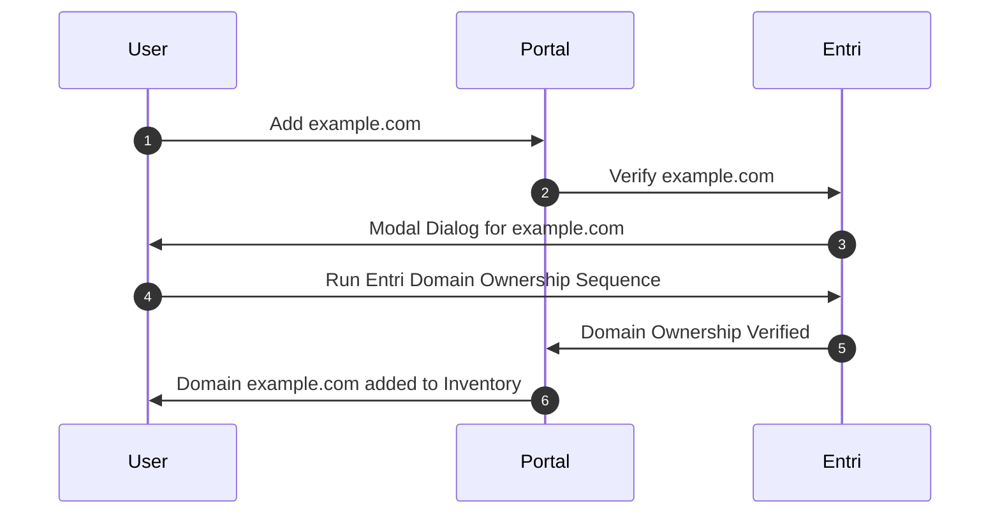
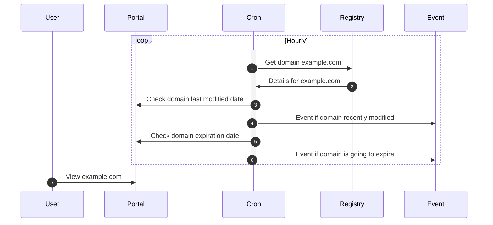

# Domain Name Ownership Verification

```mermaid
sequenceDiagram
  autonumber

  participant User
  participant Portal
  participant Entri
  
  User ->> Portal: Add example.com
  Portal ->> Entri: Verify example.com
  Entri ->> User: Modal Dialog for example.com
  User ->> Entri: Run Entri Domain Ownership Sequence
  Entri ->> Portal: Domain Ownership Verified
  Portal ->> User: Domain example.com added to Inventory

```

# Domain Name Health

```mermaid
sequenceDiagram
  autonumber

  participant User
  participant Portal
  participant Cron
  participant Registry
  participant Event

  loop Hourly
    activate Cron
    Cron ->> Registry: Get domain example.com
    Registry ->> Cron: Details for example.com
    Cron ->> Portal: Check domain last modified date
    Cron ->> Event: Event if domain recently modified
    Cron ->> Portal: Check domain expiration date
    Cron ->> Event: Event if domain is going to expire
    deactivate Cron
  end
  User ->> Portal: View example.com

```
