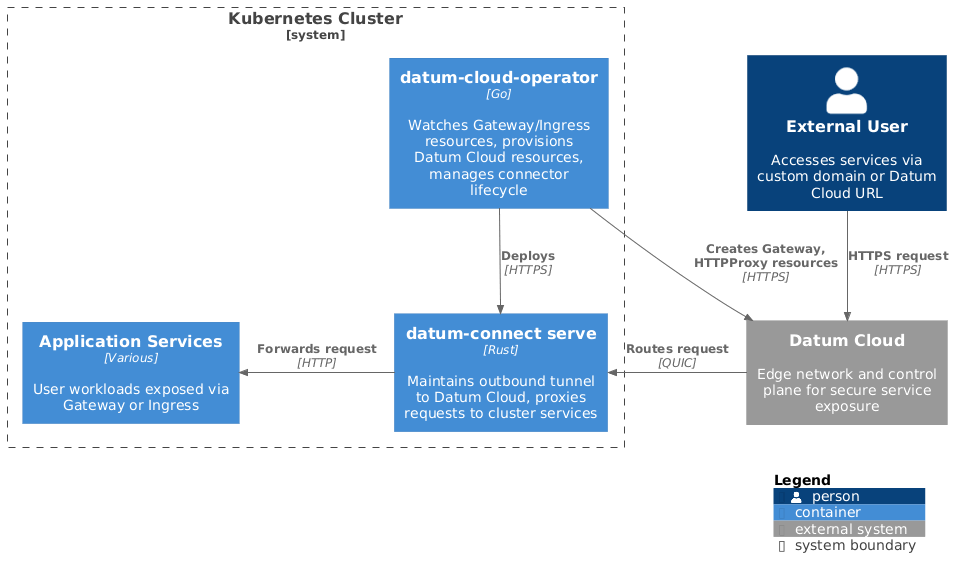
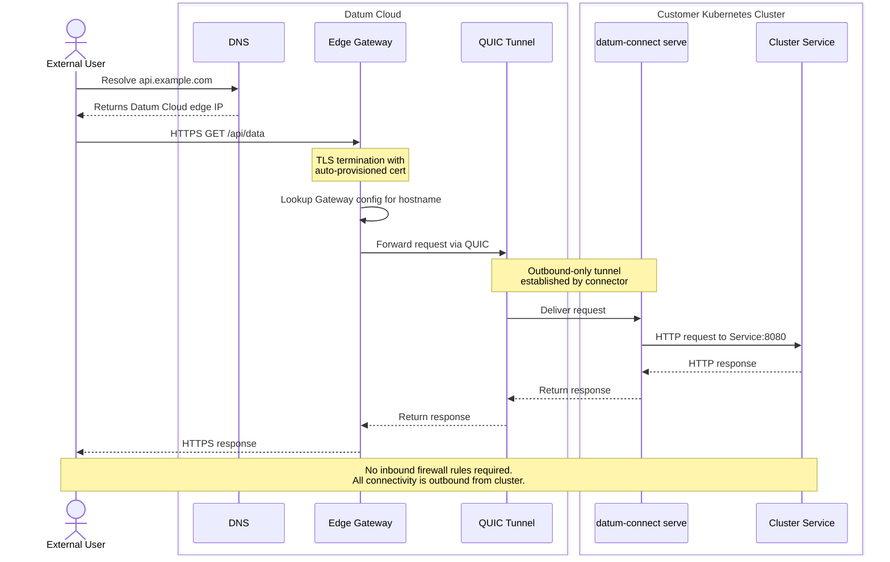

# Datum Cloud Kubernetes Operator

- [Summary](#summary)
- [Problem Statement](#problem-statement)
- [Proposal](#proposal)
- [User Experience](#user-experience)
- [Key Decisions](#key-decisions)
- [Success Criteria](#success-criteria)
- [Dependencies](#dependencies)
- [Open Questions](#open-questions)

## Summary

The Datum Cloud Kubernetes Operator enables organizations to expose services running in Kubernetes clusters through Datum Cloud's edge network without requiring inbound firewall rules, public IP addresses, or complex network configuration.

Users install a single operator that integrates with standard Kubernetes APIs (Gateway API and Ingress). The operator handles all connectivity to Datum Cloud automatically, allowing developers to use familiar tools while platform teams maintain security and control.

When DNS is hosted in Datum Cloud, services can be exposed on custom domains with automatic TLS certificate provisioning.

## Problem Statement

**Current state:** Organizations running Kubernetes workloads need to expose services to external users. Today, this requires:

- Opening inbound firewall rules and managing network security policies
- Provisioning cloud load balancers and public IP addresses
- Managing TLS certificates and ingress controllers
- Coordinating between networking, security, and platform teams

For private clusters, air-gapped environments, or edge deployments, these requirements create significant operational overhead and security exposure.

**Desired state:** Platform teams can enable external access to cluster services with a single operator installation. Developers use standard Kubernetes resources (Gateway, Ingress) without understanding the underlying connectivity. Traffic flows securely through Datum Cloud with no inbound cluster exposure.

## Proposal

### High-Level Architecture



### Components

| Component | Description |
|-----------|-------------|
| **datum-cloud-operator** | Kubernetes operator that watches Gateway/Ingress resources and provisions Datum Cloud resources |
| **datum-connect serve** | Daemonized connector that establishes outbound tunnels (extends existing Datum Connect application) |

### How It Works

1. **Install**: Platform team installs operator via Helm and configures credentials
2. **Configure**: Create a GatewayClass or IngressClass pointing to Datum Cloud project
3. **Use**: Developers create standard Gateway/Ingress resources to expose services
4. **Automatic**: Operator deploys connector, creates Datum Cloud resources, propagates status

#### Request Flow

The following sequence diagram shows the complete flow of an external request from user to cluster service and back.



## User Experience

### Platform Engineer

```bash
# One-time setup
helm install datum-cloud-operator datum/datum-cloud-operator

kubectl apply -f - <<EOF
apiVersion: v1
kind: Secret
metadata:
  name: datum-credentials
  namespace: datum-system
stringData:
  machine-account.json: |
    { "project_id": "proj-abc", "private_key": "..." }
---
apiVersion: operator.datum.net/v1alpha1
kind: DatumConnectorConfig
metadata:
  name: production
spec:
  projectID: proj-abc
  credentialsRef:
    name: datum-credentials
---
apiVersion: gateway.networking.k8s.io/v1
kind: GatewayClass
metadata:
  name: datum-cloud
spec:
  controllerName: operator.datum.net/gateway
  parametersRef:
    kind: DatumConnectorConfig
    name: production
EOF
```

### Developer

```yaml
# Standard Gateway API - no Datum-specific knowledge required
apiVersion: gateway.networking.k8s.io/v1
kind: Gateway
metadata:
  name: my-app-gateway
spec:
  gatewayClassName: datum-cloud  # Uses the platform-configured class
  listeners:
    - name: http
      port: 80
      protocol: HTTP
---
apiVersion: gateway.networking.k8s.io/v1
kind: HTTPRoute
metadata:
  name: my-app
spec:
  parentRefs:
    - name: my-app-gateway
  rules:
    - backendRefs:
        - name: my-app-service
          port: 8080
```

The service becomes accessible at a Datum Cloud URL with no additional configuration.

### Custom Domains with Datum Cloud DNS

When DNS is hosted in Datum Cloud, services can be exposed on custom domains with automatic certificate provisioning:

```yaml
apiVersion: gateway.networking.k8s.io/v1
kind: Gateway
metadata:
  name: my-app-gateway
spec:
  gatewayClassName: datum-cloud
  listeners:
    - name: https
      port: 443
      protocol: HTTPS
      hostname: "api.example.com"  # Custom domain hosted in Datum Cloud DNS
---
apiVersion: gateway.networking.k8s.io/v1
kind: HTTPRoute
metadata:
  name: my-app
spec:
  parentRefs:
    - name: my-app-gateway
  hostnames:
    - "api.example.com"
  rules:
    - backendRefs:
        - name: my-app-service
          port: 8080
```

**How it works:**

1. User specifies custom hostname in Gateway listener
2. Operator creates Gateway in Datum Cloud project with the hostname
3. Datum Cloud provisions TLS certificate automatically (when DNS is managed)
4. DNS records are configured to route traffic through Datum Cloud edge
5. Traffic flows: `api.example.com` → Datum Edge → Connector → Cluster Service (see [Request Flow](#request-flow) diagram above)

**Benefits:**

- No certificate management required
- DNS and routing configured in one place
- Works with any domain hosted in Datum Cloud DNS
- Automatic HTTPS with managed certificates

> [!NOTE]
> For domains not hosted in Datum Cloud, users can still expose services but must configure DNS records manually to point to the Datum Cloud edge.

## Key Decisions

### Decided

| Decision | Rationale |
|----------|-----------|
| **Use standard Gateway API and Ingress** | Familiar to Kubernetes users, ecosystem compatibility, no proprietary learning curve |
| **One connector per GatewayClass** | Follows Gateway API conventions, enables environment isolation (prod/staging) |
| **Operator deploys connector pods** | Single install experience, automatic lifecycle management |
| **Outbound-only connectivity** | Zero-trust security model, no inbound firewall rules |

### Needs Alignment

| Question | Options | Recommendation |
|----------|---------|----------------|
| **Initial scope** | Gateway API only vs. Gateway API + Ingress | Include both for broader adoption |
| **Authentication model** | Machine account keys vs. workload identity | Machine accounts for MVP, workload identity as fast-follow |

## Success Criteria

### MVP

- [ ] Single Helm install deploys operator
- [ ] GatewayClass creation deploys connector automatically
- [ ] Gateway + HTTPRoute exposes service through Datum Cloud
- [ ] Ingress resource exposes service through Datum Cloud
- [ ] Custom domains work when DNS is hosted in Datum Cloud
- [ ] TLS certificates provisioned automatically for custom domains
- [ ] Status propagates from Datum Cloud to Kubernetes resources
- [ ] Works with GKE private clusters (no public endpoint)

### Metrics

| Metric | Target |
|--------|--------|
| Time from install to first service exposed | < 10 minutes |
| Configuration required beyond Gateway/Ingress | Zero (for developers) |
| Inbound firewall rules required | Zero |

## Dependencies

### Requires

| Dependency | Description | Status |
|------------|-------------|--------|
| **datum-connect serve** | Headless/daemonized connector mode | Needs implementation |
| **Machine account authentication** | Non-interactive auth for connectors | Needs implementation |
| **Existing Connector APIs** | Connector, ConnectorAdvertisement, HTTPProxy | Available |

### Builds On

- [Datum Connectors Enhancement](../connectors/initial-proposal/README.md) - Core connector resource model
- [Datum Connect Application](https://github.com/datum-cloud/app) - Existing connector implementation

## Open Questions

1. **Multi-cluster**: How do we handle the same service exposed from multiple clusters?
2. **High availability**: Should connectors support active-active deployment for HA?
3. **Service mesh**: How does this interact with Istio/Linkerd if present?
4. **Rate limiting**: Where should rate limits be configured (Datum Cloud vs. cluster)?

## Implementation History

| Date | Milestone |
|------|-----------|
| 2026-02 | Initial proposal drafted |
