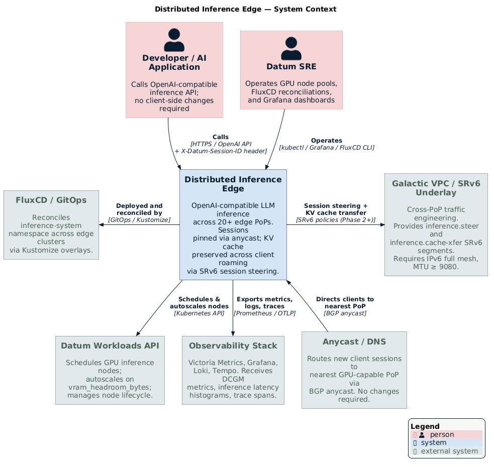
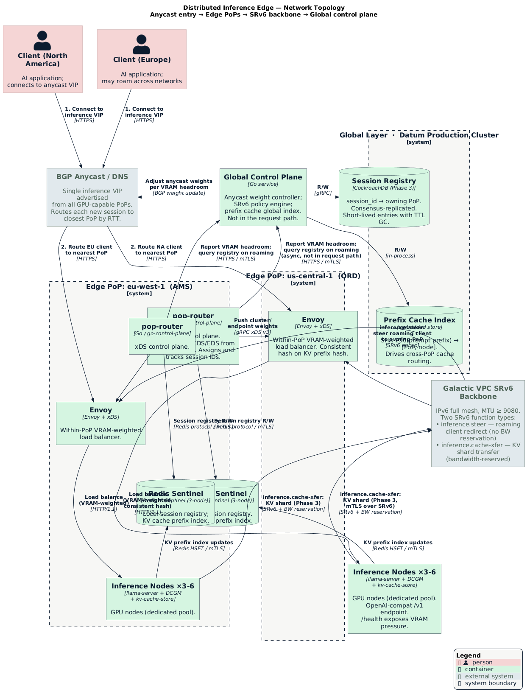
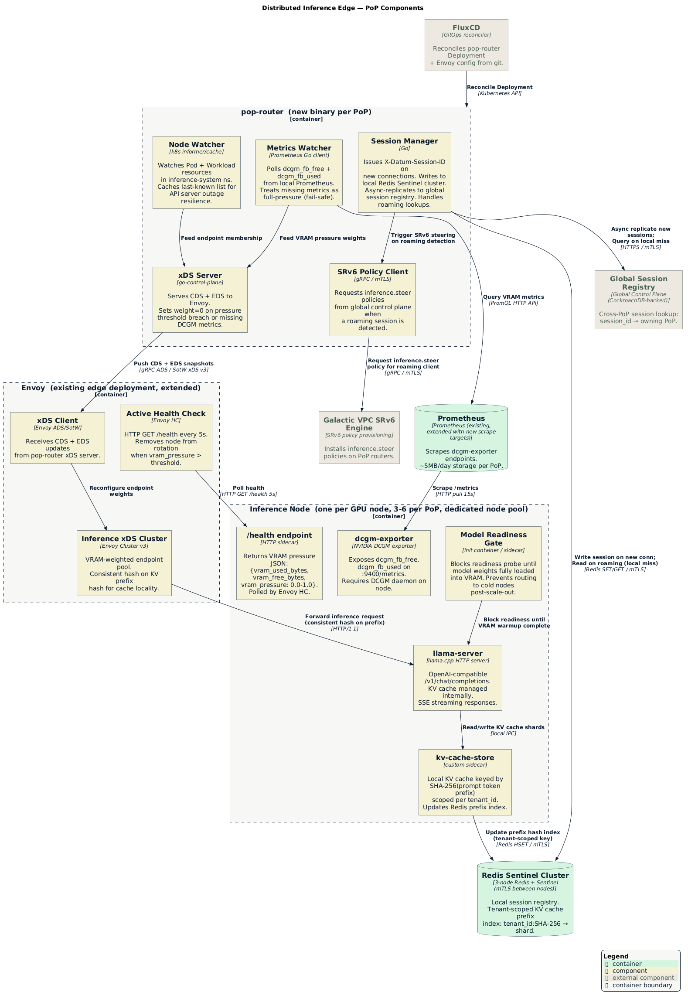
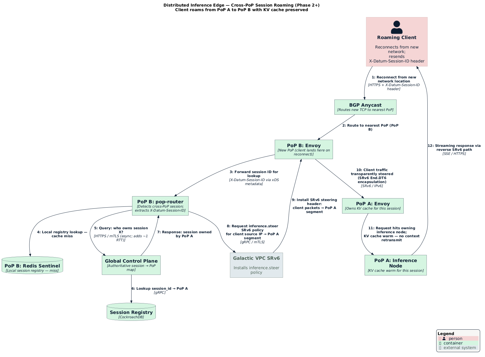

# Distributed Inference Edge

- [Summary](#summary)
- [Motivation](#motivation)
  - [Goals](#goals)
  - [Non-Goals](#non-goals)
- [Proposal](#proposal)
  - [User Stories](#user-stories)
  - [Notes/Constraints/Caveats](#notesconstraintscaveats)
  - [Risks and Mitigations](#risks-and-mitigations)
- [Design Details](#design-details)
  - [Architecture Diagrams](#architecture-diagrams)
  - [Architecture Overview](#architecture-overview)
  - [Per-Node Components](#per-node-components)
  - [Per-PoP Components](#per-pop-components)
  - [Global Control Plane](#global-control-plane)
  - [Session Routing](#session-routing)
  - [KV Cache Architecture](#kv-cache-architecture)
  - [Build Phases](#build-phases)
  - [Integration with Datum Workloads](#integration-with-datum-workloads)
  - [Integration with Galactic VPC and SRv6](#integration-with-galactic-vpc-and-srv6)
  - [Security](#security)
  - [Observability](#observability)
- [Production Readiness Review Questionnaire](#production-readiness-review-questionnaire)
  - [Feature Enablement and Rollback](#feature-enablement-and-rollback)
  - [Rollout, Upgrade and Rollback Planning](#rollout-upgrade-and-rollback-planning)
  - [Monitoring Requirements](#monitoring-requirements)
  - [Dependencies](#dependencies)
  - [Scalability](#scalability)
  - [Troubleshooting](#troubleshooting)
- [Implementation History](#implementation-history)
- [Drawbacks](#drawbacks)
- [Alternatives](#alternatives)
- [Infrastructure Needed](#infrastructure-needed)

## Summary

This enhancement proposes a distributed LLM inference network spanning Datum's
global edge PoP footprint. The system serves large language model inference
across Datum's points of presence using the existing SRv6 underlay, Envoy load
balancing already deployed at the edge, and the Datum Workloads API for
lifecycle management.

The core insight is that LLM inference is a **distributed systems problem with
an ML payload**, not an ML problem with networking bolted on. The architecture
leverages what Datum already has — SRv6 for traffic engineering, Envoy for
within-PoP routing, FluxCD for GitOps deployment, and Prometheus for
observability — rather than building bespoke infrastructure from scratch.

## Motivation

Datum operates a global edge network with 20+ PoPs across multiple continents,
an SRv6-capable underlay that supports transparent session steering, and a
Workloads API that can schedule GPU-class instances across locations. This
makes Datum a natural substrate for global LLM inference: sessions can be
pinned to the nearest PoP, KV cache can be preserved across connection roaming,
and cross-PoP coordination can happen asynchronously over the existing backbone
without application-layer round trips.

Commercial inference providers today force clients to choose a region and live
with the latency consequence of that choice. Datum's network-native approach
eliminates that constraint by encoding routing decisions at the forwarding
layer.

### Goals

- Serve OpenAI-compatible LLM inference from every Datum edge PoP where GPU
  accelerator hardware is available.
- Route new inference sessions to the nearest PoP via Datum's existing anycast
  and DNS infrastructure.
- Preserve KV cache state across TCP reconnects and client roaming without
  application-layer session management.
- Reuse Datum's existing SRv6 underlay, Envoy deployments, Prometheus/DCGM
  telemetry pipeline, and FluxCD GitOps workflow rather than introducing new
  infrastructure primitives.
- Deliver a working, observable system at each phase boundary; no phase should
  produce a system that is only useful in combination with the next phase.

### Non-Goals

- Training or fine-tuning workloads; this is inference-only.
- Sub-10ms interactive latency at global scale; within-PoP latency dominates
  and inter-PoP session steering adds at most one backbone hop.
- Heterogeneous GPU hardware support beyond the initially targeted accelerator
  class; the architecture assumes homogeneous inference nodes within a PoP.
- Fault-tolerant mid-inference recovery; a node failure terminates in-flight
  generation and the client must retry.
- Seamless mid-stream reconnect resume; if a client's TCP connection breaks
  during active generation (SSE stream), the stream is terminated. The client
  must issue a new request with the same `X-Datum-Session-ID` to continue; KV
  cache context is preserved, but already-generated tokens are not replayed.
- Rolling model weight updates without capacity impact; model version changes
  require node restarts and a capacity reduction during the rollout window.
- Defining the commercial packaging of inference capacity; that is a pricing
  and GTM concern.

## Proposal

Datum will deploy a GPU-aware inference service across edge PoPs using the
Datum Workloads API and the existing edge cluster infrastructure. Each PoP
capable of hosting GPU workloads runs `llama-server` instances behind an Envoy
load balancer configured via xDS. A PoP-local control plane component
(`pop-router`) drives xDS updates based on real-time VRAM pressure metrics
from DCGM. Cross-PoP session affinity is provided by SRv6 policy steering
over the Galactic VPC backbone. A global control plane manages anycast weight
adjustments and cross-PoP KV cache transfers.

The system exposes an OpenAI-compatible inference API. Clients must include a
`X-Datum-Session-ID` header to enable session affinity and roaming; new
sessions receive this header in the response and must echo it on reconnect.
Clients that do not send this header receive stateless inference with no KV
cache continuity across connections.

### User Stories

#### Story 1: Latency-sensitive AI application

A developer building a real-time AI assistant deploys against Datum's inference
endpoint. Their users are spread across North America and Europe. New sessions
are routed to the nearest PoP automatically via anycast. When a user's
connection drops and reconnects from a different network, SRv6 steering
transparently routes the resumed session to the PoP holding their KV cache
state, preserving context without the application needing to retransmit the
conversation history.

#### Story 2: Batch inference pipeline

A data engineering team runs nightly batch inference jobs. They submit requests
to the Datum inference endpoint without specifying a region. The global control
plane steers traffic to the PoP with the most available VRAM headroom, and
returns results over the same endpoint. The team does not manage regions,
session affinity, or GPU capacity directly.

#### Story 3: Datum operator deploying a new GPU PoP

A Datum SRE adds a new GPU-capable edge cluster. They apply a Kustomize overlay
for the new cluster following the existing pattern in `clusters/edge/`. FluxCD
reconciles the inference workload deployment. The global control plane
discovers the new PoP via its health endpoint and begins advertising anycast
weight for that location. No manual intervention is required to integrate the
new PoP into the inference network.

### Notes/Constraints/Caveats

**KV cache is local to a PoP.** Cross-PoP KV cache transfers are supported
only for prefix cache promotion in Phase 3. Active generation state cannot be
migrated; a mid-generation failure terminates the request.

**Session affinity is best-effort during network partitions.** SRv6 steering
depends on the Galactic VPC backbone. If inter-PoP connectivity is degraded,
the global control plane falls back to local-only routing. Clients may see
context loss in this case.

**The SRv6 underlay requirements from the Galactic VPC underlay enhancement
apply here.** Cross-PoP KV cache transfers use dedicated SRv6 segments with
bandwidth reservation. MTU requirements (minimum 9080 bytes on inter-PoP paths)
must be satisfied before Phase 2 deployment. See the
[Underlay Network Requirements](../../networking/underlay-network/README.md)
enhancement for the full specification.

**Inference nodes run as Datum Workloads.** GPU instance scheduling, placement,
and lifecycle follow the existing Workloads API. The inference service does not
bypass or duplicate Workloads API functionality.

### Risks and Mitigations

**Risk: GPU VRAM exhaustion causes cascade failure.** If one node's VRAM is
exhausted, Envoy must not route further requests to it. Mitigation: DCGM
exports a `vram_pressure` gauge. The `pop-router` xDS control plane removes
nodes from the Envoy cluster when pressure exceeds a configurable threshold.
This is the same mechanism used for ordinary health checking and requires no
new primitives.

**Risk: SRv6 policy misconfiguration creates routing loops.** Mitigation:
Inference-specific SRv6 segments are provisioned by the global control plane
using the same policy engine as Galactic VPC. No manual SRv6 policy
configuration is required at the PoP level. Policy changes are applied via
GitOps pull requests.

**Risk: llama-server instability affects the broader edge cluster.** Mitigation:
Inference workloads run in isolated Kubernetes namespaces with resource quotas.
Inference node pools are dedicated GPU hardware and do not share capacity with
general-purpose edge workloads. Note: GPU VRAM is not controlled by Linux
cgroups — `cudaMalloc` bypasses cgroup memory accounting. The primary VRAM
isolation mechanism is the dedicated node pool (no other workloads on the same
GPU nodes) combined with the DCGM-driven health check that removes a node from
Envoy rotation before it is fully exhausted. NVIDIA MIG partitioning may be
evaluated for Phase 2 if multi-tenant isolation on shared hardware is required.

**Risk: New PoP integration introduces control plane split-brain.** Mitigation:
Phase 3 global control plane uses a consensus-based session registry. New PoPs
register before accepting traffic. The global control plane validates registry
consistency before adjusting anycast weights for a new PoP.

## Design Details

### Architecture Diagrams

#### System Context



#### Network Topology

The topology mirrors a CDN architecture: BGP anycast is the entry point (CDN
edge address), edge PoPs are the serving layer (CDN edge nodes), the Galactic
VPC SRv6 backbone is the interconnect fabric, and the global control plane is
the origin/orchestration layer.



#### PoP Components



#### Cross-PoP Session Roaming Flow



### Architecture Overview

```
┌─────────────────────────────────────────────────────┐
│                   Global Layer                       │
│  Global Control Plane · Session Registry             │
│  Prefix Cache Index · Anycast/DNS · SRv6 Policy      │
└───────────────────┬─────────────────────────────────┘
                    │ async coordination
        ┌───────────┴───────────┐
        ▼                       ▼
┌───────────────┐       ┌───────────────┐
│   PoP (us-*) │       │   PoP (eu-*)  │  ...20+ PoPs
│               │       │               │
│  Envoy (xDS)  │       │  Envoy (xDS)  │
│  pop-router   │       │  pop-router   │
│  Prometheus   │       │  Prometheus   │
│  Redis        │       │  Redis        │
│               │       │               │
│ ┌─────────┐   │       │ ┌─────────┐   │
│ │ node-0  │   │       │ │ node-0  │   │
│ │llama-srv│   │       │ │llama-srv│   │
│ │dcgm-exp │   │       │ │dcgm-exp │   │
│ │kv-cache │   │       │ │kv-cache │   │
│ └─────────┘   │       │ └─────────┘   │
│ ┌─────────┐   │       │  ...          │
│ │ node-1  │   │       └───────────────┘
│ │  ...    │   │
│ └─────────┘   │
└───────────────┘
        │
        │  SRv6 / Galactic VPC backbone
        └───────────────────────────────► Cross-PoP session steering
                                          KV cache transfers
```

The design separates three concerns that must remain operationally independent:

1. **Within-PoP routing** — Envoy handles this. xDS updates from `pop-router`
   adjust endpoint weights based on VRAM pressure. This is entirely local and
   functions without any inter-PoP connectivity.

2. **Cross-PoP session steering** — SRv6 handles this. The Galactic VPC
   backbone encodes routing decisions at the forwarding layer. No HTTP
   redirects or application-layer round trips are required.

3. **Global capacity management** — The global control plane handles this
   asynchronously. Anycast weight adjustment and prefix cache promotion are
   eventually consistent operations that do not sit in the request path.

### Per-Node Components

Each inference node runs as a Datum Workload instance with GPU accelerator
resources requested. The following components run on each node:

| Component | Role |
|-----------|------|
| `llama-server` | OpenAI-compatible inference API (`/v1/chat/completions`, SSE streaming) |
| `dcgm-exporter` | GPU/VRAM metrics exposure for Prometheus (`:9400/metrics`) |
| `kv-cache-store` | Local KV cache keyed by `tenant_id:SHA-256(prompt prefix)` |
| `/health` endpoint | Returns structured VRAM pressure JSON for Envoy health checks |
| model readiness gate | Init container / sidecar that blocks the readiness probe until model weights are fully loaded into VRAM; prevents routing to cold nodes after scale-out |

The health endpoint returns a structured response including current VRAM
utilization. Envoy polls this endpoint and adjusts load balancing weight
accordingly, removing nodes from rotation when `vram_pressure` exceeds the
threshold configured in the `pop-router` xDS policy.

**Model cold-start:** Large model weights (e.g., 35GB for a 70B model at 4-bit
quantization) take 2–5 minutes to load into VRAM at startup. The model
readiness gate ensures `pop-router` does not add a node to the Envoy cluster
until model loading is complete. This also means scale-out events have a
2–5 minute ramp-up time; autoscaling thresholds should be tuned to trigger
scale-out before VRAM headroom is critically low, not in response to it.

### Per-PoP Components

Each inference-capable PoP extends the existing edge cluster with:

| Component | Role |
|-----------|------|
| `pop-router` | xDS control plane; drives Envoy configuration from DCGM metrics |
| Envoy (extended) | Within-PoP load balancing; already deployed at edge clusters |
| Prometheus (extended) | Scrapes `dcgm-exporter` endpoints; already deployed |
| Redis Sentinel (3-node) | Session registry and local KV cache index; Sentinel provides HA failover |

The `pop-router` is the only new control-plane component per PoP. It watches
Prometheus for `dcgm_fb_free` and `dcgm_fb_used` metrics and pushes xDS
Cluster/Endpoint updates to the local Envoy instance. This is the same xDS
integration pattern used by existing Datum edge services.

### Global Control Plane

The global control plane is a new service, deployed in the Datum production
cluster following the same GitOps pattern as other platform services. It
provides:

- **Session registry**: maps session IDs to owning PoP. Backed by CockroachDB
  (chosen over etcd because `InferenceSession` objects reach the millions;
  etcd degrades at high write rates and is not designed for application-level
  data at that scale).
- **Prefix cache index**: global index of prompt prefix hashes and their
  resident PoPs. Used to route requests for known prefixes to PoPs that have
  already computed them.
- **Anycast weight controller**: adjusts DNS/anycast weights for each PoP based
  on aggregate VRAM headroom reported by `pop-router` instances.
- **SRv6 policy engine**: provisions cross-PoP SRv6 segments for session
  steering and KV cache transfers. Integrates with the existing Galactic VPC
  SRv6 policy infrastructure.

The global control plane is not in the request path. Its failure degrades
cross-PoP session affinity and anycast weight optimization but does not prevent
within-PoP inference.

### Session Routing

**Session ID transport:**

Session identity is carried via the `X-Datum-Session-ID` HTTP request header.
On the first request of a new session (no header present), `pop-router`
generates a UUID, writes it to the local Redis Sentinel cluster, and returns it
to Envoy via xDS metadata so Envoy can inject it as a response header. The
client must echo this header on all subsequent requests in the session,
including reconnects from a different network. Clients that omit the header
receive stateless inference with no cross-request cache affinity.

**New session:**

1. Client connects to the inference anycast address without `X-Datum-Session-ID`.
2. DNS/anycast directs the connection to the nearest PoP (existing Datum anycast
   infrastructure; no changes required).
3. Envoy at the PoP selects the least-pressured inference node using VRAM-aware
   load balancing (consistent hash on KV prefix hash when available).
4. `pop-router` assigns a session ID (UUID), records it in the local Redis
   Sentinel cluster, and asynchronously replicates it to the global session
   registry. The session ID is returned to the client as `X-Datum-Session-ID`
   in the response.

**Roaming client (cross-PoP):**

1. Client reconnects from a different network location, presenting its
   `X-Datum-Session-ID` header. Anycast routes to the nearest PoP (now PoP B).
2. `pop-router` at PoP B extracts the session ID from xDS per-request metadata
   forwarded by Envoy. Local Redis lookup returns a miss.
3. `pop-router` queries the global session registry; the registry returns the
   owning PoP (PoP A). This lookup adds approximately one WAN RTT to the
   first request after a roaming event; subsequent requests from the same
   session skip the global lookup once SRv6 steering is installed.
4. SRv6 policy steering is applied: PoP B encapsulates the client's traffic in
   an SRv6 header with a segment pointing to PoP A.
5. The client's packets arrive at PoP A transparently; no HTTP redirect, no
   application-layer round trip.

This uses the same SRv6 End.DT4/DT6 forwarding already used by Galactic VPC
for tenant traffic steering.

### KV Cache Architecture

KV cache is keyed by `tenant_id:SHA-256(prompt token prefix)`. The tenant ID
scoping ensures that prefix hash collisions between tenants never result in
cross-tenant cache sharing. The local index maps prefix hashes to cache shard
locations on the local node. The global index (managed by the global control
plane) maps prefix hashes to PoPs.

**Within-PoP cache hit:** Envoy uses consistent hashing on the prefix hash to
route requests to the node most likely to have the relevant cache shard. Cache
misses result in local computation; the result is stored and the local index
updated.

**Cross-PoP cache hit (Phase 3):** The global control plane detects that a
prefix hash is resident at a remote PoP and either (a) routes the request to
that PoP via SRv6 or (b) initiates a cache transfer over a dedicated
bandwidth-reserved SRv6 segment. The threshold between transfer and redirect
is a function of cache size and available bandwidth, using `max_tokens` from
the request as a proxy for expected generation length (since actual generation
length is unknown at request time). The heuristic is: transfer if
`cache_size_bytes / available_bandwidth_bps < estimated_generation_ttft`.

### Build Phases

#### Phase 1: Single PoP, GPU-aware load balancing

Deploy the inference stack to one GPU-capable edge cluster. The `pop-router`
xDS control plane drives Envoy to load balance across a pool of inference
nodes using VRAM pressure as the primary weight signal.

Deliverables:
- `pop-router` service deployed via FluxCD alongside existing edge cluster apps
- Envoy extended with an inference-specific cluster configuration
- DCGM metrics flowing into the existing Prometheus instance
- OpenAI-compatible inference endpoint reachable via the PoP's public address
- Grafana dashboard showing VRAM utilization and request distribution

This phase produces a fully functional, observable inference service at a
single PoP. No global infrastructure is required.

#### Phase 2: Second PoP, transparent session affinity

Add a second GPU-capable PoP. Deploy the global session registry as a
single-region CockroachDB cluster (3 nodes for quorum; no anycast weight
control yet). Configure SRv6 session steering between the two PoPs using the
existing Galactic VPC SRv6 policy infrastructure. Phase 3 expands the
CockroachDB cluster to multi-region; no data migration is required.

Deliverables:
- Session registry with cross-PoP replication between the two PoPs
- SRv6 steering policy for inference traffic (new segment in existing policy
  engine)
- End-to-end test: client connects to PoP A, roams to PoP B, session continues
  without retransmitting context
- Runbook for adding a third PoP following the same pattern

#### Phase 3: Automated global control plane

Deploy the full global control plane. Enable anycast weight control and prefix
cache promotion. Instrument the global index and measure cache hit rates.

Deliverables:
- Global control plane deployed in the Datum production cluster
- Anycast weight adjustment driven by aggregate VRAM headroom per PoP
- Prefix cache global index with promotion heuristics
- SLO dashboards: p99 time-to-first-token, cache hit rate, cross-PoP steering
  latency

#### Phase 4 (optional): Pipeline parallelism

Distribute large models across multiple nodes within a PoP using tensor
parallelism. This requires coordinating model shards across nodes and is only
necessary for models that exceed single-node VRAM. Deferred until Phase 3
production experience informs whether this is needed.

### Integration with Datum Workloads

Inference nodes are defined as Datum Workloads requesting GPU accelerator
resources. An example Workload spec:

```yaml
apiVersion: compute.datumapis.com/v1alpha
kind: Workload
metadata:
  name: inference-node
  namespace: inference-system
spec:
  template:
    spec:
      runtimes:
        - name: llama-server
          containers:
            - name: llama-server
              image: ghcr.io/datum-cloud/llama-server:v0.1.0  # pin to semver; never use :latest
              resources:
                requests:
                  memory: "64Gi"
                limits:
                  memory: "64Gi"
            - name: dcgm-exporter
              image: nvcr.io/nvidia/k8s/dcgm-exporter:3.3.9-3.6.1-ubuntu22.04
            - name: kv-cache-store
              image: ghcr.io/datum-cloud/kv-cache-store:v0.1.0
  placements:
    - name: us-central-1
      cityCode: ORD
      minReplicas: 3
      maxReplicas: 6
      scaler:
        metric: vram_headroom_bytes
        target: 20Gi
```

Autoscaling is driven by VRAM headroom rather than CPU or request rate. The
Workloads API's existing autoscaler integration is used; no custom scaler is
required.

The `pop-router` discovers inference nodes via the Kubernetes API within the
PoP cluster. Node readiness is determined by the VRAM pressure health check
before `pop-router` adds a node to the Envoy cluster.

### Integration with Galactic VPC and SRv6

Session steering and KV cache transfer use two dedicated SRv6 function types:

| SRv6 Function | Use Case | Bandwidth Reservation |
|---------------|----------|-----------------------|
| `inference.steer` | Route roaming client to owning PoP | None (control overhead only) |
| `inference.cache-xfer` | Transfer KV cache shard between PoPs | Yes; sized per model layer |

Both are provisioned as SRv6 policies by the global control plane via the
existing Galactic VPC SRv6 policy engine. No manual `ip sr policy` commands or
out-of-band configuration is required.

The underlay requirements from the [Underlay Network Requirements](../../networking/underlay-network/README.md)
enhancement must be satisfied before Phase 2 deployment:

- IPv6 reachability between all inference PoPs
- Minimum 9080-byte MTU on inter-PoP paths (SRv6 overhead budget: 80 bytes)
- TCP port 179 open between PoPs (BGP for Galactic VPC route distribution)
- ICMPv6 PTB forwarding enabled on all inter-PoP paths

### Security

#### Authentication and authorization

The inference API is exposed behind Datum's existing API gateway, which
validates API keys and JWT tokens before requests reach Envoy. Rate limiting is
enforced at the gateway tier. The `pop-router` and inference nodes are not
directly reachable from the public internet.

#### Transport security for cross-PoP traffic

KV cache shards transferred via `inference.cache-xfer` SRv6 segments contain
embeddings computed from user prompt tokens and must be treated as sensitive
data. All inter-PoP KV cache transfers use mTLS at the application layer
(established between `kv-cache-store` sidecars); the Galactic VPC fabric
encryption provides a second layer but is not relied upon exclusively.

All communication between `pop-router` instances and the global control plane
uses mTLS. Redis Sentinel cluster traffic uses TLS with certificate rotation
managed by cert-manager.

#### Tenant isolation in KV cache

KV cache keys are namespaced by `tenant_id` (derived from the authenticated
API key). Prefix hash lookups are never served across tenant boundaries. A
global prefix index entry for a given hash is only visible to the tenant that
created it. Cache hit timing does not expose cross-tenant data because the
consistent hash routing decision is made per-tenant before consulting the
prefix index.

### Observability

The inference stack integrates with the existing Datum telemetry pipeline
(Victoria Metrics, Grafana, Loki, Tempo) without requiring new telemetry
infrastructure.

**Metrics (via Prometheus → Victoria Metrics):**
- `dcgm_fb_free`, `dcgm_fb_used`: per-node VRAM utilization
- `inference_request_duration_seconds`: latency histogram (p50, p95, p99)
- `inference_tokens_per_second`: throughput per node
- `inference_ttft_seconds`: time-to-first-token (primary latency SLI)
- `kv_cache_hit_ratio`: local and global cache hit rates
- `inference_active_sessions`: per-PoP active session count

**Logs (via Loki):**
- Request logs with session ID, PoP, node, model, token count
- SRv6 steering decisions (cross-PoP events only; not per-token)
- KV cache transfer events

**Traces (via Tempo):**
- End-to-end traces for inference requests including cross-PoP steering hops

**Dashboards:**
- Per-PoP: VRAM pressure heatmap, request rate, node health
- Global: anycast weight distribution, cross-PoP session steering volume, cache
  hit rates

## Production Readiness Review Questionnaire

### Feature Enablement and Rollback

#### How can this feature be enabled / disabled in a live cluster?

- [ ] Feature gate
  - Feature gate name: `InferenceEdge`
  - Components depending on the feature gate: `pop-router`, Envoy inference
    cluster configuration, global control plane PoP registration
- [ ] Other
  - Describe the mechanism: FluxCD Kustomization for the inference-system
    namespace can be suspended via `flux suspend kustomization inference-system`.
    This stops reconciliation and allows manual teardown without affecting other
    edge workloads.
  - Will enabling / disabling the feature require downtime of the control plane?
    No. Inference components are isolated in the `inference-system` namespace.
  - Will enabling / disabling the feature require downtime or reprovisioning
    of a node? No for control plane; yes for inference nodes if they share GPU
    hardware with other workloads (not expected in Phase 1).

#### Does enabling the feature change any default behavior?

Enabling the inference stack at a PoP adds a new Envoy cluster configuration
and new Prometheus scrape targets. It does not modify existing Envoy clusters
or existing scrape configurations.

#### Can the feature be disabled once it has been enabled?

Yes. Suspending the FluxCD Kustomization stops new inference traffic. In-flight
requests complete on existing nodes; new connections are not accepted after
Envoy removes the inference cluster from its configuration.

#### What happens if we reenable the feature if it was previously rolled back?

`pop-router` re-registers inference nodes with Envoy. The session registry is
re-populated as clients reconnect. KV cache state is preserved in the local
store if the underlying pods were not restarted; otherwise cache is cold on
restart.

#### Are there any tests for feature enablement/disablement?

Phase 1 deliverables include Chainsaw integration tests for the per-PoP stack.
Enablement/disablement tests will be added to `tests/compute/inference/` in
the infra repository.

### Rollout, Upgrade and Rollback Planning

#### How can a rollout or rollback fail? Can it impact already running workloads?

The `pop-router` is the highest-risk component during rollout. If it fails to
start, Envoy retains its last-known cluster configuration; inference traffic
continues to be served by whichever nodes were healthy at the time of the last
successful xDS push. No other edge workloads are affected.

A failed rollout of `llama-server` (e.g., OOM on startup) causes the affected
pod to restart. Envoy's health check removes it from rotation before it accepts
traffic, so no failed requests result.

#### What specific metrics should inform a rollback?

- `inference_request_duration_seconds{quantile="0.99"}` > 30s sustained for 5m
- `dcgm_fb_free` across all nodes at a PoP < 10% for 10m (VRAM exhaustion)
- `inference_ttft_seconds{quantile="0.95"}` > 5x baseline for 5m
- `pop_router_xds_push_errors_total` increasing monotonically

#### Were upgrade and rollback tested?

Phase 1 will establish a baseline via the local Kind environment
(`task create-local-env`). Upgrade and rollback procedures will be documented
in a runbook before Phase 2 production deployment.

#### Is the rollout accompanied by any deprecations and/or removals?

No existing APIs or features are deprecated by this enhancement.

### Monitoring Requirements

#### How can an operator determine if the feature is in use by workloads?

The `inference_active_sessions` metric is non-zero when inference traffic is
active. The Grafana dashboard for the inference stack shows per-PoP session
count in real time.

#### How can someone using this feature know that it is working for their instance?

- [ ] API .status
  - Condition name: `InferenceReady` on the `pop-router` Deployment
  - Other field: `spec.replicas` vs `status.readyReplicas` on inference node
    Workload

#### What are the reasonable SLOs for the enhancement?

- Time-to-first-token p99 < 2s for prompts under 4096 tokens (within-PoP)
- Request error rate < 0.1% over any 1-hour window
- Cross-PoP session steering adds < 50ms to p99 TTFT

#### What are the SLIs an operator can use to determine the health of the service?

- [ ] Metrics
  - Metric name: `inference_ttft_seconds` (histogram)
  - Aggregation method: p99 over 5-minute windows
  - Components exposing the metric: `llama-server` via Prometheus scrape

- [ ] Metrics
  - Metric name: `inference_request_errors_total` / `inference_requests_total`
  - Aggregation method: rate over 1h
  - Components exposing the metric: Envoy access log metrics

#### Are there any missing metrics that would be useful?

KV cache eviction rate per node (`kv_cache_eviction_rate`) is not included in
Phase 1 but should be added in Phase 2. Redis exposes eviction counters via
`redis_evicted_keys_total`; adding this to the scrape config requires no code
changes. This metric is critical for tuning cache sizing before Phase 3
cross-PoP promotion heuristics are enabled.

### Dependencies

#### Does this feature depend on any specific services running in the cluster?

- **Galactic VPC / SRv6 underlay** (Phase 2+): Required for cross-PoP session
  steering. Phase 1 does not depend on inter-PoP connectivity.
  - Impact of outage: Cross-PoP steering falls back to cold-start at the new
    PoP. KV cache state is lost for roaming clients. Within-PoP inference
    continues unaffected.
  - Impact of degraded performance: Increased TTFT for roaming clients; no
    impact on non-roaming sessions.

- **Datum Workloads API** (all phases): Required for inference node scheduling
  and lifecycle management.
  - Impact of outage: No new inference nodes can be provisioned. Existing nodes
    continue serving traffic.
  - Impact of degraded performance: Autoscaling response is delayed; VRAM
    exhaustion risk increases under sustained load.

- **Prometheus / DCGM** (all phases): Required for VRAM-aware load balancing.
  - Impact of outage: `pop-router` falls back to round-robin; VRAM-aware
    routing is disabled until metrics resume.
  - Impact of degraded performance: Stale VRAM metrics may cause suboptimal
    routing; nodes will not be incorrectly removed from rotation based on
    stale-healthy data (conservative threshold).

- **FluxCD** (all phases): Required for GitOps deployment of inference
  components.
  - Impact of outage: No new deployments or configuration changes can be
    reconciled. Running inference service is unaffected.

### Scalability

#### Will enabling / using this feature result in any new API calls?

- `pop-router` watches `Pod` and `Workload` resources in the
  `inference-system` namespace to discover node membership.
- Estimated throughput: one list+watch per `pop-router` instance at startup,
  then event-driven updates.
- The global control plane issues periodic health checks to each registered
  PoP's `pop-router` endpoint (one HTTP call per PoP per 30s).

#### Will enabling / using this feature result in introducing new API types?

Phase 3 will introduce:
- `InferencePoP` — cluster-scoped resource registering a PoP with the global
  control plane (name, endpoint, GPU capacity, current VRAM headroom).
- `InferenceSession` — namespace-scoped resource tracking active sessions for
  audit and debugging. Short-lived; TTL-based garbage collection.

Supported object counts: hundreds of `InferencePoP` resources (one per PoP),
millions of `InferenceSession` resources (capped by TTL GC). `InferenceSession`
objects are stored in CockroachDB, not in Kubernetes etcd — etcd is not
designed for millions of short-lived application-layer records at high write
rates. The Kubernetes API surface for `InferenceSession` is backed by a
CockroachDB aggregated API server following the existing Datum API server
pattern.

#### Will enabling / using this feature result in any new calls to the cloud provider?

No. GPU hardware is managed by Datum's infra provider; the inference stack
operates entirely within the Kubernetes layer.

#### Will enabling / using this feature result in increasing size or count of the existing API objects?

The Workload object for inference nodes adds GPU resource requests and a new
autoscaler metric reference. Estimated size increase: ~200 bytes per Workload
spec.

#### Will enabling / using this feature result in increasing time taken by any operations covered by existing SLIs/SLOs?

The `pop-router` adds a new xDS client to the existing Envoy instance at each
PoP. Envoy xDS processing is async and non-blocking; no existing SLOs are
expected to be affected.

#### Will enabling / using this feature result in non-negligible increase of resource usage in any components?

- `pop-router`: 256Mi memory, 0.5 CPU per PoP (new component)
- Redis Sentinel cluster: 3 × 2Gi memory per PoP = 6Gi total (new component;
  3-node Sentinel for HA failover)
- Prometheus: additional scrape targets add ~5MB/day storage per PoP at
  15s scrape interval for ~20 DCGM metric series per node

#### Can enabling / using this feature result in resource exhaustion of some node resources?

GPU VRAM exhaustion is the primary risk. Mitigated by the VRAM pressure health
check and xDS weight adjustment (see Risks and Mitigations). Inference node
pools are dedicated and do not share GPU capacity with general-purpose
workloads.

### Troubleshooting

#### How does this feature react if the API server is unavailable?

`pop-router` caches the last-known node list in memory. Envoy continues to
route to the last-configured cluster membership. Inference traffic is unaffected
for the duration of the API server outage. On reconnect, `pop-router` re-lists
and re-watches; any node additions or removals during the outage are applied.

#### What are other known failure modes?

- **DCGM exporter crash on inference node**
  - Detection: `up{job="dcgm-exporter"}` drops to 0 for the affected node.
  - Mitigations: `pop-router` treats missing VRAM metrics as full-pressure and
    removes the node from Envoy rotation until metrics resume.
  - Diagnostics: `kubectl logs -n inference-system <node-pod> -c dcgm-exporter`
  - Testing: Phase 1 Chainsaw test kills dcgm-exporter and verifies Envoy
    weight drops to 0 for that endpoint.

- **Redis session registry unavailable**
  - Detection: `redis_up` metric drops to 0; `pop-router` logs `session registry
    unavailable`.
  - Mitigations: New sessions are served from the local PoP without cross-PoP
    awareness. Roaming clients lose session affinity but receive service.
  - Diagnostics: Loki query on `inference-system` for `registry` log lines.

- **SRv6 steering policy not installed (Phase 2+)**
  - Detection: `inference_cross_pop_steering_failures_total` increases while
    `inference_cross_pop_sessions_total` is non-zero.
  - Mitigations: `pop-router` falls back to advertising the session to the new
    PoP as a cold-start (no cache state transferred).
  - Diagnostics: Check SRv6 policy state via `ip -6 route show` on the
    affected PoP's router node; verify global control plane SRv6 policy sync
    status.

#### What steps should be taken if SLOs are not being met to determine the problem?

1. Check `inference_ttft_seconds` by PoP — localize to one or multiple PoPs.
2. If one PoP: check `dcgm_fb_free` — VRAM exhaustion is the most likely
   cause. Check autoscaler event log for scale-out activity.
3. If multiple PoPs: check `inference_cross_pop_steering_failures_total` — if
   elevated, investigate SRv6 policy state and global control plane health.
4. If TTFT is high but VRAM is healthy: check `kv_cache_hit_ratio` — a cold
   cache (e.g., after a deployment restart) causes elevated TTFT until the
   working set is re-warmed.
5. Escalate to SRE on-call with the PoP name, affected metric, and Grafana
   dashboard link.

## Implementation History

- 2026-05-25: Initial provisional enhancement created
- 2026-05-27: Addressed review feedback: specified `X-Datum-Session-ID` session
  transport protocol; corrected VRAM/cgroup isolation claim; added Redis
  Sentinel HA; specified CockroachDB for session registry (replacing etcd/TBD);
  added tenant-scoped KV cache keys; added Security section (mTLS, tenant
  isolation, auth delegation); clarified streaming reconnect non-goal; added
  model readiness gate for cold-start; pinned container image tags; added C4
  architecture diagrams.

## Drawbacks

This enhancement introduces GPU-class workloads into the edge cluster lifecycle.
GPU hardware procurement, driver management, and VRAM debugging are operational
concerns that Datum's SRE team must absorb. The existing compute workload
infrastructure handles the Kubernetes scheduling layer, but DCGM integration
and driver lifecycle are new operational domains.

The `pop-router` xDS control plane is a new binary that must be maintained,
versioned, and upgraded alongside Envoy. If the xDS API version used by
`pop-router` diverges from the Envoy version deployed at edge clusters, routing
configuration will fail silently or loudly depending on Envoy's xDS
compatibility policy.

## Alternatives

**Application-layer session affinity (sticky sessions via HTTP header).** This
is the conventional approach: embed the target PoP in a header or token and
have the client retransmit context on reconnect. Rejected because it requires
application-level changes for every client and does not preserve KV cache state
across connection failures.

**Single-region inference with global CDN.** Route all inference traffic to a
single region and serve cached completions via CDN. Rejected because LLM
inference is stateful and not cacheable in the way HTTP responses are; each
session generates unique outputs.

**Managed inference from a hyperscaler (AWS Bedrock, Azure AI, GCP Vertex).**
This eliminates the operational burden but abandons the network-native
advantage that makes Datum's architecture differentiated. Datum's SRv6
underlay and anycast footprint provide a latency and session continuity
advantage that hyperscaler endpoints cannot replicate.

**llama.cpp alternatives (vLLM, TensorRT-LLM).** `llama-server` is chosen for
Phase 1 because it is operationally simple and exposes the required health and
metrics endpoints. vLLM may be evaluated in later phases for higher-throughput
scenarios; the architecture is inference-runtime-agnostic at the Envoy layer.

## Infrastructure Needed

- **GPU-capable edge cluster(s)**: At least one edge PoP with dedicated GPU
  accelerator node pools provisioned via the Datum infra-provider-gcp. A
  minimum of 3 nodes per PoP is required for Phase 1 load distribution testing.
- **New GitHub repository or sub-path**: `pop-router` source code (new binary).
  Suggested location: `datum-cloud/pop-router` or as a sub-package of an
  existing edge services repository.
- **OCI artifact registry path**: `ghcr.io/datum-cloud/pop-router` for the
  `pop-router` container image, following the existing OCI artifact pattern
  used by other Datum services.
- **Grafana dashboard provisioning**: Two new dashboards (per-PoP and global)
  in the existing `grafana/` directory of the infra repository.
