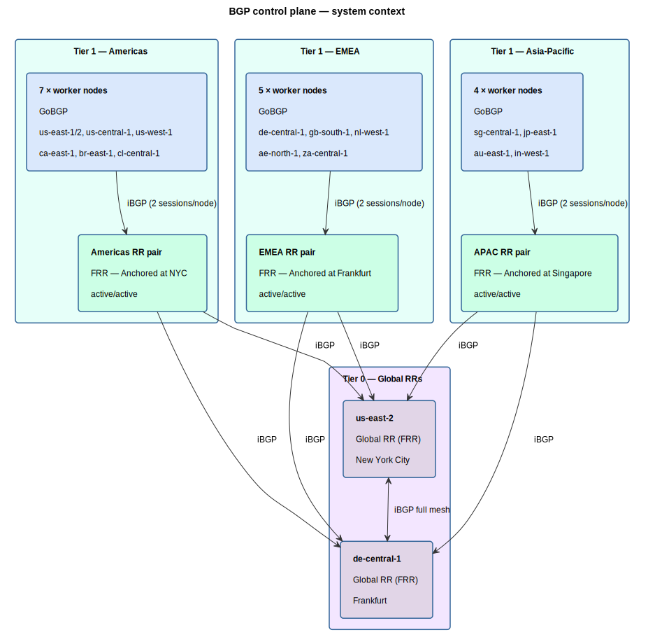
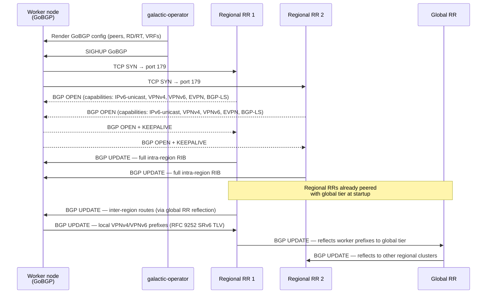
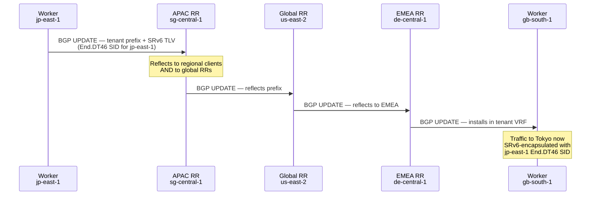
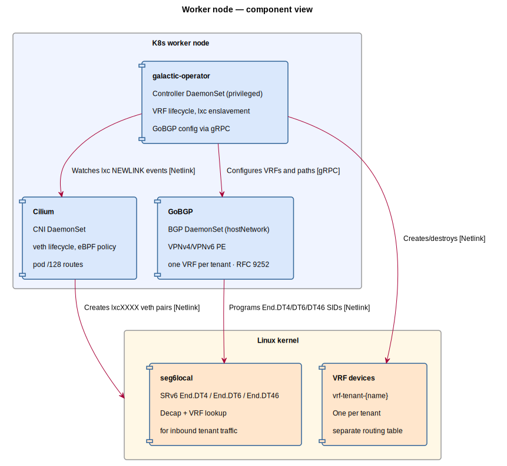
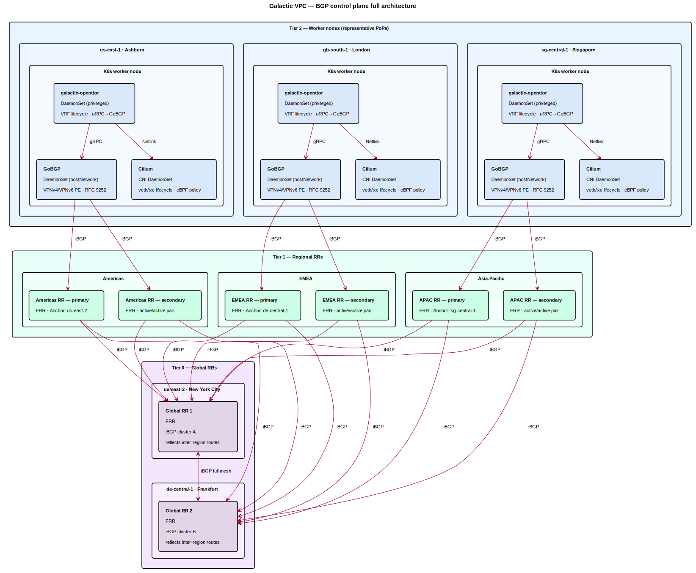

# BGP control plane design — Galactic VPC

## Overview

This document describes the BGP control plane architecture for Datum's Galactic VPC
fabric. The fabric spans 16 points of presence (PoPs) across three geographic regions
and uses a two-tier hierarchical route reflector (RR) model to distribute routing
information at scale.

BGP is the single control plane protocol — no IGP runs in the underlay. SRv6
(RFC 8986) is the committed data plane. Every design decision in this document is
made with that constraint as a hard given.

---

## Design goals

- Full control plane reachability across all 16 PoPs via a single protocol (BGP)
- Regional forwarding survives total loss of the global RR tier
- No PoP carries more than 2 RR client sessions
- No single point of failure at any tier
- Clean separation of intra-region and inter-region route reflection
- galactic-operator owns GoBGP lifecycle end-to-end; no out-of-band config

**Non-goals:**

- IGP in the underlay — BGP handles locator advertisement and underlay reachability
- MPLS fallback — SRv6 is the commitment, not a preference
- Stretched L2 between PoPs

---

## PoP inventory

| Region       | POP ID       | City          | Notes                    |
|--------------|--------------|---------------|--------------------------|
| Americas     | us-east-1    | Ashburn       | Migrating to servers.com |
| Americas     | us-east-2    | New York City | Global RR site           |
| Americas     | us-central-1 | Dallas        | Migrating to servers.com |
| Americas     | us-west-1    | San Jose      | Migrating to servers.com |
| Americas     | ca-east-1    | Toronto       |                          |
| Americas     | br-east-1    | São Paulo     |                          |
| Americas     | cl-central-1 | Santiago      |                          |
| EMEA         | de-central-1 | Frankfurt     | Global RR site           |
| EMEA         | gb-south-1   | London        |                          |
| EMEA         | nl-west-1    | Amsterdam     |                          |
| EMEA         | ae-north-1   | Dubai         |                          |
| EMEA         | za-central-1 | Johannesburg  |                          |
| Asia-Pacific | sg-central-1 | Singapore     | Regional RR site         |
| Asia-Pacific | jp-east-1    | Tokyo         |                          |
| Asia-Pacific | au-east-1    | Sydney        |                          |
| Asia-Pacific | in-west-1    | Mumbai        |                          |

---

## Architecture

### Two-tier route reflector hierarchy

The control plane uses a two-tier hierarchy. This eliminates the O(n²) iBGP full-mesh
problem while ensuring regional forwarding is fully independent of the global tier.

```
┌─────────────────────────────────────────────────────────────────────┐
│  Tier 0 — Global RRs                                                │
│                                                                     │
│   us-east-2 (NYC) ◄────── iBGP full mesh ──────► de-central-1 (FRA) │
└─────────────────────────────────────────────────────────────────────┘
          ▲  ▲                    ▲  ▲                   ▲  ▲
          │  │                    │  │                   │  │
┌─────────┴──┴──┐        ┌────────┴──┴──┐        ┌───────┴──┴───┐
│ Regional RR   │        │ Regional RR  │        │ Regional RR  │
│ Americas      │        │ EMEA         │        │ APAC         │
│ (NYC anchor)  │        │ (FRA anchor) │        │ (SIN anchor) │
└───────┬───────┘        └──────┬───────┘        └──────┬───────┘
        │ iBGP                  │ iBGP                  │ iBGP
   ┌────┴────┐             ┌────┴────┐             ┌────┴────┐
   │ Workers │             │ Workers │             │ Workers │
   │ GoBGP   │             │ GoBGP   │             │ GoBGP   │
   └─────────┘             └─────────┘             └─────────┘
```

**Tier 0 — Global RRs (2 nodes)**

Two global RRs deployed as an iBGP full-mesh pair:

| Node         | Location      | Rationale                                          |
|--------------|---------------|----------------------------------------------------|
| us-east-2    | New York City | Existing PoP; best latency to Americas and EMEA    |
| de-central-1 | Frankfurt     | Existing PoP; best latency spread to EMEA and APAC |

The global RRs reflect inter-regional reachability between the three regional
clusters. They do not carry intra-region routes; those are handled entirely within
each regional cluster. No new sites are required — both are existing deployed PoPs.

**Tier 1 — Regional RR clusters (3 pairs)**

| Cluster      | RR anchor                | PoPs served                                                                       |
|--------------|--------------------------|-----------------------------------------------------------------------------------|
| Americas     | us-east-2 (NYC)          | us-east-1, us-east-2, us-central-1, us-west-1, ca-east-1, br-east-1, cl-central-1 |
| EMEA         | de-central-1 (Frankfurt) | de-central-1, gb-south-1, nl-west-1, ae-north-1, za-central-1                     |
| Asia-Pacific | sg-central-1 (Singapore) | sg-central-1, jp-east-1, au-east-1, in-west-1                                     |

Each regional cluster is a **pair** of RRs operating active/active. Each worker node
peers with both RRs in its regional cluster — two sessions per node, no more.
Redundancy is built in: loss of one RR in a pair causes no service impact.

Singapore was chosen as the APAC anchor over Tokyo or Sydney because it minimises
the average RTT across the four APAC PoPs (Singapore, Tokyo, Sydney, Mumbai). Tokyo
would penalise Mumbai and Sydney; Sydney would penalise Tokyo and Mumbai.

Dallas was explicitly rejected as an Americas anchor despite proximity to LATAM:
the RR is a control plane function and RTT has no material operational impact on
BGP session management. Dallas is also mid-migration to servers.com, making it
unsuitable for load-bearing infrastructure.

---

## BGP Control Plane System Context



> Source: [`diagrams/bgp-context.puml`](bgp-context.puml)

---

## Session topology

### Session counts

| Node type           | Sessions        | Peers                                                              |
|---------------------|-----------------|--------------------------------------------------------------------|
| Worker node (GoBGP) | 2               | Both RRs in regional pair                                          |
| Regional RR node    | 2 + (N clients) | Both global RRs + all regional clients                             |
| Global RR node      | 2 + 6           | Other global RR + both nodes of each regional pair (3 regions × 2) |

At 16 PoPs today, with an average of 3 workers per PoP, this is approximately
96 worker-to-RR sessions globally — entirely manageable. The design scales linearly:
adding a PoP adds exactly 2 RR sessions.

### BGP session establishment sequence

The following shows how a worker node establishes its control plane sessions on boot:



### Route propagation — inter-region example

This shows how a prefix originating on a worker in Tokyo reaches a worker in London:



---

## SAFIs

All RR sessions negotiate the following address families:

| Address family                                  | Purpose                                           |
|-------------------------------------------------|---------------------------------------------------|
| IPv6 Unicast                                    | Underlay reachability, SRv6 locator advertisement |
| VPNv4 (RFC 4364) + SRv6 Services TLV (RFC 9252) | Tenant L3VPN overlay — IPv4 prefixes              |
| VPNv6 (RFC 4659) + SRv6 Services TLV (RFC 9252) | Tenant L3VPN overlay — IPv6 prefixes              |
| EVPN + SRv6 Services TLV (RFC 9252)             | Tenant L2/L3 overlay                              |
| BGP-LS                                          | Topology export to controller / PCE               |

RFC 9252 SRv6 Services TLV carries the `End.DT4` (IPv4) or `End.DT6` (IPv6) SID for
each tenant VRF alongside the VPN prefix. This is the glue between BGP VPN signalling
and SRv6 forwarding — a remote PE receiving a VPN prefix uses the TLV to determine
which SRv6 SID to use for encapsulation. VPNv4 and VPNv6 use the same SID structure;
the difference is the BGP NLRI encoding and the SRv6 endpoint behavior (`End.DT4` vs
`End.DT46` vs `End.DT6` depending on whether the VRF is IPv4-only, dual-stack, or
IPv6-only).

> **Note on GoBGP RFC 9252 support:** GoBGP's SRv6 Services TLV implementation has
> known gaps in the `SRv6 SID Structure` sub-TLV (specifically the
> `TranspositionLength`/`TranspositionOffset` fields used for uSID compression). This
> must be validated against the regional RR implementation before production rollout.
> See the RFC 9252 validation spike in the backlog.

---

## Node-level architecture

Each Kubernetes worker node runs three daemonset processes that together form the
per-node control and data plane:



> Source: [`bgp-worker-component.puml`](bgp-worker-component.puml)

**galactic-operator reconciliation loop (per tenant pod):**

```
1. Watch:   pod CREATE with datum.net/tenant=<name> on this node
2. Ensure:  vrf-tenant-<name> exists (Netlink) — idempotent
3. Ensure:  GoBGP VRF <name> configured with RD/RT (gRPC AddVrf)
4. Wait:    Cilium creates lxcXXXX (watch netlink NEWLINK)
5. Act:     ip link set lxcXXXX master vrf-tenant-<name> (Netlink)
6. Act:     move endpoint route from table 0 → tenant table (Netlink)
7. Act:     AddPath to GoBGP VRF for pod /128 (gRPC)

On pod DELETE:
1. Watch:   pod DELETE
2. Act:     DeletePath from GoBGP for pod /128 (gRPC)
3. Act:     release lxc from VRF (Netlink)
4. Cleanup: remove VRF if no remaining pods in tenant on this node
```

galactic-operator is the single source of truth. GoBGP holds no persistent state —
on restart, the operator re-drives all VRF and path state from Kubernetes CRDs.

---

## Failure modes

### Global RR loss

Loss of one global RR degrades inter-region route propagation but does not cause an
outage. The remaining global RR continues reflecting between regional clusters.

Loss of **both** global RRs: inter-region routes are no longer updated but existing
routes remain in the regional RIBs. Intra-region forwarding is completely unaffected.
New prefixes originating in one region will not reach other regions until the global
tier recovers.

> **This must be tested explicitly in staging.** Do not assume it works. The test is:
> withdraw both global RRs, originate a new prefix in Americas, confirm it does NOT
> appear in EMEA or APAC RIBs, confirm all *existing* inter-region routes remain
> installed and forwarding.

### Regional RR node loss (one of pair)

No service impact. Workers continue peering with the surviving RR node. The operator
should alert within 60 seconds; the failed node should be replaced within the SLO
window before the pair degrades to a single point of failure.

### Worker GoBGP crash

BGP sessions drop. galactic-operator detects the restart and re-drives VRF and path
state via gRPC. Session re-establishment uses configured keepalive/hold timers
(recommended: 10s keepalive / 30s hold). In-flight traffic to the affected worker
black-holes until sessions re-establish — typically under 30 seconds with aggressive
timers.

### servers.com migration (us-east-1, us-central-1, us-west-1)

The three US PoPs migrating to servers.com will experience BGP session bounces during
cutover. Locators and ASN remain unchanged. The regional RR pair should treat these as
normal client reconvergence events. Drain each PoP before migration to avoid in-flight
tenant traffic loss. Do not migrate all three simultaneously.

---

## Timer recommendations

| Timer               | Recommended value | Rationale                                   |
|---------------------|-------------------|---------------------------------------------|
| BGP keepalive       | 10s               | Faster detection without excessive overhead |
| BGP hold time       | 30s               | 3× keepalive; aggressive but stable         |
| BFD (if enabled)    | 300ms × 3         | Sub-second PE failure detection             |
| RR client reconnect | 5s                | Fast reconnect after transient loss         |

BFD is not currently implemented. Without BFD, PE failure detection relies on BGP
hold timer expiry — up to 30s with the above settings. Implementing BFD on worker
nodes is a tracked backlog item; until then, hold timers are the sole failure
detection mechanism.

---

## Full architecture

The diagram below shows the complete BGP control plane from tenant pod through to
the global RR tier, including the per-node component relationships.



> Source: [`bgp-full-architecture.puml`](bgp-full-architecture.puml)
