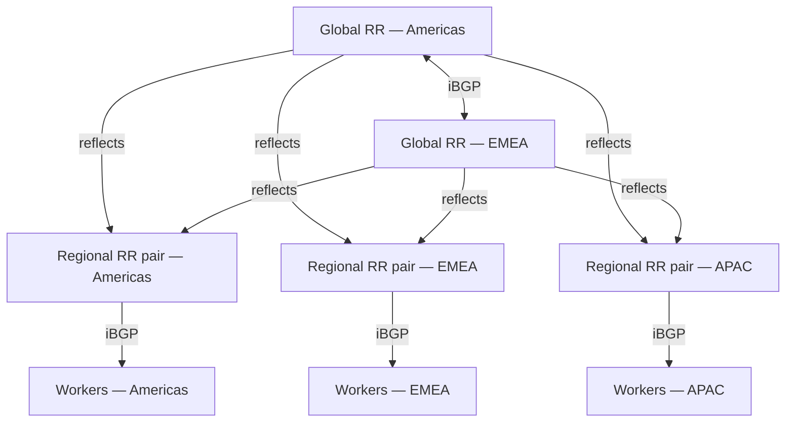
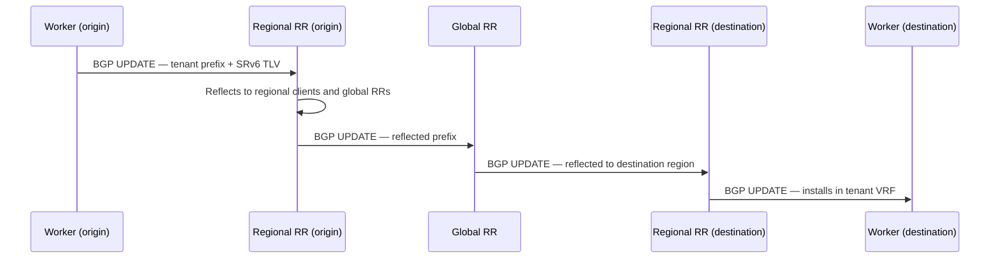

# BGP control plane design — Galactic VPC

## Overview

This document describes the BGP control plane architecture for Datum's Galactic VPC fabric. The fabric spans points of presence (PoPs) across three geographic regions.

The underlay provides IPv6 transport and reachability between PoPs. This document covers only the overlay control plane built on top of it.

---

## Design goals

- Full control plane reachability across all PoPs via BGP
- Regional forwarding survives total loss of the global RR tier
- No worker node carries more than 2 RR client sessions
- No single point of failure at any tier
- Clean separation of intra-region and inter-region route reflection

**Non-goals:**

- MPLS data plane — SRv6 is the commitment, not a preference
- Stretched L2 between PoPs

---

## Architecture

The control plane uses a two-tier route reflector hierarchy. This eliminates the O(n²) iBGP full-mesh problem while keeping regional forwarding fully independent of the global tier.

**Tier 0 — Global RRs (2 nodes)**

Two global RRs form an iBGP full-mesh pair, one anchored in Americas and one in EMEA. They reflect inter-regional reachability between the three regional clusters. They carry no intra-region routes — those stay entirely within each regional cluster. Both are co-located at existing PoPs; no new sites are required.

**Tier 1 — Regional RR clusters (3 pairs)**

| Cluster      | Scope             |
|--------------|-------------------|
| Americas     | All Americas PoPs |
| EMEA         | All EMEA PoPs     |
| Asia-Pacific | All APAC PoPs     |

Each regional cluster is a pair of RRs operating active/active. Each worker node peers with both RRs in its regional cluster — two sessions per worker, no more. Loss of one RR in a pair causes no service impact.

**Anchor selection criteria**

The anchor PoP for a regional RR pair should minimise average RTT across all PoPs in that region. This is a tiebreaker, not the primary criterion — BGP session management is not latency-sensitive. The hard constraint is that the anchor must not be a PoP undergoing active infrastructure migration or elevated operational risk.

---

## Session topology

| Node type        | Session count   | Peers                                                              |
|------------------|-----------------|--------------------------------------------------------------------|
| Worker node      | 2               | Both RRs in regional pair                                          |
| Regional RR node | 2 + N           | Both global RRs + all worker nodes in the regional cluster         |
| Global RR node   | 1 + 6           | Other global RR + both nodes of each regional pair (3 regions × 2) |

The design scales linearly: adding a PoP adds exactly 2 RR sessions. There is no fan-out at the global tier.

---

## Route propagation

Routes flow up from worker → regional RR → global RR, then back down to peer regional RRs → workers in the destination region. Intra-region propagation terminates at the regional RR; the global tier is not involved.

---

## Address families (SAFIs)

All RR sessions negotiate the following address families:

| Address family                                  | Purpose                              |
|-------------------------------------------------|--------------------------------------|
| VPNv4 (RFC 4364) + SRv6 Services TLV (RFC 9252) | Tenant L3VPN overlay — IPv4 prefixes |
| VPNv6 (RFC 4659) + SRv6 Services TLV (RFC 9252) | Tenant L3VPN overlay — IPv6 prefixes |
| EVPN + SRv6 Services TLV (RFC 9252)             | Tenant L2/L3 overlay                 |
| BGP-LS                                          | Topology export to controller / PCE  |

The RFC 9252 SRv6 Services TLV carries the SRv6 SID for each tenant VRF alongside the VPN prefix. A remote PE receiving a VPN prefix uses the TLV to determine which SRv6 SID to use for encapsulation. The SID endpoint behaviour (`End.DT4`, `End.DT46`, or `End.DT6`) is determined by the VRF address family — IPv4-only, dual-stack, or IPv6-only respectively.

---

## Tier 0 — Global RRs

### Role and scope

The global RRs exist for one purpose: carrying inter-regional reachability. They do not reflect intra-region routes — regional clusters handle that themselves and the global tier never sees it. The global RRs reflect VPN prefixes, EVPN NLRIs, and BGP-LS topology between the three regional clusters.

Two nodes. Full-mesh iBGP between them. Each global RR is a client of the other — they reflect to each other and both reflect outbound to the regional RR pairs. This means either global RR can independently reflect the full inter-region table to all regional clients.

**Placement:** One anchor per region is sufficient at current scale; not every region requires a global RR anchor. Regional RRs in unanchored regions peer with both existing global RRs via the underlay. Latency on those sessions is irrelevant for correctness — BGP session management is not latency-sensitive. If a region grows to warrant its own global RR anchor, the criteria are: PoP stability, infrastructure maturity, and avoiding any site currently undergoing active infrastructure migration.

### What the global RRs carry

| SAFI | Scope |
|------|-------|
| VPNv4 + SRv6 Services TLV | Cross-region tenant IPv4 prefixes |
| VPNv6 + SRv6 Services TLV | Cross-region tenant IPv6 prefixes |
| EVPN + SRv6 Services TLV | Cross-region tenant L2/L3 |
| BGP-LS | Full inter-region topology for PCE/controller |

The global RRs do **not** participate in intra-region VRF distribution. A prefix originating within a region stays within that region's cluster unless it needs to be reachable from workers in other regions.

### Session model

Each global RR maintains:
- 1 iBGP session to the other global RR (full-mesh peer, also a route-reflector client)
- 2 sessions per regional pair × 3 regions = 6 client sessions

Total: 7 sessions per global RR. This is deliberately small. If sessions are being added to the global tier for anything other than a new regional pair, the design should be questioned.

### Route-reflector cluster IDs

Each global RR must have a unique `cluster-id`. The global tier forms its own RR cluster. The cluster ID prevents routing loops: an NLRI reflected by Global RR A carries A's cluster ID, and Global RR B will not re-reflect it back to A. Without distinct cluster IDs, you get silent route suppression or reflection loops depending on implementation.

Assign cluster IDs from a reserved block, documented and stable. Do not reuse cluster IDs from the regional tier.

### Failure behaviour

**One global RR down:** The surviving node continues reflecting between all regional clusters. No routes are lost. Inter-region convergence for new prefixes continues uninterrupted. The only impact is loss of redundancy — one failure away from inter-region blackout for new prefixes. Treat as an incident; restore within the SLO window.

**Both global RRs down:** Existing inter-region routes stay installed in regional RIBs — no immediate forwarding impact. New prefixes originating in one region do not reach other regions. This state must be explicitly tested in staging (see Failure Modes section). Do not assume regional RIBs hold state gracefully without a test confirming it.

---

## Tier 1 — Regional RR clusters

### Role and scope

Each regional cluster is an active/active RR pair responsible for full intra-region route distribution. Every worker in the region peers with both RRs. The regional RRs also upstream-peer with both global RRs, carrying inter-region routes back down to regional workers.

The regional RR is the only BGP peer a worker node ever talks to. Workers do not peer with global RRs, with workers in other regions, or with anything outside their regional pair. This is a hard constraint — it's what keeps the session count on workers bounded at 2.

### Cluster assignment

PoPs are assigned to regional clusters based on geography. Each PoP belongs to exactly one regional cluster. The cluster boundaries are operationally significant: they define RR peering scope, failure domain, and the extent of intra-region route distribution.

### Anchor PoP selection

The anchor PoP hosts both nodes of the regional RR pair. Selection criteria in priority order:

1. **No active infrastructure migration.** Any PoP undergoing active infrastructure migration or with elevated operational risk is excluded as an anchor candidate. This is a hard exclusion — not a tiebreaker.
2. **Operational maturity.** The anchor PoP should have stable infrastructure, proven hardware, and no open reliability incidents.
3. **RTT minimisation.** Among qualified PoPs, prefer the one with lowest average RTT to all other PoPs in the region.

Do not co-locate both RR nodes in the same physical rack or on shared power. The pair is active/active — hardware failure at the rack level should take at most one node.

### Session model per regional RR node

Each regional RR node maintains:
- 2 sessions to global RRs (one each)
- N sessions to worker nodes in the region (N = number of workers in the regional cluster)

Each worker node in the region peers with both RR nodes — so each RR node carries the full worker session load for the region. Size the RR nodes accordingly; at large regional worker counts this is where memory and FIB capacity matter.

### Route-reflector cluster IDs — regional tier

Each regional pair operates as a single RR cluster. Both nodes in a pair share the same `cluster-id`. This is intentional: it allows either node to reflect routes without the other node suppressing them due to cluster ID loop prevention.

The implication: both nodes in a regional pair are authoritative reflectors for the same cluster. A route reflected by node A and a route reflected by node B for the same prefix look identical from a cluster-loop-prevention standpoint. Workers will accept the reflected route from whichever RR they receive it from first.

Each regional cluster must have a distinct cluster ID from every other cluster including the global tier. Four cluster IDs total: one per regional pair, two for the global tier.

### Route reflection flow — intra-region

A worker in region X originates a tenant VPN prefix:

1. Worker advertises the prefix (VPNv4 + SRv6 TLV) to both regional RR nodes.
2. Each regional RR reflects the prefix to all other workers in the region and upstream to both global RRs.
3. Other regional workers install the prefix. The originating worker's SRv6 SID (from the TLV) tells them how to encapsulate.
4. Global RRs reflect the prefix to the other regional RR pairs, which distribute it to their workers.

The global tier is not in the intra-region path. A worker receiving a prefix from another worker in the same region never touches the global tier. This is what makes regional forwarding independent of global RR availability.

### Route reflection flow — inter-region

A worker in region X originates a tenant VPN prefix:

1. Worker → both regional RR nodes in region X.
2. Regional RRs reflect to all workers in region X (intra-region done) and upstream to both global RRs.
3. Global RRs reflect to all other regional RR pairs.
4. Remote regional RRs distribute to their respective workers.

The SRv6 SID in the TLV is set by the originating worker. Remote workers install the prefix and use that SID for encapsulation — they steer traffic toward the origin's locator, which the underlay resolves via the SRv6 locator advertisement.

### ADD-PATH

Regional RRs should advertise multiple paths (BGP ADD-PATH, RFC 7911) to workers where multiple equal-cost paths exist across the fabric. Without ADD-PATH, a worker receives only the best path the RR selected — you lose visibility into alternate paths and make ECMP harder to exploit correctly. Enable ADD-PATH on all regional RR sessions; configure workers to consume it.

### Next-hop handling

Regional RRs must **not** modify the NEXT_HOP attribute on reflected routes. The next-hop for a VPN route is the originating PE's loopback (or SRv6 locator address) — the RR is a reflector, not a transit node. If next-hop rewrite is enabled by mistake, workers will try to reach the RR as next-hop and the data plane breaks.

Explicitly configure `next-hop-unchanged` (or equivalent) on all RR client peering groups. Verify this in staging before bringing up the first regional cluster.

### Graceful restart

Configure BGP Graceful Restart (RFC 4724) on regional RR nodes. During a planned RR restart (software upgrade, config push), workers should not withdraw all routes immediately. GR gives the RR time to re-establish sessions and re-reflect routes before workers flush their RIB state. Set the GR restart timer conservatively — 120s is reasonable; enough time for an RR to come back without triggering unnecessary reconvergence.

Workers should be GR-aware (Helper mode). The RR is the restarting speaker; workers are helpers that hold state during the restart window.

### Scaling limits

At the regional tier, the binding constraint is the number of active BGP sessions and the VRF/prefix table size the RR must hold. The RR must hold the full regional table plus the inter-region table reflected from the global tier. At current PoP counts this is well within commodity server capacity, but instrument it:

- Monitor BGP session count and RIB size per RR node via gNMI.
- Alert if either RR in a pair loses sessions that its partner is still holding — that's a split you need to see immediately.
- Alert on RIB size divergence between the two nodes in a pair — a significant delta indicates a reflection or session issue.

The design is linear: adding a PoP to a region adds 2 sessions to that region's RR pair (one per node). There is no fan-out, no O(n²) growth. This holds as long as workers peer only with their regional pair.

---

## Failure modes

### Global RR loss (one node)

No outage. The surviving global RR continues reflecting between all regional clusters. Inter-region convergence degrades slightly until the failed node is restored.

### Global RR loss (both nodes)

Inter-region routes are no longer updated. Existing routes remain in the regional RIBs; intra-region forwarding is completely unaffected. New prefixes originating in one region will not reach other regions until the global tier recovers.

> **This must be tested explicitly in staging.** The test: withdraw both global RRs, originate a new prefix in one region, confirm it does not appear in other regions' RIBs, confirm all existing inter-region routes remain installed and forwarding.

### Regional RR node loss (one of pair)

No service impact. Workers continue peering with the surviving RR. The failed node should be replaced within the SLO window — a degraded pair is a single point of failure.

### Worker node BGP session loss

Routes originated by the affected worker are withdrawn from the fabric. The control plane reconverges once sessions re-establish. In-flight traffic to the affected worker black-holes until sessions are restored.

---

## Timer recommendations

| Timer         | Value | Rationale                                   |
|---------------|-------|---------------------------------------------|
| BGP keepalive | 10s   | Faster detection without excessive overhead |
| BGP hold time | 30s   | 3× keepalive; aggressive but stable         |
| RR reconnect  | 5s    | Fast reconnect after transient loss         |
| GR restart    | 120s  | Sufficient for planned RR restarts          |

BGP hold timer expiry is the failure detection mechanism at this layer — up to 30s with the above settings. Sub-second failure detection is an underlay concern: the underlay should withdraw reachability fast enough that BGP sessions drop and reconverge without waiting for hold timer expiry. The control plane relies on that signal; it does not attempt to replicate it.
