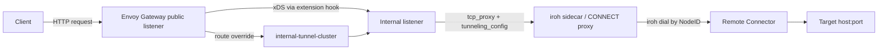
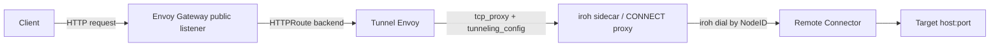

# Connector Implementation + Envoy Configuration (Datum Connect)

- [Summary](#summary)
- [Motivation](#motivation)
  - [Goals](#goals)
  - [Non-Goals](#non-goals)
- [Proposal](#proposal)
  - [Connector End-to-End Flow](#connector-end-to-end-flow)
  - [Data Map (Who Writes What)](#data-map-who-writes-what)
- [Design Details](#design-details)
  - [Connector + Advertisement Responsibilities](#connector--advertisement-responsibilities)
  - [Envoy + Sidecar Data Path](#envoy--sidecar-data-path)
  - [Programming Envoy for Tunnel Listeners](#programming-envoy-for-tunnel-listeners)
  - [NSO Work Plan](#nso-work-plan)
  - [Discovery Publishing](#discovery-publishing)
  - [Validation Rules](#validation-rules)
  - [Open Questions](#open-questions)
- [Production Readiness Review Questionnaire](#production-readiness-review-questionnaire)
  - [Feature Enablement and Rollback](#feature-enablement-and-rollback)
  - [Rollout, Upgrade and Rollback Planning](#rollout-upgrade-and-rollback-planning)
  - [Monitoring Requirements](#monitoring-requirements)
  - [Dependencies](#dependencies)
  - [Scalability](#scalability)
  - [Troubleshooting](#troubleshooting)
- [Implementation History](#implementation-history)
- [Drawbacks](#drawbacks)
- [Risks and Mitigations](#risks-and-mitigations)
- [Alternatives](#alternatives)

## Summary

This document captures how Datum Connect and Datum Desktop will implement
connector-backed traffic through Envoy, using an iroh sidecar and the Gateway API.
It consolidates the end-to-end flow, Envoy configuration options, and NSO work
needed to route traffic through connectors. The initial use case is
datum-connect/datum-desktop, with Layer 4 advertisements and CONNECT-TCP, with
a clear path to extend to CONNECT-UDP.

## Motivation

### Goals

- Provide a clear end-to-end flow for connector-backed tunnels in the control plane.
- Define how Envoy and the iroh sidecar exchange routing metadata.
- Describe NSO responsibilities for programming Envoy with connector routes.
- Capture the Envoy configuration model for tunnel listeners and metadata injection.

### Non-Goals

- Define new Connector API shapes beyond those already proposed.
- Specify L3 CIDR routing or CONNECT-IP for the initial implementation.

## Proposal

### Connector End-to-End Flow

#### 1) Device starts and registers a Connector
**Responsible:** Datum Desktop / Device Agent

**Data:**
- iroh NodeID (public key)
- home relay URL
- observed addresses (address + port)
- device metadata/labels

**Actions:**
- Create `Connector` (spec) for this device.
- Patch `Connector.status.connectionDetails` with NodeID + relay + addresses (address + port).

#### 2) Control plane publishes discovery records
**Responsible:** Control Plane Controller

**Data:**
- `Connector.status.connectionDetails`

**Actions:**
- Publish DNS TXT records (or equivalent discovery data), e.g.
  `_iroh.<node-id>.datumconnect.net`.

#### 3) Device advertises tunnels
**Responsible:** Datum Desktop / Device Agent

**Data:**
- `ConnectorAdvertisement` `spec.layer4` services (host + port)

**Actions:**
- Create or update `ConnectorAdvertisement` linked to the Connector.

#### 4) Device creates HTTPProxy
**Responsible:** Datum Desktop / Device Agent (on behalf of the user)

**Data:**
- public hostname(s)
- backend endpoint URL (host + port)
- connector reference (name)

**Actions:**
- Create or update `HTTPProxy`.

#### 5) NSO programs Envoy
**Responsible:** NSO

**Data:**
- `HTTPProxy` backend + connector reference
- `Connector` status (capabilities, connection details)

**Actions:**
- Resolve connector by name.
- Ensure connector capabilities allow the requested protocol (CONNECT-TCP for MVP).
- Program Gateway API resources and Envoy patches to route through the tunnel
  listener and attach routing metadata.

#### 6) Envoy handles inbound requests
**Responsible:** Envoy + iroh sidecar

**Actions:**
- Envoy routes traffic to a tunnel listener that generates CONNECT to the sidecar.
- The sidecar reads tunnel headers, dials by NodeID using discovery, and forwards traffic.

### Data Map (Who Writes What)

- `Connector.spec`: Device Agent (creates)
- `Connector.status.connectionDetails`: Device Agent (patches)
- `ConnectorAdvertisement.spec`: Device Agent (creates/updates)
- `HTTPProxy.spec`: Device Agent / User / UI / API client
- Gateway API + Envoy policies: NSO
- Discovery records: Control Plane Controller

## Design Details

### Connector + Advertisement Responsibilities

- `ConnectorAdvertisement` expresses intended reachable destinations for discovery
  and UX, but enforcement of allowed destinations is the connector's responsibility.
- The connector should reject requests that are not advertised or not permitted by
  its local policy, even if the control plane allows the HTTPProxy.

### Envoy + Sidecar Data Path

1) Envoy receives a request from the client.
2) Envoy routes the request to a tunnel listener (not the real backend).
3) The tunnel listener uses `tcp_proxy` with `tunneling_config` to emit a CONNECT
   request to the sidecar backend.
4) The tunneling config injects headers describing:
   - Connector NodeID (iroh public key)
5) The sidecar dials the remote connector using discovery and forwards traffic.

MVP uses CONNECT-TCP only; CONNECT-UDP can be added by enabling UDP capability
checks and using the CONNECT-UDP method without introducing new headers.

### Programming Envoy for Tunnel Listeners

We use an internal listener (or unix socket / localhost listener) with
`tcp_proxy` and `tunneling_config`. Route metadata is mapped into headers by
`tunneling_config.headers_to_add`. Envoy Gateway remains the public listener,
but tunnel routes are overridden to target the internal listener.

This avoids relying on `BackendTrafficPolicy` for CONNECT proxying, and keeps
all tunnel behavior on the data plane side of Envoy.

#### Envoy Gateway Options (POC Notes)

This section captures three ways to implement the internal listener +
`tcp_proxy` + `tunneling_config` model while keeping Envoy Gateway (EG)
public-facing. Each option includes implementation notes and validation results.

**Option 1: EnvoyProxy bootstrap patch + route override (static internal listener)**

**Idea**
- Keep EG for the public listener.
- Inject a static internal listener + static clusters via `EnvoyProxy.spec.bootstrap` (JSONPatch).
- Override the route cluster to point at the internal listener.

**How it works**
- EG still creates the public HTTP listener.
- We add a static internal listener named `internal-tunnel`.
- We add a static cluster `internal-tunnel-cluster` that targets `internal-tunnel` via `envoy_internal_address`.
- The internal listener runs `tcp_proxy` with `tunneling_config` and sends CONNECT to the sidecar backend (`connect-proxy-static`).
- `EnvoyPatchPolicy` replaces the HTTPRoute cluster with `internal-tunnel-cluster`.

```mermaid
flowchart LR
  client[Client] -->|HTTP request| egw[Envoy Gateway public listener]
  egw -->|Route cluster override| icluster[internal-tunnel-cluster]
  icluster -->|envoy_internal_address| ilistener[Internal listener]
  ilistener -->|tcp_proxy + tunneling_config| sidecar[iroh sidecar / CONNECT proxy]
  sidecar -->|iroh dial by NodeID| remote[Remote Connector]
  remote --> target[Target host:port]
```

**POC steps**
- `EnvoyProxy` bootstrap JSONPatch:
  - `bootstrap_extensions`: add `envoy.bootstrap.internal_listener`.
  - `static_resources.listeners`: add `internal-tunnel` with `tcp_proxy + tunneling_config`.
  - `static_resources.clusters`: add `internal-tunnel-cluster` and `connect-proxy-static`.
- `EnvoyPatchPolicy` to replace route cluster:
  - `/virtual_hosts/0/routes/0/route/cluster` -> `internal-tunnel-cluster`.

**POC results**
- Bootstrap dump shows the internal listener:
  - `internal-tunnel` appears under `static_resources.listeners`.
- The sidecar backend saw the CONNECT generated by the internal listener:
  - `x-iroh-endpoint-id: bootstrap-node`
- A normal HTTP GET returned `200`, confirming the internal CONNECT completed.

**Notes / limitations**
- This is static: listener and cluster are created once at bootstrap.
- Still requires `EnvoyPatchPolicy` to redirect routes to the internal cluster.
- Clients use normal HTTP; the internal listener creates CONNECT.

---

**Option 2: Extension server hook (dynamic listener injection)**

**Idea**
- Keep EG for the public listener.
- Add a custom extension server that injects a new listener + cluster during translation.

**How it works**
- EG calls extension hooks (e.g., `PostHTTPListenerModifyHook` or `PostTranslateModifyHook`).
- The hook returns modified xDS output that includes:
  - `internal-tunnel` listener
  - `internal-tunnel-cluster`
  - (optionally) route overrides
- EG serves this to Envoy via xDS.

**What's required**
- Build and deploy an extension server.
- Configure the EnvoyGateway resource:
  - `extensionManager.hooks.xdsTranslator.post` (e.g., `HTTPListener`, `Translation`)
  - `extensionManager.service` for the hook endpoint.

**POC status**
- Implemented using a custom gRPC extension server.
- The extension server adds:
  - `internal-tunnel-ext` listener
  - `internal-tunnel-cluster-ext` (envoy_internal_address)
  - `connect-proxy-ext` (upstream to the sidecar)
  - Route cluster override to `internal-tunnel-cluster-ext`
- A normal HTTP GET returned `200`, confirming the internal CONNECT completed.
- CONNECT seen by sidecar with `x-iroh-endpoint-id: ext-node`.

---

**Option 3: Separate tunnel Envoy behind EG**

**Idea**
- EG remains the public ingress.
- EG routes to a dedicated Envoy deployment that we fully control.

**How it works**
- EG routes HTTPRoute backend to `tunnel-envoy` service.
- `tunnel-envoy` runs a public listener with `tcp_proxy + tunneling_config`.
- `tunnel-envoy` generates CONNECT to the sidecar backend (`connect-proxy`).

**POC steps**
- Deploy `tunnel-envoy` (standalone Envoy) with:
  - listener: `tcp_proxy + tunneling_config`
  - cluster: `connect-proxy` (sidecar backend)
- Update HTTPRoute backend to `tunnel-envoy:10000`.

**POC results**
- Sidecar backend saw the CONNECT generated by `tunnel-envoy`:
  - `x-iroh-endpoint-id: tunnel-envoy-node`
- A normal HTTP GET returned `200`, confirming the tunnel completed.

**Notes / limitations**
- Operationally simplest, and avoids deep EG customization.
- Adds an extra Envoy hop.

---

**Summary of trade-offs**
- **Option 1 (bootstrap patch):** Works with EG, no extra deployment, but relies on
  bootstrap JSONPatch + route override.
- **Option 2 (extension server):** Most flexible, might be the correct long-term
  architecture, but requires running custom extension server infrastructure.
- **Option 3 (separate Envoy):** Easiest operationally, but adds an extra hop and
  separate deployment to manage.

### NSO Work Plan

#### New Controllers

**Connector Controller**
- Watch `Connector` resources.
- Validate connector class existence.
- Expect the connector agent to set `status.connectionDetails` and capability conditions.
- Publish DNS TXT records (or equivalent discovery records) from `status.connectionDetails`.

**ConnectorAdvertisement Controller**
- Watch `ConnectorAdvertisement` resources.
- Validate `connectorRef` exists and is in the same namespace.
- Track advertisements for discovery and UX (not for enforcement).

#### HTTPProxy Reconciliation Changes

**Selection**
- Add support for `backend.connector` references in the Datum HTTPProxy API.
- Resolve connector by name.

**Validation**
- Validate connector existence and capability for the requested protocol
  (CONNECT-TCP for MVP).
- Do not validate backend endpoints against ConnectorAdvertisement; enforcement
  is handled by the connector.

**Gateway API + Envoy Programming**
- Keep Gateway + HTTPRoute creation as-is for public listeners.
- For connector-backed routes:
  - Override the route cluster to target the internal tunnel listener.
  - Attach per-route metadata (connector node id) for
    `tunneling_config.headers_to_add`.

**EnvoyPatchPolicy / Metadata Injection**
- Follow the pattern used by the TrafficProtectionPolicy controller to inject
  per-route metadata.
- Map metadata into CONNECT headers via `tunneling_config.headers_to_add`.

Recommended metadata keys:
- `x-iroh-endpoint-id`

The node id comes from the selected connector. The target host and port are
carried in the CONNECT authority-form request target (host:port), and TCP is
implied by the CONNECT method for the MVP.

### Discovery Publishing

The device agent updates `status.connectionDetails` with its NodeID (public key),
home relay, and observed addresses (address + port). The control plane controller publishes DNS TXT
records (or equivalent discovery data) from those details so peers can dial by
NodeID.

### Validation Rules

- A connector must exist and report capability readiness for the requested protocol.
- Advertisement matching is informational and not enforced by NSO.
- If multiple connectors are referenced in future APIs, selection policy must be
  defined (single preferred, round-robin, or fail with conflict).

### Open Questions

- Which Envoy Gateway option to standardize on for production (bootstrap patch,
  extension server, or separate tunnel Envoy).
- Do we want to define and document an initial ConnectorClass (for example
  `datum-connect`), and if so what is its intention and how is it supposed to work?

## Production Readiness Review Questionnaire

### Feature Enablement and Rollback

### Rollout, Upgrade and Rollback Planning

### Monitoring Requirements

### Dependencies

### Scalability

### Troubleshooting

## Implementation History

## Drawbacks

## Risks and Mitigations

- **Risk:** Misconfigured routing metadata could cause tunnels to dial the wrong target.
  **Mitigation:** Validate metadata shape and ensure per-route provenance in NSO.
- **Risk:** Option 1 static bootstrap patch may limit future dynamic behavior.
  **Mitigation:** Keep Option 2 as the long-term path; treat Option 1 as MVP.

## Alternatives

- Continue with per-route CONNECT proxying via `BackendTrafficPolicy`. This does
  not align with the internal listener model and limits header injection to the
  HTTP layer rather than `tunneling_config`.
- Add connector selection via label selectors in the HTTPProxy API. This adds
  flexibility but introduces ambiguity and more complex reconciliation logic.
- Avoid letting the device agent patch `Connector.status.connectionDetails`
  directly. Instead, make connection details declarative via:
  - A `Connector.spec.connectionDetails` field owned by the device agent, with
    the control plane controller copying validated data into status; or
  - A separate `ConnectorRegistration` resource created by the device agent,
    with the controller synthesizing `Connector.status` from registrations.
  This keeps status controller-owned and aligns with Kubernetes conventions.
