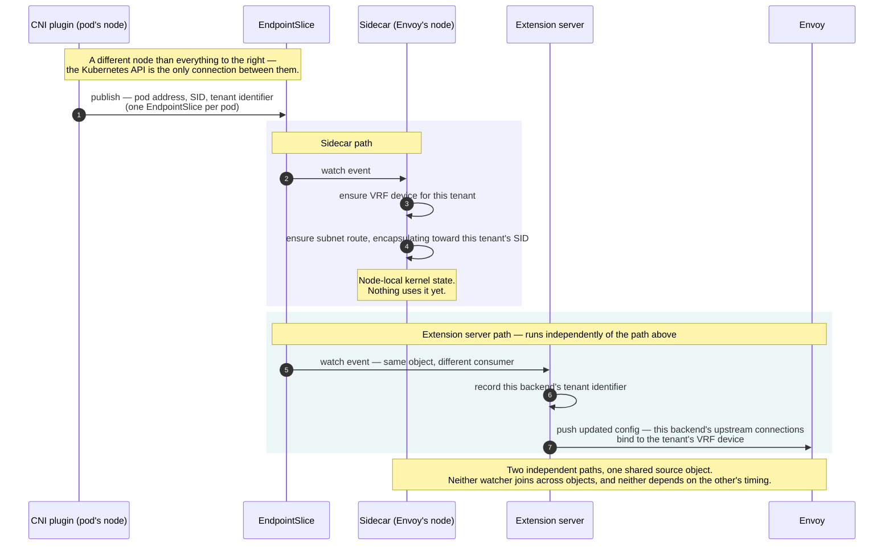
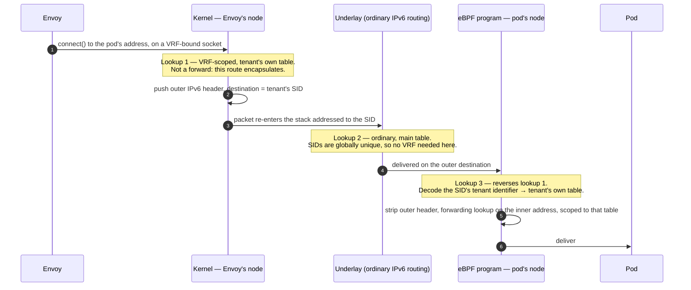
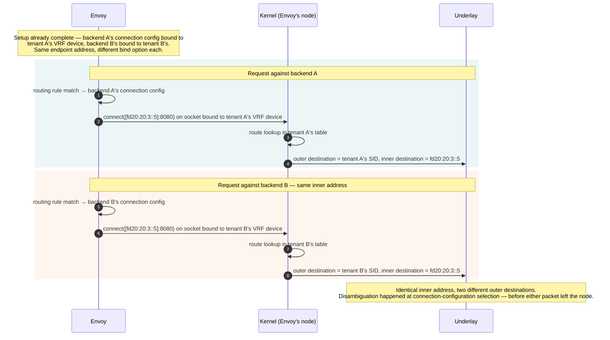
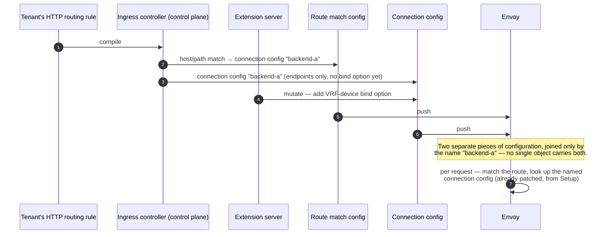
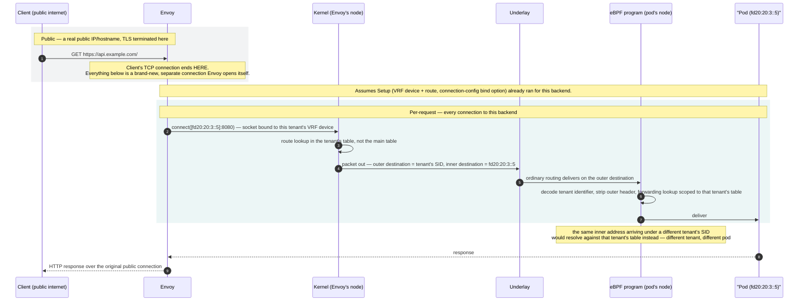
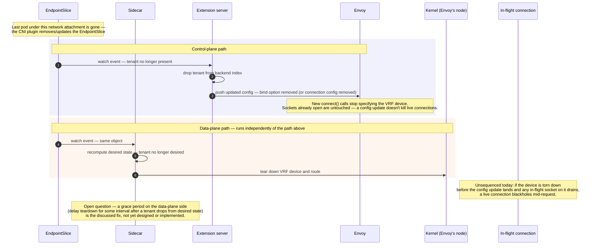

# HTTP Ingress for VPC Networks

- [Summary](#summary)
- [Motivation](#motivation)
  - [Goals](#goals)
  - [Non-Goals](#non-goals)
- [Proposal](#proposal)
  - [User Stories](#user-stories)
  - [Notes/Constraints/Caveats](#notesconstraintscaveats)
  - [Risks and Mitigations](#risks-and-mitigations)
- [Design Details](#design-details)
  - [Where a tenant's identity comes from](#where-a-tenants-identity-comes-from)
  - [Wiring a backend rule to a VPC pod](#wiring-a-backend-rule-to-a-vpc-pod)
  - [Setup](#setup)
  - [Route lookup](#route-lookup)
  - [Request](#request)
  - [Teardown](#teardown)
  - [Privilege and deployment model](#privilege-and-deployment-model)
- [Production Readiness Review Questionnaire](#production-readiness-review-questionnaire)
  - [Feature Enablement and Rollback](#feature-enablement-and-rollback)
  - [Rollout, Upgrade and Rollback Planning](#rollout-upgrade-and-rollback-planning)
  - [Monitoring Requirements](#monitoring-requirements)
  - [Dependencies](#dependencies)
  - [Scalability](#scalability)
  - [Troubleshooting](#troubleshooting)
- [Implementation History](#implementation-history)
- [Drawbacks](#drawbacks)
- [Alternatives](#alternatives)
- [Infrastructure Needed](#infrastructure-needed)

## Summary

Datum's HTTP ingress runs as a shared, multi-tenant Envoy Gateway data
plane — one fleet of Envoy proxies serving every tenant's `HTTPProxy`
resources. Some of those tenants' backends are pods living inside a VPC
built on an SRv6/EVPN fabric, where addressing is deliberately
tenant-private: two unrelated tenants can and do own the identical pod
prefix. This document describes, end to end, how a shared Envoy safely
opens a real upstream connection into one specific tenant's pod, without
ever confusing it for another tenant's pod at the same address — using a
per-tenant Linux VRF (Virtual Routing and Forwarding) device on Envoy's
own node, an SRv6 encapsulation route toward that tenant's segment, and a
matching decapsulation step on the pod's own node, all driven off state a
CNI plugin publishes once per pod.

## Motivation

Tenants increasingly run workloads inside VPC networks that need to be
reachable over ordinary HTTP, fronted by the same ingress mechanism every
other tenant already uses. Without this design, a VPC-hosted pod is only
reachable from inside its own VPC — there is no path from the shared
ingress fleet into it at all, because the fleet has no way to disambiguate
one tenant's private address space from another's. The alternative of
giving each VPC tenant a dedicated ingress deployment scales ingress
infrastructure linearly with tenant count, which the platform does not
want to commit to.

### Goals

- Let any tenant's `HTTPProxy` route to a pod living inside their own
  SRv6/EVPN-addressed VPC network, through the existing shared,
  multi-tenant Envoy Gateway fleet.
- Guarantee no cross-tenant traffic leakage even when two tenants' VPC
  address ranges collide exactly.
- Keep the disambiguation mechanism entirely transparent to Envoy's own
  request-routing logic — no VRF-aware code inside Envoy itself, and no
  per-tenant Envoy Gateway deployments.
- Keep the mechanism's moving parts independently reconcilable: a
  component going through a restart, an upgrade, or a temporary outage
  should not require coordinated action from the others to recover.

### Non-Goals

- Redesigning the SRv6/EVPN control plane itself — BGP session topology,
  route reflection, and EVPN route-target/route-distinguisher assignment
  are assumed to already exist and are out of scope here.
- Egress from a VPC pod back out to the public internet — this design
  covers ingress into a VPC pod only.
- Non-HTTP backends — this design is scoped to `HTTPProxy`/HTTP ingress
  traffic, not generic L4 proxying to a VPC pod.
- General multi-tenant network policy or firewalling — this design
  resolves address *disambiguation* (routing the right packet to the right
  tenant), not access control (deciding which tenants are allowed to reach
  which backends at all).

## Proposal

Four components cooperate to make one upstream connection work, none of
which run on the same node as each other by default:

- **A CNI plugin**, running on each node that hosts tenant workloads. It
  allocates pod addresses, computes an SRv6 Segment Identifier (SID) for
  each tenant's network attachment, and publishes both facts to the
  Kubernetes API so other components can act on them without any
  node-local channel to this component at all.
- **A sidecar container** running alongside Envoy, in Envoy's own pod. It
  creates and tears down per-tenant Linux VRF devices and SRv6
  encapsulation routes on Envoy's node — the kernel-level state Envoy's
  own upstream sockets will use. Privilege is split deliberately from
  Envoy itself: this container holds the capability needed to create
  network devices and routes; Envoy only ever needs the capability to
  bind a socket to a device that already exists. Containers sharing one
  pod already share a network namespace, so a device this sidecar creates
  is immediately usable by Envoy's sockets — no host networking, no extra
  interface plumbing.
- **An Envoy Gateway extension server**, a control-plane component that
  mutates the generated proxy configuration before it reaches Envoy. It
  patches the specific pieces of that configuration that need to know
  about a tenant's VRF device.
- **An eBPF program**, running on the tenant pod's own node, that reverses
  the encapsulation on arrival — decoding which tenant a packet belongs to
  and delivering it to the correct pod even though the packet's visible
  destination address, alone, is exactly as ambiguous as it was when it
  left Envoy's node.

The full mechanism is walked in four phases in [Design Details](#design-details):
**Setup** (the state each backend needs before any request can use it),
**Route lookup** (why an address that's ambiguous on its own still resolves
to the right pod), **Request** (what actually happens for one client
request, start to finish), and **Teardown** (what happens when a backend
goes away, and the one race that isn't fully closed yet).

### User Stories

#### Story 1

As a tenant running an API inside my own VPC network, I want to expose it
through the platform's normal `HTTPProxy` ingress so that my public
clients reach it the same way any other tenant's backend is reached — even
though my VPC's private address range may be identical to another
tenant's, and I have no visibility into or control over that fact.

#### Story 2

As a platform operator, I want to keep operating one shared Envoy Gateway
fleet as VPC-hosted backends become common, rather than provisioning and
maintaining a dedicated ingress deployment per tenant that adopts a VPC
network.

### Notes/Constraints/Caveats

Three address domains are in play at once, and keeping them distinct is
the key to understanding the whole mechanism:

| Domain | Example | Who sees it |
|---|---|---|
| **Public** | `api.example.com`, a real public IP, TLS-terminated | The client — the only domain it ever touches |
| **Private backbone** | the SRv6 SID/locator space | Internal to the fabric, never publicly routable |
| **Private tenant** | `fd20:20:3::5` | The tenant's own address, can overlap with another tenant's |

Envoy is the seam between the first domain and the other two. The client's
TCP connection ends at Envoy; everything described in Design Details
happens on a second, separate connection Envoy opens itself, upstream,
toward the pod. The client is never aware any of it exists.

A second constraint worth stating explicitly, because it's easy to assume
otherwise: the CNI plugin runs on the tenant pod's own node — not on
whichever node happens to be running Envoy and its sidecar, which is
typically a different node entirely. The two never talk to each other
directly. The only thing connecting them is a Kubernetes object published
and read via the API server, described in
[Where a tenant's identity comes from](#where-a-tenants-identity-comes-from).

### Risks and Mitigations

- **Teardown race.** Two independent components each unwind half of a
  backend's state when it's removed, with no ordering guarantee between
  them and no wait on "is anything still using this." See
  [Teardown](#teardown) for the full mechanism; a grace period on the
  data-plane side's device/route deletion is the mitigation direction
  under discussion, not yet designed.
- **Two kernel-level behaviors are unverified against a real kernel**: the
  exact framing of the socket-bind option's buffer, and the SRv6
  encapsulation route the sidecar installs. An equivalent untested
  assumption on the decapsulation side has already produced one silent
  blackhole in production, traced back to a missing neighbor-resolution
  entry — both need real-kernel verification before this design is
  trusted live, treated with the same level of skepticism.
- **A raw deployment patch, not a first-class API, injects the sidecar.**
  The gateway controller's configuration surface has no native field for
  adding an arbitrary long-running container to its generated Envoy
  deployment; the only available mechanism is a strategic-merge patch
  against that generated object's current shape. An upstream version
  change to how the controller generates that object could silently break
  the patch. Mitigation: pin and test against specific upstream versions,
  and add a compatibility check to catch a breaking change before it
  reaches production, rather than discovering it live.
- **Startup reconcile ordering.** On a sidecar restart, existing kernel
  state it created before restarting can look unreferenced for a moment,
  before its view of current backends is warm — risking the same
  teardown-while-live problem as the general teardown race, even with no
  backend actually gone. Mitigation: a startup pass that inventories
  existing kernel state tagged as this component's own, before treating
  anything as stale.
- **Cross-namespace reference.** The CNI plugin's per-pod object and the
  ingress controller's internal representation of the routing rule that
  targets it can live in different namespaces, and Kubernetes networking
  APIs require an explicit access grant before a reference is allowed to
  cross a namespace boundary. Two materially different mitigations are
  available — constrain where VPC-backed workloads are placed relative to
  the rule that fronts them, or have the controller manage a grant object
  per backend — and neither has been chosen yet.

## Design Details

### Where a tenant's identity comes from

Every VPC network attachment gets one SRv6 SID, computed once, and shared
by every pod attached to that same network — not one SID per pod. The
computation combines the hosting node's own SRv6 locator block, that
node's numeric identifier, a per-tenant identifier allocated for this
attachment (a small integer, unique within the fabric), and a fixed
function code that tells the decapsulating node "decapsulate this, then
look up the inner address in a specific per-tenant routing table."

That per-tenant identifier is the same value used, later, to name the
Linux VRF device and select the routing table on both ends of the
connection — it is the one thing that ties a SID, a VRF device, and a
kernel routing table together as "the same tenant."

The CNI plugin publishes both facts — a pod's real address and the shared
SID/tenant-identifier pair — on one Kubernetes object per pod: an
`EndpointSlice`, named after the pod, carrying the pod's actual allocated
IP as its address and the SID plus tenant identifier as annotations.
Multiple pods sharing one network attachment each get their own
`EndpointSlice`, but all of them carry the identical SID and tenant
identifier annotation value. This is deliberate: it means every downstream
consumer of this object gets both facts — "where is this pod" and "which
tenant does it belong to, and how do I reach that tenant's part of the
fabric" — from a single object, with no join required across separate
objects.

### Wiring a backend rule to a VPC pod

A tenant expresses "route this HTTP rule to a pod inside my VPC" as a rule
on their ingress resource, with a backend reference pointing at a specific
Kubernetes Service-like object for that pod. For this to work end to end,
the ingress controller has to resolve that reference all the way down to
the *same* `EndpointSlice` the CNI plugin published — not synthesize a
second, independent `EndpointSlice` of its own the way it does for
ordinary backends today. If the controller created its own object instead
of referencing the CNI's, the "one object, both facts" property the whole
design depends on would be lost the moment that second object re-entered
the picture: the sidecar and the extension server described below would
have no single place left to read both the address and the routing
identity from.

This also raises the cross-namespace question named in
[Risks and Mitigations](#risks-and-mitigations): the CNI publishes its
`EndpointSlice` in the pod's own namespace, while the ingress controller's
internal representation of that HTTP rule may live in a different
namespace by the time it's ready to reference a backend. Any
implementation of this design has to resolve that mismatch — either by
constraining where VPC-backed workloads are placed relative to the
ingress resource that fronts them, or by having the controller manage an
explicit cross-namespace access grant per backend.

### Setup

Setup's job: before any request can be served, get two independent pieces
of state in place, both derived from the same source object, so that a
request never has to compute anything — it just uses what's already
there.

1. **A VRF device and an SRv6 encapsulation route**, on Envoy's own node —
   so that a socket bound to that device resolves the tenant's address
   into an encapsulated packet addressed to the right SID.
2. **A socket-bind option on Envoy's upstream connection configuration for
   that specific backend** — so that Envoy's connection to that backend
   actually uses the device from step 1, without Envoy having any
   VRF-aware logic of its own.

Both facts come from the one `EndpointSlice` described above. Two
independent watchers consume it and each produce one of the two pieces of
state; neither needs to join across objects, and neither depends on the
other's timing:

- The **sidecar**, watching that `EndpointSlice`, groups what it sees by
  tenant identifier rather than by individual pod or individual object —
  every pod sharing one network attachment shares one SID, so one VRF
  device and one subnet-scoped route cover all of them, no matter how many
  per-pod `EndpointSlice`s exist for that tenant.
- The **extension server**, watching the same object through its own
  index of backend policy, and patching the specific upstream connection
  configuration Envoy will use for that backend with a socket option
  naming the tenant's VRF device.

### Route lookup

This is the part that's easy to get wrong: the SID is **not** a next-hop,
and Envoy never inspects an address to figure out whose it is. Two
different mechanisms are doing two different jobs — one inside the Linux
kernel/eBPF data path, one inside Envoy's own configuration model — and
they only meet at the socket.

#### The kernel/data-path side: three lookups, not one

Sending a packet toward a pod involves three separate route lookups, each
answering a different question:

1. **On Envoy's node — a VRF-scoped lookup, to pick the right SID.**
   Envoy's upstream socket is bound to a per-tenant Linux VRF device
   before it connects. That binding sends the route lookup for the pod's
   real address into a *tenant-specific* routing table instead of the one
   shared table — which is what resolves the ambiguity, since two
   tenants' identical prefixes now live in two different tables with no
   collision. The matching route doesn't forward anywhere; it
   **encapsulates** — it pushes a new outer IPv6 header whose destination
   is the SID, and hands the packet back to the stack as if it had just
   arrived addressed to that SID.
2. **Immediately after — an ordinary, non-VRF lookup, to actually get
   there.** Now that the packet's destination is the SID, the kernel does
   a completely normal route lookup on it, same as for any other IPv6
   address, in the regular/main table. This is where the real next-hop is
   chosen. It needs no special handling and no VRF, because SIDs are
   globally unique across every tenant by construction — there's nothing
   left to disambiguate.
3. **On arrival, the pod's node reverses step 1.** An eBPF program reads
   the SID's embedded tenant identifier, resolves it to a Linux VRF
   routing table, strips the outer header, and does a forwarding lookup
   scoped to *that* table using the packet's original (inner) destination
   — landing on the correct tenant's pod even though the inner address,
   taken alone, is exactly as ambiguous as it was on the way out.

#### The Envoy side: disambiguation happens at connection-configuration selection, not at connect time

Easy to misread the mechanism as "Envoy looks at the destination address
and figures out whose it is." It doesn't — Envoy never compares addresses
across tenants at all. The disambiguation is a **setup-time fact attached
to one backend's connection configuration**, not a per-connection
decision:

1. The tenant's own HTTP routing rule already picked which specific
   upstream connection configuration to use before any address was
   involved — driven by hostname/path, and every ingress rule belongs to
   exactly one tenant. "Which tenant" is settled before Envoy opens a
   socket.
2. Envoy holds one distinct connection configuration per backend — one per
   VPC network attachment. Two tenants sharing `fd20:20:3::/64` still get
   two separate configurations, just both listing an endpoint that happens
   to say `fd20:20:3::5`.
3. The extension server tags each configuration individually, by backend
   identity — not by IP — as part of Setup, already done by the time any
   request arrives. Backend A's configuration gets bound to tenant A's VRF
   device, backend B's gets bound to tenant B's — identical endpoint
   address in both.
4. When Envoy opens a connection to `fd20:20:3::5` for a request against
   backend A, the socket already carries backend A's tenant's VRF device
   as a pre-bind socket option. Envoy itself does zero VRF-aware logic
   here — it's issuing a normal connect on a socket someone else
   configured.
5. The actual resolution of "which table does `fd20:20:3::5` mean" happens
   **in the kernel** (lookup 1, above) — binding to a VRF device is what
   redirects that socket's route lookup into the tenant's table instead of
   the shared main table.

#### The ingress rule doesn't carry any of this itself

A second easy misread: that the tenant's HTTP routing rule itself carries
the connection configuration and the socket binding together, and a
single lookup against it hands the whole thing to Envoy. It doesn't — the
ingress controller compiles a routing rule into two *separate* pieces of
proxy configuration, joined only by a name:

- One piece maps a host/path match to a **connection configuration name**.
- A second, separate piece defines that named connection configuration
  itself — endpoint addresses, timeouts, and (once the extension server
  has run) the socket-bind option.

Two different lookups then happen, at two different layers, at two
different times: Envoy's own request-time route match finds a connection
configuration that was already patched when configuration was last
pushed, not derived fresh at request time; the kernel route lookup happens
only once that already-patched socket option takes effect, after the
connection attempt begins. The kernel never "finds" the bind
configuration — it's obeying a socket option that was set before the
connection attempt was even made.

### Request

With Setup and Route lookup already in place, one client request looks
like this, start to finish:

### Teardown

Setup runs two independent paths forward; Teardown has to run them back —
and nothing today sequences them relative to each other, or relative to a
connection still mid-flight.

When the last pod under a network attachment goes away, the CNI plugin
removes or updates the `EndpointSlice`. Both Setup watchers see that same
event and each unwind their half:

- The **extension server** drops the tenant from its backend index and
  pushes updated configuration — the connection config either loses its
  bind option or disappears entirely. This only affects *new* connections:
  a configuration update doesn't kill sockets Envoy already has open.
- The **sidecar** recomputes desired state, finds the tenant's identifier
  no longer in it, and tears down that tenant's VRF device and route —
  deleting the kernel state a socket would need to reach that address at
  all.

### Privilege and deployment model

The sidecar and Envoy run as two containers in one pod, sharing a network
namespace — a device the sidecar creates is immediately usable by Envoy's
sockets, with no host networking and no extra interface plumbing.
Privilege is split deliberately: the sidecar holds the capability to
create and tear down network devices and routes; Envoy itself only ever
needs the capability to bind a socket to a device that already exists.
Two containers, two privilege levels, one shared namespace.

Getting the sidecar into Envoy's pod at all is a deployment-mechanism
question in its own right: the gateway controller's own configuration
surface for customizing the generated Envoy deployment has no field for
adding an arbitrary extra container — pod-level and container-level
customization hooks either don't cover this case or target the wrong
lifecycle (an init container runs once and exits; this needs to run for
the pod's whole lifetime). The only available mechanism is a raw
strategic-merge patch applied directly to the Deployment object the
gateway controller generates, appending the sidecar container by name.
This is the gateway controller's own documented mechanism for this class
of customization, but it's a patch against a generated object's current
shape, not a first-class, versioned API — an upstream version change that
alters how that Deployment gets generated could silently break the patch.

## Production Readiness Review Questionnaire

This design is still at the provisional/alpha stage — no implementation
exists yet, so several answers below are marked as open rather than
answered, and should be revisited as implementation proceeds.

### Feature Enablement and Rollback

#### How can this feature be enabled / disabled in a live cluster?

- [x] Other
  - Describe the mechanism: there is no cluster-wide flag. The mechanism
    only engages for a specific backend once a tenant's `HTTPProxy` rule
    references a VPC pod through the new backend kind; every other backend
    is unaffected. Enabling the capability at the cluster level means
    deploying the sidecar (via the gateway controller patch) and the
    extension server's new mutation, and registering the new backend kind
    and its validation.
  - Will enabling / disabling the feature require downtime of the control
    plane? No.
  - Will enabling / disabling the feature require downtime or
    reprovisioning of a node? No — the sidecar is injected per Envoy pod
    at pod creation/recreation time, not per node.

#### Does enabling the feature change any default behavior?

No. A backend only engages this mechanism if a tenant explicitly
references the new VPC-pod backend kind; every existing backend kind is
untouched.

#### Can the feature be disabled once it has been enabled (i.e. can we roll back the enablement)?

Per backend, yes: removing the reference triggers the Teardown path
above. Whether that teardown is clean depends on the still-open teardown
race described in [Risks and Mitigations](#risks-and-mitigations).
Cluster-wide rollback (removing the sidecar patch and extension server
mutation) would leave any still-referenced VPC-pod backends unreachable
until re-enabled.

#### What happens if we reenable the feature if it was previously rolled back?

A fresh `EndpointSlice` watch event runs Setup again for any backend still
referencing the VPC-pod kind, re-establishing the VRF device, route, and
connection-config bind option from scratch.

#### Are there any tests for feature enablement/disablement?

Not yet — no implementation exists. This is a gap to close once
implementation starts, not an answered question.

### Rollout, Upgrade and Rollback Planning

#### How can a rollout or rollback fail? Can it impact already running workloads?

The two risks named in [Risks and Mitigations](#risks-and-mitigations)
are the primary rollout/rollback failure modes: the teardown race can
blackhole an in-flight connection during any rollback that removes a
backend, and the deployment-patch mechanism injecting the sidecar can
silently stop working across an unrelated gateway-controller upgrade,
leaving new backends without a working VRF device even though the control
plane reports them as configured.

#### What specific metrics should inform a rollback?

Not yet defined. Likely candidates once implemented: sidecar
reconcile-error rate, and a count of upstream connection failures scoped
specifically to VRF-bound backends (to distinguish this mechanism's
failures from ordinary upstream failures).

#### Were upgrade and rollback tested? Was the upgrade->downgrade->upgrade path tested?

Not yet — no implementation exists.

#### Is the rollout accompanied by any deprecations and/or removals of features, APIs, fields of API types, flags, etc.?

No. This is a net-new backend kind and net-new components; nothing
existing is deprecated or removed.

### Monitoring Requirements

#### How can an operator determine if the feature is in use by workloads?

Not yet defined precisely. In principle: count of `HTTPProxy` rules
referencing the new VPC-pod backend kind, and count of active per-tenant
VRF devices reconciled by the sidecar.

#### How can someone using this feature know that it is working for their instance?

- [ ] Events
- [ ] API .status
- [x] Other (treat as last resort)
  - Details: not yet defined. A tenant today has no direct signal beyond
    "requests to my backend succeed or fail" — a status condition
    reflecting Setup's completion (VRF device + route present, connection
    config patched) for a given backend would be a meaningful addition,
    not yet designed.

#### What are the reasonable SLOs (Service Level Objectives) for the enhancement?

Not yet defined — no production experience exists yet to ground a target.

#### What are the SLIs (Service Level Indicators) an operator can use to determine the health of the service?

- [ ] Metrics
- [x] Other (treat as last resort)
  - Details: not yet defined.

#### Are there any missing metrics that would be useful to have to improve observability of this feature?

Yes — everything in this subsection is presently missing. Closing this
gap is implementation work, not yet started.

### Dependencies

#### Does this feature depend on any specific services running in the cluster?

- CNI plugin (per-node) — pod address allocation and SID computation;
  outage prevents new pods in affected VPCs from becoming reachable, but
  does not affect already-established VRF/route state for existing pods.
- Gateway controller and its extension server — outage prevents new or
  changed backend configuration from reaching Envoy, but does not drop
  existing Envoy connections.
- eBPF decapsulation program (per pod-hosting node) — outage on a given
  node makes every pod on that node unreachable through this mechanism,
  regardless of tenant.
- Linux kernel VRF and `seg6` encapsulation support on Envoy's node — a
  hard dependency; there is no fallback path if these kernel facilities
  are unavailable.

### Scalability

#### Will enabling / using this feature result in any new API calls?

Yes — a new per-node watch (by the CNI plugin's consumers) on
`EndpointSlice` objects carrying the new annotations, and a new watch by
the sidecar. Both are watches, not polling, so the steady-state call rate
tracks pod churn rather than request rate.

#### Will enabling / using this feature result in introducing new API types?

Yes — the new `HTTPProxy` backend kind. No new CRD is introduced by the
CNI-publish side; it reuses the existing `discovery.k8s.io/v1`
`EndpointSlice` type with new annotations.

#### Will enabling / using this feature result in increasing size or count of the existing API objects?

Yes — one `EndpointSlice` per pod in an affected VPC, the same cardinality
as pods themselves, each carrying two additional annotations (SID and
tenant identifier).

#### Will enabling / using this feature result in non-negligible increase of resource usage in any components?

The sidecar adds one additional container per Envoy pod, plus the kernel
state (VRF devices and routes) it manages — bounded by the number of
distinct tenants with an active VPC-pod backend on that Envoy instance,
not by pod or request count.

### Troubleshooting

#### What are other known failure modes?

- **In-flight connection blackholed during teardown** — see
  [Teardown](#teardown).
  - Detection: not yet defined; likely a spike in upstream connection
    reset errors scoped to a specific tenant's backend at teardown time.
  - Mitigations: none yet beyond the discussed (undesigned) grace period.
  - Testing: none yet.
- **Sidecar injection silently broken by an upstream gateway-controller
  upgrade** — see [Privilege and deployment model](#privilege-and-deployment-model).
  - Detection: new Envoy pods missing the sidecar container after an
    upgrade; not yet instrumented.
  - Mitigations: pin and test against specific upstream versions before
    upgrading.
  - Testing: not yet defined.
- **Unverified kernel behaviors** (socket-bind option framing, `seg6`
  encapsulation route) — see [Risks and Mitigations](#risks-and-mitigations).
  - Detection: traffic silently blackholed rather than erroring, the same
    class of failure a prior untested assumption on the decapsulation side
    produced in production.
  - Mitigations: verify both against a real kernel before relying on them.
  - Testing: not yet defined.

## Implementation History

Design stage only — no implementation has started. This section will be
filled in as milestones are reached (design agreement, first code, first
release).

## Drawbacks

- Adds a new privileged container (`CAP_NET_ADMIN`) to every Envoy pod
  that serves any VPC-pod backend, expanding that pod's privilege and
  operational surface.
- Relies on a raw deployment patch rather than a first-class API to inject
  that container, which is inherently more fragile across upstream
  upgrades than a native extension point would be.
- Introduces a reconciliation race (Teardown) that, until resolved, is a
  real reliability risk specifically at the moment a backend is removed —
  not a theoretical edge case.
- Adds one more object (`EndpointSlice`) per pod in an affected VPC, on
  top of what the CNI plugin already tracks for that pod.

## Alternatives

- **A dedicated Envoy Gateway deployment per VPC tenant.** Avoids the
  entire disambiguation problem — a dedicated fleet only ever sees one
  tenant's address space, so there's no collision to resolve. Rejected
  because it multiplies ingress infrastructure linearly with tenant count,
  which is the specific outcome this design exists to avoid.
- **Push VRF-awareness into Envoy itself**, rather than a sidecar plus an
  extension-server patch. Would remove the sidecar and its privilege
  split, at the cost of carrying VRF-binding logic inside Envoy's own
  request path — a much larger and more invasive change to carry, and one
  that ties the mechanism to Envoy's own release cycle rather than an
  independently deployable component.
- **Run the CNI plugin's logic on Envoy's node directly**, so setup could
  happen through a local channel instead of two independent watchers on a
  shared Kubernetes object. Rejected: the CNI plugin's job is tied to
  where tenant workloads actually run, which is not generally the same
  node Envoy runs on; forcing colocation would constrain scheduling for a
  reason unrelated to the workload itself.

## Infrastructure Needed

Validating this design requires a multi-node test environment where VRF
devices, SRv6 encapsulation, and eBPF program attachment are all real
kernel-level facilities, not simulated — the entire mechanism this design
depends on is only observable across at least two different nodes (the
sidecar's node and the pod's node), so a single-node or purely virtualized
test cluster cannot exercise the cross-node half of it at all.
