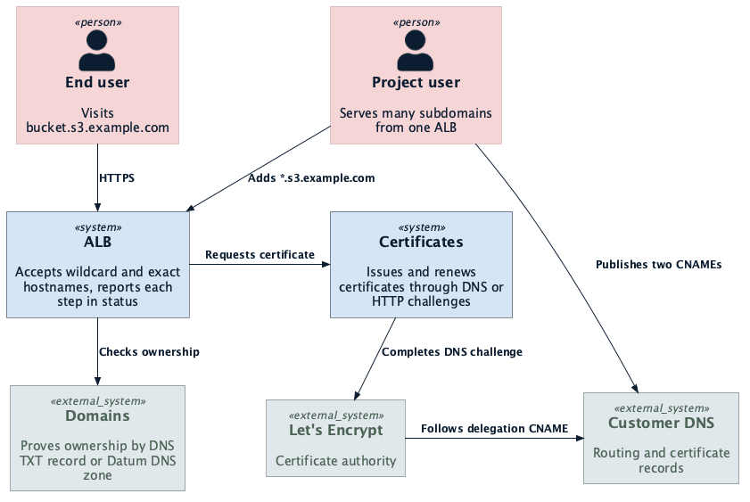
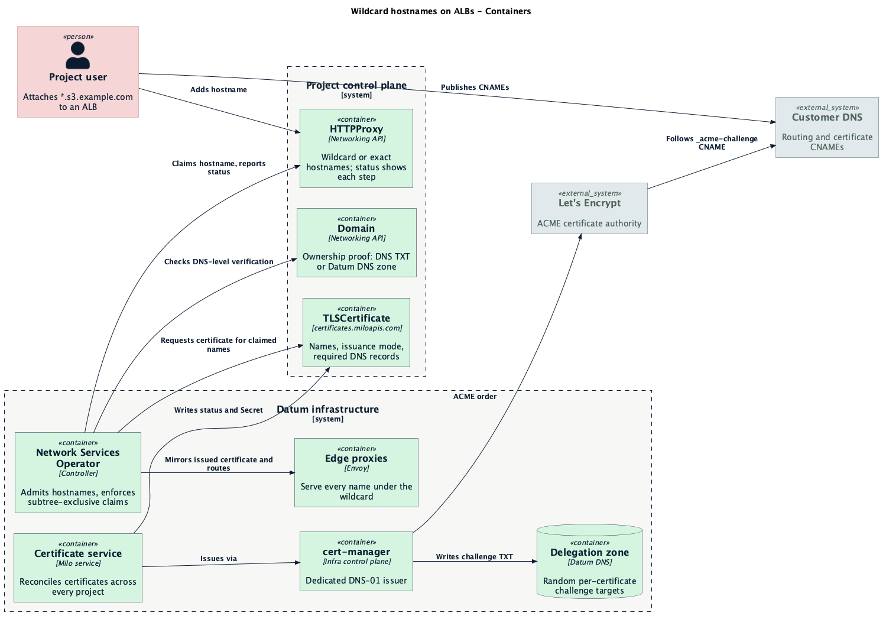

<!-- omit from toc -->
# Wildcard Hostnames on ALBs

- [Summary](#summary)
- [Motivation](#motivation)
  - [Goals](#goals)
  - [Non-Goals](#non-goals)
- [Proposal](#proposal)
  - [User Experience](#user-experience)
  - [User Stories](#user-stories)
  - [Security](#security)
  - [Certificate Issuance](#certificate-issuance)
  - [Notes/Constraints/Caveats](#notesconstraintscaveats)
  - [Risks and Mitigations](#risks-and-mitigations)
- [Design Details](#design-details)
  - [Building on the Certificate Service](#building-on-the-certificate-service)
  - [Certificate Service](#certificate-service)
  - [ALB Integration](#alb-integration)
  - [Infrastructure](#infrastructure)
  - [Rollout](#rollout)
- [Future Work](#future-work)
- [Dependencies](#dependencies)
- [Implementation History](#implementation-history)
- [Alternatives](#alternatives)
  - [Delegation Record on the Domain](#delegation-record-on-the-domain)
  - [Hash-Derived Delegation Target](#hash-derived-delegation-target)
  - [Coexistence with Most-Specific-Wins](#coexistence-with-most-specific-wins)
  - [Issue Inside the ALB Controller](#issue-inside-the-alb-controller)
  - [Solve DNS-01 in Customer Zones](#solve-dns-01-in-customer-zones)

## Summary

Wildcard hostnames let users attach a name such as `*.s3.example.com` to an ALB,
so one listener serves every name under a domain they own, with a Datum-issued
certificate. Ownership is proven at the DNS level, and a wildcard reserves its
whole subtree for the owning project. Certificates for wildcards issue through
DNS, so the name never has to point at Datum before it is ready. The same
DNS-based issuance is offered for exact hostnames, so a certificate can be in
place before traffic moves from another provider.

## Motivation

Tenant-based services need to serve many subdomains through one ALB. Today each
hostname requires a separate entry, which makes these workloads impractical.
Common scenarios include:

- **Bucket-per-subdomain storage**: An object store gives every bucket its own
  name, such as `photos.s3.example.com`. Buckets come and go by the minute; the
  ALB should not have to change with them.
- **Multi-tenant SaaS**: A SaaS product gives each customer
  `acme.app.example.com`. Onboarding a customer should be a database row, not an
  infrastructure change.
- **Zero-downtime migration**: A team moving `www.example.com` from another
  provider needs a valid certificate on Datum before traffic arrives. Today the
  certificate can only issue after the name points at Datum, which risks a
  window of broken HTTPS.

These use cases share a need for one listener that covers a whole namespace of
names, and for a certificate that does not wait on traffic.

### Goals

- Accept a wildcard as a hostname on an ALB and route every matching name to its
  backends
- Issue and renew certificates for wildcard hostnames automatically, using a DNS
  challenge the user enables with one CNAME shown in the resource status
- Offer DNS-based issuance for exact hostnames as well, so a certificate can be
  in place before traffic moves to Datum
- Reserve the subtree under a claimed wildcard for the owning project, and
  refuse a wildcard when another project already holds a name beneath it
- Require DNS-level proof of ownership for wildcard hostnames
- Show users what they are waiting on at every step: ownership, DNS delegation,
  routing record, certificate

### Non-Goals

- Bring-your-own certificates
- Multi-label wildcards such as `*.*.example.com`
- Changing how the platform's own `*.datumproxy.net` names work

## Proposal

Users add a wildcard to an ALB the same way they add any custom hostname today.
The platform checks that the project owns the domain at the DNS level, reserves
the subtree for that project, and issues a wildcard certificate through a DNS
challenge. Status on the ALB walks the user through each step until the
certificate is ready.

Certificates move out of the ALB controller into a new platform certificate
service. The ALB asks for a certificate covering the names it has claimed; the
certificate service decides how to obtain it, tells the user which DNS records
it needs, and delivers the result. The same service issues exact-hostname
certificates, so users can choose DNS-based issuance for any custom hostname.

<p align="center">
  
</p>

### User Experience

> [!NOTE]
> The exact portal UX for wildcard hostnames is still being worked through. This
> section outlines the high-level flow.

**Portal workflow:**

- **Verify the domain**: The user adds `example.com` under Domains and verifies
  it with a DNS TXT record, or hosts the zone on Datum DNS. Verification by HTTP
  token is not enough for a wildcard.
- **Add the hostname**: On the ALB, the user adds `*.s3.example.com` alongside
  any exact hostnames.
- **Publish the records**: The portal lists the records the user needs to
  publish, with a copy button for each. For a zone hosted on Datum DNS, the
  platform publishes them itself and the step completes on its own.
- **Watch progress**: The ALB shows a checklist of ownership, delegation,
  hostname claim, routing record and certificate, with the step it is waiting on
  highlighted.

**CLI experience:**

The `datumctl alb` plugin covers the same flow:

```bash
# Create the load balancer and attach the wildcard
datumctl alb create s3 --endpoint https://storage.internal.example.com
datumctl alb hostname add s3 '*.s3.example.com'

# Each custom hostname with its ownership, DNS and certificate state,
# and the records left to publish
datumctl alb describe s3

# Domain verification state
datumctl get domains
```

`hostname add` does not wait for the certificate; it returns once the hostname
is attached. `describe` is where the user watches progress: each custom hostname
carries a checklist of available, DNS and certificate status, and with this
proposal it also lists the records still to publish. For a zone hosted on Datum
DNS, the `datumctl dns` plugin manages the zone and the platform publishes the
records itself.

For the CLI to support wildcards, the plugin changes in phase 2:

- **Wildcards accepted**: The plugin applies the platform's hostname rules, so
  it rejects wildcards today and accepts them once the platform does
- **Records in `describe`**: `describe` lists the required records, including
  the certificate's delegation CNAME
- **A custom hostname like any other**: `hostname list` and `describe` show the
  wildcard alongside exact custom hostnames
- **Next steps that point at the record**: When DNS is not delegated, the hint
  names the certificate record to publish, not only `datumctl dns`

**Records to publish:**

For a zone hosted outside Datum, the user publishes:

- **Routing**: Name `*.s3.example.com`, Type `CNAME`, Value
  `<canonical>.datumproxy.net`
- **Certificate**: Name `_acme-challenge.s3.example.com`, Type `CNAME`, Value
  `<random>.<delegation zone>`
- **Ownership** (once per domain): Name `datum-custom-hostname.example.com`,
  Type `TXT`, Value the token shown on the Domain

The certificate record's value is shown in the certificate's status. It is
random per certificate and cannot be guessed from the hostname.

The goal is for a wildcard to go live within one DNS propagation of the user
publishing their records, with clear status at each step and no need to contact
support.

### User Stories

#### Attach a Wildcard

As the operator of a bucket-per-subdomain object store, I want to attach
`*.s3.example.com` to one ALB so every bucket is reachable over HTTPS. I verify
`example.com` once, add the wildcard, publish the two CNAMEs the portal shows
me, and every new bucket works without touching the ALB again.

#### Migrate a Hostname with the Certificate Ahead of Cutover

As a team moving `www.example.com` from another provider, I want a Datum
certificate in place before I move traffic. I add the hostname with DNS-based
issuance and publish only the certificate CNAME. Once the ALB reports the
certificate ready, I switch the routing record, and visitors never see a
certificate error.

#### Keep a Subtree Reserved

As the owner of `*.s3.example.com`, I want no other project to serve a name
beneath it. If another project tries to claim `login.s3.example.com`, the
platform refuses it, so my traffic cannot be taken from under my wildcard.

#### See What I'm Waiting On

As a user setting up a wildcard, I want to know exactly what is left to do. The
ALB tells me whether it is waiting on domain verification, the certificate
CNAME, the routing record, or the certificate authority, and what to publish
next.

### Security

A wildcard grants a project every name under a domain, so the bar for proving
ownership is higher than for an exact hostname.

**Ownership proof.** A wildcard requires the domain for its base, or a parent of
it, to be verified by a DNS TXT record or by hosting the zone on Datum DNS. Both
prove control of the zone itself. Verification by HTTP token does not qualify.
Serving a token from one host under the wildcard, such as a bucket whose owner
controls its content, is exactly what an attacker has, and it proves nothing
about the rest of the subtree.

**Subtree reservation.** Hostname claims are unique across the platform and
become subtree-aware:

- A wildcard claim reserves every name beneath it, at any depth
- A later claim from another project for a name under the wildcard is refused
- A wildcard is refused while other projects hold names beneath it, and the
  refusal names them

Exclusivity matters because the edge prefers an exact match over a wildcard. If
another project could claim `login.s3.example.com`, it would silently take that
traffic from the wildcard owner.

Domain verification is not cross-project exclusive today: two projects can
verify the same domain. Subtree-exclusive claims make that acceptable for this
feature, because only one project can hold a given subtree.

<<[UNRESOLVED cross-project domain verification]>>
Should Domain verification become cross-project exclusive, rather than relying
on subtree-exclusive hostname claims?
<<[/UNRESOLVED]>>

**Who can write certificates.** Users can read their certificates and the
records they need, but only platform identities can change certificate status.
The certificate service rebuilds status from the request and its own state on
every pass, so a forged status cannot steer issuance.

<<[UNRESOLVED wildcard entitlement]>>
Should wildcards be a per-project entitlement rather than available to every
project?
<<[/UNRESOLVED]>>

### Certificate Issuance

Users choose how a certificate is issued. The choice is a trade-off between
setup and timing:

- **HTTP-01 (today's default)**: The certificate authority fetches a token over
  HTTP from the hostname. No extra DNS record is needed, but the hostname must
  already point at Datum, and it cannot cover a wildcard.
- **DNS-01**: The certificate authority checks a TXT record under the hostname.
  It covers wildcards and issues before traffic moves, at the cost of one extra
  CNAME.
- **Auto**: The platform picks DNS-01 for wildcards and HTTP-01 otherwise.

Pick DNS-01 for any wildcard, and for any exact hostname that is serving traffic
elsewhere and must not see a gap. HTTP-01 remains the simplest choice for a
brand-new hostname.

**The delegation CNAME.** Users never give Datum write access to their DNS.
Instead they publish one CNAME from `_acme-challenge.<base>` to a name in a
Datum-run delegation zone, and the platform answers challenges there. The target
is random per certificate, not derived from the hostname. A predictable target
would be the same for every project asking for the same name, letting a second
project complete the challenge and obtain the first project's certificate.

**Renewal.** The CNAME stays in place, so renewals complete without user action.
The certificate's status shows its expiry and next renewal time.

<<[UNRESOLVED default issuance]>>
Once DNS-based issuance is stable, should it replace HTTP-01 as the default for
all custom hostnames?
<<[/UNRESOLVED]>>

### Notes/Constraints/Caveats

- **Single-label wildcards only**: `*.s3.example.com` is accepted;
  `*.*.example.com` is not.
- **One label of coverage**: A wildcard certificate covers one label.
  `a.b.s3.example.com` routes through the wildcard but is not covered by its
  certificate. AWS behaves the same way.
- **Name limit**: A certificate covers at most 8 names.
- **Platform names unchanged**: `*.datumproxy.net` names keep their shared
  platform certificate.

### Risks and Mitigations

| Risk | Mitigation |
|------|------------|
| Another project hijacks a name under a wildcard | Subtree-exclusive claims refuse it |
| Wildcard granted on weak proof | Only DNS TXT or Datum DNS zones qualify |
| Another project obtains the certificate | Random, project-bound delegation targets |
| Tenant forges status to steer issuance | Status rebuilt every pass; platform-only writers |
| Shared Let's Encrypt rate limits | Limits are per registered domain; monitor and alert on issuance failures |
| Wildcard keys exposed at the edge | Same distribution path as existing custom-hostname certificates |
| Stale ownership after a domain changes hands | Tracked as future work: re-verification and claim expiry |

## Design Details

This section covers the technical architecture and implementation approach.

<p align="center">
  
</p>

### Building on the Certificate Service

Rather than growing certificate handling inside the ALB controller, wildcard
hostnames build on a new Milo certificate service. Certificates are a
provider-agnostic foundation in the same way billing, DNS and IPAM are: many
services need them, and none should own them.

This approach:

- **Separates concerns**: The ALB controller decides which names a project may
  serve; the certificate service decides how to prove them to a certificate
  authority
- **Keeps the interface narrow**: For HTTP-01 the contract is "the certificate
  service publishes the challenge in status; the ALB serves it"
- **Leaves room to grow**: A certificate resource is the natural home for
  bring-your-own certificates later
- **Serves other services**: Any future service that terminates TLS can request
  a certificate the same way

Domains may move into Milo later for the same reason.

### Certificate Service

The certificate service, `milo-os/certificates`, serves `TLSCertificate` in
`certificates.miloapis.com`. A certificate lives in the project, next to the ALB
that requested it:

```yaml
apiVersion: certificates.miloapis.com/v1alpha1
kind: TLSCertificate
metadata:
  name: s3
spec:
  dnsNames:
    - "*.s3.example.com"
  issuance: DNS01
  secretName: s3-tls
status:
  issuance: DNS01
  delegationTarget: k3f9q2x7.acme-dns.staging.env.datum.net
  requiredDNSRecords:
    - name: _acme-challenge.s3.example.com
      type: CNAME
      content: k3f9q2x7.acme-dns.staging.env.datum.net
      purpose: Certificate
  secretRef:
    name: s3-tls
  notAfter: "2027-01-01T00:00:00Z"
  renewalTime: "2026-12-02T00:00:00Z"
  conditions:
    - type: Accepted
      status: "True"
    - type: DNSDelegationReady
      status: "True"
    - type: Issuing
      status: "False"
    - type: Ready
      status: "True"
```

The service reconciles certificates across every project control plane through
Milo's multicluster runtime:

1. **Accepts** the request and picks the issuance mode
2. **Waits** for the delegation CNAME to resolve before placing any order, so a
   missing record never burns a rate-limited attempt
3. **Issues** through cert-manager on the infra control plane
4. **Delivers** the issued Secret into the project, and keeps a service-side
   copy that platform components distribute

The service does not verify ownership. Callers request only names they have
already verified and claimed.

This model provides:

- **Status users can trust**: Status is rebuilt from the request and service
  state on every reconcile, and a webhook limits writers to platform identities
- **Clear next steps**: The required records and conditions say exactly what the
  user must do
- **Quota protection**: No order is placed until DNS is ready

### ALB Integration

The Network Services Operator consumes the certificate service behind a feature
flag. With the flag on, it:

- Creates a certificate per claimed listener instead of issuing one itself
- Serves HTTP-01 challenges only for hostnames it has claimed
- Mirrors the issued certificate to edges from the service-side copy
- Maps certificate conditions onto ALB status

Hostname claims become subtree-aware as described under Security, and wildcards
are admitted only on DNS-level verification. Enabling the flag does not reissue
certificates already in place, and platform `*.datumproxy.net` names are
unchanged.

### Infrastructure

- **Dedicated issuer**: A DNS-01 issuer that can write only the platform
  delegation zone. Staging uses `acme-dns.staging.env.datum.net` and the Let's
  Encrypt staging endpoint.
- **DNS writer identity**: A dedicated identity for that zone, separate from any
  other DNS credentials.
- **Denylist**: The service refuses to issue for platform domains.

### Rollout

1. **Certificate service**: The service, its staging deployment, and ALB
   consumption behind the flag. In flight: milo-os/certificates#1 and #2,
   datum-cloud/infra#6622 and #6624, datum-cloud/network-services-operator#526.
2. **Wildcards**: Wildcard admission, subtree-exclusive claims, DNS-only
   verification for wildcards, zero-touch records for Datum DNS zones, required
   records in the portal, and the datumctl alb plugin surfacing required
   records.
3. **Production**: Production enablement, after the Milo authorizer's
   subresource fix lands.

## Future Work

The first release focuses on single-label wildcards with platform-issued
certificates. Future phases will expand on it based on customer feedback:

**Verification:**

- **Cross-project exclusive domains**: Allow only one project to verify a given
  domain
- **Re-verification and claim expiry**: Recheck ownership periodically and
  release claims when it lapses, so a domain that changes hands does not keep
  its old claims

**Certificates:**

- **Bring-your-own certificates**: Upload a certificate on the same resource
- **DNS-01 as the default**: Issue every custom hostname through DNS once it is
  proven stable
- **Multi-label wildcards**: Revisit if customers need coverage deeper than one
  label

**Platform:**

- **Domains in Milo**: Move Domains alongside the certificate service
- **Portal and CLI records**: Show required records, with copy buttons in the
  portal and in `datumctl alb describe`

## Dependencies

Wildcard hostnames build on other platform services:

- **Network Services Operator**: Admits hostnames, enforces claims, and serves
  certificates at the edge.
- **Domains**: Records which domains a project has verified, and how.
- **Datum DNS**: Hosts the delegation zone and, for zones on Datum, publishes
  the user's records automatically.
- **cert-manager**: Places and renews orders with the certificate authority.
- **datumctl alb plugin**: The CLI for load balancers; shows hostname and
  certificate state and the records to publish.
- **Milo multicluster runtime**: Lets the certificate service reconcile every
  project control plane.
- **Milo authorizer subresource fix**: Stops tenants from writing certificate
  status; required before production.

## Implementation History

- 2026-10-01: Provisional proposal.

## Alternatives

### Delegation Record on the Domain

Publish the challenge delegation once per verified Domain instead of per
certificate.

**Rejected because:** The record is keyed on the wildcard base, such as
`_acme-challenge.s3.example.com`. The Domain cannot know that base before a
hostname is requested.

### Hash-Derived Delegation Target

Derive the delegation target from a hash of the hostname.

**Rejected because:** The target would be identical across projects. A second
project asking for the same name would complete the challenge through the first
project's record and obtain its certificate.

### Coexistence with Most-Specific-Wins

Let other projects claim exact names under a wildcard, with the exact name
taking precedence.

**Rejected because:** The edge prefers an exact match, so another project could
hijack the wildcard owner's traffic by claiming one name.

### Issue Inside the ALB Controller

Keep issuing certificates from the ALB controller and add DNS-01 there.

**Rejected because:** It ties certificates to one consumer, leaves no home for
bring-your-own certificates, and makes every future TLS-terminating service
rebuild the same flow.

### Solve DNS-01 in Customer Zones

Write challenge records directly into customer zones hosted on Datum DNS.

**Rejected because:** It needs platform-wide write credentials across customer
zones. The delegation zone keeps the issuer's reach to one zone the platform
owns.
