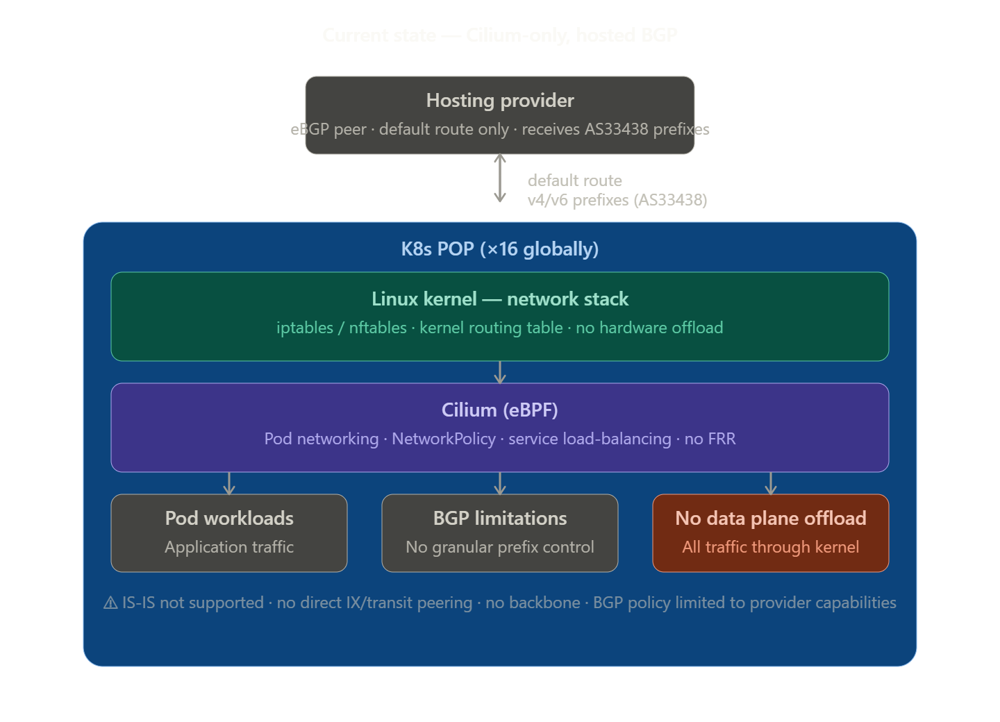
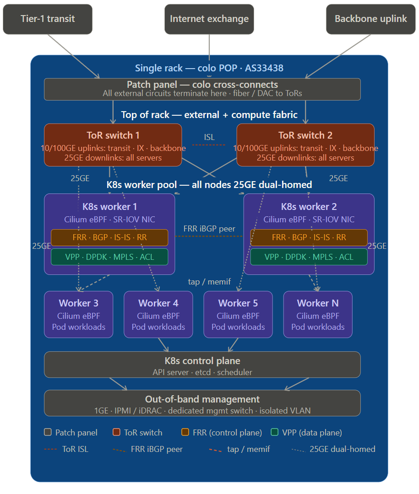
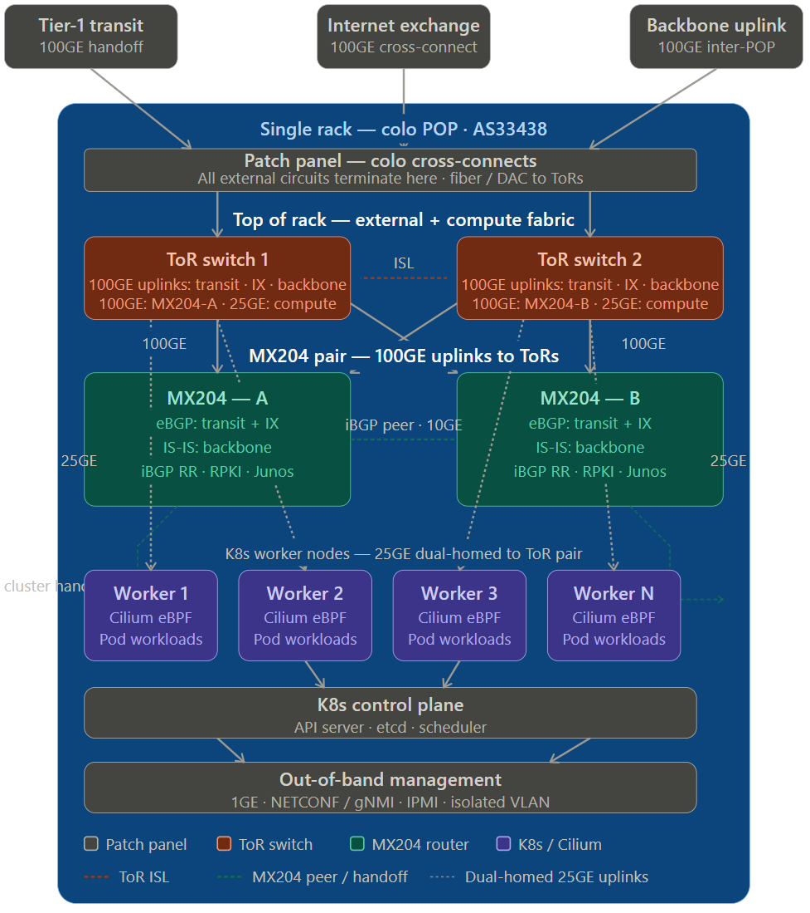

# Purpose

Datum operates a global anycast network upon which it provides a variety of connectivity services to its customers. Performance and optimization of the global anycast cone is of utmost importance as customers have the expectation to reach Datum's network at the closest geographical Point of Presence (PoP) with minimal latency. The global internet fabric can be a difficult environment to achieve this due to the constantly changing nature of the public network. For Datum to be successful in scaling its platform, it must enhance the edge routing architecture with capabilities to more effectively manage all connected network services.

This document outlines gaps in the current architecture, identifies key requirements, and proposes design solutions for future deployments and/or retrofits. We have completed a full assessment on the Current Architecture (CA), reviewed all known requirements, and lab tested numerous solutions. The result of this effort is two target architecture designs both of which solve near term requirements and scale. The second of the two designs also solves concerns with future scale and operational supportability. There is room here for a third design using smart nics, but it was descoped as the needed hardware was not available for testing and validation. Designs presented here have been tested/validated as part of this project and/or previous operational deployment.

## Current Architecture

The current architecture consists of sixteen PoPs hosted in a single provider's cloud. Each PoP is comprised of a VM based K8s cluster with three control nodes and two worker nodes. Each worker node uses Cilium to manage all pod networking to include BGP peering and route announcement with the hosting provider's routers. The Cilium only based implementation lacks key functionality and scale.

### Routing Detail

- Dual stack v4/v6 eBGP peering with provider (Netactuate AS36236)
- Receive default routes only and advertise anycast prefixes consistently in all 16 PoPs
- No informational or traffic engineering communities attached
- NetActuate fully provides and controls anycast traffic engineering

### Cilium Limitations

- Not built or meant for Internet scale edge routing
- Limited and overly complex functionality for TE and community tagging
- No support for other needed protocols i.e. IS-IS

## Target Architecture 1 (TA1): FRR/VPP

The first design builds on the current Cilium based architecture while solving the identified gaps in scale and needed feature support. This is accomplished by integrating FRR as the external network control plane and VPP as data plane. The BGP functions move to FRR while Cilium remains to manage pod networking. Although this design is intended for bare metal implementation in colocation, it is worthy to note it could be implemented in part or whole in other environments (i.e. hosted bare metal or VMs).

### Added Functionality and Benefits

- Granular route policy, traffic engineering, and informational BGP community tagging
- Reduces host induced latency and near line rate forwarding capable
- Full Internet route table route programming
- Backbone and interconnection ready

### Gaps and Weaknesses

- Open source routing and data plane stack no vendor support and may lack maturity in some features
- Near line rate forwarding highly depends on specific hardware, drivers, and tuning
- External routing and forwarding functions shared with other workloads
- Granular route policy using route-maps (FRR) is tedious and less flexible than other platforms like Junos which are purpose built for this

### Colocation Architecture Deployment Detail

This design is intended for deployment in a single rack in colocation space. The rack deployment consists of 2 top of rack switches (TOR) with 48x25Gbe and 6x100Gbe interfaces and at least 3 servers with 2x25Gbe interfaces. The TOR switches will be configured as a High Availability (HA) pair and perform only layer two functions needed to provide network services between the cluster nodes and to connect the edge routing nodes to external circuits. External circuits will be connected to the TOR switches in the most redundant way possible. Likewise, all servers will be homed to both TOR switches ensuring survivability during switch failure or maintenance.

## Target Architecture 2 (TA2): Dedicated Routers

Like TA1, TA2 also solves all of the identified gaps from the current architecture. The difference is that it also addresses the identified gaps and weaknesses from TA1. The key change is moving the external edge routing and forwarding functions from FRR/VPP to dedicated routers (preferably Juniper). The routers will be dual homed to the TORs in the same manner as the servers and connectivity to the external circuits managed by the TOR switches. All other deployment details and connection from TA1 apply to TA2. This design could be implemented on colocation deployment or as an upgrade to a TA1 deployment.

### Added Functionality and Benefits

- Core routing stack/hardware mature and vendor supportable
- Purpose built service provider grade route policy controls
- Larger talent pool for operating and maintaining the routing stack
- Clear separation between infrastructure network services and platform services

