## Summary

This document explores various network services and capabilities which Datum may
offer, covers at a high level Datum VPC Networks, and enumerates a number of
connectivity approaches that may be taken to connect networks together.

## Motivation

### Goals

- Enumerate networking use cases and traffic paths.
- Define expectations on Datum Network connectivity.
- Define one or more additional enhancements to drive feature development.
- Determine initial expectations to be placed on infrastructure providers.

### Non-Goals

- Defining implementation details of network context infrastructure providers or
  how they might integrate with Datum APIs.

## Glossary

TODO(jreese) fill out glossary

## Edge Services

### Datum Edge

Requirements:

- Client facing Anycast IP architecture for client connectivity
- IPs for connectivity to endpoints defined with public addresses.
- Ability to connect to endpoints contained within Datum VPC Networks, which may
  be enabled via various interconnect techniques.
- Direct server return (DSR) from Layer 7 infrastructure.

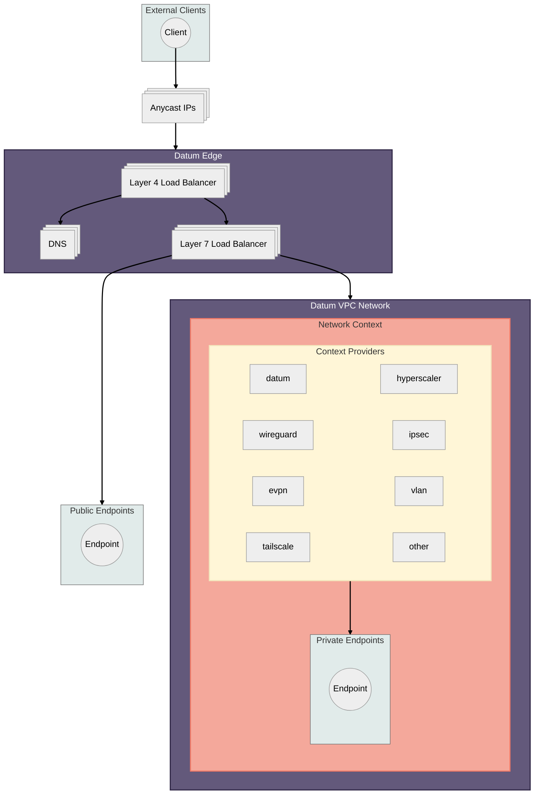

### Layer 4 Load Balancer with Layer 7 Direct Server Return

A layer 4 load balancer operates at the transport layer of the [OSI Model][osi],
leveraging information such as source/destination IP addresses, and
source/destination ports, to steer traffic to upstream systems.  A load balancer
implementation may proxy connections, establishing its own set of connections
to upstream systems. In this mode, all response traffic must pass through the
load balancer, placing scaling pressure on the system. A common method to avoid
this pressure is to leverage Direct Server Return (DSR), where response traffic
is sent directly from upstream services through the network, bypassing the load
balancer.

[osi]: https://en.wikipedia.org/wiki/OSI_model

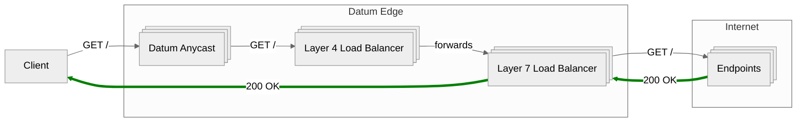

A layer 4 load balancer may also implement advanced traffic distribution
mechanisms such as [Maglev Consistent Hashing][maglev], which can help address
lumpy traffic distribution challenges presented in the datacenter when [ECMP]
is used by downstream network devices. In addition, Maglev allows for the
addition and removal of load balancer replicas with minimal impact to existing
connections, greatly improving operational complexity.

In addition to consistent hashing capabilities, a load balancer may support
weighted traffic distribution which can be adjusted on the fly to allow for
either draining or ramping up of traffic on an individual upstream server basis.

#### Additional Reading

- [High Availability Load Balancers with Maglev](https://blog.cloudflare.com/high-availability-load-balancers-with-maglev/)
- [Introducing the GitHub Load Balancer](https://github.blog/engineering/introducing-glb/)
- [Hashing on broken assumptions](https://archive.nanog.org/sites/default/files/1_Saino_Hashing_On_Broken_Assumptions.pdf)

[maglev]: https://research.google/pubs/maglev-a-fast-and-reliable-software-network-load-balancer/
[ecmp]:https://en.wikipedia.org/wiki/Equal-cost_multi-path_routing

### Layer 7 Proxy to public endpoints

Requirements:

- Endpoints are accessible over the public internet from Datum's IP ranges.

Benefits:

- Not dependent on vendor interconnect features.

Drawbacks:

- Each individual endpoint must be issued a public IP address.

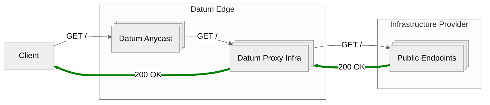

### Layer 7 proxy to endpoints within Datum VPC Network

<!-- TODO(jreese) Expand on:

- How proxies are represented within the VPC network. Some options are:
  - "Proxy subnets" - subnets allocated in VPC specifically for Datum's use in
    proxy connectivity. Benefit being flexibility in allowing the user to define
    their desired subnet range.
  - Static range -->

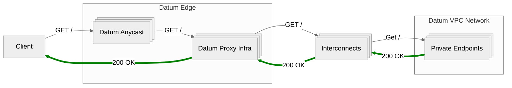

## Datum VPC Networks

A Datum VPC Network is composed of one or more network contexts. The data plane
for each network context may vary between infrastructure providers, with each
requiring unique connectivity approaches.

Each network context may exchange routing and endpoint information with a cloud
router, enabling connectivity across data planes.

## Datum Cloud Router

A cloud router will be needed to orchestrate exchange of routes and endpoints,
as well as ensuring the various data planes are programmed.

Requirements:

- Must be distributed, no single point of failure or hub and spoke movement of
  data.
- Must be capable of deploying tunnel endpoints where necessary.

> Note: The providers in the following diagrams are demonstrational, and may not
> be implemented.

### Cloud Router Control Plane

The diagram below demonstrates an example Datum VPC network composed of three
network contexts. Each network context is enabled via different providers, which
each exchange routing and endpoint information with the Cloud Router control
plane. See the [Route Exchange](#route-exchange) and
[Endpoint Exchange](#endpoint-exchange) sections for more thoughts on this
topic.

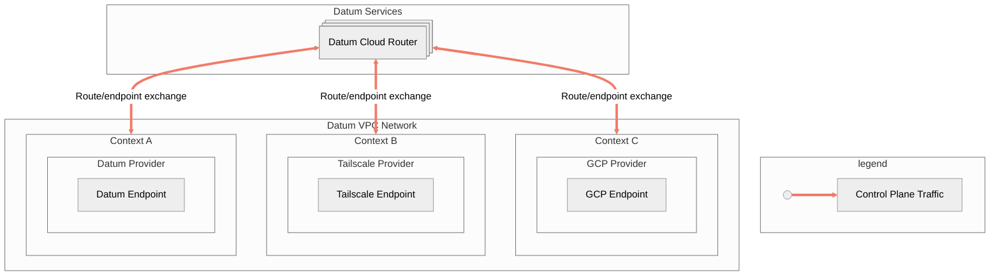

### Cloud Router Data Plane

The diagram below demonstrates how network contexts may interconnect with the
Cloud Router through [many different methods](#connectivity-approaches). Data
plane components will be geographically distributed,
with [traffic steering capabilities](#traffic-policies) that can be leveraged
to optimize traffic or restrict which paths a packet may take.

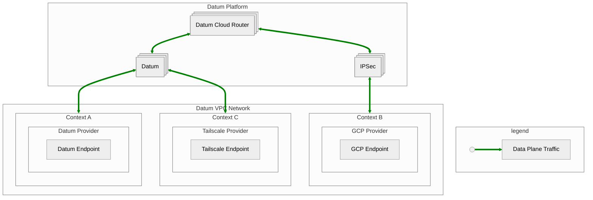

### Route Exchange

Routes must be exchanged between individual network contexts in order to enable
connectivity across them. A single network may be composed of network
contexts which have differing infrastructure providers, placing a requirement
on individual providers to integrate with the Cloud Router.

Route exchange methods:

- [BGP] - Major cloud providers as well as many network overlays support
  exchanging routes via BGP.
- Introduction of a `Route` into the Datum Networking APIs to enable policy
  based routing.

[bgp]: https://en.wikipedia.org/wiki/Border_Gateway_Protocol

### Endpoint Exchange

In addition to exchanging routes, it is advantageous to also exchange endpoints.
An endpoint represents a single address in the VPC network, which may be
associated with an instance, service, gateway, or other resources. Each endpoint
may be decorated with additional information such as the zone which it exists in,
and the condition of the endpoint.

Endpoint exchange methods:

- Integration with DNS discovery features available in various providers.
- The [EndpointSlice] type available in the Kubernetes API is currently the API
type which Datum is planning to leverage for storing endpoint information.

Input on additional or alternative approaches to exchanging endpoint information
is very welcome!

[EndpointSlice]: https://kubernetes.io/docs/concepts/services-networking/endpoint-slices/

### Interconnect Negotiation

Network contexts may be accessible via an assortment of technologies which a
cloud router must be able to integrate with. In order to reduce the burden of
establishing connections across network contexts, orchestration software should
be written to automate these connections as much as possible.

Integration with a hyperscale cloud provider would require, at minimum:

- Requesting an IPSec tunnel endpoint from Datum.
- Creating Cloud HA VPN resources in GCP, connecting them to the IPSec tunnel.
- Exchanging routes as desired.
- Propagation of Endpoint information to the cloud router.

Integration with an overlay network such as Tailscale or NetBird may need to:

- Deploy a Datum Agent with access to the overlay network, for example, as a
  sidecar to tailscaled.
- Configure the agent to connect to the desired Datum VPC network.
- Ensure routes are exchanged as desired.
- Propagate Endpoint information to the cloud router.

TODO(jreese) fill in thoughts on orchestration of circuits / cross connects / etc

### Traffic Policies

Traffic policies enable users to control how packets traverse the network. Some
policies may be for cost concerns, while others may be to restrict which paths
may be taken for data control and compliance needs.

#### Hot vs cold potato routing

From Wikipedia's page on [Hot-potato routing][hot-potato-routing]:

> In Internet routing between autonomous systems which are interconnected in
> multiple locations, **hot-potato routing** is the practice of passing traffic
> off to another autonomous system as quickly as possible, thus using their
> network for wide-area transit. **Cold-potato routing** is the opposite, where
> the originating autonomous system internally forwards the packet until it is
> as near to the destination as possible.

[hot-potato-routing]: https://en.wikipedia.org/wiki/Hot-potato_routing

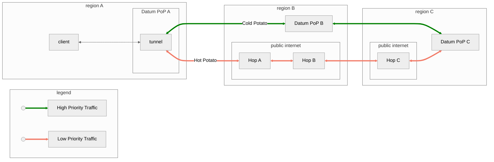

#### Path restriction

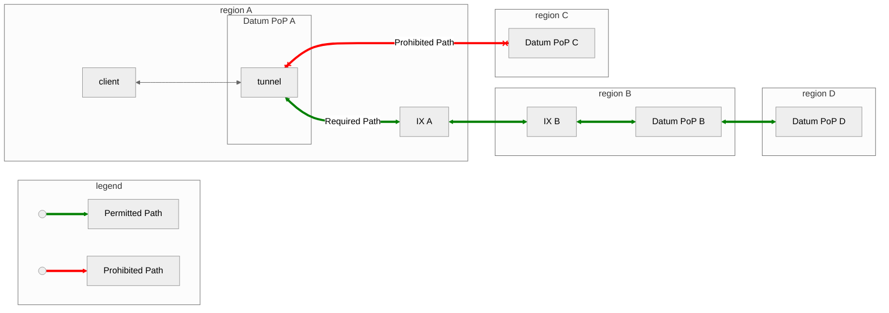

## Connectivity Approaches

> Note: An additional deployment model exists for agents where they are
> colocated with an application, either on the same node or in the same network
> namespace. In this model, dependencies on influencing provider networking
> routes are removed, but a requirement to expose methods of integration with
> applications is added. This integration could take various forms, such as the
> insertions of routes into the application's network namespace, exposing
> forward proxies, etc. The requirement for each agent to have public
> connectivity remains, which could lead to increased costs.

### Agent-managed tunnel

Requirements:

- Agent has the ability to establish external connections.
- Agent must be able to produce packets on the provider network with a source
  address not bound to the agent's machine.
- Routes must be configured in the provider network or individual endpoints to
  direct traffic destined to subnets in the Datum VPC Network via an agent.

Benefits:

- Not dependent on vendor interconnect features.
- Advertised subnets accessible from peer network contexts.
- Agents can be geographically distributed.
- Individual agent tunnel throughput may scale with agent resource footprint.
- Potential for autoscaling agents.

Drawbacks:

- Must run infrastructure for one or more agents.
- Provider must permit disabling source IP checks on individual instances or
  network interfaces.
- Provider must support either injection of routes or permit instances to
  leverage layer 2 next hop to transit traffic via an agent tunnel.

#### Request flow

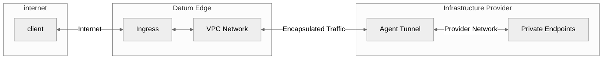

#### Tools

- Tailscale (as a Subnet Router)
- Datum Agent

### Agent-managed tunnel with ingress masquerading

Requirements:

- Agent has the ability to establish external connections.

Benefits:

- Not dependent on vendor interconnect features.
- Does not require extending the provider network into the Datum Network.
- Agent does not need to be able to produce packets with source addresses that
  do not match those assigned to the instance.
- No additional routes need to be inserted into the provider network.
- Agents can be geographically distributed.
- Individual agent tunnel throughput can scale with agent resource footprint.
- Potential for autoscaling agents.

Drawbacks:

- Must run infrastructure for one or more agents.
- Loss of client IP information when not using the PROXY protocol.
- Cannot access endpoints within the provider network via the addresses those
  endpoints are configured with.
- Private endpoints cannot establish connections to endpoints behind proxy.
- Added complexity in endpoint discovery, requiring either some form of NAT, or
  specific registration of endpoints.

#### Request flow

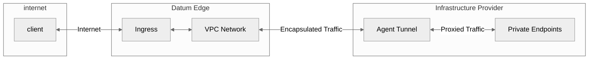

#### Tools

- Tailscale
- Datum Agent

### Agent-managed tunnel with egress proxy enabled

Requirements:

- Agent has the ability to establish external connections.
- Agent exposes a SOCKS5 and/or HTTP proxy endpoint.

Benefits:

- Not dependent on vendor interconnect features.
- Does not require extending the provider network into the Datum Network.
- Does not require any changes to the provider network.
- Endpoints can individually choose to use the proxy or not.
- Endpoints can access entire Datum VPC Network, and egress to the internet, if
  permitted by policies.

Drawbacks:

- Must run infrastructure for one or more agents.

#### Request flow

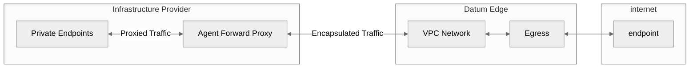

### Platform Specific IPsec Tunnels

Requirements:

- Infrastructure provider created to orchestrate tunnels.
- Routes must be configured in the provider network or individual endpoints to
  direct traffic destined to subnets in the Datum VPC Network via the tunnel.

Benefits:

- Ability to leverage vendor specific capabilities.
- Entire advertised subnets accessible from Datum VPC Network.
- Tunnels can be geographically distributed.

Drawbacks:

- Individual tunnel performance may be limited, requiring multiple tunnels to
  meet throughput needs.
- Individual tunnels may result in static costs.

#### Request flow

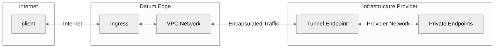
