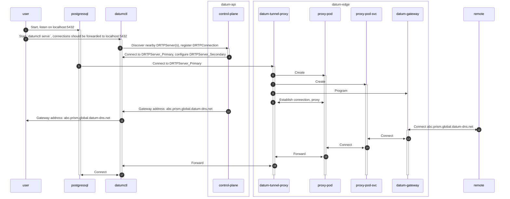

<!--
Inspired by https://github.com/kubernetes/enhancements/tree/master/keps/NNNN-kep-template

Goals are aligned in principle with those described at https://github.com/kubernetes/enhancements/blob/master/keps/sig-architecture/0000-kep-process/README.md

Recommended reading:
  - https://developers.google.com/tech-writing
-->

<!--
**Note:** When your Enhancement is complete, all of these comment blocks should be removed.

To get started with this template:

- [ ] **Make a copy of this template directory.**
  Copy this template into the desired path and name it `short-descriptive-title`.
- [ ] **Fill out this file as best you can.**
  At minimum, you should fill in the "Summary" and "Motivation" sections.
  These should be easy if you've preflighted the idea of the Enhancement with the
  appropriate stakeholders.
- [ ] **Create a PR for this Enhancement.**
  Assign it to stakeholders who are sponsoring this process.
- [ ] **Merge early and iterate.**
  Avoid getting hung up on specific details and instead aim to get the goals of
  the Enhancement clarified and merged quickly. The best way to do this is to just
  start with the high-level sections and fill out details incrementally in
  subsequent PRs.

Just because a Enhancement is merged does not mean it is complete or approved. Any Enhancement
marked as `provisional` is a working document and subject to change. You can
denote sections that are under active debate as follows:

```
<<[UNRESOLVED optional short context or usernames ]>>
Stuff that is being argued.
<<[/UNRESOLVED]>>
```

When editing RFCs, aim for tightly-scoped, single-topic PRs to keep discussions
focused. If you disagree with what is already in a document, open a new PR
with suggested changes.

One Enhancement corresponds to one "feature" or "enhancement" for its whole lifecycle.
You do not need a new Enhancement to move from beta to GA, for example. If
new details emerge that belong in the Enhancement, edit the Enhancement. Once a feature has
become "implemented", major changes should get new RFCs.

The canonical place for the latest set of instructions (and the likely source
of this file) is [here](/docs/rfcs/template/README.md).

**Note:** Any PRs to move a Enhancement to `implementable`, or significant changes once
it is marked `implementable`, must be approved by each of the Enhancement approvers.
If none of those approvers are still appropriate, then changes to that list
should be approved by the remaining approvers and/or the owning SIG (or
SIG Architecture for cross-cutting RFCs).
-->

# Datum Reverse Tunnel Proxy Service (DRTP)

<!--
This is the title of your Enhancement. Keep it short, simple, and descriptive. A good
title can help communicate what the Enhancement is and should be considered as part of
any review.
-->

<!--
A table of contents is helpful for quickly jumping to sections of a Enhancement and for
highlighting any additional information provided beyond the standard Enhancement
template.
-->

- [Summary](#summary)
- [Motivation](#motivation)
  - [Goals](#goals)
  - [Non-Goals](#non-goals)
- [Proposal](#proposal)
  - [User Stories (Optional)](#user-stories-optional)
- [User Experience](#user-experience)
  - [SelectStar and SQL Databases](#selectstar-and-sql-databases)
  - [Notes/Constraints/Caveats (Optional)](#notesconstraintscaveats-optional)
  - [Risks and Mitigations](#risks-and-mitigations)
- [Benefits](#benefits)
- [Observability Opportunities](#observability-opportunities)
- [Future Opportunities](#future-opportunities)
- [Technical Considerations](#technical-considerations)
- [Design Details](#design-details)
  - [State Diagram](#state-diagram)
  - [Assumptions](#assumptions)
  - [Establishing DRTPServer Availability (Rathole Server)](#establishing-drtpserver-availability-rathole-server)
  - [Registering a DRTPConnection (DatumCTL + Rathole Client)](#registering-a-drtpconnection-datumctl--rathole-client)
  - [Adding an Envoy Gateway](#adding-an-envoy-gateway)
  - [Access Control Lists (ACLs)](#access-control-lists-acls)
  - [Future Thoughts on App to App Connections](#future-thoughts-on-app-to-app-connections)
- [Production Readiness Review Questionnaire](#production-readiness-review-questionnaire)
  - [Feature Enablement and Rollback](#feature-enablement-and-rollback)
  - [Rollout, Upgrade and Rollback Planning](#rollout-upgrade-and-rollback-planning)
  - [Monitoring Requirements](#monitoring-requirements)
  - [Dependencies](#dependencies)
  - [Scalability](#scalability)
  - [Troubleshooting](#troubleshooting)
- [Implementation History](#implementation-history)
- [Drawbacks](#drawbacks)
- [Alternatives](#alternatives)
- [Infrastructure Needed (Optional)](#infrastructure-needed-optional)

## Summary

<!--
This section is incredibly important for producing high-quality, user-focused
documentation such as release notes or a development roadmap. It should be
possible to collect this information before implementation begins, in order to
avoid requiring implementors to split their attention between writing release
notes and implementing the feature itself. Enhancement editors should help to ensure
that the tone and content of the `Summary` section is useful for a wide audience.

A good summary is probably at least a paragraph in length.

Both in this section and below, follow the guidelines of the [documentation
style guide]. In particular, wrap lines to a reasonable length, to make it
easier for reviewers to cite specific portions, and to minimize diff churn on
updates.

[documentation style guide]: https://github.com/kubernetes/community/blob/master/contributors/guide/style-guide.md
-->

An “ngrok” Capability for the Datum Cloud.

DRTP provides a reverse tunnel, reverse proxy service for Datum users. The chief
capability of the DRTP service is to give a user (or a machine) a means to
create an inside to outside "socket" for a service, which exposes that "socket"
for use on the public Internet.

Inspired by our friends at SelectStar, Datum Reverse Tunnel Proxy (DRTP) is
built upon learnings from our April 10/11, 2025 AI Hackathon Projects
(particularly the MCP server registry).

See the [ngrok website](https://ngrok.com/use-cases/site-to-site-connectivity)
for a comparison.

## Motivation

<!--
This section is for explicitly listing the motivation, goals, and non-goals of
this Enhancement.  Describe why the change is important and the benefits to users.
-->

Data and services are often restricted from public internet access by NAT and/or
by network policy (ACLs and firewalls). However, outbound internet access is
commonly available without any policy restriction. Modern Zero Trust approaches
mandate a "no open ports" policy.

These restrictions can trap data, services, and developer productivity from
reaching their full potential, as these systems are "trapped" behind such
network policies. It can lead to obscure usage of VPNs, Reverse SSH tunnels or
other shadow IT resources. All of these approaches introduce unneeded complexity
and security risk to the environment.

At Datum, we want to create a safe and supported method for creating reverse
tunnels that help expose services to the Internet, driven with clear user intent
and secure network policy.

### Goals

<!--
List the specific goals of the Enhancement. What is it trying to achieve? How will we
know that this has succeeded?
-->

- Define a repeatable L4-L7 network topology that can be used by developers to
  create "inside-out" tunnels that expose local services to the Internet.
- Define a user experience built around `datumctl serve` -  an existing tool in
  our toolchain that we expect will be comfortable for developers and devops.
- Define a set of K8s APIs and related CRDs for the provisioning and
  de-provisioning of the service.
- Define a set of clients and service daemons (rathole, frp, etc) used for
  actual tunnel creation, and integrate into `datumctl` and Datum Cloud.
- Produce appropriate technology bindings allowing for integration with Datum
  Gateways (Envoy).

### Non-Goals

<!--
What is out of scope for this Enhancement? Listing non-goals helps to focus discussion
and make progress.
-->

- We are not providing L2 or L3 services with DRT, this is scoped to Galactic
  VPC.
- We are not optimizing routing or paths in this iteration.

## Proposal

<!--
This is where we get down to the specifics of what the proposal actually is.
This should have enough detail that reviewers can understand exactly what
you're proposing, but should not include things like API designs or
implementation. What is the desired outcome and how do we measure success?.
The "Design Details" section below is for the real
nitty-gritty.
-->

Datum Reverse Tunnel Proxy (DRTP) is the solution. DTRP has the following
components:

- DRTP Service Definition: Defining a DTRP requires the following pieces of
  data:
  - Local Application Name/Type/Hostname/IP/Port
    - Example: PostgresSQL/TCP/sqlserver.corp.com/5432  (Reference this data as
      $SERVICE_DETAIL below.)
  - Edge Allowlist CIDRs: One or more CIDRs defining permitted clients.

- `datumctl serve`: An extension to `datumctl` that provides the client side of
  the DTRP connection.
  - DRTP connects to Datum Cloud on start, presenting its $SERVICE_DETAIL to
    unlock a bootstrapping API call to connect the Local Application
    Name/Type/Hostname/IP/Port and 2x nearby Datum Cloud POPs to connect to.
  - Authentication and authorization is handled by existing workflows in
    `datumctl`.
  - Uses `rathole-client` to make the connection to the $SERVICE_DETAIL and
    initiate the inside-to-outside reversed tunnel.

- rathole-server (or similar): Running in Datum Cloud POPs, is a daemon
  responsible for accepting inbound connections from `datumctl servce`, and
  turning them into reverse tunneled connections. Once established, we believe
  that these connections will be available on Datum PodCIDRs.

- Datum Gateway: Our standard Datum Edge Reverse Proxy Service (Gateway API)
  configured with a TCPRoute/HTTPRoute and an EndpointSlice pointing at the
  PodCIDR of the appropriate rathole-servers.

Once configured and deployed, using `datumctl serve` means that a local daemon,
say NGINX on localhost:8080, can be made available on the global internet, via
Datum Gateways. A remote user should be able to be given a Datum Gateway FQDN
(and possibly a port number), to access the NGINX server running locally.

### User Stories (Optional)

<!--
Detail the things that people will be able to do if this Enhancement is implemented.
Include as much detail as possible so that people can understand the "how" of
the system. The goal here is to make this feel real for users without getting
bogged down.
-->

## User Experience

### SelectStar and SQL Databases

SelectStar [states](https://docs.selectstar.com/integrations/private-network):
“For customers hosting data sources on private networks, such AWS VPC, or
on-premises, our platform supports several secure and flexible integration
methods.” As you read through this document, they offer solutions using AWS
Network Load Balancers, AWS PrivateLink, a hand configured SSH bastion host, or
a hand configured Reverse Tunnel. All methods require assistance from their
technical support team.

Instead of engaging the technical support team:

- User Joe defines a DRTP service in the Portal/API. Joe provides a Service
  Name, Protocol (TCP or UDP), Local Hostname/IP Address, and Local Port Number.
  He is pointing at the data source he wants to expose to SelectStar.
- Datum Cloud responds with a $SERVICE_DETAIL and $SECRET, plus a link to
  download datumctl, and configuration instructions.
- This also causes Datum Cloud to start up a Rathole Server in 2x Datum POPs,
  designed to accept an inbound Rathole Client connection, and to expose an
  endpoint on the Datum PodCIDR network.

- User Joe does something like: `datumctl serve –service $SERVICE –secret
$SECRET`

- This causes `datumctl serve` to start, to connect to Datum Cloud, presenting
  its $SERVICE and $SECRET, to download a configuration file. It self configures
  with two or three connections to diverse Datum Cloud POPs where the DRTP
  server is running for upstream connectivity. At this point, the local firewall
  has been punched with an outbound connection. Simultaneously, `datumctl serve`
  also makes an outbound connection to the local hostname/IP/Port to connect to
  the service desired to expose.

- User Joe defines a Datum Gateway service, indicating that the DRTP service is
  the desired backend. Joe needs to provide a desired external port number, and
  MAY specify an IP whitelist for client connections.
  - This causes a Gateway to be created, with EndpointSlices pointing to the 3x
    PodCIDRs where Rathole Server is running. The FDQN for the Gateway is
    returned to Joe for use.

- User Joe is now able to connect his client to his assigned
  “prism.global.datum-dns.net” FQDN on the port number he requested. In the case
  of SelectStar, he can provide them with the FDQN to reach the data source in
  question.

#### Sam the Developer (Alternative UX)

- User Sam does something like: `datumctl serve localhost:8080`

- This causes `datumctl serve` to start, to connect to Datum Cloud, presenting
  credentials from Sam's logged in `datumctl` instance to Datum Cloud. It self
  configures with two or three connections to diverse Datum Cloud POPs where the
  DRTP server is running for upstream connectivity. At this point, the local
  firewall has been punched with an outbound connection. Simultaneously,
  `datumctl serve` also makes an outbound connection to the local
  hostname/IP/Port to connect to the service desired to expose.

- User Sam logs into Datum Cloud to observe that his connection is ready, and
  enables it for remote access.

- User Sam defines a Datum Gateway service, indicating that the DRTP service is
  the desired backend. Sam needs to provide a desired external port number, and
  MAY specify an IP whitelist for client connections.
  - This causes a Gateway to be created, with EndpointSlices pointing to the 3x
    PodCIDRs where Rathole Server is running. The FDQN for the Gateway is
    returned to Joe for use.

- User Sam is now able to connect his client to his assigned
  “prism.global.datum-dns.net” FQDN on the port number he requested. In the case
  of SelectStar, he can provide them with the FDQN to reach the data source in
  question.

[**See Mermaid Diagram**](drtp-state-diagram.md)

### Notes/Constraints/Caveats (Optional)

<!--
What are the caveats to the proposal?
What are some important details that didn't come across above?
Go in to as much detail as necessary here.
This might be a good place to talk about core concepts and how they relate.
-->

### Risks and Mitigations

<!--
What are the risks of this proposal, and how do we mitigate? Think broadly.
For example, consider both security and how this will impact the larger
software ecosystem.

How will security be reviewed, and by whom?

How will UX be reviewed, and by whom?

Consider including folks who also work outside of your immediate team.
-->

There is risk of binaries which implement client side functionality getting
marked as malware / unwanted software. We can mitigate this by having the
`serve` sub command implemented as a plugin, similar to a kubectl plugin. This
would mean we'd distribute a `datumctl-serve` binary as well, and have a simple
way to enable it. The UX of `datumctl serve` would remain the same, it'd just
add an extra step in an effort to keep `datumctl` itself at less of a risk.

Notes from other providers on this issue:

- <https://ngrok.com/docs/faq/#is-ngrok-a-virus>
- <https://tailscale.com/kb/1477/av-flagging>
- <https://github.com/fatedier/frp/issues/1204>
- <https://github.com/yujqiao/rathole/issues/397>

## Benefits

- A lightweight method to connect to Datum that isn’t network based (like
  Wireguard). This allows for tightly scoped access control, and reduces the
  risk of lateral movement through a network.

## Observability Opportunities

A number of observability opportunities arise from this configuration:

- Status of `datumctl serve`, including outbound connection to the data source,
  connection to Datum POPs, latency, packet loss, jitter to data source and
  Datum POPs, etc.
- Status of the Gateway, including inbound connection count, source IP
  addresses, etc.
- Request Tracing \- The system is configured with additional parameters, so
  that “headers” are wrapped onto the request at Gateway ingress, traced to to
  the Datum POP Rathole Server, down the tunnel, and stripped by datum-nsd for
  end to end path viewing.

## Future Opportunities

Scenario \#1: It may be the case that a Datum customer doesn’t want this service
exposed to the Internet at all. In this scenario, it may be desirable to have
`datumctl connect` act as a “forward proxy” on the client side, exposing the
service internally, and then connecting upstream to the Datum Edge. In this
case, no connections are allowed onto the Datum Gateway Service. Datum is now
acting as a virtual “patch panel” for two instances of `datumctl serve` and
`datumctl connect` with Datum Cloud in the middle as a virtual patch panel.

## Technical Considerations

The following technical considerations have been identified at the time of
writing:

- This document makes reference to Rathole Server and Rathole Client. Security
  and encryption audits of Rathole have yet to be analyzed or completed. Only
  functional testing has been performed.

## Design Details

<!--
This section should contain enough information that the specifics of your
change are understandable. This may include API specs (though not always
required) or even code snippets. If there's any ambiguity about HOW your
proposal will be implemented, this is the place to discuss them.
-->

### State Diagram

The diagram below attempts to capture critical interactions in the DRTP system.



### Assumptions

- Datum Gateway has TCPRoute and HTTPRoute routes enabled in Envoy.

### Establishing DRTPServer Availability (Rathole Server)

- Suggest the use of a `DaemonSet` to deploy the Rathole Server daemon across
  the Datum Fleet.
- Each instance of Rathole Server should self-register with a K8s API server
  that enables service discovery. Important details include:
  - Server Latitude and Longitude (Could be defined statically using our
    topology knowledge, or based upon IP geolocation information) - to be used
    to determine the best Datum POP for a `datumctl serve` client to connect to.
  - Server WAN IP Address - the IP address for `datumctl serve` to connect to.
  - Server Instance Name - Bare Metal Host + container pod identifier for
    debugging.

```yaml
apiVersion: datumapis.com/v1alpha
kind: DRTPServer
metadata:
  name: worker-001-nyc-ac/instance-xyz
  latititude: 40.7128° N
  longitude: 74.0060° W
  server_ip: 199.38.181.25
status:
  health: 100
```

`datumctl` will be able to query an API to discover nearby `DRTPServers`. See
"Registering a DRTPConnection (DatumCTL + Rathole Client)" below.

### Registering a DRTPConnection (DatumCTL + Rathole Client)

By knowing our available DRTPServer nodes, by our K8s API "registry", we can now
use `datumctl serve` to create a connection.

- User identifies his/her local service to present via `datumctl serve`.
- `datumctl serve` connects to Datum control plane API to register the requested
  connection. The request includes $SERVICE_DETAIL
  (PostgresSQL/TCP/sqlserver.corp.com/5432), plus the client's detected WAN IP.
- The API service takes multiple actions:
  - Hand back an array of DRTPServer objects to be used for `datumctl serve` to
    configure Rathole Client.
  - Register a `DRTPConnection` object in the control-plane, designed to
    configure Rathole Server on the appropriate `DRTPServer` instance.
- The results of this API call are then used to configure and start Rathole
  Client via `datumctl serve`.

```yaml
apiVersion: datumapis.com/v1alpha
kind: DRTPConnection
metadata:
  DRTPServer_Primary: # ref to a DRTPServer
  DRTPServer_Secondary: # ref to a 2nd DRTPServer
  DRTPServer_ACL: # ref to an Access Control List for the Service
status:
  DRTPServer_Primary:
    programmingStatus: 'programmed'
    clientStatus: 'connected'
    podCIDR: 10.10.10.10
    podCIDRPort: 58721
  DRTPServer_Secondary:
    programmingStatus: 'init'
    clientStatus: 'waiting'
    podCIDR:
    podCIDRPort:
```

### Adding an Envoy Gateway

With a `DRTPConnection` object available and healthy, we can program an Envoy
Gateway for global access to the DRTP connection.

#### Gateway

Program a gateway and claim a hostname for use. For this example, use a TCPRoute
to get us back to the PostgresSQL instance run by the user.

**NOTE: For TCPRoute based workloads, we will not be able to use SNI for
connection identification. Therefore, we will need a way to vend IP addresses
and port numbers associated to Gateways.**

```yaml
apiVersion: gateway.networking.k8s.io/v1
kind: Gateway
metadata:
  name: drtp-gateway
spec:
  gatewayClassName: datum-external-global-proxy
  listeners:
  - name: drtp-gateway
    protocol: TCP
    port: 54321
    allowedRoutes:
      kinds:
      - kind: TCPRoute
```

#### TCP Route Example

```yaml
apiVersion: gateway.networking.k8s.io/v1
kind: TCPRoute
metadata:
  name: drtp-route
spec:
  parentRefs:
  - name: drtp-gateway
    kind: Gateway
  rules:
      backendRefs:
      - group: discovery.k8s.io
        kind: EndpointSlice
        name: DRTPServer_Primary
        port: 58721

```

#### EndpointSlices

For this Gateway, the EndpointSlices point back to the DRTPServer_Primary and
DRTPServer_Secondary objects.

**Note: If the DRTPConnection object exposes a K8s service we can reference
directly from a route, then an EndpointSlice may not be necessary at all.
Seeking expert input here.

```yaml
kind: EndpointSlice
metadata:
  name: DRTPServer_Primary
addressType: IPv4
apiVersion: discovery.k8s.io/v1
endpoints:
- addresses:
  - # podCIDR here
  conditions:
    ready: true
    serving: true
    terminating: false
ports:
- name: PostsqlSQL
  appProtocol: TCP
  port: 58721
---
kind: EndpointSlice
metadata:
  name: DRTPServer_Secondary
addressType: IPv4
apiVersion: discovery.k8s.io/v1
endpoints:
- addresses:
  - #
  conditions:
    ready: false
    serving: false
    terminating: false
ports:
- name: PostgresSQL
  appProtocol: TCP
  port: 58721
```

### Access Control Lists (ACLs)

An important feature of DRTP, is to support the use of ACLs to provide policy
controlling access to the service exposed via DRTP. ACLs should be able to be
placed upon the `podCIDR` endpoints used for the DRTPConnection itself (the
Rathole Server) as well as the resulting `Gateway` object.

Example: It may be a case where a user wants to expose a PostgresSQL DB via
DRTP, but not to the world. An ACL will be used to help control that.

### Future Thoughts on App to App Connections

On our roadmap, we have the concept of "App to App Connections." DRTP can be the
basis for 25% of an App to App Connection. Looking forward:

- The first quarter of an App to App Connection is a `DRTPConnection` - this
  effectively gets a service onto an "inside-out" tunnel to the Datum
  infrastructure.
- The next quarter of an App to App Connection is a mechanism to securely
  initiate a connection from a client (in our PostgresSQL oriented example, say,
  Tableau Analytics) but without needing to have a priori knowledge of IPs /
  ports for an ACL. Imagine the command `datumctl connect` which: 1) Makes an
  outbound connection to Datum's Infratructure; 2) presents the remote
  PostgresSQL on `localhost:5432`. Magic wormhole!
- The next quarter of an App to App Connection is the "optimized virtual cross
  connect" - this requires a "software based letter of authorization" (e.g.
  authentication / policy), middle mile route optimization across the Datum
  backbone, and fast path failover. Network policy in Galactic VPC can be used
  to pick fast pass, low loss paths, or FEC enabled paths.
- The last quarter of an App to App Connection is the visibility of what is
  effectively a "socket across the Internet". Imagine being able to see the
  serving node telemetry (from the `datumctl serve` side) to the serving POP
  (the Rathole Server), to the middle mile network, to the client (the `datumctl
  connect` side)?!!!

## Production Readiness Review Questionnaire

<!--

Production readiness reviews are intended to ensure that features are observable,
scalable and supportable; can be safely operated in production environments, and
can be disabled or rolled back in the event they cause increased failures in
production.

See more in the PRR Enhancement at https://git.k8s.io/enhancements/keps/sig-architecture/1194-prod-readiness.

The production readiness review questionnaire must be completed and approved
for the Enhancement to move to `implementable` status and be included in the release.
-->

### Feature Enablement and Rollback

<!--
This section must be completed when targeting alpha to a release.
-->

#### How can this feature be enabled / disabled in a live cluster?

<!--
Pick one of these and delete the rest.
-->

- [ ] Feature gate
  - Feature gate name:
  - Components depending on the feature gate:
- [ ] Other
  - Describe the mechanism:
  - Will enabling / disabling the feature require downtime of the control plane?
  - Will enabling / disabling the feature require downtime or reprovisioning of
    a node?

#### Does enabling the feature change any default behavior?

<!--
Any change of default behavior may be surprising to users or break existing
automations, so be extremely careful here.
-->

#### Can the feature be disabled once it has been enabled (i.e. can we roll back the enablement)?

<!--
Describe the consequences on existing workloads (e.g., if this is a runtime
feature, can it break the existing applications?).

Feature gates are typically disabled by setting the flag to `false` and
restarting the component. No other changes should be necessary to disable the
feature.
-->

#### What happens if we reenable the feature if it was previously rolled back?

#### Are there any tests for feature enablement/disablement?

### Rollout, Upgrade and Rollback Planning

<!--
This section must be completed when targeting beta to a release.
-->

#### How can a rollout or rollback fail? Can it impact already running workloads?

<!--
Try to be as paranoid as possible - e.g., what if some components will restart
mid-rollout?

Be sure to consider highly-available clusters, where, for example,
feature flags will be enabled on some servers and not others during the
rollout. Similarly, consider large clusters and how enablement/disablement
will rollout across nodes.
-->

#### What specific metrics should inform a rollback?

<!--
What signals should users be paying attention to when the feature is young
that might indicate a serious problem?
-->

#### Were upgrade and rollback tested? Was the upgrade->downgrade->upgrade path tested?

<!--
Describe manual testing that was done and the outcomes.
Longer term, we may want to require automated upgrade/rollback tests, but we
are missing a bunch of machinery and tooling and can't do that now.
-->

#### Is the rollout accompanied by any deprecations and/or removals of features, APIs, fields of API types, flags, etc.?

<!--
Even if applying deprecation policies, they may still surprise some users.
-->

### Monitoring Requirements

<!--
This section must be completed when targeting beta to a release.

For GA, this section is required: approvers should be able to confirm the
previous answers based on experience in the field.
-->

#### How can an operator determine if the feature is in use by workloads?

<!--
Ideally, this should be a metric. Operations against the API (e.g., checking if
there are objects with field X set) may be a last resort. Avoid logs or events
for this purpose.
-->

#### How can someone using this feature know that it is working for their instance?

<!--
For instance, if this is an instance-related feature, it should be possible to
determine if the feature is functioning properly for each individual instance.
Pick one more of these and delete the rest.
Please describe all items visible to end users below with sufficient detail so
that they can verify correct enablement and operation of this feature.
Recall that end users cannot usually observe component logs or access metrics.
-->

- [ ] Events
  - Event Reason:
- [ ] API .status
  - Condition name:
  - Other field:
- [ ] Other (treat as last resort)
  - Details:

#### What are the reasonable SLOs (Service Level Objectives) for the enhancement?

<!--
This is your opportunity to define what "normal" quality of service looks like
for a feature.

It's impossible to provide comprehensive guidance, but at the very
high level (needs more precise definitions) those may be things like:
  - per-day percentage of API calls finishing with 5XX errors <= 1%
  - 99% percentile over day of absolute value from (job creation time minus expected
    job creation time) for cron job <= 10%
  - 99.9% of /health requests per day finish with 200 code

These goals will help you determine what you need to measure (SLIs) in the next
question.
-->

#### What are the SLIs (Service Level Indicators) an operator can use to determine the health of the service?

<!--
Pick one more of these and delete the rest.
-->

- [ ] Metrics
  - Metric name:
  - [Optional] Aggregation method:
  - Components exposing the metric:
- [ ] Other (treat as last resort)
  - Details:

#### Are there any missing metrics that would be useful to have to improve observability of this feature?

<!--
Describe the metrics themselves and the reasons why they weren't added (e.g., cost,
implementation difficulties, etc.).
-->

### Dependencies

<!--
This section must be completed when targeting beta to a release.
-->

#### Does this feature depend on any specific services running in the cluster?

<!--
Think about both cluster-level services (e.g. metrics-server) as well
as node-level agents (e.g. specific version of CRI). Focus on external or
optional services that are needed. For example, if this feature depends on
a cloud provider API, or upon an external software-defined storage or network
control plane.

For each of these, fill in the following—thinking about running existing user workloads
and creating new ones, as well as about cluster-level services (e.g. DNS):
  - [Dependency name]
    - Usage description:
      - Impact of its outage on the feature:
      - Impact of its degraded performance or high-error rates on the feature:
-->

### Scalability

<!--
For alpha, this section is encouraged: reviewers should consider these questions
and attempt to answer them.

For beta, this section is required: reviewers must answer these questions.

For GA, this section is required: approvers should be able to confirm the
previous answers based on experience in the field.
-->

#### Will enabling / using this feature result in any new API calls?

<!--
Describe them, providing:
  - API call type (e.g. PATCH workloads)
  - estimated throughput
  - originating component(s) (e.g. Workload, Network, Controllers)
Focusing mostly on:
  - components listing and/or watching resources they didn't before
  - API calls that may be triggered by changes of some resources
    (e.g. update of object X triggers new updates of object Y)
  - periodic API calls to reconcile state (e.g. periodic fetching state,
    heartbeats, leader election, etc.)
-->

#### Will enabling / using this feature result in introducing new API types?

<!--
Describe them, providing:
  - API type
  - Supported number of objects per cluster
  - Supported number of objects per namespace (for namespace-scoped objects)
-->

#### Will enabling / using this feature result in any new calls to the cloud provider?

<!--
Describe them, providing:
  - Which API(s):
  - Estimated increase:
-->

#### Will enabling / using this feature result in increasing size or count of the existing API objects?

<!--
Describe them, providing:
  - API type(s):
  - Estimated increase in size: (e.g., new annotation of size 32B)
  - Estimated amount of new objects: (e.g., new Object X for every existing Pod)
-->

#### Will enabling / using this feature result in increasing time taken by any operations covered by existing SLIs/SLOs?

<!--
Look at the [existing SLIs/SLOs].

Think about adding additional work or introducing new steps in between
(e.g. need to do X to start a container), etc. Please describe the details.

[existing SLIs/SLOs]: https://git.k8s.io/community/sig-scalability/slos/slos.md#kubernetes-slisslos
-->

#### Will enabling / using this feature result in non-negligible increase of resource usage in any components?

<!--
Things to keep in mind include: additional in-memory state, additional
non-trivial computations, excessive access to disks (including increased log
volume), significant amount of data sent and/or received over network, etc.
This through this both in small and large cases, again with respect to the
[supported limits].

[supported limits]: https://git.k8s.io/community//sig-scalability/configs-and-limits/thresholds.md
-->

#### Can enabling / using this feature result in resource exhaustion of some node resources (PIDs, sockets, inodes, etc.)?

<!--
Focus not just on happy cases, but primarily on more pathological cases.

Are there any tests that were run/should be run to understand performance
characteristics better and validate the declared limits?
-->

### Troubleshooting

<!--
This section must be completed when targeting beta to a release.

For GA, this section is required: approvers should be able to confirm the
previous answers based on experience in the field.

The Troubleshooting section currently serves the `Playbook` role. We may consider
splitting it into a dedicated `Playbook` document (potentially with some monitoring
details). For now, we leave it here.
-->

#### How does this feature react if the API server is unavailable?

#### What are other known failure modes?

<!--
For each of them, fill in the following information by copying the below template:
  - [Failure mode brief description]
    - Detection: How can it be detected via metrics? Stated another way:
      how can an operator troubleshoot without logging into a master or worker node?
    - Mitigations: What can be done to stop the bleeding, especially for already
      running user workloads?
    - Diagnostics: What are the useful log messages and their required logging
      levels that could help debug the issue?
      Not required until feature graduated to beta.
    - Testing: Are there any tests for failure mode? If not, describe why.
-->

#### What steps should be taken if SLOs are not being met to determine the problem?

## Implementation History

<!--
Major milestones in the lifecycle of a Enhancement should be tracked in this section.
Major milestones might include:
- the `Summary` and `Motivation` sections being merged, signaling acceptance
- the `Proposal` section being merged, signaling agreement on a proposed design
- the date implementation started
- the first release where an initial version of the Enhancement was available
- the version where the Enhancement graduated to general availability
- when the Enhancement was retired or superseded
-->

## Drawbacks

<!--
Why should this Enhancement _not_ be implemented?
-->

## Alternatives

<!--
What other approaches did you consider, and why did you rule them out? These do
not need to be as detailed as the proposal, but should include enough
information to express the idea and why it was not acceptable.
-->

- Cloudflare Tunnels / WARP / BastionZero
- Ngrok
- Zrok.io (by the OpenZiti Team)
- Border0
- Teleport
- StrongDM
- NetMaker \- <https://www.netmaker.io/>
- [https://theboroer.github.io/localtunnel-www/](https://theboroer.github.io/localtunnel-www/)
- [https://pinggy.io/](https://pinggy.io/)
- [https://github.com/cmars/onionpipe](https://github.com/cmars/onionpipe)
- [https://tunnelmole.com/docs/\#installation](https://tunnelmole.com/docs/#installation)
- [Pangolin](https://github.com/fosrl/pangolin,)

## Infrastructure Needed (Optional)

<!--
Use this section if you need things from another party. Examples include a
new repos, external services, compute infrastructure.
-->
