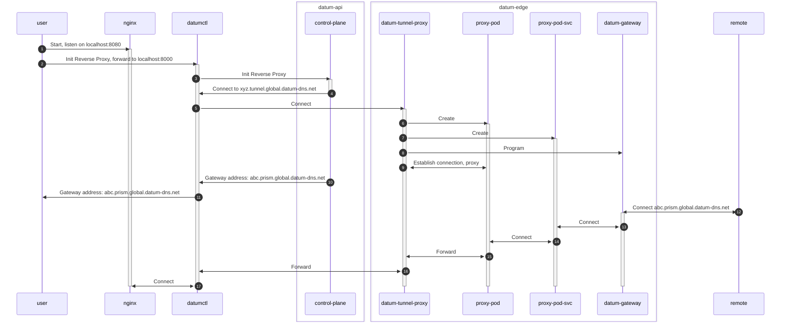

# Datum Reverse Tunnel Proxy

```mermaid
sequenceDiagram
  autonumber

  participant user
  participant nginx
  participant datumctl

  box datum-api
    participant control-plane
  end

  box datum-edge
    participant datum-tunnel-proxy
    participant proxy-pod
    participant proxy-pod-svc
    participant datum-gateway

  end

  user ->> nginx: Start, listen on localhost:8080
  activate nginx
  user ->> datumctl: Init Reverse Proxy, forward to localhost:8000
  activate datumctl
  datumctl ->> control-plane: Init Reverse Proxy
  activate control-plane
  control-plane ->> datumctl: Connect to xyz.tunnel.global.datum-dns.net
  deactivate control-plane

  datumctl ->> datum-tunnel-proxy: Connect

  activate datum-tunnel-proxy

  datum-tunnel-proxy ->> proxy-pod: Create
  activate proxy-pod
  datum-tunnel-proxy ->> proxy-pod-svc: Create
  activate proxy-pod-svc
  datum-tunnel-proxy ->> datum-gateway: Program


  datum-tunnel-proxy <<->> proxy-pod: Establish connection, proxy

  control-plane ->> datumctl: Gateway address: abc.prism.global.datum-dns.net

  datumctl ->> user: Gateway address: abc.prism.global.datum-dns.net

  remote <<->> datum-gateway: Connect abc.prism.global.datum-dns.net
  activate datum-gateway

  datum-gateway <<->> proxy-pod-svc: Connect
  proxy-pod-svc <<->> proxy-pod: Connect

  proxy-pod <<->> datum-tunnel-proxy: Forward

  datum-tunnel-proxy <<->> datumctl: Forward

  datumctl <<->> nginx: Connect


  deactivate proxy-pod-svc
  deactivate proxy-pod
  deactivate datum-tunnel-proxy
  deactivate datumctl
  deactivate nginx
  deactivate datum-gateway

```