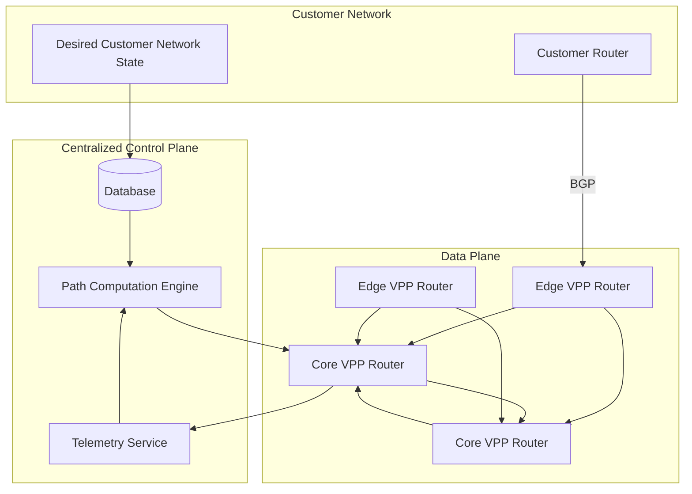

<!--
Inspired by https://github.com/kubernetes/enhancements/tree/master/keps/NNNN-kep-template

Goals are aligned in principle with those described at https://github.com/kubernetes/enhancements/blob/master/keps/sig-architecture/0000-kep-process/README.md

Recommended reading:
  - https://developers.google.com/tech-writing
-->

<!--
**Note:** When your Enhancement is complete, all of these comment blocks should be removed.

To get started with this template:

- [ ] **Make a copy of this template directory.**
  Copy this template into the desired path and name it `short-descriptive-title`.
- [ ] **Fill out this file as best you can.**
  At minimum, you should fill in the "Summary" and "Motivation" sections.
  These should be easy if you've preflighted the idea of the Enhancement with the
  appropriate stakeholders.
- [ ] **Create a PR for this Enhancement.**
  Assign it to stakeholders who are sponsoring this process.
- [ ] **Merge early and iterate.**
  Avoid getting hung up on specific details and instead aim to get the goals of
  the Enhancement clarified and merged quickly. The best way to do this is to just
  start with the high-level sections and fill out details incrementally in
  subsequent PRs.

Just because a Enhancement is merged does not mean it is complete or approved. Any Enhancement
marked as `provisional` is a working document and subject to change. You can
denote sections that are under active debate as follows:

```
<<[UNRESOLVED optional short context or usernames ]>>
Stuff that is being argued.
<<[/UNRESOLVED]>>
```

When editing RFCs, aim for tightly-scoped, single-topic PRs to keep discussions
focused. If you disagree with what is already in a document, open a new PR
with suggested changes.

One Enhancement corresponds to one "feature" or "enhancement" for its whole lifecycle.
You do not need a new Enhancement to move from beta to GA, for example. If
new details emerge that belong in the Enhancement, edit the Enhancement. Once a feature has
become "implemented", major changes should get new RFCs.

The canonical place for the latest set of instructions (and the likely source
of this file) is [here](/docs/rfcs/template/README.md).

**Note:** Any PRs to move a Enhancement to `implementable`, or significant changes once
it is marked `implementable`, must be approved by each of the Enhancement approvers.
If none of those approvers are still appropriate, then changes to that list
should be approved by the remaining approvers and/or the owning SIG (or
SIG Architecture for cross-cutting RFCs).
-->

# Galactic VPC: Datum's Backbone as a Service

<!--
This is the title of your Enhancement. Keep it short, simple, and descriptive. A good
title can help communicate what the Enhancement is and should be considered as part of
any review.
-->

<!--
A table of contents is helpful for quickly jumping to sections of a Enhancement and for
highlighting any additional information provided beyond the standard Enhancement
template.
-->

- [Summary](#summary)
- [Motivation](#motivation)
  - [Goals](#goals)
  - [Non-Goals](#non-goals)
- [Proposal](#proposal)
  - [User Stories](#user-stories)
  - [Notes/Constraints/Caveats](#notesconstraintscaveats)
  - [Risks and Mitigations](#risks-and-mitigations)
- [Design Details](#design-details)
  - [Galactic VPC Network Services](#galactic-vpc-network-services)
  - [Observability and Monitoring](#observability-and-monitoring)
  - [High Level System Architecture](#high-level-system-architecture)
  - [Multi-Tenant Architecture](#multi-tenant-architecture)
  - [Underlay Topology Discovery via Active Probing](#underlay-topology-discovery-via-active-probing)
  - [Customer Route Learning and Forwarding (BGP Integration)](#customer-route-learning-and-forwarding-bgp-integration)
  - [Overlay Network Programming a.k.a Path Computation](#overlay-network-programming-aka-path-computation)
- [Production Readiness Review Questionnaire](#production-readiness-review-questionnaire)
  - [Feature Enablement and Rollback](#feature-enablement-and-rollback)
  - [Rollout, Upgrade and Rollback Planning](#rollout-upgrade-and-rollback-planning)
  - [Monitoring Requirements](#monitoring-requirements)
  - [Dependencies](#dependencies)
  - [Scalability](#scalability)
  - [Troubleshooting](#troubleshooting)
- [Architecture Design Records (ADRs)](#architecture-design-records-adrs)
- [Implementation History](#implementation-history)
- [Drawbacks](#drawbacks)
- [Alternatives](#alternatives)
- [Infrastructure Needed](#infrastructure-needed)
- [Future Considerations](#future-considerations)

## Summary

Galactic VPC is a programmable, SLA-aware overlay network that provides
deterministic traffic routing between edge, core, and cloud environments. Built
on Segment Routing over IPv6 (SRv6), WireGuard, and high-performance VPP
routers, Galactic VPC enables centralized control of path selection, observability, and
performance optimization across distributed infrastructures.

This enhancement defines a multi-tenant network service that delivers:
- L3VPN and L2VPN services with SLA-backed performance profiles
- Multiple secure, isolated network domains per organization and project
- Deterministic routing based on performance and business requirements
- Real-time performance monitoring and path optimization
- Integration with existing routing protocols (BGP) for customer connectivity

The system is designed to serve environments where customers need
application-specific traffic steering (e.g., ultra-low latency, lossless
delivery, or high-throughput paths). All routing decisions are computed
centrally and enforced via programmable elements, enabling proactive SLA
enforcement and visibility across every link and tunnel in the system.

## Motivation

Galactic VPC transforms the telco world from a fixed, opaque network into a programmable, real-time service layer. It enables:

- **Reduced Cost of Connectivity**  
  Replace MPLS or private circuits with SLA-aware paths over internet infrastructure.

- **Policy-Driven Path Control**  
  Route traffic based on business needs: performance, compliance, or cost.

- **SLA-Based Productization**  
  Offer differentiated tiers like "low latency," "zero loss," or "geo-fenced" connectivity.

- **Multi-Cloud Reliability**  
  Optimize east-west and hybrid-cloud paths in real time.

Why Developers Love It: For developers and infrastructure engineers, Galactic
VPC behaves like "network as code":

- **Real-Time Network Observability**  
  Query latency, loss, and throughput metrics via API.

- **Declarative Control**  
  Route traffic per app or traffic class without BGP hacks.

- **A Network that Feels like Your Own**  
  You get Networking Superpowers when you are in control of your ASN, IPv4, and
  IPv6 resources but standing that up is a ton of toil. Galactic VPC makes that
  easy.

Why Executives Trust It: For technology leaders, Galactic VPC delivers agility, visibility, and control:

- **Centralized Management**  
  Enforce policy and routing from a single controller.

- **SLA Accountability**  
  Monitor compliance and route around degraded infrastructure.

- **Multi-Tenant and Secure by Design**  
  Each customer operates in an isolated data plane environment.

Galactic VPC brings the best of modern infrastructure—APIs, automation,
real-time feedback loops to network performance and delivery.

### Goals

1. **Network as Code**
   - Provide a programmable network substrate that reacts in real-time to
     network conditions
   - Enable declarative control of network paths and policies
   - Support integration with cloud-native tooling and APIs

2. **Multi-Tenant Network Services**
   - Deliver isolated L3VPN and L2VPN services
   - Enable tenant-specific network policies and constraints

3. **Performance Management**
   - Support deterministic routing with SLA guarantees
   - Support multiple traffic classes with different performance requirements
   - Monitor and optimize network paths in real-time

4. **Operational Excellence**
   - Centralize network control and visibility for both Datum Operations and Customers
   - Automate path computation and optimization
   - Provide comprehensive monitoring and troubleshooting tools

5. **Design for the Future**
  - Datum will offer compute alongside its network services for running NFV and other network related workload. Galactic VPC must provide an easy integration path to compute.
  - Datum will offer traditional connectivity to datacenters, transit providers, IXPs, and peers - we need to architect Galactic VPC with "real ports" in mind.
  - Datum will want to offer connectivity to cloud providers and NaaS, so integration paths with 3rd parties should be considered.

### Non-Goals

1. **General Purpose Internet Routing**
   - This system is not designed to replace general internet routing

2. **Legacy Network Protocol Support**
   - No support for legacy protocols beyond BGP for customer connectivity
   - No, you can't have OSPF or ISIS. This is 2025.

3. **Standards Based Design**
   - Galactic VPC is being built for Datum and our customers, which means we can 
   
   No support for legacy protocols beyond BGP for customer connectivity
   - No, you can't have OSPF or ISIS. This is 2025.


## Proposal

### User Stories

#### Story 1: Alt Cloud Service Provider
As a service provider, I want to offer differentiated network services to my
customers, with different performance tiers and SLA guarantees. My greatest
challenge is getting my customers from my compute environment to their data
environment. I want to be able to offer a service to connect my cloud offering
to existing environments in AWS and GCP, to the locations where my customer's
data is at rest, and to my customer's workforce.

**Requirements:**
- Software defined "backbone as a service"
- Multi-tenant network isolation
- Configurable SLA profiles per customer
- Connectivity to 3rd parties an API call away
- Bring the network anywhere using IPv6/SRv6

#### Story 2: Multi-Cloud Enterprise Network
As an enterprise network operator, I want to connect my on-premises network to
multiple cloud providers with guaranteed performance, so that my applications
can reliably communicate across environments.

**Requirements:**
- L3VPN service with SLA-backed performance
- Ability to define traffic classes with different performance requirements
- BGP integration for route exchange
- Real-time performance monitoring

### Notes/Constraints/Caveats

1. **Network Transport Requirements**
   - SRv6 must be supported by all core routers; core routers must be under
     Datum control.
   - Using the Internet as our underlay will restrict the MTU that can be
     offered to customers for L2 based services.

2. **Security Requirements**
   - All tenant traffic must be isolated
   - Control plane must be secured
   - Customer routes must be validated

3. **Operational Constraints**
   - Centralized controller must be highly available
   - Configuration changes must be atomic
   - Monitoring must be tenant-scoped
   - Alerts must be actionable

### Risks and Mitigations

1. **SRv6 and IPv6 Experience**
   - **Risk**: SRv6 Practical Experience
   - **Mitigation**: Develop simple, iterative POCs to build our muscle with SRv6
   - **Risk**: Internet Scale BCP38 Filtering
   - **Mitigation**: Develop simple, iterative POCs across NetActuate and Vultr to gain ground truth knowledge.

## Design Details

### Galactic VPC Network Services

Galactic VPC offers several network services to tenants, each with specific capabilities and performance guarantees.

#### L3VPN Service

The L3VPN service enables IP routing between Datum and customer sites with
SLA-backed performance guarantees.

- L3VPN provides termination in Datum compute nodes (NFV), Cloud Providers, Physical
  Ports, Partner Ports, and remote Edges (over Wireguard)
- L3VPN service will need to offer a routed VRF.
- L3VPN "backbone as code" should be configurable:
  - Topology: Specify "must route through" nodes, "must NOT route
    through" nodes, or just let Datum pick a path.
  - Performance: Specify attributes for performance: ultra-low latency, lossless
    delivery, or high-throughput paths, or FEC-enabled
  - IP Policy: Set policy at network boundaries using traditional ACL formats.

#### L2VPN Service

The L2VPN service provides layer 2 connectivity between customer sites with performance guarantees.

**Service to be offered; work to be scoped**

The system supports deterministic routing based on application requirements and network conditions.

#### Deterministic Topology

#### Traffic Classes

  Example traffic classes that tenants can assign a class per tenant:
  - Best Effort for Lowest Cost: Prefer the path that is the lowest cost through the network.
  - Lowest latency: Prefer the lowest latency path through the network.
  - Zero packet loss: Prefer the path that has no packet loss.
  - Lossless with FEC: Prefer the path that has no packet loss, adding Forward Error Correction, at the expense of overhead for FEC.
  - Sustained Bandwidth: Prefer the path with validated available bandwith (using iPerf)

#### FEC-Enabled Transport

- Traffic classes may enable FEC for proactive loss recovery
- FEC overhead is considered in bandwidth and path scoring

#### IP Access List Policy and Rate Limiting

#### Bandwidth Estimation

#### Observability and Monitoring

Galactic VPC must offer comprehensive observability features to ensure that developers, operators, and tenants can monitor network performance in real-time and over time.

- End to End Latency and Jitter
- End to End Packet Loss
- Packet Rate
- Throughput
- Available Bandwidth
- Network Topology (endpoints, hops, restrictions on hops, etc)
- Alerts on any degradation or performance SLA violation


### Observability and Monitoring

Galatic VPC includes built-in observability features to ensure that developers, operators, and tenants can monitor network performance in real-time and over time. Observability is scoped per tenant and integrates seamlessly with SLA and policy logic.

#### Core Observability Capabilities

- **Real-Time Metrics**  
  - Per-path: latency, jitter, packet loss, bandwidth (iPerf)
  - Exported via Prometheus-compatible endpoints
  - Queryable per traffic class and per node pair

- **SLA Monitoring**  
  - Automatic detection of SLA violations
  - Root-cause hints (e.g., "loss >1% on segment Core 3 → Core 7")
  - Alert hooks via webhook or API

- **Graph Views and Visualizations**  
  - Real-time graph view of active network topology per tenant
  - Segment overlays for SRv6 path inspection
  - Tunnel status and availability

- **Historical Analysis**  
  - SLA compliance reports over time
  - Visualization of path changes and churn reasons
  - Exportable telemetry logs for audits or debugging

- **APIs and Integrations**  
  - REST API for querying metrics and paths
  - Webhooks for SLA violation or path reprogram events
  - Prometheus metrics export for use in Grafana or other tools

These observability features ensure that the system remains transparent, debuggable, and trusted—critical for both developers and executives.

### High Level System Architecture

Galactic VPC relies on a system of Core Nodes, Edge Nodes, a Network Telemetry
System, and a Centralized Control Plane.

Similar to MPLS BGP VPNs, Galactic VPC is built upon a nearly state-free core
network built on SRv6 (similar in fashion to MPLS "P" routers) with a
distributed L3 cloud router using BGP at the edge (similar in fashion to MPLS
"PE" routers). Unlike MPLS BGP VPNs, routing and path information is forwarded
to a centralized controller for complete network topology computation and
control.

In this document, we will often speak of the "underlay" and the "overlay".
- Underlay: The network carrying SRv6 frames, usually on the internet, among our
  hosting providers. In Edge to Core connections, this will be the network
  carrying Wireguard encapulated frames, also over the Internet.
- Overlay: The tenant scoped L3 or L2 domain, carried in Wireguard or SRv6. This
  is the network layer that our customers can program to their requirements and
  carries their production traffic.



#### Centralized Controller / Path Computation Engine (PCE)

A centralized controller is responsible for creating and rendering all network programable state. The controller is responsible for:

- Storing desired network state from customer requirements provided via AI, MCP,
  Portal, or API.
- Ingesting network performance data from the live system to inform path
  computation services.
- Rendering network configuration out to the data plane given customer
  requirements, network policy, and current network performance.

#### Network Telemetry System

A network telemetry system is required to provide detailed measurement of the
underlay network so that Datum will know how to offer optimal paths to carry the
overlay network. The network telemetry system will help the PCE render out final
network configurations.

Key components of this system include:
- Full mesh of probes among network participants
- Data ingestion service capable of high volume telemetry submission
- Metrics and event collection
- Continuous network modeling

#### Core Nodes

- Fully meshed SRv6-enabled routing nodes, with active probing between all core nodes
- Probe types include:
  - ICMP for reachability
  - UDP/TCP/HTTP for latency, jitter, and loss similating real user traffic patterns
  - Scheduled iPerf runs for bandwidth estimation
- Core Nodes are operated on infrastructure under Datum's complete control.
- Core nodes are likely to run VPP as the data plane, with a number of agents assisting.

#### Edge Nodes

- Each edge node connects to the core via at least three WireGuard tunnels
- Edge nodes determine upstream core nodes through initial triangulation probes; they query an IP with their current WAN IP address, Datum geolocates that IP address, and hands back 6x POP IPs. ICMP probes are used to determine the 3x best performing POPs.
- A direct WireGuard tunnel between edge sites enable baseline internet path testing
- Edge nodes are the primary method of 3rd party attachment to Core Nodes.

### Multi-Tenant Architecture

Galactic VPC is designed from the ground up to support a multi-tenant operating model. Each tenant has isolated data plane resources and private performance visibility, while sharing control plane logic and core network intelligence.

#### Shared Components

- **Control Plane**  
  The centralized controller, API service, database, and ingestion pipeline are shared across all tenants. This ensures efficient use of global resources and centralized decision-making.

- **Core-to-Core Performance Data**  
  Synthetic probing data between core nodes is shared. All tenants benefit from a global view of available core paths, and this data informs baseline segment path selection.

- **Path Computation Engine**
  A shared path computation engine looks at Datum's core to core network services. The path computation engine:
  - Ingests shared core to core performance data.
  - Creates end to end deterministic routing parameters for the Datum "backbone".

#### Tenant-Isolated Components

- **Edge Probing and Measurement**  
  Edge-to-core and core-to-edge telemetry is isolated per tenant. Since edge deployments may be in overlapping or tenant-specific infrastructure, performance results are not assumed to be globally applicable.

- **Data Plane Instantiation**  
  Each tenant has their own fully isolated data plane:
  - Dedicated VRF or even dedicated routing nodes
  - Dedicated WireGuard tunnels for Edge Connectivity
  - Per-tenant SLA policy profiles

- **Routing Control Plane**
  We need to learn a tenant's L3 topology using BGP, therefore, each tenant receives an L3 control plane inside the tenant, used for route learning and advertisements.

- **Path Computation Engine**
  Each tenant receives a dedicated path computation engine. The path computation engine:
  - Ingests shared core to core performance data.
  - Ingests a tenant's edge to core and core to edge performance data.
  - Ingests a tenants routes.
  - Understands a tenants policy and SLA profiles.
  - Creates end to end deterministic routing parameters.

- **Policy and SLA Profiles**  
  Traffic classes, SLA preferences, geo-exclusions, and path scoring logic are scoped per tenant and applied independently to their network graph slice.

#### Summary of Isolation

| Component                             | Shared / Per Tenant |
|--------------------------------------|----------------------|
| Control Plane Logic (API, DB, Engine) | Shared               |
| Core-to-Core Probe Data              | Shared               |
| Core-to-Core PCE                     | Shared               |
| Edge Probe Data                      | Per Tenant           |
| WireGuard Tunnels                    | Per Tenant           |
| Routing Control Plane                | Per Tenant           |
| Path Computation Engine              | Per Tenant           |
| Policy Profiles                      | Per Tenant           |

This design ensures strong tenant isolation at the data plane and SLA level, while leveraging shared control and observability infrastructure for scalability and efficiency.

### Underlay Topology Discovery via Active Probing

The system builds a real-time model of network performance through active synthetic probing. Every node (core or edge) is registered in a centralized database instance, tagged with metadata such as location, discovered network interfaces, network interface IP addresses, and role.

#### Telemetry Creation

- Each node has an agent that runs probes and gathers telemetry
- Metrics include RTT, loss, jitter, and iPerf-based bandwidth estimation
- Core nodes probe all other core nodes
- Edge nodes probe all other related edge nodes, plus the 3x "upstream" connected POPs (via wireguard)

#### Core Nodes

- Fully meshed active probing between all core sites
- Probe types include:
  - ICMP for reachability
  - UDP/TCP/HTTP for latency, jitter, and loss simulating real user traffic patterns
  - Scheduled iPerf runs for bandwidth estimation

#### Edge Nodes

- Each edge node connects to the core via at least three WireGuard tunnels
- Edge nodes determine upstream core nodes through initial triangulation probes; they query an IP with their current WAN IP address, Datum geolocates that IP address, and hands back 6x POP IPs. ICMP probes are used to determine the 3x best performing POPs.
- A direct WireGuard tunnel between edge sites enables baseline internet path testing

#### Resultant Data Sets

- Per link latency, jitter, and packet loss (whereby a "link" is the network
  between SRv6 SIDs)
- Core to Core Shortest Path First Computations
- Edge to Core Shortest Path Selection
- Link Utilization or Estimated Link Utilization

### Customer Route Learning and Forwarding (BGP Integration)

To support dynamic route discovery from tenant networks, Galactic VPC uses BGP at the edge to learn and advertise customer L3 routes. This mechanism is used solely for reachability exchange—**not** for determining forwarding paths.

Each tenant's edge routers runs BGP on interfaces connected to the customer's network:

- Establishes BGP peering sessions with customer routers
- Learns customer prefixes (e.g., `10.0.0.0/24`)
- Advertises prefixes the overlay can reach on behalf of the tenant
- Operates within a tenant-specific ASN to enforce routing isolation
- As VPP does not provide a control plane function, we will need to evaluate a
  suitable BGP speaking daemon (examples include GoBGP, ExaBGP, FRR, Bird, etc.).

This BGP function is confined to edge nodes and is **not used** for internal core fabric routing.

### Overlay Network Programming a.k.a Path Computation

The above sections describe the data we collect for a Galactic VPC. It is
summarized as: 

- Intended network configuration including type of service, topology, traffic
  class, and policy
- Tenant segmentation
- Underlay performance metrics collected from active probing
- BGP attachments

Given this information, our most complex task is to render an end to end
configuration to deployed into nodes participating in the network.

#### Tenant Network Graph

Each overlay network will render its own network graph of nodes (core and edge
nodes), with each link identified between the nodes. In this context, a link may
be a real physical link (think of a peering port or a dedicated wave service),
or the logical network between a pair nodes via some black box underlay (think
the Internet between two SRv6 SIDs). This network graph will be used to render
the desired state of the network for the tenant, programming the state of all
routers supporting the tenant. Included in this graph are all adjacencies
learned via BGP or static routes.

#### System Link Inventory

The underlay network will also need its own graph of links (not nodes),
effectively representing an "inventory" of network elements available to a
tenant network graph.

#### Building the Tenant Network Graph

1. Filter prohibited nodes from the topology per tenant requirement
2. Using QoS profile, for all node to node link pairs, filter all links not
   meeting the requirements. E.g. For a low-latency profile, select only the
   lowest latency link. 
3. Using available links, build IGP for the tenant VRF.
4. With an IGP built, analyze the graph for any REQUIRED topology restrictions.
   Adjust the IGP accordingly (e.g. full mesh vs. hub and spoke)
5. Using available nodes, flood statics and BGP routes learned across the VRF.

If the system cannot render a valid network graph, signal an SLA violation event.

## Production Readiness Review Questionnaire

<!--

Production readiness reviews are intended to ensure that features are observable,
scalable and supportable; can be safely operated in production environments, and
can be disabled or rolled back in the event they cause increased failures in
production.

See more in the PRR Enhancement at https://git.k8s.io/enhancements/keps/sig-architecture/1194-prod-readiness.

The production readiness review questionnaire must be completed and approved
for the Enhancement to move to `implementable` status and be included in the release.
-->

### Feature Enablement and Rollback

<!--
This section must be completed when targeting alpha to a release.
-->

#### How can this feature be enabled / disabled in a live cluster?

<!--
Pick one of these and delete the rest.
-->

- [ ] Feature gate
  - Feature gate name:
  - Components depending on the feature gate:
- [ ] Other
  - Describe the mechanism:
  - Will enabling / disabling the feature require downtime of the control plane?
  - Will enabling / disabling the feature require downtime or reprovisioning of a node?

#### Does enabling the feature change any default behavior?

<!--
Any change of default behavior may be surprising to users or break existing
automations, so be extremely careful here.
-->

#### Can the feature be disabled once it has been enabled (i.e. can we roll back the enablement)?

<!--
Describe the consequences on existing workloads (e.g., if this is a runtime
feature, can it break the existing applications?).

Feature gates are typically disabled by setting the flag to `false` and
restarting the component. No other changes should be necessary to disable the
feature.
-->

#### What happens if we reenable the feature if it was previously rolled back?

#### Are there any tests for feature enablement/disablement?

### Rollout, Upgrade and Rollback Planning

<!--
This section must be completed when targeting beta to a release.
-->

#### How can a rollout or rollback fail? Can it impact already running workloads?

<!--
Try to be as paranoid as possible - e.g., what if some components will restart
mid-rollout?

Be sure to consider highly-available clusters, where, for example,
feature flags will be enabled on some servers and not others during the
rollout. Similarly, consider large clusters and how enablement/disablement
will rollout across nodes.
-->

#### What specific metrics should inform a rollback?

<!--
What signals should users be paying attention to when the feature is young
that might indicate a serious problem?
-->

#### Were upgrade and rollback tested? Was the upgrade->downgrade->upgrade path tested?

<!--
Describe manual testing that was done and the outcomes.
Longer term, we may want to require automated upgrade/rollback tests, but we
are missing a bunch of machinery and tooling and can't do that now.
-->

#### Is the rollout accompanied by any deprecations and/or removals of features, APIs, fields of API types, flags, etc.?

<!--
Even if applying deprecation policies, they may still surprise some users.
-->

### Monitoring Requirements

<!--
This section must be completed when targeting beta to a release.

For GA, this section is required: approvers should be able to confirm the
previous answers based on experience in the field.
-->

#### How can an operator determine if the feature is in use by workloads?

<!--
Ideally, this should be a metric. Operations against the API (e.g., checking if
there are objects with field X set) may be a last resort. Avoid logs or events
for this purpose.
-->

#### How can someone using this feature know that it is working for their instance?

<!--
For instance, if this is an instance-related feature, it should be possible to
determine if the feature is functioning properly for each individual instance.
Pick one more of these and delete the rest.
Please describe all items visible to end users below with sufficient detail so
that they can verify correct enablement and operation of this feature.
Recall that end users cannot usually observe component logs or access metrics.
-->

- [ ] Events
  - Event Reason:
- [ ] API .status
  - Condition name:
  - Other field:
- [ ] Other (treat as last resort)
  - Details:

#### What are the reasonable SLOs (Service Level Objectives) for the enhancement?

<!--
This is your opportunity to define what "normal" quality of service looks like
for a feature.

It's impossible to provide comprehensive guidance, but at the very
high level (needs more precise definitions) those may be things like:
  - per-day percentage of API calls finishing with 5XX errors <= 1%
  - 99% percentile over day of absolute value from (job creation time minus expected
    job creation time) for cron job <= 10%
  - 99.9% of /health requests per day finish with 200 code

These goals will help you determine what you need to measure (SLIs) in the next
question.
-->

#### What are the SLIs (Service Level Indicators) an operator can use to determine the health of the service?

<!--
Pick one more of these and delete the rest.
-->

- [ ] Metrics
  - Metric name:
  - [Optional] Aggregation method:
  - Components exposing the metric:
- [ ] Other (treat as last resort)
  - Details:

#### Are there any missing metrics that would be useful to have to improve observability of this feature?

<!--
Describe the metrics themselves and the reasons why they weren't added (e.g., cost,
implementation difficulties, etc.).
-->

### Dependencies

<!--
This section must be completed when targeting beta to a release.
-->

#### Does this feature depend on any specific services running in the cluster?

<!--
Think about both cluster-level services (e.g. metrics-server) as well
as node-level agents (e.g. specific version of CRI). Focus on external or
optional services that are needed. For example, if this feature depends on
a cloud provider API, or upon an external software-defined storage or network
control plane.

For each of these, fill in the following—thinking about running existing user workloads
and creating new ones, as well as about cluster-level services (e.g. DNS):
  - [Dependency name]
    - Usage description:
      - Impact of its outage on the feature:
      - Impact of its degraded performance or high-error rates on the feature:
-->

### Scalability

<!--
For alpha, this section is encouraged: reviewers should consider these questions
and attempt to answer them.

For beta, this section is required: reviewers must answer these questions.

For GA, this section is required: approvers should be able to confirm the
previous answers based on experience in the field.
-->

#### Will enabling / using this feature result in any new API calls?

<!--
Describe them, providing:
  - API call type (e.g. PATCH workloads)
  - estimated throughput
  - originating component(s) (e.g. Workload, Network, Controllers)
Focusing mostly on:
  - components listing and/or watching resources they didn't before
  - API calls that may be triggered by changes of some resources
    (e.g. update of object X triggers new updates of object Y)
  - periodic API calls to reconcile state (e.g. periodic fetching state,
    heartbeats, leader election, etc.)
-->

#### Will enabling / using this feature result in introducing new API types?

<!--
Describe them, providing:
  - API type
  - Supported number of objects per cluster
  - Supported number of objects per namespace (for namespace-scoped objects)
-->

#### Will enabling / using this feature result in any new calls to the cloud provider?

<!--
Describe them, providing:
  - Which API(s):
  - Estimated increase:
-->

#### Will enabling / using this feature result in increasing size or count of the existing API objects?

<!--
Describe them, providing:
  - API type(s):
  - Estimated increase in size: (e.g., new annotation of size 32B)
  - Estimated amount of new objects: (e.g., new Object X for every existing Pod)
-->

#### Will enabling / using this feature result in increasing time taken by any operations covered by existing SLIs/SLOs?

<!--
Look at the [existing SLIs/SLOs].

Think about adding additional work or introducing new steps in between
(e.g. need to do X to start a container), etc. Please describe the details.

[existing SLIs/SLOs]: https://git.k8s.io/community/sig-scalability/slos/slos.md#kubernetes-slisslos
-->

#### Will enabling / using this feature result in non-negligible increase of resource usage in any components?

<!--
Things to keep in mind include: additional in-memory state, additional
non-trivial computations, excessive access to disks (including increased log
volume), significant amount of data sent and/or received over network, etc.
This through this both in small and large cases, again with respect to the
[supported limits].

[supported limits]: https://git.k8s.io/community//sig-scalability/configs-and-limits/thresholds.md
-->

#### Can enabling / using this feature result in resource exhaustion of some node resources (PIDs, sockets, inodes, etc.)?

<!--
Focus not just on happy cases, but primarily on more pathological cases.

Are there any tests that were run/should be run to understand performance
characteristics better and validate the declared limits?
-->

### Troubleshooting

<!--
This section must be completed when targeting beta to a release.

For GA, this section is required: approvers should be able to confirm the
previous answers based on experience in the field.

The Troubleshooting section currently serves the `Playbook` role. We may consider
splitting it into a dedicated `Playbook` document (potentially with some monitoring
details). For now, we leave it here.
-->

#### How does this feature react if the API server is unavailable?

#### What are other known failure modes?

<!--
For each of them, fill in the following information by copying the below template:
  - [Failure mode brief description]
    - Detection: How can it be detected via metrics? Stated another way:
      how can an operator troubleshoot without logging into a master or worker node?
    - Mitigations: What can be done to stop the bleeding, especially for already
      running user workloads?
    - Diagnostics: What are the useful log messages and their required logging
      levels that could help debug the issue?
      Not required until feature graduated to beta.
    - Testing: Are there any tests for failure mode? If not, describe why.
-->

#### What steps should be taken if SLOs are not being met to determine the problem?

## Architecture Design Records (ADRs)

<!--
Use this section to log major architectural design decisions that we make
against the development of the enhancement. Using the ADR process outputs a
collection of architectural decision records. This creates the decision log. The
decision log creates the project context as well as an implementation and design
information log. 
ADRs might include:
- Selected components
- Selected platforms and infrastructure
- Design patterns and anti-patterns
-->

## Implementation History

<!--
Major milestones in the lifecycle of a Enhancement should be tracked in this section.
Major milestones might include:
- the `Summary` and `Motivation` sections being merged, signaling acceptance
- the `Proposal` section being merged, signaling agreement on a proposed design
- the date implementation started
- the first release where an initial version of the Enhancement was available
- the version where the Enhancement graduated to general availability
- when the Enhancement was retired or superseded
-->

## Drawbacks

<!--
Why should this Enhancement _not_ be implemented?
-->

## Alternatives

<!--
What other approaches did you consider, and why did you rule them out? These do
not need to be as detailed as the proposal, but should include enough
information to express the idea and why it was not acceptable.
-->

## Infrastructure Needed

<!--
Use this section if you need things from another party. Examples include a
new repos, external services, compute infrastructure.
-->

## Future Considerations

This document lays down a basis for a Galactic VPC - effectively a "backbone as
a service." We have envisioned the concept and initial behaviour of core nodes
and edge nodes. Future work for us to consider:

- How does traffic arrive at a Galactic VPC from a Datum Gateway (Anycast Envoy
  Proxy)?
- How can traffic egress from a Galactic VPC to the Internet (e.g. Datum CGNAT)?
- How can traffic ingress/egress from other application providers (e.g. AWS
  PrivateLink)?
- How can traffic ingress/egress from other physical networks via cross
  connects, IXPs, NNIs, or Network as a Service Providers?


