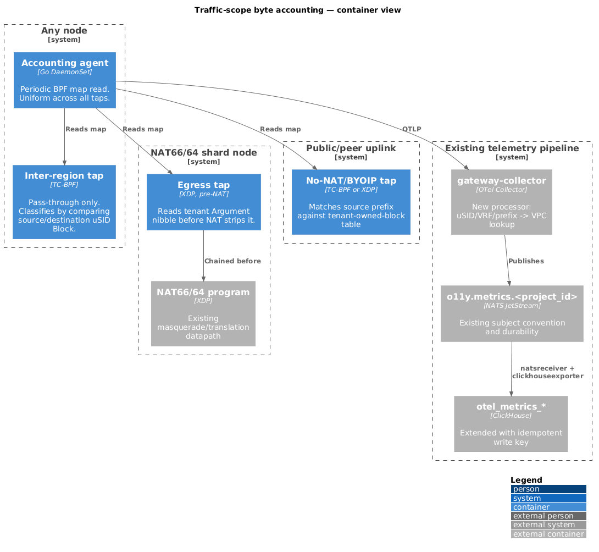

# Traffic-Scope Byte Accounting — Inter-Region and Egress

Tracking issue: [datum-cloud/enhancements#875](https://github.com/datum-cloud/enhancements/issues/875)
(research/design for [#874](https://github.com/datum-cloud/enhancements/issues/874))

## Summary

Count bytes that cross a cost boundary — Datum's inter-region backbone, and
traffic leaving to the internet or a peer — and attribute them to a VPC, so a
higher-layer system can bill for them. A Galactic VPC can span regions, so
"inter-VPC" and "inter-region" are different, orthogonal dimensions: what
costs money is crossing a region, regardless of VPC membership.

This document is scoped to collection: where a counter can observe a packet
exactly once, and how that counter reaches the existing NATS/ClickHouse
telemetry pipeline. Billing-account mapping and rate calculation are out of
scope — solved elsewhere.

## Motivation

### Goals

- Count bytes/packets for traffic that crosses a region boundary (any VPC),
  and for traffic leaving to the internet or a peer, at line rate.
- Count same-region traffic opportunistically, since the region-crossing tap
  already observes it — no dedicated attach point needed.
- Attribute counters to a VPC/VPCAttachment.
- Never affect forwarding correctness — a bug in this feature must not be
  able to drop, delay, or mutate a customer packet.
- Feed the existing `o11y.metrics.<project_id>` NATS/ClickHouse pipeline
  rather than build a parallel one.
- State an explicit SLO for edge collection, rather than leave it unstated.

### Non-Goals

- Per-flow/5-tuple visibility — aggregate counters per VPC/VPCAttachment and
  scope only, matching [#874](https://github.com/datum-cloud/enhancements/issues/874)'s own non-goal.
- Real-time metering — this feeds monthly batch billing aggregation.
- A guaranteed (non-best-effort) edge SLO on day one — see
  [SLO](#edge-collection-slo).
- Billing-account mapping and rate calculation — solved elsewhere.
- Same-region traffic completeness — counted when convenient, not held to
  the same SLO as region-crossing/egress data.

## Design Details

### Where traffic can be observed

| Traffic | Attach point | Exists today |
|---|---|---|
| Inter-region (any VPC) | `usid_ingress` (TC-BPF, receiving node) — the only hook that ever sees the destination uSID for pod-to-pod traffic; there is no hook on the sending side (kernel SRv6 lwtunnel, not eBPF) | Yes |
| Masqueraded egress (NAT66, future NAT64) | `nat66.c` (XDP) — sees the tenant Argument nibble before NAT strips it | NAT66 yes; NAT64 not yet built ([#791](https://github.com/datum-cloud/enhancements/issues/791)) |
| Globally-routable / BYOIP egress, no NAT | Nothing — no hook sees this traffic at all today | No |

`galactic-gateway`'s XDP program is unrelated to egress: it is
ingress-only DSR load balancing on gateway-role nodes only ([ARCHITECTURE-GATEWAY.md](https://github.com/datum-cloud/galactic/blob/main/docs/agents/ARCHITECTURE-GATEWAY.md)).

### Architecture

A new counting-only program at each attach point above, independent of and
never modifying the existing forwarding programs — always
`XDP_PASS`/`TC_ACT_UNSPEC`. One uniform DaemonSet agent
([Fluvia](https://github.com/nttcom/fluvia)-style:
periodic map read, no per-packet userspace involvement) reads every tap's map
the same way, regardless of hook type.

This was chosen over two alternatives:

- **Instrument the existing forwarding programs directly** (`usid_ingress`,
  `nat66.c`) — rejected. Couples a billing feature's release cadence and bug
  surface to production forwarding code.
- **Kernel-native counters (route realms + `tc` stats) for inter-region,
  eBPF only for egress** — workable, but produces two mechanically different
  collection paths (netlink/`tc` stats vs. BPF maps). Rejected in favor of one
  uniform mechanism, simpler to explain and operate.

### Attribution & enrichment

Each tap's map is keyed by whatever identity is visible at that hook (VRF,
Argument nibble, or matched source prefix) — not yet a VPC. All three need a
uSID/VRF-Argument/prefix → VPC/VPCAttachment mapping, which requires
**[infra#4216](https://github.com/datum-cloud/infra/issues/4216)** (no SRv6
locator allocation tracking today) as an authoritative source. This is a
blocking dependency, not a workaround target.

Enrichment happens once, at ingest — a new OTel Collector processor stage,
parallel to the existing `k8sattributes`/`transform/milo_project_id` chain
(same slot, different source: a uSID/VRF/prefix lookup instead of pod
namespace labels).

### Billing integrity

- **Single count point per packet.** Each tap owns exactly one scope; no
  packet is claimed by two taps. This is what prevents double-counting in
  the dataplane.
- **Idempotent ClickHouse writes.** NATS JetStream redelivery is
  at-least-once, not exactly-once. `otel_metrics_*` has no dedup key today —
  this design adds one, so a redelivered event can't double-bill. Exact key
  TBD (see [Open Questions](#open-questions)).

### System SLO

Stated per segment, not as one blanket number — the segments have
different guarantees today.

| Segment | SLO |
|---|---|
| Tap → agent → collector (edge) | Best-effort, not guaranteed. See below. |
| Enrichment (uSID/VRF/prefix → VPC) | An unresolved lookup must not silently drop or emit unattributed billing data. Requires a durable retry/DLQ path, not best-effort. |
| Hub NATS → ClickHouse | Durable, at-least-once. This is the existing, already-validated pipeline (JetStream durability; `natsreceiver` + `clickhouseexporter` proven across hub leader elections for logs). |

#### Edge collection SLO

Best-effort, not guaranteed. Data loss between a tap's DaemonSet agent and
the hub ingest pipeline is expected and accepted for initial rollout, because
edge NATS has no persistent storage (scratch disk/tmpfs only) and no
established durability SLO of its own.

**Exit criteria** — all four required before this segment tightens to a numeric SLO:

1. Durability hardening: disk-backed agent buffering across a restart, plus
   file-backed JetStream retention at the hub.
2. Gap detection (distinguishing lost data from real zero traffic, per
   [#874](https://github.com/datum-cloud/enhancements/issues/874)'s NFR) proven in production for one full billing cycle,
   spot-checked against a known traffic source.
3. 30 consecutive days with zero unexplained gaps, measured after (1) and
   (2).
4. A reconciliation path exists to backfill or credit a customer's usage
   record for a gap discovered after the fact.

### Testing

- PoC against Fluvia (prior art for SRv6 counter collection in XDP) before committing to
  a from-scratch implementation.
- Kernel-required tests (`BPF_PROG_TEST_RUN`) per new program, following
  `edgedsr_test.go`/`nat66_test.go` convention — pass-through-only behavior
  is a first-class test, not incidental.
- ContainerLab canary: synthetic traffic per scope, verify counted bytes
  match expected volume.
- Gap-detection test: kill an agent/tap mid-flow, confirm the pipeline
  reports a gap rather than zero traffic.

## Open Questions

| Question | Status |
|---|---|
| Does peer traffic (private interconnects) flow through NAT66/64, or a separate non-NAT'd path? | Unresolved — determines whether the no-NAT/BYOIP tap is also the peer-traffic tap, or a fourth path is needed |
| Exact idempotent write key for `otel_metrics_*` | Not yet specified |
| BYOIP/GUA intra-VPC traffic — covered by the no-NAT egress tap, or a separate case? | Raised, not resolved |

## Related Future Work

Per-flow IPFIX-style data and real-time micro-burst monitoring are expected
to reuse this design's tap/attribution patterns, without this design's billing SLO. Not covered here.
