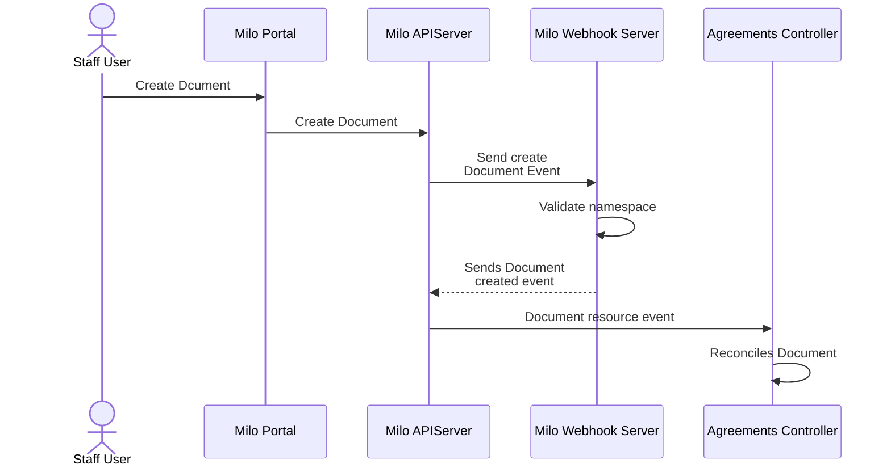
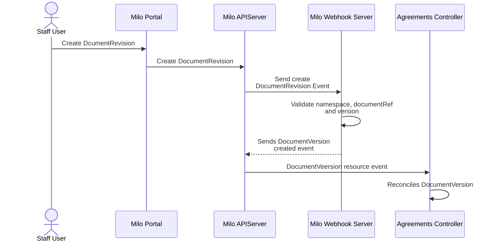
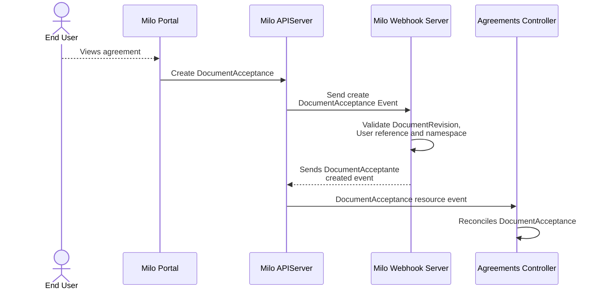

# Agreements System

- [Agreements System](#agreements-system)
  - [Summary](#summary)
  - [Motivation](#motivation)
    - [Goals](#goals)
    - [Non-Goals](#non-goals)
  - [Proposal](#proposal)
    - [Notes/Constraints/Caveats](#notesconstraintscaveats)
    - [Risks and Mitigations](#risks-and-mitigations)
  - [Design Details](#design-details)
    - [Architecture Overview](#architecture-overview)
      - [Core Components](#core-components)
      - [Agreement Flow](#agreement-flow)
    - [CRD Specifications](#crd-specifications)
      - [Document Resource](#document-resource)
      - [DocumentRevision Resource](#documentrevision-resource)
      - [DocumentAcceptance Resource](#documentacceptance-resource)
    - [Controller Implementation](#controller-implementation)
      - [Acceptance Status States](#acceptance-status-states)
      - [Permission Management](#permission-management)
    - [Basic Monitoring](#basic-monitoring)
      - [Key Metrics](#key-metrics)
      - [Simple Alerting](#simple-alerting)
  - [Implementation History](#implementation-history)

## Summary

The Milo platform needs a robust, versioned, and auditable system for managing agreements (such as Terms of Service, Privacy Policy, etc.). This enhancement implements an Agreements controller and CRDs to manage agreement documents, their revisions, and user acceptance events. The system tracks who accepted which version, when, and under what context, and makes this information available to both users and staff.

**This enhancement focuses on backend agreement management.** It proposes implementing a set of CRDs and a controller to manage agreement lifecycles, versioning, and acceptance tracking, with clear, generic naming for reusability.

> [!NOTE]
> This enhancement does NOT include a frontend UI for agreement management or acceptance. Frontend integration will be addressed in future enhancements.

## Motivation

Modern SaaS platforms must track user and organization acceptance of legal agreements in a versioned, auditable way. This is critical for compliance, user experience, and operational transparency. The current platform lacks a generic, reusable system for managing agreements and tracking acceptance events.

### Goals

- **Define agreement types and revisions** - Support versioned, trackable agreement documents
- **Track acceptance events** - Store who accepted which version, when, and with what context (IP, method, etc.)
- **Expose agreement and acceptance history** - Make records visible to users and staff
- **Use generic, reusable naming** - Enable adoption outside this project
- **Document API and operational flows** - Provide clear docs for staff and developers

### Non-Goals

**Explicitly out of scope for this enhancement:**

- Full e-signature workflows (e.g., DocuSign)
- PDF or complex document generation (Markdown/HTML only)
- Automated notifications or translations
- Standalone documentation site or SDKs
- Marketing or product copy

**Future enhancements will address:**

- Frontend UI for agreement management and acceptance
- Automated notifications for new versions
- Localization and translations
- Advanced analytics and reporting

## Proposal

This enhancement proposes implementing an Agreements system for the Milo platform using Kubernetes Custom Resource Definitions (CRDs). The system focuses on backend management of agreement documents, their revisions, and acceptance tracking.

### Notes/Constraints/Caveats

**Implementation Constraints:**

- Backend-only implementation (no frontend UI)
- Documents and revisions are immutable after creation
- Generic naming for portability
- No PDF or e-signature support (Markdown/HTML only)

**Processing:**

- Agreements controller watches for Document, DocumentRevision, and DocumentAcceptance resources
- Acceptance events are validated and stored with full context
- Staff and users can query acceptance history
- All documentation is stored in the Git repo alongside code

> [!NOTE]
>
> At this stage, controllers are not strictly required for implementation. Controllers are introdocued in case, if in the future, there is a need to send transactional emails, notify users when a new agreement revision is available for acceptance, or support additional signature methods.

**What this enhancement does NOT provide:**

- Frontend UI for agreement management or acceptance
- Automated notifications or reminders
- Localization or translations
- Advanced analytics or reporting

### Risks and Mitigations

#### Risk: Incomplete Acceptance Tracking

- *Impact:* Users may access features without proper agreement acceptance
- *Mitigation:* Enforce acceptance checks in API gateways and controllers

#### Risk: Data Integrity Issues

- *Impact:* Acceptance records may be lost or tampered with
- *Mitigation:* Records cannot be deleted/updated, auditable storage and regular backups

#### Risk: Versioning Confusion

- *Impact:* Users may not know which version they accepted
- *Mitigation:* Always display current and historical versions in user/staff interfaces

**Security Review:** Security team will review audit logging, access controls, and data integrity mechanisms.

## Design Details

### Architecture Overview

The agreements system is implemented as a Kubernetes controller that watches Document, DocumentRevision, and DocumentAcceptance CRDs, managing the full lifecycle of agreements and acceptance tracking.

#### Core Components

1. **Agreements Controller** - Kubernetes controller that processes agreement resources
2. **Document CRD** - Defines agreement types and metadata
3. **DocumentRevision CRD** - Defines versioned content for each agreement
4. **DocumentAcceptance CRD** - Records acceptance events with full context

#### Agreement Flow

##### Staff Operator Flow

###### Document Creation



> [!WARNING]
>
> Documents cannot be deleted if any associated DocumentRevision resources exist.
>
> Documents are immutable and cannot be updated after creation.

###### DocumentRevision Creation



> [!WARNING]
>
> DocumentRevision resources are immutable and cannot be updated or deleted after creation.

##### End User Flow

###### DocumentRevision Acceptance



> [!WARNING]
>
> DocumentAcceptance resources are immutable and cannot be updated or deleted after creation.

### CRD Specifications

#### Document Resource

```yaml
apiVersion: agreements.miloapis.com/v1alpha1
kind: Document
metadata:
  name: terms-of-service
  namespace: legal-documents
spec:
  title: "Terms of Service"
  description: "The rules and conditions for using our platform."
  documentType: "terms-of-service"
  metadata:
    category: "legal"
    jurisdiction: "US"
```

#### DocumentRevision Resource

```yaml
apiVersion: agreements.miloapis.com/v1alpha1
kind: DocumentRevision
metadata:
  name: terms-of-service-v2-0
  namespace: legal-documents
spec:
  documentRef:
    name: terms-of-service
    namespace: legal-documents
  version: "2.0.0"
  content:
    format: "markdown"
    data: |
      # Terms of Service
      ...
  effectiveDate: "2025-06-01T00:00:00Z"
  changesSummary: "Updated dispute resolution section."
status:
  contentHash: "sha256:abc123..."
```

##### About `contentHash`

- **Purpose:** The `contentHash` field is a cryptographic hash (typically SHA-256) of the canonical document content in the `data` field. It ensures the integrity and auditability of each document revision.
- **How it works:**
  - When a new DocumentRevision is created, the webhook or controller computes the SHA-256 hash of the exact content in the `data` field (after normalizing line endings and whitespace if required).
  - The resulting hash is stored in the `status.contentHash` field, prefixed with the hash algorithm (e.g., `sha256:`).
  - This allows anyone to verify that the content has not been tampered with by recomputing the hash and comparing it to the stored value.
- **Why required:**
  - Guarantees that the content of a published agreement revision is immutable and verifiable.
  - Enables external auditors, staff, or users to confirm the authenticity of the agreement text they accepted.
  - Required for all DocumentRevision resources.

#### DocumentAcceptance Resource

```yaml
apiVersion: agreements.miloapis.com/v1alpha1
kind: DocumentAcceptance
metadata:
  name: tos-acceptance-user-12345-20250602
  namespace: organization-acme
spec:
  documentRevisionRef:
    name: terms-of-service-v2-0
    namespace: legal-documents
    resourceVersion: "12345"
  userRef:
    name: user-12345
  state: "accepted"  # accepted, declined
  acceptanceContext:
    method: web-ui
    ipAddress: "192.168.1.100"
    userAgent: "Mozilla/5.0 (Macintosh; Intel Mac OS X 10_15_7)"
    acceptanceLanguage: "en-US"
  signature:
    type: "checkbox"
    timestamp: "2025-06-02T09:30:00Z"
```

### Controller Implementation

The Agreements Controller is a standard Kubernetes controller that:

1. **Watches Document, DocumentRevision, and DocumentAcceptance resources**
2. **Validates and stores acceptance events** with full context
3. **Exposes agreement and acceptance history** for querying by staff and users
4. **Ensures immutability** of documents and revisions after creation
5. **Maintains audit logs** for all acceptance events

#### Acceptance Status States

- `accepted` - User has accepted the agreement
- `rejected` - User declined or failed to accept (optional, for future use)

#### Permission Management

- **On Document/Revision creation:** Only staff/operators can create or update
- **On Acceptance:** Users can create acceptance events for themselves
- **On Query:** Staff can view all records; users can view their own

### Basic Monitoring

#### Key Metrics

- **Document Creation Rate** - Number of new agreement documents created
- **Revision Publication Rate** - Number of new revisions published
- **Acceptance Rate** - Percentage of users who have accepted required agreements

#### Simple Alerting

- Acceptance rate for required agreements drops below threshold

## Implementation History

**Phase 1 (Alpha - v0.1) - Core Agreements System:**

- Document, DocumentRevision, and DocumentAcceptance CRDs
- Agreements controller with basic lifecycle management
- Append-only, auditable acceptance records
- No frontend UI - backend only

**Future Phases (Planned but not in this enhancement):**

- Phase 2: Frontend UI for agreement management and user acceptance
- Phase 3: Automated notifications and reminders
- Phase 4: Localization and translations
- Phase 5: Advanced analytics and reporting
- Phase 6: E-signature and PDF support
