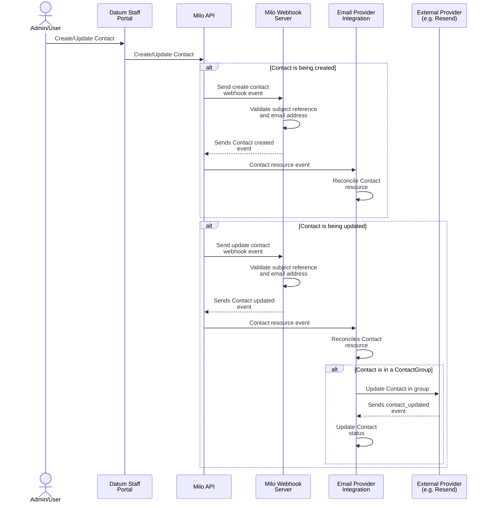
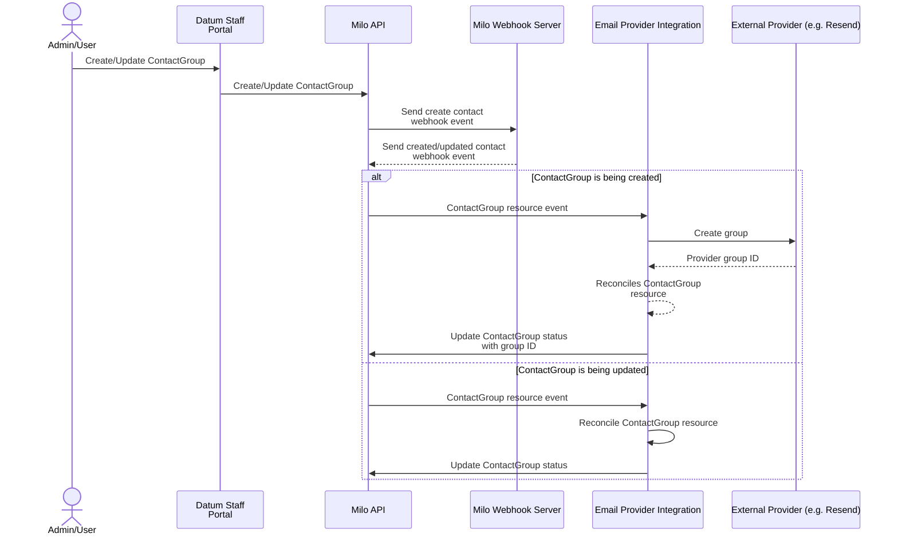
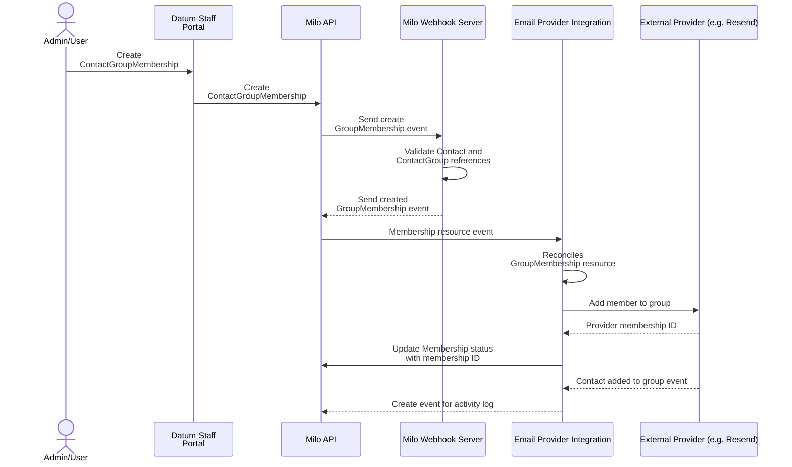
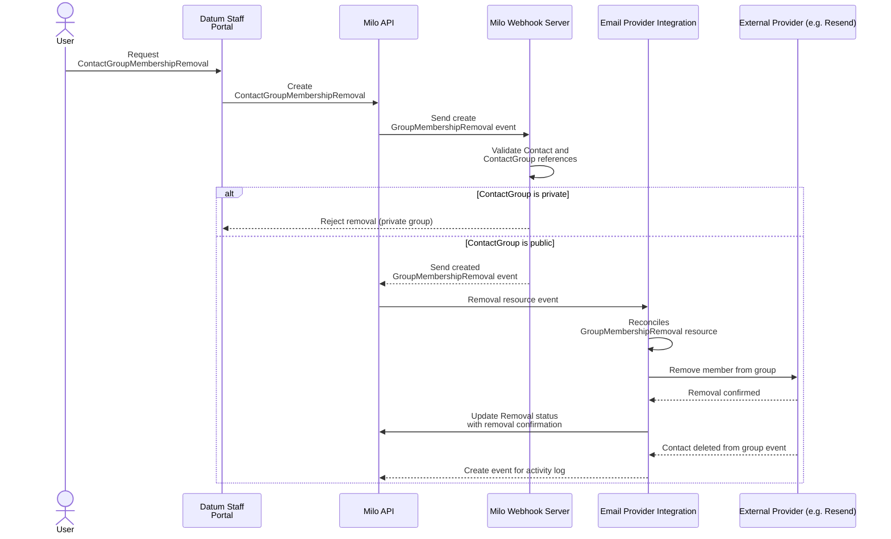

# Email Contact Group Integration

- [Email Contact Group Integration](#email-contact-group-integration)
  - [Summary](#summary)
    - [Initial integration](#initial-integration)
  - [Motivation](#motivation)
    - [Goals](#goals)
    - [Non-Goals](#non-goals)
  - [Proposal](#proposal)
    - [User Stories](#user-stories)
      - [Story 1: Manage Contacts](#story-1-manage-contacts)
      - [Story 2: Manage Contact Groups](#story-2-manage-contact-groups)
      - [Story 3: Manage Group Memberships](#story-3-manage-group-memberships)
      - [Story 4: Opt-out of Groups](#story-4-opt-out-of-groups)
    - [Notes/Constraints/Caveats](#notesconstraintscaveats)
    - [Risks and Mitigations](#risks-and-mitigations)
      - [Risk: Stale or Incorrect Memberships](#risk-stale-or-incorrect-memberships)
      - [Risk: Privacy and Opt-out](#risk-privacy-and-opt-out)
      - [Risk: Provider Sync Issues](#risk-provider-sync-issues)
  - [Design Details](#design-details)
    - [Architecture Overview](#architecture-overview)
      - [Core Components](#core-components)
      - [Contact Group Flow](#contact-group-flow)
    - [CRD Specifications](#crd-specifications)
      - [Contact Resource](#contact-resource)
      - [ContactGroup Resource](#contactgroup-resource)
      - [ContactGroupMembership Resource](#contactgroupmembership-resource)
      - [ContactGroupMembershipRemoval Resource](#contactgroupmembershipremoval-resource)
    - [Controller Implementation](#controller-implementation)

## Summary

Milo needs a robust way to manage how users and systems are contacted for notifications, including grouping contacts for bulk notifications and managing group memberships. This enhancement introduces a set of CRDs for contact management, groupings, and membership lifecycle, enabling flexible, auditable, and scalable notification targeting.

**This enhancement focuses on contact and contact group management.** It introduces Kubernetes CRDs for Contact, ContactGroup, ContactGroupMembership, and ContactGroupMembershipRemoval. These resources allow the platform to model users' contact information, logical groupings, and membership/opt-out flows, forming the foundation for advanced notification and email targeting.

### Initial integration

- Contact, ContactGroup, ContactGroupMembership, and ContactGroupMembershipRemoval CRDs
- Basic controller for membership lifecycle and provider sync

## Motivation

Modern notification systems require more than just direct email sending. They need to:

- Manage user contact information in a structured, auditable way
- Group contacts for bulk notifications (e.g., all admins, all billing contacts)
- Allow users to opt-in or opt-out of certain groups (where permitted)
- Track and synchronize group memberships with external providers (e.g., Resend, Mailgun)

Without this, notification targeting is error-prone, manual, and not scalable.

### Goals

- **Model user contact information** with a Contact CRD
- **Support logical groupings** of contacts via ContactGroup CRD
- **Track group membership** with ContactGroupMembership CRD
- **Support opt-out/leave flows** with ContactGroupMembershipRemoval CRD
- **Enable provider sync** for group membership (e.g., with Resend)
- **Audit and status tracking** for all resources

### Non-Goals

**Explicitly out of scope for this enhancement:**

- Email sending (handled by separate enhancement)
- Advanced group rules (e.g., dynamic membership, nested groups)
- Marketing automation or campaign management
- Multi-provider failover

**Future enhancements will address:**

- Dynamic group membership
- Cross-namespace/global groups
- Advanced notification preferences

## Proposal

This enhancement proposes implementing a contact management system for the Milo platform using Kubernetes CRDs. The system enables structured management of contacts, groups, and memberships, with clear opt-in/opt-out semantics and provider synchronization.

### User Stories

#### Story 1: Manage Contacts

As an admin, I need to create and update Contact resources for users so that notification targets are always up to date.

**Acceptance Criteria:**

- Create Contact resources with email, name, and subject reference
- Update contact information as needed
- Status reflects provider sync

#### Story 2: Manage Contact Groups

As an admin, I need to create ContactGroup resources to logically group contacts for notifications (e.g., marketing, billing contacts).

**Acceptance Criteria:**

- Create ContactGroup resources with display name and visibility
- Status reflects provider sync

#### Story 3: Manage Group Memberships

As an admin, I need to add or remove contacts from groups using ContactGroupMembership resources, so that notifications reach the right people.

**Acceptance Criteria:**

- Create ContactGroupMembership resources to add contacts to groups
- Status reflects membership state and provider sync

#### Story 4: Opt-out of Groups

As a user, I need to request removal from a group (where allowed) using ContactGroupMembershipRemoval, so I stop receiving certain notifications.

**Acceptance Criteria:**

- Create ContactGroupMembershipRemoval resources to request opt-out
- Status reflects removal state and provider sync
- Opt-out requests are honored for public groups, rejected for private groups

### Notes/Constraints/Caveats

- **Contacts are namespaced** and must reference a user, organization, or project
- **ContactGroups are namespaced** and have a display name and visibility (public/private)
- **Memberships are explicit**: a ContactGroupMembership resource is required for each member
- **Opt-out/removal is explicit**: a ContactGroupMembershipRemoval resource blocks membership
- **Provider sync**: All resources track provider IDs and sync status
- **Immutability**: Membership and removal specs are immutable after creation

### Risks and Mitigations

#### Risk: Stale or Incorrect Memberships

- *Impact*: Notifications may be sent to wrong recipients
- *Mitigation*: Status tracking, provider sync, and audit logs

#### Risk: Privacy and Opt-out

- *Impact*: Users may not be able to leave groups as required by law or policy
- *Mitigation*: Public/private group visibility, explicit opt-out flows, auditability

#### Risk: Provider Sync Issues

- *Impact*: Group membership may not match provider state
- *Mitigation*: Status reflects provider sync, errors surfaced for admin action

## Design Details

### Architecture Overview

The contact group system is implemented as a set of Kubernetes controllers that watch Contact, ContactGroup, ContactGroupMembership, and ContactGroupMembershipRemoval CRDs and synchronize state with external providers as needed.

#### Core Components

1. **Contact CRD** - Represents a user's contact information
2. **ContactGroup CRD** - Defines logical groupings of contacts
3. **ContactGroupMembership CRD** - Represents membership of a Contact in a ContactGroup. Note: If a corresponding ContactGroupMembershipRemoval resource exists for a given Contact and ContactGroup, it blocks the creation of a ContactGroupMembership and prevents the Contact from being (re)added to that group.
4. **ContactGroupMembershipRemoval CRD** - Represents a request to remove a Contact from a ContactGroup

#### Contact Flow



> **Note:**
> When a Contact resource is updated, the Email Provider Integration reconciles the resource. If the contact is a member of a Contact Group, the integration updates the corresponding contact in the external provider (e.g., Resend) to reflect the changes.

#### Contact Group Flow



#### Contact Group Membership Flow



#### Contact Group Membership Removal Flow



### CRD Specifications

#### Contact Resource

```yaml
apiVersion: notification.miloapis.com/v1alpha1
kind: Contact
metadata:
  name: john-doe
  namespace: org-xyz
spec:
  email: john.doe@company.com # it is not overriden by userRef email, user may want to use different email address for Contact
  familyName: Doe
  givenName: John
  subject:
    ## one of userRef \ organizationRef \ projectRef
    userRef:
      name: "332926980888461588"
    organizationRef:
      name: "personal-org-31farw"
      namespace: "organization-personal-org-31farw"
    projectRef:
      name: "project-name"
      namespace: "project-namespace"
```

#### ContactGroup Resource

```yaml
apiVersion: notification.miloapis.com/v1alpha1
kind: ContactGroup
metadata:
  name: admins
  namespace: org-xyz
spec:
  displayName: "Organization Admins"
  visibility: public # or private
```

#### ContactGroupMembership Resource

```yaml
apiVersion: notification.miloapis.com/v1alpha1
kind: ContactGroupMembership
metadata:
  name: john-doe-admins
  namespace: org-xyz
spec:
  contactRef:
    name: john-doe
    namespace: org-xyz
  contactGroupRef:
    name: admins
    namespace: org-xyz
```

#### ContactGroupMembershipRemoval Resource

```yaml
apiVersion: notification.miloapis.com/v1alpha1
kind: ContactGroupMembershipRemoval
metadata:
  name: john-doe-admins-removal
  namespace: org-xyz
spec:
  contactRef:
    name: john-doe
    namespace: org-xyz
  contactGroupRef:
    name: admins
    namespace: org-xyz
```

### Controller Implementation

For maintainability and clear separation of concerns, there is a dedicated controller for each resource type:

1. **Contact Controller**
   - Watches Contact resources.
   - Validates and manages user, organization, or project references.
   - Handles creation, update, and status reconciliation for contacts.
   - Triggers provider sync for contact information as needed.

2. **ContactGroup Controller**
   - Watches ContactGroup resources.
   - Manages group creation, updates, and status reconciliation.
   - Handles provider group creation and updates, ensuring group state is consistent with the external provider.

3. **ContactGroupMembership Controller**
   - Watches ContactGroupMembership resources.
   - Validates references to Contact and ContactGroup.
   - Manages membership lifecycle, including provider sync for adding membersto groups.
   - When deleted, removes the contact from the group.
   - Updates membership status and handles provider membership IDs.

4. **ContactGroupMembershipRemoval Controller**
   - Watches ContactGroupMembershipRemoval resources.
   - Validates references to Contact and ContactGroup.
   - Validates that the ContactGroup is public; if private, rejects the removal request and updates status with a rejection reason.
   - Manages removal lifecycle, including provider sync for removing members from groups. This is done by deleting the corresponding ContactGroupMembership.
   - Updates removal status and handles provider removal confirmations.

Each controller is responsible for the full lifecycle of its resource type, including validation, provider synchronization, status updates, and enforcing immutability or opt-out logic as required. This separation ensures that logic for each resource is isolated, easier to test, and more robust to future changes.

**Phase 1 (Alpha - v0.1) - Contact and Group Management:**

- Contact, ContactGroup, ContactGroupMembership, and ContactGroupMembershipRemoval CRDs
- Basic controller for membership lifecycle and provider sync
- Immutability and status tracking
