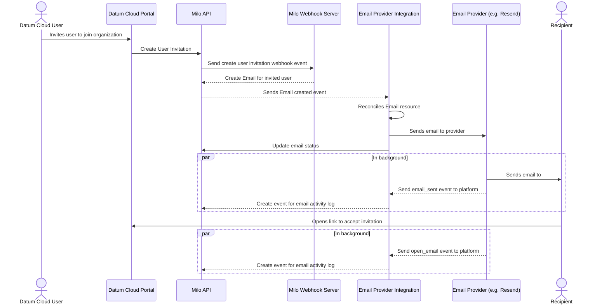

# Email Integration and Notification System

- [Email Integration and Notification System](#email-integration-and-notification-system)
  - [Summary](#summary)
    - [Initial integration](#initial-integration)
  - [Motivation](#motivation)
    - [Goals](#goals)
    - [Non-Goals](#non-goals)
  - [Proposal](#proposal)
    - [User Stories](#user-stories)
      - [Story 1: Send Templated Emails](#story-1-send-templated-emails)
      - [Story 2: Platform Event Email Notifications](#story-2-platform-event-email-notifications)
    - [Notes/Constraints/Caveats](#notesconstraintscaveats)
    - [Risks and Mitigations](#risks-and-mitigations)
      - [Risk: Email Delivery Failures](#risk-email-delivery-failures)
      - [Risk: Template Variable Injection](#risk-template-variable-injection)
      - [Risk: Provider API Limits](#risk-provider-api-limits)
  - [Design Details](#design-details)
    - [Architecture Overview](#architecture-overview)
      - [Core Components](#core-components)
      - [Email Flow](#email-flow)
    - [CRD Specifications](#crd-specifications)
      - [Email Resource](#email-resource)
      - [Email Template Resource](#email-template-resource)
      - [EmailEvent Resource](#emailevent-resource)
    - [Controller Implementation](#controller-implementation)
      - [Email Status States](#email-status-states)
    - [Basic Monitoring](#basic-monitoring)
      - [Key Metrics](#key-metrics)
      - [Simple Alerting](#simple-alerting)
  - [Implementation History](#implementation-history)

## Summary

Milo needs the ability to send emails to end-users based on events happening across the Milo platform. This could be emails for platform notifications (e.g. Billing configuration changed, User invited to organization, etc) or transactional emails (e.g. Email on first sign up, password reset, etc).

**This enhancement focuses exclusively on basic email sending capabilities.** It proposes implementing a simple email system using Kubernetes Custom Resource Definitions (CRDs) for Email and EmailTemplate resources. The system will provide a straightforward way to send templated emails through a single email provider integration.

**Scope Note:** This enhancement does NOT include contact management, contact groups, or mailing lists. These features will be addressed in future enhancements once basic email sending is established and proven.

### Initial integration

- `https://resend.com/` - Developer-focused email API with simple template support

## Motivation

The Milo platform currently lacks a basic email notification system, which limits our ability to communicate with users about important platform events and notifications. This enhancement addresses the need for a simple, reliable email system for transactional and notification emails.

Modern Alt Cloud providers require basic email capabilities to notify users about account changes, system events, and provide important service notifications. Without this capability, Milo cannot effectively communicate with users about critical platform events.

### Goals

- **Provide simple email sending capabilities** - Enable sending of templated emails through Kubernetes CRDs
- **Support basic email templates** - Allow creation and management of email templates with variable substitution  
- **Enable event-driven emails** - Allow platform events to trigger email sending automatically
- **Track email delivery status** - Provide basic visibility into email delivery success/failure

### Non-Goals

**Explicitly out of scope for this enhancement:**

- **Full e-signature workflows** - No built-in support for electronic signature solutions (e.g., DocuSign, Documenso)
- **Contact management** - No Contact CRDs, contact storage, or contact lifecycle management
- **Contact groups/mailing lists** - No ContactGroup CRDs or automated group membership
- **Multi-provider support** - Initial implementation will focus on a single provider (Resend)
- **Marketing automation** - Focus on transactional emails only, no campaigns or sequences
- **Advanced analytics** - Basic delivery status only, no open/click tracking or engagement metrics
- **Complex template management** - Simple variable substitution only, no advanced templating engines

**Future enhancements will address:**

- Contact and ContactGroup CRDs for managing recipients
- Multi-provider support and provider failover
- Advanced email analytics and engagement tracking
- Marketing automation and campaign management

## Proposal

This enhancement proposes implementing a simple email system for the Milo platform using Kubernetes Custom Resource Definitions (CRDs). **The system focuses solely on email sending** - no contact management, groups, or advanced features.

The core proposal includes:

1. **Email CRD** - Represents an email to be sent with template reference and variables (recipients specified directly in each Email resource)
2. **EmailTemplate CRD** - Defines reusable email templates with variable substitution
3. **Email Controller** - Processes Email resources and sends emails via Resend API
4. **Basic Status Tracking** - Track email delivery status (pending, sent, failed, etc)

**Key limitation:** Recipients (to, cc, bcc) are specified directly in each Email resource. There are no Contact or ContactGroup resources to manage recipient information.

### User Stories

#### Story 1: Send Templated Emails

As a developer, I need to send templated emails by creating Email resources so that I can notify users about platform events.

**Acceptance Criteria:**

- Create EmailTemplate resources with HTML and text content
- Create Email resources that reference templates and provide variables
- Email controller automatically processes Email resources and sends emails
- Email status shows delivery success/failure

#### Story 2: Platform Event Email Notifications

As a platform operator, I need emails to be sent automatically when certain events occur so that users are notified of important changes.

**Acceptance Criteria:**

- Platform events can trigger creation of Email resources
- Email templates can be reused across different event types
- Email delivery status is tracked and visible
- Failed emails can be retried

### Notes/Constraints/Caveats

**Deliberately Simple Implementation:**

- **Email sending only** - This enhancement provides no contact management, groups, or mailing list functionality
- **Direct recipient specification** - Email addresses must be specified directly in each Email resource
- **Single provider integration** (Resend) to start - no multi-provider support
- **Basic templates** - Kubernetes resources with simple Go template variable substitution
- **No recipient management** - No storage, validation, or lifecycle management of email addresses

**Email Processing:**

- Email controller watches for Email resources and processes them asynchronously
- Failed emails remain in the cluster with error status for debugging
- Template variables are substituted using simple Go template syntax
- Email delivery status is updated on the Email resource status

**What this enhancement does NOT provide:**

- Contact storage or management
- Mailing lists or contact groups
- Email address validation beyond basic syntax
- Unsubscribe management
- Recipient preference management
- Bulk email capabilities

### Risks and Mitigations

#### Risk: Email Delivery Failures

- *Impact:* Critical platform notifications may not reach users
- *Mitigation:* Implement retry logic and status tracking, monitor Resend API health

#### Risk: Template Variable Injection

- *Impact:* Malicious template variables could lead to XSS or other security issues
- *Mitigation:* Sanitize template variables and validate input data

#### Risk: Provider API Limits

- *Impact:* High email volume could hit Resend API rate limits
- *Mitigation:* Implement rate limiting and queuing in the email controller

**Security Review:** Security team will review template variable handling and API credential management

## Design Details

### Architecture Overview

The email system is implemented as a simple Kubernetes controller that watches Email and EmailTemplate Custom Resource Definitions (CRDs) and processes them to send emails via the Resend API.

#### Core Components

1. **Email Controller** - Kubernetes controller that processes Email resources
2. **EmailTemplate CRD** - Defines email templates with variable substitution
3. **Email CRD** - Represents emails to be sent
4. **Resend API Integration** - Simple API client for sending emails

#### Email Flow



### CRD Specifications

#### Email Resource

```yaml
apiVersion: email.miloapis.com/v1alpha1
kind: Email
metadata:
  name: user-invitation-12345
  namespace: organization-xyz
spec:
  templateRef: 
    name: "user-invitation"
  userRef:
    name: ["332926980888461588"]
  cc: []
  bcc: []
  variables:
    - name: UserName
      value: "John Doe"
    - name: InviteLink
      value: "https://cloud.datum.net/org/xyz/invites/user-invitation-12345"
    - name: CompanyName
      value: "Datum Technology, Inc."
  # Used to prioritize in which order emails are sent.
  priority: "high"
```

#### Email Template Resource

```yaml
apiVersion: email.miloapis.com/v1alpha1
kind: EmailTemplate
metadata:
  name: user-invitation
spec:
  subject: "Welcome to {{.CompanyName}}, {{.UserName}}!"
  htmlBody: |
    <html>
      <body>
        <h1>Welcome {{.UserName}}</h1>
        <p>Click <a href="{{.InviteLink}}">here</a> to join {{.CompanyName}}</p>
      </body>
    </html>
  textBody: |
    Welcome {{.UserName}}!
    
    Join {{.CompanyName}} by visiting: {{.InviteLink}}
  variables:
  - name: "UserName"
    required: true
    type: "string"
  - name: "CompanyName"
    required: true
    type: "string"
  - name: "InviteLink"
    required: true
    type: "url"
```

#### EmailEvent Resource

```yaml
apiVersion: v1
kind: EmailEvent
metadata:
  name: user-invitation-a8f3d2.17ba6c5f42e8f3a1
  namespace: tenant-acme-corp
  ...
regarding:
  apiVersion: email.miloapis.com/v1alpha1
  kind: Email
  name: user-invitation-12345
  namespace: organization-xyz
  uid: 550e8400-e29b-41d4-a716-446655440000
reason: DeliverySuccessful
message: "Message delivered to john.doe@company.com at 2025-07-28T14:32:58.234Z"
source:
  component: resend-email-webhook-receiver
type: Normal
action: EmailDelivered
```

### Controller Implementation

The Email Controller is a standard Kubernetes controller that:

1. **Watches Email Resources** - Uses controller-runtime to watch for Email resource changes
2. **Validates Templates** - Ensures referenced EmailTemplate exists and is valid
3. **Renders Templates** - Substitutes variables using Go template syntax
4. **Sends Emails** - Makes API calls to Resend to send rendered emails
5. **Updates Status** - Updates Email resource status with delivery results

#### Email Status States

- `email.sent` - Occurs whenever the email provider API request was successful.
- `email.delivered` - Occurs whenever email provider successfully delivered the email to the recipient’s mail server
- `email.delivery_delayed` - ccurs whenever the email couldn’t be delivered due to a temporary issue.
- `email.complained` - Occurs whenever the email was successfully delivered, but the recipient marked it as spam.
- `email.bounced` - Occurs whenever the recipient’s mail server permanently rejected the email.
- `email.opened` - Occurs whenever the recipient opened the email.
- `email.clicked` - Occurs whenever the recipient clicks on an email link.
- `email.failed` - Occurs whenever the email failed to send due to an error.

### Basic Monitoring

#### Key Metrics

- **Email Send Rate** - Number of emails sent per minute
- **Email Failure Rate** - Percentage of failed email sends
- **Resend API Response Time** - API call latency to Resend

#### Simple Alerting

- Email failure rate exceeds 10%
- Resend API response time exceeds 10 seconds
- Controller pod restarts

## Implementation History

**Phase 1 (Alpha - v0.1) - Email Sending Only:**

- Email and EmailTemplate CRDs
- Basic email controller
- Resend API integration  
- Simple template variable substitution
- **No contact management, groups, or advanced features**

**Future Phases (Planned but not in this enhancement):**

- Phase 1: Contact and ContactGroup CRDs for recipient management
- Phase 2: Multi-provider support and failover
- Phase 4: Advanced analytics and engagement tracking
- Phase 5: Marketing automation and campaign management
