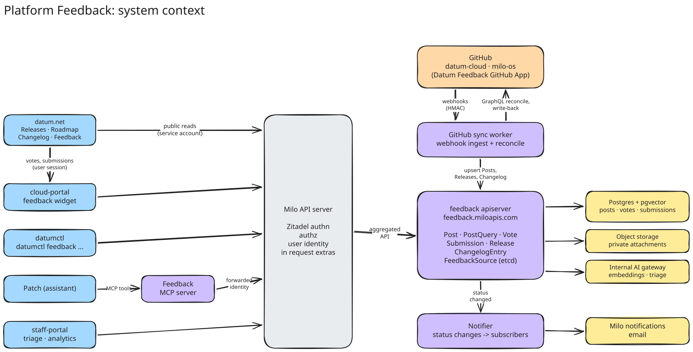
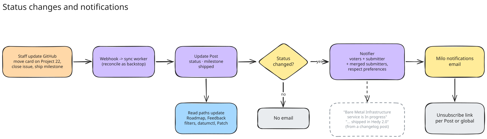

<!-- omit from toc -->
# Platform Feedback

- [Summary](#summary)
- [Motivation](#motivation)
  - [Goals](#goals)
  - [Non-Goals](#non-goals)
- [Proposal](#proposal)
  - [User Stories](#user-stories)
  - [Key Capabilities](#key-capabilities)
  - [Notes/Constraints/Caveats](#notesconstraintscaveats)
  - [Risks and Mitigations](#risks-and-mitigations)
- [Design Details](#design-details)
  - [Architecture](#architecture)
  - [API Resources](#api-resources)
  - [GitHub Sync](#github-sync)
  - [Status and Category Mapping](#status-and-category-mapping)
  - [Votes](#votes)
  - [Submissions and Staff Review](#submissions-and-staff-review)
  - [Notifications](#notifications)
  - [Releases and Changelog](#releases-and-changelog)
  - [Clients](#clients)
  - [Staff Analytics](#staff-analytics)
  - [Rollout Phases](#rollout-phases)
- [Production Readiness Review Questionnaire](#production-readiness-review-questionnaire)
  - [Feature Enablement and Rollback](#feature-enablement-and-rollback)
  - [Rollout, Upgrade and Rollback Planning](#rollout-upgrade-and-rollback-planning)
  - [Monitoring Requirements](#monitoring-requirements)
  - [Dependencies](#dependencies)
  - [Scalability](#scalability)
  - [Troubleshooting](#troubleshooting)
- [Implementation History](#implementation-history)
- [Drawbacks](#drawbacks)
- [Alternatives](#alternatives)
- [Infrastructure Needed](#infrastructure-needed)

## Summary

The Feedback service is the single backend for everything users see about
what Datum is building and what they want us to build: the roadmap, releases,
the changelog, and feature requests and bug reports. It syncs public issues
and milestones from our two GitHub orgs (`datum-cloud` and `milo-os`) and
changelog posts from GitHub Discussions, stores votes and submissions from signed-in Datum users, and
exposes all of it through one API under Milo (`feedback.miloapis.com`).

Every client reads from this service instead of rolling its own GitHub logic:
the website (datum.net), the cloud portal, datumctl, and Patch. Users can
browse, search and filter existing ideas, upvote them, and submit new
feedback with private context attached. Submissions are always reviewed by
staff before anything is published to GitHub.

Tracking issue: [datum-cloud/enhancements#889][issue]. Web designs:
[Figma: Roadmap + Backlog][figma].

[issue]: https://github.com/datum-cloud/enhancements/issues/889
[figma]: https://www.figma.com/design/bBEQ8YeTP4SngNl5EkkQdH/Datum---Master-Design-File?node-id=17642-52938

## Motivation

Today users send feedback through email, support tickets or Discord. Each
route makes the user supply context by hand, and none of them tell the user
whether someone has already asked for the same thing. Staff then copy the
useful parts into GitHub, and the link back to the person who asked is lost.

On the read side, datum.net talks to GitHub directly (`src/libs/github.ts`,
`src/libs/githubRoadmap.ts`) with its own GitHub App credentials and a Redis
cache. The cloud portal has a website feedback route
(`app/server/routes/website/feedback/`) whose only sink writes to the server
log, with a comment noting it is the default "until enhancements#889 lands".
datumctl and Patch have nothing. If each client builds its own GitHub
integration we get four sets of credentials, four caching strategies, four
ideas of what "status" means, and no shared votes.

A single service fixes this: one GitHub integration, one data model, one
place where votes and submissions are tied to Datum users and organizations.

### Goals

- Sync public issues and milestones from `datum-cloud` and `milo-os`, and
  changelog posts from the `changelog` Discussions category in
  `datum-cloud/datum`, with configuration that supports adding more orgs or
  repos.
- Let any client list, search, filter (status, category, labels, org, repo)
  and sort (top, newest, trending) items through one API.
- Let signed-in users upvote items, and count GitHub 👍 reactions toward the
  displayed total.
- Let signed-in users submit feedback (narrative, screenshots, error logs)
  from the website, cloud portal, datumctl and Patch, and see similar existing
  items before they submit.
- Hold every submission for staff review. Staff approve (creates a GitHub
  issue), merge into an existing item, or reject.
- Keep users informed when items they voted on or submitted change status.
- Give staff analysis of who is asking for what, by user and organization.
- Replace all of datum.net's direct GitHub integration, and back the new
  Releases, Roadmap, Changelog and Feedback pages with this service.

### Non-Goals

- Fixing bugs in real time, or acting as a support ticketing system.
- Comments and discussion threads inside Datum. Discussion stays on GitHub;
  clients link to it. This can be revisited later.
- Syncing private repositories or internal issues.
- Two-way editing of issue content. GitHub stays the source of truth for
  public issue content; the service only writes when staff approve a
  submission and when it mirrors vote counts.
- Automatic publishing of user submissions to GitHub.

## Proposal

### User Stories

**Website visitor (anonymous).** I can browse the roadmap, past and upcoming
releases, the changelog, and existing feedback, and search and filter it,
without signing in.

**Signed-in user.** I can upvote an idea in one click. I get told when its
status changes. I can remove my vote.

**User with an idea or a bug.** As I type my feedback I see similar existing
items, so I can upvote one of those instead. If nothing matches I submit
mine, optionally with a screenshot or logs, and I can see it is under review.
I get notified when it is approved, merged into another item, or declined.

**Cloud portal user.** When I report something from inside the portal, my
organization, project, current page and recent request IDs are attached
automatically, so I don't have to explain where I was.

**CLI user.** I can run `datumctl feedback search`, `vote` and `submit`
without leaving the terminal.

**Patch user.** When I tell Patch something is missing or broken, Patch
checks for existing items, offers to upvote one, or drafts a submission for
me to confirm.

**Datum staff.** I work a review queue in the staff portal with the user's
private context and Patch's suggested duplicates and category. I can see
which organizations are asking for an item and how many users voted for it.
I can sort the GitHub project by votes.

### Key Capabilities

- **Multi-org GitHub sync** driven by webhooks plus periodic reconciliation.
- **Unified query API** with full-text search, similarity search, filters,
  facet counts and sorting.
- **Votes** tied to Milo users, combined with GitHub 👍 reactions.
- **Private submissions** with attachments and context, held for review.
- **Staff review** with AI-assisted triage, but a human decision every time.
- **Notifications** to voters and submitters on status changes.
- **Releases and changelog** for the website's Releases and Changelog pages.
- **One integration point per client**: Milo API for portal, datumctl and
  website server; an MCP server for Patch.

### Notes/Constraints/Caveats

- GitHub does not send webhooks for reactions. 👍 counts can only be
  refreshed by polling, so they lag webhook-driven fields by up to one
  reconcile interval.
- Webhook delivery is best effort. Reconciliation is required for
  correctness, not just as a fallback.
- Only public repositories are synced. A repository going private removes
  its items on the next reconcile.
- Issue status comes from a GitHub Projects (v2) Status field. Projects are
  owned per org, so each `FeedbackSource` names its own project.
- Voter identities are private by default. Counts are always public; a
  user's avatar is only shown on items they voted on if they opt in.
- GitHub's rendered issue HTML is re-sanitised before it is served. Clients
  must not render raw markdown from GitHub without sanitising it.

### Risks and Mitigations

| Risk | Mitigation |
| ---- | ---------- |
| Spam, abuse or PII reaching public GitHub | Submissions never auto-publish. Staff review every one, edit title and body before approval, and private context is never copied to GitHub. Per-user rate limits; fraud signals shown in the review queue. |
| Vote stuffing | One vote per Milo user per item. Votes require a verified account. Staff analytics show voter distribution by org. |
| Double counting a person who voted in Datum and reacted on GitHub | Dedupe using linked GitHub identities (see [Votes](#votes)). Users without a linked identity can still be counted twice. |
| GitHub API rate limits | GitHub App installation tokens per org, GraphQL batching, incremental reconcile using `updated:>` searches, reaction sweeps limited to tracked open issues. |
| Exposing something sensitive from a public repo | Opt-out label (`feedback:hide`), repo allow-lists per source, and staff can hide a `Post` directly. |
| Stored XSS via issue bodies | Server-side allow-list sanitisation of HTML; clients render the sanitised HTML only. |
| Notification fatigue | Status-change notifications only (not comments), batched digests, one-click unsubscribe per item and globally. |

## Design Details

### Architecture



*System context. The editable sources for every diagram in this document are
the `.excalidraw` files alongside the SVGs in [`diagrams/`](./diagrams).*

The service follows the `activity` and `search` pattern: an aggregated API
server registered with Milo through an `APIService`, with custom storage.

- **feedback-apiserver**: serves `feedback.miloapis.com/v1alpha1`. Small
  configuration objects (`FeedbackSource`) live in etcd through the standard
  registry. Everything else uses custom `rest.Storage` backed by Postgres.
- **Postgres + pgvector**: posts, votes, submissions, subscriptions, releases
  and changelog entries. Full-text search uses `tsvector`; "similar feedback"
  uses pgvector embeddings.
- **feedback-webhook**: a small public HTTPS endpoint that receives GitHub
  App webhooks, verifies the `X-Hub-Signature-256` HMAC and publishes events
  to NATS JetStream. It does no processing itself.
- **feedback-sync**: consumes webhook events and runs periodic GraphQL
  reconciliation. Upserts posts, releases and changelog entries, mirrors vote
  counts back to GitHub, and creates issues for approved submissions.
- **feedback-controller**: drives submission review outcomes, computes
  embeddings and triage suggestions, and creates notification emails.
- **feedback-mcp**: MCP server exposing feedback tools to Patch.

External dependencies: a GitHub App installed on `datum-cloud` and `milo-os`,
the internal AI gateway for embeddings and triage drafts, Milo's email
resources for notifications, and object storage for attachments.

User identity reaches the service the same way it reaches `activity`: Milo
authenticates the request and passes the scope in the user extras
(`iam.miloapis.com/parent-type`, `parent-name`). The apiserver uses the
user's UID for user-owned resources.

**API contexts.**

| Resource | Platform context | User context | Notes |
| -------- | ---------------- | ------------ | ----- |
| `FeedbackSource` | read/write (staff) | none | etcd |
| `Post` | read, hide/unhide (staff) | read | public data |
| `PostQuery` | create | create | ephemeral, not stored |
| `Release`, `ChangelogEntry` | read | read | public data |
| `Vote` | list all (staff) | CRUD own | one per user per post |
| `Submission` | list all, review (staff) | create, read own | private |
| `Subscription` | list all (staff) | CRUD own | implicit on vote/submit |

"Public data" resources are readable by any authenticated principal,
including the datum.net service account. Anonymous website visitors never
call Milo directly; the datum.net server does it for them.

### API Resources

#### FeedbackSource

One per GitHub org. Defines what to sync and how to map it.

```yaml
apiVersion: feedback.miloapis.com/v1alpha1
kind: FeedbackSource
metadata:
  name: datum-cloud
spec:
  github:
    org: datum-cloud
    installationID: 12345678
    # Repos to sync issues from. Private repos are always skipped.
    repositories:
      include: ["*"]
      exclude: ["infra", "staff-portal"]
    issues:
      # Issue types and labels that make an issue a Post. Any match includes.
      issueTypes: ["Enhancement", "Feedback", "Bug"]
      labels: ["Build", "Deliver", "Connect", "Platform Features"]
      excludeLabels: ["feedback:hide"]
    project:
      number: 22
      statusField: Status
      votesField: Votes        # number field the service writes to
    milestones:
      repository: enhancements # source for Release resources
    changelog:                 # see Releases and Changelog
      repository: datum
      discussionCategory: changelog
  statusMapping:
    "": none
    "Backlog": backlog
    "Planning": planning
    "On Deck": on-deck
    "In Progress": in-progress
    "Done": shipped
  categoryMapping:
    "Build": build
    "Deliver": deliver
    "Connect": connect
    "Platform Features": platform
    "Infrastructure": infrastructure
    "AX/DX/UX": experience     # used on changelog discussions
status:
  conditions:
    - type: Ready
      status: "True"
  lastWebhookAt: "2026-10-08T12:03:11Z"
  lastReconcile:
    completedAt: "2026-10-08T12:00:00Z"
    postsSynced: 412
  rateLimit:
    remaining: 4710
    resetAt: "2026-10-08T13:00:00Z"
```

The `milo-os` source looks the same with its own repos and project.

<<[UNRESOLVED project for milo-os issues]>>
Do `milo-os` issues get added to `datum-cloud` project 22, or does `milo-os`
get its own project with the same Status options? The spec supports either;
we need a decision so status mapping is consistent across orgs.
<<[/UNRESOLVED]>>

#### Post

A public item synced from a GitHub issue. Every `Post` is backed by a GitHub
issue; private, unreviewed feedback is a `Submission`, never a `Post`. Posts
are read-only through the API except for staff hiding.

```yaml
apiVersion: feedback.miloapis.com/v1alpha1
kind: Post
metadata:
  name: datum-cloud.enhancements.912
spec:
  hidden: false              # staff-only toggle
status:
  title: Bare Metal Infrastructure service
  summary: Expands Datum's platform to support full lifecycle management ...
  bodyHTML: "<h3>High-Level Summary</h3><p>This enhancement ...</p>"
  status: in-progress
  categories: [build]
  labels: [Build]
  issueType: Enhancement
  github:
    org: datum-cloud
    repository: enhancements
    number: 912
    url: https://github.com/datum-cloud/enhancements/issues/912
    state: open
    createdAt: "2026-09-30T14:12:00Z"
    updatedAt: "2026-10-07T09:40:00Z"
  release: hedy-2-0          # set when the issue is on a milestone
  votes:
    total: 9                 # deduped datum + github
    datum: 6
    github: 4
    trendingScore: 3.42
  publicVoters:              # only users who opted in, max 10
    - displayName: Ada L.
      avatarURL: https://...
  lastSyncedAt: "2026-10-08T12:00:00Z"
```

#### PostQuery

A create-to-query resource like `ActivityQuery` and `ResourceSearchQuery`.
It is not persisted. The response's `status` carries results and facets.

```yaml
apiVersion: feedback.miloapis.com/v1alpha1
kind: PostQuery
spec:
  text: wildcard hostnames         # full-text search, optional
  similarTo: |                     # draft feedback text, optional
    I want to route *.example.com to one ALB
  filter:
    status: [planning, on-deck, in-progress]
    categories: [deliver]
    labels: []
    orgs: [datum-cloud, milo-os]
    repositories: []
    votedByMe: false               # user context only
  sort: top                        # top | newest | trending | relevance
  limit: 20
  continue: ""
  facets: [status, categories]
status:
  results:
    - name: datum-cloud.enhancements.913
      title: Wildcard hostnames on ALBs
      summary: ...
      status: on-deck
      categories: [deliver]
      votes: {total: 12}
      votedByMe: true
      score: 0.91                  # relevance or similarity, when used
  facets:
    status: {none: 40, backlog: 85, planning: 12, on-deck: 6, in-progress: 9}
    categories: {build: 30, deliver: 41, connect: 22, platform: 18}
  continue: "eyJvZmZzZXQiOjIwfQ"
```

Sorts:

- `top`: `votes.total` descending.
- `newest`: GitHub `createdAt` descending.
- `trending`: sum of vote weights with a 7-day half-life,
  `Σ 0.5^(age_days / 7)`, over Datum votes and GitHub reactions. Computed in
  Postgres on vote write and refreshed hourly.
- `relevance`: default when `text` or `similarTo` is set.

`similarTo` drives the "Similar feedback" list in the Figma designs, and the
duplicate check in datumctl and Patch. It embeds the text through the AI
gateway and runs a pgvector nearest-neighbour search over post embeddings,
blended with full-text rank.

#### Vote

User context. The name is the post name, so a user can only vote once per
post. Delete the object to remove the vote.

```yaml
apiVersion: feedback.miloapis.com/v1alpha1
kind: Vote
metadata:
  name: datum-cloud.enhancements.912
spec:
  postRef:
    name: datum-cloud.enhancements.912
  source: website            # website | portal | datumctl | patch
status:
  createdAt: "2026-10-08T12:05:00Z"
  # Recorded at vote time for staff analytics; not exposed publicly.
  organizations: [acme-corp]
```

Creating a `Vote` also creates a `Subscription` to the post unless the user
has turned off notifications for votes.

#### Submission

User context for the submitter, Platform context for staff.

```yaml
apiVersion: feedback.miloapis.com/v1alpha1
kind: Submission
metadata:
  name: sub-7f3k2
spec:
  kind: idea                  # idea | bug | other
  title: Let me pick the region for Galactic VPC attachments
  body: |
    When I attach a VPC I can't choose which region ...
  attachments:
    - name: screenshot.png
      contentType: image/png
      uploadRef: att-91ac      # uploaded through the attachments subresource
  context:                     # private, never sent to GitHub
    client: portal             # website | portal | datumctl | patch
    pageURL: https://cloud.datum.net/org/acme/projects/web/vpc
    organization: acme-corp
    project: web
    requestIDs: [req-01HZX...]
    clientVersion: cloud-portal@2026.10.1
status:
  phase: PendingReview        # PendingReview | Approved | Merged | Rejected
  triage:                     # written by the triage worker, advisory only
    suggestedCategories: [connect]
    suggestedKind: idea
    similarPosts:
      - name: datum-cloud.enhancements.840
        score: 0.88
    draftIssue:
      title: Region selection for Galactic VPC attachments
      body: "### Summary\n..."
    fraudScore: 0.02
  review:                     # written by staff through review subresource
    reviewer: staff:jdoe@datum.net
    decision: Approved        # Approved | Merged | Rejected
    reviewedAt: "2026-10-09T10:00:00Z"
    publicTitle: Region selection for Galactic VPC attachments
    publicBody: "..."         # staff-edited, what goes to GitHub
    mergedInto: ""            # post name when decision is Merged
    reason: ""                # shown to submitter when Rejected
  postRef:
    name: datum-cloud.enhancements.931
```

Users can read their own submissions and their `phase`, `postRef` and
rejection `reason`. They cannot read `triage`, `fraudScore` or the reviewer.

### GitHub Sync


*Webhook and reconcile paths into the same upsert logic.*

**GitHub App.** One app, "Datum Feedback", installed on `datum-cloud` and
`milo-os`. Permissions: Issues read/write (write for creating approved
issues), Metadata read, Organization projects read/write (write for the
Votes field), Discussions read (changelog). It replaces the app datum.net uses
today once datum.net is migrated.

**Webhooks.** Subscribed events: `issues`, `label`, `issue_comment` (comment
counts only), `projects_v2_item`, `milestone`, `discussion`, `repository`
(visibility changes). The webhook endpoint verifies the HMAC, drops events
for private repos, and publishes the raw payload to a NATS JetStream subject
keyed by `org/repo/number` so events for one issue are processed in order.

**Upsert.** The sync worker re-fetches the issue through GraphQL rather than
trusting the webhook payload. This keeps one code path for webhooks and
reconciliation, and picks up fields the payload lacks (project Status,
issue type, `bodyHTML`). The worker then evaluates the source's include and
exclude rules, maps status and categories, sanitises HTML, updates the
embedding if title or body changed, and upserts the `Post`. If the item no
longer matches (label removed, repo private, issue deleted) the `Post` is
removed and its votes are kept for 30 days in case it comes back.

**Reconciliation.**

- Every 10 minutes per source: GraphQL search `updated:>{last}` across
  included repos, upserting anything changed. Catches dropped webhooks.
- Every 30 minutes: 👍 reaction sweep over tracked open posts (100 issues
  per GraphQL query, `reactions(content: THUMBS_UP) { totalCount }`).
  Reactor logins are only fetched when the count changed, for dedupe.
- Nightly: full sweep of every included repo, deleting posts that no longer
  match.
- Manual: setting the annotation
  `feedback.miloapis.com/resync-requested-at` on a `FeedbackSource` triggers
  a full sweep.

**Write-back.** The sync worker is the only component with GitHub write
access. It writes in two cases: creating an issue for an approved
submission, and setting the project's `Votes` number field to `votes.total`
when it changes (debounced to once per minute per issue).

### Status and Category Mapping

Status comes from the project Status field, with issue state as a fallback
when an issue is not on the project:

| Project Status | Issue state | Post status |
| -------------- | ----------- | ----------- |
| (not set) | open | `none` |
| Backlog | open | `backlog` |
| Planning | open | `planning` |
| On Deck | open | `on-deck` |
| In Progress | open | `in-progress` |
| Done | any | `shipped` |
| any | closed as completed | `shipped` |
| any | closed as not planned | `closed` |

Categories come from labels via `categoryMapping`. Today `datum-cloud`
has `Build`, `Deliver`, `Connect` and `Platform Features`. The Figma
designs also show `Infrastructure`, which does not exist as a label yet and
needs creating in both orgs. `milo-os` repos use generic labels (`bug`,
`enhancement`) so most `milo-os` posts will have no category until we
label them.

### Votes


*Anonymous browse, login gate, vote, and the count mirrored to GitHub.*

The displayed total combines Datum votes and GitHub 👍 reactions:

```
total = datum_votes + github_thumbs_up - linked_overlap
```

`linked_overlap` counts people who did both. Milo already records linked
external identities as `UserIdentity` resources with
`providerName: GitHub` and the GitHub `username`. When the reaction sweep
fetches reactor logins, the service matches them against linked GitHub
usernames of users who voted on that post.

<<[UNRESOLVED stable GitHub identity for dedupe]>>
`UserIdentity.status.username` is the GitHub login, which users can change.
Matching on the numeric GitHub user ID would be more reliable. Need to
confirm whether Zitadel exposes the GitHub user ID so Milo can surface it.
Until then dedupe uses login and can miss renamed accounts.
<<[/UNRESOLVED]>>

People who reacted on GitHub without a linked Datum account can't be
deduped and may be counted twice if they also vote in Datum. We accept that.

**Public voter avatars** are opt-in. Default is hidden. Counts are always
shown. The preference is a per-user setting (`showPublicVotes`), stored on
Milo's `UserPreference` if it can be extended for service settings,
otherwise on a `FeedbackProfile` in the User context. Changing the setting
applies to all past votes.

Votes require a signed-in user with a verified email. Votes on a `Post`
that is merged into another are moved to the target post.

### Submissions and Staff Review


*Every submission waits for a staff decision. Nothing is published
automatically.*

1. **Draft.** As the user types, the client calls `PostQuery` with
   `similarTo` and shows "Similar feedback". The user can upvote one of
   those instead of submitting.
2. **Submit.** The client creates a `Submission` with the narrative and
   attachments. Clients fill in `context` automatically where they can.
   Attachments are uploaded to private object storage first through the
   `submissions/attachments` subresource (size and type limits enforced),
   then referenced by `uploadRef`. Submissions are rate limited per user
   (start with the website route's 5 per 10 minutes).
3. **Triage.** The triage worker fills `status.triage`: similar posts,
   suggested kind and categories, a draft public issue title and body with
   private details stripped, and a fraud score from the fraud service. This
   is advisory. Triage uses the internal AI gateway, the same backend Patch
   uses.
4. **Review.** Staff work a queue in the staff portal, seeing the private
   context, attachments, triage suggestions and the user's org. They choose:
   - **Approve.** Staff edit `publicTitle` and `publicBody` (defaulting to
     the triage draft). The sync worker creates an issue in
     `datum-cloud/enhancements` with issue type `Feedback`, adds it to
     project 22 with no Status, and links it. The resulting `Post` is set as
     `status.postRef`. The submitter gets a `Vote` and a `Subscription` on
     it.
   - **Merge.** Staff pick an existing `Post`. The submitter gets a `Vote`
     on it (if they don't have one) and a `Subscription`. The submission
     keeps its private context so staff can see everyone who asked.
   - **Reject.** Staff give a reason, which the submitter sees.
5. **Notify.** The submitter is emailed the outcome with a link.

The GitHub issue body never contains the submitter's identity, org,
project, logs or attachments. It includes a footer linking to the
submission in the staff portal, which only staff can open.

Review is a subresource (`submissions/review`) authorised only in the
Platform context for staff, so Patch, the triage worker and users cannot
approve anything.

### Notifications



*Status changes on GitHub fan out to subscribers.*

A `Subscription` links a user to a post. It is created when a user votes,
when their submission is approved or merged, or explicitly. Users can delete
it, and can turn off feedback emails globally.

```yaml
apiVersion: feedback.miloapis.com/v1alpha1
kind: Subscription
metadata:
  name: datum-cloud.enhancements.912
spec:
  postRef:
    name: datum-cloud.enhancements.912
  reason: voted               # voted | submitted | merged | manual
```

When the sync worker sees a `Post` change `status`, move onto a release, or
get linked from a new changelog entry, the controller creates Milo `Email` resources from a feedback
`EmailTemplate` (see
[email integration](../email-integration/simple-email-sending/README.md))
for each subscriber. Changes are batched over a 15-minute window so a burst
of project edits sends one email. Submission outcomes (approved, merged,
rejected) are sent immediately.

Only status changes, release assignment, changelog links and submission
outcomes notify.
Comments, label changes and edits do not.

### Releases and Changelog

The service replaces datum.net's direct GitHub code, so it also serves the
website's Releases and Changelog pages.

**Release** maps to a milestone in `datum-cloud/enhancements`, which is what
`githubRoadmap.ts` reads today.

```yaml
apiVersion: feedback.miloapis.com/v1alpha1
kind: Release
metadata:
  name: hedy-2-0
status:
  title: "Hedy: 2.0"
  codename: Hedy
  version: "2.0"
  dueOn: "2026-10-31"
  shipped: false              # milestone closed
  descriptionHTML: "<p>...</p>"
  coverImage: hedy-2-0        # key into website assets
  posts:
    - datum-cloud.enhancements.912
    - datum-cloud.enhancements.913
  github:
    url: https://github.com/datum-cloud/enhancements/milestone/14
    number: 14
```

Cover images stay as static website assets keyed by release name; the
service only carries the key.

**ChangelogEntry** maps to a discussion in the `changelog` category of
`datum-cloud/datum`. That is where changelog posts are written today and what
datum.net's `changelogs()` in `src/libs/datum.ts` reads. Staff keep writing
them there; the service only syncs them.

```yaml
apiVersion: feedback.miloapis.com/v1alpha1
kind: ChangelogEntry
metadata:
  name: datum-cloud.datum.303
status:
  title: "Application Load Balancer: wildcard hostnames"
  publishedAt: "2026-10-07T13:23:39Z"
  categories: [deliver]       # from discussion labels, same mapping as Posts
  bodyHTML: "<p>...</p>"      # sanitised, like Post bodies
  posts:                      # issues referenced in the body
    - datum-cloud.enhancements.913
  reactions: {thumbsUp: 4}
  github:
    url: https://github.com/datum-cloud/datum/discussions/303
    number: 303
```

The mapping:

- **Title, body, publish date** come straight from the discussion. Bodies are
  free-form markdown, so the Figma's Changed/New/Fixed groups are written as
  headings in the post rather than parsed into fields.
- **Categories** come from discussion labels using the same label mapping as
  Posts. Today's posts use `Deliver` and `AX/DX/UX`, so `AX/DX/UX` needs an
  entry in `categoryMapping`.
- **Linked Posts** are issue references in the body (`#913`,
  `datum-cloud/enhancements#913` or full issue URLs). When an entry links a
  Post, voters and the submitter of that Post are told it shipped (see
  Notifications).
- **Sync** uses the `discussion` webhook (created, edited, labeled, deleted,
  category changed) plus the same reconcile loop as issues. Moving a
  discussion out of the `changelog` category hides the entry.

Only `datum-cloud/datum` has a changelog category today. `FeedbackSource`
takes the repository and category per org, so `milo-os` can add one later.

### Clients

**datum.net.** The website server reads `Post`, `PostQuery`, `Release` and
`ChangelogEntry` with a Milo service account and a short in-process cache
(60 seconds). Anonymous visitors only talk to datum.net. User actions go
through the cloud portal's existing website routes, which already handle
session, CORS and rate limiting:

- `POST /api/website/feedback` creates a `Submission` (replacing the log
  sink with a feedback-service sink).
- `POST` and `DELETE /api/website/feedback/votes/{post}` create and delete
  a `Vote`.
- `GET /api/website/feedback/me` returns the user's votes and submissions so
  pages can render the upvoted state.

The login gate in the designs ("Log in to upvote") uses the existing
website sign-in flow and returns the user to the item. Once migrated,
`src/libs/githubRoadmap.ts`, the GitHub parts of `src/libs/datum.ts`, the
backlog pages' GitHub calls, the Redis roadmap cache and the GitHub App
credentials are removed from datum.net.

**Cloud portal.** A feedback panel available from any page, plus the same
browse and vote views. It calls Milo directly with the user's token in the
User context (`/apis/iam.miloapis.com/v1alpha1/users/{id}/control-plane`),
using a generated SDK under `app/modules/control-plane/feedback`. It fills
`Submission.spec.context` with the current org, project, route, recent
request IDs and portal version.

**datumctl.**

```
datumctl feedback search "wildcard hostnames"
datumctl feedback list --status in-progress --category deliver --sort top
datumctl feedback show datum-cloud.enhancements.913
datumctl feedback vote datum-cloud.enhancements.913
datumctl feedback unvote datum-cloud.enhancements.913
datumctl feedback submit --title "..." --body-file notes.md --attach err.log
datumctl feedback submissions
```

`submit` runs a `similarTo` query first and asks the user whether one of
the matches covers it. Context includes the datumctl version and the
active org and project.

**Patch.** A `feedback-mcp` server exposes:

- `feedback__search` (wraps `PostQuery`, including `similarTo`)
- `feedback__get`
- `feedback__vote` and `feedback__unvote` (mutating)
- `feedback__submit` (mutating, always confirmed by the user in chat)
- `feedback__my_submissions`

Patch's `CapabilityBinding` is created per project, but feedback belongs to
the user, not the project. We register feedback as a platform service that
is entitled for every project so a binding always exists, and add the
`feedback-mcp` host to `IdentityForwardHosts` so tool calls run as the user.
The tools ignore project scope.

Patch already records capability gaps (`report_capability_gap__*`, stored by
`internal/gapreport`). Those stay internal. When Patch reports a gap it can
also offer the user to search for or submit related feedback.

<<[UNRESOLVED capability gaps as submissions]>>
Should capability-gap reports become `Submission`s automatically (with
`client: patch`, held for review like any other)? That would put everything
in one queue, but gap reports are generated by Patch rather than written by
the user.
<<[/UNRESOLVED]>>

### Staff Analytics

The staff portal gets:

- the submission review queue described above;
- per-post views of Datum voters, their organizations and submission
  context;
- top posts by unique organizations, not just votes;
- per-organization view of everything that org has voted on or submitted.

These read `Vote`, `Submission` and `Post` in the Platform context. Exports
to the CRM are out of scope for v1.

### Rollout Phases

1. **Sync and read.** `FeedbackSource` for `datum-cloud` and `milo-os`, the
   GitHub App, webhook endpoint, sync worker, `Post`, `PostQuery`,
   `Release`, `ChangelogEntry`. datum.net's new Releases, Roadmap,
   Changelog and Feedback list pages built on the service, and its direct
   GitHub integration removed.
2. **Votes and notifications.** `Vote`, `Subscription`, reaction sweep and
   dedupe, vote mirroring to the GitHub project, login gate on the website,
   status-change emails, voter avatar opt-in.
3. **Submissions and review.** `Submission`, attachments, `similarTo`,
   triage worker, staff portal review queue, issue creation on approval,
   website submit form.
4. **Other clients.** Cloud portal feedback panel, `datumctl feedback`,
   Patch MCP tools, staff analytics.

## Production Readiness Review Questionnaire

### Feature Enablement and Rollback

- **How can this feature be enabled / disabled?** The service is new and
  only reached through the clients. Each client gates its UI behind a
  feature flag. Disabling write-back (issue creation and Votes field) is a
  sync worker flag.
- **Does enabling the feature change any default behavior?** datum.net's
  roadmap pages switch data source in phase 1. No change for other clients
  until their phase ships.
- **Can the feature be disabled once enabled?** Yes. Votes and submissions
  are retained in Postgres while clients are disabled.

### Rollout, Upgrade and Rollback Planning

- Phase 1 runs side by side with datum.net's existing GitHub code behind a
  flag, so the two can be compared before the old code is deleted.
- Database migrations are forward-only and applied before the apiserver
  rolls out, as `activity` does.
- Rolling back datum.net is a redeploy of the previous version while the old
  GitHub App credentials still exist. We keep them until phase 1 has been
  stable for two weeks.

### Monitoring Requirements

- Sync lag: time from GitHub `updatedAt` to `Post` update (p50, p99).
- Webhook deliveries received, rejected (bad signature), and failed.
- Reconcile duration, items changed per run, and errors per source.
- GitHub rate limit remaining per installation.
- Review queue size and age of the oldest pending submission.
- Notification emails created and failed.
- API latency and errors per resource, especially `PostQuery`.
- Alerts: reconcile failing for 3 consecutive runs, rate limit below 10%,
  oldest pending submission older than 5 business days.

### Dependencies

- GitHub API and webhooks (degrades to stale data; reads keep working).
- Postgres with pgvector.
- NATS JetStream (webhook buffering).
- Internal AI gateway (embeddings and triage drafts; without it,
  `similarTo` falls back to full-text search and triage is empty).
- Milo email resources (notifications).
- Object storage (attachments).
- Fraud service (fraud score in triage, optional).

### Scalability

Data volume is small: about 1,700 open issues across both orgs today, not
all of which will be posts, and votes and submissions bounded by user
count. One Postgres instance is
enough for the foreseeable future. `PostQuery` with `similarTo` is the most
expensive call (one embedding request plus a vector search), so clients
debounce it while the user types and the apiserver rate limits it per user.

GitHub GraphQL budget: an installation gets at least 5,000 points per hour.
The 10-minute incremental reconcile and 30-minute reaction sweep use a small
fraction of that at current volume.

<<[UNRESOLVED embedding model]>>
Which embedding model and dimension the AI gateway will serve for this.
Changing it later means re-embedding all posts, which is cheap at this size.
<<[/UNRESOLVED]>>

### Troubleshooting

- `FeedbackSource` status shows the last webhook, last reconcile, items
  synced, and rate limit.
- Force a full resync with the `feedback.miloapis.com/resync-requested-at`
  annotation.
- GitHub's App settings show webhook delivery history and allow redelivery.
- A `Post` missing from the site: check include and exclude rules on the
  source, the `feedback:hide` label, repo visibility, and `spec.hidden`.

## Implementation History

- 2026-09-17: [datum-cloud/enhancements#889][issue] opened.
- 2026-10-08: Initial proposal.

## Drawbacks

- A new service with its own database, webhook endpoint and GitHub App to
  run, compared to calling GitHub from each client.
- Two places hold votes (Datum and GitHub reactions), and dedupe is only as
  good as linked identities.
- Staff review is a manual queue someone has to own. If it isn't worked,
  users see their feedback sit in "under review" with no response.

## Alternatives

**Each client wraps GitHub directly.** This is what datum.net does today.
It's the fastest way to show a list, but it means separate credentials,
caches and status logic in every client, no shared votes, no private
context, and no way to tie feedback to Datum users and orgs. It also leaves
datumctl and Patch with nothing.

**Canny or another hosted feedback tool.** Mature UI and voting out of the
box, and it is the reference the designs build on. But it is a separate
system of record from GitHub, sync to GitHub is shallow, users need another
account or SSO setup, the data sits with a third party, and it does not
plug into datumctl, Patch or Milo identity without building most of this
service anyway.

**GitHub Discussions.** Free voting and comments, but it requires a GitHub
account to participate, can't hold private context, and doesn't connect
votes to Datum users and organizations. Fine for community discussion, not
for this.

**CRDs in etcd instead of an aggregated apiserver.** Fine for
`FeedbackSource`, but full-text and similarity search, vote aggregation and
trending sorts don't fit etcd and label selectors. That is the same reason
`activity` and `search` use custom storage.

## Infrastructure Needed

- A GitHub App installed on `datum-cloud` and `milo-os`, with credentials in
  the secrets store.
- A Postgres database with the pgvector extension.
- A public HTTPS route for the webhook endpoint.
- A NATS JetStream stream for webhook events.
- An object storage bucket for attachments.
- A `Votes` number field on project 22 (and the `milo-os` project if one is
  used), and an `Infrastructure` label in both orgs.
- An email template for feedback notifications.
