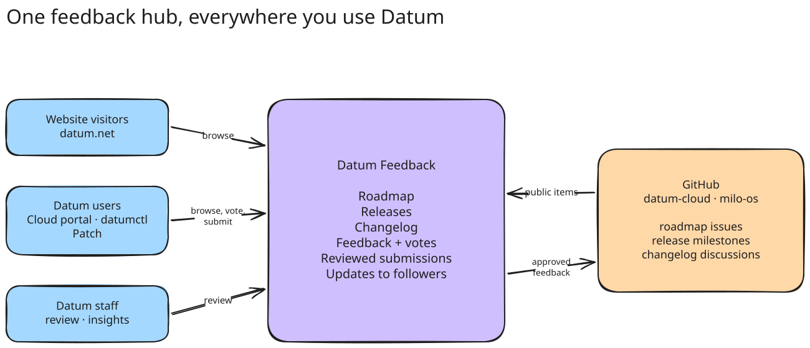
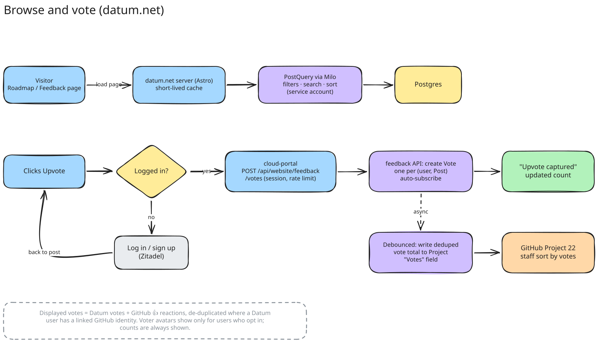
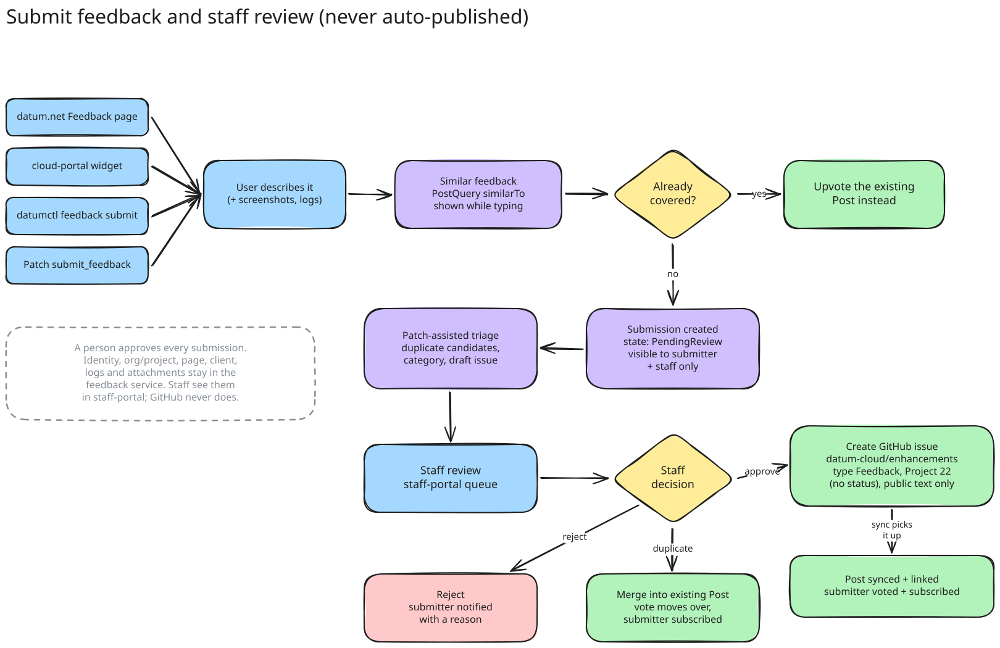
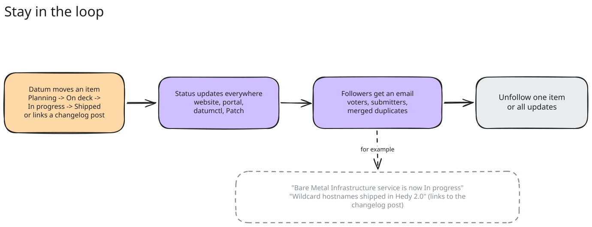

<!-- omit from toc -->
# Platform Feedback

- [Summary](#summary)
- [Motivation](#motivation)
  - [Goals](#goals)
  - [Non-Goals](#non-goals)
- [Proposal](#proposal)
  - [Where it shows up](#where-it-shows-up)
  - [Browse and upvote](#browse-and-upvote)
  - [Share feedback](#share-feedback)
  - [Stay in the loop](#stay-in-the-loop)
  - [Staff review and insights](#staff-review-and-insights)
  - [Product rules](#product-rules)
- [Rollout](#rollout)
- [Alternatives](#alternatives)

## Summary

Datum Feedback is one place for users to see what we're building, tell us what
they want, and follow along as it ships. It brings together the roadmap,
releases, changelog and feature requests, and shows them the same way on the
website, in the cloud portal, in datumctl and in Patch.

GitHub stays the source of truth for the work itself. Feedback pulls public
roadmap items from our two GitHub orgs (`datum-cloud` and `milo-os`) and adds
what GitHub can't give us: votes and submissions tied to Datum users and
organizations, a staff review step before anything goes public, and updates
for the people who asked.

Tracking issue: [datum-cloud/enhancements#889][issue]. Web designs:
[Figma: Roadmap + Backlog][figma]. Technical design will follow in a separate
document.

[issue]: https://github.com/datum-cloud/enhancements/issues/889
[figma]: https://www.figma.com/design/bBEQ8YeTP4SngNl5EkkQdH/Datum---Master-Design-File?node-id=17642-52938

## Motivation

Today users send feedback by email, support ticket or Discord. That works,
but it puts the effort on them: explaining context, checking whether someone
already asked, and finding out whether it's on the roadmap. We get feedback
we can't easily de-duplicate, count, or tie back to a customer.

Each surface has also started solving this on its own. The website talks to
GitHub directly for the roadmap and changelog, the portal has a feedback form
that goes nowhere yet, and datumctl and Patch have nothing. One shared
service means one experience and one set of data.

### Goals

- Anyone can browse the roadmap, releases, changelog and existing feedback,
  and search, filter and sort it, without signing in.
- Signed-in users can upvote items and see what they've voted for.
- Users can share feedback from the website, portal, datumctl or Patch, and
  are shown similar existing items first so they can upvote instead.
- Every submission is reviewed by Datum staff before anything is public.
- Users hear back when something they voted for or submitted changes status,
  ships, or is declined.
- Staff can see who is asking for what, by user and organization.
- The website's Releases, Roadmap, Changelog and Feedback pages are built on
  this service, replacing the website's own GitHub integration.

### Non-Goals

- Comment threads in Datum. Discussion stays on GitHub; every item links to
  it.
- Replacing GitHub for planning. Staff keep working in GitHub issues and the
  Enhancements project.
- Real-time bug fixing or support SLAs. This is not a support channel.
- Exporting feedback to the CRM in the first version.
- Turning Patch's capability-gap reports into submissions. Those stay a
  separate signal for the teams that own each service.

## Proposal

### Where it shows up

*Editable sources for all diagrams are the `.excalidraw` files in
[`diagrams/`](./diagrams).*

| Surface | What users can do |
| --- | --- |
| **datum.net** | Releases, Roadmap, Changelog and Feedback pages per the Figma. Browse without signing in; sign in to vote or submit. |
| **Cloud portal** | A feedback widget available on every page. Organization, project, page and recent errors are attached automatically. Browse and vote in place. |
| **datumctl** | `datumctl feedback search`, `show`, `vote` and `submit`. |
| **Patch** | When a user says something is missing or broken, Patch searches existing feedback, offers to upvote a match, or drafts a submission for the user to confirm. |
| **Staff portal** | Review queue for submissions, and insight into who is asking for what. |

Content comes from three places on GitHub:

- **Roadmap items**: public issues in `datum-cloud` and `milo-os` that are
  tracked on the Enhancements project (project 22). The project's Status
  column drives the item's status.
- **Releases**: milestones in `datum-cloud/enhancements` (Hedy 2.0,
  Lovelace 2.1, ...), with the items in each.
- **Changelog**: posts in the `changelog` Discussions category of
  `datum-cloud/datum`. Items referenced in a post are marked as shipped by
  it.

### Browse and upvote

- **Browse**: the Roadmap groups items by Planning, On deck and In progress.
  The Feedback page lists everything with search, filters for status and
  category, and sorting by most upvotes, newest or trending.
- **Item detail**: title, categories, full description, vote count, voters
  and a link to the GitHub issue.
- **Upvote**: one click when signed in. Signed-out users are sent through
  login or sign-up and returned to the item. Upvoting also follows the item.
  Users can remove their vote.

### Share feedback

1. The user describes the problem or idea, optionally adding screenshots or
   logs. In the portal and Patch, context is attached for them.
2. While they type, similar existing items appear. If one fits, they upvote
   it instead.
3. Otherwise they submit. The submission shows as "Under review" and is
   visible only to them and Datum staff.
4. Staff review it, helped by Patch's suggested duplicates and category. The
   outcome is one of:
   - **Approved**: published as a new public item on the Enhancements
     project, using only the text meant to be public. The submitter is
     counted as its first vote.
   - **Duplicate**: merged into an existing item; the submitter's vote moves
     to it.
   - **Declined**: the submitter is told why.

Nothing a user submits is ever published automatically.

### Stay in the loop

People who voted for or submitted an item follow it. Updates arrive as a
digest email that covers everything that changed since the last one, so a
busy week of planning doesn't mean a flood of emails. An item is included
when:

- the item changes status (for example, moves to In progress);
- it ships in a release or is referenced in a changelog post;
- their submission is approved, merged or declined.

Edits, label changes and GitHub comments aren't included. Every digest links
to unfollow an item or all feedback updates.

### Staff review and insights

Staff get, in the staff portal:

- a review queue of submissions with the submitter's private context
  (identity, organization, project, page, logs, attachments), Patch's
  suggestions, and approve / merge / decline actions;
- for any item, who voted and which organizations they belong to;
- top items by number of organizations asking, not just votes;
- for any organization, everything it has voted for or submitted.

On GitHub, the Enhancements project gets a Votes field so staff can sort
by demand where they already plan.

### Product rules

- **Public vs private.** Only public GitHub issues appear. Submissions and
  everything attached to them stay private to the submitter and staff, even
  after approval.
- **Votes.** The count shown is Datum upvotes plus GitHub 👍 reactions. A
  person is counted once where we can match their Datum and GitHub accounts.
  Someone who 👍s on GitHub without a linked Datum account and also votes in
  Datum is counted twice; we accept that.
- **Voter avatars** are only shown for users who opt in. Counts are always
  shown.
- **Statuses**: None (not yet triaged), Backlog, Planning, On deck, In
  progress, Shipped, Closed. Submissions also have Under review, Merged and
  Declined.
- **Categories** come from GitHub labels: Build, Deliver, Connect, Platform,
  Infrastructure, and AX/DX/UX on changelog posts. An Infrastructure label
  doesn't exist yet and needs adding.
- **Hiding.** Staff can hide an item from Datum Feedback with a GitHub label
  without closing the issue.

## Rollout

1. **Read.** Roadmap, Releases, Changelog and Feedback lists on datum.net,
   from both orgs, replacing the website's direct GitHub integration.
2. **Vote.** Upvoting, login gate, following and email updates.
3. **Submit.** Similar-feedback suggestions, submissions and the staff review
   queue.
4. **Everywhere.** Portal widget, datumctl commands, Patch, staff insights.

## Alternatives

**Keep each surface wrapping GitHub.** This is where we are today. Every
client re-implements fetching, caching and filtering; votes can't be tied to
Datum users; nothing reaches datumctl or Patch.

**Canny or a similar SaaS.** Good voting and roadmap UX, but a second source
of truth next to GitHub, a separate login, and no way into datumctl or
Patch.

**GitHub Discussions or reactions only.** Free, but requires a GitHub
account, can't hold private context, and can't tie demand to Datum
organizations.
