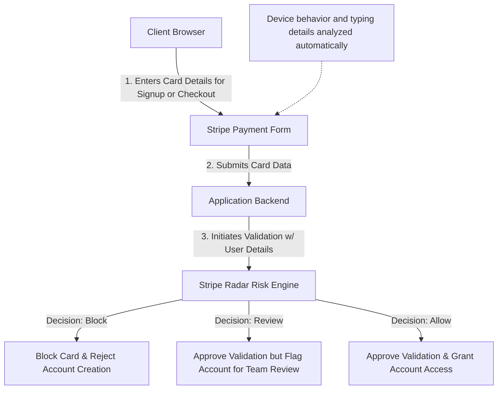

# Research: Fraud, Abuse, and Compliance Mitigation

- [1. Executive Summary](#1-executive-summary)
- [2. Quick Win: Stripe Radar Integration](#2-quick-win-stripe-radar-integration)
  - [2.1 How Stripe Radar Works](#21-how-stripe-radar-works)
  - [2.2 Implementation Flow](#22-implementation-flow)
  - [2.3 Business and Operational Trade-offs](#23-business-and-operational-trade-offs)
- [3. Regulatory Compliance: Sanctions Screening](#3-regulatory-compliance-sanctions-screening)
  - [3.1 OFAC and Sanctions Screening Requirements](#31-ofac-and-sanctions-screening-requirements)
  - [3.2 Screening Implementation Options](#32-screening-implementation-options)
  - [3.3 Managing False Alarms and Minimizing Disruption](#33-managing-false-alarms-and-minimizing-disruption)
- [4. Whitelist / Safe-list Strategy (Cost & Customer Experience Optimization)](#4-whitelist--safe-list-strategy-cost--customer-experience-optimization)
  - [4.1 Designing the Whitelist Layer](#41-designing-the-whitelist-layer)
- [5. Advanced Long-Term Tooling: Specialized Fraud Platforms](#5-advanced-long-term-tooling-specialized-fraud-platforms)
  - [5.1 Overview of Specialized Tools](#51-overview-of-specialized-tools)
  - [5.2 Business Comparison Matrix](#52-business-comparison-matrix)
  - [5.3 Team Setup & Testing Environments](#53-team-setup--testing-environments)
- [6. Proposed Implementation](#6-proposed-implementation)

---

## 1. Executive Summary

As self-service platforms grow, they face various safety and financial risks—including stolen payment cards, fake account registrations, and automated bot systems designed to abuse free trials. To secure the Datum platform and ensure we comply with federal laws, we need a balanced approach that starts with immediate, low-cost safety measures and builds toward advanced behavioral checks over time.

Our proposed strategy is divided into two horizons:

1. **Short-Term Focus (Quick Wins)**: Implement aa higher barrier signup flow; implement Stripe Radar to mitigate payment fraud; improve existing MaxMind functionality and scoring; deploy a free self-hosted name screening tool to comply with OFAC federal regulations; and implement a local whitelist to fast-track trusted enterprise clients and reduce external testing costs.
2. **Long-Term Focus**: Evaluate and integrate specialized fraud tools (such as Sardine, Fingerprint, Darwinium, SEON, or our preferred choice, Castle.io) that analyze device details and mouse/typing behavior to block sophisticated, automated bot networks and multiple account signups.

---

## 2. Quick Win: Stripe Radar Integration

Since we already plans to use Stripe to handle customer payments, using its built-in safety engine, **Stripe Radar**, is our fastest option for blocking payment fraud.

### 2.1 How Stripe Radar Works

Stripe Radar checks every payment or card validation as it happens, using a two-layered defense:

- **Machine Learning Core**: Automatically scores every transaction attempt on a scale of `0` (lowest risk) to `99` (highest risk), based on global patterns seen across millions of businesses.
- **Custom Rules**: Allows us to write custom rules to block transactions, send them to a manual review queue, or require extra verification steps (like requesting a security code from the customer's bank).

### 2.2 Implementation Flow

Radar monitors customer behavior on the checkout or setup page to identify red flags (like rapidly testing multiple cards).

Crucially, **we can capture credit card details during new account creation and perform validation check**. Radar evaluates this validation request in real-time. If the card is flagged as fraudulent or high-risk, we can instantly block the account creation process, preventing bad actors from ever accessing the platform.



#### Key Steps for Success

1. **Standard Checkout Forms**: We must use Stripe's official payment forms on our website. This allows Stripe to analyze device behavior. Custom checkout forms bypass this analysis, which significantly lowers Radar's ability to catch fraud.
2. **Sharing Context**: When a user submits a payment, we pass basic customer info (like signup location and email domain) to Stripe. This helps the system distinguish between a legitimate customer and a bad actor.
3. **Automatic Alerts**: We configure notifications so Stripe can alert our system when a cardholder reports fraud. This allows us to instantly freeze the associated account and prevent further resource abuse.

### 2.3 Business and Operational Trade-offs

- **Pros**:
  - **Easy to Start**: We can use what we already have with Stripe, without needing new vendor agreements or complex setup.
  - **Shared Network Data**: It automatically learns from fraud trends across Stripe's massive global network.
  - **Protects Revenue**: Stops fraudulent transactions before they go through, saving us from losing money to payment disputes.
- **Cons**:
  - **Only Triggers on Payments**: It cannot stop bots, fake accounts, or free-tier resource abuse where no card is entered.
  - **Hidden Scoring Criteria**: Stripe does not share exactly how it calculates its risk scores, making it harder to debug false alarms.

---

## 3. Regulatory Compliance: Sanctions Screening

Compliance with the Office of Foreign Assets Control (OFAC) of the U.S. Department of the Treasury is a non-negotiable legal requirement. We must verify that we are not transacting with or providing services to individuals or entities on active government sanctions lists.

### 3.1 OFAC and Sanctions Screening Requirements

OFAC enforces trade sanctions. U.S. platforms are legally prohibited from providing services to entities listed on the **Specially Designated Nationals (SDN) List** and the **Consolidated Sanctions List (CSL)**.

To satisfy this requirement, the Datum platform must collect:

1. **Full Name** (First Name, Last Name, or legal Corporate Name)
2. **Country of Residence or Incorporation**

### 3.2 Screening Implementation Options

Sanctions screening must be integrated into our onboarding pipeline, balancing cost, accuracy, and latency.

```flow
                  [New User Registration]
                             │
                             ▼
                [Step 1: Check Local Whitelist]
                (Fast-track known corporate SSO)
                             │
                             ▼
                [Step 2: Run Sanctions Check]
               (Compliance-Mandatory Stage)
                             │
                ┌────────────┴────────────┐
                ▼                         ▼
      [Option A: Moov Watchman]  [Option B: Commercial KYC]
      - Self-hosted API          - Hosted SaaS API
      - Free & highly private    - Per-query transactional cost
      - Fuzzy name matching      - Includes identity verification
                             │
                             ▼
        [Step 3: Access Approved or Restricted for Review]
```

#### Option A: Self-Hosted Moov Watchman (Recommended for Phase 1)

[Moov Watchman](https://github.com/moov-io/watchman) is a widely trusted, open-source compliance engine that downloads and parses sanctions lists directly from OFAC, the EU, and UK authorities.

- **Fuzzy Name Matching**: Utilizes approximate search logic to catch names that are misspelled, initialized, or translated differently, preventing basic evasion techniques.
- **Operational Control**: Runs locally within our own infrastructure. This offers excellent performance, zero per-query API costs, and total data privacy.
- **Maintenance**: Requires setting up automated daily updates to pull fresh lists from official government sources.

#### Option B: Commercial Screening SaaS (Sardine, Persona, Socure)

Commercial identity platforms check names against lists and verify identities using secondary details like address histories or date of birth.

- **Cost**: Fees range from $0.10 to $0.50 per check.
- **Value**: Significantly fewer false positives since they verify if the name matches a real, sanctioned individual rather than a coincidental namesake.

### 3.3 Managing False Alarms and Minimizing Disruption

Because of fuzzy name matching, the system will occasionally flag legitimate users who share a name with a sanctioned entity (false positives).

- **Fail-Closed Security**: If the sanctions checker is offline, compliance regulations require that we halt approval and flag the user for manual review rather than letting them bypass the check.
- **Review and Override Workflow**: When a potential match is flagged, the system restricts the account and alerts our compliance team. An operator reviews the user's details (such as requesting country of origin or middle names) and can manually override the restriction to grant access.

---

## 4. Whitelist / Safe-list Strategy (Cost & Customer Experience Optimization)

A local whitelist (or safe-list) check is a simple, highly effective optimization. It allows trusted users to bypass expensive fraud checks, saving money and improving the signup experience.

### 4.1 Designing the Whitelist Layer

The whitelist operates as an instant pre-check before any external third-party API is called. We structure the whitelist around several categories:

- **Enterprise Domains**: Fast-track users registering with verified corporate domains (e.g., `@datum.com`, `@amberflo.io`).
- **Trusted IP Ranges**: Allow signups from known office locations or dedicated partner network gateways.

### 4.2 Orchestration and Short-Circuit Logic

By checking the whitelist first, we can dynamically skip subsequent fraud checks.

```text
       [User Onboarding Event]
                  │
                  ▼
    ┌───────────────────────────┐
    │  STAGE 1: Local Whitelist  │
    └─────────────┬─────────────┘
                  │
         Matches Whitelist?
         ├── YES ──► [Skip General Risk Checks] ──┐
         └── NO  ─────────────────────────────────┼─► ┌─────────────────────────────┐
                                                  │   │ STAGE 2: External Risk API  │
                                                  │   │ (e.g., MaxMind / Fingerprint)│
                                                  │   └──────────────┬──────────────┘
                                                  │                  │
                                                  │            Risk Score < 70?
                                                  │            ├── YES ──► Proceed
                                                  │            └── NO  ──► Block / Review
                                                  ▼
                                      ┌───────────────────────────────┐
                                      │ STAGE 3: Sanctions Screening  │
                                      │ (Moov Watchman - Always Runs) │
                                      └───────────────────────────────┘
```

By structuring the pipeline this way, we protect the user experience and only incur external checking costs when the customer is unverified.

---

## 5. Advanced Long-Term Tooling: Specialized Fraud Platforms

As automated attacks become more sophisticated—using generative AI to mimic natural mouse paths, variable typing speeds, and rotating proxy connections—static filters (like checking location or email age) are no longer enough. Long-term protection requires specialized behavioral and device profiling tools.

### 5.1 Overview of Specialized Tools

- **Sift**: A mature, consolidated market leader in risk decisioning. It leverages a massive global identity network and behavioral analysis to detect fraud. However, its implementation typically requires a longer setup timeline, and its risk models are proprietary and opaque.
- **SEON**: Focuses on "digital footprints." It checks if a user's email or phone number is linked to active accounts on over 50 social media sites (LinkedIn, Netflix, Airbnb, etc.). Bots and synthetic identities rarely have a realistic social footprint.
- **Fingerprint**: The market leader in device identification. It assigns a unique, permanent identifier (`visitor_id`) to every device, allowing us to recognize when a user is creating multiple accounts from the same machine even if they clear cookies or use private browsing.
- **Sardine**: Provides continuous behavioral biometrics. It monitors how a user interacts with a page (mouse paths, typing speed, touchscreen pressure) to differentiate real human users from bots.
- **Darwinium**: Operates directly at the network perimeter (CDN level). It inspects traffic and monitors form interactions before they ever reach our application servers, filtering out bad actors early.
- **Castle.io** (Preferred / Recommended): Uses short-lived request tokens to evaluate account registration risks in real time, focusing on multi-accounting and bot detection. It is one of our favorite approaches because it is the only platform with a clear focus on a developer-first experience with transparent, self-service pricing.

### 5.2 Business Comparison Matrix

The matrix below highlights the key business and operational traits of each specialized tool:

| Platform | Primary Focus | Best Use Case | Sandbox Accessibility | Operational Impact |
| --- | --- | --- | --- | --- |
| **Sift** | Risk Decisioning & Global Identity Network | Enterprise-wide fraud decisioning w/ massive historical data | **Gated**: Requires sales engagement and onboarding | Extended setup timeline; high visibility of global fraud trends. |
| **SEON** | Social Footprint & Identity Enrichment | Verifying new emails and phone numbers for synthetic fraud | **Immediate**: Self-service account setup and testing | Medium integration complexity; adds valuable data to manual reviews. |
| **Fingerprint** | Persistent Device Identification | Detecting multi-accounting and linked accounts | **Immediate**: Includes interactive browser playgrounds | Low integration complexity; highly stable tracking metrics. |
| **Sardine** | Behavioral Biometrics & Transaction Fraud | Stopping advanced AI bots and high-risk financial fraud | **Gated**: Requires business verification (KYB) | High integration complexity; excellent protection for high-value features. |
| **Darwinium** | Perimeter Security (Network Edge) | Blocking automated registration attacks before they hit servers | **Immediate**: Code generator inside a testing console | Low backend changes; requires managing CDN-level routing. |
| **Castle.io** (Preferred) | User Lifecycle & Token Filtering | Rapid registration security and account takeover protection | **Immediate**: Quick access to test keys and mocks | Low integration complexity; developer-first experience with clear pricing. |

> [!NOTE]
> **Why Castle.io is our Preferred Long-Term Tool**:
> In contrast to other enterprise platforms that require sales-led verification (KYB) and custom contract negotiations just to get started, Castle.io stands out for its developer-first approach. It is the only platform that offers fully transparent public pricing and immediate sandbox access, making it highly attractive for fast engineering integration.

### 5.3 Team Setup & Testing Environments

The ease of setting up test environments directly impacts our development speed.

- **Self-Provisioned Sandbox**: Platforms like **SEON**, **Fingerprint**, **Castle**, and **Darwinium** allow developers to sign up and get credential keys immediately. They provide pre-built playgrounds (like Fingerprint's Stackblitz integration) and mock tokens to test different risk decisions (`approve`, `review`, `deny`) in local environments.
- **Gated Environments**: Platforms like **Sardine** and **Sift** require formal business verification (KYB) or sales-led onboarding before issuing credentials, meaning they take longer to set up initially for testing.

---

## 6. Proposed Implementation

To build our fraud prevention system efficiently, we recommend a phased approach that starts with immediate low-cost compliance and progresses to advanced behavioral defenses.

### Phase 1: The Core Foundation

- **Objective**: Establish regulatory compliance (OFAC) and transaction-level safety.

- **Action Items**:
    1. Deploy **Moov Watchman** locally to handle name screening against global sanctions lists during registration.
    2. Implement a local **whitelist check** for verified enterprise corporate emails and OIDC logins, ensuring a fast path for trusted clients.
    3. Define custom rules in **Stripe Radar** to automatically block high-risk cards and require verification for cross-border transactions.

### Phase 2: Scoring Calibration & Observation

- **Objective**: Prevent trial abuse and multi-accounting using current architecture.

- **Action Items**:
    1. Calibrate the existing **MaxMind minFraud** integration. The system already has device tracking in place via the browser-level `maxmind-tracking-token` (injected by the frontend and resolved through Zitadel session annotations).
    2. Set the fraud engine to run in **Observe Mode**—this records scores and logs events without actively blocking users, allowing us to calibrate our thresholds and avoid false positives.

### Phase 3: Perimeter Defense & Castle.io Integration

- **Objective**: Prevent automated registration and bot spam at the network perimeter, utilizing advanced developer-first tooling.

- **Action Items**:
    1. Integrate and transition to **Castle.io** (our preferred developer-first choice) or **Darwinium** edge workers to intercept traffic before it hits backend application servers.
    2. Introduce behavioral profiling to identify AI-driven bots simulating user inputs.
