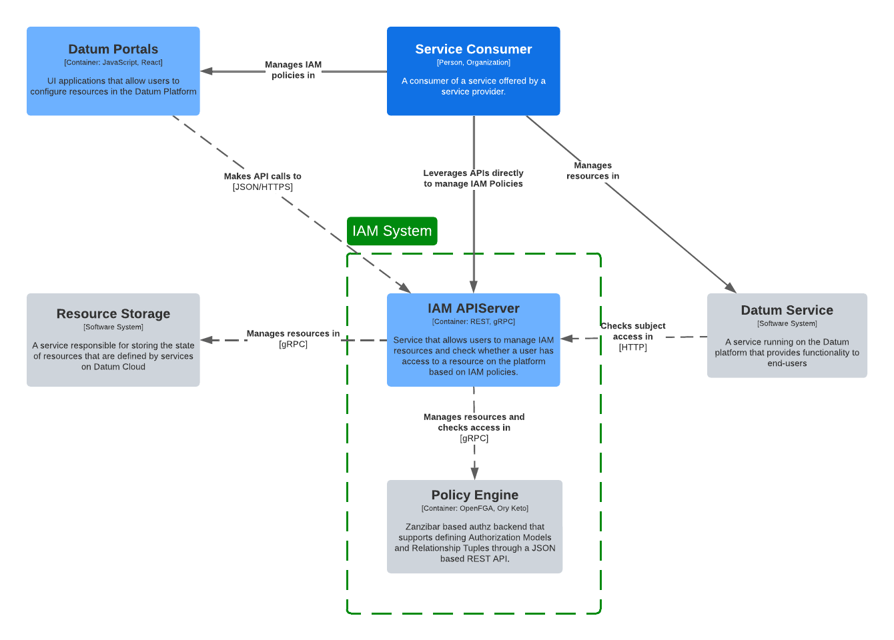

<!-- omit from toc -->
# Identity and Access Management

- [Overview](#overview)
- [System Architecture](#system-architecture)
  - [Authentication](#authentication)
  - [Authorization](#authorization)
- [Components](#components)
  - [IAM APIServer](#iam-apiserver)
- [Concepts](#concepts)
  - [Services](#services)
  - [Roles](#roles)
  - [Policies](#policies)

## Overview

The Identity and Access Management (IAM) system is responsible for managing
authentication, authorization, and identity governance across all resources
within the Datum Cloud platform. This document provides a high-level
architecture overview of the IAM system and serves as a reference for
understanding its core components and how they interact.

This document is intended to serve as a parent overview, with links to detailed
documentation for individual components and enhancements made to the IAM system
over time.

## System Architecture



### Authentication

The authentication feature is responsible for identifying all users and machines
that are accessing the Datum Cloud platform. Users are expected to authenticate
with a trusted Identity Provider (e.g. Google, GitHub) or an Identity Provider
configured for their Organization.

Read over the [Authentication enhancement](./authentication/) for more
information.

### Authorization

The authorization feature is responsible for determining whether an
authenticated client is allowed to perform a request against services deployed
on the Datum platform. Services are expected to register their resources and the
permissions they want available with the IAM system. The IAM system will
configure the policy engine to enable checking whether a client has a permission
on a resource. Permissions are assigned to Roles which are bound to IAM subjects
through IAM policies.

Roles are also inherited when IAM policies are bound to parent resources like
Organizations and Projects. Read through the [service provider platform
enhancement](../service-provider-platform/) for more information.

> [!NOTE]
>
> An enhancement will be written in the future on the full functionality of the
> current policy engine built into the Datum Cloud IAM system. The IAM system is
> currently using [OpenFGA], but it can easily be updated to support additional
> Zanzibar type policy engines in the future.
>
> For now, refer to the [IAM documentation in Datum OS](iam-datum-os).

[OpenFGA]: https://openfga.dev
[iam-datum-os]: https://github.com/datum-cloud/datum-os/blob/main/docs/apiserver/iam/README.md

## Components

### IAM APIServer

The IAM APIServer provides users with API endpoints that manage IAM
functionality on the Datum platform that aligns with our platform. Below is a
non-exhaustive list of capabilities that will be added to the IAM API Server
over time.

- User management in an organization
- Service account management in a project
- IAM policy management for all resources
- IAM role / permission management for services
- IAM access check functionality

## Concepts

The IAM system introduces the following concepts to support managing access to
resources.

- **Role**: Provides a set of permissions that can be bound to subjects through
  an IAM Policy. Service producers can create roles that consumers can leverage
  to assign their users appropriate access to resources. Consumers will
  eventually be able to create their own custom roles.
- **Policy**: Supports binding subjects to a role on a specific resource.
  Permissions bound to the resource by the role are inherited by all child
  resources.
- **Service**: A service that leverage the IAM System to manage access to its
  resources. Services are required to register their resources and the
  permissions that are expected to be supported on each resource.
- **Service Resource**: A resource provided by a service that can be managed by
  a service consumer. Resources can have one or more permissions supported in
  the IAM system to manage access to the resource.

### Services

Services are registered with the IAM service to configure how the service will
use the IAM system to check access to resources. The service is expected to
register resources with the permissions that it anticipates doing access checks
against on the resource or parent resource in the hierarchy.

Here's an example of an IAM service that registers organization and project
resources for the resource manager service:

```yaml
serviceId: resourcemanager.datumapis.com
name: services/resourcemanager.datumapis.com
displayName: Datum Resource Manager
spec:
  resources:
    - type: resourcemanager.datumapis.com/Organization
      plural: organizations
      singular: organization
      permissions:
        - list
        - get
        - create
        - update
        - delete
      resourceNamePatterns:
        - "organizations/{organization}"
    - type: resourcemanager.datumapis.com/Project
      plural: projects
      singular: project
      permissions:
        - list
        - get
        - create
        - update
        - delete
        - patch
        - watch
      resourceNamePatterns:
        - "projects/{project}"
      parentResources:
        - resourcemanager.datumapis.com/Organization
```

### Roles

A role can be used to group permissions that will be applied to a subject in the
IAM system through [IAM policies](#policies). The permission reference should
use the fully qualified reference to the permission which is in the format
`{service}/{resource}.{permission}`.

Here's an example of a role that would grant a user admin access to manage a
project.

```yaml
name: services/resourcemanager.datumapis.com/roles/projectAdmin
roleId: projectAdmin
parent: services/resourcemanager.datumapis.com
uid: ed338c32-adf8-4702-b856-1410ec47158a
displayName: Project Admin
createTime: "2024-12-13T23:42:32.814265447Z"
spec:
  includedPermissions:
    - resourcemanager.datumapis.com/projects.list
    - resourcemanager.datumapis.com/projects.get
    - resourcemanager.datumapis.com/projects.create
    - resourcemanager.datumapis.com/projects.update
    - resourcemanager.datumapis.com/projects.patch
    - resourcemanager.datumapis.com/projects.watch
    - resourcemanager.datumapis.com/projects.delete
```

### Policies

An IAM Policy can be created for a resource to bind one or more roles to a list
of subjects. The name of the IAM policy must match the fully qualified resource
URL of the resource the IAM policy applies to.

```yaml
name: resourcemanager.datumapis.com/projects/{project-name}
spec:
  bindings:
    - role: services/iam.datumapis.com/roles/serviceAccountAdmin
      members:
        - serviceAccount:iam-operator@datum-cloud.iam.datumapis.com
```

The IAM system supports using the following subject formats to assign roles:

- `user:<user-email>` grants a role to a specific user
- `serviceAccount:<service-account-email>` grants a role to a specific service
  account

In the future we will also support the following formats to support additional
use-cases.

- `group:<group-email>` grants a group in the IAM system access to a role
