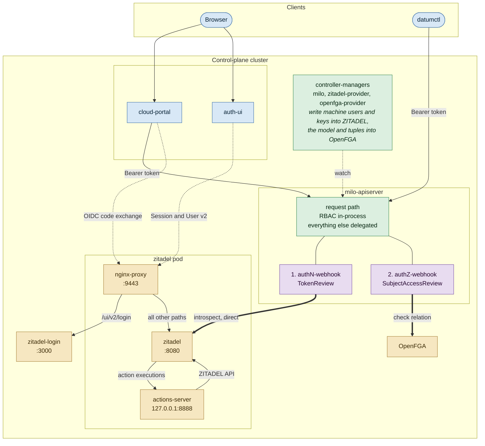
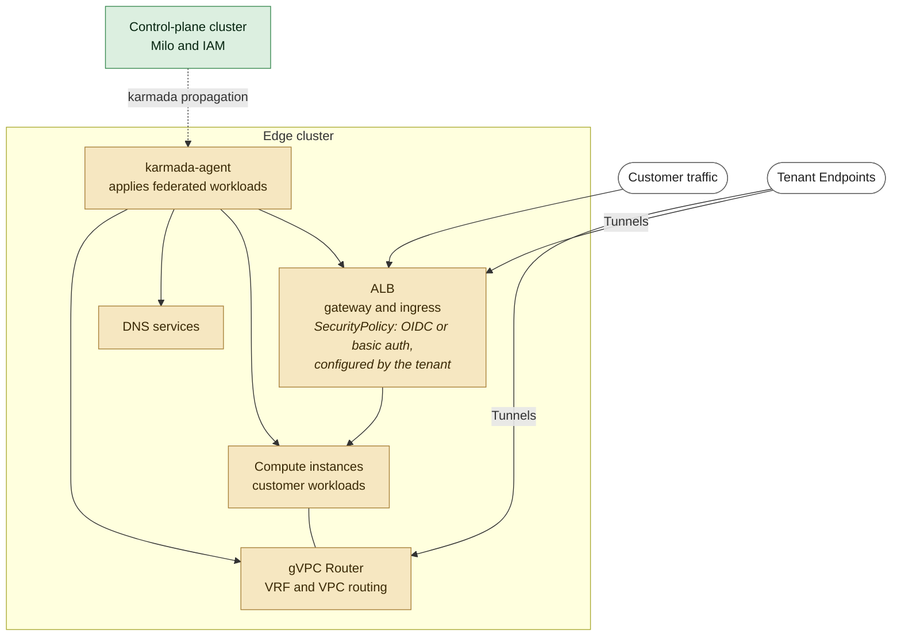
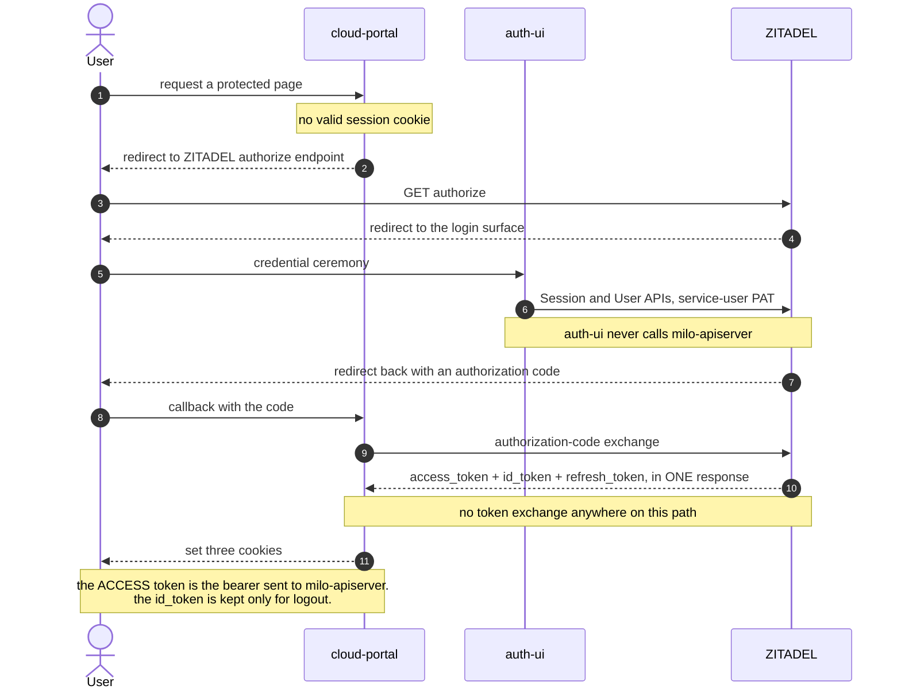
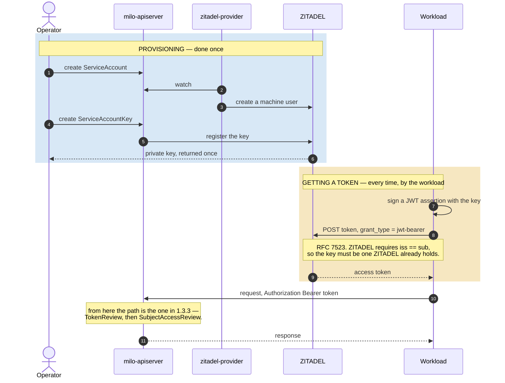
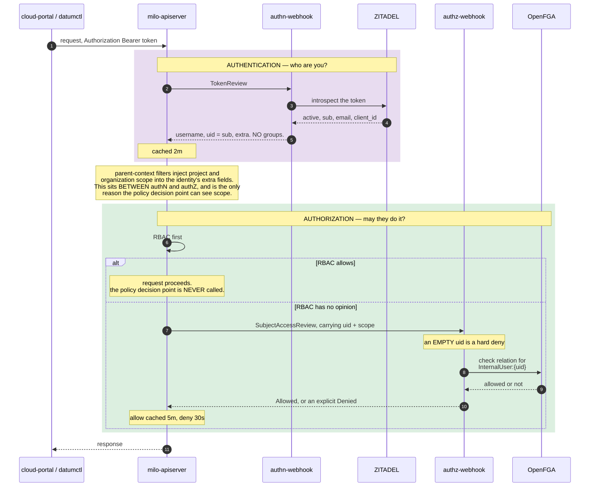

# Datum Cloud IAM — architecture and use cases

**Status** Draft · **Started** 2026-09-01

This document is the **top-level guide only**: IAM in Datum Cloud IAM today, and which use cases we may
target next. It stays high level on purpose. Each use case gets its own companion document, and those
carry the detail, the trade-offs and the implementation cost.

**Companions**

| Document | Covers |
|---|---|
| [`W1-workload-identity-federation-PRD.md`](W1-workload-identity-federation-PRD.md) | **The W1 use case in full** — problem, scenarios, requirements, and six design options with trade-offs and a recommendation |
| [`auth-sequence.md`](auth-sequence.md) | The request path at file-and-line detail, with a confidence rating for every step |

Further engineering records sit behind these — the evidence for the W1 design decisions, a data-plane
BYO-IdP analysis, and the original seven-problem assessment. They are working notes rather than proposals
and are not published alongside this document; ask if you want them.

**If you are in a hurry, jump to the [TL;DR of this document](#3-tldr).**

Rendered copies of every diagram are in [`diagrams/`](diagrams/), for slides and for anywhere mermaid
does not render. The fenced blocks below are the source and the PNGs are generated — edit a block, then
regenerate, or the render goes stale silently. Never hand-edit a PNG.

<details><summary>Regenerate the renders</summary>

Two steps: extract each fenced block to a file, then render each file. The names below match the order the
blocks appear in, which is the order of the sections.

```bash
cd <the directory holding this document>
python3 - <<'EXTRACT'
import re
s = open("IAM-architecture-and-use-cases.md", encoding="utf-8").read()
blocks = re.findall(r"^```mermaid\n(.*?)^```$", s, re.M | re.S)
names = ["1-control-plane", "2-edge", "3-login", "4-workload", "5-api-call"]
assert len(blocks) == len(names), f"expected {len(names)} blocks, found {len(blocks)}"
for n, b in zip(names, blocks):
    open(f"/tmp/{n}.mmd", "w", encoding="utf-8").write(b)
EXTRACT

for n in 1-control-plane 2-edge 3-login 4-workload 5-api-call; do
  docker run --rm -u "$(id -u):$(id -g)" -v /tmp:/data -v "$PWD/diagrams:/out" \
    ghcr.io/mermaid-js/mermaid-cli/mermaid-cli:latest \
    -i "/data/$n.mmd" -o "/out/$n.png" -b white -w 1600
done
```

The `assert` is the point: add or remove a block without updating `names` and the extraction fails loudly
rather than silently renaming your diagrams.

</details>

**How to read the provenance lines.** Every diagram below carries one line naming where it came from.
`[measured]` means read from source or from a running deployment, and reproducible. `[obs: infra]` means
read from the infrastructure repository, the only place production configuration exists. `[docs]` means taken
from a vendor's published documentation and **not** independently verified. `[reported]` means supplied by
the team and not independently checked.

---

# 1. The architecture today

## 1.1 Control plane



> **`[measured]`, except where noted.** The ZITADEL pod's three containers, the nginx routes, the
> actions-server's address, and the endpoint each Datum service dials were all read from the running cluster
> on 2026-09-17.
>
> **Four things the picture exists to carry.**
>
> 1. **milo-apiserver contains no authentication and no authorization code.** It re-composes the upstream
>    kube-apiserver chain and delegates both decisions. The two webhook boxes sit on its request path.
> 2. **RBAC is consulted first and an RBAC allow ends the request** — the policy decision point is never
>    called for it.
> 3. **The authN-webhook reaches the `zitadel` container directly and does not pass through `nginx-proxy`.**
>    Every Datum service dials `svc/zitadel` (443 to 8080). `nginx-proxy` (`svc/zitadel-proxy`, 443 to 9443)
>    fronts **browser traffic only**, splitting `/ui/v2/login` to `zitadel-login` from everything else.
>    Drawing the webhook through the proxy would be wrong.
> 4. **The actions-server sidecar is bidirectional.** ZITADEL calls *in* over loopback when an action
>    execution fires; the sidecar calls *out* to ZITADEL's API with its own key.
>
> **Two boundaries.** `cloud-portal` and `auth-ui` are **`[obs: infra]`** — they are not deployed in the test
> cluster, and their arrows come from `infra/apps/cloud-portal` and `infra/apps/datum-iam-system`. And
> **no action target or execution is registered on this cluster**, so the inbound arrow to the actions-server
> is architectural, not currently exercised.

## 1.2 Edge



> **`[reported]` component set, `[obs: infra]` composition, `[docs]` for the ALB policy.** The components are
> as the team named them. `infra` independently confirms edge overlays for `compute-system`,
> `galactic-system`, `dns-operator` and `datum-auth-dns`, and karmada propagation through
> `network-services-operator`. What runs *inside* the compute and networking boxes is **unconfirmed**: the
> `compute` and `network-services-operator` repositories are not on this disk.
>
> **Edge authentication exists, and an earlier draft of this document was wrong to say it did not.** Datum's
> ALB supports OIDC and basic authentication through Envoy Gateway's `SecurityPolicy`, attached by
> `targetRefs` to an `HTTPRoute` and **enforced at the edge**. The tenant configures it with `datumctl`
> against their own provider — Google, Auth0, or a user list. **`[docs]`** — Datum's published ALB guides.
>
> **The correct statement is therefore not "no IAM at the edge" but "edge authentication is tenant-owned and
> is not integrated with Datum's IAM."** Different claim, different consequence: there *is* an enforcement
> point, it just has no relationship to `PolicyBinding`, OpenFGA, or any Datum principal.
>
> **One operational trap worth carrying.** A Secret referenced by a gateway policy must be labelled
> `networking.datumapis.com/gateway-sync: "true"` or it does not reach the edge — the policy syncs and the
> credential does not, which presents as HTTP 500.

## 1.3 The IAM flows

Three flows, because they differ in how the caller gets a token. Once a token exists, all three converge on
the same path — drawn in full once, in 1.3.3.

### 1.3.1 Human login



> **`[measured]`** — read from `cloud-portal` and `auth-ui` source. The access token, not the ID token, is
> what travels to milo-apiserver, and therefore the access token's `sub` is what the whole authorization
> model keys on.

### 1.3.2 Workload identity and service accounts



> **`[measured]`** — the provisioning path and the JWT-bearer grant are exercised on the running cluster.
> The `iss == sub` constraint was measured against ZITADEL v4.12.2 on 2026-09-17 and is **stronger than the
> vendor documentation states**: a foreign issuer's token is refused before any key lookup. **This is the
> constraint that shapes every federation option**, and the two federation companions price it.

### 1.3.3 An authenticated API call

This is the path every caller shares.



> **`[measured]`** — the filter order, the RBAC short-circuit, the empty-`uid` deny and the cache values were
> all read at source; the allow-and-discriminate behaviour is re-runnable as a
> single command on the engagement's test cluster. **The username plays no part in the decision.** Authorization keys entirely on `uid`.

**What this section establishes, in one line each.**

- A caller's identity is a **ZITADEL token**, and its `sub` becomes the `uid` that authorization keys on.
- Authentication and authorization are **two independent out-of-process calls**, neither of which Milo implements.
- A workload today needs a **long-lived Datum-issued key**, because ZITADEL will not accept a foreign issuer's token.

---

## 1.4 Four constraints that bound every use case

These are properties of the system as built, not of any proposal. Each was measured (§1.3), and every
use case in §2 is bounded by them.

1. **Authorization sees one field.** Authentication hands authorization a flat
   `{username, uid, groups, extra}` record; the policy decision point keys entirely on **`uid`**, and an
   empty `uid` is a hard deny. Any new principal shape has to live in that field.
2. **RBAC is consulted first and short-circuits.** Any test of a new identity's *authorization* must use a
   path RBAC has no route to, or it proves nothing.
3. **Humans and machine accounts already collapse into one OpenFGA type.** That type means "an identity
   token", not "a human" — which is why a namespaced principal string inside it is consistent with how the
   system already works.
4. **Datum operates a token endpoint but does not implement one.** The identity provider is a deployment
   Datum runs, so the endpoint is Datum's to *configure* — but its *behaviour* is the provider's, and the two
   constraints above are not configurable away. Anything the provider will not do — accepting a foreign
   token, minting a token for an identity it does not hold a key for — needs either a change to the provider
   itself or a new Datum-built service in front of it. **Neither is a configuration change.**

One figure worth carrying into any revocation discussion — **and say which system you mean**. Production
sets no authorization cache TTL, so the upstream default applies and an already-granted decision survives
deletion of its `PolicyBinding` for up to **five minutes**. **A test deployment need not inherit it**: the
engagement's build sets `--authorization-webhook-cache-authorized-ttl=10s` deliberately, so a probe there
measures **10 seconds**. Neither number is wrong; they describe different systems, which is why the figure
should always be quoted with the deployment it came from.

---

# 2. Use cases

**Where these come from.** "Workload identity" at Datum is not one problem but seven distinct trust
relationships, first enumerated in an earlier platform assessment and kept here under the same `W1`–`W7`
labels. They differ on two axes that decide which mechanisms are even available: **direction** — whether
Datum must *verify* a foreign token or *present* one — and **modifiability** — whether Datum controls both
ends of the conversation or only one. Conflating them is the most common error in this area, so the table
below keeps them apart.

**Terminology is not final.** The labels are retained for continuity with earlier work. §2.2 shows where
`W4` in particular no longer fits Datum's shape; reframing them in Datum's own terms is a separate exercise.

## 2.1 The seven use-case scenarios

| # | The problem | Notes |
|---|---|---|
| **W1** | **External platform → Milo control plane.** A customer CI/CD job, SaaS or cloud function calls the Milo API. Federating-in. | **Limited by ZITADEL constraints.** ZITADEL's RFC 7523 grant requires the token's issuer and subject to be the **same value**, and checks that *before* resolving the signing key. A CI platform's token names the platform in its issuer and the workload in its subject, so it can never satisfy that, and no amount of key registration changes it. **The long-lived Datum key in use today is a consequence of that constraint, not a design preference.** This is the only use case with a written design — see the **W1 PRD**, which carries the problem, scenarios, requirements and six design options |
| **W2** | **Platform workload → project control plane.** Datum's own operators and controllers reaching Milo or a project control plane | **Unaddressed, and defects of this exact shape are already appearing.** These components authenticate by *possessing a kubeconfig*, or by falling back to whatever ambient credentials their pod happens to carry — there is no workload identity to present. A concrete example: the ZITADEL actions-server sidecar is given no control-plane kubeconfig, so its Kubernetes client silently falls back to the cluster it runs in, which is **not** the cluster holding Milo's resources. Two further components were found with the same fallback. Each is fixable individually, but the recurrence is the point: **there is no identity for them to use, so every component invents its own arrangement** |
| **W3** | **Platform workload → platform workload.** Datum services authenticating to each other | **Unaddressed.** The single genuine mutual-TLS link on the platform is **CA-based, not identity-based**: any certificate that CA signed is accepted, so the channel proves the peer is *inside the platform* but cannot tell **which** workload it is. Everything else is a bearer token or unauthenticated. This is a **Critical** element that limits lateral-movement from a breach within the Datum infrastructure, and Datum controls both ends here and many of the building blocks are already in place, so good options are available — they simply have not yet been built |
| **W4** | **Tenant workload → tenant workload**, in the data plane. **Four distinct scenarios, (a)–(d) — see §2.2** | **An enforcement point exists, but it is the tenant's, not Datum's.** The ALB supports OIDC and basic authentication through an Envoy Gateway `SecurityPolicy`, enforced at the edge and **configured by the tenant against their own provider**. It has no relationship to Datum's IAM — no policy binding, no Datum principal. Two structural limits shape anything built here: the edge gateway performs Full-NAT, so a backend never learns the real client address and identity policy must therefore be evaluated *at or before* the gateway; and only two of the four paths in §2.2 pass the ALB at all — the other two have no enforcement point today. BYO-IdP/BYO-Issuer (via WorkloadIdentityIssuer config) defined for W1 could be leverageable for W4 too, but requires additional design artifacts for scale and propagation to the edge - requires further thinking |
| **W5** | **Tenant workload → Milo control plane.** A customer workload running on Datum compute provisions for itself | **Nothing today, but mechanically easier than W1 despite looking the same.** W1 must accept an issuer Datum does not control; W5's caller runs **on Datum's own compute**, so both ends are modifiable and a short-lived, audience-scoped token issued by Datum's own substrate is available. Solving W1 produces most of the machinery W5 needs, so these should be sequenced together rather than designed independently |
| **W6** | **Datum → external cloud.** Datum automation authenticating outward to AWS, GCP or on-prem. Federating-out. | **Not built, and it is the mirror image of W1 rather than a variant of it.** W1 asks Datum to *verify* someone else's token; W6 asks Datum to *present* one and be verified by a foreign party. That needs Datum to **be** an issuer — publishing a discovery document and public key set, and minting assertions — which shares the name "federation" and almost none of the machinery. ZITADEL's documentation describes exactly this pattern for Google Cloud, with the cloud trusting ZITADEL as an external provider; that is vendor documentation and Datum has not exercised it |
| **W7** | **Agent → API**, acting autonomously or on a person's behalf — the CLI's AI mode, an MCP client, a scheduled agent | **The agent is the user, which is the worst of both worlds.** It presents the invoking person's own full-scope token, so there is no distinct identity to attribute an action to *and* no bound on what it may do. A standard representation for "acting on behalf of" exists — an **actor claim** carried inside an exchanged token, naming the delegate separately from the subject — but nothing on the platform produces one today. Note also that Datum's MCP server is the natural place for this to live and has not yet been assessed yet. Similarly, there are many emerging standards (ID-JAG, AAuth, etc.) yet to gain widespread adoption - ideally these can be plugged in to the Datum architecture if/when deemed appropriate. |

### 2.1.1 Where these overlap

The seven are not disjoint, and two of the overlaps change what "solving" one of them means.

**`W5` and `W7` are orthogonal questions about the same call, not alternatives.**

- **`W5` asks how the caller proves who it is.** Its caller runs on Datum compute, so both ends are
  modifiable and a projected ServiceAccount token is available.
- **`W7` asks on whose authority it acts** — itself, or a human who asked it to.

An agent running on Datum compute and calling the Milo API is **both at once**. If it acts autonomously, W5's
answer is sufficient and W7 adds nothing. If it acts *for* a user, both are needed: W5 gives it an identity,
W7 bounds the authority that identity carries. **Solving either leaves the other open.**

The sharp version: **`datumctl ai` today has neither.** It presents the invoking user's own full-scope token —
no distinct identity to attribute an action to, and no bound on what it may do. That is the worst corner of
both problems, and it is why an "agent identity" discussion that only picks one of the two will not close it.

**`W2` and `W3` blur for a different reason** — a Datum service reaching milo-apiserver and two Datum
services reaching each other are the same trust problem with different endpoints. Splitting them by endpoint
has not yet bought anything.

## 2.2 W4: the different tenant-workload to tenant-workload paths

**`W4` is not one problem. It is a family, and the axis that separates them is *how the peer is reached* —
because that is what decides where a policy could be enforced at all.**

| Path | Tenant workload runs | Reaches its peer via | Where enforcement could sit |
|---|---|---|---|
| **a** | Datum compute — unikraft, Kata | the **ALB**, fronting compute | the ALB's `SecurityPolicy` (exists today, tenant-owned) |
| **b** | partner-hosted compute on the internet | **Tunnels** terminating on the **ALB** | the ALB, same as (a) — but the peer is outside Datum's substrate |
| **c** | one partner-hosted location, talking to another | the **gVPC Router**, which both attach to | the gVPC router. **No authentication component sits here today** |
| **d** | partner-hosted, reaching the gVPC | **Tunnels** terminating on the **gVPC Router** | the gVPC router, same as (c) - peer is outside Datum's substrate |

**Some things this table makes visible.**

1. **(a) and (b) have an enforcement point; (c) and (d) do not.** Everything fronted by the ALB can carry a
   `SecurityPolicy`. Traffic that goes tenant-to-tenant through the gVPC router never passes the ALB, so
   there is nothing on that path today that could evaluate identity.
2. **Datum's ownership differs across all four.** Datum owns the substrate in (a), only the tunnel in (b) and
   (d), and only the routing fabric in (c) — which bounds what any future proposal can assume about
   attestation.
3. **The Tenant workload could be an Agent, a delegated agent, or an application (possibly even generated dynamically by an agent)**
   - each of these scenarios might require customer/tenant control of the IAM technology and policy framework choice.
   Likely a service opportunity for Datum. For e.g., facilitate customer/tenant ByoIDP and ByoPolicy supported
   with a scalable design to propagate IdentitySet memberships to the edge (for IAM/Policy rulesets to act on for
   security or traffic management of tenants).
4. **Mapping Tenant workload identity to Datum gVPC primitives** has interesting potential for additional
   service offerings such as identity-guided gVPC routing, security, filtering, redirection, shadowing, etc.


## 2.3 Priority and Roadmap

**W1 / federating-in remains the first prototyping priority.** It is the only use case with a written
design, and the one whose answer constrains several of the others. The roadmap sequencing the remaining six
is built separately and is not part of this document.


---

# 3. TL;DR

**Datum IAM today, in three sentences.** A caller's identity is a token from Datum's IdP (Zitadel), and
its subject becomes the single field that authorization keys on. Authentication and authorization are two
independent out-of-process calls (via TokenReview and SubjectAccessReview), neither of which the API server 
implements itself. A workload that is not a person currently needs a long-lived Datum-issued key, because 
Zitadel will not accept a token from anyone else.

**The seven identity scenarios**

| # | The problem | Where it stands | Design document |
|---|---|---|---|
| **W1** | An **external platform** calls the Datum API — a CI pipeline, a cloud function, a controller in a customer's own cluster. Federating-in | **Design being brainstormed now.** Today it needs a long-lived Datum key, and that is forced by the identity provider rather than chosen | **[`W1-workload-identity-federation-PRD.md`](W1-workload-identity-federation-PRD.md)** |
| **W2** | A **platform workload reaches a project control plane** — Datum's own operators and controllers | Possession of a kubeconfig is the entire trust. A live instance exists where a component falls back to whatever ambient credentials its pod holds | *PRD not yet written* |
| **W3** | **Platform workloads authenticate to each other** | Essentially unaddressed. The one real mutual-TLS link is CA-based, not identity-based — any certificate that CA signed is accepted, so it cannot tell one workload from another | *PRD not yet written* |
| **W4** | **Tenant workload to tenant workload**, in the data plane | Four distinct paths (§2.2). Two are fronted by the ALB (potentially accessed via Datum Tunnel) and can carry a tenant-configured policy; two go through the gVPC router and have no enforcement point at all | *PRD not yet written* |
| **W5** | A **tenant workload on Datum compute** provisions for itself through the Datum API | Nothing today. Unlike W1, Datum controls both ends, so a projected token or attestation is available | *PRD not yet written* |
| **W6** | **Datum authenticates outward** to AWS, GCP or on-prem | Nothing built. Needs Datum to *be* an issuer — publish discovery and a key set, and mint assertions — which is a different capability from validating tokens inbound. Federating-out. | *PRD not yet written* |
| **W7** | An **agent calls the API**, autonomously or for a person | The agent presents the invoking user's own full-scope token: no distinct identity, and no bound on what it may do | *PRD not yet written* |

**W1 — Federating-in Workload Identity.** Let an external workload authenticate with the short-lived token its own
platform already issues, so no Datum credential exists outside Datum; the problem, scenarios, requirements
and six design options are in
[`W1-workload-identity-federation-PRD.md`](W1-workload-identity-federation-PRD.md).

**The suggested W1 approach.** Adopt the existing Enhancement proposal with its open questions closed — the
PRD's Option 2 — validating the foreign token in Datum's existing authentication service, and sequencing the
policy-binding subject change first because nothing federates end to end until it lands.

**Two overlaps worth remembering when reading the table.** W5 and W7 are orthogonal questions about the same
call — one asks how a caller proves who it is, the other asks on whose authority it acts — so an agent on
Datum compute is both at once and solving either leaves the other open. W2 and W3 blur, because a Datum
service reaching the API server and two Datum services reaching each other are the same trust problem with
different endpoints.
