<!--
Inspired by https://github.com/kubernetes/enhancements/tree/master/keps/NNNN-kep-template

Goals are aligned in principle with those described at https://github.com/kubernetes/enhancements/blob/master/keps/sig-architecture/0000-kep-process/README.md

Recommended reading:
  - https://developers.google.com/tech-writing
-->

<!--
**Note:** When your Enhancement is complete, all of these comment blocks should be removed.

To get started with this template:

- [ ] **Make a copy of this template directory.**
  Copy this template into the desired path and name it `short-descriptive-title`.
- [ ] **Fill out this file as best you can.**
  At minimum, you should fill in the "Summary" and "Motivation" sections.
  These should be easy if you've preflighted the idea of the Enhancement with the
  appropriate stakeholders.
- [ ] **Create a PR for this Enhancement.**
  Assign it to stakeholders who are sponsoring this process.
- [ ] **Merge early and iterate.**
  Avoid getting hung up on specific details and instead aim to get the goals of
  the Enhancement clarified and merged quickly. The best way to do this is to just
  start with the high-level sections and fill out details incrementally in
  subsequent PRs.

Just because a Enhancement is merged does not mean it is complete or approved. Any Enhancement
marked as `provisional` is a working document and subject to change. You can
denote sections that are under active debate as follows:

```
<<[UNRESOLVED optional short context or usernames ]>>
Stuff that is being argued.
<<[/UNRESOLVED]>>
```

When editing RFCs, aim for tightly-scoped, single-topic PRs to keep discussions
focused. If you disagree with what is already in a document, open a new PR
with suggested changes.

One Enhancement corresponds to one "feature" or "enhancement" for its whole lifecycle.
You do not need a new Enhancement to move from beta to GA, for example. If
new details emerge that belong in the Enhancement, edit the Enhancement. Once a feature has
become "implemented", major changes should get new RFCs.

The canonical place for the latest set of instructions (and the likely source
of this file) is [here](/docs/rfcs/template/README.md).

**Note:** Any PRs to move a Enhancement to `implementable`, or significant changes once
it is marked `implementable`, must be approved by each of the Enhancement approvers.
If none of those approvers are still appropriate, then changes to that list
should be approved by the remaining approvers and/or the owning SIG (or
SIG Architecture for cross-cutting RFCs).
-->

<!-- omit from toc -->
# IAM Authentication

<!--
This is the title of your Enhancement. Keep it short, simple, and descriptive. A good
title can help communicate what the Enhancement is and should be considered as part of
any review.
-->

<!--
A table of contents is helpful for quickly jumping to sections of a Enhancement and for
highlighting any additional information provided beyond the standard Enhancement
template.
-->

- [Summary](#summary)
- [Motivation](#motivation)
  - [Goals](#goals)
  - [Non-Goals](#non-goals)
- [Proposal](#proposal)
  - [System Architecture](#system-architecture)
  - [Authentication Flows](#authentication-flows)
    - [User Identity](#user-identity)
    - [Machine Account Keys](#machine-account-keys)
    - [Workload Identity Federation](#workload-identity-federation)
    - [System for Cross-domain Identity Management (SCIM)](#system-for-cross-domain-identity-management-scim)
  - [Audit Logging](#audit-logging)
  - [Notes/Constraints/Caveats (Optional)](#notesconstraintscaveats-optional)
  - [Risks and Mitigations](#risks-and-mitigations)
    - [Existing User Migration](#existing-user-migration)
    - [Update Existing Services](#update-existing-services)
- [Design Details](#design-details)
  - [Login Flow For A Registrated User](#login-flow-for-a-registrated-user)
  - [Login Flow For A Non Registrated User](#login-flow-for-a-non-registrated-user)
  - [Registration Flow](#registration-flow)
  - [User Management Flow](#user-management-flow)
  - [Service Authentication](#service-authentication)
  - [Machine Account and Machine Account Key Management](#machine-account-and-machine-account-key-management)
    - [Best Practices for Machine Account and Key Management](#best-practices-for-machine-account-and-key-management)
    - [Machine Account Lifecycle](#machine-account-lifecycle)
      - [0. Machine Account Authentication Flow and Delegation Model](#0-machine-account-authentication-flow-and-delegation-model)
      - [1. Creating a Machine Account](#1-creating-a-machine-account)
      - [2. Registering a Machine Account Key (Auth Provider-Generated Key)](#2-registering-a-machine-account-key-auth-provider-generated-key)
      - [3. Registering a Machine Account Key (User-Generated Key)](#3-registering-a-machine-account-key-user-generated-key)
      - [4. Using a Machine Account Key for Authentication and Authoriation](#4-using-a-machine-account-key-for-authentication-and-authoriation)
    - [Example: User-Generated Key Registration Flow](#example-user-generated-key-registration-flow)
    - [Security Considerations](#security-considerations)
  - [Resource Storage](#resource-storage)
- [Implementation History](#implementation-history)

## Summary

<!--
This section is incredibly important for producing high-quality, user-focused
documentation such as release notes or a development roadmap. It should be
possible to collect this information before implementation begins, in order to
avoid requiring implementors to split their attention between writing release
notes and implementing the feature itself. Enhancement editors should help to ensure
that the tone and content of the `Summary` section is useful for a wide audience.

A good summary is probably at least a paragraph in length.

Both in this section and below, follow the guidelines of the [documentation
style guide]. In particular, wrap lines to a reasonable length, to make it
easier for reviewers to cite specific portions, and to minimize diff churn on
updates.

[documentation style guide]: https://github.com/kubernetes/community/blob/master/contributors/guide/style-guide.md
-->

This enhancement proposes the design of the authentication functionality built
into the Datum Cloud IAM system that will replace the current in-house
authentication provider. The new authentication provider will support multiple
identity providers (IdPs), machine user authentication through service accounts
and workload identity federation, and user provisioning via SCIM. The goal is to
improve security, flexibility, and scalability while reducing maintenance
overhead.

## Motivation

<!--
This section is for explicitly listing the motivation, goals, and non-goals of
this Enhancement.  Describe why the change is important and the benefits to users.
-->

The current authentication system is limited in the following ways:

- Supports only Google and GitHub authentication.
- Lacks flexibility for organizations to bring their own identity provider
  (BYOID).
- Does not support automated user provisioning via SCIM.
- Lacks support for machine user authentication and workload identity
  federation.

Given these limitations, a modern authentication provider is needed to support
enterprise-grade authentication requirements while enhancing security and
maintainability.

As the platform scales, enterprise customers increasingly require support for
BYOID, seamless provisioning, and machine authentication. Moving to a new
authentication provider aligns with industry best practices and security
compliance requirements.

### Goals

<!--
List the specific goals of the Enhancement. What is it trying to achieve? How will we
know that this has succeeded?
-->

- Enable authentication with multiple identity providers (OIDC, SAML, OAuth2).
- Support service accounts and workload identity federation for machine
  authentication.
- Implement Just-in-Time (JIT) user provisioning and SCIM-based provisioning.
- Enhance security with Adaptive Authentication mechanisms.
- Provide seamless integration with existing applications and infrastructure.

### Non-Goals

<!--
What is out of scope for this Enhancement? Listing non-goals helps to focus discussion
and make progress.
-->

- Building a custom authentication system from scratch.

## Proposal

<!--
This is where we get down to the specifics of what the proposal actually is.
This should have enough detail that reviewers can understand exactly what
you're proposing, but should not include things like API designs or
implementation. What is the desired outcome and how do we measure success?.
The "Design Details" section below is for the real
nitty-gritty.
-->

The Datum Cloud IAM system will support authenticating users and machines
through the following methods:

- **Identity Providers for Users**: Integrate commonly used identity providers
  (e.g., OpenID Connect, SAML, etc.) for single sign-on experiences.
- **Service Account Keys**: Provide an API-driven approach to generate and
  manage ephemeral keys for automation use cases that can't adopt workload
  federation yet.
- **Workload Identity Federation**: Allow microservices or external services to
  authenticate without storing long-lived secrets, leveraging short-lived
  tokens.

The authentication feature will be integrated with the rest of the Datum Cloud
IAM system to manage fine-grained access to all resources across Datum Cloud.

### System Architecture

The Datum Cloud authentication feature will be responsible for verifying the
identity of all users and machines that attempts to access the platform. The IAM
system's policy engine will use the validated identity to determine whether the
authenticated client has access to the resource they're trying to access.

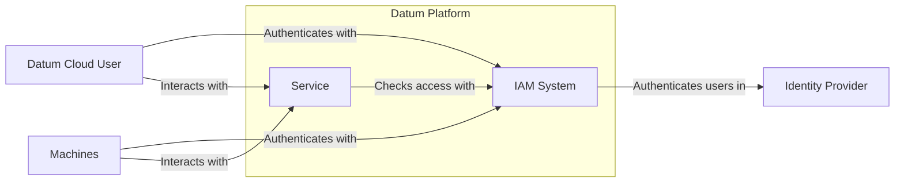

The Datum Cloud authentication feature will support any identity providers that
support the following protocols for managing user authentication.

- **[OpenID Connect (OIDC)][OIDC]**: A modern authentication protocol built on
  OAuth2 that enables single sign-on (SSO) and identity federation.
- **[Security Assertion Markup Language (SAML)][SAML]**: A widely adopted
  XML-based protocol used by enterprises for authentication and authorization.
- **[OAuth2]**: The industry standard for authorization, used to enable secure
  access to APIs and applications.
- **[System for Cross-domain Identity Management (SCIM)][SCIM]**: A standardized
  protocol for automating user provisioning and de-provisioning across identity
  providers.

Identity Administrators for a Datum Cloud Organization will be able to configure
Datum Cloud's authentication feature to use their identity provider to manage
authentication to their organization.

[OIDC]: https://auth0.com/docs/authenticate/protocols/openid-connect-protocol
[SAML]: https://en.wikipedia.org/wiki/SAML_2.0
[OAUTH2]: https://oauth.net/2/
[SCIM]: https://scim.cloud

### Authentication Flows

The Datum Cloud authentication feature is expected to support the following
authentication flows to identify users and machines. Users and organizations are
expected to register with the system with their first login.

#### User Identity

This will be the primary flow that all users will follow when authenticating
with the Datum Cloud platform. Users will be redirected to the identity provider
that's configured for their user's identity (e.g. Google, GitHub, BYOID).

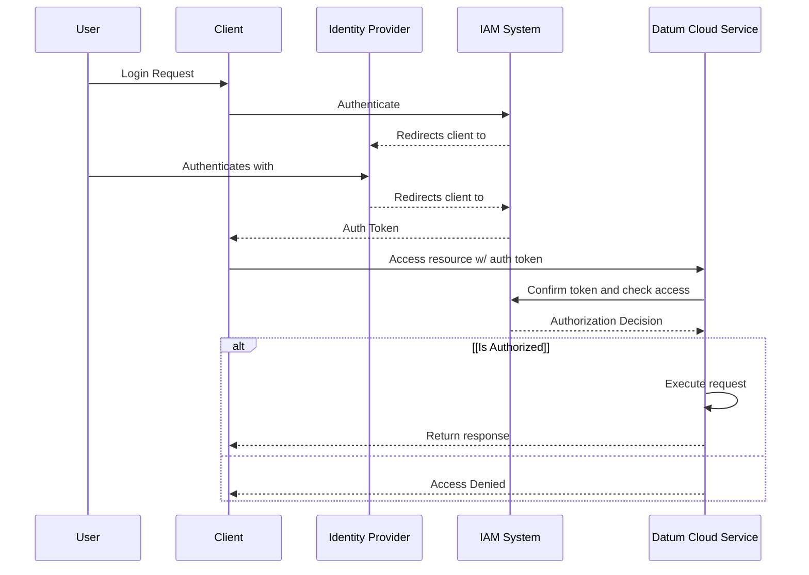

Diagram Explanation:

- Users authenticate via a supported identity provider (e.g., OIDC, SAML) and
  retrieves an access token from the IAM System.
- The user accesses resources of a Datum Cloud service
- Only authorized users are allowed to interact with the service

#### Machine Account Keys

Machine account keys can be created that allow machines to exchange self-signed
JWTs for access tokens with the IAM system.

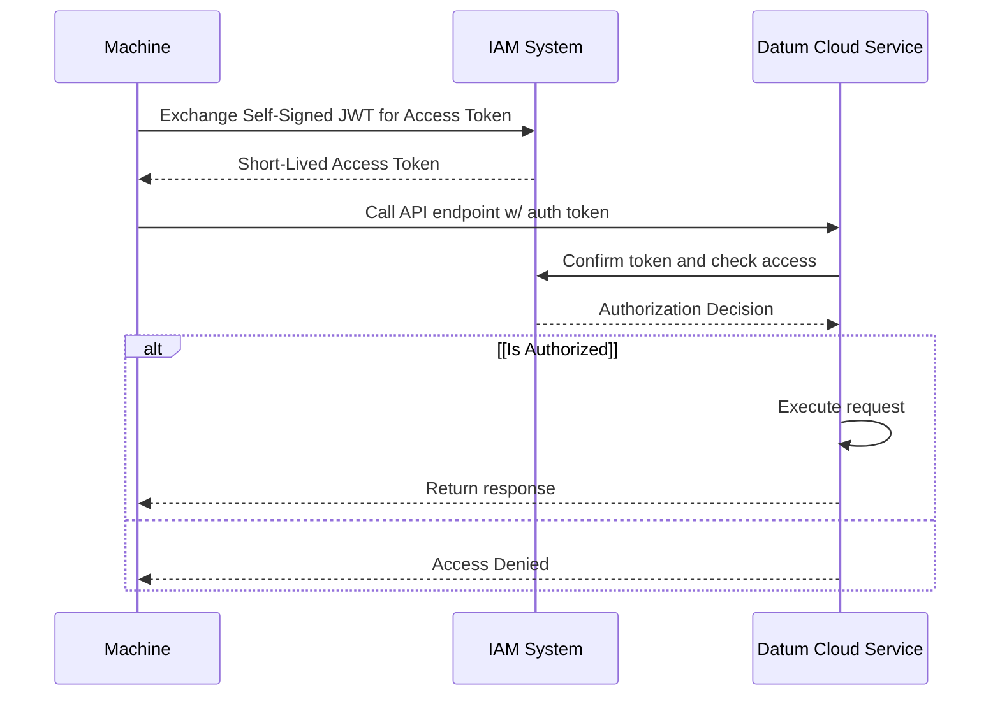

- A machine authenticates by presenting a self-signed JWT to the authentication
  service.
- The IAM system returns a short-lived access token that can be used by the
  machine to access services.
- The service checks with the IAM system that the user is authorized to interact
  with the resource the machine is requesting,

#### Workload Identity Federation

> [!NOTE]
>
> We will plan to support workload identity federation in the future as the
> platform matures.

#### System for Cross-domain Identity Management (SCIM)

> [!NOTE]
>
> We will plan to support [SCIM] in the future as the platform matures.

### Audit Logging

The system must generate audit logs for every action taken against a resource in
the IAM system. These audit logs must capture, the identity of the authorized
client, when the request was made, and metadata about the resource that was
accessed.

### Notes/Constraints/Caveats (Optional)

<!--
What are the caveats to the proposal?
What are some important details that didn't come across above?
Go in to as much detail as necessary here.
This might be a good place to talk about core concepts and how they relate.
-->

### Risks and Mitigations

<!--
What are the risks of this proposal, and how do we mitigate? Think broadly.
For example, consider both security and how this will impact the larger
software ecosystem.

How will security be reviewed, and by whom?

How will UX be reviewed, and by whom?

Consider including folks who also work outside of your immediate team.
-->

#### Existing User Migration

Existing user identities in the existing implementation of the Datum Cloud
authentication system will need to be migrated to the new provider.

#### Update Existing Services

All services that are deployed for Datum Cloud that validate JWTs are issued by
the Datum OS authorization service must be updated to trust the JWKs configured
for the Datum Cloud IAM system.

The services listed below must be updated to trust the new authentication
system:

- Project Control Plane APIServer
- Core Control Plane APIServer
- IAM APIServer
- Resource Manager APIServer

## Design Details

<!--
This section should contain enough information that the specifics of your
change are understandable. This may include API specs (though not always
required) or even code snippets. If there's any ambiguity about HOW your
proposal will be implemented, this is the place to discuss them.
-->

All services running on the Datum Cloud platform are expected to use OIDC to
discover the trusted JWKS that are use to validate that JWT authentication
tokens provided by clients are considered valid. All services should be updated
to trust JWT tokens signed by the new authentication system.

### Login Flow For A Registrated User

This sequence flow illustrates the authentication process when a user logs in via an external identity provider (e.g. GitHub, Google).

> [!NOTE]
>
> This login flow assumes that the user account has already been created for the external identity provider in use.

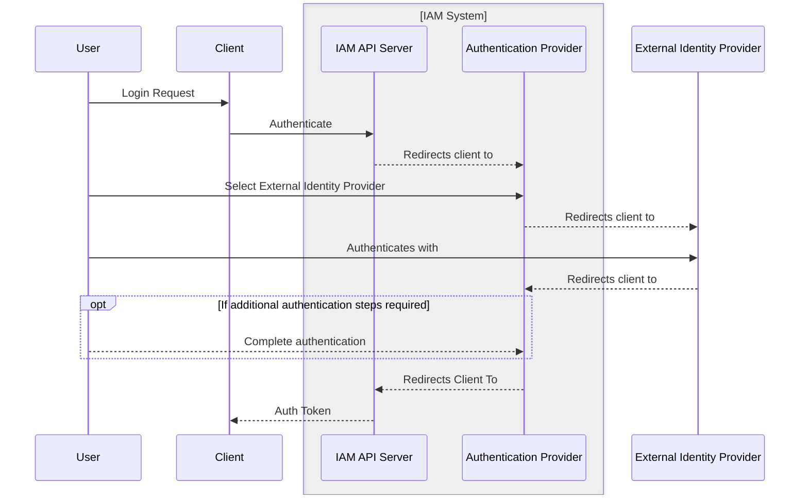

Diagram explanation:

- The user requests authentication and is redirected to the identity provider.

- The user authenticates with the chosen external identity provider.

- If configured, they complete 2FA and receive the authentication token.

### Login Flow For A Non Registrated User

This sequence flow illustrates the authentication process when a user logs in via an external identity provider (e.g. GitHub, Google) and the user account was not previously registered.

> [!NOTE]
>
> This login flow assumes that the user account has not been created yet for the external identity provider in use.

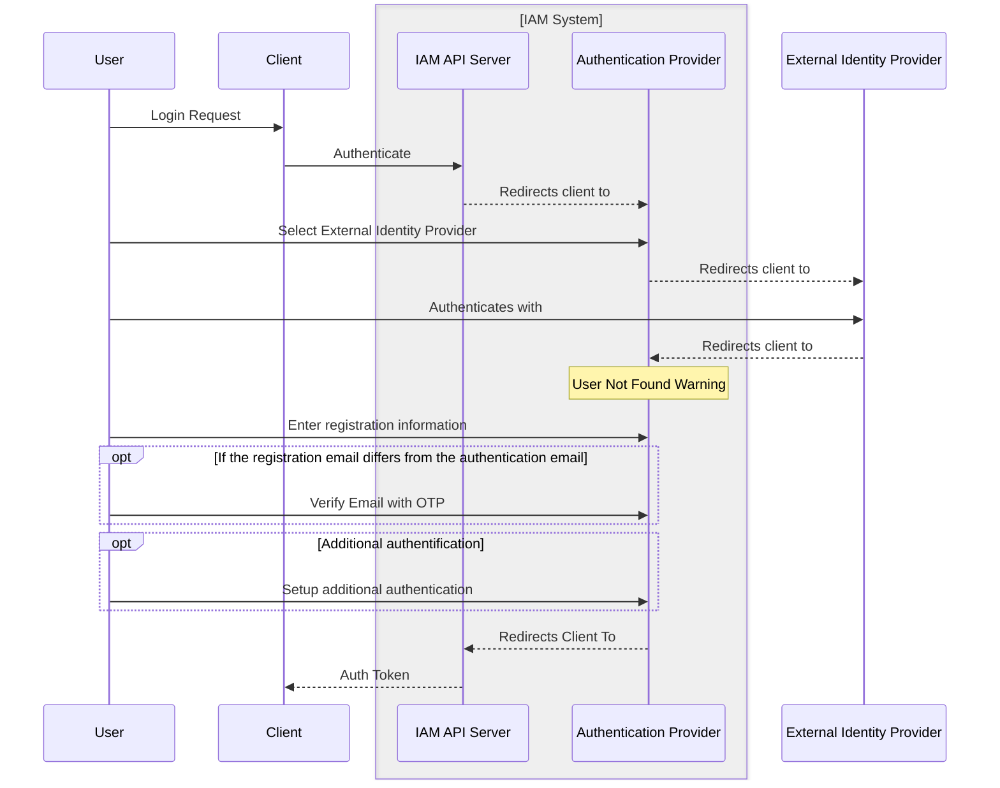

Diagram explanation:

- The user requests authentication and is redirected to the identity provider.

- The user authenticates with the chosen external identity provider.

- The user receives a `User Not Found` warning and continues with the registration flow.

- Optionally, they set up 2FA and then receive the authentication token.

### Registration Flow

This sequence flow illustrates the registration process when a user logs in via an external identity provider (e.g. GitHub, Google).

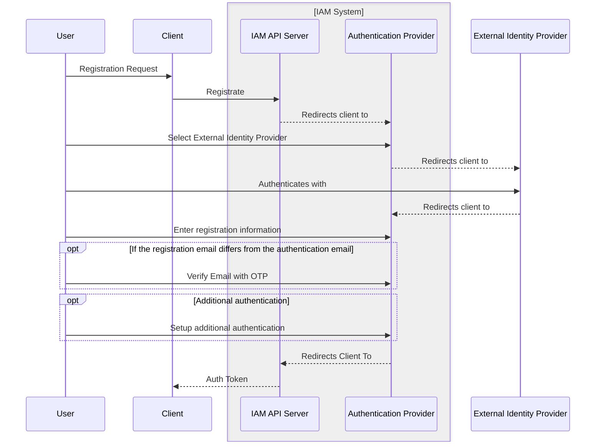

Diagram explanation:

- The user requests registration and is redirected to the identity provider.

- The user authenticates with the chosen external identity provider.

- The user continues with the account registration.

- Optionally, they set up 2FA and then receive the authentication token.

### User Management Flow

This sequence flow illustrates the user management process. User management includes changes to the user information, password, additional authentication steps (MFA, passwordless), external identity providers, authorization, roles, and custom metadata (e.g., etc.).

> [!NOTE]
>
> Fore ease and simplicity, this diagram asumes taht the user and IAM API Server are already authenticated against the Authentication Provider.
> [!WARNING]
>
> Some user account changes, such as email address updates, will require more interaction with the user and the IAM System, as email validation and further actions might be needed to complete the process.

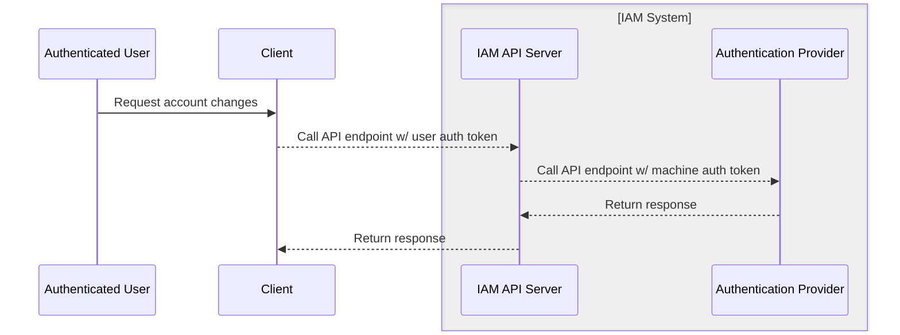

Diagram explanation:

- The user requests changes to their account from the IAM System.

- The IAM System receives the request and makes the changes to the authentication provider through the IAM API Server.

- The IAM System returns the response to the client.

### Service Authentication

All services are expected to use the IAM system to authenticate and authorize
the requests they receive from clients. The IAM system is responsible for
confirming the user's authentication token is valid and the user has access to
manage the resources they're trying to use in the service.

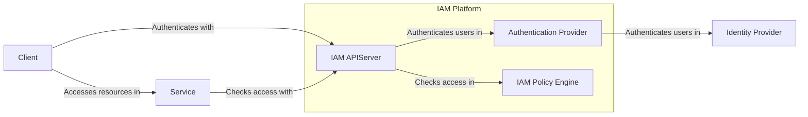

The IAM APIServer provides the APIs that services are expected to interact with
the perform authorization checks to enable the IAM system to change the policy
engine or authentication provider without impacting upstream services.

### Machine Account and Machine Account Key Management

Machine accounts are special identities intended for use by automated systems, CI/CD pipelines, and workloads that need to interact with the platform programmatically. Each machine account can have one or more cryptographic keys associated with it, which are used to authenticate and authorize API calls.

#### Best Practices for Machine Account and Key Management

- **Principle of Least Privilege:** Assign only the permissions necessary for the machine account's purpose.
- **Key Generation:** Users should generate key pairs locally using secure tools (e.g., `openssl`, `ssh-keygen`, or cryptographic libraries). The private key must never leave the user's secure environment.
- **Public Key Registration:** Only the public key is uploaded to the IAM system. The IAM system uses this public key to verify JWTs signed by the machine account's private key.
- **Key Rotation:** Regularly rotate machine account keys. The IAM system should support multiple active keys per account to enable seamless rotation.
- **Key Expiration:** Keys should have configurable expiration dates. Expired keys are automatically invalidated.
- **Key Revocation:** The IAM system must provide APIs to revoke keys immediately if compromise is suspected.
- **Audit Logging:** All key management operations (create, upload, rotate, revoke) must be logged for auditability.
- **Secure Storage:** Private keys must be stored securely, e.g., in a hardware security module (HSM), a secure vault, or an encrypted file system.
- **No Hardcoding:** Never embed private keys in source code or configuration files checked into version control.
- **Short-lived Tokens:** Use short-lived JWTs for authentication to minimize the impact of key compromise.

#### Machine Account Lifecycle

##### 0. Machine Account Authentication Flow and Delegation Model

The **IAM API Server** delegates all authentication and authorization responsibilities to a third-party authorization provider (such as ZITADEL). This means that the IAM API Server acts primarily as a proxy or orchestrator, while the actual security-sensitive operations are handled by the external provider. The delegated responsibilities include:

- **Private Key Generation:** The user or client generates the private/public key pair locally. The private key never leaves the user's environment, and only the public key is registered with the authorization server (e.g., ZITADEL).
- **Machine Account and Key Registration:** The IAM API Server provides an interface for users to register machine accounts and upload public keys, but the actual key management and validation are handled by the authorization provider.
- **Token Request:** When a machine account needs to authenticate, it creates a JWT signed with its private key and sends it to the IAM API Server, which forwards the request to the authorization provider.
- **Token Introspection and Validation:** The authorization provider is responsible for validating the JWT, checking the public key, and issuing an OAuth access token if the request is valid.
- **Access Token Issuance:** The authorization provider issues a short-lived OAuth access token, which is returned to the client via the IAM API Server.
- **Token Usage:** The client uses the OAuth access token to access protected resources. Resource servers can validate the token directly with the authorization provider (introspection endpoint) or via the IAM API Server.
- **Audit Logging and Revocation:** All key lifecycle events (creation, rotation, revocation) and token events are logged by the authorization provider, ensuring traceability and compliance.

This delegation model ensures that the IAM API Server does not handle or store any sensitive cryptographic material, and leverages the security, compliance, and operational maturity of the external authorization provider.

**Key Points:**

- The IAM API Server is stateless with respect to cryptographic secrets.
- All sensitive operations (key validation, token issuance, introspection) are performed by the authorization provider.
- This model supports strong separation of concerns, minimizes the attack surface, and leverages best-in-class security practices from the authorization provider.

##### 1. Creating a Machine Account

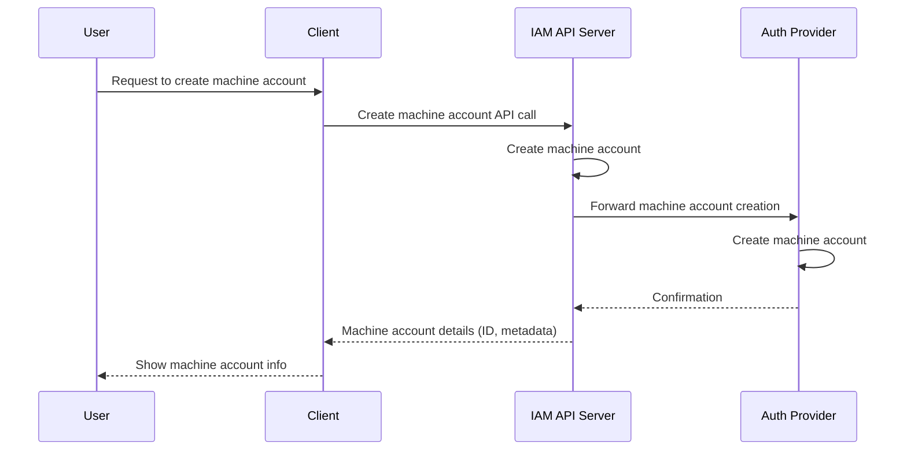

##### 2. Registering a Machine Account Key (Auth Provider-Generated Key)

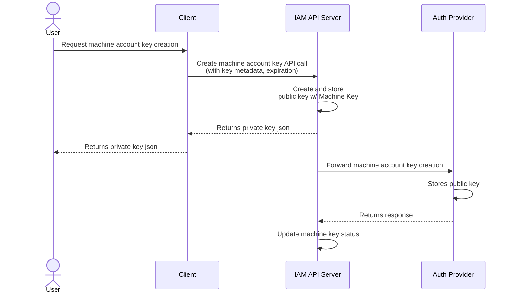

##### 3. Registering a Machine Account Key (User-Generated Key)

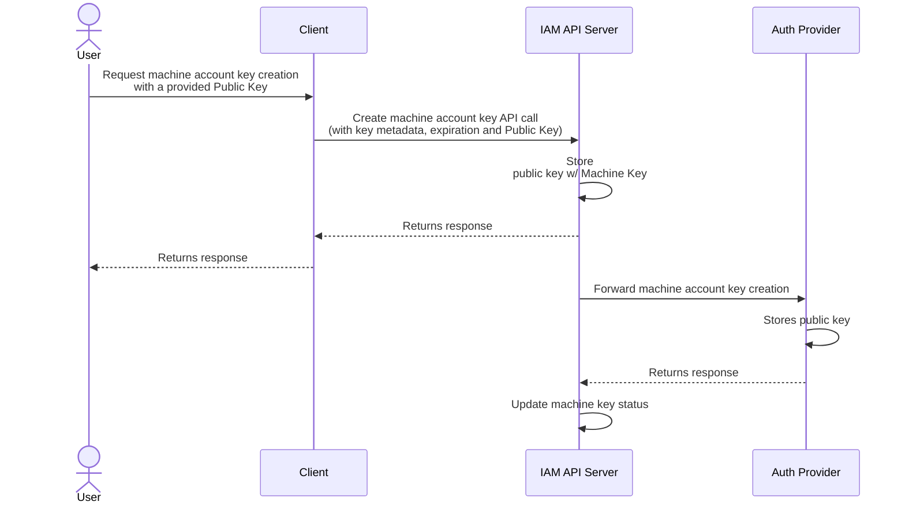

##### 4. Using a Machine Account Key for Authentication and Authoriation

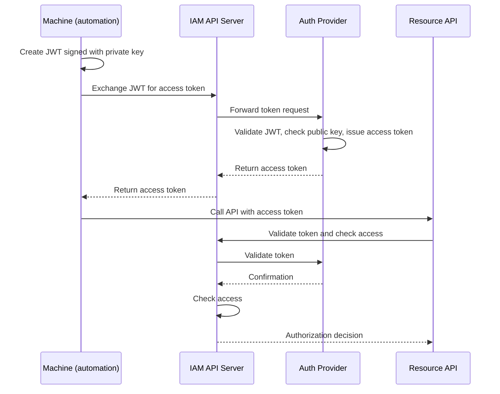

#### Example: User-Generated Key Registration Flow

1. User generates a key pair:

   ```sh
   openssl genpkey -algorithm RSA -out private_key.pem -pkeyopt rsa_keygen_bits:2048
   openssl rsa -pubout -in private_key.pem -out public_key.pem
   ```

2. User uploads `public_key.pem` to the IAM system via the API or UI.
3. IAM system stores the public key, associates it with the machine account, and returns a key ID.
4. User securely stores `private_key.pem` and uses it to sign JWTs for authentication.

#### Security Considerations

- **Never share or upload private keys.**
- **Rotate keys regularly and remove unused/old keys.**
- **Monitor audit logs for suspicious key management activity.**
- **Enforce strong key generation parameters (e.g., minimum key size, algorithm).**
- **Support for key attestation or hardware-backed keys is recommended for high-security environments.**

> References:
>
> - [ZITADEL: Private key JWT authentication for machine users](https://zitadel.com/docs/guides/integrate/service-users/private-key-jwt)
> - [Google Cloud IAM Best Practices](https://cloud.google.com/iam/docs/best-practices-for-managing-service-accounts)
> - [AWS Service Account Key Management](https://docs.aws.amazon.com/IAM/latest/UserGuide/id_credentials_access-keys.html)

### Resource Storage

The IAM system is expected to use a generic storage interface for storing and
accessing resources from the storage layer. The resources API will provide a
generic interface that supports storing serialized protobuf types. The API will
support listing and filtering resources based on a user's access in the systems
resource hierarchy.

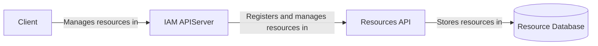

> [!NOTE]
>
> This section will be moved to it's own enhancement in the future to fully
> scope the resource management API that's needed to enable generic access to
> all resources.

<!-- ## Production Readiness Review Questionnaire -->

<!--

Production readiness reviews are intended to ensure that features are observable,
scalable and supportable; can be safely operated in production environments, and
can be disabled or rolled back in the event they cause increased failures in
production.

See more in the PRR Enhancement at https://git.k8s.io/enhancements/keps/sig-architecture/1194-prod-readiness.

The production readiness review questionnaire must be completed and approved
for the Enhancement to move to `implementable` status and be included in the release.
-->

<!-- ### Feature Enablement and Rollback -->

<!--
This section must be completed when targeting alpha to a release.
-->

<!-- #### How can this feature be enabled / disabled in a live cluster? -->

<!--
Pick one of these and delete the rest.
-->
<!--
- [ ] Feature gate
  - Feature gate name:
  - Components depending on the feature gate:
- [ ] Other
  - Describe the mechanism:
  - Will enabling / disabling the feature require downtime of the control plane?
  - Will enabling / disabling the feature require downtime or reprovisioning of a node?
-->

<!-- #### Does enabling the feature change any default behavior? -->

<!--
Any change of default behavior may be surprising to users or break existing
automations, so be extremely careful here.
-->

<!-- #### Can the feature be disabled once it has been enabled (i.e. can we roll back the enablement)? -->

<!--
Describe the consequences on existing workloads (e.g., if this is a runtime
feature, can it break the existing applications?).

Feature gates are typically disabled by setting the flag to `false` and
restarting the component. No other changes should be necessary to disable the
feature.
-->

<!-- #### What happens if we reenable the feature if it was previously rolled back? -->

<!-- #### Are there any tests for feature enablement/disablement? -->

<!-- ### Rollout, Upgrade and Rollback Planning -->

<!--
This section must be completed when targeting beta to a release.
-->

<!-- #### How can a rollout or rollback fail? Can it impact already running workloads? -->

<!--
Try to be as paranoid as possible - e.g., what if some components will restart
mid-rollout?

Be sure to consider highly-available clusters, where, for example,
feature flags will be enabled on some servers and not others during the
rollout. Similarly, consider large clusters and how enablement/disablement
will rollout across nodes.
-->

<!-- #### What specific metrics should inform a rollback? -->

<!--
What signals should users be paying attention to when the feature is young
that might indicate a serious problem?
-->

<!-- #### Were upgrade and rollback tested? Was the upgrade->downgrade->upgrade path tested? -->

<!--
Describe manual testing that was done and the outcomes.
Longer term, we may want to require automated upgrade/rollback tests, but we
are missing a bunch of machinery and tooling and can't do that now.
-->

<!-- #### Is the rollout accompanied by any deprecations and/or removals of features, APIs, fields of API types, flags, etc.? -->

<!--
Even if applying deprecation policies, they may still surprise some users.
-->

<!-- ### Monitoring Requirements -->

<!--
This section must be completed when targeting beta to a release.

For GA, this section is required: approvers should be able to confirm the
previous answers based on experience in the field.
-->

<!-- #### How can an operator determine if the feature is in use by workloads? -->

<!--
Ideally, this should be a metric. Operations against the API (e.g., checking if
there are objects with field X set) may be a last resort. Avoid logs or events
for this purpose.
-->

<!-- #### How can someone using this feature know that it is working for their instance? -->

<!--
For instance, if this is an instance-related feature, it should be possible to
determine if the feature is functioning properly for each individual instance.
Pick one more of these and delete the rest.
Please describe all items visible to end users below with sufficient detail so
that they can verify correct enablement and operation of this feature.
Recall that end users cannot usually observe component logs or access metrics.
-->
<!--
- [ ] Events
  - Event Reason:
- [ ] API .status
  - Condition name:
  - Other field:
- [ ] Other (treat as last resort)
  - Details:
-->

<!-- #### What are the reasonable SLOs (Service Level Objectives) for the enhancement? -->

<!--
This is your opportunity to define what "normal" quality of service looks like
for a feature.

It's impossible to provide comprehensive guidance, but at the very
high level (needs more precise definitions) those may be things like:
  - per-day percentage of API calls finishing with 5XX errors <= 1%
  - 99% percentile over day of absolute value from (job creation time minus expected
    job creation time) for cron job <= 10%
  - 99.9% of /health requests per day finish with 200 code

These goals will help you determine what you need to measure (SLIs) in the next
question.
-->

<!-- #### What are the SLIs (Service Level Indicators) an operator can use to determine the health of the service? -->

<!--
Pick one more of these and delete the rest.
-->
<!--
- [ ] Metrics
  - Metric name:
  - [Optional] Aggregation method:
  - Components exposing the metric:
- [ ] Other (treat as last resort)
  - Details:
-->

<!-- #### Are there any missing metrics that would be useful to have to improve observability of this feature? -->

<!--
Describe the metrics themselves and the reasons why they weren't added (e.g., cost,
implementation difficulties, etc.).
-->

<!-- ### Dependencies -->

<!--
This section must be completed when targeting beta to a release.
-->

<!-- #### Does this feature depend on any specific services running in the cluster? -->

<!--
Think about both cluster-level services (e.g. metrics-server) as well
as node-level agents (e.g. specific version of CRI). Focus on external or
optional services that are needed. For example, if this feature depends on
a cloud provider API, or upon an external software-defined storage or network
control plane.

For each of these, fill in the following—thinking about running existing user workloads
and creating new ones, as well as about cluster-level services (e.g. DNS):
  - [Dependency name]
    - Usage description:
      - Impact of its outage on the feature:
      - Impact of its degraded performance or high-error rates on the feature:
-->

<!-- ### Scalability -->

<!--
For alpha, this section is encouraged: reviewers should consider these questions
and attempt to answer them.

For beta, this section is required: reviewers must answer these questions.

For GA, this section is required: approvers should be able to confirm the
previous answers based on experience in the field.
-->

<!-- #### Will enabling / using this feature result in any new API calls? -->

<!--
Describe them, providing:
  - API call type (e.g. PATCH workloads)
  - estimated throughput
  - originating component(s) (e.g. Workload, Network, Controllers)
Focusing mostly on:
  - components listing and/or watching resources they didn't before
  - API calls that may be triggered by changes of some resources
    (e.g. update of object X triggers new updates of object Y)
  - periodic API calls to reconcile state (e.g. periodic fetching state,
    heartbeats, leader election, etc.)
-->

<!-- #### Will enabling / using this feature result in introducing new API types? -->

<!--
Describe them, providing:
  - API type
  - Supported number of objects per cluster
  - Supported number of objects per namespace (for namespace-scoped objects)
-->

<!-- #### Will enabling / using this feature result in any new calls to the cloud provider? -->

<!--
Describe them, providing:
  - Which API(s):
  - Estimated increase:
-->

<!-- #### Will enabling / using this feature result in increasing size or count of the existing API objects? -->

<!--
Describe them, providing:
  - API type(s):
  - Estimated increase in size: (e.g., new annotation of size 32B)
  - Estimated amount of new objects: (e.g., new Object X for every existing Pod)
-->

<!-- #### Will enabling / using this feature result in increasing time taken by any operations covered by existing SLIs/SLOs? -->

<!--
Look at the [existing SLIs/SLOs].

Think about adding additional work or introducing new steps in between
(e.g. need to do X to start a container), etc. Please describe the details.

[existing SLIs/SLOs]: https://git.k8s.io/community/sig-scalability/slos/slos.md#kubernetes-slisslos
-->

<!-- #### Will enabling / using this feature result in non-negligible increase of resource usage in any components? -->

<!--
Things to keep in mind include: additional in-memory state, additional
non-trivial computations, excessive access to disks (including increased log
volume), significant amount of data sent and/or received over network, etc.
This through this both in small and large cases, again with respect to the
[supported limits].

[supported limits]: https://git.k8s.io/community//sig-scalability/configs-and-limits/thresholds.md
-->

<!-- #### Can enabling / using this feature result in resource exhaustion of some node resources (PIDs, sockets, inodes, etc.)? -->

<!--
Focus not just on happy cases, but primarily on more pathological cases.

Are there any tests that were run/should be run to understand performance
characteristics better and validate the declared limits?
-->

<!-- ### Troubleshooting -->

<!--
This section must be completed when targeting beta to a release.

For GA, this section is required: approvers should be able to confirm the
previous answers based on experience in the field.

The Troubleshooting section currently serves the `Playbook` role. We may consider
splitting it into a dedicated `Playbook` document (potentially with some monitoring
details). For now, we leave it here.
-->

<!-- #### How does this feature react if the API server is unavailable? -->

<!-- #### What are other known failure modes? -->

<!--
For each of them, fill in the following information by copying the below template:
  - [Failure mode brief description]
    - Detection: How can it be detected via metrics? Stated another way:
      how can an operator troubleshoot without logging into a master or worker node?
    - Mitigations: What can be done to stop the bleeding, especially for already
      running user workloads?
    - Diagnostics: What are the useful log messages and their required logging
      levels that could help debug the issue?
      Not required until feature graduated to beta.
    - Testing: Are there any tests for failure mode? If not, describe why.
-->

<!-- #### What steps should be taken if SLOs are not being met to determine the problem? -->

## Implementation History

<!--
Major milestones in the lifecycle of a Enhancement should be tracked in this section.
Major milestones might include:
- the `Summary` and `Motivation` sections being merged, signaling acceptance
- the `Proposal` section being merged, signaling agreement on a proposed design
- the date implementation started
- the first release where an initial version of the Enhancement was available
- the version where the Enhancement graduated to general availability
- when the Enhancement was retired or superseded
-->

- 2025-03-01 - Define initial enhancement goals and system architecture

<!-- ## Drawbacks -->

<!--
Why should this Enhancement _not_ be implemented?
-->

<!-- ## Alternatives -->

<!--
What other approaches did you consider, and why did you rule them out? These do
not need to be as detailed as the proposal, but should include enough
information to express the idea and why it was not acceptable.
-->

<!-- ## Infrastructure Needed (Optional) -->

<!--
Use this section if you need things from another party. Examples include a
new repos, external services, compute infrastructure.
-->
