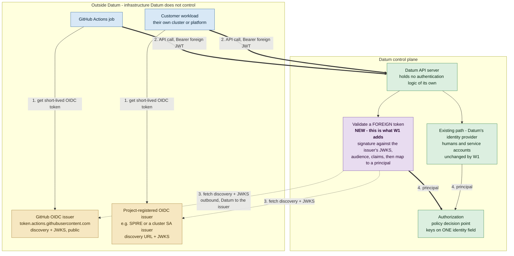

# Workload Identity Federation — letting external workloads call the Datum API without a Datum key

**Status** Draft for review · **Date** 2026-09-18
**Audience** Datum platform engineering, IAM, and product
**Internal shorthand** this is the use case referred to as **W1** — an external workload authenticating *into*
the Datum control plane.

**What this document is.** A product requirements document: the problem, the scenarios, what any solution
must do, and the design options with their trade-offs. It is self-contained — every claim it makes is stated
here rather than referenced elsewhere.

**What it is not.** It is not an implementation plan, and it does not decide between the options. Option 1 is
the design already written by the team; further options follow in later revisions.

---

# 1. Overview

## 1.1 The problem

A customer's automation — a CI/CD pipeline, a cloud function, a controller in their own Kubernetes cluster —
needs to call the Datum API to provision and manage resources. Today the only way to do that is for the
customer to create a Datum **ServiceAccountKey**, download the private key, and paste it into their system as
a secret.

That key is the problem. It is long-lived, it is a bearer credential, and it sits in a system Datum does not
operate.

Every major platform these workloads already run on — GitHub Actions, GCP, AWS, Azure, Kubernetes — issues
its own short-lived, cryptographically signed identity token to the workload, for free, with no secret to
store. **Workload Identity Federation is the feature that lets Datum accept those tokens directly**, so the
customer never creates a Datum credential at all.

## 1.2 How it works today, and what that costs

| Property today | Consequence |
|---|---|
| The key is issued once and does not expire by default | A key leaked in year one is still valid in year five |
| It is a bearer credential | Anyone who obtains it is indistinguishable from the workload |
| There is no rotate-in-place operation | Rotation means create-then-delete, with a window where both work, or delete-then-create, with an outage |
| It is stored in the customer's CI system | It can leak through build logs, forks, misconfigured secret scopes, or a breach of that platform |
| One key usually serves many pipelines | An action cannot be attributed to a specific repository, branch, or run |

None of this is a defect in how the key is implemented. It is inherent to *"the customer holds a long-lived
Datum secret."* The only way to remove the risk is to remove the secret.

## 1.3 The scenarios this must cover

These are the concrete shapes the use case takes. They differ in who owns the issuer, which decides how the
trust is configured.

| # | Scenario | Issuer | Who registers the trust |
|---|---|---|---|
| **S1** | A customer's **GitHub Actions** workflow deploys resources to their Datum project | GitHub's OIDC issuer, public and shared by all GitHub users | Datum, once, centrally |
| **S2** | A **cloud function or serverless job** (GCP, AWS Lambda, Azure) calls the Datum API | That cloud's public OIDC issuer | Datum, once, centrally |
| **S3** | A controller in the **customer's own Kubernetes cluster** provisions Datum resources | The customer's cluster service-account issuer, or SPIRE — reachable at a discovery URL the customer supplies | The customer, per project |
| **S4** | A **partner or SaaS platform** integrates with Datum on a shared customer's behalf | The partner's own issuer | The customer, per project |
| **S5** | A **self-hosted IdP** (Okta, Keycloak, an internal issuer) fronts a customer's automation | The customer's IdP | The customer, per project |

**S1 and S2 are the volume cases** — the issuer is public, well-known, and the same for every customer, so
Datum can vet and register it once. **S3 through S5 are the long tail** — the issuer belongs to the customer,
so the customer has to be able to register it themselves without a Datum support ticket. A design that only
solves S1/S2 solves the demo but not the product.

## 1.4 Goals

1. An external workload authenticates to the Datum API using a token **its own platform already issues**.
2. **No Datum-issued credential** exists in the external system — nothing to rotate, leak, or revoke.
3. A customer can restrict access by **token attributes** — this repository, this branch, this environment —
   not merely "anything from GitHub."
4. A customer can **register their own issuer** for a project without Datum operating it.
5. The resulting identity is a **first-class subject** in Datum's existing authorization model, so access is
   granted with the same mechanism as any other identity.
6. Actions are **attributable** to the specific workload, in audit.
7. Access can be **withdrawn** without waiting for a token to expire.
8. A misconfiguration **fails closed**, and fails visibly.

## 1.5 Non-goals

- **Replacing human authentication.** People continue to sign in as they do now.
- **Internal service-to-service identity.** Datum's own services authenticating to each other is a separate
  problem with different constraints, because Datum controls both ends.
- **Non-OIDC protocols.** SAML and raw X.509 are out of scope.
- **Datum issuing tokens to external systems.** The reverse direction — a Datum identity authenticating *to*
  AWS or GCP — shares the name "federation" and almost none of the machinery. Separate effort.

## 1.6 One constraint removes the obvious shortcut — read this before proposing an alternative

The cheapest imaginable answer is: *"let Datum's identity provider accept the GitHub token, and change
nothing else."* **That is not available, and the reason is structural rather than a configuration oversight.**

Datum's identity provider accepts a signed token as proof of identity only when **the token's issuer and its
subject are the same value**, and only when it **already holds the signing key** for that identity. This is
the self-assertion shape: an identity the provider knows, proving it is itself.

A CI platform's token cannot satisfy that. A GitHub Actions token's issuer names GitHub
(`https://token.actions.githubusercontent.com`) and its subject names the workload
(`repo:acme/infra:ref:refs/heads/main`). They are necessarily different strings. The same is true of every
platform whose token identifies *what is running* — which is the entire point of such a token.

**This was confirmed by direct testing against a running Datum deployment**, including the case that would
otherwise be the workaround: an assertion signed with a key the identity provider **already holds** was still
rejected, because the check is on the token's claims and happens *before* the signing key is looked up at
all. Registering a customer's key with the provider therefore does not help.

**Two consequences follow, and they frame every option in §4.**

1. **The long-lived `ServiceAccountKey` is structurally forced by the current design.** It is not a lazy
   default. The only credential the provider accepts non-interactively is a key it issued, held by the
   workload.
2. **Validating a foreign token is work Datum must do somewhere it controls** — inside the Datum control
   plane, or in a Datum-operated service in front of the identity provider. There is no third place.

---

# 2. How a federated call would flow



## 2.1 What each step requires

| Step | What happens | What it demands of Datum |
|---|---|---|
| **1** | The workload asks its own platform for a token, naming Datum as the audience | Nothing. This already works everywhere, with no Datum involvement |
| **2** | The workload calls the Datum API with that token as a bearer credential | The API must accept a token it did not issue, without breaking the path humans and service accounts already use |
| **3** | Datum fetches the issuer's discovery document and signing keys, and caches them | **Outbound network access from the control plane to arbitrary customer-supplied URLs.** This is the step most easily overlooked, and it carries the design's main infrastructure and security questions — reachability, caching, rotation, and protection against being pointed at an internal address |
| **4** | The validated token becomes a principal, and authorization decides | The principal must fit the one identity field the policy decision point reads |

## 2.2 Two properties of the existing platform that bound any design

**Authentication hands authorization a flat record, not an object.** However a caller is authenticated, the
result is a small fixed structure — a username, a single identity field, groups, and a few string extras —
and **the policy decision point keys on that one identity field**. A federated principal has nowhere else to
live. Whatever a design calls its principal, it has to fit there.

**The Datum API server contains no authentication or authorization logic of its own.** Both decisions are
made outside it, over standard interfaces — it is a Kubernetes-style API server that delegates authentication
and authorization to separate services. This is why "the API server validates the token" is not a complete
statement of where code runs — §4.1.1 returns to this.

---

# 3. Requirements

A design is measured against these. They are ordered; the first four are the reason the feature exists.

| # | Requirement |
|---|---|
| **R1** | An external workload authenticates with a token issued by its own platform, with **no Datum credential** anywhere in the external system |
| **R2** | Trust is scoped: a customer grants access to **specific token attributes** (repository, branch, environment), not to an entire platform |
| **R3** | A customer can register **their own issuer** for their own project, self-service |
| **R4** | The federated identity is a **subject in the existing authorization model**, granted access the same way as any other identity |
| **R5** | Actions are **attributable** to the specific workload in audit |
| **R6** | Access can be **revoked**, with a stated and bounded worst-case latency |
| **R7** | The feature is **fail-closed**: a misconfiguration denies rather than admits, and an issuer can be disabled immediately |
| **R8** | The **existing authentication path is unaffected** — humans and service accounts keep working, provably |
| **R9** | The **per-request cost is bounded and known**, since validation runs on every API call |
| **R10** | A customer-supplied issuer URL cannot be used to make the control plane reach **internal addresses** |

---

# 4. Design options

## 4.1 Option 1 — the existing proposal: three resources, trust separated from matching

This is the design already written by the team. It is summarised here on its own terms; the assessment
follows in §4.1.1.

### The model

Three new API resources, splitting *trust in an issuer* from *the conditions under which a token from it is
accepted*.

| Resource | Scope | Purpose |
|---|---|---|
| **`TrustedIssuer`** | Platform | Registers an OIDC issuer as safe to federate against, cluster-wide. Managed by Datum administrators. Ships pre-registered for GitHub Actions, GCP, AWS and Azure. Its issuer URI is unique across all such objects |
| **`WorkloadIdentityIssuer`** | Project | Either enables a `TrustedIssuer` inside a project, **or** registers a project-owned issuer directly with its own URI and key source. Also the emergency kill switch: disabling it rejects every rule beneath it |
| **`WorkloadIdentityRule`** | Project | Matches tokens from one issuer on audience and claims, requires a CEL condition, and defines the resulting principal |

Key material can come from **discovery** (fetch it from the issuer), an **explicit URL**, or be supplied
**inline** as a document.

### How a customer uses it

Datum registers `TrustedIssuer/github-actions` once. A project owner then creates a
`WorkloadIdentityIssuer` referencing it, and a `WorkloadIdentityRule` such as:

```yaml
spec:
  issuerRef: { name: github-actions }
  allowedAudiences: ["https://api.miloapis.com"]
  attributeMapping:
    attribute.repository: "assertion.repository"
    attribute.ref:        "assertion.ref"
  attributeCondition: |
    attribute.repository == "acme-corp/infrastructure" &&
    attribute.ref == "refs/heads/main"
```

The rule resolves to a principal identifier:

```
principal://iam.miloapis.com/projects/{project}/issuers/{issuer}/rules/{rule}
```

which is then granted access by an ordinary policy binding — preferably by referencing the rule by name,
with the raw URI available as an alternate form.

### At request time

Fetch the issuer's keys (cached for an hour), find the rules for the token's issuer, validate signature,
audience and claims, extract the mapped attributes, evaluate the CEL condition, construct the principal, and
check authorization with it.

### What this design gets right

Worth stating plainly, because §4.1.1 is a list of problems and the design's strengths are real.

- **Separating issuer trust from match conditions is the correct central decision.** One `TrustedIssuer`
  backs every project's rules for that platform, so keys are fetched, verified and rotated once, centrally.
  Two access levels against one issuer become two rules, not two copies of the issuer configuration. The
  proposal argues this from how the comparable products actually behave, including a case where one vendor's
  own guidance contradicts its own feature set.
- **Requiring a CEL condition on every rule** makes the dangerous default — "accept anything from GitHub" —
  unreachable by accident.
- **Project-owned custom issuers from day one** means scenarios S3–S5 are in scope, not deferred.
- **Verification affordances are designed in, not retrofitted**: a dry-run that fetches and parses an
  issuer's keys without creating anything, and a time-boxed live test that reports the *specific* failure —
  bad signature, wrong audience, condition not satisfied. That converts a class of silent misconfiguration
  into a pre-flight check.
- **Separating an authentication-attempt record from the general activity timeline** is a real operational
  insight: a failed exchange never produces a principal, so without a separate record an owner cannot
  distinguish "never tried" from "tried and was rejected."

### 4.1.1 Trade-offs, gaps and issues in Option 1

Ordered by whether they block delivery, shape the design, or are unquantified risks.

#### Must be settled first — necessitated work, and questions the design leaves open

B1 is scope the proposal commits us to but does not describe. B2 and B3 are questions it leaves unanswered.
All three gate building the design as written.

**B1. Adopting this proposal also commits us to authorization-side work it does not describe.**
This is not an objection to the design — it is scope the proposal leaves out. A federated principal has to
become a policy-binding subject, and today policy-binding subjects are restricted at admission to three
kinds: user, group, and service account. Both forms the proposal uses — a typed rule reference and a raw
principal identifier — are rejected *before* the authorization service is ever consulted. **Choosing this
proposal therefore means also doing the following, in components the proposal does not mention:**

| # | Change | Where | Sensitivity |
|---|---|---|---|
| 1 | Admit a new subject kind | The **published API schema** that validates policy-binding subjects | **High** — a published API surface with other consumers |
| 2 | Map that kind to an authorization tuple | The **subject-to-tuple mapping** in the authorization service | Moderate — an added case in an existing switch |
| 3 | Exempt the kind from local-object resolution | The same service's admission-time subject checks | Low — **two precedents already exist**: system groups skip both the identifier requirement and existence validation, and service accounts proceed past a not-found result |

**Recommendation.** **Treat this as in-scope work of the proposal and sequence it first**, rather than
discovering it during implementation. Change 1 is the long pole because it is a published schema change
needing its own review; changes 2 and 3 are small and follow patterns already in the code. Nothing about the
federation design can be tested end to end until all three land, so they gate the rest of the work.

**B2. The proposal does not say where the validation code runs.**
It attributes key fetching, signature validation, rule matching, CEL evaluation and principal construction to
"the API server." The API server contains no authentication logic — it delegates authentication to an
external service. So there are three candidate homes, with materially different costs:

| Where | Cost | Consequence |
|---|---|---|
| Extend the existing authentication service | Cheapest structurally | Puts per-project rule lookup and CEL evaluation inside a service whose job is talking to Datum's identity provider |
| Add a validator inside the API server | Native, and the mechanism already exists in the underlying platform | Means two live authentication paths, permanently |
| Add a second authentication service | Clean separation | A new component, a new failure mode, and an ordering question |

**Everything about integration cost depends on this choice, and the proposal makes it implicitly.**

**Recommendation — extend the existing authentication service.**

**Scope: this answers B2 for Option 1 and its amended form (§4.2).** Options 5 and 6 answer the same question
differently by moving validation out of the API server's authentication path altogether, and Option 4 changes
what the answer has to produce rather than where it runs. The question is common to all of them; this
recommendation is not.

Two properties decide it. First, **the validator built into the API server cannot satisfy R3**: its
configuration is a file, not an API, so a customer can never register their own issuer — which rules it out
as the product mechanism, since scenarios S3 through S5 are the long tail the feature has to serve. Second,
**the API server accepts exactly one token-review webhook**, so standing up a *separate* federation service
means either replacing the existing webhook with a multiplexer or running two live authentication paths
permanently. Extending the service that already holds that seat avoids both.

**The cost to accept and mitigate is blast radius.** That service is on the critical path for *all*
authentication, so federation logic must be isolated well enough that a fault in it cannot deny human logins
— an explicit design constraint on the work, not an afterthought.

**Alternative worth noting, not recommended as the plan.** The API server's built-in validator could be used
first, purely to prove the trust path end to end before the service work starts: it needs no new component
and provably cannot displace the existing authentication path. It buys evidence, not product — nothing built
that way survives into the shipped feature, because it cannot meet R3. Treat it as an optional de-risking
step, not as stage one of the design.

**B3. The principal identifier has no stated home at the authentication boundary.**
The proposal describes constructing a principal URI and then checking authorization with it. Between those
two steps is a boundary it never crosses: the authenticated identity is a flat record, and authorization
reads a single identity field from it (§2.2). **The URI has to be carried in that field.** That has
consequences the design should state rather than leave to the implementer: the identity field becomes a URI
for one class of principal and an opaque identifier for every other; anything that logs, indexes or
length-limits that field inherits a URI; and the claim-to-URI mapping is where the real per-request work
happens.

**Recommendation.** Carry the principal identifier in **the identity field the policy decision point reads**,
because that is the only field authorization consults and there is no alternative. Then do two things the
proposal does not currently require: keep the **human-readable** rule and project names in the display name
rather than the identity field, so audit and console remain legible without parsing a URI; and **audit every
consumer of that field for length and format assumptions** before the first federated principal exists,
since they were all written when it held an opaque identifier.

#### Design gaps — resolvable, but cheaper to decide now than later

**G1. The principal identifier has only two tiers.**
`projects/{project}/issuers/{issuer}/rules/{rule}` carries a platform segment and a project segment. It has
**no organization or provider segment**. Two stated product directions need one: organization-level sharing
(already listed as future work) and any reseller or white-label tier. Retrofitting a segment into
identifiers already embedded in live policy bindings is a data migration, not an edit. **This is important
to resolve at this stage** — it is free to decide now and expensive later.

**Recommendation.** **Include an organization segment from the first version**, even if every value is
identical to the project's owning organization at launch. The identifier is an opaque string to everything
that consumes it, so an extra segment costs nothing now and cannot be added once bindings exist.
**Do not** add a delegation segment — see **G6**: an acting-party is better carried as a token claim than as
part of the principal's name.

**G2. Access-level multiplicity becomes rule count.**
All tokens matching a rule share one principal, so N access levels require N rules. A team wanting
per-branch, per-environment and per-repository distinctions creates the cross-product. The decoupled issuer
keeps each rule cheap, so this is bounded rather than fatal — but the proposal's own fix, conditions at the
binding level, is listed as future work blocked on the authorization design.

**G3. Inline key material admits a trust anchor Datum never contacts.**
Discovery and explicit-URL modes have real URL constraints — HTTPS, public DNS, no raw IP addresses — that
read as a considered defence against being pointed at internal addresses (R10). But inline mode exists for
issuers unreachable from the internet, and in that mode the issuer URI is compared as a string and never
fetched. A project owner can therefore install a trust anchor that Datum **never contacts and cannot
independently validate**, and the "verify issuer" dry-run degenerates to parsing the submitter's own
document. The blast radius is bounded to the registering project, and a project owner who can create policy
bindings can arguably already grant this access — **that argument is probably correct and should be written
down**, because discovery and inline are otherwise presented as peer options with very different properties.

**Recommendation.** **Allow inline key material in the first version, and record the reasoning** — a project
owner who can create policy bindings can already grant access within that project, so inline adds no
privilege they do not already hold, and the blast radius is the registering project. Attach two conditions:
the issuer's status must state plainly that it was **not independently verified**, so the console can show
the difference; and inline issuers must be **excluded from any future cross-project or organization-level
sharing**, because the argument above depends entirely on the blast radius staying inside one project.

**G4. There is no delegation concept.**
Nothing expresses "this workload is acting on behalf of that user." That is a reasonable scope decision for a
first version. It is listed here because it constrains G1: the question of whether the principal identifier
needs room for an acting party has to be answered before the identifier has production users. **G6 answers
it — it does not** — but the answer should be recorded rather than assumed.

**G5. Terminology does not match the deployed system.**
The proposal's motivation section names the credential it replaces `MachineAccount` / `MachineAccountKey`.
The deployed API serves `ServiceAccount` and `ServiceAccountKey`, and there is no machine-account resource.
Minor, but it will mislead whoever implements against it.

**G6. The design mints nothing — which is right here, and is the reason two adjacent capabilities stay out
of reach.**
The proposal deliberately has no exchange step: the external token is presented *directly* as the Datum API
credential and Datum issues nothing in return. For this use case that is the correct call — it removes a
component from the critical path of every request. Two consequences should be stated rather than discovered:

- **Outbound federation is not advanced by this.** A Datum identity authenticating *to* AWS or GCP requires
  Datum to **be** an issuer — publishing a discovery document and key set, and minting assertions. That is a
  separate capability, already scoped out in §1.5, and nobody should read "we shipped federation" as covering
  both directions.
- **Delegation has a standard representation this design cannot use.** Expressing *"this workload is acting
  on behalf of that user"* is normally done by exchanging a token for one that carries an **actor** claim
  alongside the subject, preserved across refresh. That is a better home for an acting party than the
  principal identifier, which names *who the principal is*, not *who asked* — which is why **G1 recommends
  against a delegation segment.** The open part is that authorization reads a single identity field (§2.2),
  so an actor claim would still need a route to the decision point.

**Recommendation.** Accept the no-exchange design for this use case, and **record that adding either
outbound federation or delegation later means adding a token-minting capability** — a new component, not a
revision of this one. Decide that deliberately rather than inheriting it.

**G7. The issuer registry is control-plane-only, and the edge already has its own.**
The proposal's resources live in the control plane. Separately, the edge gateway supports token validation
configured per route by the tenant, taking an issuer and a key-set location — **the same two inputs this
proposal's resources hold.** So the platform would carry two independent registries of "which issuers do we
trust," owned by different mechanisms and different people, with no relationship between them.

This is **not a first-version blocker** — the two solve different problems today, one admitting callers to
the Datum API and the other admitting callers to a tenant's own service. It matters because two things are
cheap to decide now and awkward later: whether these resources are ever intended to be an input to
**edge-enforced** policy, and whether **inline** key material could reach the edge at all — edge
configuration does not automatically receive the secrets it references, that propagation is explicit and
opt-in, and a missing one presents as a runtime failure rather than a validation error.

**Recommendation.** **State the intended scope in the proposal** — control-plane-only, or a possible future
input to edge policy. If the latter is even plausible, prefer issuers whose keys are **fetchable from a URL**
over inline material, since a URL propagates as configuration while inline key material propagates as a
secret.

#### Unquantified — not wrong, but not yet measured

**U1. Per-request cost is unknown.**
Signature verification, rule lookup, attribute extraction and CEL evaluation run on **every** API call from a
federated workload, and no result caching is described. Three questions have no answer yet: the added
latency at the tail; the behaviour when a project holds many rules against one issuer; and whether invalid
tokens can force repeated verification as a denial-of-service surface. This is R9, and it is unmet.

**Recommendation.** Set an explicit budget before committing to per-request CEL — **suggest a p99 added
latency target in the low single-digit milliseconds on a warm path** — and meet it by caching the
*validated-token to principal* result for the remaining lifetime of the token, which is naturally bounded and
removes repeat signature and CEL cost for the common case of a workload making many calls with one token.
Benchmark with a realistic rule count per issuer, not one.

**U2. The revocation claim is stronger than the platform delivers.**
The proposal lists deleting a policy binding as an *immediate* revocation. It is not. Authorization decisions
are cached, and **the production configuration sets no cache lifetime of its own**, so the underlying
platform's default applies: an already-granted decision can survive **up to five minutes** after the binding
is deleted. This is a property of how production is configured, not a fixed constant — a deployment that sets
the lifetime explicitly gets a different number, which is exactly why the requirement asks for a *stated*
latency rather than an adjective. The stale window applies to exactly the permission combinations
already being exercised — which are the ones an attacker in possession of access is using. The other three
revocation mechanisms, all on the authentication side, are plausible but cannot be derived until B2 is
settled. **R6 asks for a stated, bounded latency; the honest figure is not "immediate."**

**Recommendation.** **Choose a target and configure to meet it, rather than inheriting a default** — suggest
**60 seconds worst case** for authorization revocation, which is achievable today by setting the cache
lifetime explicitly instead of leaving it unset. Publish the number in customer-facing documentation so it
is a commitment rather than an accident, and state the authentication-side revocation latency separately once
the question in B2 is settled, since disabling an issuer or a rule takes a different path.

**U3. The audit guarantee lands on an audit trail that is not yet verified end to end.**
The design's attribution story is sound. Confirming it delivers requires the platform's audit path to be
working, which has not been demonstrated.

### 4.1.2 Brainstorming questions for the team

These items are important considerations requiring a decision. Each carries a recommendation, argued in the
section named beside it; the recommendation is a starting position to agree or overturn, not a conclusion.

| # | Question | Recommendation |
|---|---|---|
| **1** | **Where does federated token validation run?** (B2) Everything else about cost and failure mode follows from this answer. *Answered here for Options 1 and 2; Options 4–6 answer it differently* | **Extend the existing authentication service.** The API server's built-in validator **cannot meet R3** — its configuration is a file, not an API, so customers could never register their own issuer. A *separate* federation service is ruled out because the API server accepts exactly one token-review webhook, so it would need a multiplexer or two permanent paths. Accept and mitigate the blast radius: federation logic must not be able to fail human logins. *(Optional de-risking, not the plan: use the built-in validator once, purely to prove the trust path.)* |
| **2** | **Does the principal identifier need an organization or provider segment?** (G1) Cheap now, a migration later | **Yes — add an organization segment in v1**, even if every value is initially the project's own organization. **Do not** add a delegation segment: an acting party belongs in a token claim, not in the principal's name (G6) |
| **3** | **Which field carries the principal at the authentication boundary, and what else inherits a URI as a result?** (B3) | **The identity field the policy decision point reads** — there is no alternative. Keep human-readable names in the display name, and **audit every consumer of that field for length and format assumptions** before the first federated principal exists |
| **4** | **What is the target revocation latency?** (U2) Until this is a number, "immediate" is unfalsifiable | **Choose and configure one — suggest 60 seconds worst case** for authorization, achievable today by setting the cache lifetime explicitly. Publish it as a commitment. State the authentication-side number separately once question 1 is settled |
| **5** | **Is inline key material acceptable in the first version?** (G3) | **Yes, with the reasoning recorded** — it grants a project owner no privilege they lack. Two conditions: status must say plainly it was **not independently verified**, and inline issuers are **excluded from future cross-project sharing**, since the argument depends on the blast radius staying in one project |
| **6** | **What is the acceptable per-request authentication cost?** (U1) | **Set a budget — suggest low single-digit milliseconds p99 added latency on a warm path** — and meet it by caching the validated-token-to-principal result for the token's remaining lifetime. Benchmark with a realistic rule count, not one |
| **7** | **What are the implications of the authorization-side changes this proposal necessitates, and who owns them?** (B1) | **Treat them as in-scope work and sequence them first.** Three changes: admit the new subject kind in the published schema (the long pole — a published API needing its own review), add the subject-to-tuple mapping, and exempt the kind from local-object resolution (two precedents exist). **Nothing federates end to end until all three land** |
| **8** | **Do we intend this issuer registry to remain control-plane-only?** (G7) The edge independently validates tokens using the same two inputs | **Decide it explicitly now.** If edge-enforced policy is even plausible later, prefer issuers with a **fetchable key URL** over inline material — a URL propagates as configuration, inline key material propagates as a secret |
| **9** | **Do we accept that this design mints nothing?** (G6) | **Yes for this use case** — it keeps a component off the request path. But **record that outbound federation and delegation each require a token-minting capability**, which is a new component rather than a revision of this design |

## 4.2 Option 2 — a tweaked version of the existing Enhancement proposal

**What it is.** Option 1 with the recommendations in §4.1.2 applied. Same three resources, same runtime, same
principal model — the open questions closed rather than left to implementation.

**The concrete deltas from Option 1:**

| # | Change | Closes |
|---|---|---|
| 1 | Validation runs in the **existing authentication service**, not unspecified | B2 |
| 2 | The principal identifier gains an **organization segment** from v1 | G1 |
| 3 | **No delegation segment** — an acting party is a token claim, not part of a name | G1, G6 |
| 4 | The principal is carried in the **identity field authorization reads**, with every consumer of that field audited for length and format | B3 |
| 5 | A **stated revocation target** (60 s), met by configuring the cache rather than inheriting a default | U2 |
| 6 | **Inline key material allowed**, with status marking it unverified and exclusion from cross-project sharing | G3 |
| 7 | A **latency budget**, met by caching the validated-token-to-principal result for the token's lifetime | U1 |
| 8 | The **authorization-side work is in scope and sequenced first** | B1 |

**What amendment does not fix.** **B1 survives intact.** A new subject kind is still a change to a published
API schema plus a separate mapping change, in components this proposal does not own. Option 2 makes the design
*decidable*; it does not make it *cheaper*.

**Choose this if** the team wants the proposal's resource model — genuine tenant self-service, per-rule
principals, the verification affordances — and accepts the two-component authorization change as the price.

---

## 4.3 Option 3 — token exchange at the identity provider — **ELIMINATED BY TEST**

> **RULED OUT. Tested against a running deployment on 2026-09-18 with a passing control.** The identity
> provider's token-exchange endpoint **requires the subject token to have been issued by the provider
> itself.** A token from GitHub, GCP, or any other external issuer is rejected on the issuer check. This
> option is closed.

**The idea.** The workload would present its foreign token to the provider's RFC 8693 token-exchange endpoint
and receive a normal provider-issued token in return, then call the Datum API over the path that already
exists.

**Why it was worth testing.** It would have been the cheapest option by a wide margin — no change to the
Datum API server, no new subject kind, no second authentication path, one trust anchor. B1, B2 and B3 would
all have disappeared, and federation would have become a provider configuration problem. The idea was
suggested on the provider's own feature request for workload identity federation
([zitadel/zitadel#7173](https://github.com/zitadel/zitadel/issues/7173#issuecomment-2306070275)) as a one-line
hypothesis pointing at the [token-exchange guide](https://zitadel.com/docs/guides/integrate/token-exchange).
Nobody in that thread had confirmed it.

**How it was tested.** An OIDC application carrying the token-exchange grant was created in the project
specifically for the test — the previous absence of such an application is why earlier attempts died at
client authentication without ever evaluating the subject token. Each probe was paired with a control, run
individually, and its result read from the provider's own log, because **every failure on this endpoint
returns a byte-identical client response.** The application was deleted afterwards and the instance verified
back to its pre-test state.

| # | Subject token | Result |
|---|---|---|
| **Control** | a genuine provider-issued access token | **SUCCESS** — a token was exchanged and returned. **The endpoint, the application and the grant all work** |
| **T1** | a foreign token from an external issuer | **REJECTED** — `issuer does not match: Expected: <the provider's own issuer>, got: https://kubernetes.default.svc.cluster.local` |
| **T2** | the same foreign token, declared as a bare JWT rather than an access token | **REJECTED** — a key lookup that finds nothing |
| **T3** | a token whose **issuer and subject are identical**, both set to GitHub's issuer URL | **REJECTED** — the same issuer-mismatch error |
| **T4** | the foreign token **plus a valid actor token**, the documented impersonation shape | **REJECTED** — the same issuer-mismatch error |

**What the controls establish.** The control's success rules out a misconfigured application, a missing grant,
or a broken endpoint — the three ways this test could have produced a false negative. T3 rules out the
obvious workaround: making the token's issuer and subject match does **not** help, because the check is not
about their relationship to each other but about **whether the issuer is the provider**. T4 rules out the
documented impersonation flow as an escape hatch.

**A prediction that was wrong, recorded because the correction matters.** This document previously predicted
that a foreign token would be refused for the same reason the simpler grant refuses one — that the token's
issuer and subject must be the same value. **That prediction was wrong about the mechanism.** Token exchange
applies a different and stricter rule: the subject token's issuer must be the provider itself. The outcome is
the same, but anyone reasoning from the wrong mechanism would conclude that a token crafted with matching
issuer and subject could get through. **T3 shows it cannot.**

**Consequence for the option set.** Five options remain. The finding also closes the general question behind
this one: **there is no configuration of the existing identity provider that accepts an external platform's
token.** Both of its documented non-interactive paths have now been tested and both refuse, for two
independent reasons. Any design that ends with the provider validating a foreign token requires a change to
the provider itself.

### 4.3.1 The remaining variant — fix the provider and contribute it upstream

**Fix the identity provider so token exchange accepts tokens from external issuers, and contribute the change
back upstream.** The provider is open source under a permissive licence, and the rule that blocks this is a
small, well-located check — so the change is not obviously large.

**This has not been scoped, and it should not be treated as a near-term option.** It would need socialising
with the provider's team and community, it lands in a roadmap Datum does not control, and it is a
substantially longer process than anything else on this list. The capability has in fact already been
requested upstream —
[zitadel/zitadel#7173](https://github.com/zitadel/zitadel/issues/7173#issuecomment-2306070275) — where it has
sat open since January 2024 with the maintainers' response gated on demonstrated community demand.

**One limit caps its value even if it succeeded.** It would solve the *authentication* half only. A federated
principal still has to become a policy-binding subject, so the authorization-side work described in B1
remains either way.

---

## 4.4 Option 4 — bind the federated identity to an existing ServiceAccount

**What it is.** A matching rule maps a validated external token onto an **existing ServiceAccount**, rather
than producing a new kind of principal. The authentication layer returns that account's identity; everything
downstream is untouched. Access is granted by binding a role to the ServiceAccount, exactly as today.

**Why it was ruled out before.** The Enhancement proposal considered this — as the pattern where a federation
rule targets a service account — and rejected it on two grounds: it **reintroduces an object per access
level**, and it *"gains nothing, since both a service account and a principal URI are merely subjects a
binding references."*

**Why it is back on the table.** **The second reason rests on a premise now known to be false.** A new
subject kind is not merely another string in a binding: it requires admitting the kind in a **published API
schema**, adding a case to a **separate subject-to-tuple mapping**, and exempting it from local-object
resolution — work in components the proposal does not own, on a published surface with other consumers
(B1). Against that, "gains nothing" is wrong by a wide margin. **This option deletes B1 outright**:
`ServiceAccount` is already a legal subject kind and already maps to an authorization tuple.

The first reason still stands, but it is smaller than it looks: Option 1 already requires **one rule per
access level** (G2), so the multiplicity is not new — it changes shape from *N rules* to *N rules and N
accounts*.

**Trade-offs.**

| | |
|---|---|
| **Gains** | No published-schema change. No authorization-service change. No new OpenFGA type. Policy, tooling, and the console all keep working unmodified. The shortest path to a working federated call |
| **Costs** | An object per access level, not just a rule. Audit shows the service account rather than the rule that matched, unless the rule name is carried alongside the identity |
| **Hazard to design against** | **A ServiceAccount can also have long-lived keys issued to it.** A federated-only account must be prevented from receiving one, or the exact credential this feature exists to remove walks back in through the side door. This needs an explicit mechanism, not a convention |
| **Fit with the requirements** | Meets R1–R5 and R7. R6 is unchanged from Option 1. It gives up the proposal's per-rule principal identity, which is the thing G1's identifier design exists to provide |

**Choose this if** time-to-value and avoiding a published-API change matter more than per-rule principal
identity.

---

## 4.5 Option 5 — a Datum-side security token service

**What it is.** A Datum-operated service sits in front of the identity provider. The workload presents its
foreign token; the service validates it — issuer, signature against the issuer's key set, audience, claim
conditions — and then obtains a normal provider-issued token for a corresponding machine identity. The
workload calls the Datum API with that token, over the path that exists today.

**Why it works when asking the provider directly does not.** The service authenticates to the provider as a
machine identity the provider already knows, using a key the provider already holds — the self-assertion
shape that provider accepts. The foreign token never reaches the provider at all; it is validated entirely on
the Datum side.

### 4.5.1 Trade-offs, benefits and gaps

**Benefits.**

| | |
|---|---|
| **One trust anchor for the API server** | The Datum API keeps exactly one authentication path and one issuer. B2 and B3 do not arise — there is no second authenticator and no new principal shape at the authentication boundary |
| **No published-API change** | The resulting caller is an ordinary machine identity, so B1 does not arise either |
| **Validation logic lives in one owned place** | Issuer registry, key-set fetching, claim conditions and mapping are all in a service Datum writes and versions, with no upstream dependency |
| **Blast radius is contained** | A fault in federation cannot deny human logins, because the service is not on the human authentication path — the single largest risk in Option 2 |

**Costs.**

| | |
|---|---|
| **It holds long-lived signing keys** | The service must hold credentials for the machine identities it mints tokens for. **The long-lived secret is not eliminated — it moves from the customer to Datum and becomes concentrated.** A compromise of this service is a compromise of every federated identity at once. This is the decisive cost and should be weighed explicitly |
| **An identity object per principal** | Every federated principal needs a corresponding machine identity, created and reaped on some lifecycle. A short-lived CI job becomes a durable object |
| **A new component on the critical path** | A new service, with its own availability, scaling and on-call burden, in front of every federated request |
| **Two round trips** | The workload exchanges, then calls. Latency and a second failure mode |

**Gaps that need answering before this could be chosen.**

1. **Attribution is one indirection removed.** The provider's audit sees the service acting, not the original
   workload. The link back to a specific CI run exists only in a claim the service puts there — it is not in
   the trust chain.
2. **Key custody has no design yet.** Where the signing keys live, how they rotate, and what prevents the
   service from minting a token for an identity it was not asked about.
3. **Lifecycle of the machine identities** is unspecified: created on first use, pre-provisioned, or reaped
   on rule deletion.
4. **It does not remove the need for tenant-facing configuration.** Issuers and rules still have to be
   expressed as API resources somewhere, so the resource-model questions of Option 1 return in a different
   place.

**Choose this if** keeping the Datum API's trust surface at exactly one issuer is worth accepting
credential custody — a judgement the team should make deliberately rather than by default.

---

## 4.6 Option 6 — validate at the gateway (ruled out)

**What it is.** Production already fronts the Datum API server with a gateway, and that gateway supports
per-route token validation. The gateway would validate the foreign token and pass the resulting identity
inward using the request-header mechanism the API server already understands, leaving the API server itself
unchanged.

**Why it is attractive on first look.** No new service, no new authentication path, and the validation
capability already exists in a component already on the request path.

**Why it is ruled out.**

1. **It makes the gateway a trusted identity asserter.** Request-header authentication means the API server
   believes whatever identity the gateway puts in a header. Any path that reaches the API server without
   traversing the gateway, or any misconfiguration that lets a client set those headers, is a complete
   authentication bypass — not a degraded check, a bypass.
2. **It moves identity out of the control plane's own model.** Issuer trust and match conditions would live
   in gateway routing configuration rather than in the API, which defeats R3: tenants would be editing
   networking resources to manage identity.
3. **It does not survive the non-gateway paths.** Not every caller of the API server is guaranteed to arrive
   through the gateway, and the security of the whole scheme depends on that being true everywhere, forever.

**Recorded rather than discarded**, because the underlying capability is real and may be the right answer for
a *different* problem — enforcing identity on tenant data-plane traffic, where the gateway is already the
policy enforcement point and no control-plane identity is involved.

---

# 5. TL;DR

**The use case.** A customer's automation — a CI pipeline, a cloud function, a controller in their own
Kubernetes cluster — needs to call the Datum API. Today that requires a **long-lived Datum private key**
pasted into their system as a secret: no expiry by default, no rotate-in-place, and one key usually shared
across many pipelines so nothing is attributable. Every platform these workloads run on already issues them a
short-lived, signed identity token for free. **Workload Identity Federation is accepting those tokens
directly, so no Datum credential ever exists outside Datum.**

**The constraint that shapes every option.** Datum's identity provider **cannot be configured to accept an
external platform's token.** Both of its non-interactive paths were tested against a running deployment and
both refuse, for independent reasons — one requires the token's issuer and subject to be identical with a key
the provider already holds; the other requires the issuer to be the provider itself. **So validating a
foreign token is work Datum must do somewhere it controls.**

**The six options.**

| | Option | In one line |
|---|---|---|
| **1** | The existing Enhancement proposal | Three resources separating issuer trust from match conditions. Right central design; leaves three questions unanswered and one body of work unmentioned |
| **2** | **The proposal, amended** | Option 1 with all eight open questions closed. **Recommended** |
| **3** | Token exchange at the identity provider | **Eliminated by test.** The provider requires the subject token to be its own. A variant — fix the provider and contribute upstream — is unscoped and slow (§4.3.1) |
| **4** | Bind to an existing ServiceAccount | Deletes the published-API change entirely and is the fastest route to a working call. Gives up per-rule principal identity, and needs a guard so the account cannot also be issued a long-lived key |
| **5** | A Datum-side security token service | Keeps the API's trust at one issuer. But Datum then holds the signing keys — the long-lived secret is not removed, it moves from the customer to Datum and is concentrated |
| **6** | Validate at the gateway | **Ruled out.** It makes the gateway a trusted identity asserter, so any path around it is an authentication bypass rather than a weaker check |

**Recommended path forward — Option 2, with Option 4 available as a first increment.**

Option 2 is the destination. It is the team's own resource model with its open questions closed, and it is the
only option that delivers genuine tenant self-service — which scenarios S3 through S5 require, and which is
the difference between solving the demo and shipping the product.

**Its one real cost is unavoidable and should be planned, not discovered:** a federated principal must become
a policy-binding subject, which means a change to a **published API schema** plus a subject-mapping change in
the authorization service. Nothing federates end to end until that lands, so it should be sequenced first.

**If time-to-value dominates, Option 4 is a legitimate first increment rather than a detour.** It shares the
issuer-and-rule resource model with Option 2 and differs only in what a matched token resolves to, so the work
is not thrown away — it defers the published-schema change rather than avoiding it forever. Take it
deliberately, with the key-issuance guard designed in from the start, and with agreement that per-rule
principal identity is being postponed rather than abandoned.

**What to decide first:** the nine questions in §4.1.2, each of which carries a recommendation. The single
most time-sensitive is whether the principal identifier gains an organization segment — free now, a data
migration once bindings exist.
