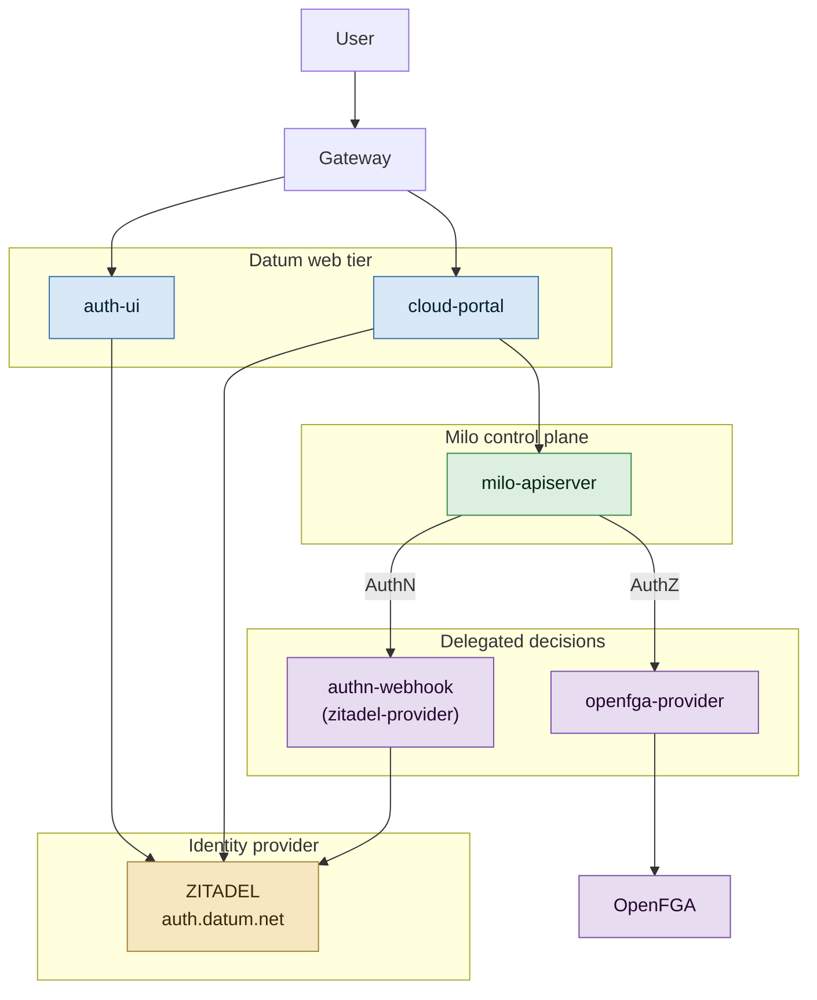
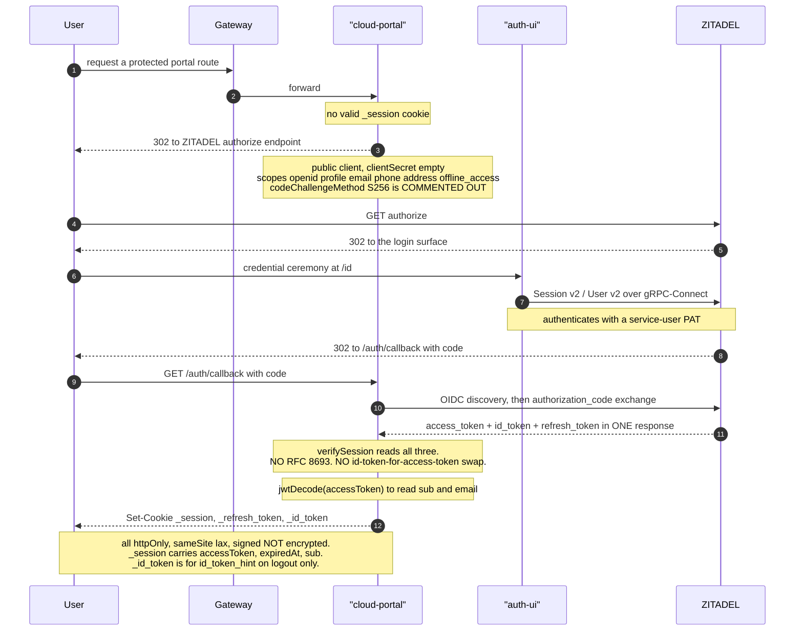
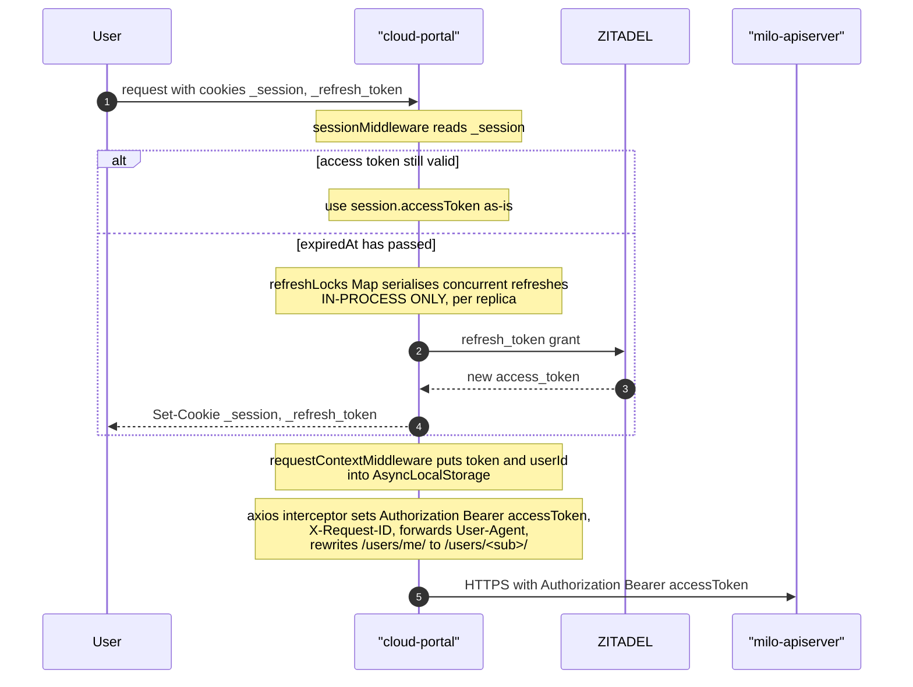
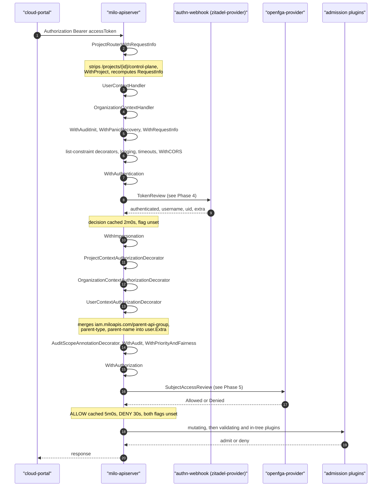
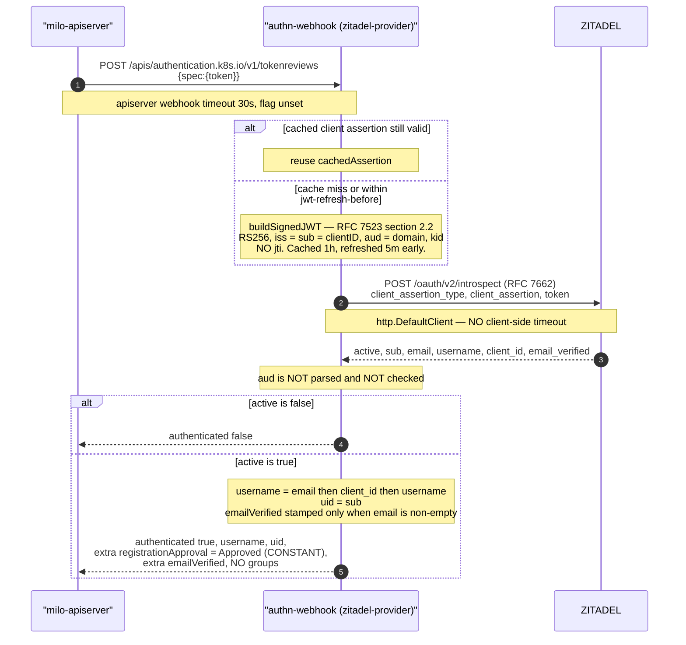
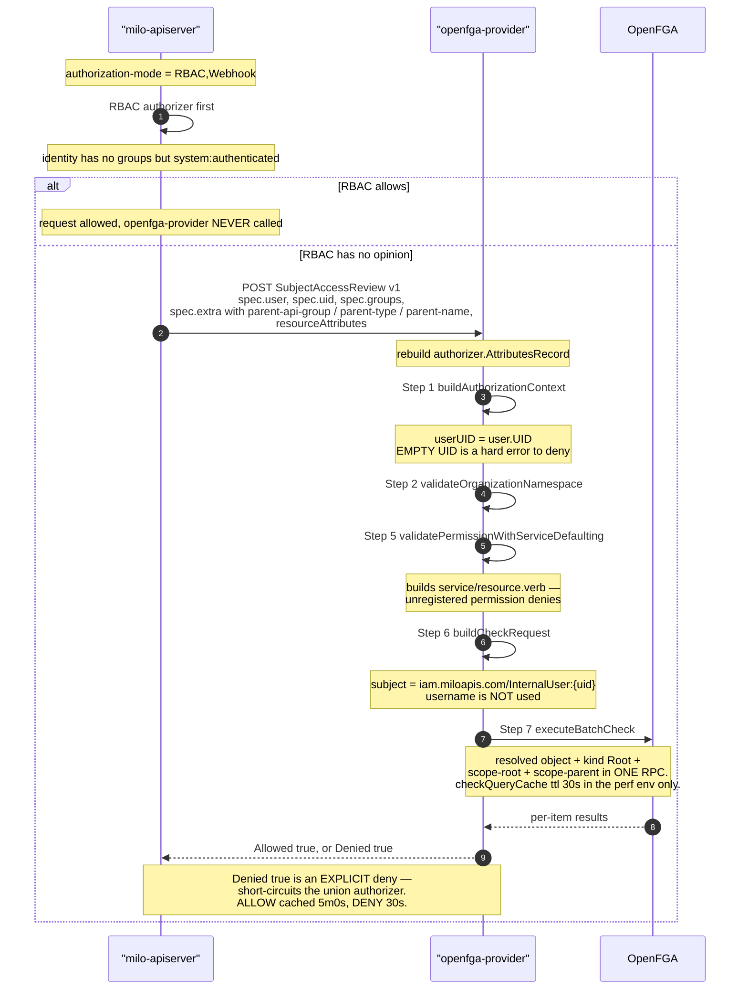
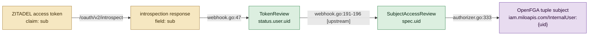
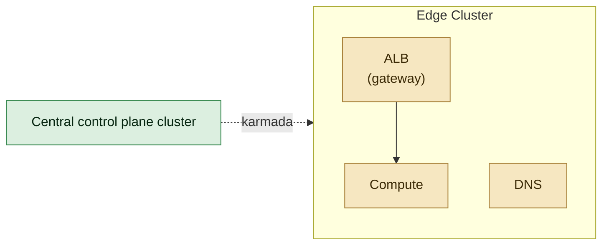

# Datum Cloud — The Authentication Sequence, End to End

**The exact ordered sequence from a browser request to an authorization decision, with a confidence rating and a source reference for every assertion.**

| | |
|---|---|
| **Written** | 2026-09-02 |
| **Scope** | The authentication path and the identity that flows along it, from `User` through `cloud-portal` / `auth-ui` and `ZITADEL` into `milo-apiserver`, and out to the two delegated decision services. Authorization appears in full where the authentication path hands off to it. |
| **Commits** | `cloud-portal@74011661` (2026-08-27) · `milo@7f292ebb` (2026-08-27) · `zitadel-provider@ae66289` (2026-08-28) · `openfga-provider@3319166` (2026-08-10) · `datum@d1d5586` (2026-08-03) · `auth-ui@7d9a80654` (2026-08-10) |
| **Companions** | `zitadel-arch-unverified.md` (component view) · `issues/issues-auth-additional-pending-verification.md` (defects) · `issues/issues-auth.md` · `DatumCloudWorkloadIdentityAssessment-1.md` (constraints K1–K6) |
| **Origin** | Written to settle an open question: the exact ordering of `TokenReview` and `SubjectAccessReview`, and what token actually travels where. |

---

## How to read the confidence ratings

A rating answers one question: **how sure am I that this is what happens?**

| Rating | Means |
|---|---|
| **100%** | Read directly in source at the commit above. The code does this. |
| **90–95%** | Read in source, but the outcome depends on one thing not visible in any repository — usually deployment configuration or ZITADEL instance state. |
| **85%** | The mechanism is certain; the effect depends on configuration that exists in no repository on disk. |
| **[upstream]** | Read in vendored Kubernetes source rather than a Datum repository. Cited as `k8s.io/...@<version>/path:line`, resolvable from the module cache with `go mod download`. Datum does not own this code but its behaviour is load-bearing here. |

**A 100% rating is a claim about the code, not about production.** No production deployment configuration exists in any repository consulted — `milo/config/overlays/` contains only `test-infra`, and `zitadel-provider/config/overlays/` only `ci`. Where a step's real-world behaviour turns on absent configuration, the rating is lowered and the reason is stated inline.

Nothing in this document has been observed on a production system. One step (Phase 4) **was** observed on a local deployment, where it failed — see the note at Phase 4.

---

## 1. Four claims, adjudicated

This document was prompted by four propositions. Settling them is the fastest route into the sequence.

### 1.1 "An exchange of an ID token / refresh token for an access token might not be occurring" — substantially correct

There is **no RFC 8693 token exchange anywhere on this path, and no ID-token-for-access-token swap at any point.**

At login, `cloud-portal` performs a plain OIDC authorization-code exchange. ZITADEL returns `access_token`, `id_token` and `refresh_token` **in a single response**, and the portal simply reads all three off it:

```ts
// cloud-portal/app/modules/auth/strategies/zitadel.server.ts:22-27
return {
  idToken: tokens.idToken(),
  accessToken: tokens.accessToken(),
  refreshToken: tokens.hasRefreshToken() ? tokens.refreshToken() : null,
  expiredAt: tokens.accessTokenExpiresAt(),
};
```

A refresh-token grant *does* occur later, but only once the access token has expired (Phase 2, step 6). So: nothing exchanges an ID token, ever; and at login nothing is exchanged for the access token beyond the authorization code itself.

### 1.2 "The TokenReview simply does AuthN only" — correct, 100%

It decides authentication and nothing else. One addition matters, though: it also **emits two `userInfo.extra` keys that are consumed as security decisions downstream** — `iam.miloapis.com/registrationApproval` and `iam.miloapis.com/emailVerified`. So it decides only authentication, but it is the producer for an authorization gate and an admission gate. See Phase 4, step 23.

### 1.3 "The cookie at the moment contains the id-token and refresh-token" — not what the source says

There are **three** cookies, all set in the same callback handler (`cloud-portal/app/routes/auth/callback.tsx:61-81`):

| Cookie | Contents | Type | Sent to `milo-apiserver`? |
|---|---|---|---|
| `_session` | `{ accessToken, expiredAt, sub }` | `IAccessTokenSession` | **Yes — this is the bearer** |
| `_refresh_token` | `{ refreshToken }` | `IRefreshTokenSession` | No |
| `_id_token` | `{ idToken }` | — | **No** |

Cookie names: `cloud-portal/app/utils/auth/auth.config.ts:37-41`. Types: `cloud-portal/app/utils/auth/auth.types.ts:9-33`.

The bearer is unambiguous — one line settles it:

```ts
// cloud-portal/app/server/middleware/request-context.ts:19
token: session?.accessToken ?? '',
```

and every other server-side path agrees: `app/server/routes/proxy.ts:40`, `watch.ts:47,109`, `permissions.ts:14,53`, `prometheus.ts:22`, `assistant.ts:63`.

The `_id_token` cookie is used for exactly two things, neither of which involves Milo: the `id_token_hint` parameter on OIDC RP-initiated logout (`app/utils/auth/auth.service.ts:512-569`) and the active-sessions page (`app/routes/account/settings/active-sessions.tsx:27`).

**If only two cookies were observed in a browser:** `_session` is a separate cookie name that is easy to overlook, and there is a failure mode that would produce exactly that symptom — if ZITADEL issued an *opaque* access token for this application, `jwtDecode` at `callback.tsx:58` throws, the `catch` redirects to the login page, and no `_session` is ever committed. That presents as a login loop. Worth confirming against the deployed version, which may also predate this code.

### 1.4 "The `sub` within the id-token contains the user uuid" — right about the value, not the source

The portal reads `sub` from the **access** token, not the ID token:

```ts
// cloud-portal/app/routes/auth/callback.tsx:58
const decoded = jwtDecode<{ sub: string; email: string }>(rest.accessToken);
```

In OIDC both tokens carry the same `sub`, so the *value* is identical. But it is the access token that travels to Milo, and therefore the access token's `sub` that becomes the `uid` on which the entire authorization model keys. See §8.

### 1.5 A correction to the earlier component view

`zitadel-arch-unverified.md` §2 labels the ZITADEL box "Zitadel / OIDC Exchange", following `Frontend-auth.png`. That label is misleading and this document supersedes it: what happens there is an **authorization-code exchange** at login and a **refresh grant** thereafter. Neither is a token exchange in the RFC 8693 sense, and no such exchange exists anywhere on the platform.

---

## 2. High-level block diagram

The key blocks only. Every subsequent phase is a walk through part of this picture.



**The one structural fact to carry forward:** `milo-apiserver` performs neither authentication nor authorization itself. Both are out-of-process calls to the two blocks in *Delegated decisions*, over standard Kubernetes webhook interfaces.

---

## 3. Phase 1 — Login

| # | Step | Confidence | Source |
|---|---|---|---|
| 1 | `cloud-portal` redirects to ZITADEL's authorize endpoint. OIDC authorization-code flow as a **public client** (`clientSecret: ''`), scopes `openid profile email phone address offline_access`. **`codeChallengeMethod: CodeChallengeMethod.S256` is commented out** — no PKCE | **100%** | `cloud-portal/app/modules/auth/strategies/zitadel.server.ts:48-54`, PKCE at `:53` |
| 2 | ZITADEL authenticates the human. The credential ceremony is served by `auth-ui` at `/id`, which drives ZITADEL Session/User/Settings v2 over gRPC-Connect using a service-user PAT | **90%** — `auth-ui` source is unambiguous, but the routing that puts `auth-ui` in front of ZITADEL's hosted flow is deployment configuration in no repository | `auth-ui/app/modules/auth/providers/zitadel/*`; PAT at `auth-ui/app/server/infra/env.server.ts:8` |
| 3 | Browser returns to `/auth/callback` with the code. The portal exchanges it at ZITADEL's token endpoint, resolved by OIDC discovery against `zitadelIssuer`. **One response returns all three tokens.** No RFC 8693 | **100%** | `zitadel.server.ts:22-27` (`verifySession`), discovery at `:46-56` |
| 4 | The portal `jwtDecode`s the **access** token to read `sub` and `email` | **100%** that the code does this. **90%** that ZITADEL issues JWT access tokens for this application — an opaque token makes this line throw and login fail | `cloud-portal/app/routes/auth/callback.tsx:58` |
| 5 | Three cookies committed in one response: `_session`, `_refresh_token`, `_id_token`. All `httpOnly`, `sameSite: 'lax'`, `secure` in production, `path: '/'`, `domain` = the `appUrl` host, and **HMAC-signed but not encrypted** with `SESSION_SECRET` | **100%** | `callback.tsx:61-81`; cookie definitions `app/utils/auth/auth.service.ts:25-51` and `app/utils/cookies/id-token.server.ts:12-20` |
| 6 | `_id_token` is stored solely for OIDC RP-initiated logout and the active-sessions page. It is never sent to `milo-apiserver` | **100%** | `app/utils/auth/auth.service.ts:512-569`; `app/routes/account/settings/active-sessions.tsx:27` |



---

## 4. Phase 2 — An API call from the browser

| # | Step | Confidence | Source |
|---|---|---|---|
| 7 | `sessionMiddleware` loads `_session`. If `expiredAt` has passed, `AuthService.refreshTokens()` runs `doRefreshTokens()` → `zitadelStrategy.refreshToken(refreshToken)` against ZITADEL, and re-commits the cookies. Concurrent refreshes for the same token serialise on an **in-process** `Map` keyed by the token's first 20 characters | **100%** | `cloud-portal/app/utils/auth/auth.service.ts:176-222`; lock at `:82`, `:185`, refresh call at `:222` |
| 8 | `requestContextMiddleware` puts `{ requestId, token: session.accessToken, userId: session.sub, userAgent }` into `AsyncLocalStorage` | **100%** | `app/server/middleware/request-context.ts:14-24`; type at `app/modules/axios/request-context.ts:9-21` |
| 9 | The axios request interceptor sets `Authorization: Bearer <accessToken>` and `X-Request-ID`, forwards the browser `User-Agent` for upstream audit, and rewrites any `/users/me/` path segment to `/users/<sub>/` | **100%** | `app/modules/axios/axios.server.ts:36`, `:41`, `:64` |
| 10 | The request goes to `env.public.apiUrl` — `milo-apiserver` — with no intermediate proxy on the SSR path | **100%** | `app/modules/axios/axios.server.ts:17-23` |

The client-side path differs only in target: browser-originated calls go through the portal's own `/proxy` route, which injects the **same** `session.accessToken` (`app/server/routes/proxy.ts:40`). The `SelfSubjectAccessReview` the portal issues to gate UI affordances is an ordinary API call over this same path (`app/server/routes/permissions.ts:14,53`).



---

## 5. Phase 3 — The `milo-apiserver` filter chain, in request order

`DefaultBuildHandlerChain` (`milo/cmd/milo/apiserver/config.go:493-583`) assigns `handler = filter(handler)` repeatedly, so **the last line assigned is the outermost filter**. The order below is that construction read backwards, which is the order a request actually traverses.

`ProjectRouterWithRequestInfo` sits *outside* `DefaultBuildHandlerChain`, wrapping it for all three servers — the generic apiserver, apiextensions, and the aggregator.

| # | Filter, by its function name | Confidence | Source |
|---|---|---|---|
| 11 | **`ProjectRouterWithRequestInfo`** — absolute outermost. If the path contains `/projects/{id}/control-plane/`, strips that prefix, stashes the project id via `WithProject`, and **recomputes `RequestInfo`** on the rewritten path | **100%** | wrapped at `config.go:411`, `:451`, `:480`; implementation `milo/pkg/server/filters/projects.go:20-60`; `WithProject` at `milo/pkg/request/request.go:10` |
| 12 | `UserContextHandler` → `OrganizationContextHandler` — the same rewrite for `/users/{id}/control-plane/` and `/organizations/{org}/control-plane/`, stashing their ids | **100%** | `config.go:579-580`; `WithOrganization` set at `milo/pkg/server/filters/organizations.go:74`, defined `milo/pkg/request/request.go:25` |
| 13 | `WithAuditInit` → `WithPanicRecovery` → `WithRequestReceivedTimestamp` → **`WithRequestInfo`** → seven list-constraint decorators → `WithLatencyTrackers` → tracing → `WithHTTPLogging` → `WithHSTS` → `WithCacheControl` → `WithProbabilisticGoaway` → `WithWaitGroup` → `WithRequestDeadline` → `WithTimeoutForNonLongRunningRequests` → `WithWarningRecorder` → `WithCORS` | **100%** | `config.go:533-583` |
| 14 | **`WithAuthentication`** — runs a **union** token authenticator, not the webhook alone. Milo installs `NewBuiltInAuthenticationOptions().WithAll()`, which includes the x509, token-file, OIDC, service-account, bootstrap-token and webhook arms. In the base manifest `CLIENT_CA_FILE` is populated but `TOKEN_AUTH_FILE` and `AUTHENTICATION_CONFIG` are `""`, and **no `--requestheader-*` flags are set on this deployment**, so the effective bearer-token path is x509 → **webhook**. The `TokenReview` call to `authn-webhook` is that last arm. See Phase 4 | **100%** | `config.go:530`; options at `cmd/milo/apiserver/server.go:223` → **[upstream]** `k8s.io/kubernetes@v1.35.0/pkg/controlplane/apiserver/options/options.go:120`, `pkg/kubeapiserver/options/authentication.go:174-184`; base values `milo/config/apiserver/deployment.yaml:139-148` |
| 14a | **The 2-minute figure, derived exactly.** `WithWebHook()` defaults `CacheTTL: 2 * time.Minute`, overridable by `--authentication-token-webhook-cache-ttl`, which Milo does not set. Two cache layers compose: the webhook arm is individually wrapped at that TTL **for successes *and* failures alike**, and the union of all arms is then wrapped at `TokenSuccessCacheTTL: 10s` / `TokenFailureCacheTTL: 0s`. So the union re-evaluates after 10s but the webhook itself is not re-consulted for up to **2m** — and a transient introspection failure is likewise remembered for 2m | **100%** — no longer "the documented default" but read at source | **[upstream]** `k8s.io/kubernetes@v1.35.0/pkg/kubeapiserver/options/authentication.go:242` (default), `:485` (flag), `pkg/kubeapiserver/authenticator/config.go:416` (webhook arm wrap), `:208-209` (union wrap), `:168-169` (union TTLs) |
| 15 | `WithImpersonation` | **100%** | `config.go:525` |
| 16 | **`ProjectContextAuthorizationDecorator` → `OrganizationContextAuthorizationDecorator` → `UserContextAuthorizationDecorator`**, in that request order. Each merges `iam.miloapis.com/parent-api-group`, `parent-type`, `parent-name` into `user.Extra` | **100%** | `config.go:517-519` (assigned User, Org, Project — so traversed Project, Org, User); `projects.go:81-114`, `organizations.go:100-135`; merge helper `milo/pkg/server/filters/utils.go:14-21`; key constants `milo/pkg/apis/iam/v1alpha1/doc.go:7-15` |
| 17 | `AuditScopeAnnotationDecorator` → `WithAudit` → `WithPriorityAndFairness` | **100%** | `config.go:515`, `:512`, `:505` |
| 18 | **`WithAuthorization`** ← the `SubjectAccessReview` to `openfga-provider` happens here. See Phase 5 | **100%** | `config.go:497` |
| 19 | The API handler → REST storage → admission: mutating webhooks, then validating webhooks, `ValidatingAdmissionPolicy` objects, and the in-tree plugins `emailverification`, `projectsuspension`, `namespace`, plus `ResourceQuotaEnforcement` | **95%** — ordering within admission is upstream Kubernetes behaviour, not read line by line here | `milo/internal/apiserver/admission/plugin/`; `cmd/milo/apiserver/admission.go` |

**This is the answer to the ordering question.** Authentication and authorization are strictly ordered and separated by five filters, and the parent-context injection sits **between** them — steps 14 → 16 → 18. That is not incidental: it is the only reason `openfga-provider` can see project or organization scope at all, because scope arrives as `user.Extra` on the authenticated identity rather than in the request body.

**One note on step 16, and the reason is stronger than it first appears.** The comment at `projects.go:104` reads *"Project takes precedence over Organization for parent scoping."* `userWithExtra` merges with **later-key-wins** semantics (`utils.go:16-18`), and Organization is traversed *after* Project — so on merge semantics alone, Organization would win if both contexts were set.

Precedence is nonetheless **structural, not coincidental** — 100%. `ProjectRouterWithRequestInfo` is the outermost filter and rewrites the path as
`newPath := "/" + strings.TrimPrefix(r.URL.Path[idx+len(projectsSeg)+slash+len(controlPlaneSeg):], "/")` (`projects.go:45-47`), which **discards everything before and including `/projects/{id}/control-plane`**. `OrganizationContextHandler` then matches on the *rewritten* `req.URL.Path` against the literal prefix `/apis/resourcemanager.miloapis.com/v1alpha1/organizations/` (`organizations.go:44-45`). So on a nested path such as `.../organizations/acme/control-plane/.../projects/p1/control-plane/api/v1/...`, the organization segment is gone by the time the organization handler sees the request, `WithOrganization` is never called, and its decorator short-circuits at `organizations.go:103-108`. The two contexts cannot coexist.



---

## 6. Phase 4 — Inside step 14: the `TokenReview`

| # | Step | Confidence | Source |
|---|---|---|---|
| 20 | `milo-apiserver` POSTs a `TokenReview` with `{spec:{token}}` to `/apis/authentication.k8s.io/v1/tokenreviews` on `authn-webhook` | **100%** | endpoint registered at `zitadel-provider/internal/webhook/webhook.go:60`; apiserver flags `milo/config/apiserver/deployment.yaml:30-31` |
| 21 | The provider builds or reuses an **RFC 7523 §2.2** client assertion — RS256, `iss = sub = clientID`, `aud = domain`, `kid = keyID`, **no `jti`** — cached for `--jwt-expiration` (1h in the base manifest) and refreshed `--jwt-refresh-before` (5m) early | **100%** | `zitadel-provider/pkg/token/introspector.go:276-300` (build), `:211-272` (cache); flags `config/base/services/authn-webhook/authn-webhook.yaml` |
| 22 | POSTs to ZITADEL `{domain}/oauth/v2/introspect` — **RFC 7662** — with `client_assertion_type`, `client_assertion` and `token`. The provider uses `http.DefaultClient`, which has **no timeout**; the only bound is the apiserver's own 30s webhook timeout | **100%** | `introspector.go:122` (URL), `:164-166` (form), `:177` (`http.DefaultClient`) |
| 23 | Parses **six** fields only: `active`, `sub`, `email`, `username`, `client_id`, `email_verified`. **`aud` is not parsed and is never checked** — no audience restriction exists on this path | **100%** | `introspector.go:31-46` |
| 24 | If `active` is false → denied. Otherwise `username` is resolved by the precedence **`email` → `client_id` → `username`**, and `uid` is set to `sub` | **100%** | `webhook.go:35-47`; precedence `introspector.go:55-66` |
| 25 | Returns `authenticated: true` with `username`, `uid`, and `extra`: `iam.miloapis.com/registrationApproval` set to **the literal `"Approved"`**, plus `iam.miloapis.com/emailVerified` **only when `email` is non-empty**. **No groups are returned** — the apiserver auto-adds only `system:authenticated` | **100%** | `webhook.go:49-58`; `zitadel-provider/internal/webhook/response.go:13-16`, `:30-31`, `:34-50` |

**The `registrationApproval` value is a constant, and it is asserted as such.** `Allowed()` passes `RegistrationApprovalStateApproved` unconditionally, and the unit suite pins `expectRegistrationApproval: "Approved"` across all seven authenticated cases, with the comment *"registrationApproval is always stamped."* The consumer is a cluster-wide `ValidatingAdmissionPolicy` in the `datum` distribution whose only input is that key — so the policy cannot deny. Full detail: `issues/issues-auth-additional-pending-verification.md` **AUTHX-001**. Test: `zitadel-provider/internal/webhook/http_authentication_webhook_test.go:183-261`, `:335-342`. Policy: `datum/config/services/iam.miloapis.com/validation/approved-user-policy.yaml:14`.

> **Observed failing, 2026-09-01.** On the deployment `task ci:setup` produces, this entire phase fails for every token with `unauthorized_client`. The introspection client ID is empty — `LoadZitadelPrivateKey` reads only `clientId`, the mounted `iam-admin` secret is a ZITADEL machine-user key carrying `userId`, and the validation guard is skipped for `.json` paths. The webhook logs `client_id: ""` as *"Successfully created token introspector"* and serves anyway. It fails closed, but totally. Detail: **AUTHX-013**. Source: `zitadel-provider/pkg/private-key/load-zitadel-private-key.go:22-34`; `introspector.go:108-114`, `:131-136`.



---

## 7. Phase 5 — Inside step 18: the authorization decision

| # | Step | Confidence | Source |
|---|---|---|---|
| 26 | `--authorization-mode=RBAC,Webhook`, so **RBAC is consulted first**. The identity carries no groups beyond the auto-added `system:authenticated`, so RBAC can grant only what is bound to that group or to the username. An RBAC allow ends the request and `openfga-provider` is never called | **100%** on ordering. **95%** on effect — see the enumeration below | `milo/config/apiserver/deployment.yaml:28`, `:109-110` |
| 27 | Otherwise the webhook authorizer serialises the request attributes into a **`SubjectAccessReview` v1** and POSTs it. Milo uses the **legacy kubeconfig form** of the webhook config, not a structured `AuthorizationConfiguration`, so there is no `failurePolicy` field | **100%** | `deployment.yaml:32-33`, `:117-119` |
| 28 | The SAR carries `spec.user`, `spec.uid`, `spec.groups`, `spec.extra` — including the three `parent-*` keys from step 16 — plus the resource attributes. `openfga-provider` rebuilds an `authorizer.AttributesRecord` from it, parsing any field and label selectors | **100%** | `openfga-provider/internal/webhook/webhook.go:15-95`, attribute record at `:27-33` |
| 29 | **Step 1 — build context.** `userUID := attributes.GetUser().GetUID()`. **If empty, it returns an error immediately**, which becomes an explicit deny | **100%** | `openfga-provider/internal/webhook/subjectaccessreview_authorizer.go:332-348`; parent context read at `:124-144` |
| 30 | **Step 2 — validate the organization namespace** for organization-scoped requests. Failure denies | **100%** | `subjectaccessreview_authorizer.go:180`, implementation `:414` |
| 31 | **Step 5 — validate the permission is registered.** Builds `{service}/{resource}.{verb}` and checks it exists as a `ProtectedResource` permission. **An unregistered permission is denied**, with reason `permission '<x>' not registered` | **100%** — note the code's own step numbering skips 3 and 4 | `subjectaccessreview_authorizer.go:193-207`, `:604` (`validatePermissionWithServiceDefaulting`), `:652` (`buildPermissionString`) |
| 32 | **Step 6 — build the check.** The OpenFGA subject is **`iam.miloapis.com/InternalUser:<userUID>`**. The relation is a hashed permission. The object is resolved from the request attributes | **100%** | `subjectaccessreview_authorizer.go:452-480`, subject at `:459` |
| 33 | **Step 7 — `executeBatchCheck`.** One RPC covering the resolved object, the kind-level `Root` object, and — when a parent context is present — a `scope-root` (`iam.miloapis.com/Root:<apiGroup>/<kind>`) and a `scope-parent` (`<apiGroup>/<kind>:<name>`) | **100%** | `subjectaccessreview_authorizer.go:208-281`, executor at `:491` |
| 34 | The response sets `Allowed: true` on allow, and **`Denied: true` for any non-allow** — an *explicit* deny. Upstream maps `Denied` → `DecisionDeny`, `Allowed` → `DecisionAllow`, and neither → `DecisionNoOpinion`; only `NoOpinion` defers to the next authorizer, so this webhook never defers | **100%** | `openfga-provider/internal/webhook/webhook.go:80-90`; mapping **[upstream]** `k8s.io/apiserver@v0.35.0/plugin/pkg/authorizer/webhook/webhook.go:288-297` |
| 35 | `openfga-provider` caches **no authorization decisions** — every SAR issues a live `executeBatchCheck`. It does hold three non-decision caches: an informer index of `ProtectedResource` objects, a TTL-based **cached discovery client** used by `isResourceNamespaced`, and `ModelIDWatcher` holding the current authorization-model id. OpenFGA itself caches: `checkQueryCache` at `ttl: 30s`, present in the `perf` environment config only. The apiserver's own webhook response cache holds ALLOW **5m0s** and DENY **30s**, both flags unset by Milo | **100%** for code and committed config. **85%** for production TTLs — no production overlay exists | `openfga-provider/internal/webhook/protectedresource_cache.go`; `subjectaccessreview_authorizer.go:352-372` (discovery cache), `:468-470` (`ModelIDWatcher`); `openfga-provider/config/environments/perf/openfga-postgres-patch.yaml:27-30`; apiserver cache **[upstream]** `k8s.io/apiserver@v0.35.0/plugin/pkg/authorizer/webhook/webhook.go:280-286`; Milo flags absent from `milo/config/` |

**What RBAC can actually grant a real user — enumerated.** Every `ClusterRoleBinding` and `RoleBinding` in `milo/config` and `datum/config` binds a `ServiceAccount`, with **exactly one exception**: `datum/config/assignable-organization-roles/role-access/viewer-role-binding.yaml` binds `Group: system:authenticated` to an RBAC `Role` in namespace `datum-cloud` granting `get`, `watch`, `list` on `iam.miloapis.com/roles` (`.../role-access/viewer-role.yaml`).

So for a ZITADEL-authenticated identity, **RBAC can allow exactly one thing** — reading `Role` objects in the `datum-cloud` namespace, which is what lets the console render the assignable-role list. **Every other request reaches `openfga-provider`.** Two consequences follow: the PDP is on the critical path of essentially every user action, and the 5-minute cached-ALLOW window in step 35 therefore governs nearly all of them rather than only the requests RBAC declines. **95%** rather than 100% because `datum` on disk (`d1d5586`, 2026-08-03) is older than `milo`, and what a deployment actually applies is not visible.

Note the distinction that makes this checkable: `milo/config/roles/*.yaml`, `milo/config/optional-policies/**` and `milo/config/services/quota/iam/policies/**` also reference `system:authenticated`, but those are Milo-native `iam.miloapis.com` `Role` and `PolicyBinding` objects consumed by the PDP — **not** `rbac.authorization.k8s.io` objects, and they play no part in step 26.

**The username plays no part in the decision.** The OpenFGA subject is built purely from `uid`. The `email → client_id → username` precedence resolved in Phase 4 step 24 affects audit, display and RBAC matching — never the PDP verdict.



---

## 8. The identity chain

Five hops, every one verified in source, all at **100%**. This is the single thread that ties the phases together.



| Hop | Where the value comes from | Source |
|---|---|---|
| Access token `sub` → introspection `sub` | ZITADEL echoes the subject | `introspector.go:33` |
| Introspection `sub` → `status.user.uid` | `sub := claims.Sub`, passed as the `uid` argument | `zitadel-provider/internal/webhook/webhook.go:47`, `response.go:30-31` |
| `status.user.uid` → SAR `spec.uid` | `UID: user.GetUID()` in the webhook authorizer's request construction. **This hop is upstream Kubernetes code, present in no Datum repository** — Milo only installs the authorizer (`config.go:497`) | **[upstream]** `k8s.io/apiserver@v0.35.0/plugin/pkg/authorizer/webhook/webhook.go:191-196` |
| SAR `spec.uid` → `authorizer.AttributesRecord.User.UID` | `UID: r.Spec.UID` | `openfga-provider/internal/webhook/webhook.go:30` |
| `User.UID` → OpenFGA subject | `iam.miloapis.com/InternalUser:<userUID>` | `openfga-provider/internal/webhook/subjectaccessreview_authorizer.go:333`, `:459` |

Two consequences worth stating plainly. The `uid` — a ZITADEL user UUID — is the **entire** identity the authorization model sees. And because it is required, any authentication path that produces an identity without a `uid` is denied platform-wide by the PDP.

---

## 9. What cannot be established from source

| # | Unknown | Why | Confidence in the unknown |
|---|---|---|---|
| U1 | The endpoints, TLS and per-webhook timeouts of **both** webhooks | `--authentication-token-webhook-config-file=/etc/kubernetes/config/authentication-config.yaml` and `--authorization-webhook-config-file=/etc/kubernetes/config/authorization-config.yaml` are referenced by path and **exist in no repository on disk** | **100%** that both files are absent |
| U2 | Whether production overrides `--authentication-token-webhook-cache-ttl` (2m default) or `--authorization-webhook-cache-authorized-ttl` (5m default) | Both flags are unset in the base manifest and no production overlay exists to check | Unknown |
| U3 | Whether ZITADEL issues JWT or opaque access tokens for the `cloud-portal` application | A per-application ZITADEL setting. Inferred **JWT at 90%** from `jwtDecode` at `callback.tsx:58` — an opaque token would throw there | 90% JWT |
| U4 | Which credential production mounts as the introspection client | The base manifest names it `machine-account-key.json`, the shape that fails; that introspection has evidently worked somewhere implies an *application* key with a real `clientId`. Both cannot be true of one file | See **AUTHX-013** |
| U5 | Whether the `customize-jwt` action is bound to `function/preaccesstoken` | Target and execution registration is runtime ZITADEL state, created manually per `zitadel-provider/docs/runbooks/passkey-local-testing.md:79-86`. Nothing in `ci:setup` registers it | See **AUTHX-004** |
| U6 | Which `ClusterRole` objects the deployment installs, and therefore what RBAC grants before the webhook is consulted | Not in `milo`; partly in `datum`, which is older than `milo` on disk | Unknown |

---

## 10. A finding this trace produced

**The `cloud-portal` refresh lock is per-replica.** `refreshLocks` is a module-level `Map` (`cloud-portal/app/utils/auth/auth.service.ts:82`), keyed on the first 20 characters of the refresh token (`:185`). It serialises concurrent refreshes **within one process only**. With `offline_access` requested and ZITADEL rotating refresh tokens, two replicas handling requests for the same session can both present the same refresh token — the first rotation invalidates the second, producing an intermittent logout with no server-side error.

`Frontend-auth.png` draws two `Portal` replicas, which is exactly what makes the in-process lock insufficient.

Same shape as `issues/issues-auth.md` **AUTH-014** (rate limiting is per-replica in-memory unless Redis is provisioned), and it wants the same class of fix: a shared lock, sticky sessions, or tolerating one retry on `invalid_grant`. **Not yet filed** — it belongs in `issues-auth.md` Category B rather than the authN-path companion register.

---

## 11. Source index

Every file this document relies on, by repository.

### `cloud-portal@74011661`

| Path | Used for |
|---|---|
| `app/modules/auth/strategies/zitadel.server.ts:10-33` | `verifySession` — the three tokens off the code exchange |
| `app/modules/auth/strategies/zitadel.server.ts:48-54` | Public client, scopes; **PKCE commented out at `:53`** |
| `app/routes/auth/callback.tsx:46,58,61-81` | Callback: decode access token, commit three cookies |
| `app/utils/auth/auth.config.ts:37-41` | `AUTH_COOKIE_KEYS` — `_session`, `_refresh_token`, `_id_token` |
| `app/utils/auth/auth.types.ts:9-33` | `IAuthSession`, `IAccessTokenSession`, `IRefreshTokenSession` |
| `app/utils/auth/auth.service.ts:25-51` | Cookie flags — signed, not encrypted |
| `app/utils/auth/auth.service.ts:82,185,192,215,222` | `refreshLocks`, `refreshTokens`, `doRefreshTokens` |
| `app/utils/auth/auth.service.ts:512-569` | `end_session` / `id_token_hint` |
| `app/utils/cookies/id-token.server.ts:12-20` | `_id_token` cookie |
| `app/server/middleware/request-context.ts:14-24` | **`token: session.accessToken`** |
| `app/modules/axios/request-context.ts:9-21` | `RequestContext` |
| `app/modules/axios/axios.server.ts:17-23,36,41,64` | `baseURL`, `Authorization`, `X-Request-ID`, `/users/me/` rewrite |
| `app/server/routes/proxy.ts:40` · `watch.ts:47,109` · `permissions.ts:14,53` · `prometheus.ts:22` · `assistant.ts:63` | Every other bearer site — all `session.accessToken` |
| `app/modules/axios/k8s-error.ts:10-16,83` | Parses `Status`, `reason`, `code`, `details.causes[]` |
| `app/routes/account/settings/active-sessions.tsx:27` | Second `_id_token` consumer |

### `milo@7f292ebb`

| Path | Used for |
|---|---|
| `cmd/milo/apiserver/config.go:411,451,480` | `ProjectRouterWithRequestInfo` wrapping all three servers |
| `cmd/milo/apiserver/config.go:493-583` | `DefaultBuildHandlerChain` — the whole filter order |
| `cmd/milo/apiserver/config.go:497` | `WithAuthorization` |
| `cmd/milo/apiserver/config.go:505,512,515` | `WithPriorityAndFairness`, `WithAudit`, `AuditScopeAnnotationDecorator` |
| `cmd/milo/apiserver/config.go:517-519` | The three parent-context decorators |
| `cmd/milo/apiserver/config.go:525,530,533` | `WithImpersonation`, `WithAuthentication`, `WithCORS` |
| `cmd/milo/apiserver/config.go:573,579-580` | `WithRequestInfo`, `OrganizationContextHandler`, `UserContextHandler` |
| `pkg/server/filters/projects.go:20-60` | `ProjectRouterWithRequestInfo` |
| `pkg/server/filters/projects.go:81-114` | `ProjectContextAuthorizationDecorator`; precedence comment at `:104` |
| `pkg/server/filters/organizations.go:74,100-135` | `WithOrganization`; `OrganizationContextAuthorizationDecorator` |
| `pkg/server/filters/utils.go:14-21` | `userWithExtra` — merge, later-key-wins |
| `pkg/request/request.go:10,25` | `WithProject`, `WithOrganization` |
| `pkg/apis/iam/v1alpha1/doc.go:7-15` | `ParentNameExtraKey`, `ParentKindExtraKey` (= `parent-type`), `ParentAPIGroupExtraKey` |
| `config/apiserver/deployment.yaml:28-33,109-119` | Auth flags and their values; the two absent config-file paths |
| `internal/apiserver/admission/plugin/emailverification/admission.go:68,134-158` | Consumer of `iam.miloapis.com/emailVerified`; absence admits |
| `pkg/features/features.go:122-125` | `EmailVerifiedGate` defaults false |

### `zitadel-provider@ae66289`

| Path | Used for |
|---|---|
| `internal/webhook/webhook.go:16-61` | The `TokenReview` handler; `uid = sub` at `:47`; discriminator at `:53`; endpoint at `:60` |
| `internal/webhook/response.go:13-16,30-31,34-50` | The two `extra` keys; `Approved` constant |
| `internal/webhook/http_authentication_webhook_test.go:183-261,335-342` | Seven cases pinning `Approved` |
| `pkg/token/introspector.go:31-46` | `IntrospectionData` — six fields, no `aud` |
| `pkg/token/introspector.go:55-66` | `EffectiveUsername` precedence |
| `pkg/token/introspector.go:108-114,122,131-136` | The `.json`-gated guard; introspection URL; the `client_id: ""` log |
| `pkg/token/introspector.go:150-207` | `Introspect`; form at `:164-166`; `http.DefaultClient` at `:177` |
| `pkg/token/introspector.go:211-272,276-300` | Assertion cache; `buildSignedJWT` |
| `pkg/private-key/load-zitadel-private-key.go:22-34` | Reads only `clientId` |
| `config/base/services/authn-webhook/authn-webhook.yaml` | `replicas: 1`, `JWT_EXPIRATION: 1h`, empty volumes |
| `docs/runbooks/passkey-local-testing.md:79-86` | Manual target / execution registration |

### `openfga-provider@3319166`

| Path | Used for |
|---|---|
| `internal/webhook/webhook.go:15-95` | SAR decode → `AttributesRecord`; `UID` at `:30`; `Denied: true` at `:80-90` |
| `internal/webhook/subjectaccessreview_authorizer.go:124-144` | `extractParentContext` |
| `internal/webhook/subjectaccessreview_authorizer.go:147-281` | `Authorize` — the numbered steps |
| `internal/webhook/subjectaccessreview_authorizer.go:332-348` | `buildAuthorizationContext`; **UID required** |
| `internal/webhook/subjectaccessreview_authorizer.go:414,452-480,491,604,652` | Namespace validation, check construction, `executeBatchCheck`, permission validation |
| `internal/webhook/protectedresource_cache.go` | The only cache — an informer index |
| `config/environments/perf/openfga-postgres-patch.yaml:27-30` | `checkQueryCache` `ttl: 30s` |

### `datum@d1d5586`

| Path | Used for |
|---|---|
| `config/services/iam.miloapis.com/validation/approved-user-policy.yaml:14` | The `*/*/*` VAP whose only input is the constant |

### `auth-ui@7d9a80654`

| Path | Used for |
|---|---|
| `app/modules/auth/providers/zitadel/*` | ZITADEL Session/User/Settings v2 ceremonies |
| `app/server/infra/env.server.ts:8` | `ZITADEL_SERVICE_USER_TOKEN` (service-user PAT) |

---

## 12. Related defects

Every item below is detailed in `issues/issues-auth-additional-pending-verification.md` unless noted.

| ID | Bearing on this sequence |
|---|---|
| **AUTHX-001** | Phase 4 step 25 — the `registrationApproval` constant, and the VAP that cannot deny |
| **AUTHX-003** | Phase 4 step 25 — the `extra` contract between repos, where absence admits |
| **AUTHX-004** | Phase 4 step 23 — `customize-jwt` may populate `email` for machine identities |
| **AUTHX-010** | Phase 3 step 14 — the 2m authentication cache and the absent client timeout |
| **AUTHX-011** | Phase 4 step 23 — no audience restriction anywhere on the inbound path |
| **AUTHX-012** | Phase 4 step 23 — `act`, `scope` and `aud` all discarded at the same parse site |
| **AUTHX-013** | Phase 4 — the empty introspection client ID, observed live |
| **AUTHX-020** | Phase 4 — `authn-webhook` is a single replica on this path |
| **AUTHX-030** | Phases 4 and 5 — neither webhook seam has end-to-end coverage |
| **AUTH-012** (`issues-auth.md`) | Phase 1 step 1 — PKCE S256 commented out on a public client |
| **AUTH-014** (`issues-auth.md`) | §10 — the per-replica pattern this trace found again |

## 13. Data plane

High-level only, and unlike every section above it is **not source-verified** — it is a placement sketch of the runtime topology, included for orientation.



---

*This document traces code at the commits named in the header. It is not a record of production behaviour: the two webhook configuration files that determine where these calls actually go exist in no repository, and no production overlay exists in any of them. Ratings below 100% name the specific thing that is not visible.*
