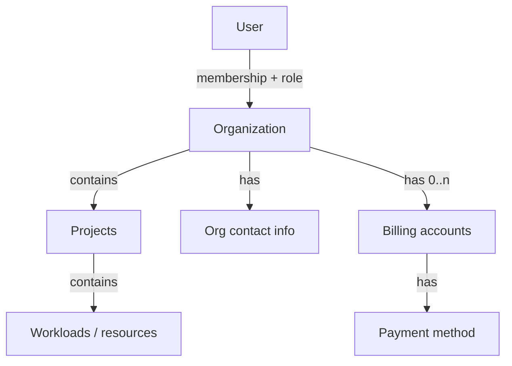
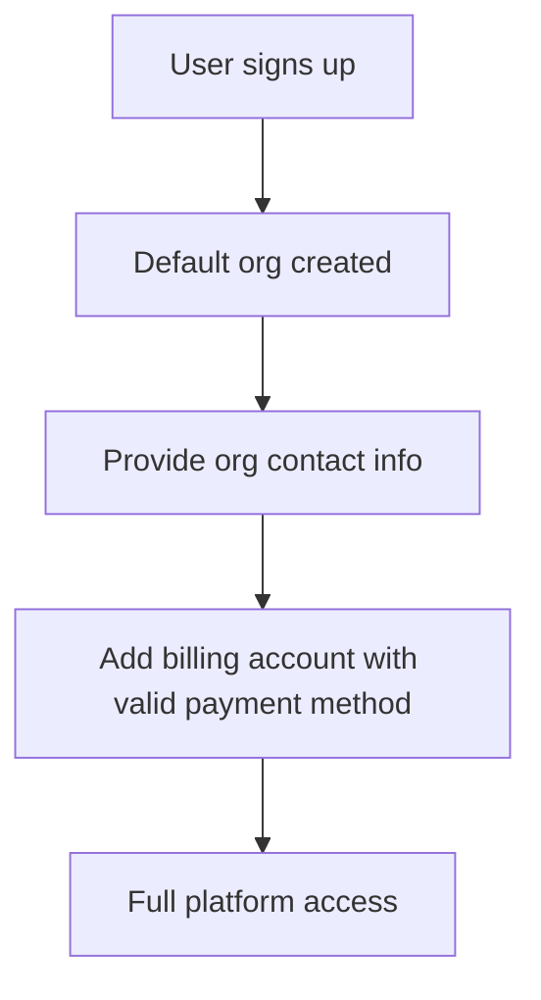

<!-- omit from toc -->

# Unified organizations

Related: [milo-os/milo#636](https://github.com/milo-os/milo/issues/636)

- [Summary](#summary)
- [What is an organization?](#what-is-an-organization)
  - [Definition](#definition)
  - [How organizations relate to the platform](#how-organizations-relate-to-the-platform)
  - [Organization lifecycle](#organization-lifecycle)
- [User experience](#user-experience)
- [Motivation](#motivation)
  - [Goals](#goals)
  - [Non-Goals](#non-goals)
- [What changes](#what-changes)
- [Migration](#migration)
- [Open Questions](#open-questions)
- [Risks](#risks)
- [Implementation History](#implementation-history)

## Summary

An organization is how a customer teams up on Datum Cloud. It groups people,
holds their projects, and ties together access and billing. Every organization
works the same way: one kind of org, no Personal or Standard split, no
second-class workspace created at signup.

When someone signs up, they get a default organization. They finish a short
onboarding flow (contact details, then a billing account with a valid payment
method) before the rest of the platform opens up. The org they start with is the
org they keep. A solo developer who later incorporates updates contact details
instead of spinning up a new workspace. Team invites, billing settings, and an
editable display name are there from the start.

Individual vs business is contact information on the org, not a label frozen at
creation time.

## What is an organization?

### Definition

An organization is the top-level tenant in Datum Cloud. It is a group of people
working together on projects and consuming resources from the platform. Most
work happens inside projects. Membership, access, and billing sit at the org
level.

Each organization has:

- Members with roles scoped to that org.
- Projects that hold the workloads and resources users actually operate.
- Contact information for who the org is and how to reach them. Email and name
  are required. Address and business name are optional.
- One or more billing accounts, each with its own contact, currency, and payment
  method. Billing contact stays separate from org contact.

There is no org "type." Whether someone is an individual or a business comes
from their contact details, and they can change those at any time.

### How organizations relate to the platform

| Relationship | Cardinality | Notes |
|--------------|-------------|-------|
| User ↔ Organization | many-to-many via membership | A user can belong to many orgs with different roles in each. |
| Organization → Projects | one-to-many | Projects are where users do most of their work. Resources live in projects. |
| Organization → Contact info | one | Tenancy-level identity. Separate from any billing contact. |
| Organization → Billing accounts | one-to-many | An org can have multiple billing accounts. There is no single billing address to fall back on, so org contact carries its own optional address. |

Access resolves through the organization, which is why a user can belong to
several orgs and hold a different role in each.

### Organization lifecycle

1. Created at signup (default org) or when the user creates another org in the
   portal.
2. Identified by a stable, opaque system name and an editable display name.
   Users do not pick resource slugs.
3. Onboarded through contact details and a billing account with a valid payment
   method. Full platform access opens once both are done.
4. Operated over time as members, projects, and billing accounts are added.

## User experience

At signup, a user gets a default organization with a neutral display name they
can change later.

Before they can use the platform, they provide org contact info (email and name
required; address and business name optional) and set up a billing account with
a valid payment method. The portal walks them through contact first, then
billing.

Day to day, every org has the same capabilities: invite teammates, manage
billing, rename the org, create projects. The Personal badge, hidden settings,
and project caps that pushed people to recreate their workspace are gone.

Users can create more organizations from the portal. They provide a display
name; the system assigns the internal identifier.

The Personal/Standard split goes away, along with locked display names on
auto-created orgs and the two-project cap on Personal workspaces. Users no
longer need to abandon their signup workspace and start a new org just to invite
a teammate or run a heavier workload.

## Motivation

Today we maintain two organization types, Personal and Standard, even though
they are the same resource underneath. The type drives portal UX and
provisioning rules. It also stood in loosely for "individual vs business," even
though that information belongs on contact and billing records. Personal orgs
were capped at two projects; Standard orgs allowed ten. Those limits disappear
once the type field is removed.

Two problems show up for users:

- Someone who outgrows a Personal workspace cannot convert it. They create a
  new Standard org and leave projects behind.
- Signup creates a constrained Personal org before the user has chosen how they
  want to work.

Billing identity already lives on billing accounts, not on org type. Org type
was a product label that could not be changed. Org contact and billing contact
carry that information instead.

### Goals

- One kind of organization for everyone.
- Org contact information on the organization itself, separate from billing
  contact. Email and name required; address and business name optional.
- Opaque system-assigned internal names; users pick a display name only.
- Onboarding (contact, then billing with a valid payment method) before full
  platform access.
- Existing Personal orgs upgraded to the same experience as Standard orgs.
- Auto-create a default org at signup; the user keeps that org as they grow.

### Non-Goals

- Syncing org contact and billing contact automatically.
- Plan-tier member limits (discussed in #636; out of scope for v1).
- Stripe, Avalara, or tax-engine integration details.

Implementation detail is tracked in [milo-os/milo#636](https://github.com/milo-os/milo/issues/636).

## What changes

The Personal/Standard type field goes away. Org contact information is added.
Individual vs business becomes editable contact data, not a frozen label at
creation.

Users no longer pick resource slugs when creating an org. They provide a display
name; the system assigns a stable internal identifier. Existing org internal
names are not renamed in v1.

Full platform access requires org contact info (email and name) and a billing
account with a valid payment method. The portal routes users through contact
first, then billing, until both are complete.

The portal drops the Personal badge, type filters, hidden settings, and
type-specific project limits. Every org gets team invites, billing settings, an
editable display name, and an org contact editor. The staff portal shows org
contact fields instead of org type.

Personal orgs get the same capabilities Standard orgs have today, including the
higher project limit. The type field is removed from existing records. Users who
have not completed contact info are prompted through onboarding on next login.

## Migration

Existing customers should notice:

- Personal orgs behave like Standard orgs: more projects, editable names, team
  and billing settings visible.
- No need to create a new org to invite teammates or add billing.
- Legacy internal org names (for example `personal-org-*` or user-chosen slugs)
  stay as-is in v1.
- Users may be asked to complete org contact info and billing on next login if
  either is missing.

This is a breaking API change for anything that reads org type. Portal and
integration clients need updating alongside the schema change.

## Open Questions

1. Plan-based member limits instead of type-based (raised in #636; defer unless
   product wants it in v1).
2. Deprecation window: single breaking release vs one release with deprecated
   `type` still accepted.

## Risks

Personal orgs jumping from 2 to 10 projects may surprise users who treated the
lower cap as a soft limit.

External integrations or scripts that filter on org type need an audit before
the schema change ships.

Requiring contact info and a billing account with a valid payment method before
any platform usage is a hard gate. Signup drop-off may go up, and "try before
you pay" exploration is blocked. Pre-fill contact defaults from the User
profile, keep the billing step fast, and revisit whether a limited trial or
grace period should come first.

## Implementation History

- 2026-06-19: Initial enhancement document (provisional), derived from
  [milo-os/milo#636](https://github.com/milo-os/milo/issues/636).
