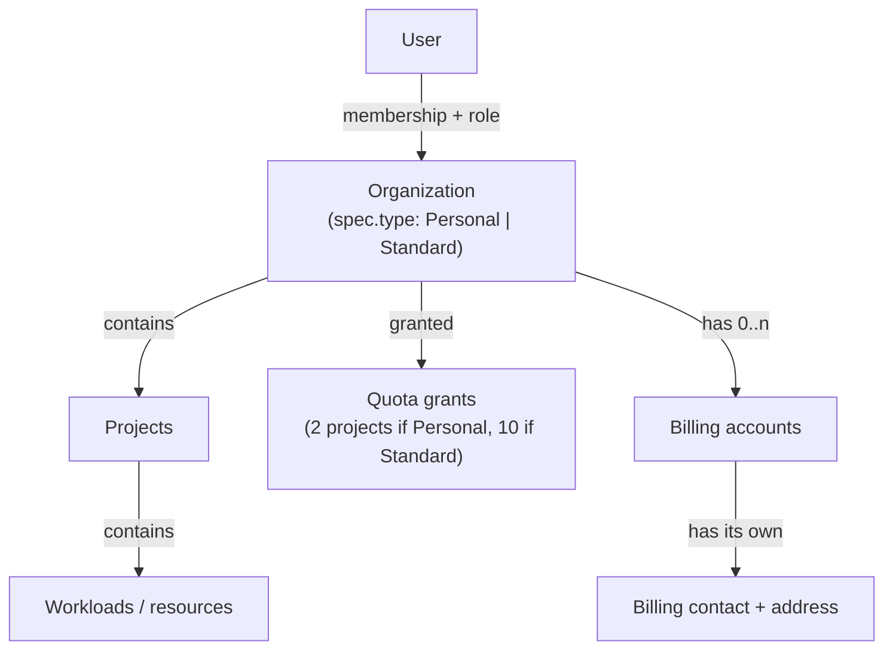
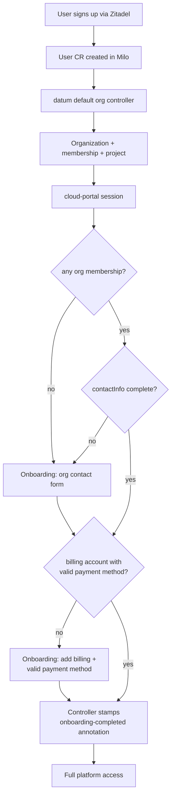

<!-- omit from toc -->

# Unified organizations

Related: [milo-os/milo#636](https://github.com/milo-os/milo/issues/636)

- [Summary](#summary)
- [What is an organization?](#what-is-an-organization)
  - [Definition](#definition)
  - [Why organizations exist](#why-organizations-exist)
  - [How organizations relate to the rest of the platform](#how-organizations-relate-to-the-rest-of-the-platform)
  - [Organization lifecycle](#organization-lifecycle-today)
- [Product Change](#product-change)
  - [What changes for users](#what-changes-for-users)
  - [Why we are doing this](#why-we-are-doing-this)
  - [Benefits](#benefits)
- [Motivation](#motivation)
  - [Goals](#goals)
  - [Non-Goals](#non-goals)
- [Current State](#current-state)
- [Proposal](#proposal)
  - [API: drop type, add contactInfo](#1-api-drop-type-add-contactinfo)
  - [Organization naming](#organization-naming-metadataname)
  - [Implementation examples](#implementation-examples)
  - [Quota](#2-quota-one-grant-policy)
  - [Signup and onboarding](#3-signup-and-onboarding)
  - [Portal UX](#4-portal-ux)
  - [Cross-repo work](#5-cross-repo-work)
  - [Migration plan](#6-migration-plan)
- [Open Questions](#open-questions)
- [Risks](#risks)
- [Implementation History](#implementation-history)

## Summary

Organizations today carry an immutable `Personal | Standard` type. That field
does not store billing data or change the org resource model. Both values are
the same `Organization` kind: namespace, projects, memberships. What
`spec.type` actually controls is quota tier, how the org was provisioned,
validation rules, portal UX, and observability labels.

We want one kind of organization. Business vs individual belongs on org contact
and billing data, not on a frozen enum. Existing Personal and Standard orgs
should behave like Standard orgs after migration: 10-project quota (not 2),
editable display names, team invites enabled, no Personal badge or sort-first
treatment.

## What is an organization?

This section describes how organizations work **today**, so the change proposed
later has a clear starting point. It defines what an organization _is_, why it
exists, and how it relates to everything else in the platform, as currently
implemented, not as we intend it to end up. Where today's behavior is the thing
this enhancement changes, that is called out explicitly and detailed in
[Product Change](#product-change) and the [Proposal](#proposal).

### Definition

An organization is the top-level tenant in Datum Cloud. It is the boundary that
owns resources, groups the people who work on them, and anchors quota and
billing. Everything a customer does on the platform happens inside an
organization.

Today, every organization also carries an immutable `spec.type` of `Personal`
or `Standard`. Both are the same `Organization` kind, with the same fields and
the same namespace, projects, and memberships model. The type is a label that
drives quota tier, provisioning, validation, and portal UX, not a structurally
different object. Collapsing these two into a single kind is the core of this
enhancement (see [Product Change](#product-change)).

An organization plays four roles:

- **Workspace.** Projects and the resources inside them live here.
- **Team boundary.** People are invited into it and assigned roles.
- **Isolation boundary.** Resources in one org are isolated from every other org.
- **Commercial anchor.** Quota is granted to it, and billing accounts attach to it.

### Why organizations exist

Organizations exist so the platform has a single, stable answer to four
questions:

| Question                        | Organization's role                                                                                                                        |
| ------------------------------- | ------------------------------------------------------------------------------------------------------------------------------------------ |
| **Who owns this resource?**     | Every project and workload belongs to exactly one organization.                                                                            |
| **Who is allowed to touch it?** | Access is granted by membership + roles scoped to the organization.                                                                        |
| **How much can they use?**      | Quota (e.g. project count) is granted to the organization. Today the amount depends on `spec.type` (Personal = 2 projects, Standard = 10). |
| **Who pays?**                   | Billing accounts attach to the org.                                                                                                        |

Without this boundary, there would be nowhere to attach access control, quota,
billing, or isolation. The organization is the join point for all of them.

### How organizations relate to the rest of the platform



| Relationship                        | Cardinality                               | Notes (today)                                                                                                    |
| ----------------------------------- | ----------------------------------------- | ---------------------------------------------------------------------------------------------------------------- |
| **User ↔ Organization**             | many-to-many via `OrganizationMembership` | A user can belong to many orgs; an org has many members. Roles are scoped to the org.                            |
| **Organization → Projects**         | one-to-many                               | Projects are namespaced under the org and hold the actual workloads/resources.                                   |
| **Organization → Quota**            | one-to-many grants                        | Allowances are granted to the org, not the user. The amount is type-dependent today (2 vs 10 projects).          |
| **Organization → Billing accounts** | one-to-many                               | An org can have **multiple** billing accounts, each with its own contact, address, currency, and payment method. |

Two things are worth calling out today because they drive decisions later in
this document:

- **The org has no contact record of its own.** Today an organization is
  identified only by its name/display name and `spec.type`. The only contact and
  address data lives on `BillingAccount.spec.contactInfo`. Because an org can
  have **multiple** billing accounts (each with its own address), there is no
  single "the org address." This enhancement adds a tenancy-level
  `spec.contactInfo` to the organization itself (see
  [Product Change](#product-change)).
- **Quota and access attach to the org, not the user.** A user's permissions
  and a workspace's limits both resolve through the organization, which is why a
  user can collaborate across several orgs with different roles and limits in
  each.

### Organization lifecycle (today)

- **Created** in two ways: a `Personal` org is auto-created as a default
  workspace when a user signs up (datum controller, named
  `personal-org-{hash(userUID)}`); `Standard` orgs are created on demand via the
  portal, where the user picks a resource slug.
- **Identified** by `metadata.name` (a `personal-org-*` hash or a user-chosen
  slug) plus a human-readable display name. Personal-org display names are
  locked; Standard-org names are editable.
- **Constrained by type.** Personal orgs are capped at 2 projects, have team
  and billing settings hidden in the portal, and show a "Personal" badge.
  Standard orgs get 10 projects and full settings.
- **Operated** within its quota, with members invited (Standard) and roles
  assigned over time.
- **Billed** through one or more billing accounts attached when the org is ready
  to pay for usage.

## Product Change

This enhancement removes the distinction between "Personal" and "Standard"
organizations. Today, when a user signs up, we silently create a constrained
"Personal" workspace: capped at 2 projects, locked display name, no team
invites, no billing settings, and a "Personal" badge in the portal. To run a
real workload or invite a teammate, the user has to abandon that workspace and
create a separate "Standard" organization from scratch.

After this change there is one kind of organization. Every org behaves like
today's Standard org, and "individual vs business" is captured through editable
organization contact details (`spec.contactInfo`) rather than a frozen type
field that can never be changed.

### What changes for users

- **One workspace that grows with you.** The org created at signup is a
  full-featured organization. A solo developer who later incorporates keeps the
  same workspace, projects, and history, with no migration to a new org.
- **No more Personal limits.** All orgs get the Standard 10-project quota
  (up from 2), editable display names, team invites, and billing/team settings.
- **Cleaner signup.** We no longer ask users to invent a resource slug. They
  provide a display name and contact details; the system assigns a stable,
  opaque identifier behind the scenes.
- **An onboarding step before access.** Before full platform access, we collect
  organization contact info (name/business name, email, address) and a billing
  account with a valid payment method. This replaces the implicit "what type are
  you?" decision with explicit, always-editable information.
- **No Personal badge or special-casing** in the portal. Every org is treated
  the same.

### Why we are doing this

The `Personal | Standard` type was an immutable enum that acted as a product
proxy for "individual vs business," even though it never stored billing
identity (that already lives on `BillingAccount.spec.contactInfo`). Because it
was immutable, users could not convert a personal workspace into a business one,
so they had to start over. Internally, the same enum drove quota tier,
provisioning, validation, and portal UX, so a single product label was quietly
coupled to behavior across five repositories. Collapsing to one org kind and
moving "who you are" onto editable contact data removes that conflation.

### Benefits

- **Better onboarding and growth path.** Users are never trapped in a
  second-class workspace. The org they start with is the org they keep.
- **Higher effective limits.** Existing personal orgs move from 2 to 10
  projects, which reduces friction for active users.
- **Simpler mental model.** An org is an org. Business vs individual is contact
  data, not a permanent label.
- **Lower maintenance cost.** Removing type-based branching from controllers,
  quota policies, admission rules, and both portals means fewer code paths and
  less drift between repos.
- **Flexible identity.** Organizations can update contact and business details
  at any time without recreating resources.

## Motivation

The type split causes real problems:

- A solo developer who later incorporates cannot convert their org. They create
  a new Standard org and leave the old workspace behind.
- "Personal" means both "auto-created default workspace" and, in product terms,
  "not a business," even though billing identity is stored elsewhere.
- Auto-created personal orgs add UI clutter (badge, sort-first, immutable name)
  before the user has decided what they want.
- Controllers, quota policies, admission rules, membership status cache, and
  both portals branch on `spec.type` for what is essentially the same resource.

Billing identity (name, businessName, address, taxIds) already lives on
`BillingAccount.spec.contactInfo` in the billing service. Org type is only a
product proxy for "individual vs business," not the billing record itself. That
conflation is the problem.

### Goals

- Remove `Organization.spec.type` entirely. An org is an org.
- Add `Organization.spec.contactInfo` with the same general shape as
  `BillingContactInfo` (name, businessName, email, address). `email` and `name`
  are required; `address` and `businessName` are optional and can be filled in
  during onboarding or later in the portal. Billing contact stays on
  `BillingAccount`; org contact is the tenancy-level identity and communication
  record.
- Use opaque Kubernetes names for `metadata.name`. No user names, business
  names, or semantic prefixes like `personal-org-`. Human-readable names live in
  `metadata.annotations.kubernetes.io/display-name` and `spec.contactInfo`.
- Migrate all existing orgs to Standard-equivalent behavior: quota grants,
  rename, invites, settings pages currently hidden for Personal.
- Keep auto-creating a default org on signup (datum controller), but gate full
  platform access until onboarding is complete: org contact details and a
  billing account with a valid payment method.
- Redirect users with no org membership to onboarding (edge cases, failed
  provisioning, legacy accounts).

### Non-Goals

- Final CEL field-level validation rules (defer to implementation PRs).
- Stripe, Avalara, or tax-engine integration details.
- Syncing org contact and billing contact. They may share shape and the portal
  may pre-fill a billing form from org data, but there is no automatic copy,
  shared CRD, or controller that keeps them in sync.
- Plan-tier member limits (discussed in #636; out of scope).

## Current State

| Area                | What branches on org type today                                                                                                                                                                                      |
| ------------------- | -------------------------------------------------------------------------------------------------------------------------------------------------------------------------------------------------------------------- |
| **milo**            | `organization_types.go`: required immutable enum; CRD + API docs; membership status caches `status.organization.type`; telemetry metrics emit `spec.type`                                                            |
| **datum**           | `personal_organization_controller.go`: auto-creates Personal org + membership + default project; `organization-update-policy.yaml`: blocks Personal display name changes; separate grant policies (2 vs 10 projects) |
| **cloud-portal**    | Personal badge/sort-first; hides team + billing settings nav; blocks rename UI; hard-coded 2 vs 10 project limits                                                                                                    |
| **staff-portal**    | Org list type filter and membership columns show Personal/Standard                                                                                                                                                   |
| **billing**         | `BillingAccount.spec.contactInfo` unchanged and independent; optional portal pre-fill only when user creates a billing account manually                                                                              |
| **zitadel / infra** | No org-type coupling found; infra changes are deploy-order and CRD schema rollout only                                                                                                                               |

Member invites on Personal orgs are enforced in the **portal** (team nav hidden),
not in the Milo API. After this change, invites follow normal RBAC for all
orgs.

What `spec.type` controls today in code:

- **Quota tier.** datum `GrantCreationPolicy` triggers: Personal = 2 projects,
  Standard = 10.
- **Lifecycle / provisioning.** datum auto-creates only Personal orgs on User
  reconcile; Standard orgs are user-created.
- **Validation.** Admission policy blocks display-name changes on Personal orgs.
- **Portal UX.** cloud-portal badge, sort-first, hidden team/billing nav,
  blocked rename UI, hard-coded project-limit copy; staff-portal type filter/column.
- **Observability.** Membership status caches `status.organization.type`;
  metrics emit `spec.type`.

## Proposal

### 1. API: drop type, add contactInfo

Remove `OrganizationSpec.type` and its CEL immutability rule. The spec holds
contact info (and any fields that remain).

Reuse or extract shared Go types from `billing/api/v1alpha1` (`BillingContactInfo`,
`BillingAddress`) to avoid drift. Use distinct type names (e.g.
`OrganizationContactInfo`, `PostalAddress`) so org and billing APIs can evolve
independently.

Remove the Type print column from Organization and OrganizationMembership CRDs.
Drop `status.organization.type` from membership status (keep displayName cache).

#### Organization naming (`metadata.name`)

**Today:** auto-created orgs use `personal-org-{hash(userUID)}`; user-created
orgs in cloud-portal let the user pick a slug (often derived from company name).

**Proposed:** `metadata.name` is an opaque, system-assigned identifier. It must
not embed the user's name, business name, or product semantics (`personal`,
`acme`, etc.).

| Field                                             | Purpose                                                                                              |
| ------------------------------------------------- | ---------------------------------------------------------------------------------------------------- |
| `metadata.name`                                   | Stable API identity, namespace suffix (`organization-{name}`), URLs `/org/{name}`. Server-generated. |
| `metadata.annotations.kubernetes.io/display-name` | Human-readable label shown in UI. Editable.                                                          |
| `spec.contactInfo.businessName`                   | Legal/trading name for contact/compliance. Not used as the k8s name.                                 |

**Format (decided):** `org-{12 lowercase hex chars}` derived deterministically
from `sha256(user.UID)` for auto-created default orgs (idempotent reconcile).
User-created orgs via the portal use the same format with `crypto/rand` (or the
same hash helper if tied to the acting user). Example: `org-7f3a9c2b1d4e`.

**User-created orgs (portal):** stop asking for a resource slug. Collect display
name (and contact in onboarding); server generates `metadata.name` before POST.

**Migration:** do not rename existing Organization CRs (`metadata.name` is
immutable). Legacy names like `personal-org-abc123` and user-chosen slugs remain
until we run a multi-step rename migration (out of scope for v1). New orgs only
follow the new rule.

**Default org controller cutover:** changing the name formula alone would create
a second org for every existing user (today `personal-org-{hash}`, tomorrow
`org-{hash}` are different objects). The controller must first look up the
user's existing default org (via existing membership or `controllerRef`) and
reconcile it as-is. Only create `org-{suffix}` when no default org exists yet
(new signups after deploy).

Proposed shape:

```yaml
apiVersion: resourcemanager.miloapis.com/v1alpha1
kind: Organization
metadata:
  name: org-7f3a9c2b1d4e
  annotations:
    kubernetes.io/display-name: Acme Corp
spec:
  contactInfo:
    email: admin@acme.com
    name: Jane Doe
    businessName: Acme Corp Ltd
    address:
      country: GB
      line1: 1 Example Street
      city: London
      region: Greater London
      postalCode: EC1A 1BB
```

### Implementation examples

These snippets show the intended shape across repos. Reference implementations
for the enhancement; not shipped code yet.

#### Shared types (milo)

Org contact and billing contact share field shapes but are separate resources
with separate lifecycles. Do not auto-sync them in controllers. The portal may
suggest billing values when creating a first `BillingAccount`; it must not write
billing contact back to the org or vice versa.

**Why org contact has its own (optional) address, not just billing.** An org
can have **multiple** `BillingAccount`s, each with its own `contactInfo` and
address (e.g. different departments, currencies, or cost centers). There is no
single "the billing address" to fall back on, and an org may have zero billing
accounts at signup. So when an organization records an address, it belongs on
the org-level contact, the canonical tenancy-level identity and communication
record, independent of how many billing accounts exist or which one is active.
The org address is optional (added during onboarding or later); billing
addresses remain per-`BillingAccount` for invoicing and tax.

```go
// pkg/apis/resourcemanager/v1alpha1/organization_types.go (proposed)

type OrganizationSpec struct {
	// ContactInfo is the tenancy-level contact for this organization.
	// Independent of BillingAccount.spec.contactInfo.
	//
	// +kubebuilder:validation:Optional
	ContactInfo *OrganizationContactInfo `json:"contactInfo,omitempty"`
}

type OrganizationContactInfo struct {
	// +kubebuilder:validation:Required
	Email string `json:"email"`

	// +kubebuilder:validation:Required
	Name string `json:"name"`

	// BusinessName is optional: individuals may have no legal/trading name.
	//
	// +kubebuilder:validation:Optional
	BusinessName string `json:"businessName,omitempty"`

	// Address is optional: it can be supplied during onboarding or later in the
	// portal. When present, Country, Line1, and City are required.
	//
	// +kubebuilder:validation:Optional
	Address *PostalAddress `json:"address,omitempty"`
}

type PostalAddress struct {
	// +kubebuilder:validation:Required
	Country string `json:"country"`
	// +kubebuilder:validation:Required
	Line1 string `json:"line1"`
	Line2 string `json:"line2,omitempty"`
	// +kubebuilder:validation:Required
	City       string `json:"city"`
	Region     string `json:"region,omitempty"`
	PostalCode string `json:"postalCode,omitempty"`
}
```

Billing stays unchanged:

```yaml
# billing.miloapis.com/v1alpha1: separate namespace, separate object
apiVersion: billing.miloapis.com/v1alpha1
kind: BillingAccount
metadata:
  name: acme-billing
  namespace: organization-org-7f3a9c2b1d4e
spec:
  currencyCode: USD
  contactInfo:
    email: finance@acme.com
    name: Accounts Payable
    businessName: Acme Corp Ltd
    address:
      country: GB
      line1: 10 Billing Lane
```

#### Example Organization after migration

```yaml
apiVersion: resourcemanager.miloapis.com/v1alpha1
kind: Organization
metadata:
  name: personal-org-a1b2c3
  annotations:
    kubernetes.io/display-name: My organization
spec:
  contactInfo:
    email: jane@example.com
    name: Jane Doe
    address:
      country: US
      line1: 123 Main St
      city: Austin
      region: TX
      postalCode: "78701"
```

Legacy slug in `metadata.name` is not renamed in v1 migration.

#### datum: default org controller

Today the controller uses `personal-org-{hash(userUID)}` and sets
`Spec.Type = "Personal"`. After the change:

```go
// datum/internal/controller/resourcemanager/default_organization_controller.go

func orgNameForUser(uid types.UID) string {
	sum := sha256.Sum256([]byte(uid))
	return fmt.Sprintf("org-%s", hex.EncodeToString(sum[:])[:12])
}

// Reconcile must NOT blindly use orgNameForUser on every run; look up the
// user's existing default org first (membership or ownerRef). Only assign
// orgNameForUser when creating a net-new default org for a new user.

_, err := controllerutil.CreateOrUpdate(ctx, r.Client, defaultOrg, func() error {
	if defaultOrg.Name == "" {
		defaultOrg.Name = orgNameForUser(user.UID)
	}

	displayName := "My organization"
	if g := strings.TrimSpace(user.Spec.GivenName); g != "" {
		displayName = fmt.Sprintf("%s's organization", g)
	}
	metav1.SetMetaDataAnnotation(&defaultOrg.ObjectMeta, "kubernetes.io/display-name", displayName)

	if defaultOrg.Spec.ContactInfo == nil {
		defaultOrg.Spec.ContactInfo = &resourcemanagerv1alpha1.OrganizationContactInfo{
			Email: user.Spec.Email,
			Name:  strings.TrimSpace(user.Spec.GivenName + " " + user.Spec.FamilyName),
		}
	}
	return controllerutil.SetControllerReference(user, defaultOrg, r.Scheme)
})
```

#### datum: single quota grant policy

Replace `personal-org-grant-policy.yaml` and `standard-org-grant-policy.yaml`:

```yaml
apiVersion: quota.miloapis.com/v1alpha1
kind: GrantCreationPolicy
metadata:
  name: organization-project-quota-policy
spec:
  trigger:
    resource:
      apiVersion: resourcemanager.miloapis.com/v1alpha1
      kind: Organization
  target:
    resourceGrantTemplate:
      metadata:
        name: default-project-quota
        namespace: "organization-{{ trigger.metadata.name }}"
      spec:
        consumerRef:
          apiGroup: resourcemanager.miloapis.com
          kind: Organization
          name: "{{ trigger.metadata.name }}"
        allowances:
          - resourceType: resourcemanager.miloapis.com/projects
            buckets:
              - amount: 10
```

#### datum: delete Personal-only admission policy

Remove `disallow-personal-org-name-change` entirely. Display names become
editable for all orgs.

#### milo: membership status cache (drop type)

```go
// internal/controllers/resourcemanager/organization_membership_controller.go

organizationMembership.Status.Organization = OrganizationMembershipOrganizationStatus{
	DisplayName: displayName,
}
```

#### milo: optional contactInfo validation webhook

```go
func contactInfoComplete(c *resourcemanagerv1alpha1.OrganizationContactInfo) bool {
	// Onboarding requires email + name only. Address is optional and can be
	// added later in the portal.
	if c == nil || c.Email == "" || c.Name == "" {
		return false
	}
	return true
}

// Used by portal gating logic; webhook only validates field formats on write,
// not onboarding completeness (that stays in cloud-portal middleware).
```

#### cloud-portal: onboarding gate middleware

Extend the pattern in `fraud-status.middleware.ts`. Run after fraud checks,
before org routes:

```typescript
// app/utils/middlewares/org-onboarding.middleware.ts

const ONBOARDING_PATHS = new Set([
  paths.onboarding.completeProfile,
  paths.onboarding.organizationContact,
  paths.onboarding.billing,
  paths.auth.logOut,
]);

const ONBOARDING_COMPLETED_AT =
  "resourcemanager.miloapis.com/onboarding-completed-at";

export async function orgOnboardingMiddleware(
  ctx: MiddlewareContext,
  next: NextFunction,
) {
  const pathname = new URL(ctx.request.url).pathname;
  if (ONBOARDING_PATHS.has(pathname)) {
    return next();
  }

  const memberships = await createOrganizationService().listForUser(
    session.sub,
  );
  if (memberships.length === 0) {
    return redirect(paths.onboarding.organizationContact);
  }

  const defaultOrg = memberships[0].organization;

  // Fast path: controller has confirmed contact + valid billing.
  if (defaultOrg.metadata?.annotations?.[ONBOARDING_COMPLETED_AT]) {
    return next();
  }

  // Otherwise route to the first incomplete step.
  if (!isOrgContactComplete(defaultOrg.spec?.contactInfo)) {
    return redirect(paths.onboarding.organizationContact);
  }
  return redirect(paths.onboarding.billing);
}

function isOrgContactComplete(contact?: OrganizationContactInfo): boolean {
  return Boolean(contact?.email && contact?.name);
}
```

#### cloud-portal: onboarding writes org contact only

```typescript
await organizationService.update(orgId, {
  spec: {
    contactInfo: {
      email: form.email,
      name: form.name,
      businessName: form.businessName,
      address: {
        country: form.country,
        line1: form.line1,
        city: form.city,
        postalCode: form.postalCode,
      },
    },
  },
});
navigate(paths.account.organizations.root);
```

#### cloud-portal: billing account create (separate form, optional pre-fill)

Pre-fill from org contact is client-side only. Submit creates a distinct object:

```typescript
const defaults = {
  email: org.contactInfo?.email ?? user.email,
  name: org.contactInfo?.name,
  businessName: org.contactInfo?.businessName,
  address: org.contactInfo?.address,
};

await billingAccountService.create(orgNamespace, {
  currencyCode: "USD",
  contactInfo: formValues,
});
```

No controller watches `Organization` and copies contact into `BillingAccount`.

#### cloud-portal: create org (server-generated name)

Remove the user-facing slug field from `createOrganizationSchema`:

```typescript
import { randomBytes } from "crypto";

function generateOrgName(): string {
  return `org-${randomBytes(6).toString("hex")}`;
}

export const createOrganizationSchema = z.object({
  displayName: z.string().min(1).max(100),
  description: z.string().max(500).optional(),
});
```

Optionally add a milo validating webhook rule that rejects create requests where
`metadata.name` matches display name, contact business name, or common patterns
(`personal-org-*`, email local-part, etc.).

#### Migration: quota bump for existing Personal orgs

```bash
kubectl get resourcegrants -A -l quota.miloapis.com/policy=personal-organization-project-quota-policy \
  -o json | jq -r '.items[] | "\(.metadata.namespace)/\(.metadata.name)"' | while read ns name; do
  kubectl patch resourcegrant "$name" -n "$ns" --type=merge -p \
    '{"spec":{"allowances":[{"resourceType":"resourcemanager.miloapis.com/projects","buckets":[{"amount":10}]}]}}'
done
```

#### Migration: strip type from existing Organization CRs

```bash
kubectl get organizations -o json | jq -r '.items[] | select(.spec.type != null) | .metadata.name' | while read name; do
  kubectl patch organization "$name" --type=json -p='[{"op":"remove","path":"/spec/type"}]'
done
```

### 2. Quota: one grant policy

Replace the Personal + Standard `GrantCreationPolicy` pair with a single policy
triggered on Organization create (no type constraint). Default: 10 projects
(today's Standard allowance).

Migration: patch existing Personal org grants from 2 to 10 (prefer in-place
patch if the controller supports it).

### 3. Signup and onboarding

Keep the datum default-org controller, but change what it creates:

- Still auto-create org + owner membership + default project on User reconcile.
- Stop setting `spec.type = Personal` (field removed).
- Use a neutral default display name ("My organization" or "{Given}'s
  organization"), editable after onboarding.
- **Onboarding gate:** full platform access is blocked until onboarding is
  complete. Onboarding requires complete `spec.contactInfo` (email + name;
  address optional) **and** a `BillingAccount` with a valid payment method.
  cloud-portal middleware keeps the user in the onboarding flow (contact step,
  then billing step) until both hold, extending today's `complete-profile`
  name-review flow.
- Users with zero org memberships redirect to onboarding.
- **Onboarding-completed marker:** a controller stamps an annotation on the
  Organization once both conditions hold: contact info is complete and at least
  one `BillingAccount` with a valid payment method is attached in the org
  namespace. The portal gate reads this annotation. See
  [Onboarding completion annotation](#onboarding-completion-annotation).



#### Onboarding completion annotation

Full platform access is gated on completing onboarding. Onboarding is complete
when the org has complete contact info (email + name) **and** at least one
`BillingAccount` with a valid payment method. A billing account that exists but
has no usable payment method does not count. Until both hold, cloud-portal keeps
the user in the onboarding flow (contact details first, then billing) and does
not grant access to the rest of the platform. We record completion with an
annotation rather than a spec or status field, because it is a one-time
lifecycle marker that the portal, staff tooling, analytics, and policies can
read cheaply without parsing related resources.

| Annotation                                             | Value             | Set by     | Meaning                                                                                                                      |
| ------------------------------------------------------ | ----------------- | ---------- | ---------------------------------------------------------------------------------------------------------------------------- |
| `resourcemanager.miloapis.com/onboarding-completed-at` | RFC3339 timestamp | controller | Contact info is complete and the org namespace has a `BillingAccount` whose `DefaultPaymentMethodReady` condition is `True`. |

**Billing signal (confirmed against the billing service).** The billing API
already publishes exactly the signal we need, so the controller does not touch
Stripe or provider internals:

- `BillingAccount.status.conditions[type=DefaultPaymentMethodReady]` (constant
  `BillingAccountConditionDefaultPaymentMethodReady`) is set `True` by the
  billing service's `BillingAccountReconciler` when the account's
  `spec.defaultPaymentMethodRef` points at a `PaymentMethod` in the `Active`
  phase (success reason `Ready`). Downstream services (invoicing, charge
  processing) already gate on this condition rather than on account phase, so
  reusing it keeps onboarding consistent with billing.
- A `PaymentMethod` reaches `Active` (and its own `InstrumentReady` condition
  becomes `True`) once a provider attaches a usable instrument. The Stripe
  provider that does this is implemented and deployed (`milo-os/stripe-provider`,
  a controller-runtime operator on the official `stripe-go` SDK, API group
  `stripe.billing.miloapis.com/v1alpha1`). It creates a Stripe Customer and a
  card SetupIntent, surfaces the client secret on
  `StripePaymentMethod.status.setupIntent.clientSecret` for the portal, and on
  the `setup_intent.succeeded` webhook patches the billing `PaymentMethod` to
  `phase=Active` + `InstrumentReady=True`. Billing's `BillingAccountReconciler`
  then raises `DefaultPaymentMethodReady`. So the whole chain that backs this
  onboarding gate already exists; the gate just reads the end of it.

Rules:

- The annotation is **set once** and not removed if a billing account is later
  detached or its payment method later expires. Onboarding is a milestone, not a
  live status. (If we need a live "currently has valid billing" signal, that is a
  separate concern, ideally derived from `BillingAccount` status directly rather
  than this annotation.)
- A controller is the source of truth, not the portal. It watches `Organization`
  and `BillingAccount` so the marker is correct regardless of how billing was
  attached (portal, API, or migration).
- The portal reads the annotation to drive onboarding banners, checklists, and
  "add billing" prompts, instead of recomputing the condition on every request.

Example:

```yaml
apiVersion: resourcemanager.miloapis.com/v1alpha1
kind: Organization
metadata:
  name: org-7f3a9c2b1d4e
  annotations:
    kubernetes.io/display-name: Acme Corp
    resourcemanager.miloapis.com/onboarding-completed-at: "2026-06-24T10:42:00Z"
spec:
  contactInfo:
    email: admin@acme.com
    name: Jane Doe
```

Controller logic (sketch):

```go
// Watches Organization and BillingAccount; reconciles the Organization.
const onboardingCompletedAt = "resourcemanager.miloapis.com/onboarding-completed-at"

func (r *OnboardingReconciler) Reconcile(ctx context.Context, org *resourcemanagerv1alpha1.Organization) error {
	// Idempotent: once stamped, never unset.
	if _, ok := org.Annotations[onboardingCompletedAt]; ok {
		return nil
	}
	if !contactInfoComplete(org.Spec.ContactInfo) {
		return nil
	}

	var billing billingv1alpha1.BillingAccountList
	if err := r.List(ctx, &billing, client.InNamespace(orgNamespace(org.Name))); err != nil {
		return err
	}
	if !hasValidPaymentMethod(billing.Items) {
		return nil
	}

	patch := client.MergeFrom(org.DeepCopy())
	metav1.SetMetaDataAnnotation(&org.ObjectMeta, onboardingCompletedAt, time.Now().UTC().Format(time.RFC3339))
	return r.Patch(ctx, org, patch)
}

// hasValidPaymentMethod reports whether any billing account is usable for
// charges. The billing service already exposes this signal: it sets the
// DefaultPaymentMethodReady condition to True when the account's referenced
// default PaymentMethod is in the Active phase. We read that condition rather
// than inspecting Stripe/provider data directly.
func hasValidPaymentMethod(accounts []billingv1alpha1.BillingAccount) bool {
	for i := range accounts {
		// billingv1alpha1.BillingAccountConditionDefaultPaymentMethodReady
		if meta.IsStatusConditionTrue(accounts[i].Status.Conditions, "DefaultPaymentMethodReady") {
			return true
		}
	}
	return false
}
```

### 4. Portal UX

**cloud-portal**

- Remove Personal badge, sort-first, and type-conditional copy.
- Enable team settings, billing settings nav, and rename for all orgs.
- Replace hard-coded project limits with quota API reads (or platform default 10
  until quota is wired).
- Add org contact editor under org settings.
- Extend onboarding route(s) to PATCH organization contactInfo.
- Create-org flow: collect display name only; generate opaque `metadata.name`
  server-side.
- Read `resourcemanager.miloapis.com/onboarding-completed-at` to drive
  onboarding banners and the "add a billing account with a valid payment method"
  prompt; stop showing them once the annotation is present.

**staff-portal**

- Remove Personal/Standard type filter and column.
- Show org contact fields on org detail (read from `spec.contactInfo`).

### 5. Cross-repo work

| Repo                | Work                                                                                                                                                                                                                                                       |
| ------------------- | ---------------------------------------------------------------------------------------------------------------------------------------------------------------------------------------------------------------------------------------------------------- |
| **milo**            | API + CRD + codegen; remove type from membership status; optional webhook to reject semantic/slug-like org names on create; update tests/samples/docs                                                                                                      |
| **datum**           | Rewrite default org controller (no type); delete Personal name-change policy; merge quota grant policies; add onboarding-completion controller that watches Organization + BillingAccount and stamps `onboarding-completed-at`                             |
| **billing**         | No schema change; no org-to-billing contact sync; portal may pre-fill billing form as a one-time UX default. Onboarding consumes the existing `DefaultPaymentMethodReady` `BillingAccount` condition (no new billing API needed)                           |
| **stripe-provider** | Already implemented and deployed (`milo-os/stripe-provider`, alpha). Moves a `PaymentMethod` to `Active` via the Stripe SetupIntent flow, which drives `DefaultPaymentMethodReady`. No new work required; onboarding only consumes the resulting condition |
| **zitadel**         | None expected                                                                                                                                                                                                                                              |
| **infra**           | Roll out CRD + datum/milo/cloud-portal/staff-portal in coordinated order; migration job or one-shot patch for existing orgs                                                                                                                                |

### 6. Migration plan

1. **Schema:** deploy CRD that adds `contactInfo` and removes `type` in one
   breaking version (preferred per #636: drop entirely).
2. **Data:** batch job sets `contactInfo.email` and `contactInfo.name` from the
   org owner's User record where missing; does not overwrite billing data.
   `address` is optional and is not backfilled; users add it during onboarding
   or later in the portal. Note that `spec.contactInfo` itself is optional at
   the top level, so legacy orgs that have no `contactInfo` block remain valid.
   The required sub-fields (`email`, `name`) only apply once `contactInfo` is
   set. This lets admin patches (type removal, quota bump) run against legacy
   orgs without tripping validation, while every org submitting contact data,
   and every new org, must provide email + name. The onboarding gate is what
   enforces completeness before full platform access.
3. **Quota:** upgrade Personal org grants to Standard amounts.
4. **Cleanup:** remove deprecated policies, portal branches, metrics labels
   keyed on `organization_type`.

Backward compatibility: clients reading `spec.type` break. Regenerate
cloud-portal/staff-portal OpenAPI types. GraphQL schema drops `OrganizationType`
enum.

## Open Questions

1. Plan-based member limits instead of type-based (raised in #636; defer unless
   product wants it in v1).
2. Deprecation window: single breaking release vs one release with deprecated
   `type` still accepted.

## Risks

- **Quota migration:** Personal orgs jumping from 2 to 10 projects may surprise
  users who relied on the lower cap as a soft limit.
- **Breaking API change:** external integrations or scripts filtering on
  `spec.type` need audit.
- **Onboarding friction:** gating all platform access on contact info **and** a
  billing account with a valid payment method is a hard gate. Requiring payment
  details before any usage will increase signup drop-off and blocks "try before
  you pay" exploration. Mitigate with pre-filled contact defaults from the User
  profile and a fast, low-friction billing step; revisit whether a limited trial
  or grace period should precede the billing requirement.

## Implementation History

- **2026-06-19**: Initial enhancement document (provisional), derived from
  [milo-os/milo#636](https://github.com/milo-os/milo/issues/636).
