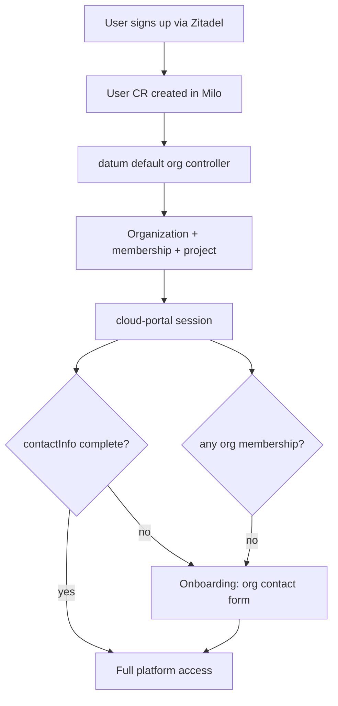

<!-- omit from toc -->
# Unified organizations

Related: [milo-os/milo#636](https://github.com/milo-os/milo/issues/636)

- [Summary](#summary)
- [Motivation](#motivation)
  - [Goals](#goals)
  - [Non-Goals](#non-goals)
- [Current State](#current-state)
- [Proposal](#proposal)
  - [API: drop type, add contactInfo](#1-api-drop-type-add-contactinfo)
  - [Organization naming](#organization-naming-metadataname)
  - [Implementation examples](#implementation-examples)
  - [Quota](#2-quota-one-grant-policy)
  - [Signup and onboarding](#3-signup-and-onboarding)
  - [Portal UX](#4-portal-ux)
  - [Cross-repo work](#5-cross-repo-work)
  - [Migration plan](#6-migration-plan)
- [Open Questions](#open-questions)
- [Risks](#risks)
- [Implementation History](#implementation-history)

## Summary

Organizations today carry an immutable `Personal | Standard` type. That field
does not store billing data or change the org resource model. Both values are
the same `Organization` kind: namespace, projects, memberships. What
`spec.type` actually controls is quota tier, how the org was provisioned,
validation rules, portal UX, and observability labels.

We want one kind of organization. Business vs individual belongs on org contact
and billing data, not on a frozen enum. Existing Personal and Standard orgs
should behave like Standard orgs after migration: 10-project quota (not 2),
editable display names, team invites enabled, no Personal badge or sort-first
treatment.

## Motivation

The type split causes real problems:

- A solo developer who later incorporates cannot convert their org. They create
  a new Standard org and leave the old workspace behind.
- "Personal" means both "auto-created default workspace" and, in product terms,
  "not a business," even though billing identity is stored elsewhere.
- Auto-created personal orgs add UI clutter (badge, sort-first, immutable name)
  before the user has decided what they want.
- Controllers, quota policies, admission rules, membership status cache, and
  both portals branch on `spec.type` for what is essentially the same resource.

Billing identity (name, businessName, address, taxIds) already lives on
`BillingAccount.spec.contactInfo` in the billing service. Org type is only a
product proxy for "individual vs business," not the billing record itself. That
conflation is the problem.

### Goals

- Remove `Organization.spec.type` entirely. An org is an org.
- Add `Organization.spec.contactInfo` with the same general shape as
  `BillingContactInfo` (name, businessName, email, address). Billing contact
  stays on `BillingAccount`; org contact is the tenancy-level identity and
  communication record.
- Use opaque Kubernetes names for `metadata.name`. No user names, business
  names, or semantic prefixes like `personal-org-`. Human-readable names live in
  `metadata.annotations.kubernetes.io/display-name` and `spec.contactInfo`.
- Migrate all existing orgs to Standard-equivalent behavior: quota grants,
  rename, invites, settings pages currently hidden for Personal.
- Keep auto-creating a default org on signup (datum controller), but gate full
  platform access until onboarding collects org contact details.
- Redirect users with no org membership to onboarding (edge cases, failed
  provisioning, legacy accounts).

### Non-Goals

- Final CEL field-level validation rules (defer to implementation PRs).
- Stripe, Avalara, or tax-engine integration details.
- Syncing org contact and billing contact. They may share shape and the portal
  may pre-fill a billing form from org data, but there is no automatic copy,
  shared CRD, or controller that keeps them in sync.
- Plan-tier member limits (discussed in #636; out of scope unless product wants
  it in v1).

## Current State

| Area | What branches on org type today |
|------|----------------------------------|
| **milo** | `organization_types.go`: required immutable enum; CRD + API docs; membership status caches `status.organization.type`; telemetry metrics emit `spec.type` |
| **datum** | `personal_organization_controller.go`: auto-creates Personal org + membership + default project; `organization-update-policy.yaml`: blocks Personal display name changes; separate grant policies (2 vs 10 projects) |
| **cloud-portal** | Personal badge/sort-first; hides team + billing settings nav; blocks rename UI; hard-coded 2 vs 10 project limits |
| **staff-portal** | Org list type filter and membership columns show Personal/Standard |
| **billing** | `BillingAccount.spec.contactInfo` unchanged and independent; optional portal pre-fill only when user creates a billing account manually |
| **zitadel / infra** | No org-type coupling found; infra changes are deploy-order and CRD schema rollout only |

Member invites on Personal orgs are enforced in the **portal** (team nav hidden),
not in the Milo API. After this change, invites follow normal RBAC for all
orgs.

What `spec.type` controls today in code:

- **Quota tier** — datum `GrantCreationPolicy` triggers: Personal = 2 projects,
  Standard = 10.
- **Lifecycle / provisioning** — datum auto-creates only Personal orgs on User
  reconcile; Standard orgs are user-created.
- **Validation** — admission policy blocks display-name changes on Personal orgs.
- **Portal UX** — cloud-portal badge, sort-first, hidden team/billing nav,
  blocked rename UI, hard-coded project-limit copy; staff-portal type filter/column.
- **Observability** — membership status caches `status.organization.type`;
  metrics emit `spec.type`.

## Proposal

### 1. API: drop type, add contactInfo

Remove `OrganizationSpec.type` and its CEL immutability rule. The spec holds
contact info (and any fields that remain).

Reuse or extract shared Go types from `billing/api/v1alpha1` (`BillingContactInfo`,
`BillingAddress`) to avoid drift. Use distinct type names (e.g.
`OrganizationContactInfo`, `PostalAddress`) so org and billing APIs can evolve
independently.

Remove the Type print column from Organization and OrganizationMembership CRDs.
Drop `status.organization.type` from membership status (keep displayName cache).

#### Organization naming (`metadata.name`)

**Today:** auto-created orgs use `personal-org-{hash(userUID)}`; user-created
orgs in cloud-portal let the user pick a slug (often derived from company name).

**Proposed:** `metadata.name` is an opaque, system-assigned identifier. It must
not embed the user's name, business name, or product semantics (`personal`,
`acme`, etc.).

| Field | Purpose |
|-------|---------|
| `metadata.name` | Stable API identity, namespace suffix (`organization-{name}`), URLs `/org/{name}`. Server-generated. |
| `metadata.annotations.kubernetes.io/display-name` | Human-readable label shown in UI. Editable. |
| `spec.contactInfo.businessName` | Legal/trading name for contact/compliance. Not used as the k8s name. |

**Format (decided):** `org-{12 lowercase hex chars}` derived deterministically
from `sha256(user.UID)` for auto-created default orgs (idempotent reconcile).
User-created orgs via the portal use the same format with `crypto/rand` (or the
same hash helper if tied to the acting user). Example: `org-7f3a9c2b1d4e`.

**User-created orgs (portal):** stop asking for a resource slug. Collect display
name (and contact in onboarding); server generates `metadata.name` before POST.

**Migration:** do not rename existing Organization CRs (`metadata.name` is
immutable). Legacy names like `personal-org-abc123` and user-chosen slugs remain
until we run a multi-step rename migration (out of scope for v1). New orgs only
follow the new rule.

**Default org controller cutover:** changing the name formula alone would create
a second org for every existing user (today `personal-org-{hash}`, tomorrow
`org-{hash}` are different objects). The controller must first look up the
user's existing default org (via existing membership or `controllerRef`) and
reconcile it as-is. Only create `org-{suffix}` when no default org exists yet
(new signups after deploy).

Proposed shape:

```yaml
apiVersion: resourcemanager.miloapis.com/v1alpha1
kind: Organization
metadata:
  name: org-7f3a9c2b1d4e
  annotations:
    kubernetes.io/display-name: Acme Corp
spec:
  contactInfo:
    email: admin@acme.com
    name: Jane Doe
    businessName: Acme Corp Ltd
    address:
      country: GB
      line1: 1 Example Street
      city: London
      postalCode: EC1A 1BB
```

### Implementation examples

These snippets show the intended shape across repos. Reference implementations
for the enhancement; not shipped code yet.

#### Shared types (milo)

Org contact and billing contact share field shapes but are separate resources
with separate lifecycles. Do not auto-sync them in controllers. The portal may
suggest billing values when creating a first `BillingAccount`; it must not write
billing contact back to the org or vice versa.

```go
// pkg/apis/resourcemanager/v1alpha1/organization_types.go (proposed)

type OrganizationSpec struct {
	// ContactInfo is the tenancy-level contact for this organization.
	// Independent of BillingAccount.spec.contactInfo.
	//
	// +kubebuilder:validation:Optional
	ContactInfo *OrganizationContactInfo `json:"contactInfo,omitempty"`
}

type OrganizationContactInfo struct {
	// +kubebuilder:validation:Required
	Email string `json:"email"`

	// +kubebuilder:validation:Optional
	Name string `json:"name,omitempty"`

	// +kubebuilder:validation:Optional
	BusinessName string `json:"businessName,omitempty"`

	// +kubebuilder:validation:Optional
	Address *PostalAddress `json:"address,omitempty"`
}

type PostalAddress struct {
	// +kubebuilder:validation:Required
	Country string `json:"country"`
	Line1   string `json:"line1,omitempty"`
	Line2   string `json:"line2,omitempty"`
	City    string `json:"city,omitempty"`
	Region  string `json:"region,omitempty"`
	PostalCode string `json:"postalCode,omitempty"`
}
```

Billing stays unchanged:

```yaml
# billing.miloapis.com/v1alpha1 — separate namespace, separate object
apiVersion: billing.miloapis.com/v1alpha1
kind: BillingAccount
metadata:
  name: acme-billing
  namespace: organization-org-7f3a9c2b1d4e
spec:
  currencyCode: USD
  contactInfo:
    email: finance@acme.com
    name: Accounts Payable
    businessName: Acme Corp Ltd
    address:
      country: GB
      line1: 10 Billing Lane
```

#### Example Organization after migration

```yaml
apiVersion: resourcemanager.miloapis.com/v1alpha1
kind: Organization
metadata:
  name: personal-org-a1b2c3
  annotations:
    kubernetes.io/display-name: My organization
spec:
  contactInfo:
    email: jane@example.com
    name: Jane Doe
    address:
      country: US
```

Legacy slug in `metadata.name` is not renamed in v1 migration.

#### datum — default org controller

Today the controller uses `personal-org-{hash(userUID)}` and sets
`Spec.Type = "Personal"`. After the change:

```go
// datum/internal/controller/resourcemanager/default_organization_controller.go

func orgNameForUser(uid types.UID) string {
	sum := sha256.Sum256([]byte(uid))
	return fmt.Sprintf("org-%s", hex.EncodeToString(sum[:])[:12])
}

// Reconcile must NOT blindly use orgNameForUser on every run — look up the
// user's existing default org first (membership or ownerRef). Only assign
// orgNameForUser when creating a net-new default org for a new user.

_, err := controllerutil.CreateOrUpdate(ctx, r.Client, defaultOrg, func() error {
	if defaultOrg.Name == "" {
		defaultOrg.Name = orgNameForUser(user.UID)
	}

	displayName := "My organization"
	if g := strings.TrimSpace(user.Spec.GivenName); g != "" {
		displayName = fmt.Sprintf("%s's organization", g)
	}
	metav1.SetMetaDataAnnotation(&defaultOrg.ObjectMeta, "kubernetes.io/display-name", displayName)

	if defaultOrg.Spec.ContactInfo == nil {
		defaultOrg.Spec.ContactInfo = &resourcemanagerv1alpha1.OrganizationContactInfo{
			Email: user.Spec.Email,
			Name:  strings.TrimSpace(user.Spec.GivenName + " " + user.Spec.FamilyName),
		}
	}
	return controllerutil.SetControllerReference(user, defaultOrg, r.Scheme)
})
```

#### datum — single quota grant policy

Replace `personal-org-grant-policy.yaml` and `standard-org-grant-policy.yaml`:

```yaml
apiVersion: quota.miloapis.com/v1alpha1
kind: GrantCreationPolicy
metadata:
  name: organization-project-quota-policy
spec:
  trigger:
    resource:
      apiVersion: resourcemanager.miloapis.com/v1alpha1
      kind: Organization
  target:
    resourceGrantTemplate:
      metadata:
        name: default-project-quota
        namespace: "organization-{{ trigger.metadata.name }}"
      spec:
        consumerRef:
          apiGroup: resourcemanager.miloapis.com
          kind: Organization
          name: "{{ trigger.metadata.name }}"
        allowances:
          - resourceType: resourcemanager.miloapis.com/projects
            buckets:
              - amount: 10
```

#### datum — delete Personal-only admission policy

Remove `disallow-personal-org-name-change` entirely. Display names become
editable for all orgs.

#### milo — membership status cache (drop type)

```go
// internal/controllers/resourcemanager/organization_membership_controller.go

organizationMembership.Status.Organization = OrganizationMembershipOrganizationStatus{
	DisplayName: displayName,
}
```

#### milo — optional contactInfo validation webhook

```go
func contactInfoComplete(c *resourcemanagerv1alpha1.OrganizationContactInfo) bool {
	if c == nil || c.Email == "" {
		return false
	}
	if c.Address == nil || c.Address.Country == "" {
		return false
	}
	return true
}

// Used by portal gating logic; webhook only validates field formats on write,
// not onboarding completeness (that stays in cloud-portal middleware).
```

#### cloud-portal — onboarding gate middleware

Extend the pattern in `fraud-status.middleware.ts`. Run after fraud checks,
before org routes:

```typescript
// app/utils/middlewares/org-onboarding.middleware.ts

const ONBOARDING_PATHS = new Set([
  paths.onboarding.completeProfile,
  paths.onboarding.organizationContact,
  paths.auth.logOut,
]);

export async function orgOnboardingMiddleware(ctx: MiddlewareContext, next: NextFunction) {
  const pathname = new URL(ctx.request.url).pathname;
  if (ONBOARDING_PATHS.has(pathname)) {
    return next();
  }

  const memberships = await createOrganizationService().listForUser(session.sub);
  if (memberships.length === 0) {
    return redirect(paths.onboarding.organizationContact);
  }

  const defaultOrg = memberships[0].organization;
  if (!isOrgContactComplete(defaultOrg.spec?.contactInfo)) {
    return redirect(paths.onboarding.organizationContact);
  }

  return next();
}

function isOrgContactComplete(contact?: OrganizationContactInfo): boolean {
  return Boolean(contact?.email && contact?.address?.country);
}
```

#### cloud-portal — onboarding writes org contact only

```typescript
await organizationService.update(orgId, {
  spec: {
    contactInfo: {
      email: form.email,
      name: form.name,
      businessName: form.businessName,
      address: {
        country: form.country,
        line1: form.line1,
        city: form.city,
        postalCode: form.postalCode,
      },
    },
  },
});
navigate(paths.account.organizations.root);
```

#### cloud-portal — billing account create (separate form, optional pre-fill)

Pre-fill from org contact is client-side only. Submit creates a distinct object:

```typescript
const defaults = {
  email: org.contactInfo?.email ?? user.email,
  name: org.contactInfo?.name,
  businessName: org.contactInfo?.businessName,
  address: org.contactInfo?.address,
};

await billingAccountService.create(orgNamespace, {
  currencyCode: 'USD',
  contactInfo: formValues,
});
```

No controller watches `Organization` and copies contact into `BillingAccount`.

#### cloud-portal — create org (server-generated name)

Remove the user-facing slug field from `createOrganizationSchema`:

```typescript
import { randomBytes } from 'crypto';

function generateOrgName(): string {
  return `org-${randomBytes(6).toString('hex')}`;
}

export const createOrganizationSchema = z.object({
  displayName: z.string().min(1).max(100),
  description: z.string().max(500).optional(),
});
```

Optionally add a milo validating webhook rule that rejects create requests where
`metadata.name` matches display name, contact business name, or common patterns
(`personal-org-*`, email local-part, etc.).

#### Migration — quota bump for existing Personal orgs

```bash
kubectl get resourcegrants -A -l quota.miloapis.com/policy=personal-organization-project-quota-policy \
  -o json | jq -r '.items[] | "\(.metadata.namespace)/\(.metadata.name)"' | while read ns name; do
  kubectl patch resourcegrant "$name" -n "$ns" --type=merge -p \
    '{"spec":{"allowances":[{"resourceType":"resourcemanager.miloapis.com/projects","buckets":[{"amount":10}]}]}}'
done
```

#### Migration — strip type from existing Organization CRs

```bash
kubectl get organizations -o json | jq -r '.items[] | select(.spec.type != null) | .metadata.name' | while read name; do
  kubectl patch organization "$name" --type=json -p='[{"op":"remove","path":"/spec/type"}]'
done
```

### 2. Quota: one grant policy

Replace the Personal + Standard `GrantCreationPolicy` pair with a single policy
triggered on Organization create (no type constraint). Default: 10 projects
(today's Standard allowance).

Migration: patch existing Personal org grants from 2 to 10 (prefer in-place
patch if the controller supports it).

### 3. Signup and onboarding

Keep the datum default-org controller, but change what it creates:

- Still auto-create org + owner membership + default project on User reconcile.
- Stop setting `spec.type = Personal` (field removed).
- Use a neutral default display name ("My organization" or "{Given}'s
  organization"), editable after onboarding.
- **Onboarding gate:** until `spec.contactInfo` meets minimum completeness (at
  least email + country, TBD), cloud-portal middleware redirects to a new or
  extended onboarding step (beyond today's `complete-profile` name-review flow).
- Users with zero org memberships redirect to onboarding.



### 4. Portal UX

**cloud-portal**

- Remove Personal badge, sort-first, and type-conditional copy.
- Enable team settings, billing settings nav, and rename for all orgs.
- Replace hard-coded project limits with quota API reads (or platform default 10
  until quota is wired).
- Add org contact editor under org settings.
- Extend onboarding route(s) to PATCH organization contactInfo.
- Create-org flow: collect display name only; generate opaque `metadata.name`
  server-side.

**staff-portal**

- Remove Personal/Standard type filter and column.
- Show org contact fields on org detail (read from `spec.contactInfo`).

### 5. Cross-repo work

| Repo | Work |
|------|------|
| **milo** | API + CRD + codegen; remove type from membership status; optional webhook to reject semantic/slug-like org names on create; update tests/samples/docs |
| **datum** | Rewrite default org controller (no type); delete Personal name-change policy; merge quota grant policies |
| **billing** | No schema change; no org-to-billing contact sync; portal may pre-fill billing form as a one-time UX default |
| **zitadel** | None expected |
| **infra** | Roll out CRD + datum/milo/cloud-portal/staff-portal in coordinated order; migration job or one-shot patch for existing orgs |

### 6. Migration plan

1. **Schema:** deploy CRD that adds `contactInfo` and removes `type` in one
   breaking version (preferred per #636: drop entirely).
2. **Data:** batch job sets `contactInfo.email` from org owner user email where
   missing; does not overwrite billing data.
3. **Quota:** upgrade Personal org grants to Standard amounts.
4. **Cleanup:** remove deprecated policies, portal branches, metrics labels
   keyed on `organization_type`.

Backward compatibility: clients reading `spec.type` break. Regenerate
cloud-portal/staff-portal OpenAPI types. GraphQL schema drops `OrganizationType`
enum.

## Open Questions

1. Minimum required `contactInfo` fields for onboarding exit (email only vs
   email + address + country).
2. Whether the billing account create form should pre-fill from org contactInfo
   (UX default only; user edits before save).
3. Plan-based member limits instead of type-based (raised in #636; defer unless
   product wants it in v1).
4. Deprecation window: single breaking release vs one release with deprecated
   `type` still accepted.
5. **Decided:** leave legacy `personal-org-*` and user-chosen k8s names in place
   for v1.
6. **Decided:** deterministic `org-{12 hex from sha256(user.UID)}` for
   auto-created default orgs; portal-created orgs use server-generated opaque
   names (random or same helper, TBD at implementation).

## Risks

- **Quota migration:** Personal orgs jumping from 2 to 10 projects may surprise
  users who relied on the lower cap as a soft limit.
- **Breaking API change:** external integrations or scripts filtering on
  `spec.type` need audit.
- **Onboarding friction:** gating platform access on contactInfo may increase
  signup drop-off; mitigate with sensible defaults pre-filled from User profile.

## Implementation History

- **2026-06-19** — Initial enhancement document (provisional), derived from
  [milo-os/milo#636](https://github.com/milo-os/milo/issues/636).
