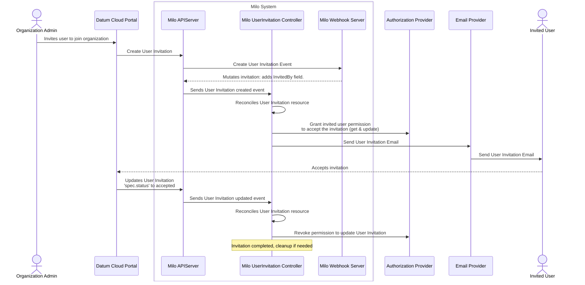
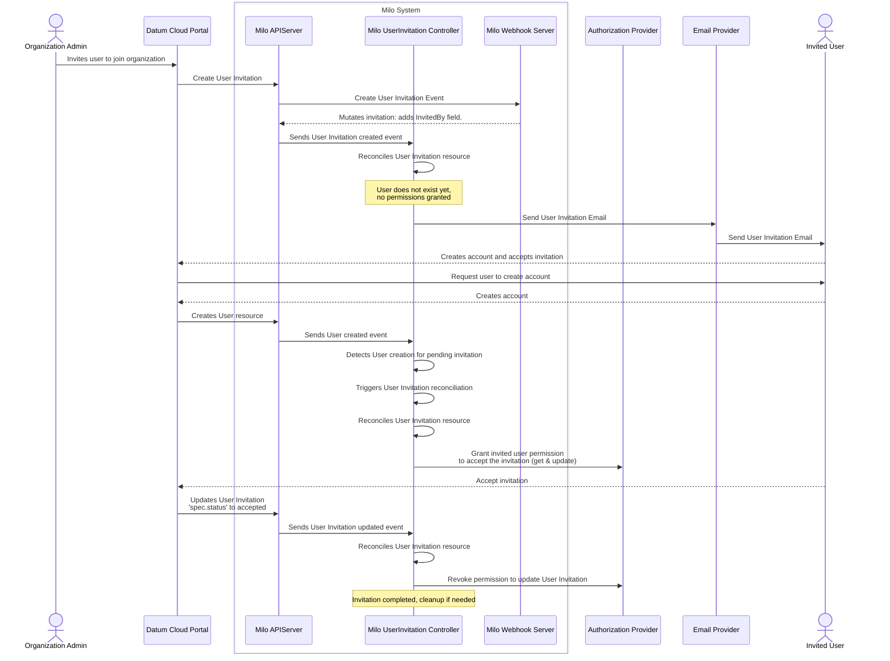

# User Invitation System

- [User Invitation System](#user-invitation-system)
  - [Summary](#summary)
  - [Motivation](#motivation)
    - [Goals](#goals)
    - [Non-Goals](#non-goals)
  - [Proposal](#proposal)
    - [User Stories](#user-stories)
      - [Story 1: Organization Admin Invites User](#story-1-organization-admin-invites-user)
      - [Story 2: Invited User Accepts Invitation](#story-2-invited-user-accepts-invitation)
      - [Story 3: Invitation Expiration and Management](#story-3-invitation-expiration-and-management)
    - [Notes/Constraints/Caveats](#notesconstraintscaveats)
    - [Risks and Mitigations](#risks-and-mitigations)
      - [Risk: Unauthorized Access to Invitations](#risk-unauthorized-access-to-invitations)
      - [Risk: Email Delivery Failures](#risk-email-delivery-failures)
      - [Risk: Invitation Abuse](#risk-invitation-abuse)
  - [Design Details](#design-details)
    - [Architecture Overview](#architecture-overview)
      - [Core Components](#core-components)
      - [Invitation Flow](#invitation-flow)
    - [CRD Specifications](#crd-specifications)
      - [UserInvitation Resource](#userinvitation-resource)
    - [Controller Implementation](#controller-implementation)
      - [Invitation Status States](#invitation-status-states)
      - [Permission Management](#permission-management)
      - [Role Assignment](#role-assignment)
    - [Integration with Email System](#integration-with-email-system)
    - [Basic Monitoring](#basic-monitoring)
      - [Key Metrics](#key-metrics)
      - [Simple Alerting](#simple-alerting)
  - [Implementation History](#implementation-history)

## Summary

The Milo platform needs the ability for organization administrators to invite users to join their organizations through an automated invitation system. This enhancement implements a UserInvitation controller that manages the complete invitation lifecycle, from creation and email notification to acceptance and role assignment.

**This enhancement focuses on the backend invitation management system.** It proposes implementing a UserInvitation controller using Kubernetes Custom Resource Definitions (CRDs) that automatically sends email invitations, manages permissions, and handles role assignment upon acceptance.

**Scope Note:** This enhancement does NOT include the frontend UI for viewing invitations. The frontend integration will be addressed in future enhancements once the backend invitation system is established and proven.

## Motivation

The Milo platform currently lacks an automated user invitation system, which limits organization administrators' ability to efficiently onboard new team members. This enhancement addresses the need for a streamlined, secure, and automated invitation process that integrates with the existing identity and access management system.

Modern SaaS platforms require robust invitation systems to enable smooth team onboarding and collaboration. Without this capability, Milo cannot provide the user experience expected from enterprise collaboration platforms, and administrators must rely on manual processes for user onboarding.

### Goals

- **Provide automated user invitation capabilities** - Enable organization admins to invite users by creating UserInvitation resources
- **Support secure invitation lifecycle management** - Handle invitation creation, email delivery, acceptance/decline, and cleanup
- **Enable automatic role assignment** - Assign specified roles to users upon invitation acceptance
- **Implement proper access control** - Grant invited users limited permissions to view and respond to their invitations
- **Support invitation expiration** - Automatically expire invitations after a specified time period
- **Track invitation status** - Provide visibility into invitation states (pending, accepted, declined, expired)

### Non-Goals

**Explicitly out of scope for this enhancement:**

- **Frontend UI implementation** - No user interface for viewing or managing invitations
- **Re-invitation flows** - No automatic or manual re-invitation capabilities
- **Bulk invitation management** - Focus on individual invitations only
- **Complex role management** - Basic role assignment only, no advanced role hierarchies
- **Invitation templates customization** - Use standard email templates from the email integration system
- **Advanced analytics** - Basic status tracking only, no detailed invitation analytics

**Future enhancements will address:**

- Frontend UI for invitation management
- Bulk invitation capabilities
- Re-invitation and reminder flows
- Advanced invitation analytics and reporting
- Custom invitation templates and branding

## Proposal

This enhancement proposes implementing a UserInvitation system for the Milo platform using Kubernetes Custom Resource Definitions (CRDs). **The system focuses on backend invitation management** - automated email sending, permission management, and role assignment.

The core proposal includes:

1. **UserInvitation CRD** - Represents an invitation with recipient information, roles, and expiration
2. **UserInvitation Controller** - Processes invitation lifecycle and integrates with email and authorization systems
3. **Permission Management** - Grants limited access to invited users for invitation responses
4. **Role Assignment** - Automatically assigns roles upon invitation acceptance
5. **Status Tracking** - Track invitation states throughout the lifecycle

**Key features:** Invitations are immutable except for the status field, have expiration dates, and integrate with existing email and authorization systems.

### User Stories

#### Story 1: Organization Admin Invites User

As an organization administrator, I need to invite users to join my organization by creating UserInvitation resources so that new team members can be onboarded efficiently.

**Acceptance Criteria:**

- Create UserInvitation resources with recipient email, roles, and expiration date
- UserInvitation controller automatically sends email invitations with frontend links
- Invited users receive permissions to view and update their specific invitation
- All invitation fields are immutable except for the status field

#### Story 2: Invited User Accepts Invitation

As an invited user, I need to accept invitations through the frontend so that I can join organizations and receive appropriate access permissions.

**Acceptance Criteria:**

- Invited users can update invitation status to "accepted" or "declined"
- Upon acceptance, specified roles are automatically assigned to the user
- User permissions to modify the invitation are revoked after acceptance
- Invitation status is tracked and visible to administrators

#### Story 3: Invitation Expiration and Management

As a platform operator, I need invitations to expire automatically and provide visibility into invitation states so that security is maintained and administrators can track invitation progress.

**Acceptance Criteria:**

- Invitations automatically expire based on the specified expiration date
- Expired invitations cannot be accepted
- Invitation status shows current state (pending, accepted, declined, expired)
- Failed invitation processing can be retried and debugged

### Notes/Constraints/Caveats

**Implementation Constraints:**

- **Backend-only implementation** - This enhancement provides no frontend UI for invitation management
- **Immutable invitations** - Only the status field can be modified after creation
- **Single organization scope** - Invitations are scoped to individual organizations
- **Email integration dependency** - Requires the email integration system to be operational
- **Authorization integration** - Integrates with existing authorization provider

**Invitation Processing:**

- UserInvitation controller watches for invitation resources and processes them asynchronously
- Failed invitations remain in the cluster with error status for debugging
- Email invitations include links to the frontend where users can respond
- Permission grants are scoped to individual invitations and automatically managed

**What this enhancement does NOT provide:**

- Frontend user interface for invitation management
- Bulk invitation creation or management
- Re-invitation or reminder capabilities
- Custom email templates (uses standard templates)
- Advanced invitation analytics or reporting

### Risks and Mitigations

#### Risk: Unauthorized Access to Invitations

- *Impact:* Malicious users could potentially access or modify invitations they shouldn't have access to
- *Mitigation:* Implement strict permission scoping using a authorization provider, to ensure invited users only have access to their specific invitations

#### Risk: Email Delivery Failures

- *Impact:* Invited users may not receive invitation emails, blocking the onboarding process
- *Mitigation:* Leverage email integration system's retry logic and status tracking, monitor email delivery success rates

**Security Review:** Security team will review permission management, role assignment logic, and integration with authorization systems.

## Design Details

### Architecture Overview

The user invitation system is implemented as a Kubernetes controller that watches UserInvitation Custom Resource Definitions (CRDs) and manages the complete invitation lifecycle through integration with email and authorization systems.

#### Core Components

1. **UserInvitation Controller** - Kubernetes controller that processes UserInvitation resources
2. **UserInvitation CRD** - Defines invitation resources with recipient, roles, and lifecycle information
3. **Email Integration** - Leverages existing email system to send invitation notifications
4. **Authorization Integration** - Manages permissions using an authorization provider
5. **Role Assignment Engine** - Handles automatic role assignment upon invitation acceptance

#### Invitation Flow

### User Invitation flow for existing invited user



### User Invitation flow for non-existent invited user



### CRD Specifications

#### UserInvitation Resource

```yaml
apiVersion: iam.miloapis.com/v1alpha1
kind: UserInvitation
metadata:
  name: user-invitation-12345
  namespace: organization-xyz
spec:
  # Immutable fields (cannot be changed after creation)
  recipientEmail: "john.doe@company.com"
  organizationRef:
    # Immutable fields (cannot be changed after creation)
    name: "organization-xyz"
  roles:
    # Immutable fields (cannot be changed after creation)
    - "member"
    - "viewer"
  # Immutable fields (cannot be changed after creation)
  expiresAt: "2024-02-15T23:59:59Z"
  invitedBy:
    userRef: 
      # Immutable fields (cannot be changed after creation)
      name: "admin-user-id"
  
  # Mutable field (can be updated by invited user)
  status: "pending"  # pending, accepted, declined
```

### Controller Implementation

The UserInvitation Controller is a standard Kubernetes controller that:

1. **Watches UserInvitation Resources** - Uses controller-runtime to watch for UserInvitation resource changes
2. **Manages Email Notifications** - Creates Email resources using the email integration system
3. **Handles Permission Management** - Grants and revokes permissions using an authorization provider
4. **Processes Status Updates** - Handles invitation acceptance, decline, and expiration
5. **Assigns Roles** - Automatically assigns specified roles upon invitation acceptance
6. **Updates Status** - Updates UserInvitation resource status throughout the lifecycle

#### Invitation Status States

- `pending` - Invitation created but user has not responded
- `accepted` - User has accepted the invitation and roles have been assigned
- `declined` - User has explicitly declined the invitation
- `expired` - Invitation has passed its expiration date without response

#### Permission Management

The controller manages permissions through an external authorization provider integration:

- **On Creation:** Grant invited user permissions to `get` and `update` their specific invitation
- **On Acceptance:** Revoke invitation permissions and assign specified organization roles
- **On Decline/Expiration:** Revoke invitation permissions without role assignment

#### Role Assignment

Upon invitation acceptance, the controller:

1. Validates that the invitation is still valid (not expired)
2. Assigns all roles specified in the invitation to the user
3. Updates the invitation status to "accepted"
4. Revokes the user's permission to modify the invitation
5. Records the acceptance timestamp

### Integration with Email System

The UserInvitation controller integrates with the existing email system by:

1. **Creating Email Resources** - Automatically creates Email resources when invitations are created
2. **Using Standard Templates** - Leverages EmailTemplate resources for consistent invitation formatting
3. **Providing Frontend Links** - Includes links to the frontend where users can view and respond to invitations
4. **Tracking Email Status** - Monitors email delivery status through the email system

**Email Template Variables:**
- `RecipientName` - Name of the invited user
- `InviterName` - Name of the user who sent the invitation
- `OrganizationName` - Name of the organization
- `InvitationLink` - Link to frontend invitation page
- `ExpirationDate` - When the invitation expires
- `Roles` - List of roles being granted

### Basic Monitoring

#### Key Metrics

- **Invitation Creation Rate** - Number of invitations created per time period
- **Invitation Acceptance Rate** - Percentage of invitations that are accepted
- **Invitation Expiration Rate** - Percentage of invitations that expire without response
- **Email Delivery Success Rate** - Percentage of invitation emails successfully delivered
- **Role Assignment Success Rate** - Percentage of successful role assignments upon acceptance

#### Simple Alerting

- Invitation acceptance rate drops below 70%
- Email delivery failure rate exceeds 5%
- Role assignment failures occur
- Controller pod restarts or becomes unhealthy

## Implementation History

**Phase 1 (Alpha - v0.1) - Core Invitation System:**

- UserInvitation CRD with basic lifecycle management
- UserInvitation controller with email and authorization integration
- Permission management for invited users
- Automatic role assignment upon acceptance
- Integration with existing email system
- **No frontend UI - backend only**

**Future Phases (Planned but not in this enhancement):**

- Phase 2: Frontend UI for invitation management and user response
- Phase 3: Bulk invitation capabilities and management tools
- Phase 4: Re-invitation and reminder flows
- Phase 5: Advanced invitation analytics and reporting
- Phase 6: Custom invitation templates and branding options