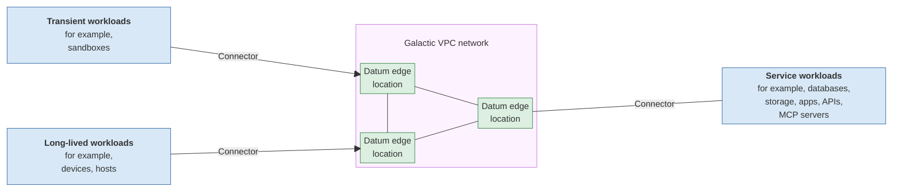

<!-- omit from toc -->
# Datum Connections

*Proposed. Not available yet. Commands may change.*

**Datum Connections puts workloads anywhere on one private
[Galactic VPC](https://www.datum.net/docs/galactic-vpc/overview) network. Every workload on the network
can reach every other.**

<!-- omit from toc -->
## Contents

- [Benefits](#benefits)
- [How it works](#how-it-works)
- [Get started](#get-started)
- [Appendix A: Advanced configuration options](#appendix-a-advanced-configuration-options)
  - [Advertising multiple workloads via a Connector](#advertising-multiple-workloads-via-a-connector)
  - [Grouped identities](#grouped-identities)

## Benefits

- **Nothing exposed.** No inbound port open anywhere.
- **Instant workload attachment.** Token available at workload start. No secrets live in the workload.
- **Groups per customer or team.** Each group has its own access rules and address range.
- **Consistent access control everywhere.** The same identities and rules at every Datum location,
  whatever the tunnel type or issuer.

## How it works

A **Connector**, the Datum agent, runs alongside workloads: next to a single workload, or on a sandbox
host, where it gives each sandbox its own tunnel. The Connector dials out to the nearest Datum edge
location, and joins the network.



## Get started

**1. Create a network,** such as `backend`, as described in
[Create and manage networks](https://www.datum.net/docs/galactic-vpc/networks).

**2. Register an issuer** of tokens for the workloads:
- **(a) Workloads have an existing IdP issuing tokens for it.** Register it:

  ```shell
  datumctl issuer create my-corporate-idp \
    --issuer-discovery-url https://idp.example.com/.well-known/openid-configuration
  ```

- **(b) Workloads have no existing IdP.** Datum-issued one-time enrollment tokens:

  ```shell
  datumctl issuer create my-backend-enroller --enroller-profile=backend-enroller-profile
  ```

  Optional settings include `--token-lifetime` and `--batch-size`. Get tokens in batches
  with `datumctl issuer token my-backend-enroller`, one token per workload instance.

**3. Join the workload to the network.** Run the Datum agent alongside the workload, with the
workload's token in the `DATUM_CONNECTOR_TOKEN` environment variable:

```shell
datumctl connect vpc join my-workload-a --network=backend --issuer=my-corporate-idp
```

The agent enrolls and connects. The workload itself reaches every other workload on `backend` with no
steps and no secrets of its own. A workload here is one application, however many copies of it run. To
disconnect it, stop the agent.

---

## Appendix A: Advanced configuration options

### Advertising multiple workloads via a Connector

A Datum agent can also make machines behind it reachable, such as the databases in a datacenter, without
running on each of them. Join with `--advertise`:

```shell
datumctl connect vpc join my-service-c --network=backend --issuer=my-corporate-idp \
  --advertise=10.200.1.0/30
```

`--advertise` takes an address range, such as `10.200.1.0/30`.

### Grouped identities

An idSet groups workloads by issuer and token claims, across issuers.

```shell
datumctl issuer create my-k8s-cluster \
  --issuer-discovery-url https://k8s.example.com/.well-known/openid-configuration
datumctl identityset create backend-accessors
datumctl identityset member-add backend-accessors --issuer=my-corporate-idp --claim=team:dbadmins
datumctl identityset member-add backend-accessors --issuer=my-k8s-cluster \
  --claim=sub:system:serviceaccount:research:notebook
```

Policies, to be defined soon, can then govern each group (allow|deny, ratelimit, redirect, etc).

Some identity providers, such as a public CI service, also issue tokens to other organizations. A group
can single out this organization's workloads, and a policy then governs their access to the network:

```shell
datumctl identityset create example-ci
datumctl issuer create public-ci \
    --issuer-discovery-url https://ci.example.com/.well-known/openid-configuration
datumctl identityset member-add example-ci --issuer=public-ci --claim=org:example.com
# Policy governing access to the backend network from example-ci not shown
```
