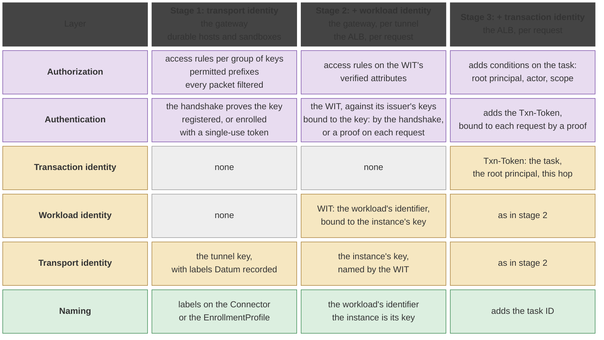
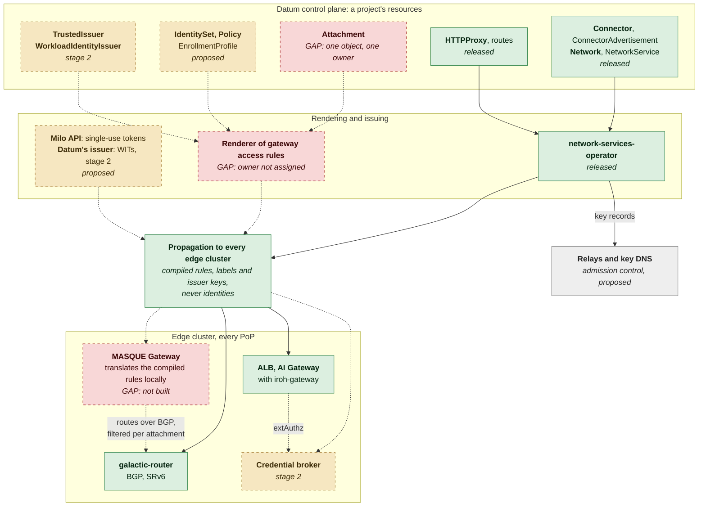
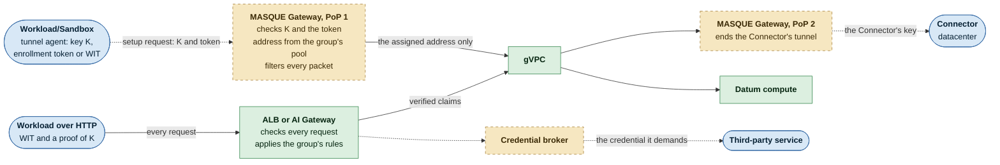
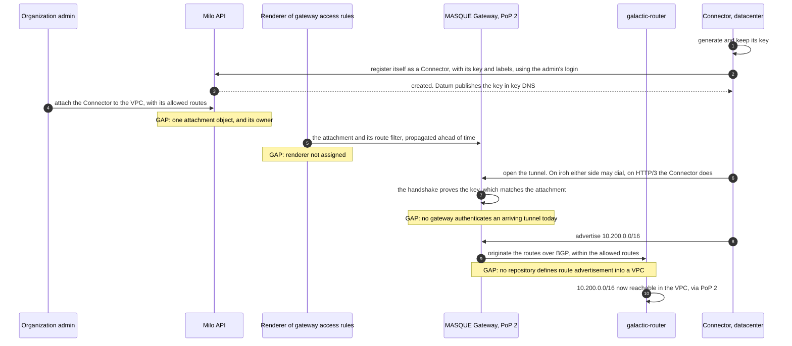
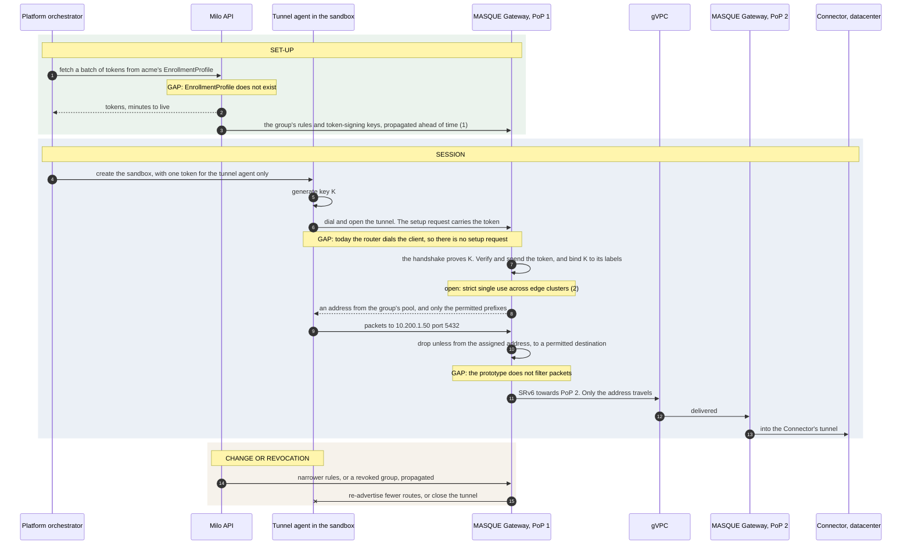
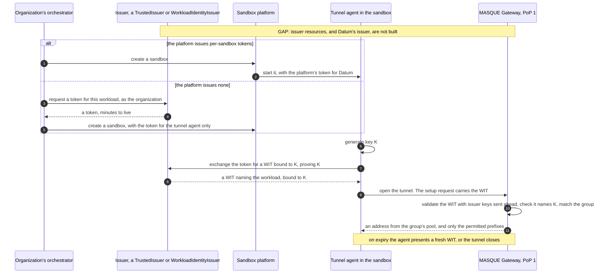
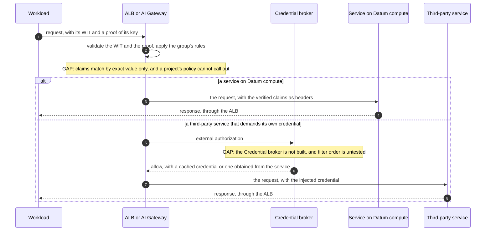
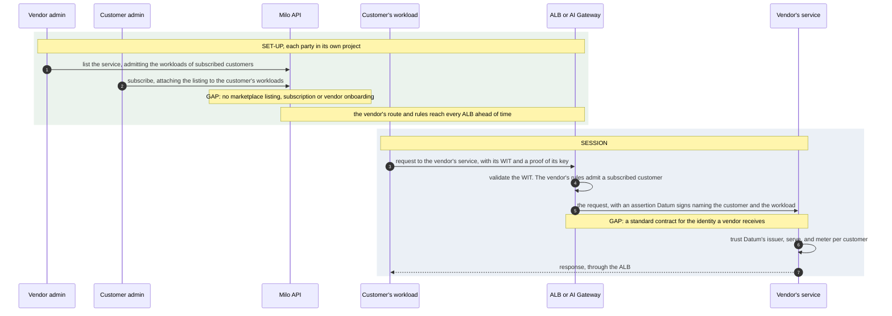

<!-- omit from toc -->
# Connections IAM

<!-- omit from toc -->
## Contents

- [Summary](#summary)
- [Motivation](#motivation)
  - [Goals](#goals)
- [Proposal](#proposal)
  - [Identity, delivered in stages](#identity-delivered-in-stages)
- [Design Details](#design-details)
  - [Components](#components)
  - [Resources](#resources)
  - [Control plane to edge](#control-plane-to-edge)
  - [Where each identity is checked](#where-each-identity-is-checked)
  - [IdentitySet and Policy](#identityset-and-policy)
  - [Batched Enrollment tokens and the EnrollmentProfile](#batched-enrollment-tokens-and-the-enrollmentprofile)
  - [How it works](#how-it-works)
- [Roadmap](#roadmap)
- [Enrollment Token Alternative: One token path for stages 1 and 2](#enrollment-token-alternative-one-token-path-for-stages-1-and-2)

---

## Summary

Identity and access management for Datum Connections: attaching tunnels to a Galactic VPC (gVPC). A
**workload** is anything that calls through Datum, such as an agent in a sandbox; a **resource** is what it
reaches. Connections groups workloads by identity at sandbox churn, with nothing registered per sandbox,
and lets each group reach only its resources.

## Motivation

**For a NeoCloud or sandbox provider, the primary target: connect each customer's workloads to exactly
the resources that customer needs, grouped by identity, simple to deploy, with nothing registered per
sandbox.** The same applies to enterprises and Tunnels customers. Beyond private access, the targeted
platforms need no secrets in their sandboxes, egress their customers' firewalls can allowlist, and
isolation per customer at high churn.

Each manages groups of workloads with differing needs:

| Party | Its groups | What it needs |
|---|---|---|
| **NeoCloud or sandbox provider** | Its customers, each with many short-lived workloads reaching different resources | Access and egress per customer, set once, never per sandbox. Its customers' security approval |
| **Enterprise** | Workloads from the platforms it uses, and its own teams | Each group reaches only its sites and services. One place to change and revoke. Proof for auditors |
| **Tunnels customer** | Its services, and the workloads that call them | Each service reachable only by its callers, with no public URL |

**Three values, in the customer's order:**
1. **Provision, manage and observe by group:** access rules per group, enforced at every PoP, a record per
   group, and revocation that closes live tunnels.
2. **Ease of use:** one outbound Connector, one set of access rules, and a tunnel agent in the sandbox
   image.
3. **Ease of operation at high churn:** nothing registered or cleaned up per sandbox. Configuration grows
   with groups, not sandboxes.

**Why identity.** Resources group well by network: sites, VPCs, prefixes. Workloads do not: they are
short-lived, share hosts and addresses, and their groups follow what the network cannot see, such as which
customer or which kind of agent. Datum groups workloads by identity and lets each group reach only its
resources. An address pool per group keeps address-based firewalls working.

**(Future) Marketplace plugins.** A workload attaches to a third-party service in one step,
through identity federation: the service accepts the workload's own identity, or an assertion Datum signs
for it, so no API keys are exchanged.

### Goals

1. Phased implementation, with Stage 1 being sufficient for many customer use-cases.
2. Authenticate each tunnel at setup - the client dials the Datum gateway.
3. Sandbox attachment with nothing registered per sandbox.
4. Authorize what a tunnel may reach, per group, filtering every packet.
5. Audit who attached and what they reached, and revocation by closing live tunnels.
6. A common authentication framework across tunnel types, such as MASQUE and iroh first, WireGuard and IPsec later.
7. Groups and address pools per customer/team of an org.
8. Admission across organizations, potentially enabling federation with (future) marketplace plugins.


## Proposal

### Identity, delivered in stages

Connections can use three kinds of identity defined in [`dataplane-workload-identity-framework.md`](dataplane-workload-identity-framework.md):
**transport identity** (which endpoint), **workload identity** (who it is) and **transaction identity**
(what it is doing, and for whom).

Stages enable implementation of these in a phased manner. **Stage 1 is complete on its own**, since this
might be sufficient for many customer use-cases: tunnel transport and gVPC access, with no ALB or 
transaction-scopes, delegation or task-bound features. In stage 1 a durable host registers its
key in a `Connector`, and a workload sandbox binds its own key to a group with a single-use token minted 
from an `EnrollmentProfile`
([Batched Enrollment tokens and the EnrollmentProfile](#batched-enrollment-tokens-and-the-enrollmentprofile)).

| Stage | Checked at | Adds |
|---|---|---|
| **1. Transport identity** | The gateway, once per tunnel | All three values in [Motivation](#motivation) |
| **2. + workload identity** | The gateway per tunnel, and the ALB per request | No token handed to each sandbox; checks on every request over HTTP; the marketplace |
| **3. + transaction identity** | The ALB, per request | Delegation; Task-bound identities |

**The authentication step is the tunnel setup request.** The handshake proves the key, and the setup
request carries the token: the `Authorization` header of CONNECT-IP (RFC 9484, section 11), or the first
message on iroh. In the existing prototype there is no setup request, since the router dials the client.

What each stage checks, layer by layer:



## Design Details

What runs in the control plane and in each edge cluster, and the resources that configure it. In the
diagrams, proposed pieces are dashed and gaps are marked **GAP**.

### Components

| Where | Component | Role | Status |
|---|---|---|---|
| Control plane | Milo APIs / Datum TrustedIssuer | Holds each project's resources. Mints single-use tokens from an `EnrollmentProfile` (stage 1) | Released; tokens proposed |
| | network-services-operator | Renders `Connector` and `HTTPProxy` into edge configuration, and publishes each Connector's key in Datum's key DNS | Released |
| | Renderer of gateway access rules | Compiles each project's groups and access rules once: validates them, reports status, and propagates the result. Each edge cluster translates it into its gateway's configuration, as Envoy Gateway does for routes | Proposed; owner not assigned |
| | Datum's issuer | Exchanges a platform's or orchestrator's token for a WIT bound to the workload's key, registered as a `TrustedIssuer` | Proposed, stage 2 |
| | Propagation | Carries configuration, never identities, to every edge cluster | Released |
| Each edge cluster | MASQUE Gateway | Ends tunnels, on iroh or HTTP/3. Checks the setup request, assigns an address from the group's pool, filters every packet, and bridges to SRv6 | Proposed in galactic; no code |
| | galactic-router, galactic-gateway, galactic-nat | gVPC routing over BGP and SRv6, forwarding rules, and egress through NAT66 and NAT64 | Released |
| | ALB and AI Gateway, with iroh-gateway | HTTP routes and their security policy. iroh-gateway dials Connectors | Released |
| | Credential broker | Called by the ALB on each request. Obtains the credential a third-party service demands, so the workload never holds it. Never issues WITs | Proposed, stage 2 |
| Global | Relays, key DNS | NAT traversal; endpoint keys Datum publishes | Released; relay admission control proposed |
| Workload | Tunnel agent | Holds the tunnel key and sends the setup request, apart from the workload's code | Prototype; does not dial yet |

### Resources

| Resource | Purpose | Status |
|---|---|---|
| `Connector`, with `ConnectorClass` and a `Lease` | A durable endpoint: its key, labels and liveness | Released |
| `ConnectorAdvertisement` | Layer-4 services a Connector exposes: addresses and ports | Released. **GAP:** no network prefixes |
| `Network`, with a `NetworkContext` per Location | The project's virtual network on the gVPC, and its presence in each Location. `NetworkInterface.status.vpc` names the galactic VPC behind it | Released |
| `Subnet`, `SubnetClaim`, `NetworkInterfaceClaim`, `NetworkBinding` | Addressing and attachment in each Location, used by Datum compute today | Released |
| `NetworkService`, `NetworkPolicy` | A named set of instances across Locations; an instance's ingress rules by address block | Released. `NetworkPolicy`'s spec is not yet defined |
| `ConnectorAttachment` (galactic) or `VPCAttachment` (connect) | Binds a Connector to a VPC: allowed routes, the assigned address, the gateway's key | galactic's is a proposal with an example only. The tunnel client's is a client-side type in its prototype, with no CRD or controller. **GAP:** one object, and its owner |
| `VPCIngressPoint`, `VPCAccessPolicy` | Gateway configuration per VPC, and authorization rules | Named in galactic's proposal, not defined. `VPCAccessPolicy` overlaps `Policy` |
| `TrustedIssuer`, `WorkloadIdentityIssuer` | Token issuers trusted platform-wide or by a project, shared with the control plane (W1) | Proposed, stage 2 |
| `IdentitySet`, `Policy` | Groups of workloads, and what each may reach ([IdentitySet and Policy](#identityset-and-policy)) | Proposed |
| `EnrollmentProfile` | The labels and limits of the single-use tokens the Milo API mints from it. Tokens are not stored ([Batched Enrollment tokens and the EnrollmentProfile](#batched-enrollment-tokens-and-the-enrollmentprofile)) | Proposed, stage 1 |
| `HTTPProxy`, `Gateway`, `HTTPRoute`, `SecurityPolicy` | ALB routes. Datum renders the one security policy per route | Released |

- **Route advertisement into a VPC is not defined in any repository.** galactic's `allowedRoutes` most
  likely lists the routes a client may reach, and connect's `advertisedPrefixes` are VPC prefixes pushed
  to the client. Proposed: BGP in galactic originates a Connector's prefixes, filtered per attachment.
  **GAP.**
- **The ALB reaches instances on a VPC** through `HTTPProxy`'s `instance` backend, over per-tenant VRF
  and SRv6. It is implemented; its design, HTTP ingress for VPC networks, is provisional.
- **Egress leaves a VPC through galactic-nat.** An address pool per organization, subdivided per idSet so a
  firewall can tell groups apart, needs egress to choose the source address by the packet's group.
  **GAP.**

### Control plane to edge



### Where each identity is checked



- **A tunnelled workload reaches compute without the ALB.** Its group's Policy targets a `NetworkService`,
  and PoP 1 filters every packet. The instance's `NetworkPolicy` can also admit the group's address pool.
- **HTTP to the ALB does not use the tunnel** in VPC-only mode: the workload calls the ALB directly, with
  its WIT and a proof. In default-route mode, the packets leave the VPC through egress. **GAP:** an ALB
  listener inside the `Network`, to keep that traffic private.

### IdentitySet and Policy

An **IdentitySet (idSet)** resource, a concept described in [`identityset-policy-examples.md`](identityset-policy-examples.md), names a group of 
potentially disparate identities in one project on the basis of identity attributes such as claims, subjects,
or other metadata (not by listing instances). The idSet thereby provides a flexible association for a 
**Policy** resource that may associate a variety of policy actions (to be defined in the future) with an
idSet. The renderer turns them into configuration that can be attached at appropriate targets (such as the 
gateway) by the corresponding controller.

- **Members:** transport identity at stage 1, by labels on a `Connector`, or on the `EnrollmentProfile`
  whose token a sandbox presented; workload identity at stage 2, by any attribute Datum verifies on the
  credential: a token's issuer, subject and claims, or a certificate's URI or DNS name. Attributes a
  workload asserts about itself are never selectable.
- Namespaced to the project, with no references across projects; selects on who the workload
  is, while what it does and for whom are Policy conditions; expanded in the control plane, so only rules
  and labels propagate; a record of memberships keyed by the idSet's UID and generation, for audit.
- **Open:** one principal across both planes; whether one idSet may mix member kinds; actions beyond
  allow and deny.

Illustrative only:

```yaml
kind: IdentitySet                          # stage 1: transport identity
metadata: { name: acme-researchers, namespace: project-blue }
spec:
  members:
    - transportIdentity:                   # sandboxes enrolled with tokens from matching profiles
        enrollmentProfileSelector: { matchLabels: { customer: acme, agent-class: researcher } }
---
kind: IdentitySet                          # stage 2: workload identity
metadata: { name: acme-researchers-federated, namespace: project-blue }
spec:
  members:
    - workloadIdentity:                    # a token: its issuer, subject and claims
        issuerRef: { name: sandbox-platform }
        claims: { org: acme, agentClass: researcher }
    - workloadIdentity:                    # a certificate: its URI SAN
        certificate: { uriSAN: "spiffe://acme.example/agent/researcher" }
---
# Stage 2: acme's researcher agents may only read acme's bucket in Datum-hosted object storage.
kind: Policy
metadata: { name: researchers-read-research-data, namespace: project-blue }
spec:
  subject: { identitySetRef: { name: acme-researchers-federated } }
  target: { bucketRef: { name: acme-research-data } }   # checked per request at the ALB, which passes
  operations: [ read, list ]                            # the verified claims to object storage
  action: Allow
---
# Stage 1: tunnelled researchers may reach only the orders database, behind acme's datacenter.
kind: Policy
metadata: { name: researchers-reach-orders-db, namespace: project-blue }
spec:
  subject: { identitySetRef: { name: acme-researchers } }
  target:                                  # instances on Datum compute: a networkServiceRef instead
    networkRef: { name: acme-network }
    prefixes: [ 10.200.1.50/32 ]
    ports: [ 5432 ]
  action: Allow
```

### Batched Enrollment tokens and the EnrollmentProfile

To be specified with the design. An `EnrollmentProfile` lets a sandbox join a group at stage 1 with
nothing registered per sandbox and no token issuer at the platform.

```yaml
kind: EnrollmentProfile                    # illustrative only
metadata:
  name: acme-researchers
  namespace: project-blue
  labels: { customer: acme, agent-class: researcher }   # what idSets select on
spec:
  tokenLifetime: 10m
  maxBatch: 1000
```

1. The project owner creates the profile. Access control decides who may request tokens from it, so a
   platform cannot choose its own labels.
2. The platform asks the Milo API for a batch of tokens from the profile, one call per batch. The API
   mints them without storing them. Each is signed, short-lived, single use, and carries the profile's name 
   and labels, never an idSet's name.
3. The orchestrator hands one token to each sandbox's tunnel agent.
4. The tunnel agent generates a key, and presents the token at tunnel setup.
5. The gateway checks the signature with keys sent ahead, the expiry, the audience and the token's unique
   ID. It binds the key to the profile's labels for the tunnel's life, and applies the compiled rules.
   The renderer selects profiles, never tokens.

**The token is not an identity.** It is a one-time enrollment credential. The sandbox's identity is its
transport identity, its key, with the labels Datum recorded on the profile.

**The tunnel agent, not the workload's code, holds the key and token.** Best: run it on the platform's
host, outside the sandbox. Otherwise: a separate user or sidecar, the key in memory, and the token
readable only by the tunnel agent.

**Open:** strict single use across edge clusters needs further design; lifetime and batch size; revoking
tokens not yet used; reconnection.

### How it works

Five sequences. Steps that do not exist today are marked **GAP**.

**1. An organization's Connector registers and attaches (stage 1).**



**2. A sandbox enrolls with a single-use token and reaches the datacenter (stage 1).** The token comes
from an `EnrollmentProfile`, as described in [Batched Enrollment tokens and the
EnrollmentProfile](#batched-enrollment-tokens-and-the-enrollmentprofile).



(1) The renderer compiles the rules, and propagation carries them; one arrow, for brevity.
(2) A token checked offline is single use per PoP only. Strict single use across edge clusters needs
further design.

**3. A sandbox presents a WIT at tunnel setup (stage 2).** It then continues as sequence 2.



**4. A workload calls a service through the ALB (stage 2).**



**5. A workload calls a marketplace vendor's service (stage 2).**



No API keys are exchanged. A vendor that demands its own credential gets one through the Credential
broker, as in sequence 4.

## Roadmap

Each step needs its decisions first. **Stage 1 is complete after step 3.**

| Step | Stage | Delivers | Decide first |
|---|---|---|---|
| **1. Authentication on the tunnel prototype** | 1 | The client dials and sends a setup request. The gateway keeps its key, published in Datum's key DNS, checks a registered key, filters every packet and assigns from a pool | How the setup message travels on iroh: a first frame, or CONNECT-IP |
| **2. Control-plane resources** | 1 | One attachment object; the renderer of gateway access rules; IdentitySet and Policy with transport members; `EnrollmentProfile` and its tokens; a record of each binding | The attachment model and its owner; how strictly single use must hold |
| **3. Gateways in the PoPs** | 1 | MASQUE Gateways over the gVPC to Connectors; route filters per attachment; relay admission; Datum-run discovery | Which side opens a Connector's tunnel |
| **4. Workload identity** | 2 | Issuer resources shared with W1; Datum's issuer; WITs at tunnel setup; the ALB and AI Gateway with rendered policy and the Credential broker; a marketplace pilot | The identifier scheme, and the subject Datum signs |
| **5. Transaction identity, and one identity across planes** | 3 | Transaction tokens at the ALB; WITs accepted at the Milo API; audit, and Datum as a witness | The delegation convention |


## Enrollment Token Alternative: One token path for stages 1 and 2

Not adopted, likely feasible. It compares stage 1's enrollment token, described in [Batched Enrollment tokens and the
EnrollmentProfile](#batched-enrollment-tokens-and-the-enrollmentprofile), with stage 2's WIT. Both do the same job
at the gateway: check a signature with keys sent ahead, check expiry and audience, match claims, and bind
to the key.

| | Enrollment token, stage 1 | WIT, stage 2 |
|---|---|---|
| **Signed by** | The Datum TrustedIssuer | A registered issuer: the platform's, or Datum's |
| **Names** | A profile's labels: a group | The workload |
| **Bound to the key** | At first use | When issued, by an exchange proving the key |
| **Reuse** | Single use | Until it expires |
| **idSet member** | `transportIdentity`, by profile labels | `workloadIdentity`, by issuer, subject and claims |

**The option:** mint enrollment tokens from Datum's issuer, with the profile's labels as claims. The
gateway then has one token path for both stages, and idSets one member kind for tokens. Stage 2 only adds
other issuers and claims that name the workload. The `EnrollmentProfile` stays, as the configuration of
what Datum's issuer puts in the token and who may request it.

**Implications**
- **No new machinery:** stage 1 already needs Datum to sign tokens and send the keys ahead;
- **framing:** stage 1 becomes transport identity plus a Datum-issued group token, reversing "the
  token is not an identity";
- **binding at first use stays,** so a sandbox makes no extra round trip.
