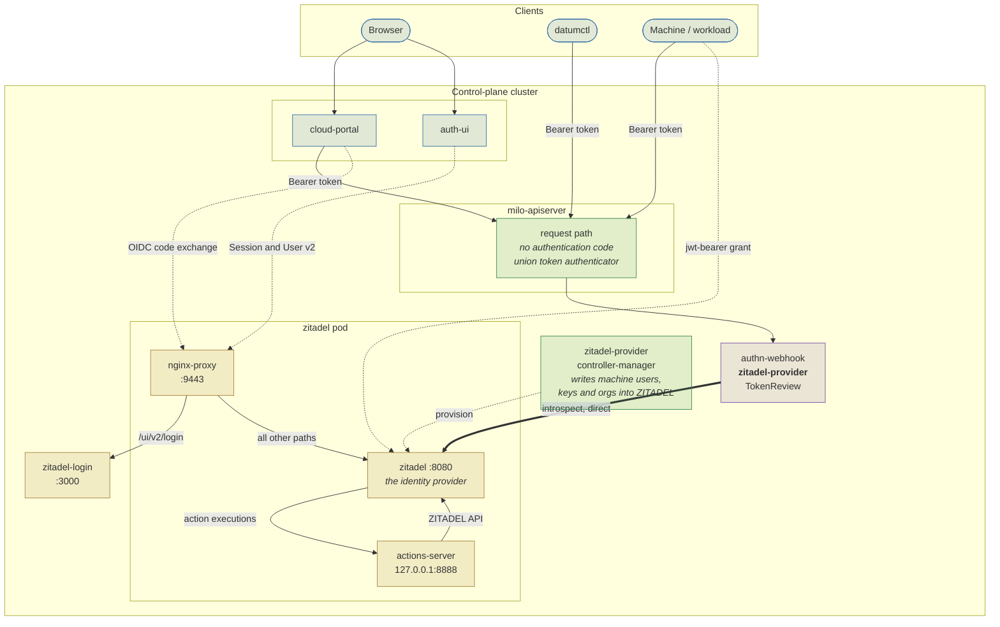
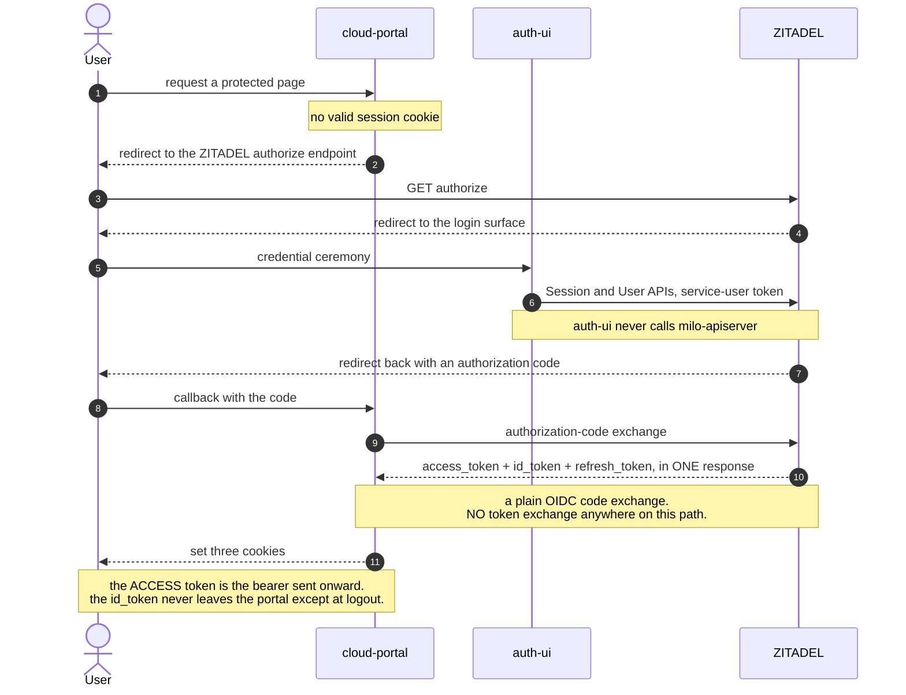
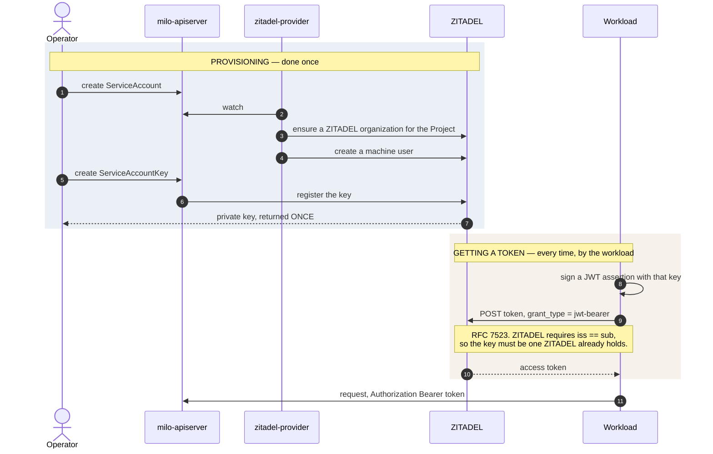
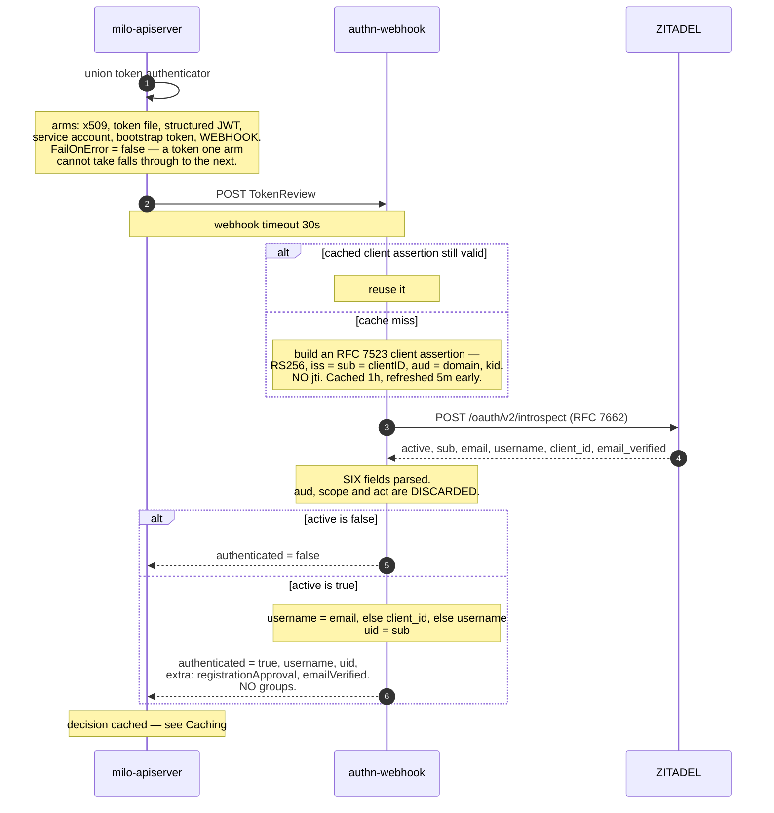

<!-- omit from toc -->
# IAM — Control-plane authentication architecture

**Companions**

| Document | Covers |
|---|---|
| [`IAM-AuthZ-architecture.md`](IAM-AuthZ-architecture.md) | The other half — how a decision is made once the caller is known |
| [`IAM-WIF-use-cases.md`](IAM-WIF-use-cases.md) | The map: both halves in one picture, and the seven identity use cases |
| [`control-plane-workload-identity-federateIn-PRD.md`](control-plane-workload-identity-federateIn-PRD.md) | Letting an external workload authenticate with its own platform's token |

<!-- omit from toc -->
## Contents

- [What authentication does here](#what-authentication-does-here)
- [The components](#the-components)
- [How a caller gets a token](#how-a-caller-gets-a-token)
  - [Human login](#human-login)
  - [Workload and service-account tokens](#workload-and-service-account-tokens)
- [The TokenReview path](#the-tokenreview-path)
- [Caching, and what it means for revocation](#caching-and-what-it-means-for-revocation)
- [The constraint that shapes every federation option](#the-constraint-that-shapes-every-federation-option)
- [Authentication at the edge](#authentication-at-the-edge)
- [What authentication does not do](#what-authentication-does-not-do)

---

## What authentication does here

One job: turn a bearer token into an identity, or refuse. Every caller — a person in a browser, a CLI, a
machine — arrives at the Milo API with a token in an `Authorization` header. Authentication decides whose
token it is. It makes no access decision at all.

**The API server contains no authentication code.** It is a Kubernetes-style API server that re-composes the
upstream request-handling chain and delegates the decision over a standard webhook interface. This single
fact shapes everything below: authentication is something Datum *configures* and *hosts*, not something the
API server implements.

**The output is small and fixed:**

| Field | What it carries |
|---|---|
| `username` | A display and audit value. It plays no part in the access decision |
| **`uid`** | The identity provider's subject identifier. This is the entire identity as far as authorization is concerned |
| `groups` | Empty from this path. The API server adds `system:authenticated` itself |
| `extra` | String key-value pairs. Two are set here and consumed downstream as security decisions |

> **The seam between the two documents.**
>
> Authentication hands authorization a flat record — `{username, uid, groups, extra}` — and nothing else.
> There is no object, no session, no capability list. The policy decision point keys entirely on `uid`.
> That record is the whole interface between the two halves of Datum IAM, and it is the reason a change to
> either half is bounded.

---

## The components

> The pod's three containers, the nginx routes, and the endpoint each Datum service dials were read from a running cluster.
>
> **Three things the picture exists to carry.**
>
> 1. The authn-webhook reaches the `zitadel` container directly and does not pass through `nginx-proxy`.
>    The proxy fronts browser traffic only. Drawing the webhook through it would be wrong.
> 2. **The identity provider is a deployment Datum runs.** The endpoint is Datum's to configure; its
>    *behaviour* is the provider's, and [the federation constraint](#the-constraint-that-shapes-every-federation-option)
>    shows that behaviour is not configurable away.
> 3. The login routing differs between production and a test deployment, and this diagram draws the
>    test one. In production the browser reaches `auth-ui`, and `/ui/v2/*` is rewritten to it for the
>    benefit of clients that hardcode those paths; the separate `zitadel-login` workload shown here is what
>    a default deployment of the provider ships. Read the login box as "the login surface", and take the
>    production routing from deployment configuration rather than from this picture.
> 4. `cloud-portal` and `auth-ui` arrows are read from deployment configuration rather than observed,
>    because neither is deployed in the environment these readings come from.

---

## How a caller gets a token

Two paths exist. A third — an external platform's own token — does not work today, and
[the federation constraint](#the-constraint-that-shapes-every-federation-option) explains why.

### Human login

> The access token, not the ID token, travels to the API server, so the access token's subject is what the whole authorization model keys on.

### Workload and service-account tokens

> The provisioning path and the grant are exercised on a running cluster.
>
> **One structural consequence of provisioning, easy to miss.** The controller creates one ZITADEL
> organization per Milo Project, lazily, on the first ServiceAccount
> (`internal/controller/serviceaccount_controller.go`). So machines shard per Project while humans all
> share one organization — one login policy, one identity-provider set. At many organizations times many
> projects the machine organization count grows linearly and the human one does not.

---

## The TokenReview path

This is where a token becomes an identity. It runs on every request the response cache does not already
cover.

> **Three properties worth carrying out of this diagram.**
>
> 1. The introspection response is parsed for a small fixed set of fields. Neither scope nor a delegate
>    claim is among them, which is why neither downscoping nor delegation can be expressed today.
> 2. **`registrationApproval` is a constant on the allow path** — it records that the path was taken,
>    not a decision made.
> 3. **`emailVerified` is stamped only when `email` is non-empty.** A machine identity carries no email,
>    so the branch never fires for one.

---

## Caching, and what it means for revocation

Two layers compose, and they are not the same layer. At the upstream version the API server is built on:

| Layer | Default | What it caches |
|---|---|---|
| The **webhook arm**, individually wrapped | **2m** | Successes and failures alike — a transient introspection failure is remembered |
| The **union** of all arms | 10s success, 0s failure | The composed result |

So the union re-evaluates after 10 seconds, but the webhook itself is not re-consulted for up to two
minutes.

**Production sets no override**, so the two-minute default applies there. The lifetime is configurable, so
a deployment that sets it explicitly gets a different number. Always quote this figure with the
deployment it came from, and note that it is the *authentication* cache — the authorization decision has
a separate one with a different lifetime, described in the companion document.

---

## The constraint that shapes every federation option

With paired controls, and re-runnable as a single command. The identity provider cannot
ingest a token it did not issue. Both of its non-interactive paths refuse, for two independent reasons:

| Path | Rule | Consequence |
|---|---|---|
| **RFC 7523 `jwt-bearer`** | The token's issuer and subject must be the same value, checked **before** the signing key is resolved | A CI platform's token names the platform in its issuer and the workload in its subject. Those are necessarily different strings. Registering the key does not help, because the rejection is not about the key |
| **RFC 8693 token exchange** | The subject token's issuer must be the provider itself | Stricter still. Neither matching issuer and subject nor supplying an actor token rescues it — both were tested |

Two things follow, and they frame the whole federation programme.

1. The long-lived customer-held key is structurally forced, not a lazy default. The only credential the
   provider accepts non-interactively is a key it issued.
2. Validating a foreign token is work Datum must do somewhere it controls. There is no configuration of
   the existing provider that accepts an external platform's token.

The mechanism for a second path already exists and is unused. The API server is already
started with a structured-authentication-configuration argument and the value is **empty**. Arming a second
issuer is a configuration file and one environment variable — and because the outer union does not fail on
error, a second issuer provably cannot displace the existing path.

The design options built on this are in
[`control-plane-workload-identity-federateIn-PRD.md`](control-plane-workload-identity-federateIn-PRD.md).

---

## Authentication at the edge

**It exists, and it is not Datum's.** Datum's application load balancer authenticates callers at the edge
against a provider **the org** configures. So the correct statement is not "no authentication at the
edge" but *"edge authentication is org-owned and is not integrated with Datum's IAM"* — there is an
enforcement point, and it has no relationship to any Datum principal, which is why nothing in this document
applies to it.

The edge topology, the mechanism and its operational traps are described in
[`IAM-WIF-use-cases.md`](IAM-WIF-use-cases.md).

---

## What authentication does not do

Stated plainly, because each of these is regularly assumed to be here and is not.

| Absent | Consequence |
|---|---|
| **Audience restriction** | No audience is validated on this path |
| **Scopes and downscoping** | Scope is not carried to the authorization decision |
| **Delegation** | Nothing can express "acting on behalf of" |
| **Groups** | None are returned. Only `system:authenticated` is added |
| **Federated identity** | No external issuer is trusted — see [the federation constraint](#the-constraint-that-shapes-every-federation-option) |
| **Revocation faster than the cache** | Up to two minutes in production — see [Caching](#caching-and-what-it-means-for-revocation) |

**Where authentication ends.** It produces `{username, uid, groups, extra}` and hands it on. Everything
after that — whether the identity may do the thing it asked for — is
[`IAM-AuthZ-architecture.md`](IAM-AuthZ-architecture.md).
