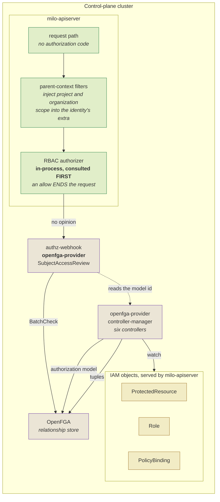
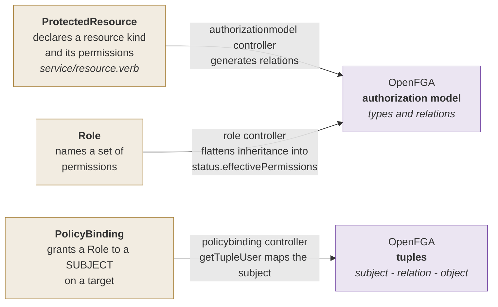
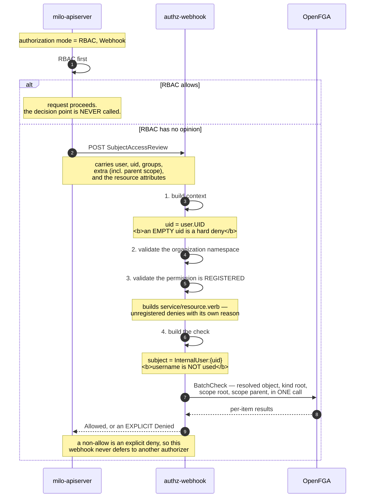

<!-- omit from toc -->
# IAM — Control-plane authorization architecture

**Companions**

| Document | Covers |
|---|---|
| [`IAM-AuthN-architecture.md`](IAM-AuthN-architecture.md) | The other half — how a caller becomes a known identity |
| [`IAM-WIF-use-cases.md`](IAM-WIF-use-cases.md) | The map: both halves in one picture, and the seven identity use cases |

<!-- omit from toc -->
## Contents

- [What authorization does here](#what-authorization-does-here)
- [The components](#the-components)
- [The object model](#the-object-model)
  - [The subject mapping, and why it is the crux](#the-subject-mapping-and-why-it-is-the-crux)
- [The decision path](#the-decision-path)
- [What RBAC can actually grant](#what-rbac-can-actually-grant)
- [Caching, and what revocation actually costs](#caching-and-what-revocation-actually-costs)
- [What authorization does not do](#what-authorization-does-not-do)

---

## What authorization does here

One job: answer whether this identity may perform this verb on this object, and nothing else. It never
re-checks the token, and it never learns anything about the caller beyond the record authentication handed
over.

**The API server contains no authorization code either.** As with authentication, it re-composes the
upstream chain and delegates over a standard webhook interface. So the decision is something Datum
*implements in a separate service*, and the model that service consults is built from ordinary API objects.

**Two decision-makers run, in a fixed order:**

| # | Authorizer | Runs where | Scope of what it can grant |
|---|---|---|---|
| **1** | **RBAC** | in-process | Almost nothing for a real user — see [What RBAC can actually grant](#what-rbac-can-actually-grant) |
| **2** | The policy decision point | out-of-process, over a webhook | Everything else |

RBAC is consulted first and an allow ends the request. The policy decision point is never
called for a request RBAC already permitted. Any test of authorization must use a path RBAC has no route
to, or it proves nothing.

> **The seam between the two documents.**
>
> Authentication hands authorization a flat record — `{username, uid, groups, extra}` — and nothing else.
> There is no object, no session, no capability list. The policy decision point keys entirely on `uid`.
> That record is the whole interface between the two halves of Datum IAM, and it is the reason a change to
> either half is bounded.

---

## The components

> **Two things the picture exists to carry.**
>
> 1. **The parent-context filters sit between authentication and authorization**, not beside them. They merge
>    project and organization scope into the identity's `extra` fields. That is the only reason the
>    decision point can see scope at all — scope arrives as part of the identity, never in the request
>    body. Anything that changes how identity is established must leave that middle section intact.
> 2. **The decision point caches nothing.** Every review issues a live check. The caches that do exist are an
>    object index, a discovery cache and the current model id — none of them decisions.

---

## The object model

Three kinds, with distinct jobs. Together they define what the relationship store is asked.

> **Three facts that are properties rather than readings.**
>
> A permission must be registered or the request is denied. The decision point builds
> `service/resource.verb` and checks it exists as a `ProtectedResource` permission first. An unregistered
> permission denies with its own distinct reason, which reads like a policy error and is not one.
>
> `Role` and `PolicyBinding` status is written by the authorization provider, not by the control plane's
> own controller-manager. So effective access cannot be reasoned about from the API server alone.
>
> A populated `Role` status does NOT mean the Role reached the authorization model. A `Role` can carry
> populated `status.effectivePermissions` and still be **skipped** for reconciliation, because it names
> resource kinds no `ProtectedResource` declares. A
> `PolicyBinding` referencing a skipped Role **grants nothing**, and the only signal is a line in the
> controller's log. Every Role looks healthy from the object model whether or not it works, which makes
> the object model the wrong place to verify coverage.

### The subject mapping, and why it is the crux

One function turns a `PolicyBinding` subject into a relationship-store subject, and it
handles exactly three kinds:

| Subject kind | Store subject written | Keys on |
|---|---|---|
| `User` | `InternalUser:` + the subject's **name** | **name** |
| `ServiceAccount` | `InternalUser:` + the subject's **uid** | **uid** |
| `Group` | `InternalUserGroup:` + name or uid, suffixed for membership | either |
| anything else | error — unsupported subject kind | — |

Three consequences, and they are the whole design surface for any new kind of principal.

1. Humans and machine accounts already collapse into one store type. That type means "an identity
   token", not "a human". The model does not distinguish the two kinds that already exist.
2. **The mapping is asymmetric** — name for one kind, uid for another. So a fourth kind cannot inherit a
   convention; it has to choose one, which makes it a design decision rather than an added case.
3. The subject kind is constrained at admission to `User`, `Group`, `ServiceAccount` by the
   published API schema. A new kind is refused before the authorization service is ever reached — so it
   is a change in two components, and the schema half is a published surface with other consumers.

---

## The decision path

> **Three properties worth carrying out of this diagram.**
>
> 1. **The username plays no part in the decision.** The store subject is built purely from `uid`. The
>    username precedence resolved during authentication affects audit and display only.
> 2. **An empty `uid` is a hard deny.** Any authentication path that produces an identity without one fails
>    closed — the right default, but it presents as a policy error rather than an identity error.
> 3. A non-allow is an *explicit* deny, not an abstention. The webhook never defers, so it is terminal.

---

## What RBAC can actually grant

This matters because it decides how often the decision point is on the critical path.

Essentially every role binding in the shipped configuration binds a service account. For a
real, provider-authenticated identity, RBAC can allow approximately one thing — reading role objects in
one namespace, which is what lets a console render an assignable-role list.

So the decision point is on the critical path of essentially every user action, and the cached-allow
window below governs nearly all of them rather than only the requests RBAC declines.

---

## Caching, and what revocation actually costs

Two layers compose, and only one of them is in Datum's code.

| Layer | Value | Notes |
|---|---|---|
| The API server's **webhook response cache** | 5m allow / 30s deny by upstream default | Production sets neither, so the defaults apply |
| The authorization provider | no decision cache at all | Every review issues a live check |
| The relationship store's own query cache | environment-dependent | Present in one shipped environment configuration; whether production enables it is not determinable from the repository |

The consequence, and it is the one to quote carefully. Deleting a `PolicyBinding` is not immediate.
An already-granted decision can survive up to five minutes in a deployment that inherits the default.
The stale window applies to exactly the permission combinations already being exercised — which are the
ones a holder of unwanted access is using.

That is a property of configuration, not a constant. A deployment that sets the lifetime explicitly gets a
different number. Always quote the figure with the deployment it came from, note that it is the
*authorization* cache — authentication has a separate one, described in the companion document — and treat
"immediate" as unfalsifiable until it is a number.

One structural note. Because the legacy webhook configuration form is used rather than the structured
one, there is no failure-policy field — fail-closed behaviour has to be derived from union semantics
rather than read from configuration. A webhook error yields no allow, RBAC does not allow, and the request
is denied. So an unavailable decision point means platform-wide denial, with a five-minute window of
cached allows masking the onset.

---

## What authorization does not do

| Absent | Consequence |
|---|---|
| **Scopes or attenuation** | A narrowed token grants exactly what a full one does — the decision reads no scope, so any narrowing is decorative unless this changes |
| **Delegation** | Nothing expresses "acting on behalf of". The decision reads one identity field and would need two |
| **Any subject kind beyond three** | A federated or agent principal is refused at admission — see [the subject mapping](#the-subject-mapping-and-why-it-is-the-crux) |
| **Conditions at the binding level** | Access-level distinctions become object count instead |
| **Data-plane authorization** | This model governs the control-plane API only. Traffic between org workloads never reaches it |

The first two share one root cause and it is worth stating once. The decision is keyed on a single
identity field. Both scoping and delegation need a second dimension — either a composite identifier, or
a new axis in the model, which would mean regenerating every relation in it. Neither is a small change,
and any proposal that promises attenuation or delegation without addressing this has promised only the
minting half.

**Where authorization begins.** It receives `{username, uid, groups, extra}` and nothing else. Everything
before that — how a caller became that record — is
[`IAM-AuthN-architecture.md`](IAM-AuthN-architecture.md).
