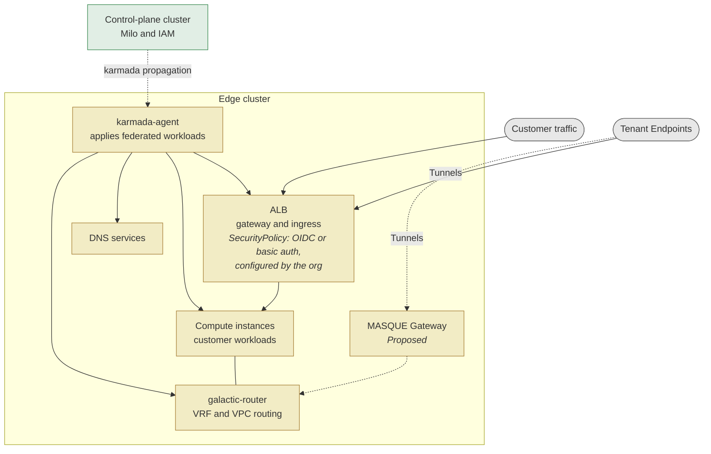

<!-- omit from toc -->
# IAM — Workload identity use cases

**This document is the use-case map.** It names the Workload Identity and federation scenarios, where 
each one stands, and which document answers it. The architecture is in the two
companion documents below, split so each half can be read and reviewed on its own.

**Companions**

| Document | Covers |
|---|---|
| [`IAM-AuthN-architecture.md`](IAM-AuthN-architecture.md) | How a caller becomes a known identity — the identity provider, both token paths, the `TokenReview`, and the constraint that blocks federating a foreign token |
| [`IAM-AuthZ-architecture.md`](IAM-AuthZ-architecture.md) | How a decision is made once the caller is known — the object model, the decision path, and the single field it reads |
| [`control-plane-workload-identity-federateIn-PRD.md`](control-plane-workload-identity-federateIn-PRD.md) | The W1 use case in full — problem, scenarios, requirements, and six design alternatives with trade-offs |
| [`dataplane-workload-identity-PRD.md`](dataplane-workload-identity-PRD.md) | W4, W5 and W7 — identity for workloads in the data plane, at the inbound and outbound seams. Published separately |

Further engineering records sit behind these — the evidence for the W1 design decisions, a data-plane
BYO-IdP analysis, and the original seven-problem assessment. They are working notes rather than proposals.
Whether any of them is published alongside this document is still to be decided.

**One diagram lives here** — the edge topology, because the
[W4](#w4--the-different-org-workload-to-org-workload-paths) paths depend on it.

<!-- omit from toc -->
## Contents

- [Summary](#summary)
- [The edge topology](#the-edge-topology)
- [The constraints that bound every use case](#the-constraints-that-bound-every-use-case)
- [Use cases](#use-cases)
  - [The seven use-case scenarios](#the-seven-use-case-scenarios)
  - [W4 — the different org-workload to org-workload paths](#w4--the-different-org-workload-to-org-workload-paths)
  - [W7 — the two agent sub-cases](#w7--the-two-agent-sub-cases)

---

## Summary

A caller's identity is a token from Datum's identity provider, and its subject becomes the single field that 
authorization keys on. Authentication and authorization are two independent out-of-process calls, neither of 
which the API server implements itself. A workload currently needs a long-lived Datum-issued key, because 
Zitadel will not accept a token from anyone else. The detail is in [`IAM-AuthN-architecture.md`](IAM-AuthN-architecture.md) and
[`IAM-AuthZ-architecture.md`](IAM-AuthZ-architecture.md).

**The seven identity scenarios**

| # | The problem | Where it stands | Design document |
|---|---|---|---|
| **W1** | An **external platform** calls the Milo API — a CI pipeline, a cloud function, a controller in a customer's own cluster. Federating-in | Design being brainstormed now. Today it needs a long-lived Datum key, and that is forced by zitadel rather than chosen | **[`control-plane-workload-identity-federateIn-PRD.md`](control-plane-workload-identity-federateIn-PRD.md)** |
| **W2** | A platform workload reaches a project control plane — Datum's own operators and controllers | Possession of a kubeconfig is the entire trust, and where one is not supplied a component falls back to whatever ambient credentials its pod holds | *PRD not yet written* |
| **W3** | Platform workloads authenticate to each other | Essentially unaddressed. Mutual TLS, where it exists, is CA-based rather than identity-based, so it cannot tell one workload from another | *PRD not yet written* |
| **W4** | Org workload to org workload, in the data plane | Four distinct paths, [below](#w4--the-different-org-workload-to-org-workload-paths). Two are fronted by the ALB (potentially accessed via Datum Tunnel) and can carry an org-configured policy; two go through Galactic VPC (gVPC) routing and have no enforcement point at all | [`dataplane-workload-identity-PRD.md`](dataplane-workload-identity-PRD.md) |
| **W5** | An org workload on Datum compute provisions for itself through the Milo API | Nothing today. Unlike W1, Datum controls both ends, so a projected token or attestation is available | [`dataplane-workload-identity-PRD.md`](dataplane-workload-identity-PRD.md) |
| **W6** | Datum authenticates outward to AWS, GCP or on-prem | Nothing built. Needs Datum to *be* an issuer — publish discovery and a key set, and mint assertions — which is a different capability from validating tokens inbound. Federating-out. | *PRD not yet written* |
| **W7** | An agent acts autonomously or for a person. **W7a** → the control-plane API; **W7b** → a data-plane resource ([below](#w7--the-two-agent-sub-cases)) | **W7a:** the agent presents the invoking user's own full-scope token — no distinct identity, no bound on what it may do. **W7b:** no Datum principal exists on that path at all | [`dataplane-workload-identity-PRD.md`](dataplane-workload-identity-PRD.md) |

**W1 — Federating-in Workload Identity.** Let an external workload authenticate with the short-lived token its own
platform already issues, so no Datum credential exists outside Datum; the problem, scenarios, requirements
and six design options are in
[`control-plane-workload-identity-federateIn-PRD.md`](control-plane-workload-identity-federateIn-PRD.md).

**Where W1 stands.** Six design options are on the table with their trade-offs, one eliminated by a live
test. No option has been chosen — the PRD frames the choice as two questions. A third decision is more
time-sensitive than either, and holds whichever option is taken: whether the principal identifier carries an
organization segment, which is free to decide now and a data migration later.

**The one thing to carry into the table.** Authentication hands authorization a flat
`{username, uid, groups, extra}` record and the decision keys entirely on `uid`. Every use case below is
bounded by that; both architecture documents state it in full.

**Two overlaps worth remembering when reading the table.** W5 and W7 are orthogonal questions about the same
call — one asks how a caller proves who it is, the other asks on whose authority it acts — so an agent on
Datum compute is both at once and solving either leaves the other open. W2 and W3 blur, because a Datum
service reaching the API server and two Datum services reaching each other are the same trust problem with
different endpoints.

---

## The edge topology

This is the one architecture view that lives here, because
the [`W4` paths](#w4--the-different-org-workload-to-org-workload-paths) depend on it.

> **The component set.** The components are
> as the team named them, with one exception: the **MASQUE Gateway** is a proposal in galactic's own
> repository rather than a deployed component, and is drawn dashed and marked so. Deployment configuration independently confirms edge overlays for `compute-system`,
> `galactic-system`, `dns-operator` and `datum-auth-dns`, and karmada propagation through
> `network-services-operator`. What runs *inside* the compute and networking boxes is **unconfirmed** — it was not
> verified for this document.
>
> **Edge authentication exists.** Datum's ALB supports OIDC and basic authentication through Envoy
> Gateway's `SecurityPolicy`, attached by `targetRefs` to an `HTTPRoute` and enforced at the edge. The org configures it with `datumctl`
> against their own provider — Google, Auth0, or a user list.
>
> The correct statement is therefore not "no IAM at the edge" but "edge authentication is org-owned and
> is not integrated with Datum's IAM." Different claim, different consequence: there *is* an enforcement
> point, it just has no relationship to `PolicyBinding`, OpenFGA, or any Datum principal.
>
> **One operational trap worth carrying.** A Secret referenced by a gateway policy must be labelled
> `networking.datumapis.com/gateway-sync: "true"` or it does not reach the edge — the policy syncs and the
> credential does not, which presents as HTTP 500.

## The constraints that bound every use case

Stated in full in the two companion documents; listed here only so the [use cases](#use-cases) can refer to them.

| # | Constraint | Where it is argued |
|---|---|---|
| **C1** | Authorization sees one field. The decision keys entirely on `uid`, and an empty `uid` is a hard deny. Any new principal shape has to live there | AuthZ |
| **C2** | RBAC is consulted first and short-circuits. Any test of a new identity's authorization must use a path RBAC has no route to | AuthZ |
| **C3** | Humans and machine accounts already collapse into one authorization type — it means "an identity token", not "a human" | AuthZ |
| **C4** | Datum operates a token endpoint but does not implement one. Anything Zitadel will not do needs either a change to Zitadel or a new Datum-built service in front of it. Neither is a configuration change | AuthN |
| **C5** | Revocation is not immediate, and there are two independent caches, not one — an authentication cache in front of the identity decision and an authorization cache in front of the access decision. They have different lifetimes, and a change to one does not bound the other. Production inherits the upstream defaults for both; a deployment that sets them explicitly gets different figures. Always say which cache a figure refers to, and which deployment it came from — the two architecture documents state each one separately | both |

---

## Use cases

**Where these come from.** "Workload identity" at Datum is not one problem but seven distinct trust
relationships, first enumerated in an earlier platform assessment and kept here under the same `W1`–`W7`
labels. They differ on two axes that decide which mechanisms are even available: **direction** — whether
Datum must *verify* a foreign token or *present* one — and **modifiability** — whether Datum controls both
ends of the conversation or only one. Conflating them is the most common error in this area, so the table
below keeps them apart.

**Terminology is not final.** The labels are retained for continuity with earlier work.
[W4](#w4--the-different-org-workload-to-org-workload-paths) shows where `W4` in particular no
longer fits Datum's shape; reframing them in Datum's own terms is a separate exercise.

### The seven use-case scenarios

| # | The problem | Notes |
|---|---|---|
| **W1** | External platform → Milo control plane. A customer CI/CD job, SaaS or cloud function calls the Milo API. Federating-in. | Limited by ZITADEL constraints. ZITADEL's RFC 7523 grant requires the token's issuer and subject to be the **same value**, and checks that *before* resolving the signing key. A CI platform's token names the platform in its issuer and the workload in its subject, so it can never satisfy that, and no amount of key registration changes it. The long-lived Datum key in use today is a consequence of that constraint, not a design preference. Its design is the **W1 PRD**, which carries the problem, scenarios, requirements and six design options |
| **W2** | Platform workload → project control plane. Datum's own operators and controllers reaching Milo or a project control plane | Unaddressed, and defects of this exact shape are already appearing. These components authenticate by *possessing a kubeconfig*, or by falling back to whatever ambient credentials their pod happens to carry — there is no workload identity to present. Individual instances are fixable, but the recurrence is the point: there is no identity for them to use, so every component invents its own arrangement |
| **W3** | Platform workload → platform workload. Datum services authenticating to each other | **Unaddressed.** Mutual TLS, where it exists, is CA-based rather than identity-based, so the channel cannot tell one workload from another. Closing this is what limits lateral movement inside the platform, and Datum controls both ends here and many of the building blocks are already in place, so good options are available — they simply have not yet been built |
| **W4** | Org workload → org workload, in the data plane. Four distinct scenarios, (a)–(d) — see [W4](#w4--the-different-org-workload-to-org-workload-paths) | An enforcement point exists, but it is the org's, not Datum's. The ALB supports OIDC and basic authentication through an Envoy Gateway `SecurityPolicy`, enforced at the edge and configured by the org against their own provider. It has no relationship to Datum's IAM — no policy binding, no Datum principal. Two structural limits shape anything built here: the edge gateway performs Full-NAT, so a backend never learns the real client address and identity policy must therefore be evaluated *at or before* the gateway; and only two of the four paths pass the ALB at all — the other two have no enforcement point today. BYO-IdP/BYO-Issuer (via WorkloadIdentityIssuer config) defined for W1 could be leverageable for W4 too, but requires additional design artifacts for distributed policy instantiation - abstractions proposed in [`dataplane-workload-identity-PRD.md`](dataplane-workload-identity-PRD.md) |
| **W5** | Org workload → Milo control plane. A customer workload running on Datum compute provisions for itself | Nothing today, but mechanically easier than W1 despite looking the same. W1 must accept an issuer Datum does not control; W5's caller runs on Datum's own compute, so both ends are modifiable and a short-lived, audience-scoped token issued by Datum's own substrate is available. Solving W1 produces most of the machinery W5 needs, so these should be sequenced together rather than designed independently |
| **W6** | Datum → external cloud. Datum automation authenticating outward to AWS, GCP or on-prem. Federating-out. | Not built, and it is the mirror image of W1 rather than a variant of it. W1 asks Datum to *verify* someone else's token; W6 asks Datum to *present* one and be verified by a foreign party. That needs Datum to **be** an issuer — publishing a discovery document and public key set, and minting assertions — which shares the name "federation" and almost none of the machinery. ZITADEL's documentation describes exactly this pattern for Google Cloud, with the cloud trusting ZITADEL as an external provider; that is vendor documentation and Datum has not exercised it |
| **W7** | Agent acting autonomously or on a person's behalf. Two sub-cases with entirely separate enforcement points — see [W7](#w7--the-two-agent-sub-cases). **W7a** an agent reaches the Datum control-plane API; **W7b** an agent reaches a **data-plane resource** through Datum — a registry, a peer sandbox, compute | The agent is the user, which is the worst of both worlds. It presents the invoking person's own full-scope token, so there is no distinct identity to attribute an action to *and* no bound on what it may do. A standard representation for "acting on behalf of" exists — an **actor claim** carried inside an exchanged token, naming the delegate separately from the subject — but nothing on the platform produces one today. Note also that Datum's MCP server is the natural place for this to live and has not yet been assessed yet. Similarly, there are many emerging standards (ID-JAG, AAuth, etc.) yet to gain widespread adoption - ideally these can be plugged in to the Datum architecture if/when deemed appropriate. Delegation chains across agents require additional consideration as well |

#### Where these overlap

The seven are not disjoint, and two of the overlaps change what "solving" one of them means.

`W5` and `W7` are orthogonal questions about the same call, not alternatives.

- `W5` asks how the caller proves who it is. Its caller runs on Datum compute, so both ends are
  modifiable and a projected ServiceAccount token is available.
- **`W7` asks on whose authority it acts** — itself, or a human who asked it to.

An agent running on Datum compute and calling the Milo API is both at once. If it acts autonomously, W5's
answer is sufficient and W7 adds nothing. If it acts *for* a user, both are needed: W5 gives it an identity,
W7 bounds the authority that identity carries. Solving either leaves the other open.

The sharp version: `datumctl ai` today has neither. It presents the invoking user's own full-scope token —
no distinct identity to attribute an action to, and no bound on what it may do. That is the worst corner of
both problems, and it is why an "agent identity" discussion that only picks one of the two will not close it.

**`W2` and `W3` blur for a different reason** — a Datum service reaching milo-apiserver and two Datum
services reaching each other are the same trust problem with different endpoints. Splitting them by endpoint
has not yet bought anything.

### W4 — the different org-workload to org-workload paths

`W4` is not one problem. It is a family, and the axis that separates them is *how the peer is reached* —
because that is what decides where a policy could be enforced at all.

| Path | Org workload runs | Reaches its peer via | Where enforcement could sit |
|---|---|---|---|
| **a** | Datum compute — unikraft, Kata | the **ALB**, fronting compute | the ALB's `SecurityPolicy` (exists today, org-owned) |
| **b** | partner-hosted compute on the internet | **Tunnels** terminating on the **ALB** | the ALB, same as (a) — but the peer is outside Datum's substrate |
| **c** | one partner-hosted location, talking to another | the gVPC fabric. Attaching to it needs a `ConnectorAttachment`, which the merged Connectors proposal marks **future state**; the tunnel form of that attachment is the **MASQUE Gateway**, proposed | Nothing today. No authentication component sits there |
| **d** | partner-hosted, reaching a resource inside the gVPC | the same as (c) — these two differ in what sits at the far end, not in how the peer attaches | the same as (c), and the peer is outside Datum's substrate |

**Some things this table makes visible.**

1. (a) and (b) have an enforcement point; (c) and (d) do not. Everything fronted by the ALB can carry a
   `SecurityPolicy`. Traffic that goes org-to-org through the gVPC fabric never passes the ALB, so
   there is nothing on that path today that could evaluate identity. The **MASQUE Gateway** is where one
   could sit, since it is the component proposed to terminate the attachment — but it would first have to
   authenticate the arriving peer, which its proposal lists as a responsibility and no shipped code does.
2. Datum's ownership differs across the four. Datum owns the substrate in (a) and the tunnel in (b). In
   (c) and (d) it would own both the attachment and the routing fabric — but the attachment is future
   state, so today it owns only the fabric the traffic crosses. That bounds what any future proposal can
   assume about attestation.
3. The org workload could be an Agent, a delegated agent, or an application (possibly even generated dynamically by an agent)
   - each of these scenarios might require customer/org control of the IAM technology and policy framework choice.

### W7 — the two agent sub-cases

`W7` splits the way `W4` does, and for the same reason — the enforcement points are entirely separate.

| | W7a — agent reaches the control-plane API | W7b — agent reaches a data-plane resource |
|---|---|---|
| Examples | `datumctl` in AI mode, an MCP client, a scheduled reconciler, a customer's own agent | Pulling from a registry, reaching a peer sandbox, reaching Datum Compute |
| Goes through | `milo-apiserver` | ALB, Datum Tunnels, gVPC |
| Authenticated by | the `TokenReview` webhook, against zitadel | at the ALB, an org-configured `SecurityPolicy`; a tunnel capability; in places, **nothing** |
| Authorized by | RBAC, then the policy decision point | org-configured `SecurityPolicy` can carry `authorization`. Past the ALB, VPC isolation only |
| Principal | a provider `uid` | at the ALB, whatever the org's own provider asserts — meaningful inside that project's policy and invisible to `PolicyBinding` and OpenFGA. On the tunnel and gVPC paths, none |
| What breaks today | The agent presents the invoking human's own full-scope token — no distinct identity, no bound | No **Datum** principal on any of these paths, so nothing ties the action to a Datum identity |

**Three consequences worth carrying.**

1. None of the control-plane machinery reaches W7b besides WorkloadIdentityIssuer. This path never
   touches the API server.
2. An agent will do both in one task — provision through the API, then pull an image and reach a peer.
   Today those are two unrelated identities with two unrelated authorizations, and no way to say "this is
   the same actor doing one thing." That is the strongest argument for a single principal-and-actor model
   spanning both, even though enforcement stays separate. This also requires additional consideration in
   delegation-chain scenarios.
3. Agent-ness is not the axis. Ephemerality and acting-on-behalf-of are properties of *any* principal —
   humans have both too. Model lifetime and authority relationship as attributes, rather than building an
   agent-shaped silo. `W7` is retained as a label for the scenarios, not as a separate identity type.
