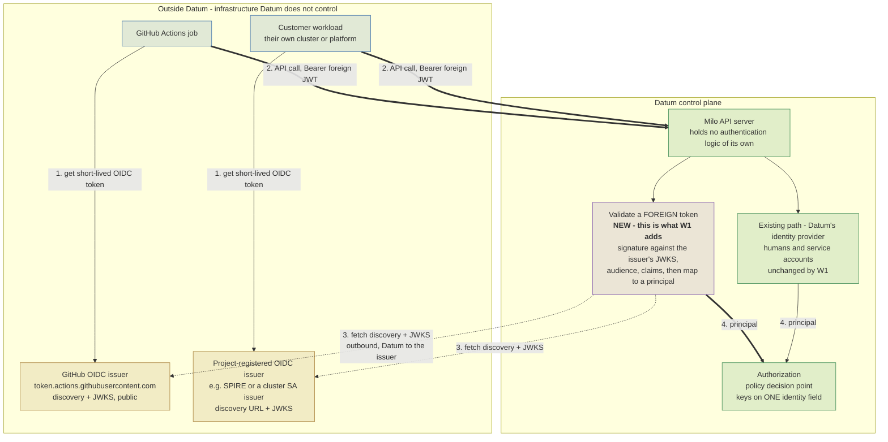
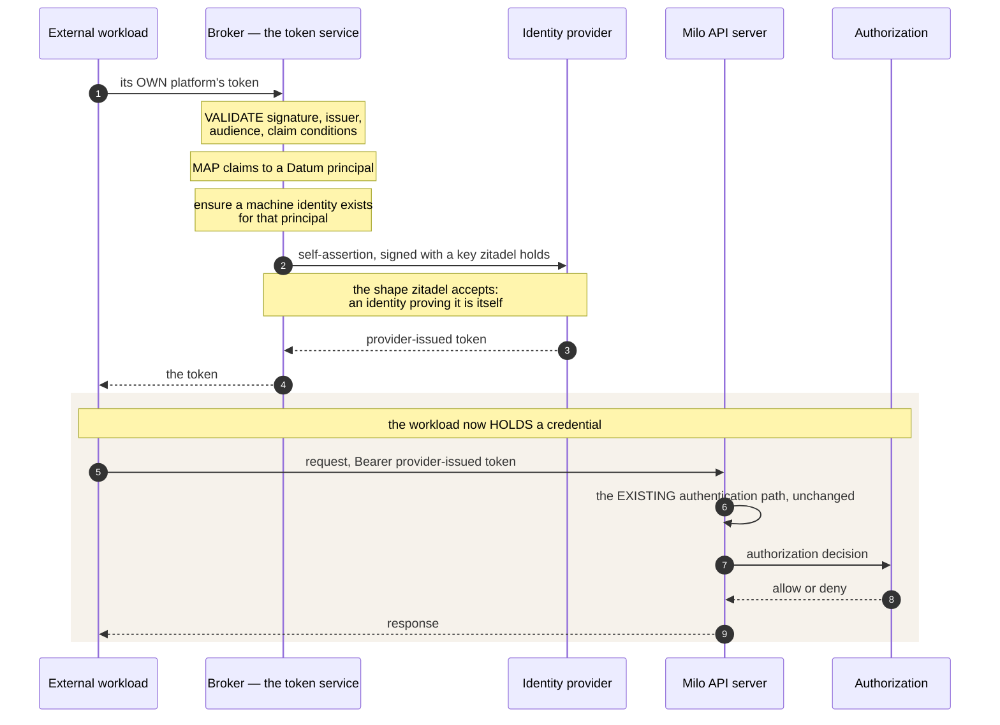
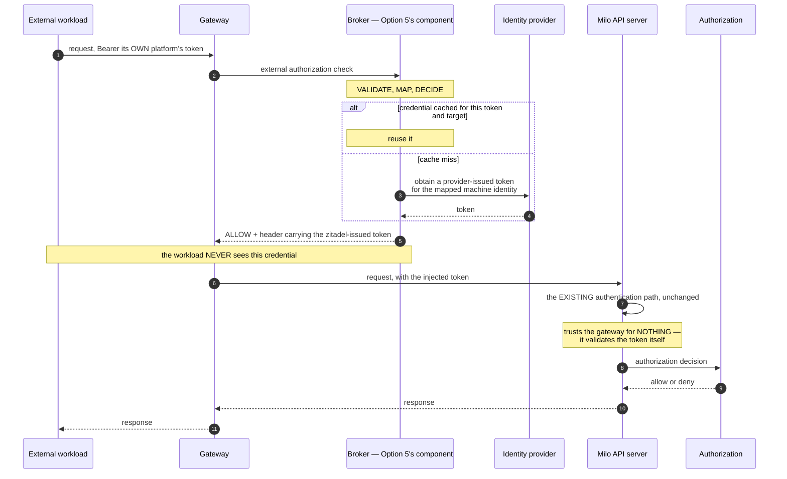

<!-- omit from toc -->
# Control-plane workload identity — federate-in (W1)

<!-- omit from toc -->
## Contents

- [Summary](#summary)
- [Motivation](#motivation)
  - [Goals](#goals)
  - [Non-Goals](#non-goals)
- [Proposal](#proposal)
  - [User Stories](#user-stories)
  - [Notes, Constraints and Caveats](#notes-constraints-and-caveats)
  - [How a federated call would flow](#how-a-federated-call-would-flow)
  - [Requirements](#requirements)
- [Design Details](#design-details)
  - [Option 1 — the existing proposal: three resources, trust separated from matching](#option-1--the-existing-proposal-three-resources-trust-separated-from-matching)
  - [Option 2 — the same proposal as Option 1, with the decisions taken](#option-2--the-same-proposal-as-option-1-with-the-decisions-taken)
  - [Option 3 — token exchange at zitadel — ELIMINATED BY TEST](#option-3--token-exchange-at-zitadel--eliminated-by-test)
  - [Option 4 — bind the federated identity to an existing ServiceAccount](#option-4--bind-the-federated-identity-to-an-existing-serviceaccount)
  - [Option 5 — a Datum-side security token service](#option-5--a-datum-side-security-token-service)
  - [Option 6 — exchange the token at the gateway](#option-6--exchange-the-token-at-the-gateway)
  - [Rule mapping within Options 4, 5 and 6](#rule-mapping-within-options-4-5-and-6)

---

## Summary

**Use case.** Workloads hosted outside the Datum platform — a CI job, a cloud function, a controller in
their own Kubernetes cluster — need to call the Milo API. Today that requires a long-lived ServiceAccount private key
pasted into their system as a secret: no expiry by default, no rotate-in-place, and one key usually shared
across many pipelines so nothing is attributable. Every platform these workloads run on already issues them a
short-lived, signed identity token. Workload Identity Federation is accepting those tokens directly.

**The constraint that shapes every option.** Zitadel cannot be configured to accept an
external platform's token. Both of its non-interactive paths were tested against a running deployment and
both refuse, for independent reasons — one requires the token's issuer and subject to be identical with a key
zitadel already holds; the other requires the issuer to be the zitadel instance itself. So validating a
foreign token is work Datum must do somewhere it controls.

**What separates the options.** The options share almost everything — the same issuer objects, the
same rules, the same claim matching. They differ in one thing: what a matched token turns into. If it
becomes a *new* kind of identity named after the rule, that identity has to be admitted into the
policy-binding schema, which is a published surface other components depend on, and the authorization
service has to be taught to map it. If it resolves to an identity that *already exists* — an ordinary
service account — neither change arises. 

**The six options.**

| | Option | In one line |
|---|---|---|
| **1** | The existing Enhancement proposal | Three resources separating issuer trust from match conditions. The right central design; leaves several questions unanswered and one body of work unmentioned |
| **2** | The proposal, with the decisions taken | Option 1 with every open question in [what needs to be decided with Option 1](#what-needs-to-be-decided-with-option-1) answered. Delivers the customer self-service that scenarios S3–S5 require. Still carries the published-API change |
| **3** | Token exchange at zitadel | Eliminated by test. The provider requires the subject token to be its own. A variant — fix zitadel and contribute upstream — is unscoped and slow ([below](#consideration-fix-zitadel-and-contribute-it-upstream)) |
| **4** | Bind to an existing ServiceAccount | Deletes the published-API change entirely and is the fastest route to a working call. Gives up per-rule principal identity, and needs a guard so the account cannot also be issued a long-lived key |
| **5** | A Datum-side security token service | Keeps the API's trust at one issuer. But Datum then holds the signing keys — the long-lived secret is not removed, it moves from the customer to Datum and is concentrated |
| **6** | Exchange the token at the gateway | Option 5's broker, delivered differently — the gateway calls it and injects the result, so the workload never holds the credential. Reuses infrastructure already deployed, and its implementation also serves the data plane, where the API server does not exist |

No option is recommended here. The choice depends on two questions.

| | The question | What it decides |
|---|---|---|
| **1** | Should validation sit in the authentication path, or in front of it? | In the path → Options 2 or 4. In front → Options 5 and 6, which keep the API server's trust surface at one issuer and keep federation faults off the human login path. These two are one build with two delivery forms, not a choice ([Option 6](#option-6--exchange-the-token-at-the-gateway)) |
| **2** | Does the solution benefit data-plane access too? | Yes → Option 6, whose broker and gateway hook also serve an agent or partner workload reaching a registry or a peer, where the Milo API server does not exist. No → the question does not bear on the choice, and Options 2, 4 and 5 are unaffected by it |

**Two things are true whichever is chosen.**

The published-API change is deferred, never avoided, unless per-rule principal identity is given up
permanently. Options 4, 5 and 6 resolve to an existing identity today; if per-rule identity is wanted
later, the schema change returns.

**An important decision relates to the principal identifier:** whether it carries an organization segment —
free to decide now, a data migration once bindings exist
([the Option 1 decisions](#what-needs-to-be-decided-with-option-1), row 3).

---

## Motivation

Today the only way for an external workload to call the Milo API is a **ServiceAccountKey**: create it,
download the private key, paste it into the external system as a secret.

Two properties of that credential cause everything downstream — it is long-lived, and it lives outside
Datum. It does not expire by default, there is no rotate-in-place, and one key usually serves many
pipelines, so no action is attributable to a specific repository, branch or run. None of this is a defect
in how the key is implemented. It is inherent to *"the customer holds a long-lived Milo secret"*, and the
only way to remove the risk is to remove the secret.

### Goals

1. An external workload authenticates to the Milo API with a token its own platform already issues, so
   **no Datum-issued credential exists outside Datum** — nothing to rotate, leak, or revoke.
2. Access is scoped by **token attributes** — this repository, this branch, this environment — and the
   resulting identity is granted access through the existing authorization model rather than a parallel one.
3. The result is operable: **attributable** in audit, **revocable** within a stated bound, and
   **fail-closed** on misconfiguration.

[Requirements](#requirements) states these as eleven testable conditions. This section is the intent
behind them, not a second copy of the list.

### Non-Goals

- Replacing human authentication. 
- Internal service-to-service identity. 
- Non-OIDC protocols.
- Datum issuing tokens to external systems. The reverse direction — a Datum identity authenticating *to*
  AWS or GCP — shares the name "federation" and almost none of the machinery. Separate effort.

## Proposal

### User Stories

These are the concrete shapes the use case takes. They differ in who owns the issuer, which decides how the
trust is configured.

| # | Scenario | Issuer | Who registers the trust |
|---|---|---|---|
| **S1** | A customer's GitHub Actions workflow deploys resources to their project | GitHub's OIDC issuer, public and shared by all GitHub users | Datum, once, centrally |
| **S2** | A cloud function or serverless job (GCP, AWS Lambda, Azure) calls the Milo API | That cloud's public OIDC issuer | Datum, once, centrally |
| **S3** | A controller in the customer's own Kubernetes cluster provisions Datum resources | The customer's cluster service-account issuer, or SPIRE — reachable at a discovery URL the customer supplies | The customer, per project |
| **S4** | A partner or SaaS platform integrates with Datum on a shared customer's behalf | The partner's own issuer | The customer, per project |
| **S5** | A **self-hosted IdP** (Okta, Keycloak, an internal issuer) fronts a customer's automation | The customer's IdP | The customer, per project |

### Notes, Constraints and Caveats

The cheapest imaginable answer is: *"let Zitadel accept the GitHub token, and change nothing else."* 
That is not available, and the reason is structural rather than a configuration oversight.

Zitadel accepts a signed token as proof of identity only when the token's issuer and its
subject are the same value, and only when it already holds the signing key for that identity. This is
the self-assertion shape: an identity zitadel knows, proving it is itself.

A CI platform's token cannot satisfy that. A GitHub Actions token's issuer names GitHub
(`https://token.actions.githubusercontent.com`) and its subject names the workload
(`repo:acme/infra:ref:refs/heads/main`). They are necessarily different strings. The same is true of every
platform whose token identifies *what is running* — which is the entire point of such a token.

Both of zitadel's non-interactive paths were tested against a running deployment; the probe matrix is in
[Option 3](#option-3--token-exchange-at-zitadel--eliminated-by-test). Registering a customer's key does not
help, because the claim check happens *before* the signing key is looked up at all.

Two consequences follow, and they frame every option in [Design Details](#design-details).

1. The long-lived `ServiceAccountKey` is structurally forced by the current design. It is not a lazy
   default. The only credential zitadel accepts non-interactively is a key it issued, held by the workload.
2. Validating a foreign token is work that needs to occur, either inside the control plane, or in a 
   service in front of zitadel.

---

### How a federated call would flow



#### What each step requires

| Step | What happens | What it demands of Datum |
|---|---|---|
| **1** | The workload asks its own platform for a token, naming Datum as the audience | Nothing. This already works everywhere, with no Datum involvement |
| **2** | The workload calls the Milo API with that token as a bearer credential | The API must accept a token it did not issue, without breaking the path humans and service accounts already use |
| **3** | Datum fetches the issuer's discovery document and signing keys, and caches them | Outbound network access from the control plane to arbitrary customer-supplied URLs. This step carries the important infrastructure and security questions — reachability, caching, rotation, and protection against being pointed at an internal address |
| **4** | The validated token becomes a principal, and authorization decides | The principal must fit the one identity field the policy decision point reads |

#### Two properties of the existing platform that bound any design

Authentication hands authorization a flat record, not an object. However a caller is authenticated, the
result is a small fixed structure — a username, a single identity field, groups, and a few string extras —
and the policy decision point keys on that one identity field. A federated principal has nowhere else to
live. Whatever a design calls its principal, it has to fit there.

The Milo API server contains no authentication or authorization logic of its own. Both decisions are
made outside it, over standard interfaces — it is a Kubernetes-style API server that delegates authentication
and authorization to separate services. This is why "the API server validates the token" is not a complete
statement of where code runs.

---

### Requirements

A design is measured against these. They are ordered; the first four are the reason the feature exists.

| # | Requirement |
|---|---|
| **R1** | An external workload authenticates with a token issued by its own platform, with no Datum credential anywhere in the external system |
| **R2** | Trust is scoped: a customer grants access to specific token attributes (repository, branch, environment), not to an entire platform |
| **R3** | A customer can register their own issuer for their own project, self-service |
| **R4** | The federated identity is a subject in the existing authorization model, granted access the same way as any other identity |
| **R5** | Actions are **attributable** to the specific workload in audit |
| **R6** | Access can be **revoked**, with a stated and bounded worst-case latency |
| **R7** | The feature is **fail-closed**: a misconfiguration denies rather than admits, and an issuer can be disabled immediately |
| **R8** | The existing authentication path is unaffected — humans and service accounts keep working, provably |
| **R9** | The per-request cost is bounded and known, since validation runs on every API call |
| **R10** | A customer-supplied issuer URL cannot be used to make the control plane reach **internal addresses** — no server-side request forgery |
| **R11** | Where a rule's identity is carried in a token claim or an identity extra, its absence must DENY. A failure there would grant more than intended rather than less, and would do so silently |

---

## Design Details

### Option 1 — the existing proposal: three resources, trust separated from matching

This is the design already written. It is summarised here on its own terms; the assessment
follows in [what needs to be decided with Option 1](#what-needs-to-be-decided-with-option-1).

#### The model

Three new API resources, splitting *trust in an issuer* from *the conditions under which a token from it is
accepted*.

| Resource | Scope | Purpose |
|---|---|---|
| **`TrustedIssuer`** | Platform | Registers an OIDC issuer as safe to federate against, cluster-wide. Managed by Milo administrators. Ships pre-registered for GitHub Actions, GCP, AWS and Azure. Its issuer URI is unique across all such objects |
| **`WorkloadIdentityIssuer`** | Project | Either enables a `TrustedIssuer` inside a project, **or** registers a project-owned issuer directly with its own URI and key source. Also the emergency kill switch: disabling it rejects every rule beneath it |
| **`WorkloadIdentityRule`** | Project | Matches tokens from one issuer on audience and claims, requires a CEL condition, and defines the resulting principal |

Key material can come from **discovery** (fetch it from the issuer), an **explicit URL**, or be supplied
**inline** as a document.

#### How a customer uses it

Datum registers `TrustedIssuer/github-actions` once. A project owner then creates a
`WorkloadIdentityIssuer` referencing it, and a `WorkloadIdentityRule` such as:

```yaml
spec:
  issuerRef: { name: github-actions }
  allowedAudiences: ["https://api.miloapis.com"]
  attributeMapping:
    attribute.repository: "assertion.repository"
    attribute.ref:        "assertion.ref"
  attributeCondition: |
    attribute.repository == "acme-corp/infrastructure" &&
    attribute.ref == "refs/heads/main"
```

The rule resolves to a principal identifier:

```
principal://iam.miloapis.com/projects/{project}/issuers/{issuer}/rules/{rule}
```

which is then granted access by an ordinary policy binding — preferably by referencing the rule by name,
with the raw URI available as an alternate form.

#### At request time

Fetch the issuer's keys (cached for an hour), find the rules for the token's issuer, validate signature,
audience and claims, extract the mapped attributes, evaluate the CEL condition, construct the principal, and
check authorization with it.

#### What this design gets right

- Separating issuer trust from match conditions is the correct central decision. One `TrustedIssuer`
  backs every project's rules for a platform, so keys are fetched, verified and rotated once, centrally.
  Two access levels become two rules, not two copies of the issuer configuration.
- **Requiring a condition on every rule** makes the dangerous default — "accept anything from GitHub" —
  unreachable by accident.
- **Project-owned custom issuers from day one**, so scenarios S3–S5 are in scope rather than deferred.
- **Verification affordances are designed in**: a dry-run that parses an issuer's keys without creating
  anything, and a time-boxed live test that names the *specific* failure. And an authentication-attempt
  record separate from the activity timeline, so an owner can tell "never tried" from "tried and rejected."

#### Questions unanswered in the Option 1 proposal

The resource model is sound; what stops it being buildable as written is that it leaves several questions
unanswered and omits one body of work entirely. Option 2 is this design with those closed — which is why 
the two sit next to each other rather than against each other.

**The omission is the significant one.** A federated principal has to become a policy-binding subject, and
policy-binding subjects are restricted at admission to three kinds: user, group and service account. Both
forms this proposal uses are rejected before the authorization service is ever consulted. So adopting it
also commits to this, in components it does not mention:

| # | Change | Where | Sensitivity |
|---|---|---|---|
| 1 | Admit a new subject kind | The published API schema that validates policy-binding subjects | **High** — a published surface with other consumers |
| 2 | Map that kind to an authorization tuple | The subject-to-tuple mapping in the authorization service | Moderate — an added case in an existing switch |
| 3 | Exempt the kind from local-object resolution | The same service's admission-time checks | Low — two precedents already exist |

Nothing federates end to end until all three land, so they gate the rest of the work rather than
following it. This is the cost Options 4, 5 and 6 avoid, and it is the main reason to look at them.

### Option 2 — the same proposal as Option 1, with the decisions taken

**What it is.** Option 1 with every row of [the Option 1 decisions](#what-needs-to-be-decided-with-option-1)
answered. Same three resources, same runtime, same principal model — the open questions closed rather
than left to whoever implements it.

So the difference is not design, it is decidability: validation runs in the existing authentication
service; the principal identifier gains an organization segment and no delegation segment; the identifier is
carried in the field authorization reads, with every consumer of that field audited first; revocation gets a
stated 60-second target met by configuring the cache; inline key material is allowed, marked unverified and
excluded from cross-project sharing; a latency budget is met by caching the validated-token-to-principal
result; and the authorization-side work is in scope and sequenced first.

**What amendment does not fix.** The published-schema change survives intact — a new subject kind is
still a change to a published API plus a separate mapping change, in components this proposal does not own.

---

### Option 3 — token exchange at zitadel — ELIMINATED BY TEST

> [!IMPORTANT]
>
> Ruled out, tested against a running deployment on 2026-09-18 with a passing control. Zitadel's
> token-exchange endpoint requires the subject token to have been issued by zitadel itself. A token from
> GitHub, GCP, or any other external issuer is rejected on the issuer check. Rules-out this option.

**The idea.** The workload presents its foreign token to zitadel's RFC 8693 token-exchange endpoint,
receives a normal provider-issued token, and calls the Milo API over the path that already exists. It
would have been the cheapest option by a wide margin — no change to the API server, no new subject kind,
no second authentication path, one trust anchor. It was an untested hypothesis on zitadel's own feature
request for this capability, issue 7173 in the `zitadel/zitadel` repository.

**How it was tested.** Every failure on this endpoint returns a byte-identical client response, so each
probe was paired with a control, run individually, and read from zitadel's own log.

| # | Subject token | Result |
|---|---|---|
| **Control** | a genuine zitadel-issued access token | **SUCCESS** — a token was exchanged and returned. The endpoint, the application and the grant all work |
| **T1** | a foreign token from an external issuer | **REJECTED** — `issuer does not match: Expected: <zitadel's issuer>, got: https://kubernetes.default.svc.cluster.local` |
| **T2** | the same foreign token, declared as a bare JWT rather than an access token | **REJECTED** — a key lookup that finds nothing |
| **T3** | a token whose issuer and subject are identical, both set to GitHub's issuer URL | **REJECTED** — the same issuer-mismatch error |
| **T4** | the foreign token plus a valid actor token, the documented impersonation shape | **REJECTED** — the same issuer-mismatch error |

The control rules out the three ways this could have been a false negative — a misconfigured application, a
missing grant, a broken endpoint. T3 rules out the obvious workaround: matching the token's issuer and
subject does not help, because the check is not about their relationship to each other but about whether the
issuer is the zitadel instance. T4 rules out the documented impersonation flow.

#### Consideration: fix zitadel and contribute it upstream

Zitadel is open source under a permissive licence and the rule that blocks this is a small, well-located
check, so contributing the capability upstream is feasible. It is not a near-term option: the request
has sat open since January 2024, gated by the maintainers on demonstrated community demand, and Datum
would not control the timeline.

**And one limit caps its value even if it succeeded.** It solves the authentication half only — a federated
principal still has to become a policy-binding subject, so the authorization-side work remains either way.

---

### Option 4 — bind the federated identity to an existing ServiceAccount

**What it is.** A matching rule maps a validated external token onto an **existing ServiceAccount**, rather
than producing a new kind of principal. The authentication layer returns that account's identity; everything
downstream is untouched. Access is granted by binding a role to the ServiceAccount, exactly as today.

**Why it was ruled out before.** The Enhancement proposal considered this — as the pattern where a federation
rule targets a service account, and rejected it on two grounds: it reintroduces an object per access
level, and it *"gains nothing, since both a service account and a principal URI are merely subjects a
binding references."*

**Why it is back on the table.** The second reason rests on a premise now known to be false. A new
subject kind is not merely another string in a binding: it requires admitting the kind in a published API
schema, adding a case to a separate subject-to-tuple mapping, and exempting it from local-object
resolution, i.e., work in components the proposal does not own, on a published surface with other consumers.
Measured against that work, the objection understates the cost by a wide margin.
**This option deletes that work outright**:
`ServiceAccount` is already a legal subject kind and already maps to an authorization tuple.

The first reason still stands, but it is smaller than it looks: Option 1 already requires one rule per
access level, so the multiplicity is not new — it changes shape from *N rules* to *N rules and N
accounts*.

Other shipping implementations of similar capability resolve the same way. Four independent implementations
let an external workload authenticate with its own platform's token. All four resolve a matched token to
a principal object that already existed. None invents a new per-rule principal kind.

| Implementation | A matched token becomes | Note |
|---|---|---|
| **Anthropic** workload identity federation | a pre-existing **service account** | Generally available. Its issuer model offers `discovery`, `explicit_url` or `inline` key sets — the same three modes this proposal specifies |
| **GCP** Workload Identity Federation | exchange at a token service, then impersonate a pre-existing **service account** | Two steps, which makes the split visible: the durable identity is provisioned separately and ahead of time |
| **AWS** `AssumeRoleWithWebIdentity` | a pre-existing **role** | The role's trust policy matches on token claims |
| **AWS IAM Roles Anywhere** | a pre-existing **role** | Certificate-based rather than OIDC; the same resolution |

**The first row carries both halves of the evidence at once.** Its *issuer* model matches this proposal
almost exactly, which is real external validation of the structure — while its *resolution* does not.

**Two things this does not mean.** It does not make Options 1 and 2 wrong — per-rule attribution is a real
requirement and these products may not weight it the same. And they may never have faced the choice: their
permission models are already account-based, so resolving to an account may have been the path of least
resistance rather than a decision.

**What it does mean is worth weighing:** the expensive half of Options 1 and 2 — a new subject kind, and
the published-schema change that comes with it — is the half no shipped implementation found necessary.

**Trade-offs.**

| | |
|---|---|
| **Gains** | No published-schema change. No authorization-service change. No new OpenFGA type. Policy, tooling, and the console all keep working unmodified. The shortest path to a working federated call |
| **Costs** | An object per access level, not just a rule. Audit shows the service account rather than the rule that matched, unless the rule name is carried alongside the identity |
| **Hazard to design against** | A ServiceAccount can also have long-lived keys issued to it. A federated-only account must be prevented from receiving one, or the exact credential this feature exists to remove walks back in through the side door. This needs an explicit mechanism, not a convention |
| **Fit with the requirements** | Meets R1–R4 and R7. R6 is unchanged from Option 1. It gives up the proposal's per-rule principal identity, and **R5 with it** — audit names the account, not the rule that matched |

---

### Option 5 — a Datum-side security token service

**What it is.** This STS sits in front of zitadel, as a separate deployment. The workload presents its 
foreign token; the service validates it — issuer, signature against the issuer's key set, audience, 
claim conditions — and then obtains a normal provider-issued token for a corresponding machine identity.
The workload calls the Milo API with that token, over the path that exists today.

Why it works when asking zitadel directly does not. The service authenticates as a machine identity
zitadel already knows, with a key zitadel already holds — [the self-assertion shape](#notes-constraints-and-caveats)
that provider accepts. The foreign token never reaches zitadel at all; it is validated entirely by the STS.

**How it flows.**



> **The two things to read off this.** The workload receives and holds a credential — so ending access
> means revoking something outstanding, and lifetime becomes the primary control. And the API server is
> untouched: it sees an ordinary provider-issued token on the path it already uses.

#### Trade-offs, benefits and gaps

**Benefits.**

| | |
|---|---|
| **One trust anchor for the API server** | The Datum API keeps exactly one authentication path and one issuer. Neither the where-does-validation-run question nor the principal-at-the-boundary question arises — there is no second authenticator and no new principal shape |
| **No published-API change** | The resulting caller is an ordinary machine identity, so the published-schema change does not arise either |
| **Validation logic lives in one owned place** | Issuer registry, key-set fetching, claim conditions and mapping are all in a service Datum writes and versions, with no upstream dependency |
| **Blast radius is contained** | A fault in federation cannot deny human logins, because the service is not on the human authentication path — the single largest risk in Option 2 |
| **Decoupling from the identity provider** | Removes the hard linkage to zitadel, so another provider could be adopted later |
| **Reusable beyond this use case** | The same component, configured differently, serves edge and data-plane scenarios |

**Costs.**

| | |
|---|---|
| **It holds long-lived signing keys** | The service must hold credentials for the machine identities it mints tokens for. The long-lived secret is not eliminated — it moves from the customer to Datum. A compromise of this service is a compromise of every federated identity at once, and similar to Zitadel being compromised. |
| **An identity object per principal** | Every federated principal needs a corresponding machine identity, created and reaped on some lifecycle. A short-lived CI job becomes a durable object |
| **A new component on the workload authN path** | A new service, with its own availability, scaling and on-call burden, in front of every federated request |
| **Two round trips** | The workload exchanges, then calls. Latency and a second failure mode |

Gaps that need answering before this could be chosen.

1. **Attribution is one indirection removed.** The provider's audit sees the service acting, not the original
   workload. The link back to a specific CI run exists only in a claim the service puts there — it is not in
   the trust chain.
2. **Key custody has no design yet.** Where the signing keys live, how they rotate, and what prevents the
   service from minting a token for an identity it was not asked about.
3. **Lifecycle of the machine identities** is to be determined: created on first use, pre-provisioned, or reaped
   on rule deletion.
4. It does not remove the need for customer-facing configuration. Issuers and rules still have to be
   expressed as API resources somewhere, so the resource-model questions of Option 1 return in a different
   place.

**Choose this if** keeping the Milo API's trust surface at exactly one issuer is worth accepting
credential custody — a judgement that should be made deliberately rather than by default.

---

### Option 6 — exchange the token at the gateway

**What it is.** The gateway calls a broker during request handling. The broker validates the workload's own
token, maps it to a principal, decides, and obtains a provider-issued token — which the gateway then
**injects** into the upstream request. The API server authenticates that token by the path it already uses.

> **This option requires Option 5's token service.** It leverages that component rather than replacing
> it, and is not an alternative to it.
>
> The gateway's external-authorization hook is configuration, not code — it calls out to a service. That
> service must validate, map, decide and mint, which is exactly Option 5's component.
>
> So Options 5 and 6 are one build decision and one delivery decision. The same broker serves both; they
> differ only in who calls it and who ends up holding the credential:
>
> | | Who calls the broker | Who holds the credential |
> |---|---|---|
> | **Option 5** | the workload, directly | **the workload** |
> | **Option 6** | the gateway, on the workload's behalf | nobody outside the gateway |
>
> **One implementation can expose both** — an external-authorization listener and a token endpoint over one
> core, one cache and one set of trust configuration. Neither delivery form covers every caller, so the
> realistic answer is both rather than a choice.
>
> A benefit of this approach vs Option 5 is that the new token is not issued to the workload, and remains
> at the gateway facilitating greater control, including on expiry/revocation. It also can be leveraged for
> other Edge or Dataplane use cases.

**The mechanism is already deployed.** The production gateway can call an external service during request
handling and add headers it returns to the upstream request; that policy resource is already distributed to
edge clusters, and native token validation in the same resource is already used elsewhere in production —
in Datum-operated configurations, not in the customer-facing self-service surface, which today exposes only
the browser-based flow.

One constraint decides the broker's front door. The field that declares which
authorization-response headers are added to the request exists only on the HTTP form of the external
authorization block; the gRPC form takes a backend reference and offers no header control at all. Since
injecting the exchanged token is exactly that field, the broker must expose an HTTP external-authorization
endpoint. It may speak anything it likes elsewhere.

#### Why this option reaches further than the others

The same broker and the same gateway hook serve the data plane, where the API server does not exist at
all — an agent or partner workload reaching a registry, a peer workload, or a third-party service. There
the gateway is the *only* enforcement point, there is no downstream authorization to fall back on, and
credential injection means the workload never holds the target's credential.

**No other option here does that.** Options 1, 2 and 4 are control-plane mechanisms by construction. This
is the only one whose implementation is reusable for the separate dataplane workload identity use cases,
configured differently per route.

**Two boundaries, so this is not over-read.** It covers only traffic that traverses an HTTP gateway —
peer-to-peer paths through the private-network fabric have none. And a caller needing a credential *in its
own hands* such as in the federate-out use case must use Option 5's delivery form, because this one injects and never returns.

**How it flows.**



> **The three things to read off this.** The workload **never holds** the credential — so ending access is
> declining to mint the next one, and nothing is outstanding to revoke. The API server trusts the gateway
> for nothing: a caller who bypasses the gateway is left holding a foreign token the API server rejects.
> And the cache is on the critical path — the broker is called on every request, so minting per request
> is not recommended.

#### Trade-offs

| | |
|---|---|
| **Gains** | No second authentication path in the API server. No published-API change — the caller is an ordinary machine identity. The workload never holds a Datum credential. Reuses infrastructure already deployed, and the implementation is reusable beyond the control plane |
| **Costs** | Every gateway location needs the broker reachable, and the broker holds minting credentials. |
| **The mitigation decides how far it scales** | What the broker mints determines what it must hold. Minting something **Datum signs** needs only a signing key, scopeable per deployment and revocable in one place. Minting a credential the target issues needs that target's administrative credential wherever minting happens. The first is deployable across many locations; the second is not |
| **Coverage** | Only callers that traverse the gateway. Anything reaching the API server directly is unaffected — safe, but not universal |
| An advantage over handing the credential to the caller | Nothing is ever in flight. A restart, a rollout or a change in which gateway serves a caller cannot strand a live credential with that caller — so revocation never has to chase something already issued |
| **Four separate lines of analysis converge here** | **Reaping** (completion of work is not observable), **edge storage** (a gateway-local broker can hold no durable state), **revocation** (no cache-invalidation channel, so lifetime *is* the latency) and **topology** (restarts are only free where nothing durable was created) all favour the same thing: mint something Datum signs, keep it short-lived, create no durable object in the target |

#### Two things not to lose during implementation

Simplification worth taking deliberately: use the gateway as a transport hook and nothing more. If the
broker validates the token and evaluates Datum's limits itself — rather than delegating those to the
gateway's own token-validation and policy blocks — then three configuration hazards disappear at once:
the gateway's internal filter ordering stops mattering, the number of issuers it can be configured with
stops bounding how many a customer may register, and a known trap around claim names containing dots never
arises. The cost is
that every request calls the broker, with no cheap gateway-side refusal. The broker must validate anyway
for the callers that do not traverse a gateway, so this costs no extra code.

- Caching is part of the design, not a tuning step. The broker is called on every request, so minting
  per request is not recommended. An in-memory cache keyed by the validated token and the target, bounded by
  the shorter of the credential's lifetime and the token's remaining validity, is required — key it by
  principal alone and a credential outlives the token that authorised it. The broker must fail closed, so
  its availability becomes the route's availability.
  Cache the minted credential, never the assertion used to obtain it. Where the target is a third party,
  an assertion carrying a `jti` may be accepted only once, so a replayed one fails; and at least one such
  target caps the credential's life at the shorter of its own rule lifetime and twice the presented token's
  remaining validity, which the cache bound has to respect. This is a correctness constraint, not a tuning
  choice.
- Restarts and replicas are free, provided no name is remembered. A broker that loses its cache
  re-mints. The hazard is creating a durable identity in a target: derive its name from the principal
  rather than recording it, so create-if-absent is idempotent across a restart or a second instance.
  Datum already uses this pattern elsewhere. And the minted credential's audience must name **the target**,
  never the gateway that minted it.

---

### Rule mapping within Options 4, 5 and 6

Options 4, 5 and 6 all resolve a matched token to an identity that already exists, which is what avoids
the published-API change. The question this raises: if several rules resolve to the same identity, what is
lost, and how much does recovering it cost?

#### What per-rule identity actually buys

These are three different requirements with very different costs, and they are easy to conflate.

| Purpose | What it needs | Cost |
|---|---|---|
| **Audit** — *which rule admitted this request?* | A record the broker writes, linking the rule, the identity it resolved to, and the request. The broker is the one place both ends exist at once | No token change and no authorization change. Much the cheapest |
| **Revocation granularity** — *disable one rule without disabling the others* | Nothing extra. The broker sees the rule at mint time and simply stops minting for it | Free under every option here |
| **Authorization** — *different rules carry different permissions* | The rule's identity must reach the authorization decision | The only expensive one |

> Options 1 and 2 buy all three at once. If only the first two are needed, most of their extra cost buys
> nothing. Establish which is required before choosing.

#### If authorization is required — three ways to carry it

| | How | Gains | Costs |
|---|---|---|---|
| **A — a custom claim** | The broker embeds the rule identity as a claim; the authentication service parses it into the identity record; the decision point reads it | Exact fidelity — the claim can carry Datum's own permission strings, so nothing is translated | Two changes, both in components Datum owns: the introspection parser and the decision point. R11 applies — the claim's absence must deny |
| **B — scopes** | The same, carried as a standard OAuth scope | Standard, and zitadel enforces that scope may only be narrowed — an attenuation bound that holds independently of Datum's code. The natural vocabulary where no Datum authorization model exists, which is every data-plane path | Same parse-site change. Needs a **translation layer** from scope to Datum's permission strings, which must be maintained as resources are added. The provider's guarantee is worth nothing unless each identity's own scope set is already narrow |
| **C — one identity per rule** | A controller creates and owns a service account per rule, with the rule as its owner | Per-rule identity with no claim plumbing at all — the account *is* the rule's principal. Reaping is solved by ownership. No fail-open hazard, because there is no claim to omit | An identity object and a provider machine user per rule.  The decision point keys service accounts on their unique id, so deleting and recreating a rule changes the identity and breaks existing bindings. And the long-lived-key hazard applies to every one of them |

**The shape of the answer.** C is the cheapest route to per-rule authorization and the only one with no
fail-open hazard, at the cost of object count and an identity-stability problem that needs designing. B
is the right option wherever Datum's own authorization model is not present. A and B are not exclusive, 
a scope for the coarse, provider-enforced bound and a claim for precision is defence in depth.
