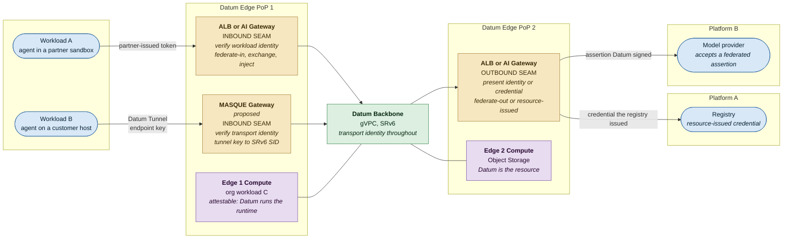
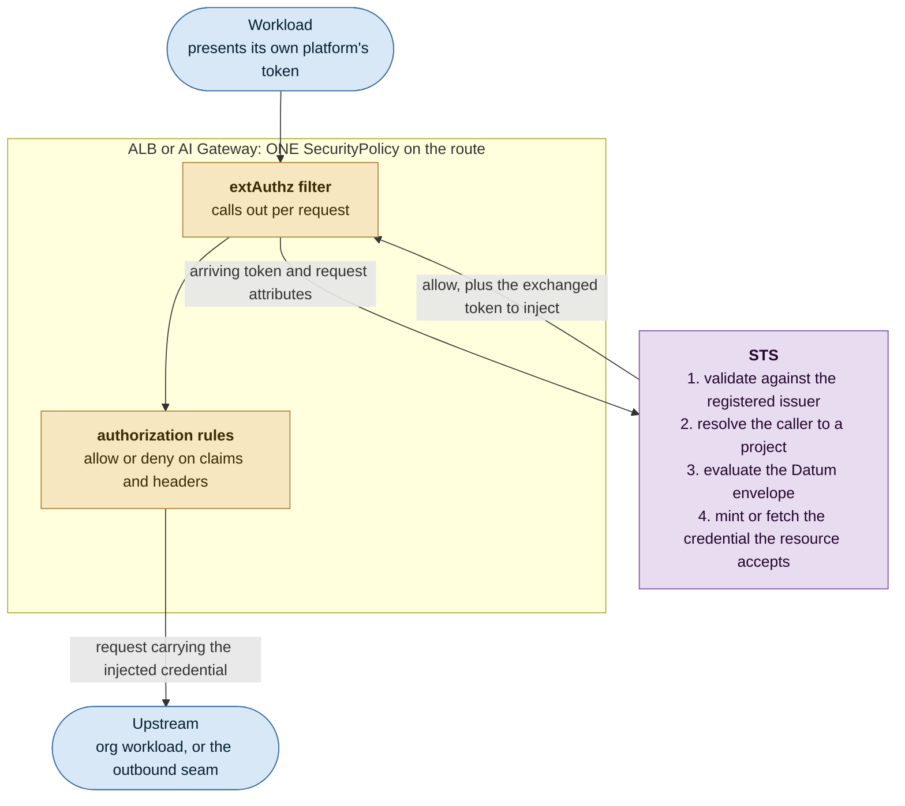
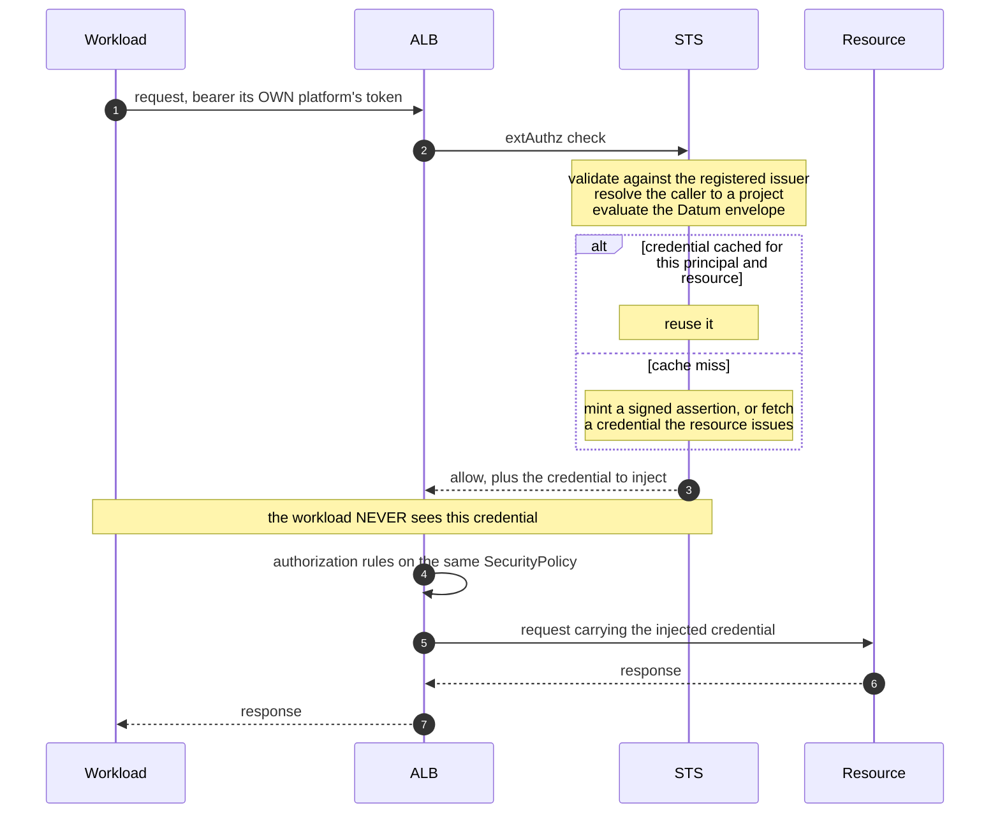
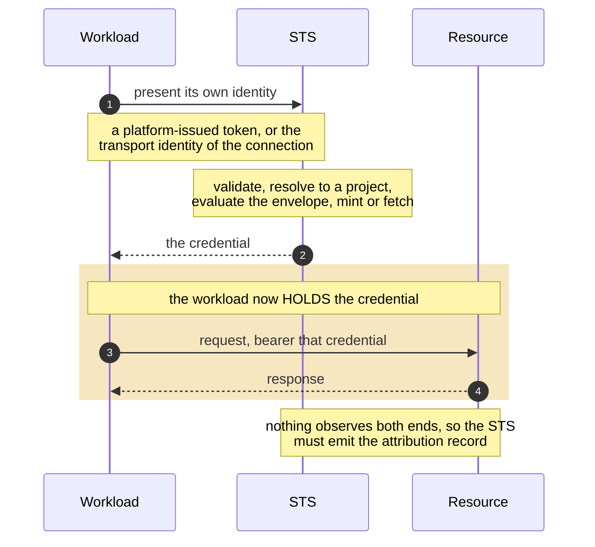

<!-- omit from toc -->
# Data-Plane Workload Identity

**Covers** use cases W4, W5 and W7 of the workload identity use-case map.

<!-- omit from toc -->
## Contents

- [Summary](#summary)
- [TL;DR](#tldr)
- [Motivation](#motivation)
  - [Current Gaps](#current-gaps)
  - [Goals](#goals)
  - [Non-Goals](#non-goals)
- [Proposal](#proposal)
  - [The end-to-end picture](#the-end-to-end-picture)
  - [User Stories](#user-stories)
  - [Notes, Constraints and Caveats](#notes-constraints-and-caveats)
  - [Identity](#identity)
  - [Authentication](#authentication)
  - [Authorization](#authorization)
  - [Audit](#audit)
  - [Requirements](#requirements)
- [Design Alternatives](#design-alternatives)
  - [Option 1: inject at the seam](#option-1-inject-at-the-seam)
  - [Option 2: hand the credential to the workload](#option-2-hand-the-credential-to-the-workload)
  - [Option 3: authorize at connection establishment](#option-3-authorize-at-connection-establishment)
  - [Coverage](#coverage)
- [Resource Abstractions for distributed instantiation and scale](#resource-abstractions-for-distributed-instantiation-and-scale)
  - [IdentitySet](#identityset)
  - [Policy](#policy)
  - [Where membership comes from](#where-membership-comes-from)
  - [How a set is instantiated at a seam](#how-a-set-is-instantiated-at-a-seam)
- [Open Questions](#open-questions)

---

## Summary

Agents, sandboxes and other workloads connect across the Galactic VPC (gVPC) to other workloads and hosted
resources (such as compute, registries, LLM platforms) attachments in a variety of ways including 
via ALBs, AI Gateways and Datum Tunnels. Many of these workloads might be ephemeral and/or hosted 
in partner infrastructure (with associated IdP integrations and policy associations).

At the inbound seam that the workload attaches to, it may present an identity for verification. 
At the outbound seam if a resource being accessed is outside Datum, the resource might require an 
identity or credential for access. The gVPC would transport the flow between these seams. 

Today each is configured independently, verifies a different thing, and produces no consistent record 
across the fabric. Furthermore, an agent or sandbox acting on behalf of a human user presents that human 
user's own credential at full scope. Current IAM controls such as SecurityPolicy attachments to HTTPRoute 
at the ALB are coarse, and focused on human identity and auth rather than workload identity, federation, 
resource/credential CRUD and time or task bound delegation.

This PRD categorizes dataplane workload Identity and Auth scenarios and presents architectural approaches and
abstractions for distributed instantiation and scale while enabling BYO-IdP and BYO-Policy for service
providers and organizations. The architectural intent is to also enable pluggability, when appropriate, of
token exchange and agentic delegation standards yet to see widespread adoption.

---

## TL;DR

**The framing.** A request crosses an **inbound seam**, where Datum verifies what the workload presents,
and an **outbound seam** where the accessed resource is outside Datum and requires an auth token or
credentials. Identity might be **Transport identity**, established by the connection and available on every
Datum-carried paths, and possibly also **Workload identity** such as a token if one was issued at
authentication exchange points.  Authentication is what each seam verifies, authorization is the decision
at the seam, audit is emitting and correlating both, and delegation and time bounds are properties of the
identity being issued.

**Why it must be automatic.** Workloads attach instantly and at scale, across a fleet of edge clusers 
and often task-specific/ephemeral. Nothing requiring an operator to register a principal, or an organization to
integrate per workload, survives that. Identity has to come from something that already happens: the
connection, an attestation the runtime makes, or an exchange of a token the workload's platform already
issued.

**Resource Abstractions** A route accepts one policy object tiered across platform, service provider and
organization rulesets, applied on a set of potentially ephemeral workloads with varying inbound identity
attachments. An **IdentitySet resource** names a group of principals by match rules across both identity
kinds, while a **Policy resource** binds a set to actions on a target, and a controller renders these into
the seam's object ahead of the request.

**Three credentialing alternatives, which combine rather than compete:** inject at the seam, best wherever 
an HTTP seam exists because nothing is outstanding to revoke; hand the credential to the workload, which 
covers every scenario; and authorize at Datum tunnel establishment at MASQUE-gateway, but **unavailable today**.

**Additional clarity needed** Transport identity is the intended floor and three of its four pieces exist.
The fourth, a component that authenticates an arriving connection by the peer's key, does not. Until
aligned with the galactic and tunnel teams, the tunnel path has a registered binding rather than a verified
identity, and the third alternative has nothing under it.

---

## Motivation

### Current Gaps

| | Consequence |
|---|---|
| **Transport identity carries no project.** A tunnel endpoint key is unforgeable and names an endpoint | Datum cannot authorize on it without a separate binding |
| **Workload identity reaches the edge only as per-route configuration.** A project's ALB policy may validate bearer tokens from an issuer it names, API keys, basic auth or browser sign-in, and may authorize on claims. It may not call an external decision service | Each route trusts its own issuers and secrets, and nothing exchanges, delegates or attributes the caller across routes. The one hook that could, external authorization, is closed to projects |
| **The outbound seam uses one credential for all organizations** where a resource is reached under a credential Datum holds | The resource sees one identity. Neither side can say which organization acted |
| **Nothing expresses delegation.** An agent presents its invoker's credential | No distinct identity to attribute to, and no reduction of authority |
| **Nothing bounds authority to a unit of work** | Lifetime is a guess about work whose end is knowable |

### Goals

1. One identity model across every path Datum carries, configured once rather than per path.
2. Verify identity at the inbound seam whether it arrives as transport identity, workload identity, or
   both.
3. Exchange for identity/credential at the outbound seam that the resource can attribute to an organization
   or workload.
4. Express delegation, with authority strictly narrower than the delegating principal's.
5. Bound authority by time and scope on every request.
6. Let an organization or service provider plug in their own policy model, inside governing platform
   policies.
7. Attribute every action to an organization, in a record that survives crossing an organizational
   boundary.
8. Avoid long-lived secrets in workloads hosted at third-party systems.

### Non-Goals

1. Task-bound authority. Specified in [Task-bound access](#task-bound-access) - deferred.
2. Agent-to-agent delegation chains of arbitrary depth, or fully autonomous agents with no human principal
   - deferred.
3. Datum initiating an agent that acts on a customer's behalf. Its consent requirements are distinct.
4. Operating an identity provider on a partner's behalf.

---

## Proposal

### The end-to-end picture

Every request in scope has the same shape. A workload crosses an **inbound seam**, where Datum verifies the
identity it presents. It rides the **backbone**, which carries transport identity end to end. It crosses an
**outbound seam**, where Datum presents an identity or credential the resource accepts.

```
(Workload) --- Inbound seam --- Backbone (gVPC) --- Outbound seam --- (Resource)
                federate-in                          federate-out
```

Where the seams sit, and what each one has to work with, depends on the path. The topology below shows
both seams in one picture: two Datum Edge PoPs joined by the backbone, external workloads entering at one
and external resources reached from the other, with Datum-hosted compute at each.



Four things the picture carries.

1. **Two kinds of inbound seam, verifying two kinds of identity.** Workload A presents a token at the ALB.
   Workload B presents only an endpoint key, and the proposed MASQUE Gateway would see the connection itself.
2. **The backbone carries the flow, not the caller.** A Segment Routing over IPv6 (SRv6) Segment Identifier, 
   or SID, steers the packet and says nothing about who sent it. Identity is established at the seams.
3. **An outbound seam where the resource is outside Datum**, and each such resource is its own trust domain: 
   Platform A accepts only credentials it issued, Platform B validates an assertion Datum signed. One outbound 
   seam therefore federates into several trust domains at once, which is why the subject format is a contract 
   with more than one party.
4. **Datum-hosted compute is a place attestation is available**, because Datum operates the runtime.
   Workload C needs nothing provisioned to it; workloads A and B are outside that boundary.

### User Stories

The scenarios in scope differ only in which seam components are in the path and what identity is available
at each.

| | Workload | Inbound seam | Outbound seam | Resource |
|---|---|---|---|---|
| **S1** | Agent in a partner sandbox | ALB | Credential the registry issues | Container registry Datum offers |
| **S2** | Agent in a partner sandbox | AI Gateway | Federated assertion or held credential | Model provider |
| **S3** | Agent anywhere | Datum Tunnel to the MASQUE Gateway, proposed | None. The resource is inside the virtual network | Service in the project's virtual network |
| **S4** | Customer's own agent | Datum API | None. Datum is the resource | Datum control-plane resource |
| **S5** | Org workload | ALB, or Datum Tunnel to the MASQUE Gateway | None. Both ends are the project's | Another workload in the same project |
| **S6** | Org workload on Datum compute | Datum API | None. Datum is the resource | Datum control-plane resource, provisioned by the workload for itself |

S4 and S6 reach the control plane. They are in scope because a workload's task crosses the boundary
within one unit of work: it provisions through the Datum API, then reaches a resource through the data plane.

**S6 is the one case where Datum operates the runtime**, so it is the only scenario in which attestation
is available and nothing has to be provisioned to the caller at all. It is drawn as workload C on Edge 1
Compute in the topology above. It differs from S4 in mechanism rather than in destination: S4's caller runs
somewhere Datum does not control and must be federated in, while S6's caller can be attested.

### Notes, Constraints and Caveats

Three properties of the platform bound every alternative below.

**One `extAuth` and one `authorization` block per rendered policy.** An ALB route takes a single
`SecurityPolicy`, and although a route-level policy can merge into a Gateway-level one, `extAuth` and
`authorization` are each a single object. So one rendered policy makes one external call and runs one
authorization filter. Datum must therefore own the object that is enforced and render it from
resources that service providers and organizations write, one reason why
[Resource Abstractions for distributed instantiation and scale](#resource-abstractions-for-distributed-instantiation-and-scale) exists.

**Configuration propagates to edge locations; identities do not.** Issuer registrations, match rules,
identity sets and policy rules are authored centrally and distributed ahead of the request, and scale with
the projects that own them. Anything scaling with principals, sessions or tasks cannot be distributed that
way and must be resolved where the request is handled.

**A project holds what this document governs; an organization is accountable for it.** An organization
contains projects, and a project contains the workloads and virtual networks. So anything bound to a
network, such as transport identity, a `Connector` or an identity set, is scoped to a project. Anything
about who is accountable or audited belongs to the organization, and a project always identifies its
organization, so a record that carries the project can be attributed to it.

### Identity

#### Transport identity

**The intent.** Every flow Datum carries should be attributable to a registered endpoint without the
workload holding a credential, established by the connection before any payload flows. An organization gets
an identity on the tunnel path without integrating anything.

| | |
|---|---|
| **What it would be** | A tunnel endpoint key bound to the workload, resolved to a project when the connection is accepted |
| **How it would be proven** | The connection itself. No issuer, no key-set fetch, no expiry |
| **Granularity** | The key terminates in the workload rather than the host, so two workloads on one host are distinguishable |
| **What it does not carry** | Which project it belongs to, or what the workload may do. A control-plane record supplies that |

**Three of the four pieces exist.** A `Connector` registers an endpoint and holds its key; the key reaches
edge clusters; the object is propagated and label-selected, so a project binding can hang on it. **What
does not exist is a component that authenticates an inbound connection by that key.** The key's own field
comment reads "the public key to dial and connect to", and the edge writes it into tunnel metadata to reach
a destination. That is the far end of an outbound connection, not an assertion by an arriving caller. The
SRv6 SID does not fill the gap either: it is assigned per destination pod and carries nothing about the caller.

> **So the tunnel path today has a registered binding rather than a per-connection proof.** The gap is one
> component and it is [Q1](#open-questions). Until it closes, a design must not assume a verified inbound
> key.

#### Workload identity

A token (or cert) assigned to the workload via workload attestation or workload authentication, when
possible. A sandbox on a partner platform may carry a token its platform issued, or nothing at all.

| | |
|---|---|
| **What it is** | An ID token or access token from an issuer, or a token obtained by exchange for access to a Datum or external resource |
| **How it is proven** | Signature against the issuer's key set, then audience, claims and expiry |
| **Who must be trusted** | The issuer |
| **Granularity** | Whatever the issuer's subject encodes. Platforms that issue workload tokens encode tenancy in a structured subject |
| **What it carries that transport identity cannot** | Audience, scope, expiry, and a claim naming a delegate |

#### The two together

| | Transport identity | Workload identity |
|---|---|---|
| Available | Intended everywhere Datum carries the traffic. Not yet proven inbound on the tunnel path | Where an issuer exists |
| Answers | Which endpoint, and by binding, which project | Which principal, with what scope, acting for whom |
| Verification cost | None beyond the handshake | A key-set fetch, cached |
| Revocation | Withdrawing authorization can close a live connection | Bounded by the token's lifetime |

Transport identity is the intended floor, because it is the only kind available without the workload
integrating anything. Workload identity carries everything the floor cannot express. Some flows
transit the Datum backbone with no attestation or authentication seam to assign a workload identity, and
those flows are exactly the ones the floor is meant to cover.

#### Obtaining a workload identity where none arrives

Three mechanisms, in order of preference.

| | Mechanism | Available when |
|---|---|---|
| **1** | **Attestation.** The runtime asserts what it is running against a selector, and the workload holds nothing | Datum operates the runtime. Nothing is registered per workload, so it fits ephemeral callers |
| **2** | **Issued against transport identity.** The inbound seam has already verified an unforgeable key, so a token can be minted for the bound project | The path has transport identity, which is every Datum-carried path |
| **3** | **Injected by the platform at creation.** The partner obtains a Datum credential scoped to one sandbox and one organization, and places it in the environment | The partner will do the work. The partner is the only party that knows the organization at creation time |

#### Federate-in: a workload identity arrives, but Datum did not issue it

A workload in a partner sandbox usually carries a token its own platform issued. That token identifies the
workload to its platform and means nothing to the resource behind Datum.

Federate-in is the exchange. The seam validates the arriving token against an issuer registered for a
project, resolves its claims to one of the projects that registered it, and obtains a token the resource
accepts. The partner's token is never presented to the resource, and no Datum credential is stored in the
sandbox. The sequence is drawn under [Option 1](#option-1-inject-at-the-seam).

#### Time-bound access

Lifetime and scope are set by Datum at issue time, never requested by the caller. Lifetime should be the
shortest value the work tolerates, without excess load on controllers required for metadata coordination
(if required).

For a credential handed to a workload, revocation latency is the lifetime, because nothing else is
outstanding to withdraw. Two mechanisms hold nothing outstanding and are therefore not bounded that way:
a credential injected at a seam, where ending access is declining to issue the next one, and
connection-time authorization, where withdrawal can close a live connection.

#### Task-bound access

Authority that ends when the work completes rather than when a clock runs out. This is the bound agentic
callers actually want, because cancelling the work should stop every credential derived from it at every
depth of delegation.

Three things would have to exist.

1. A task identifier and an object whose existence means the work is live. Nothing in the platform
   represents a task today.
2. A liveness check at the moment of use, with no call to a distant service on the request path.
3. A rule for how a task propagates through delegation.

**Example.** The STS issues a token on behalf of a workload and the ALB caches it for the
life of the task rather than for a fixed period. Each request reuses the cached token, so the workload
never holds one. On task completion, cancellation, or an emergency shut-off, the cache entry is purged and
the next request has nothing to present.

Deferred, because liveness is state that grows with concurrent tasks rather than with projects. It cannot
be distributed ahead of the request and must be resolved where the request is handled, which holds only
while the work stays in one location. Credential injection makes the deferral temporary: where nothing is
handed out, ending a task becomes an admission question and the next request is simply not issued a
credential. What is missing is the task object rather than the enforcement.

#### Delegation

One principal acting on another's authority, which is what distinguishes this from workload identity. It
places a demand on each axis: two principals named in one request, the relationship carried as a signed
claim rather than inferred, the delegate's authority a proper subset of the delegator's, and both
principals in the record.

Two mechanisms, and they compose.

| | What it does |
|---|---|
| **Scope step-down** | The delegate's token carries a strict subset of the delegator's scope and a shorter lifetime. Enforced at the resource, in a vocabulary it already understands |
| **Custom claim injection** | The token carries a claim naming the delegate alongside the subject naming the principal. Makes the relationship visible to authorization and audit |

**Where each applies is decided by the plane.** At the control-plane API the subject is reserved for a
principal the control-plane decision point can authorize, so delegation must ride a separate claim. At a
data-plane seam the subject belongs to the target, so at a federating target the delegate can be named in
the subject itself, and at a resource-issued target it cannot be named at all and attribution falls to
Datum's record.

**Absence must deny, where absence is possible.** Wherever the delegate is carried as a claim beside a
subject that already confers authority, a dropped claim reads as the principal acting directly and grants
more than intended, silently. Naming the delegate **in the subject** removes the failure mode rather than
mitigating it, because a missing delegate then means no valid subject. That is an argument for doing so at
a federating target, and it is unavailable at the Datum API, where the subject is reserved.

**In scope:** a person delegating to an agent, and an agent delegating to code or a sandbox it created,
the second being harder because the delegate did not exist when the delegation began.

**What the conventions give.** The separation of a principal from an actor is converging across every
specification that addresses one party acting for another, it is already carried by an existing RFC, and
Datum's own provider emits a claim of that shape today. Adopt it rather than invent one. **Two things have
no convention to adopt:** delegation that crosses organizational boundaries is an open problem with no solution, 
one reason why agent-to-agent chains are deferred here, and task-bound authority is unclaimed.

### Authentication

Authentication is what each seam verifies. The seams differ in what reaches them.

#### Inbound seams

| Seam | Identity presented | Verified today | Gap |
|---|---|---|---|
| **Datum Tunnel to the MASQUE Gateway, proposed** | Transport identity: the endpoint key | Nothing. No tunnel into a virtual network exists today; a Datum Tunnel ends at the ALB, which dials out to the endpoint's key | The project binding exists as a control-plane record. No workload identity is derived, and no per-request decision point exists |
| **ALB** | Workload identity in the request | Whatever the project configures on the route: browser sign-in, basic auth, an API key, or a bearer token from an issuer it names | External authorization, which an exchange needs, is not permitted in a project's policy, and issuer trust is set per route rather than registered once |
| **AI Gateway** | Workload identity in the request | Same gateway technology as the ALB, so the same options and the same gap | As above. What differs is the outbound seam, not this one |
| **Datum API** | Workload identity: a token Datum's provider issued | Token introspection at an authentication webhook | A token from any other issuer is refused, and nothing reaching the decision can name a delegate |

The ALB and the AI Gateway are similar components with different upstreams, selection criteria and
credential brokering. Listed separately because the outbound seam behind them differs, not necessarily
because of the inbound seam.

#### Inside the ALB seam

The ALB seam is a filter chain on one `SecurityPolicy`, plus the **STS** it calls: a security token
service that validates, maps, decides and mints for every seam.



**Issuer trust is shared with the control plane; the mapping is not.** A project registers its own issuer,
or enables one Datum pre-registers, using the same `TrustedIssuer` and `WorkloadIdentityIssuer` resources
the federation design defines. Those resources answer which signatures to accept and where the key set is,
which is the same question on both planes. **What does not transfer is that design's rule for resolving a
matched token to a principal**, because it resolves to a control-plane principal and no data-plane seam can
key on one. Here the equivalent step resolves the caller to a project, and what it may do comes from the
policy the seam already holds.

**Nothing at request time expands an identity set.** Membership is reconciled by a controller and rendered
into the seam's policy object ahead of the request. The STS validates and maps; it never enumerates a set.

**The STS presents an HTTP external-authorization front door.** The field that declares which
authorization-response headers are added to the request exists only on the HTTP `extAuth`, and
injecting the exchanged token is exactly that field.

**Two layers of authorization, and only two.** The STS evaluates the Datum envelope while it holds the
request; the `authorization` rules on the same policy evaluate the organization's tier. `extAuth` and
`authorization` are each a single object, so one rendered policy makes one external call and runs one
authorization filter.

**One edge is unverified:** whether the `authorization` rules can match on anything the STS returned. If
they cannot, both tiers evaluate inside the STS. See [Open Questions](#open-questions).

#### Outbound seam

What the resource accepts determines what must be presented.

| | Federate-out | Resource-issued | Shared credential |
|---|---|---|---|
| The resource | Trusts an external issuer and validates a signed assertion | Accepts only credentials it created | Accepts one credential Datum holds |
| So Datum must | Sign an assertion. A pure function | Create an object in the resource, then obtain a credential for it | Substitute. Nothing is issued |
| Provisioning happens | Once per organization, at onboarding | Once per session | Never |
| Cost per request | A signature | A durable object in someone else's system | None |
| Can the resource tell organizations apart? | Yes | Yes | No. It sees one identity for all |

**Federate-out is the target state.** It requires Datum to be an issuer: publish metadata and a key set,
and sign assertions carrying a subject the resource's rules can match. Some resources accept a static key
set supplied at configuration time, in which case Datum has no reachability obligation, at the cost of
rotating by updating every relying party.

**Resource-issued credential is the hard case**, because an object must exist in the resource before an ephemeral
caller can act. Where the resource cannot federate, this is unavoidable and the object must be created at
session rate and reclaimed.

**A shared credential is a mode to migrate off.** Its blast radius on compromise spans every organization
and it forecloses attribution at the far end permanently.

#### Where the credential is delivered

| | Injected at the seam | Handed to the workload |
|---|---|---|
| The workload | Never sees a credential | Holds one |
| Requires | A seam component in the request path | Nothing |
| Ending access | Decline to issue the next one | Revoke something outstanding |

This follows from the client's protocol and the path. Where no seam component sits in the path, the
credential must be handed over. Where the client's protocol reveals identity only after a challenge, as a
registry pull does, the client must hold a credential to answer the challenge.

### Authorization

Authorization turns the authenticated identity into an action, and it runs at the seam.

**The action is not limited to allow or deny or drop.** A seam that has already identified the caller can
apply any identity-keyed treatment: redirect, mirror or shadow the traffic, rate-limit per organization, or
apply a quality-of-service class.

**Residency is an input to the policy model.** Where an organization's traffic carries a residency or
sovereignty obligation, the rule permitting it may depend on where the request arrived and where the
resource sits, so the model has to express that as a condition rather than leave it to deployment.

#### The decision is a chain, and every tier may only narrow

| Tier | Who writes it | What it expresses |
|---|---|---|
| **1. Datum envelope** | Datum | Service providers, and the organizations they serve, cannot reach each other's resources except where tier 2 grants. Resource and rate ceilings hold. Anything Datum is accountable for |
| **2. Service provider policy** | The service provider | Which of its consumer organizations may reach which of its resources |
| **3. Organization policy** | The consumer organization | Which of its principals may reach which resources, with what actions |
| **4. Delegation** | The principal | What the agent it invoked may do on its behalf |

Each tier may only narrow the tier above it, and every tier must permit. That is one rule applied at each
hop, so the depth is not fixed: an organization that nests project policy inside its own inherits the same
behaviour without a change to the model. Today Datum is the only service provider, so it writes tiers 1
and 2. The model keeps them separate because the platform is designed to host other service providers,
and four tiers is a starting point rather than a limit.

The tiers have different writers, review paths and blast radii, but they cannot be separate policy
objects: see [Notes, Constraints and Caveats](#notes-constraints-and-caveats). Datum owns the object that
is enforced and renders it from the resources in
[Resource Abstractions for distributed instantiation and scale](#resource-abstractions-for-distributed-instantiation-and-scale).

#### Pluggable policy model and tiering

An organization or service provider may bring its own decision point. The seam calls it and enforces the
answer, carrying the authenticated identity and the request attributes. Datum's envelope is evaluated by
Datum regardless, so a decision point they bring can narrow access and can never widen it.

This makes the policy model a configuration choice per organization rather than a platform decision, which
matters because authority is written at four levels: Datum, a service provider, its consumer
organization, and that organization's users and agents.

### Audit

Identity is available wherever a seam established it. Audit is therefore emitting and correlating, not
recovering something lost in transit. On the tunnel path what exists today is the registered binding rather
than a verified inbound identity, so the record there is only as strong as Q1's answer.

| Emitted at | Record |
|---|---|
| **Inbound seam** | Which identity arrived, how it was verified, which project it bound to, and the decision |
| **Outbound seam** | Which credential was presented, for which organization, to which resource |
| **The resource** | Its own record, naming the identity Datum presented |

Two properties make the record useful across an organizational boundary. **A correlation key**: the
identity Datum presents outbound must be reconstructible from Datum's own record so the two logs join, and
where Datum creates an object in the resource, encoding the organization in its name makes the join
deliberate. **And delivery to the consumer-facing observability path**, identity-enriched, because a log
line alone does not answer the question.

**Regulatory and organizational compliance.** Sovereignty and residency obligations apply to the
authorization decision and the audit record, not only to the payload. Both are records about a person or a
workload, so placing a workload does not place either of them.

### Requirements

#### Identity requirements

| | |
|---|---|
| **ID1** | Bind transport identity to a project on every path that carries it |
| **ID2** | Accept workload identity from many issuers, with issuer trust as data rather than code |
| **ID3** | Obtain a workload identity for a caller arriving without one: by attestation where Datum operates the runtime, by exchange elsewhere |
| **ID4** | Admit a principal that did not exist at configuration time without creating a durable object for it. Where one must be created, reclaim it without observing the caller's completion |
| **ID5** | Carry a claim naming the delegate alongside the subject, and enforce that the delegate's scope is a proper subset of the delegator's |
| **ID6** | Set lifetime and scope at issue time, decided by policy |

#### Authentication requirements

| | |
|---|---|
| **AN1** | Verify transport identity at the Datum Tunnel to MASQUE Gateway seam, and workload identity at the ALB, the AI Gateway and the Datum API |
| **AN2** | Permit the external-authorization call on the ALB and AI Gateway policy that Datum renders. A project's own policy may not make one today |
| **AN3** | Federate out: publish issuer metadata and a key set, and sign assertions a resource can validate and attribute to an organization |
| **AN4** | Support both delivery forms. No single one covers every path |
| **AN5** | Validate the audience at every seam, and carry the scope and the delegate claim through to the decision where present |
| **AN6** | Obtain a credential the resource itself issues where it cannot federate, created at session rate and reclaimed. Creating one needs the resource's administrative credential, so it is minted centrally, never at an edge location, and cached so the mint is not on every request |

#### Authorization requirements

| | |
|---|---|
| **AZ1** | Every tier must permit and may only narrow the tier above. All tiers render into the one enforced object, from a resource Datum owns |
| **AZ2** | Support a decision point supplied by an organization or service provider, which can narrow access and cannot widen it |
| **AZ3** | Express authority across Datum, a service provider, an organization and delegation, without assuming the depth is fixed at four |
| **AZ4** | Decide access at the location handling the request, with no synchronous call to a distant control plane for the decision, within a published per-request budget. Obtaining the resource's credential is not part of the decision |
| **AZ5** | Fail closed, and pin it rather than inherit it: set the external-authorization fail-open flag explicitly, and treat a missing expected claim as a denial |
| **AZ6** | Express actions beyond permit and deny. A seam that cannot apply one rejects the policy rather than ignoring the action |

#### Audit requirements

| | |
|---|---|
| **AU1** | Answer which organization performed an action, from the target's record or from Datum's |
| **AU2** | Make the outbound record joinable to the resource's own log by a key Datum controls |
| **AU3** | Deliver the record to the consumer-facing observability path, queryable by organization and by principal |
| **AU4** | Name both principals on a delegated request |
| **AU5** | Keep the authorization decision and the audit record in the jurisdiction the traffic is subject to |

#### Cross-cutting requirements

| | |
|---|---|
| **GEN1** | Add no long-lived secret to a workload or a third-party system |
| **GEN2** | Revoke within a published bound. For a vended credential that bound is its lifetime |

---

## Design Alternatives

The seams are fixed by the architecture. What is open is where the component that verifies, decides and
issues actually runs. Three alternatives, and they combine rather than compete.

### Option 1: inject at the seam

The seam calls the STS during request handling. The STS verifies the inbound identity, decides, obtains a
credential for the resource, and the seam injects it upstream.



**Gets right.** The workload never holds a credential, so ending access is declining to issue the next one.
Both ends of the mapping exist in one place, which is where AU1 and AU2 are satisfied. The ALB, as a proxy,
replaces the client's address, so identity policy has to be evaluated at or before it in any case.

**Costs.** Covers only paths with an HTTP seam, so it does not serve S3. The default processing order runs
the external call before token validation and before policy evaluation, so a credential can be issued for a
request that is then denied; having the STS evaluate the envelope itself removes that dependency.

**Not available at the MASQUE Gateway**, which is proposed rather than built. The component that assigns
the SID has no reference to the object holding the endpoint key, and the SID identifies a destination
rather than a caller. Making that gateway a seam is [Q1](#open-questions), not a choice available here.

### Option 2: hand the credential to the workload

The workload calls the STS, receives a credential, and presents it itself.



**Gets right.** The only alternative that works where no seam sits in the path, and where the client's
protocol reveals identity only after a challenge.

**Costs.** The workload holds a credential, so lifetime becomes the primary control, and attribution must
be emitted deliberately because nothing observes both ends. **This is not required for federate-out**,
which is about what Datum presents rather than who holds it; it becomes necessary only when Datum is not in
the path at the outbound seam.

### Option 3: authorize at connection establishment

**Not available today. It becomes available if Q1 is answered yes.** It is kept here because it is the
only alternative that would give the tunnel path an enforcement point, and because what it needs is one
component rather than a redesign.

On a path whose connection is mutually authenticated, the decision would be made when the connection is set
up, and no per-request credential would exist.

**Gets right.** The strongest revocation property available, because withdrawal can close live
connections. Nothing is issued, so the outbound seam costs vanish. Purpose can be established before any
payload flows.

**Costs.** Applies only to paths whose connection is mutually authenticated, which today means the tunnel
path and nothing else. The endpoint key would prove continuity rather than ownership, so ID1 must still be
satisfied by a binding held elsewhere, and that binding is a registration, so it strains for ephemeral
endpoints. Above all it rests on a component that does not exist: nothing authenticates an inbound
connection by the peer's key, which is Q1.

**What it would look like, S3.** A long-lived agent host runs a Datum Tunnel into a project's virtual
network. The endpoint is registered once and attached to that network. If the MASQUE Gateway checked the
presented key against that attachment at connection establishment, it could admit or refuse the connection
with nothing issued and no credential to expire, and deleting the attachment would close the live
connection rather than waiting for a timeout. The shape fits a durable host; applied to a sandbox that
lives for seconds it would mean registering and reclaiming an endpoint at sandbox rate. **The check in the
second sentence is the part that does not exist.**

### Coverage

| | S1 registry | S2 model provider | S3 tunnel | S4 customer agent | S5 org to org | S6 self-provision |
|---|---|---|---|---|---|---|
| **1** inject at the seam | Only by suppressing the challenge | Yes | No HTTP seam | Yes | Routes (a) and (b) | Yes |
| **2** hand to the workload | Yes | Yes | Yes | Yes | Yes | Yes |
| **3** at connection establishment | No | No | Only if Q1 is yes | No | Routes (c) and (d), only if Q1 is yes | No |

**Option 2 covers every scenario, which makes it the floor rather than the preference.** Option 1 is better
wherever an HTTP seam exists, because nothing is outstanding to revoke, and it shares one implementation
with Option 2 differing only in delivery. Option 3 would bring the best revocation property and covers
nothing today.

**One cost is common to all three.** Every alternative routes through the STS, so it holds the signing
material or the credentials each target accepts, for every organization it serves. The long-lived secret is
not removed; it moves from the organization to Datum and becomes concentrated. What the STS mints
determines what it must hold, and minting something Datum signs needs only a signing key, scopeable per
deployment and revocable in one place.

**S5 is four routes, and two have nowhere to enforce.** Routes (a) and (b) reach the peer through the ALB,
directly or through a tunnel terminating on it. Routes (c) and (d) would both attach through the proposed
MASQUE Gateway, and differ only in what sits at the far end: another partner location in (c), a resource
inside the Galactic VPC in (d). No authentication component sits there today, so there is nothing to
extend. Those are also the routes Q1 bounds.

**S1 needs vending.** The registry sends no credential on its first request and replies with a challenge
naming the repository and action, so a seam deriving identity from the request has nothing to work with on
request one. Suppressing the challenge and injecting upstream costs deriving scope from the request path,
which makes the filter specific to that protocol.

---

## Resource Abstractions for distributed instantiation and scale

Policy written against individual principals does not scale and does not survive the seam split. The same
principal reaches the ALB as a token claim and the MASQUE Gateway as a registered endpoint key, so a rule
naming it once has to be written twice, in two vocabularies, in two places. Two resources address that: an
**IdentitySet** that names a group of principals by the ways they can be recognised, and a **Policy** that
binds an idSet to the policy rules.

### IdentitySet

A named group whose membership is given by **match rules**, not by a list. A set may mix identity kinds.
Both resources are namespaced to the project; a deployment names project namespaces `project-<id>`.

```yaml
apiVersion: iam.miloapis.com/v1alpha1
kind: IdentitySet
metadata:
  name: agent-researcher-sandboxes
  namespace: project-blue
spec:
  members:
    # a. workload identity, matched on claims from a registered issuer
    - workloadIdentity:
        issuerRef: { name: partner-a-workload-issuer }
        claims: { sub: agent-researcher, org: customer-x }

    # b. workload identity presented as a certificate
    - certificateSubject:
        uriSAN: spiffe://datum.net/org/customer-x/sa/agent-researcher

    # c. transport identity, matched on the Connector that registers the endpoint key
    - transportIdentity:
        connectorSelector:
          matchLabels: { datum.net/agent-class: researcher }
```

**Why (c) selects on a label rather than on the key.** The endpoint key is the unforgeable identity but
carries nothing. iroh does provide a per-endpoint metadata field, documented as published through endpoint
discovery and never examined by iroh, **so it is asserted by the endpoint itself and cannot be an
authorization input.** Trustworthy metadata is what Datum's control plane records when the endpoint is
registered, so a set selects on labels of that object.

### Policy

Binds an idSet to actions on a target.

```yaml
apiVersion: iam.miloapis.com/v1alpha1
kind: Policy
metadata:
  name: researcher-sandboxes-may-call-inference
  namespace: project-blue
spec:
  subject:
    identitySetRef:
      namespace: project-blue      # namespaced: a Policy may reference a set in another project
      name: agent-researcher-sandboxes
  actions: [create, read, update, delete]
  target:
    externalResourceRef: { name: model-provider-b-inference }
  effect: Allow
```

The reference carries a namespace because a set and the policies using it need not be authored by the same
party: a service provider may define a set that a consumer organization references, which is the tier chain
expressed in the resource model rather than only in prose. Where one policy should cover several sets, a
label selector scoped to a namespace serves in place of a name.

### Where membership comes from

Transport membership is not authored by hand. Creating a Datum Tunnel and attaching it to a virtual network
is a control-plane operation: a `Connector` registers the endpoint and holds its key, and a
`ConnectorAttachment` binds it to a VPC. Both carry the labels a set selects on, set where the organization
creates everything else. `Connector` ships today; `ConnectorAttachment` is specified in the MASQUE Gateway
design proposal and this document aligns with it rather than asserting it exists.

**A controller resolves each set's selector against those labels and renders the result into the seam's
policy object, ahead of the request.** The distribution channel already exists and already carries these
objects.

<details><summary>How the channel carries them, and one operational cost</summary>

The edge propagation policy selects `Connector` alongside the gateway's own policy and route objects, and
stamps each propagated copy with the project it came from. Karmada does not propagate the status
subresource, and the platform works around that by mirroring upstream status into an annotation it does
propagate, so the endpoint key reaches edge clusters.

Adding a new kind to that channel is an edit in two repositories, because the policy is kept in sync by
hand with the operator's own copy.

</details>

### How a set is instantiated at a seam

An IdentitySet is not evaluated at request time. It is **expanded when the seam's enforcement object is
rendered**, and what it expands into differs by member kind and by seam.

| Member kind | Rendered into an Envoy `SecurityPolicy` | Rendered into a MASQUE Gateway policy |
|---|---|---|
| **a. Workload identity claims** | A claim matcher. One expression regardless of how many principals match | Not expressible today. Whether a token on the tunnel request could change that is [Q1](#open-questions) |
| **b. Certificate subject** | A matcher on the validated subject | A matcher, where the gateway terminates the certificate |
| **c. Transport identity** | Not expressible. The ALB does not see the endpoint key | Resolved by the control plane into the set of endpoint identifiers the selector currently matches |

> **The asymmetry is the honest finding, and it has to be stated rather than smoothed over.**
> Members (a) and (b) expand into a **rule**, so the rendered object is the same size whether ten
> principals match or ten thousand. Member (c) expands into a **list**, because the gateway matches on
> concrete endpoint identifiers. That list is bounded by how many endpoints are registered, which is
> registration cardinality rather than session cardinality, so it does not grow with traffic. It is
> still a list, and an identity set whose transport membership churns at sandbox rate would violate the
> rule that configuration propagates and identities do not.

---

## Open Questions

<details><summary>Q1. Is a peer's endpoint key authenticated when a Datum Tunnel connection is accepted, and is the result available to anything that could act on it?</summary>

For the galactic and Tunnel teams. Three of four pieces exist: the key on a `Connector`, a channel carrying
it to edge clusters, and an object to bind a project to. Missing is a component that authenticates an
arriving connection by that key; today the key is used in the other direction, to dial a destination. **If
the inbound key is authenticated and the result discarded, the ask is to surface it. If inbound connections
are not authenticated by peer key at all, that is a larger request and those teams should say which.**

**A second part:** the MASQUE Gateway proposal carries a tunnel as an HTTP CONNECT-IP request, and an
HTTP request can carry a bearer token. Could the gateway verify workload identity at connection
establishment as well as the key?

</details>

<details><summary>Q1a. Is the endpoint key discovered or asserted?</summary>

It resolves through a DNS lookup. If the record is published by the endpoint, the key is self-asserted and
is trustworthy only where something binds it to the object that registered it. **This decides whether the
floor is reachable, not merely whether it is built, so answer it before Q1.**

</details>

<details><summary>Q1b. Could a project discriminator travel in the transport itself?</summary>

The SID is assigned per destination pod and deliberately never parsed in transit, so changing that asks two
teams to break a written contract. Recorded because it is the only route to identity carried in the
transport rather than beside it, and **it should not be the request that is led with.**

</details>

<details><summary>Q2. Can the `authorization` rules match on a header the external authorization response added, and what happens when it is absent?</summary>

The matching surface exists, the ordering is favourable, and the field is documented as adding headers to
the original client request rather than at dispatch. **Unestablished: where in the filter chain that
mutation lands.** An isolated rig would settle it, asserting on a header the client never sent. If the
answer is no, both tiers evaluate inside the STS, which the design tolerates. A second part is unmeasured:
if a rule keys on a delegate header and that header is absent the rule does not match, so the outcome falls
to the policy's default action. That default has not been checked, and it is the data-plane form of the
absence-must-deny hazard.

</details>

<details><summary>Q3. What is the project binding for transport identity?</summary>

An endpoint is bound to a virtual network. If a project may hold several, that binding does not by itself
satisfy ID1.

</details>

<details><summary>Q4. What string does Datum put in the subject of the assertions it signs?</summary>

The resource matches its own rules against it, so the format decides what a customer can express, and once
customers write rules against it, changing it breaks them. **It is a contract with parties outside Datum
and must be settled before the first assertion is signed.** The federation design carries an equivalent
open decision about its principal identifier; two independently chosen formats would leave customers with
two grammars.

</details>

<details><summary>Q5. If a seam evaluates two layers and authority is written at four levels, where do the other two go?</summary>

Either the STS evaluates every tier except the last, or the rendered object collapses several tiers into
one expression. Different failure modes, and not chosen.

</details>

<details><summary>Q6. What must the policy model express?</summary>

At minimum: subjects named by an identity set, actions beyond permit and deny, conditions on residency and
on request attributes, and the narrowing relationship between tiers. Whether one model serves the ALB, the
AI Gateway and the MASQUE Gateway alike is part of the same question.

</details>

<details><summary>Q7. Can the configuration an edge location needs be served without a call back to the control plane?</summary>

The channel exists and carries what is needed; the request-path behaviour is unproven. **And one thing
about the abstraction is open: whether every membership an organization wants can be written as a rule
rather than enumerated as a list.** A rule propagates; a list scales with principals and does not.

</details>

<details><summary>Q8. What is a task identifier, and what owns it or signals completion/cancellation?</summary>

Required before task-bound access can be built, along with whether completion propagates down a delegation
chain.

</details>
